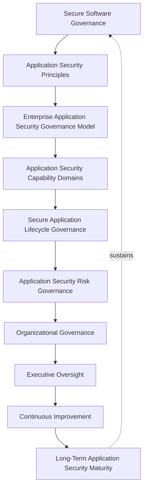
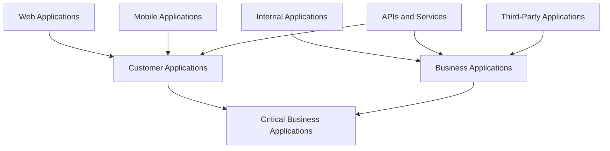
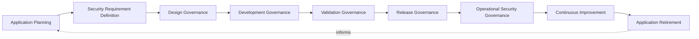
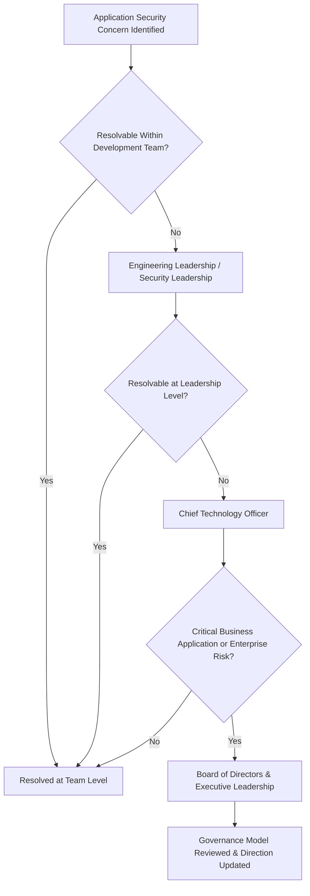
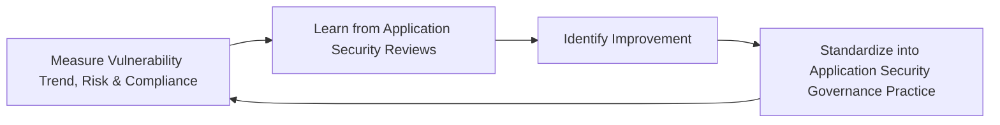
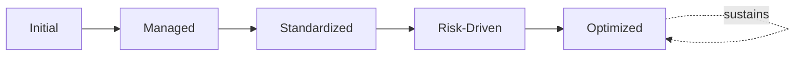

# Enterprise Application Security Framework

## 1. Executive Summary

**Purpose** — This document defines the official Enterprise Application Security Framework for **StackLeo Tech Store**. It establishes secure software governance, application security principles, application risk management, secure development culture, security lifecycle governance, organizational accountability, executive oversight, and long-term application security maturity as a single, consolidated governance reference. `application-security.md` remains the official Enterprise Application Security Strategy — the document that defines application security philosophy and Secure SDLC activities in full operational depth — and its dedicated elaborations `frontend-security.md`, `backend-security.md`, `api-security.md`, and `secure-coding-standards.md` govern each surface in further depth. This framework does not compete with any of them for authority. It is the consolidated governance reference that synthesizes accountability, risk, and executive oversight across every application category and security surface into one coherent document.

**Scope** — This framework applies to every category of application at StackLeo — customer, internal, business, API and service, mobile, web, third-party, and critical business applications — coordinated with `application-security.md`, `security-strategy.md`, and `identity-access-governance.md`.

**Strategic Objectives** — To ensure security is considered from the first design conversation for every application StackLeo builds or operates; that application risk is genuinely understood and proportionately managed; that a genuine secure development culture exists across every engineering team; and that executive leadership has one coherent, consolidated view of the organization's application security posture.

**Business Value** — A consolidated application security governance reference protects the organization from the risk of security gaps hiding in the seams between separately-maintained surface-specific documents, protects the customer-facing experience — the most direct point of customer encounter with StackLeo — from resisting misuse only inconsistently, and gives executive leadership confidence that every application category is genuinely and coherently governed end to end.

**Intended Audience** — The Board of Directors, executive leadership, the Chief Technology Officer, security leadership, engineering leadership, development teams, quality teams, operations teams, compliance teams, and product stakeholders.

## 2. Enterprise Application Security Vision

- **Application Security as Business Protection** — application security is governed as a genuine business protection capability, never merely a technical concern of the engineering function.
- **Secure Digital Products** — every application StackLeo builds is governed to resist misuse and attack as a structural property, not an afterthought.
- **Customer Trust** — application security protects the catalog, cart, checkout, and account experience — where customers directly encounter StackLeo.
- **Risk Reduction** — application security exists to genuinely reduce the organization's exposure to consequential application-layer harm.
- **Software Reliability** — application security protects the dependability of the software the business and its customers rely upon.
- **Business Continuity** — application security protects the organization's ability to keep operating through a genuine application-layer security event.
- **Sustainable Engineering Excellence** — application security is pursued as a durable engineering discipline, never a one-time hardening exercise.

### Enterprise Application Security Vision Matrix

| Vision Element | Focus | Business Value |
|---|---|---|
| Application Security as Business Protection | A genuine business protection capability | Prevents application security from being siloed as purely technical |
| Secure Digital Products | Resisting misuse and attack as a structural property | Prevents security from being treated as an afterthought |
| Customer Trust | Protects the most direct point of customer encounter | Protects the trust relationship every transaction depends on |
| Risk Reduction | Genuinely reducing exposure to consequential harm | Directs investment toward what genuinely matters most |
| Software Reliability | Protects the dependability the business relies upon | Supports confidence in every application-dependent decision |
| Business Continuity | Protects the ability to operate through a security event | Protects revenue and commitments tied to continuous service |
| Sustainable Engineering Excellence | A durable engineering discipline, not a one-time exercise | Protects security investment from eroding over time |

*Diagram 1: Enterprise Application Security Framework — secure software governance establishes principles and the governance model, flowing through capability domains, lifecycle governance, and risk governance into organizational governance and executive oversight, with continuous improvement driving long-term maturity that reinforces governance itself.*

## 3. Application Security Principles

Application security governance at StackLeo rests on nine principles, each producing a specific business outcome.

- **Security by Design** — security requirements are considered from the first design conversation, consistent with `application-security.md` (Section 2). *Business Value:* prevents the disproportionate cost of remediating security after an application is already built.
- **Secure Development Mindset** — every engineer is expected to genuinely understand their role in producing secure software, not to delegate that responsibility entirely to a security function. *Business Value:* protects the organization from the outsized risk a single insecure development decision can introduce.
- **Risk-Based Security** — application security investment is proportionate to a genuine application's risk, not applied uniformly regardless of consequence. *Business Value:* directs limited security resource toward what genuinely matters most.
- **Privacy Protection** — application handling of personal data is governed with the same protective discipline as any other sensitive data, coordinated with `privacy-governance.md`. *Business Value:* protects customer trust and regulatory standing from careless data exposure.
- **Least Privilege** — every application component, service, and integration is granted only the access its genuine function requires. *Business Value:* limits the genuine blast radius of a compromised component.
- **Defense in Depth** — application protection relies on multiple independent layers, so no single control's failure results in full compromise. *Business Value:* protects the organization from a single point of application security failure.
- **Accountability** — every application category traces to a specific, named, responsible owner. *Business Value:* ensures no application drifts without someone genuinely responsible for its security.
- **Transparency** — application security posture and known risk are documented and visible to those who genuinely need them. *Business Value:* allows security posture to be scrutinized and defended, not merely trusted on faith.
- **Continuous Improvement** — application security practice matures over time, informed by real operational and threat outcomes. *Business Value:* keeps security aligned with the organization's growing scale and an evolving threat landscape.

### Application Security Principles Matrix

| Principle | Description | Business Value |
|---|---|---|
| Security by Design | Considered from the first design conversation | Prevents the disproportionate cost of after-the-fact remediation |
| Secure Development Mindset | Every engineer understands their genuine role | Protects against the outsized risk of a single insecure decision |
| Risk-Based Security | Investment proportionate to genuine application risk | Directs limited resource toward what genuinely matters most |
| Privacy Protection | Personal data handled with the same protective discipline | Protects customer trust and regulatory standing |
| Least Privilege | Access limited to the minimum genuinely necessary | Limits the genuine blast radius of a compromised component |
| Defense in Depth | No single control relied upon exclusively | Protects against a single point of application security failure |
| Accountability | Every application traces to a specific, responsible owner | Ensures no application drifts without genuine responsibility |
| Transparency | Posture and known risk documented and visible | Allows security posture to be scrutinized and defended |
| Continuous Improvement | Practice matures from real operational and threat outcomes | Keeps security aligned with scale and an evolving threat landscape |

## 4. Enterprise Application Security Governance Model

Application security governance operates across eight conceptual categories, each holding accountability for a distinct application type.

### Customer Applications

- **Purpose** — govern the security of applications customers directly interact with.
- **Governance Scope** — coordinated with `frontend-security.md` and Customer Trust (Section 2).
- **Business Value** — protects the most direct point of customer encounter with StackLeo.
- **Executive Expectations** — leadership expects customer application security to be held to elevated rigor given direct customer exposure.

### Internal Applications

- **Purpose** — govern the security of applications used internally by StackLeo employees.
- **Governance Scope** — coordinated with `identity-access-governance.md` (Workforce Identity).
- **Business Value** — protects employees and business operations from an internal application compromise.
- **Executive Expectations** — leadership expects internal applications to be governed to the same standard as customer-facing applications.

### Business Applications

- **Purpose** — govern the security of applications directly supporting business operation and revenue.
- **Governance Scope** — coordinated with `01_Business/business-model.md`.
- **Business Value** — protects the applications the business's commercial operation directly depends on.
- **Executive Expectations** — leadership expects business application security to reflect genuine commercial consequence.

### APIs and Services

- **Purpose** — govern the security of interfaces connecting the platform's internal and external components.
- **Governance Scope** — coordinated with `api-security.md` and `05_API/api-governance.md`.
- **Business Value** — protects the integration boundaries every other application category depends upon.
- **Executive Expectations** — leadership expects API security to be governed with the same rigor as any customer-facing surface.

### Mobile Applications

- **Purpose** — govern the security of StackLeo's current and future mobile application channels.
- **Governance Scope** — coordinated with `frontend-security.md` and Customer Applications (above).
- **Business Value** — protects the trust relationship every mobile customer interaction depends on.
- **Executive Expectations** — leadership expects mobile application security to be governed proactively as the channel matures.

### Web Applications

- **Purpose** — govern the security of StackLeo's web-based customer and administrative experiences.
- **Governance Scope** — coordinated with `frontend-security.md` and `backend-security.md`.
- **Business Value** — protects the platform's primary current channel of customer interaction.
- **Executive Expectations** — leadership expects web application security to be held to the highest current rigor in this model.

### Third-Party Applications

- **Purpose** — govern the security of applications and integrations sourced from vendors or partners.
- **Governance Scope** — coordinated with `06_Security/third-party-risk-governance.md`.
- **Business Value** — protects the platform from risk introduced through a dependency StackLeo does not directly control.
- **Executive Expectations** — leadership expects third-party application security to be governed with elevated scrutiny given reduced direct oversight.

### Critical Business Applications

- **Purpose** — govern the security of applications whose failure would carry the most severe genuine business consequence.
- **Governance Scope** — coordinated with `sre-strategy.md` and Enterprise Risk Security (`security-strategy.md`, Section 4).
- **Business Value** — protects the applications the business's continued operation most directly depends on.
- **Executive Expectations** — leadership expects critical business applications to be governed with the highest rigor in this model.

### Application Security Governance Matrix

| Domain | Purpose | Business Value | Executive Expectations |
|---|---|---|---|
| Customer Applications | Govern security of applications customers directly use | Protects the most direct point of customer encounter | Expects elevated rigor given direct customer exposure |
| Internal Applications | Govern security of applications used by employees | Protects employees and operations from internal compromise | Expects the same standard as customer-facing applications |
| Business Applications | Govern security of applications supporting operation and revenue | Protects applications commercial operation depends on | Expects security reflecting genuine commercial consequence |
| APIs and Services | Govern security of internal and external interfaces | Protects the integration boundaries every category depends on | Expects rigor equal to any customer-facing surface |
| Mobile Applications | Govern security of current and future mobile channels | Protects the trust relationship every mobile interaction depends on | Expects proactive governance as the channel matures |
| Web Applications | Govern security of web customer and admin experiences | Protects the platform's primary current interaction channel | Expects the highest current rigor in this model |
| Third-Party Applications | Govern security of vendor and partner applications | Protects against risk from an externally-controlled dependency | Expects elevated scrutiny given reduced direct oversight |
| Critical Business Applications | Govern security of applications with the most severe consequence | Protects applications operation most directly depends on | Expects the highest rigor in this model |

*Diagram 2: Application Security Governance Model — web, mobile, and API surfaces converge into customer applications, while internal, third-party, and API surfaces converge into business applications, with both feeding into the critical business applications requiring the highest governance rigor.*

## 5. Application Security Capability Domains

Application security capability is governed across nine conceptual domains, each requiring a distinct governance emphasis. Remaining implementation independent, these domains describe capability — never a specific control, scanner, or tool.

- **Secure Application Design** — governs whether security is genuinely considered at the point an application is designed, not after.
- **Application Risk Management** — governs how a genuine application-layer risk is identified, weighed, and addressed.
- **Security Architecture** — governs how an application's structural security model coordinates with `security-architecture.md`.
- **Data Protection** — governs how an application genuinely protects the data it handles, coordinated with `data-protection.md`.
- **Identity Protection** — governs how an application genuinely protects the identities interacting with it, coordinated with `identity-access-governance.md`.
- **Application Reliability** — governs how an application's security posture supports, rather than undermines, its genuine reliability.
- **Security Awareness** — governs whether development teams genuinely understand their role in producing secure software.
- **Compliance Readiness** — governs whether an application genuinely and continuously meets its regulatory and contractual obligation.
- **Continuous Security Improvement** — governs how application security capability deliberately matures from real operational outcomes.

### Application Security Capability Matrix

| Capability | Governance Focus | Coordination |
|---|---|---|
| Secure Application Design | Security genuinely considered at the point of design | Security by Design (Section 3) |
| Application Risk Management | Identifying, weighing, and addressing application risk | Application Security Risk Governance (Section 7) |
| Security Architecture | An application's structural security model | `06_Security/security-architecture.md` |
| Data Protection | Genuine protection of the data an application handles | `06_Security/data-protection.md` |
| Identity Protection | Genuine protection of interacting identities | `identity-access-governance.md` |
| Application Reliability | Security posture supporting, not undermining, reliability | `reliability-engineering-framework.md` |
| Security Awareness | Development teams understanding their genuine role | Secure Development Mindset (Section 3) |
| Compliance Readiness | Continuous adherence to regulatory obligation | `compliance-governance.md` |
| Continuous Security Improvement | Capability deliberately maturing from real outcomes | Continuous Improvement (Section 3) |

## 6. Secure Application Lifecycle Governance

Application security governance operates across nine conceptual lifecycle stages, coordinated with the Secure SDLC established in `application-security.md` (Section 3).

- **Application Planning** — govern how a genuine security posture is planned for before an application is designed.
- **Security Requirement Definition** — govern how an application's specific security requirements are defined before development begins.
- **Design Governance** — govern how an application's design is reviewed against its defined security requirements.
- **Development Governance** — govern the oversight applied while an application is genuinely being built, without prescribing the technical method.
- **Validation Governance** — govern how a developed application is confirmed to genuinely meet its security requirements before release.
- **Release Governance** — govern how a validated application is deliberately approved for genuine production release.
- **Operational Security Governance** — govern how an application's security posture is maintained through genuine ongoing operation.
- **Continuous Improvement** — govern how application security practice is deliberately strengthened based on real operational outcomes.
- **Application Retirement** — govern how an application's security obligations are formally closed out when it is genuinely retired.

### Application Security Lifecycle Matrix

| Stage | Governance Objective | Business Value |
|---|---|---|
| Application Planning | Plan for a genuine security posture before design | Ensures security is designed in, not added after the fact |
| Security Requirement Definition | Define specific requirements before development begins | Ensures development is measured against a genuine standard |
| Design Governance | Review design against defined security requirements | Prevents an insecure design from proceeding unexamined |
| Development Governance | Apply oversight during genuine development | Ensures development remains within governed boundaries |
| Validation Governance | Confirm genuine requirement satisfaction before release | Protects against releasing an unverified application |
| Release Governance | Deliberately approve for genuine production release | Ensures release reflects a genuine, accountable decision |
| Operational Security Governance | Maintain posture through genuine ongoing operation | Protects against security decaying after initial release |
| Continuous Improvement | Strengthen practice from real operational outcomes | Keeps practice compounding in capability |
| Application Retirement | Formally close out obligations when genuinely retired | Prevents a retired application from persisting as unmanaged risk |

*Diagram 3: Secure Application Lifecycle Governance — planning and requirement definition inform design and development governance, feeding validation and release governance, with operational security governance, continuous improvement, and application retirement feeding lessons back into the cycle.*

## 7. Application Security Risk Governance

Application-related risk is governed across eight conceptual categories.

- **Application Vulnerability Risks** — the risk that a genuine weakness in an application's design or behavior is exploited.
- **Data Exposure Risks** — the risk that an application exposes data beyond what is genuinely intended or authorized.
- **Identity Risks** — the risk that an application's handling of identity is genuinely compromised or misused.
- **Business Logic Risks** — the risk that an application's business rules are genuinely circumvented or manipulated.
- **Dependency Risks** — the risk introduced through an application's reliance on a component or service StackLeo does not directly control.
- **Compliance Risks** — the risk that an application fails to meet a genuine regulatory or contractual obligation.
- **Operational Risks** — the risk that an application cannot be adequately operated, monitored, or recovered once live.
- **Customer Trust Risks** — the risk that an application-layer failure damages the trust customers place in StackLeo.

### Application Risk Governance Matrix

| Risk Category | Focus | Governance Coordination |
|---|---|---|
| Application Vulnerability Risks | A genuine weakness exploited | Coordinated with Application Risk Management (Section 5) |
| Data Exposure Risks | Data exposed beyond genuine intent or authorization | Coordinated with Data Protection (Section 5) |
| Identity Risks | Identity handling genuinely compromised or misused | Coordinated with `identity-access-governance.md` |
| Business Logic Risks | Business rules genuinely circumvented or manipulated | Coordinated with Secure Application Design (Section 5) |
| Dependency Risks | Risk from an uncontrolled component or service | Coordinated with `06_Security/third-party-risk-governance.md` |
| Compliance Risks | Failure to meet regulatory or contractual obligation | Coordinated with `compliance-governance.md` |
| Operational Risks | Inadequate ability to operate, monitor, or recover | Coordinated with Operational Security Governance (Section 6) |
| Customer Trust Risks | An application failure damaging genuine customer trust | Coordinated with Customer Applications (Section 4) |

## 8. Secure Software Governance

- **Security Ownership** — governs every application's traceability to a specific, named, responsible security owner.
- **Engineering Accountability** — governs whether engineering teams genuinely accept responsibility for the security of what they build.
- **Security Awareness** — governs whether development teams genuinely understand the security implications of their design and implementation decisions.
- **Development Responsibility** — governs how security responsibility is distributed across the development lifecycle, not concentrated solely in a final review.
- **Quality Alignment** — governs how application security coordinates with genuine quality practice, coordinated with `08_Quality_Assurance/qa-governance.md`.
- **Risk-Based Decision Making** — governs how a security-relevant development decision is weighed against its genuine risk, not made by default.
- **Continuous Learning** — governs how understanding gained from a real security event deepens the organization's genuine collective capability.

### Secure Software Governance Matrix

| Governance Area | Focus | Coordination |
|---|---|---|
| Security Ownership | Traceability to a specific, named, responsible owner | Accountability (Section 3) |
| Engineering Accountability | Genuine acceptance of responsibility by engineering | Development Governance (Section 6) |
| Security Awareness | Genuine understanding of security implications | Secure Development Mindset (Section 3) |
| Development Responsibility | Distributed across the lifecycle, not concentrated at the end | Secure Application Lifecycle Governance (Section 6) |
| Quality Alignment | Coordination with genuine quality practice | `08_Quality_Assurance/qa-governance.md` |
| Risk-Based Decision Making | A decision weighed against genuine risk, not default | Risk-Based Security (Section 3) |
| Continuous Learning | Understanding deepening genuine collective capability | Continuous Improvement (Section 3) |

## 9. Organizational Governance

Governance accountability is distributed deliberately across ten organizational roles.

- **Board of Directors** — holds ultimate accountability for StackLeo's overall application security posture.
- **Executive Leadership** — holds accountability for whether application security genuinely serves the business, in partnership with the Board.
- **Chief Technology Officer** — owns the coherence of this framework's synthesis across `application-security.md` and its dedicated elaborations.
- **Security Leadership** — owns the operational governance defined in `application-security.md`, `frontend-security.md`, `backend-security.md`, and `api-security.md`.
- **Engineering Leadership** — owns Web, Mobile, and Internal Application security (Section 4) within their accountable teams.
- **Development Teams** — own Secure Development Mindset (Section 3) and Development Governance (Section 6) within their assigned capability.
- **Quality Teams** — own Quality Alignment (Section 8) jointly with `08_Quality_Assurance/qa-governance.md`.
- **Operations Teams** — own Operational Security Governance (Section 6) in coordination with `09_Operations/operations-governance.md`.
- **Compliance Teams** — own this framework's alignment with `compliance-governance.md`.
- **Product Stakeholders** — own Business and Critical Business Application security (Section 4) alignment with genuine business priority.

### Organizational Responsibility Matrix

| Role | Governance Objective | Business Value |
|---|---|---|
| Board of Directors | Hold ultimate accountability for application security posture | Provides the highest point of ultimate accountability |
| Executive Leadership | Hold accountability for security serving the business | Provides a single point of executive-level accountability |
| Chief Technology Officer | Own coherence of this framework's synthesis | Connects the consolidated view to authoritative sources |
| Security Leadership | Own operational governance across its elaborations | Applies governance to day-to-day application security practice |
| Engineering Leadership | Own web, mobile, and internal application security | Embeds accountability closest to where applications are built |
| Development Teams | Own secure development mindset and development governance | Ensures security is genuinely practiced during development |
| Quality Teams | Own quality alignment jointly with QA governance | Ensures security and quality practice remain coordinated |
| Operations Teams | Own operational security governance | Ensures accountability extends genuinely into sustained operation |
| Compliance Teams | Own alignment with `compliance-governance.md` | Ensures governance genuinely meets regulatory obligation |
| Product Stakeholders | Own business and critical application security alignment | Connects application security to genuine business relevance |

### Governance Responsibility Matrix

| Role | Responsibility |
|---|---|
| Board of Directors | Owns ultimate accountability for the organization's application security posture. |
| Executive Leadership | Owns accountability for application security genuinely serving the business. |
| Chief Technology Officer | Owns coherence of this framework's synthesis across `application-security.md` and its elaborations. |
| Security Leadership | Owns the operational governance defined in `application-security.md`, `frontend-security.md`, `backend-security.md`, and `api-security.md`. |
| Engineering Leadership | Owns web, mobile, and internal application security within accountable teams. |
| Development Teams | Own secure development mindset and development governance within their assigned capability. |
| Quality Teams | Own quality alignment jointly with `08_Quality_Assurance/qa-governance.md`. |
| Operations Teams | Own operational security governance in coordination with `09_Operations/operations-governance.md`. |
| Compliance Teams | Own this framework's alignment with `compliance-governance.md`. |
| Product Stakeholders | Own business and critical business application security alignment with genuine business priority. |

*Diagram 4: Application Security Responsibility Structure — a security concern identified at any level escalates through leadership and the CTO only as far as genuinely required, reaching the Board and executive leadership for critical business applications or enterprise risk significance.*

## 10. Executive Oversight

- **Application Security Reviews** — the overall coherence of application security governance is formally reviewed on a regular cadence.
- **Security Risk Reviews** — the organization's genuine application security risk posture is reviewed directly with executive leadership.
- **Application Health Reviews** — the genuine security health of critical business applications is reviewed as a distinct, ongoing concern.
- **Compliance Reviews** — application security adherence to regulatory and contractual obligation is periodically reviewed.
- **Strategic Security Planning** — application security direction's alignment with evolving business direction is reviewed directly with executive leadership.
- **Continuous Improvement Reviews** — the organization's follow-through on captured application security lessons is reviewed directly with executive leadership.

### Executive Oversight Matrix

| Oversight Mechanism | Purpose | Governance Role |
|---|---|---|
| Application Security Reviews | Confirm overall governance coherence | Regular, predictable cadence for the framework as a whole |
| Security Risk Reviews | Review genuine application security risk posture | Direct executive-level review of risk exposure |
| Application Health Reviews | Review security health of critical business applications | Direct executive-level review of the highest-consequence domain |
| Compliance Reviews | Review adherence to regulatory and contractual obligation | Periodic executive-level compliance review |
| Strategic Security Planning | Review alignment with evolving business direction | Direct executive-level strategic alignment review |
| Continuous Improvement Reviews | Review follow-through on captured lessons | Direct executive-level review of improvement completion |

## 11. Future Readiness

This framework is designed to remain valid as StackLeo evolves in scale, geography, and organizational complexity.

- **AI-Assisted Application Security** — as validation and risk management increasingly incorporate AI-assisted methods, coordinated with `04_Database/ai-governance.md`, they remain governed under Validation Governance (Section 6) at the same rigor as any other method.
- **Intelligent Security Analysis** — where application risk analysis increasingly draws on intelligent pattern analysis, that analysis remains subject to the same Application Risk Management discipline (Section 5) as any other method.
- **Secure AI Applications** — where StackLeo builds applications that themselves incorporate AI capability, coordinated with `04_Database/ai-governance.md` and `04_Database/ml-governance.md`, they remain governed under this framework's full model at the same rigor as any other application.
- **Autonomous Security Governance (Conceptual)** — where automation increasingly performs steps within validation or operational security governance, that automation remains subject to the same ownership and executive oversight as any human-performed activity.
- **Enterprise Application Scale** — the governance model, domains, and lifecycle defined throughout this framework are defined independently of the number of applications in production.
- **Global Software Security** — Security Requirement Definition and Release Governance (Section 6) are structured to be re-applied as StackLeo expands from Bangladesh into South Asia and global markets, each with genuinely distinct threat and regulatory conditions.
- **Digital Trust Evolution** — this framework's governance discipline is treated as a direct, durable contributor to the digital trust customers, partners, and regulators extend to StackLeo.

## 12. Application Security Maturity Model

Application security governance maturity is described across five conceptual levels.

- **Initial** — application security, where it exists, is informal and inconsistent; issues are addressed reactively, and ownership is unclear.
- **Managed** — basic application security governance exists for individual categories, but consistency across the eight domains in Section 4 varies significantly.
- **Standardized** — the governance model, domains, and lifecycle are standardized, documented, and consistently applied across the organization.
- **Risk-Driven** — application security decisions are genuinely and routinely made from evidenced risk understanding, not assumption.
- **Optimized** — application security governance is continuously and deliberately improved based on quantitative evidence and organizational learning; improvement itself is a managed, ongoing discipline.

### Application Security Maturity Matrix

| Level | Characteristics | Primary Focus |
|---|---|---|
| Initial | Informal, inconsistent security; issues addressed reactively | Ad hoc, individually-dependent application security practice |
| Managed | Basic governance exists per category; consistency varies | Category-level consistency |
| Standardized | Standardized governance model, domains, and lifecycle | Organization-wide consistency and clear ownership |
| Risk-Driven | Decisions genuinely and routinely risk-informed | Evidence-based application security decision-making |
| Optimized | Practice continuously and deliberately improved from evidence | Sustained, deliberate improvement as a discipline |

*Diagram 5: Continuous Application Security Improvement Cycle — vulnerability trend, risk exposure, and compliance standing are measured, learned from, improved upon, and standardized back into governed practice, on a continuing basis.*

*Diagram 6: Application Security Maturity Progression — maturity advances from informal, reactively-addressed application security practice toward standardized, genuinely risk-driven, and continuously optimized application security governance.*

## 13. Application Security Anti-Patterns

- **Security After Development** — considering security only after an application is built, rather than by design, guarantees avoidable rework and exposure.
- **Weak Ownership** — an application category with no accountable owner has no one genuinely responsible for its security posture.
- **Ignoring Application Risk** — proceeding without genuine risk evaluation accepts avoidable exposure without an accountable decision behind it.
- **Security as Compliance Only** — treating regulatory adherence as the ceiling of security ambition, rather than its floor, leaves genuine risk unaddressed.
- **Missing Security Culture** — treating security as solely the security function's concern leaves development teams as an uninformed, avoidable point of failure.
- **Poor Governance** — pursuing application security without genuine translation into `application-security.md`'s accountable structure leaves practice unenforced.
- **Reactive Security Management** — addressing application security only once an incident has already occurred forfeits the chance to prevent it.
- **Lack of Continuous Improvement** — treating current application security practice as permanently finished guarantees it falls behind the organization's growing scale and an evolving threat landscape.

### Anti-Pattern Summary

| Anti-Pattern | Organizational & Business Impact |
|---|---|
| Security After Development | Guarantees avoidable rework and exposure from late consideration |
| Weak Ownership | Leaves no one genuinely responsible for a category's security posture |
| Ignoring Application Risk | Accepts avoidable exposure without an accountable decision behind it |
| Security as Compliance Only | Leaves genuine risk unaddressed beyond the regulatory floor |
| Missing Security Culture | Leaves development teams as an uninformed, avoidable point of failure |
| Poor Governance | Leaves practice unenforced and ungoverned |
| Reactive Security Management | Forfeits the chance to prevent an incident before it occurs |
| Lack of Continuous Improvement | Guarantees practice falls behind scale and an evolving threat landscape |

## Related Documents

| Document | Relationship |
|---|---|
| `application-security.md` | The official Enterprise Application Security Strategy this framework consolidates a governance-level view of, without restating its philosophy. |
| `frontend-security.md` | Elaborates client-side security practice this framework's Web and Mobile Applications (Section 4) coordinate with. |
| `backend-security.md` | Elaborates server-side security practice this framework's Web and Business Applications (Section 4) coordinate with. |
| `api-security.md` | Elaborates API-specific security practice this framework's APIs and Services (Section 4) coordinate with. |
| `secure-coding-standards.md` | Elaborates the coding-level practice this framework's Development Governance (Section 6) coordinates with. |
| `security-strategy.md` | Sets the enterprise-wide security strategic direction this framework's Application Security domain elaborates. |
| `identity-access-governance.md` | Elaborates the identity governance this framework's Identity Protection capability (Section 5) coordinates with. |
| `privacy-governance.md` | Elaborates the privacy discipline this framework's Privacy Protection principle (Section 3) depends on. |
| `security-risk-management.md` | Elaborates the operational risk management practice this framework's Application Security Risk Governance (Section 7) coordinates with. |
| `compliance-governance.md` | Elaborates the compliance discipline this framework's Compliance Readiness capability (Section 5) coordinates with. |
| `security-roadmap.md` | Elaborates the time-bound execution plan this framework's Application Security Maturity Model (Section 12) informs. |
| `security-maturity-framework.md` | Consolidates this framework's Application Security Maturity Model (Section 12) into the enterprise-wide capability maturity picture. |

## Document Information

| Property | Value |
|----------|-------|
| Document | application-security-framework.md |
| Version | 1.0.0 |
| Status | Active |
| Maintained By | StackLeo |
| Last Updated | 2026-07-28 |

---

© StackLeo. All Rights Reserved.
