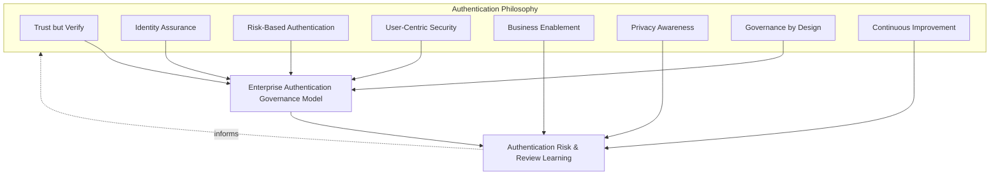
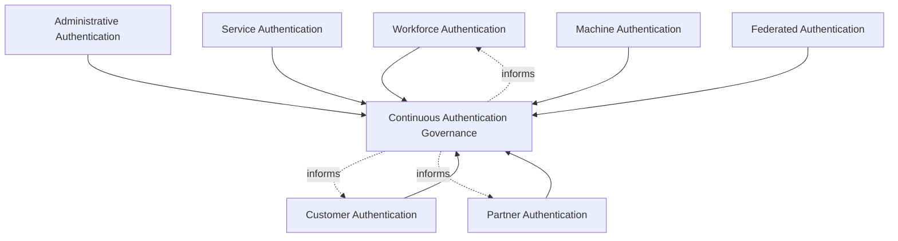
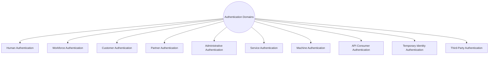
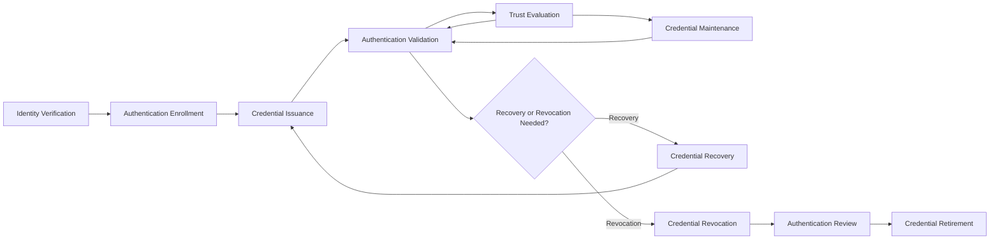
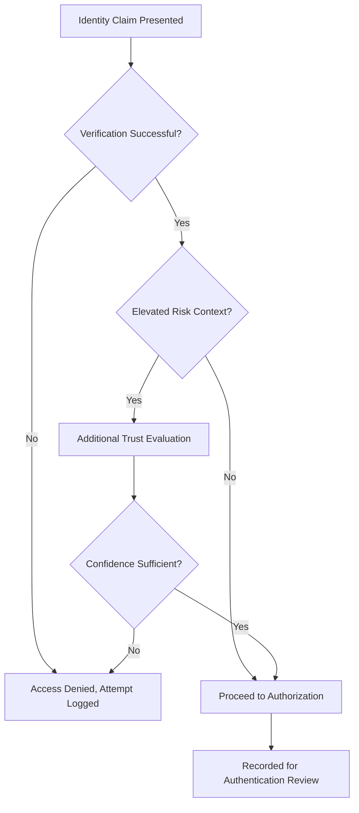
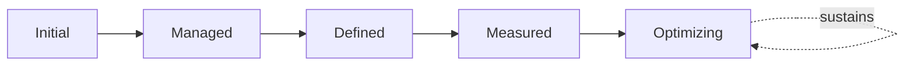

# Enterprise Authentication Governance Strategy

## 1. Document Purpose

This document defines the official Enterprise Authentication Governance Strategy for **StackLeo Tech Store**. It establishes how authentication is governed consistently across every identity domain — workforce, customer, partner, administrative, service, and machine — independent of any specific authentication provider, identity platform, MFA vendor, or password manager.

`authentication.md` remains authoritative for authentication philosophy and identity assurance levels — the conceptual foundation of *how confidence in a claimed identity is established*. This document is that foundation's governance elaboration: it defines how authentication practice is governed consistently across every domain that verifies identity, how credentials are governed across their full lifecycle, and how executive oversight of authentication risk is sustained, consistent with the broader IAM governance model established in `identity-access-management.md`.

- **Purpose of Authentication** — to ensure sufficient, risk-proportionate confidence that a claimed identity is genuine before any access decision proceeds, governed consistently across every domain and identity category the platform serves.
- **Relationship with Identity & Access Management** — this document is the authentication-specific elaboration of `identity-access-management.md` (Section 3, Enterprise IAM Governance Model); it governs specifically how each identity domain defined there verifies its claimed identities.
- **Relationship with Authorization** — this document governs *who is this actor*; `authorization.md` governs *what may this verified actor do*. Authentication governance is a strict, non-substitutable prerequisite to authorization.
- **Relationship with Zero Trust** — authentication governance operationalizes `zero-trust-strategy.md`'s "never trust, always verify" posture into concrete accountability — who owns verification standards, who reviews authentication risk, and who is accountable when trust is extended based on a verified claim.
- **Relationship with Risk Management** — authentication-related risk — weak verification, stale credentials, excessive session trust — is tracked as a distinct category within `security-risk-management.md` (Section 4), governed here at the domain-specific level.
- **Relationship with Privacy** — authentication data is itself sensitive customer and business data; this framework's governance is coordinated with `privacy.md` and `data-protection.md` to ensure credential and verification data receive the same protective discipline as any other sensitive data.
- **Relationship with Enterprise Security Governance** — this document operates within the broader governance model and executive accountability established in `security-governance.md`, applying it specifically to authentication practice.

This document is implementation-independent and vendor-neutral. It defines authentication governance philosophy, model, domains, and lifecycle conceptually — not specific authentication providers, identity platforms, MFA vendors, password managers, authentication protocols, cloud providers, authentication mechanisms, password policies, MFA methods, token formats, session handling, implementation workflows, infrastructure configurations, or deployment architectures.

## 2. Authentication Philosophy

Authentication governance at StackLeo is built on eight principles. Each exists to produce a specific business outcome — authentication is governed deliberately because it is the point at which trust is first extended, not as a technical formality.

### 2.1 Trust but Verify

No access proceeds on the basis of assumed identity; a claim is treated as unverified until authentication confirms it, consistent with Verify Before Trust in `authentication.md` (Section 2).

- **Business Value** — ensures every downstream access and authorization decision rests on a genuinely confirmed foundation, not convenient assumption.

### 2.2 Identity Assurance

Verification rigor is proportionate to the assurance level genuinely required, consistent with the assurance levels defined in `authentication.md` (Section 3).

- **Business Value** — avoids both under-verifying high-consequence actions and over-verifying low-consequence ones, keeping friction proportionate to genuine risk.

### 2.3 Risk-Based Authentication

Authentication governance decisions weigh business impact and likelihood, consistent with Risk-Based Security in `security-governance.md` (Section 2.5) and ISO 31000 thinking.

- **Business Value** — directs governance attention toward the authentication domains carrying the greatest genuine consequence if compromised.

### 2.4 User-Centric Security

Authentication governance accounts for the realistic behavior of customers and staff, consistent with User-Centric Security in `authentication.md` (Section 2), not an idealized user who behaves perfectly.

- **Business Value** — produces governance that is genuinely followed and effective, rather than theoretically sound but practically bypassed.

### 2.5 Business Enablement

Authentication governance exists to let the business operate and grow safely — from single-seller B2C toward corporate sales, wholesale, and the multi-vendor marketplace — not to obstruct legitimate activity with disproportionate friction.

- **Business Value** — keeps authentication governance genuinely followed rather than resented and quietly bypassed as an obstacle to real work.

### 2.6 Privacy Awareness

Authentication and credential data is itself sensitive, handled under the same minimization and protection principles as any other customer or business data, consistent with `privacy.md`.

- **Business Value** — protects customers and the business from the compounding consequence of a credential breach that also becomes a privacy incident.

### 2.7 Governance by Design

Authentication governance structures are established deliberately as identity domains are built, not retrofitted once weak verification or stale credentials have already caused harm.

- **Business Value** — prevents the costly, high-visibility discovery of authentication governance gaps only after an incident has already demonstrated their absence.

### 2.8 Continuous Improvement

Authentication governance practice matures over time, informed by real authentication risk findings, incidents, and the organization's growth in scale and complexity.

- **Business Value** — keeps authentication governance aligned with StackLeo's growth in workforce, customer base, and partner ecosystem.

*Diagram: Authentication Philosophy Overview — the eight principles shape the enterprise authentication governance model, and risk and review learning feed back into the philosophy itself.*

## 3. Enterprise Authentication Governance Model

Authentication governance operates across eight conceptual layers, each holding accountability for a distinct identity domain's verification practice.

### 3.1 Workforce Authentication

- **Purpose** — govern how StackLeo's own employees and contractors are verified.
- **Governance Scope** — coordinated with Workforce Identity Governance in `identity-access-management.md` (Section 3.4).
- **Business Value** — protects internal systems and data from access based on an unverified or weakly verified employee claim.
- **Executive Expectations** — leadership expects workforce authentication rigor proportionate to the sensitivity of internal systems accessed.

### 3.2 Customer Authentication

- **Purpose** — govern how customer identities are verified during account access and checkout.
- **Governance Scope** — coordinated with Customer Identity Governance in `identity-access-management.md` (Section 3.5) and the assurance levels in `authentication.md` (Section 3).
- **Business Value** — protects the trust relationship every customer transaction depends on, without imposing disproportionate friction on genuine shoppers.
- **Executive Expectations** — leadership expects customer authentication to balance security and usability deliberately, not default to either extreme.

### 3.3 Partner Authentication

- **Purpose** — govern how future marketplace sellers and B2B business partners are verified.
- **Governance Scope** — coordinated with Federation Governance in `identity-access-management.md` (Section 3.7), anticipating the multi-vendor marketplace model.
- **Business Value** — will become foundational to safely onboarding and trusting external sellers as the marketplace launches.
- **Executive Expectations** — leadership expects partner authentication governance to be designed ahead of, not after, marketplace launch.

### 3.4 Administrative Authentication

- **Purpose** — govern the elevated verification rigor administrative and other high-impact access requires.
- **Governance Scope** — coordinated with Privileged Identity Governance in `identity-access-management.md` (Section 3.3); the full dedicated lifecycle and governance for privileged access as a whole are elaborated in `privileged-access-management.md`.
- **Business Value** — ensures the access with the greatest potential impact receives commensurately stronger verification.
- **Executive Expectations** — leadership expects administrative authentication to be reviewed and strengthened proportionate to the risk it protects.

### 3.5 Service Authentication

- **Purpose** — govern how application-level service accounts authenticate to one another.
- **Governance Scope** — coordinated with Service Identity Governance in `identity-access-management.md` (Section 3.6); the full dedicated governance model for every non-human identity is elaborated in `service-accounts-management.md`.
- **Business Value** — prevents service-to-service authentication from becoming an ungoverned blind spot behind the customer-facing perimeter.
- **Executive Expectations** — leadership trusts service authentication receives the same governance rigor as human authentication, not less.

### 3.6 Machine Authentication

- **Purpose** — govern how devices, workloads, and automated processes verify their own identity.
- **Governance Scope** — coordinated with Service Identity Governance in `identity-access-management.md` (Section 3.6), distinct from service authentication in representing infrastructure-level actors; elaborated fully in `service-accounts-management.md`.
- **Business Value** — protects the infrastructure layer from unauthorized machine-to-machine interaction.
- **Executive Expectations** — leadership expects machine authentication governance to be anticipated as infrastructure scales, not discovered after the fact.

### 3.7 Federated Authentication

- **Purpose** — govern authentication trust extended to or received from external identity sources.
- **Governance Scope** — coordinated with Federation Governance in `identity-access-management.md` (Section 3.7); the full dedicated trust governance model and lifecycle are elaborated in `identity-federation.md`.
- **Business Value** — ensures external authentication trust is deliberately scoped, never assumed equivalent to internally verified identity.
- **Executive Expectations** — leadership expects federated authentication arrangements to be reviewed before being trusted, not discovered informally.

### 3.8 Continuous Authentication Governance

- **Purpose** — govern the mechanism by which every other layer in this model matures over time.
- **Governance Scope** — consolidates findings from Authentication Review (Section 5.9) and executive oversight (Section 7) across every domain.
- **Business Value** — prevents authentication governance itself from becoming the next thing that quietly stagnates as the organization scales.
- **Executive Expectations** — leadership expects authentication maturity to be assessed periodically, not assumed static once established.

### Authentication Governance Model Matrix

| Layer | Purpose | Business Value | Executive Expectations |
|---|---|---|---|
| Workforce Authentication | Govern verification of employees and contractors | Protects internal systems from unverified/weak employee claims | Rigor proportionate to sensitivity of internal systems |
| Customer Authentication | Govern verification during account access and checkout | Protects trust without disproportionate customer friction | Deliberately balances security and usability |
| Partner Authentication | Govern verification of marketplace sellers and B2B partners | Foundational to safely onboarding external sellers | Designed ahead of, not after, marketplace launch |
| Administrative Authentication | Govern elevated verification for high-impact access | Ensures greatest-impact access gets strongest verification | Reviewed and strengthened proportionate to protected risk |
| Service Authentication | Govern service-to-service authentication | Prevents an ungoverned blind spot behind the perimeter | Same governance rigor as human authentication |
| Machine Authentication | Govern device/workload/process identity verification | Protects infrastructure from unauthorized machine interaction | Anticipated as infrastructure scales |
| Federated Authentication | Govern trust extended to/from external identity sources | Ensures external trust is deliberately scoped, never assumed | Reviewed before being trusted, never discovered informally |
| Continuous Authentication Governance | Govern maturation of every other layer | Prevents governance itself from stagnating | Maturity assessed periodically |

*Diagram 1: Enterprise Authentication Governance Framework — seven domain-specific governance layers feed continuous authentication governance, which in turn informs the ongoing practice of every domain.*

## 4. Authentication Domains

Authentication practice is organized across ten conceptual domains, each requiring a somewhat different governance emphasis.

### 4.1 Human Authentication

- **Purpose** — represent the general governance concern spanning every domain where a human identity is verified.
- **Governance Scope** — cross-cutting; the human-specific counterpart to Machine Authentication (Section 4.7).
- **Business Importance** — anchors authentication governance to the realistic behavior of real people, consistent with User-Centric Security (Section 2.4).
- **Executive Expectations** — leadership expects human authentication governance to remain usable, not merely theoretically secure.

### 4.2 Workforce Authentication

- **Purpose** — govern verification of StackLeo's own employees and contractors, per Section 3.1.
- **Governance Scope** — coordinated with HR processes for onboarding and offboarding.
- **Business Importance** — protects internal systems and data proportionate to the sensitivity of what employees access.
- **Executive Expectations** — leadership expects workforce authentication to be adjusted promptly as employment status changes.

### 4.3 Customer Authentication

- **Purpose** — govern verification of customer identities, per Section 3.2.
- **Governance Scope** — coordinated with the customer journey defined in `02_Product/user-journeys.md`.
- **Business Importance** — protects the direct-to-consumer relationship every transaction depends on.
- **Executive Expectations** — leadership expects customer authentication to protect trust without adding unnecessary shopping friction.

### 4.4 Partner Authentication

- **Purpose** — govern verification of future marketplace sellers and B2B relationships, per Section 3.3.
- **Governance Scope** — anticipates the multi-vendor marketplace model.
- **Business Importance** — will become foundational to the marketplace business model as it launches.
- **Executive Expectations** — leadership expects partner authentication to be designed proactively.

### 4.5 Administrative Authentication

- **Purpose** — govern verification of identities with elevated, platform-affecting capability, per Section 3.4.
- **Governance Scope** — the highest-scrutiny domain in this framework.
- **Business Importance** — protects against the single highest-consequence category of authentication compromise.
- **Executive Expectations** — leadership expects administrative authentication strength to be reviewed regularly.

### 4.6 Service Authentication

- **Purpose** — govern verification between application-level service accounts, per Section 3.5.
- **Governance Scope** — coordinated with Service Accounts in `identity-access-management.md` (Section 4.5).
- **Business Importance** — protects internal service-to-service communication from unauthorized impersonation.
- **Executive Expectations** — leadership expects service authentication to be inventoried and reviewed with the same rigor as human accounts.

### 4.7 Machine Authentication

- **Purpose** — govern verification of devices, workloads, and automated processes, per Section 3.6.
- **Governance Scope** — coordinated with Machine Identities in `identity-access-management.md` (Section 4.6).
- **Business Importance** — protects the infrastructure layer from unauthorized machine-to-machine interaction.
- **Executive Expectations** — leadership expects machine authentication governance to scale with infrastructure growth.

### 4.8 API Consumer Authentication

- **Purpose** — govern verification of clients consuming StackLeo's APIs, coordinated with `05_API/authentication.md`.
- **Governance Scope** — spans internal channel consumers today and external partner/marketplace consumers in the future.
- **Business Importance** — protects every current and future channel simultaneously, since compromised API authentication affects all consumers of it at once.
- **Executive Expectations** — leadership expects API consumer authentication to scale consistently as channels multiply.

### 4.9 Temporary Identity Authentication

- **Purpose** — govern verification for bounded-purpose or bounded-duration identities, coordinated with Temporary Identities in `identity-access-management.md` (Section 4.8).
- **Governance Scope** — applies mandatory expiration as a defining characteristic of this domain.
- **Business Importance** — prevents temporary access needs from becoming a permanent, unreviewed authentication grant.
- **Executive Expectations** — leadership expects every temporary authentication grant to carry an explicit expiration.

### 4.10 Third-Party Authentication

- **Purpose** — govern verification of external identities StackLeo does not directly control, per Federated Authentication (Section 3.7).
- **Governance Scope** — coordinated with Third-Party Identities in `identity-access-management.md` (Section 4.9).
- **Business Importance** — protects against risk introduced by parties outside StackLeo's direct organizational control.
- **Executive Expectations** — leadership expects third-party authentication trust to be reviewed before extension, not assumed.

### Authentication Domain Matrix

| Domain | Purpose | Business Importance | Executive Expectations |
|---|---|---|---|
| Human Authentication | Anchor governance to realistic human behavior | Ensures usable, not merely theoretical, security | Remains usable, not only theoretically secure |
| Workforce Authentication | Govern verification of employees and contractors | Protects internal systems proportionate to access sensitivity | Adjusted promptly as employment status changes |
| Customer Authentication | Govern verification of customer identities | Protects the direct-to-consumer relationship | Protects trust without unnecessary shopping friction |
| Partner Authentication | Govern verification of marketplace sellers and B2B partners | Foundational to the future marketplace business model | Designed proactively, ahead of launch |
| Administrative Authentication | Govern verification of elevated, platform-affecting identities | Protects against the highest-consequence compromise category | Strength reviewed regularly |
| Service Authentication | Govern verification between service accounts | Protects internal communication from unauthorized impersonation | Inventoried and reviewed with the same rigor as human accounts |
| Machine Authentication | Govern verification of devices and automated processes | Protects the infrastructure layer from unauthorized interaction | Governance scales with infrastructure growth |
| API Consumer Authentication | Govern verification of API-consuming clients | Protects every current and future channel simultaneously | Scales consistently as channels multiply |
| Temporary Identity Authentication | Govern verification for bounded-purpose identities | Prevents temporary needs becoming permanent grants | Every grant carries an explicit expiration |
| Third-Party Authentication | Govern verification of external, uncontrolled identities | Protects against risk from parties outside organizational control | Trust reviewed before extension, never assumed |

*Diagram 3: Authentication Trust Establishment Model (domain view) — ten domains, each requiring verification rigor proportionate to its genuine business consequence.*

## 5. Authentication Lifecycle

Authentication and credential governance spans ten conceptual lifecycle stages, applicable across every domain in Section 4.

### 5.1 Identity Verification

- **Purpose** — confirm the identity underlying an authentication credential is genuine before any credential is issued, consistent with Identity Verification in `identity-access-management.md` (Section 5.2).
- **Governance Objectives** — require verification rigor proportionate to the domain's assurance level (`authentication.md`, Section 3).
- **Business Value** — ensures every credential issued rests on a genuinely confirmed identity.

### 5.2 Authentication Enrollment

- **Purpose** — formally register how a verified identity will authenticate going forward.
- **Governance Objectives** — require enrollment to be recorded and traceable to the identity it belongs to.
- **Business Value** — establishes a clear, auditable starting point for the identity's authentication relationship with the platform.

### 5.3 Credential Issuance

- **Purpose** — provide the enrolled identity with the means to authenticate.
- **Governance Objectives** — require issuance to be scoped to the assurance level genuinely required for the identity's domain.
- **Business Value** — ensures credential strength is proportionate to what it ultimately protects.

### 5.4 Authentication Validation

- **Purpose** — confirm, at each point of use, that a presented credential genuinely belongs to the claimed identity.
- **Governance Objectives** — require validation practice to be consistent with Trust but Verify (Section 2.1) at every access attempt.
- **Business Value** — is the operational moment where authentication governance actually protects the platform.

### 5.5 Trust Evaluation

- **Purpose** — assess whether the confidence established by authentication remains appropriate throughout continued use, consistent with Continuous Verification in `authentication.md` (Section 2).
- **Governance Objectives** — require trust to be re-evaluated at points of elevated risk, never treated as permanently established at initial login.
- **Business Value** — protects against the risk that circumstances change after initial verification in ways that should reduce confidence.

### 5.6 Credential Maintenance

- **Purpose** — keep credential-related records current as circumstances change.
- **Governance Objectives** — require maintenance to be triggered by genuine change events, not left to drift indefinitely.
- **Business Value** — ensures credential records remain an accurate reflection of current reality.

### 5.7 Credential Recovery

- **Purpose** — restore an identity's ability to authenticate when its existing credential is lost or inaccessible.
- **Governance Objectives** — require recovery to itself involve genuine identity re-verification, never bypassing the assurance the original credential provided.
- **Business Value** — prevents recovery from becoming the weakest link that undermines otherwise strong authentication.

### 5.8 Credential Revocation

- **Purpose** — deliberately and immediately invalidate a credential where circumstance warrants.
- **Governance Objectives** — require revocation capability to be genuinely immediate for high-risk domains, consistent with Administrative Authentication (Section 3.4).
- **Business Value** — limits the window during which a compromised or no-longer-legitimate credential remains usable.

### 5.9 Authentication Review

- **Purpose** — formally reassess whether authentication practice for a domain remains adequate and proportionate.
- **Governance Objectives** — require review to occur on a predictable, regular cadence, feeding Continuous Authentication Governance (Section 3.8).
- **Business Value** — catches authentication weaknesses before they are discovered through an incident.

### 5.10 Credential Retirement

- **Purpose** — formally and finally remove a credential's records once it and its associated identity are genuinely no longer needed.
- **Governance Objectives** — coordinate with Identity Retirement in `identity-access-management.md` (Section 5.10) and privacy data minimization principles.
- **Business Value** — prevents indefinite accumulation of credential data no longer serving any genuine purpose.

### Authentication Lifecycle Matrix

| Stage | Purpose | Governance Objective | Business Value |
|---|---|---|---|
| Identity Verification | Confirm genuine identity before credential issuance | Rigor proportionate to domain assurance level | Ensures every credential rests on a confirmed identity |
| Authentication Enrollment | Formally register how an identity will authenticate | Enrollment recorded and traceable | Establishes a clear, auditable starting point |
| Credential Issuance | Provide the identity with means to authenticate | Scoped to genuinely required assurance level | Credential strength proportionate to what it protects |
| Authentication Validation | Confirm a presented credential belongs to its claimant | Consistent verification at every access attempt | The operational moment governance actually protects the platform |
| Trust Evaluation | Assess whether established confidence remains appropriate | Re-evaluated at points of elevated risk | Protects against changed circumstances post-verification |
| Credential Maintenance | Keep credential records current | Triggered by genuine change events | Keeps records an accurate reflection of reality |
| Credential Recovery | Restore ability to authenticate when lost | Involves genuine re-verification, no bypass | Prevents recovery becoming the weakest link |
| Credential Revocation | Deliberately, immediately invalidate a credential | Genuinely immediate for high-risk domains | Limits window of compromised credential usability |
| Authentication Review | Reassess whether practice remains adequate | Predictable, regular cadence | Catches weaknesses before an incident discovers them |
| Credential Retirement | Finally remove records once no longer needed | Coordinated with identity retirement and privacy principles | Prevents indefinite accumulation of unneeded data |

*Diagram 2: Authentication Lifecycle — a credential proceeds from verification and enrollment through ongoing validation and trust evaluation, with recovery, revocation, review, and retirement handling its eventual, deliberate wind-down.*

## 6. Credential Governance Principles

- **Identity Assurance** — credential strength is proportionate to the assurance level genuinely required, consistent with Section 2.2.
- **Credential Ownership** — every credential traces to a single, specific identity, never shared across multiple people or systems without explicit, documented justification.
- **Lifecycle Governance** — every credential is governed consistently across the full lifecycle in Section 5, not only at issuance.
- **Accountability** — every credential decision — issuance, recovery, revocation — traces to a specific, responsible role.
- **Traceability** — every credential's history — enrollment, maintenance, recovery, revocation — can be reconstructed after the fact.
- **Auditability** — credential governance decisions and their outcomes can be independently reviewed, supporting ISO/IEC 27001-aligned assurance.
- **Risk Awareness** — credential governance decisions are made with explicit awareness of the risk a weak or compromised credential represents.
- **Continuous Improvement** — credential governance practice matures over time, informed by real review findings and incidents.

### Credential Governance Principles Matrix

| Principle | Description | Business Value |
|---|---|---|
| Identity Assurance | Credential strength proportionate to required assurance | Avoids both under- and over-verifying relative to genuine risk |
| Credential Ownership | Every credential traces to a single, specific identity | Preserves individual accountability for authenticated actions |
| Lifecycle Governance | Governed consistently across the full lifecycle | Prevents governance gaps at maintenance, recovery, or retirement |
| Accountability | Every decision traces to a specific, responsible role | Ensures credential decisions have a clear, responsible party |
| Traceability | Credential history can be reconstructed after the fact | Enables defensible, evidence-based governance decisions |
| Auditability | Decisions and outcomes independently reviewable | Supports ISO/IEC 27001-aligned assurance and audit confidence |
| Risk Awareness | Decisions made with awareness of compromise risk | Enables deliberate, informed governance prioritization |
| Continuous Improvement | Governance matures from real review findings | Keeps credential governance aligned with organizational growth |

*Diagram 4: Authentication Governance Decision Flow — a presented identity claim is verified, escalated for additional trust evaluation under elevated risk, and either proceeds to authorization or is denied, with every outcome recorded for review.*

## 7. Executive Oversight

- **Authentication Governance Reviews** — the overall coherence of authentication governance across every domain (Section 4) is formally reviewed on a regular cadence, consistent with `identity-access-management.md` (Section 7).
- **Executive Reporting** — aggregated authentication health — enrollment counts, credential recovery volume, revocation trends — is reported to executive leadership, coordinated with `09_Operations/operations-metrics-kpis.md`.
- **Risk Reviews** — authentication-related risk from `security-risk-management.md` (Section 4) is reviewed alongside broader identity and security risk, not in isolation.
- **Compliance Reviews** — authentication practice is reviewed against applicable regulatory and contractual obligations, coordinated with `compliance.md`.
- **Documentation Governance** — this framework's relationship to `authentication.md`, `identity-access-management.md`, and `05_API/authentication.md` is kept current as those documents evolve.
- **Audit Readiness** — authentication governance decisions, reviews, and their outcomes are maintained in a state ready for internal or external audit at any time.

### Executive Oversight Matrix

| Oversight Mechanism | Purpose | Governance Role |
|---|---|---|
| Authentication Governance Reviews | Confirm overall governance coherence across domains | Regular, predictable cadence for the framework as a whole |
| Executive Reporting | Provide leadership a single, coherent authentication picture | Coordinated with enterprise operational KPI reporting |
| Risk Reviews | Review authentication risk alongside broader identity risk | Not conducted in isolation from enterprise risk visibility |
| Compliance Reviews | Confirm alignment with regulatory/contractual obligations | Reviewed jointly with `compliance.md` |
| Documentation Governance | Keep this framework's subordinate relationships current | Updated as authentication and API authentication docs evolve |
| Audit Readiness | Maintain decisions and reviews ready for independent review | Continuous state, not preparation-triggered |

### Governance Responsibility Matrix

| Role | Responsibility |
|---|---|
| CISO | Owns coherence and enforcement of this authentication strategy, in partnership with Security and Executive leadership. |
| Authentication Governance Lead | Owns the governance model (Section 3) and lifecycle (Section 5) across every domain. |
| Security Leadership | Owns Administrative Authentication (Section 3.4), the highest-scrutiny governance layer. |
| HR / People Lead | Coordinates Workforce Authentication (Section 3.1) for onboarding and offboarding events. |
| Engineering Leads | Own Service and Machine Authentication (Sections 3.5–3.6) within their domain. |
| API Governance Lead | Owns API Consumer Authentication (Section 4.8) jointly with `05_API/authentication.md`. |
| Executive Leadership | Reviews significant authentication risk and Administrative Authentication decisions. |
| Internal Audit / Review Function | Independently verifies that authentication governance records reflect actual practice. |

## 8. Future Readiness

This framework is designed to remain valid as StackLeo evolves in scale and organizational complexity, without requiring redefinition of its underlying philosophy.

- **Passwordless Futures** — this framework's governance model (Section 3) and lifecycle (Section 5) are defined independently of any specific credential mechanism, so they apply unchanged as authentication approaches evolve toward passwordless models.
- **AI-Assisted Identity Verification** — where AI-assisted techniques support Identity Verification (Section 5.1), they operate within the same Identity Assurance and Risk Awareness principles (Section 6) as any other verification practice, never adopted as an unreviewed shortcut around governance.
- **Cloud-Native Platforms** — governance layers (Section 3) are defined independently of any specific Identity Provider or runtime, so they apply unchanged as infrastructure evolves.
- **Marketplace Platform** — Partner Authentication (Section 3.3) is structured to absorb the multi-vendor marketplace model as it launches, using the same governance model defined here.
- **Multi-Tenant Architecture** — where future architecture introduces tenant isolation, Trust Evaluation (Section 5.5) extends to explicitly account for cross-tenant authentication context.
- **Global Identity Federation** — Federated Authentication (Section 3.7) extends to accommodate authentication trust with partners and customers across new regional markets as StackLeo expands.
- **Enterprise Scale** — the governance model, domains, and lifecycle defined in Sections 3–5 are defined independently of organizational size or structure, so they remain coherent as the identity population grows substantially.
- **Evolving Authentication Risks** — Continuous Authentication Governance (Section 3.8) and Authentication Review (Section 5.9) are structured to absorb genuinely new categories of authentication risk as they emerge.

## 9. Authentication Maturity Model

Authentication governance maturity is described across five conceptual levels, adapted from established process maturity thinking and consistent with NIST Cybersecurity Framework tiers.

- **Initial** — authentication governance, where it exists, is informal and inconsistent; credential practice varies by domain, and stale credentials accumulate without regular review.
- **Managed** — basic governance exists for individual authentication domains, but consistency across the ten domains in Section 4 varies significantly.
- **Defined** — the governance model, domains, and lifecycle are standardized, documented, and consistently applied across the organization, consistent with the model defined throughout this document; ownership is clear organization-wide.
- **Measured** — credential health, review completion, and revocation trends are measured systematically, and decisions are grounded in genuine evidence rather than qualitative impression alone.
- **Optimizing** — authentication governance is continuously and deliberately improved based on quantitative evidence and organizational learning; improvement itself is a managed, ongoing discipline rather than an occasional initiative.

### Authentication Maturity Model Matrix

| Level | Characteristics | Primary Focus |
|---|---|---|
| Initial | Informal, inconsistent governance; stale credentials accumulate | Ad hoc, domain-dependent authentication practice |
| Managed | Basic governance exists per domain; consistency varies | Domain-level consistency |
| Defined | Standardized governance model, domains, and lifecycle | Organization-wide consistency and clear ownership |
| Measured | Credential health and review trends measured systematically | Evidence-based authentication governance decisions |
| Optimizing | Practice continuously and deliberately improved from evidence | Sustained, deliberate improvement as a discipline |

*Diagram 6: Authentication Maturity Progression Model — maturity advances from informal, domain-dependent practice toward standardized, measured, and continuously optimized authentication governance.*

*Diagram 5: Continuous Authentication Improvement Cycle — credential health and review outcomes are measured, learned from, improved upon, and standardized back into practice, on a continuing basis.*

## 10. Anti-Patterns

The following recurring failure patterns are explicitly recognized and avoided, as each one structurally undermines this strategy.

| Anti-Pattern | Why It's Avoided |
|---|---|
| Weak Identity Verification | Contradicts Identity Verification (Section 5.1); a credential issued on an unverified or weakly verified identity claim undermines every downstream trust decision. |
| Shared Credentials | Contradicts Credential Ownership (Section 6); shared credentials destroy individual accountability for any authenticated action. |
| Excessive Trust | Contradicts Trust Evaluation (Section 5.5); treating authentication confidence as permanent once established ignores changed circumstances that should reduce it. |
| Stale Credentials | Contradicts Credential Maintenance and Authentication Review (Sections 5.6, 5.9); credentials left unreviewed accumulate risk silently over time. |
| Weak Governance | Undermines Section 3; without clear ownership and review across every domain, authentication practice drifts into inconsistency as the organization scales. |
| Poor Documentation | Undermines Documentation Governance (Section 7) and Traceability (Section 6), leaving authentication decisions unclear or unverifiable after the fact. |
| Missing Authentication Reviews | Contradicts Authentication Review (Section 5.9); without regular reassessment, authentication weaknesses persist until discovered through an incident. |
| Missing Continuous Improvement | Contradicts Continuous Improvement (Section 2.8, Section 3.8); without deliberate improvement, authentication governance stagnates as the organization and threat landscape evolve. |

## 11. Document Information

| Property | Value |
|----------|-------|
| Document | authentication-strategy.md |
| Version | 1.0.0 |
| Status | Active |
| Maintained By | StackLeo |
| Last Updated | 2026-07-24 |

---

© StackLeo. All Rights Reserved.
