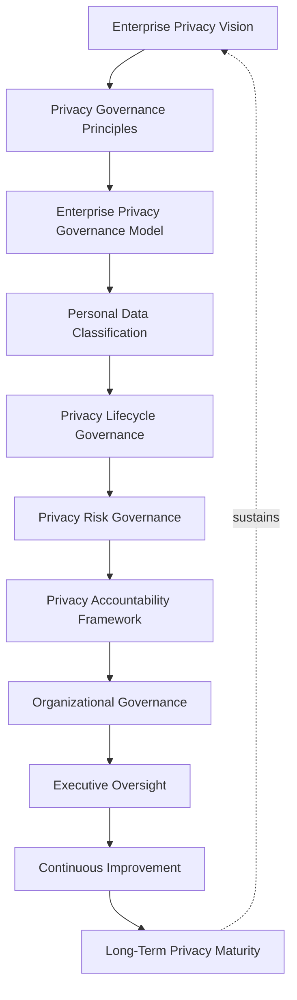
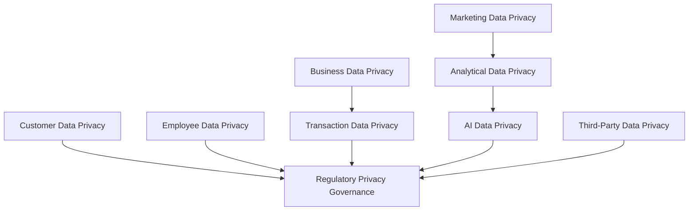
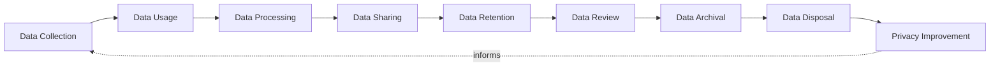
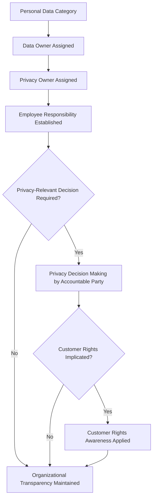
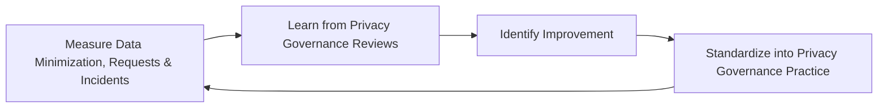
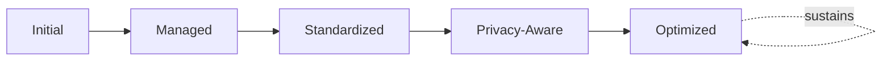

# Enterprise Data Privacy Framework

## 1. Executive Summary

**Purpose** — This document defines the official Enterprise Data Privacy Framework for **StackLeo Tech Store**. It establishes privacy governance, personal data protection, privacy principles, data handling accountability, privacy lifecycle governance, regulatory readiness, executive oversight, and long-term privacy maturity as a single, consolidated governance reference. `privacy-governance.md` remains the CPO/CISO/CDO-owned executive charter for privacy at StackLeo, and `privacy.md` remains the operational governance framework elaborating privacy principles, personal data governance, and cross-border readiness in full depth. This framework does not compete with either for authority. It is the consolidated governance reference that synthesizes accountability, classification, risk, and executive oversight across every category of personal data into one coherent document.

**Scope** — This framework applies to every category of personal data at StackLeo — customer, employee, business, transaction, marketing, analytical, AI, and third-party data — coordinated with `privacy-governance.md`, `privacy.md`, `security-strategy.md`, `identity-access-governance.md`, and `data-governance.md`.

**Strategic Objectives** — To ensure personal data is treated as belonging to the individual it describes, not merely as a business asset StackLeo happens to hold; that data collection and use are genuinely minimized to what a defined purpose requires; that every category of personal data traces to a genuinely accountable owner; and that executive leadership has one coherent, consolidated view of the organization's privacy posture and regulatory readiness.

**Business Value** — A consolidated privacy governance reference protects the trust individuals extend to StackLeo with their personal data, protects the organization from the disproportionate cost of a privacy failure or regulatory action, and gives executive leadership confidence that privacy is genuinely and coherently governed across every function that touches personal data.

**Intended Audience** — The Board of Directors, executive leadership, the Chief Technology Officer, privacy leadership, security leadership, the Data Governance Council, legal and compliance teams, engineering teams, and business stakeholders.

## 2. Enterprise Privacy Vision

- **Privacy as Customer Trust Foundation** — privacy is governed as the foundation the customer relationship is built upon, never a compliance obligation layered on afterward.
- **Responsible Data Usage** — personal data is used only in a manner genuinely consistent with the purpose it was collected for.
- **Personal Data Protection** — personal data is protected with a level of care proportionate to its genuine sensitivity.
- **Ethical Technology Usage** — technology that processes personal data, including AI and analytics, is adopted only in a manner consistent with genuine privacy obligation.
- **Business Reputation Protection** — privacy governance protects StackLeo's standing with customers, partners, and regulators.
- **Regulatory Readiness** — privacy governance ensures the organization is genuinely prepared for evolving privacy regulation, not merely reactive to it.
- **Sustainable Digital Trust** — privacy, governed deliberately over time, becomes a genuine, durable source of digital trust.

### Enterprise Privacy Vision Matrix

| Vision Element | Focus | Business Value |
|---|---|---|
| Privacy as Customer Trust Foundation | The foundation the customer relationship is built upon | Protects the trust relationship every interaction depends on |
| Responsible Data Usage | Data used consistent with its genuine collection purpose | Prevents data use from silently exceeding its justification |
| Personal Data Protection | Protection proportionate to genuine sensitivity | Ensures protection effort matches genuine consequence |
| Ethical Technology Usage | New technology adopted consistent with privacy obligation | Protects against privacy erosion through unexamined adoption |
| Business Reputation Protection | Protects standing with customers, partners, regulators | Protects the organization's most valuable intangible asset |
| Regulatory Readiness | Genuine preparation for evolving regulation | Removes the cost of reactive, disruptive compliance response |
| Sustainable Digital Trust | A durable source of digital trust over time | Converts privacy discipline into genuine competitive advantage |

*Diagram 1: Enterprise Data Privacy Framework — enterprise privacy vision establishes governance principles and the governance model, flowing through classification, lifecycle, risk, and accountability governance into organizational governance and executive oversight, with continuous improvement driving long-term privacy maturity that reinforces the vision itself.*

## 3. Privacy Governance Principles

Privacy governance at StackLeo rests on nine principles, each producing a specific business outcome.

- **Privacy by Design** — privacy is considered from the outset of any capability that touches personal data, never retrofitted after the fact. *Business Value:* prevents the disproportionate cost of remediating privacy after a capability is already built.
- **Data Minimization** — only the personal data genuinely necessary for a defined purpose is collected. *Business Value:* limits the genuine exposure of any single data category.
- **Purpose Limitation** — personal data is used only for the genuine purpose it was collected for, never repurposed without deliberate review. *Business Value:* protects individuals from an unexpected, unauthorized use of their data.
- **Transparency** — individuals are genuinely informed of what personal data is collected and why. *Business Value:* protects trust from the corrosive effect of undisclosed data practice.
- **Accountability** — every category of personal data traces to a specific, named, responsible owner. *Business Value:* ensures no personal data category drifts without someone genuinely responsible for it.
- **User Trust** — privacy decisions are weighed first against their genuine effect on the individual's trust in StackLeo. *Business Value:* keeps privacy governance connected to the organization's most fundamental obligation to its customers.
- **Responsible Data Processing** — personal data is processed only in a manner genuinely consistent with the individual's reasonable expectation. *Business Value:* protects the organization from the reputational cost of processing that feels invasive or unexpected.
- **Security Alignment** — privacy is governed jointly with, and never in place of, the protective discipline established in `security-strategy.md`. *Business Value:* ensures personal data is both used appropriately and technically protected.
- **Continuous Improvement** — privacy governance practice matures over time, informed by real operational and regulatory outcomes. *Business Value:* keeps privacy aligned with the organization's growing scale and an evolving regulatory landscape.

### Privacy Governance Principles Matrix

| Principle | Description | Business Value |
|---|---|---|
| Privacy by Design | Considered from the outset, never retrofitted | Prevents the disproportionate cost of after-the-fact remediation |
| Data Minimization | Only genuinely necessary data collected | Limits the genuine exposure of any single data category |
| Purpose Limitation | Used only for the genuine collection purpose | Protects individuals from unexpected, unauthorized use |
| Transparency | Individuals genuinely informed of collection and purpose | Protects trust from undisclosed data practice |
| Accountability | Every category traces to a specific, responsible owner | Ensures no category drifts without genuine responsibility |
| User Trust | Decisions weighed first against effect on individual trust | Keeps governance connected to the fundamental customer obligation |
| Responsible Data Processing | Consistent with the individual's reasonable expectation | Protects against the cost of processing that feels invasive |
| Security Alignment | Governed jointly with, never in place of, security | Ensures data is both used appropriately and technically protected |
| Continuous Improvement | Practice matures from real operational and regulatory outcomes | Keeps privacy aligned with scale and an evolving landscape |

## 4. Enterprise Privacy Governance Model

Privacy governance operates across nine conceptual domains, each holding accountability for a distinct category of personal data.

### Customer Data Privacy

- **Purpose** — govern the privacy of personal data describing StackLeo's customers.
- **Governance Scope** — coordinated with `identity-access-governance.md` (Customer Identity).
- **Business Value** — protects the trust relationship every customer transaction depends on.
- **Executive Expectations** — leadership expects customer data privacy to be held to the highest rigor in this model.

### Employee Data Privacy

- **Purpose** — govern the privacy of personal data describing StackLeo's employees and contractors.
- **Governance Scope** — coordinated with `identity-access-governance.md` (Workforce Identity) and Human Resources.
- **Business Value** — protects the trust employees extend to StackLeo with their personal data.
- **Executive Expectations** — leadership expects employee data privacy to be governed to the same standard as customer data.

### Business Data Privacy

- **Purpose** — govern the privacy of personal data embedded within genuine business records.
- **Governance Scope** — coordinated with `04_Database/data-governance.md`.
- **Business Value** — protects personal data that exists incidentally within broader business information.
- **Executive Expectations** — leadership expects business data privacy to be genuinely considered, not overlooked as a technical byproduct.

### Transaction Data Privacy

- **Purpose** — govern the privacy of personal data associated with a genuine business transaction.
- **Governance Scope** — coordinated with Restricted Data classification (Section 5), given transaction data's elevated sensitivity.
- **Business Value** — protects the trustworthiness of the organization's most consequential customer interactions.
- **Executive Expectations** — leadership expects transaction data privacy to be unimpeachably rigorous.

### Marketing Data Privacy

- **Purpose** — govern the privacy of personal data used for genuine marketing and customer engagement.
- **Governance Scope** — coordinated with Purpose Limitation (Section 3), given marketing's particular repurposing risk.
- **Business Value** — protects customers from marketing use that exceeds their genuine expectation.
- **Executive Expectations** — leadership expects marketing data privacy to respect explicit customer preference at all times.

### Analytical Data Privacy

- **Purpose** — govern the privacy of personal data as it is consumed by `analytics-strategy.md`'s analytical processes.
- **Governance Scope** — coordinated with `04_Database/analytics-strategy.md` (Customer Analytics).
- **Business Value** — protects individuals from being genuinely re-identified through aggregated or analytical use.
- **Executive Expectations** — leadership expects analytical use to balance genuine insight against privacy responsibility.

### AI Data Privacy

- **Purpose** — govern the privacy of personal data used to develop, train, or operate AI and ML capability.
- **Governance Scope** — coordinated with `04_Database/ai-governance.md` and `04_Database/ml-governance.md`.
- **Business Value** — protects against the amplifying effect AI capability has on an underlying privacy failure.
- **Executive Expectations** — leadership expects AI data privacy to be confirmed with the same rigor as model validation itself.

### Third-Party Data Privacy

- **Purpose** — govern the privacy of personal data shared with, or received from, a vendor or partner.
- **Governance Scope** — coordinated with `06_Security/third-party-risk-governance.md`.
- **Business Value** — protects individuals from a privacy failure originating in a dependency StackLeo does not directly control.
- **Executive Expectations** — leadership expects third-party data privacy to be governed with elevated scrutiny given reduced direct oversight.

### Regulatory Privacy Governance

- **Purpose** — govern the synthesized posture demonstrating genuine adherence to evolving privacy regulation.
- **Governance Scope** — oversight exclusively accountable for converging every domain above into one coherent regulatory picture.
- **Business Value** — protects the organization's standing with regulators as privacy law continues to evolve.
- **Executive Expectations** — leadership expects one coherent regulatory readiness picture, not eight disconnected domain views.

### Privacy Governance Matrix

| Domain | Purpose | Business Value | Executive Expectations |
|---|---|---|---|
| Customer Data Privacy | Govern privacy of personal data describing customers | Protects the trust relationship every transaction depends on | Expects the highest rigor in this model |
| Employee Data Privacy | Govern privacy of personal data describing employees | Protects trust employees extend with their personal data | Expects the same standard as customer data |
| Business Data Privacy | Govern privacy of data embedded within business records | Protects personal data existing incidentally within records | Expects genuine consideration, not oversight |
| Transaction Data Privacy | Govern privacy of data associated with a transaction | Protects trustworthiness of the most consequential interactions | Expects unimpeachable rigor |
| Marketing Data Privacy | Govern privacy of data used for marketing and engagement | Protects customers from use exceeding genuine expectation | Expects respect for explicit customer preference |
| Analytical Data Privacy | Govern privacy of data consumed by analytical processes | Protects against genuine re-identification through analysis | Expects balance of insight against privacy responsibility |
| AI Data Privacy | Govern privacy of data used to develop or operate AI/ML | Protects against AI's amplifying effect on privacy failure | Expects rigor equal to model validation itself |
| Third-Party Data Privacy | Govern privacy of data shared with vendors or partners | Protects against failure from an uncontrolled dependency | Expects elevated scrutiny given reduced direct oversight |
| Regulatory Privacy Governance | Synthesize the enterprise regulatory readiness picture | Protects standing with regulators as privacy law evolves | Expects one coherent picture, not disconnected views |

*Diagram 2: Privacy Governance Model — customer and employee data privacy, business and transaction data privacy, marketing, analytical, and AI data privacy, and third-party data privacy all converge on regulatory privacy governance's synthesized readiness picture.*

## 5. Personal Data Classification Framework

Personal data is governed across seven conceptual classifications, each carrying a distinct governance objective, consistent with `04_Database/data-classification.md` (Section 4.7).

- **Public Information** — governs information with no genuine privacy sensitivity, freely shareable.
- **Internal Information** — governs information intended for internal StackLeo use, without personal data content.
- **Personal Data** — governs information genuinely identifying or relating to an individual.
- **Sensitive Personal Data** — governs personal data whose exposure would carry genuinely elevated harm to the individual.
- **Confidential Data** — governs personal data requiring restricted access proportionate to its business sensitivity.
- **Restricted Data** — governs personal data requiring the strictest handling, such as payment and financial information.
- **Regulated Data** — governs personal data subject to specific, named regulatory obligation.

### Personal Data Classification Matrix

| Classification | Governance Objective | Handling Expectation |
|---|---|---|
| Public Information | No genuine privacy sensitivity | Freely shareable without special handling |
| Internal Information | Intended for internal use, no personal data content | Handled within internal systems only |
| Personal Data | Genuinely identifying or relating to an individual | Minimized, purpose-limited, and transparently disclosed |
| Sensitive Personal Data | Elevated harm potential upon exposure | Elevated protection and restricted access |
| Confidential Data | Restricted access proportionate to business sensitivity | Access limited to genuine, defined need |
| Restricted Data | Strictest handling, such as payment information | Highest rigor, coordinated with `06_Security/data-protection.md` |
| Regulated Data | Subject to specific, named regulatory obligation | Governed to the specific obligation's explicit requirement |

## 6. Privacy Lifecycle Governance

Privacy governance operates across nine conceptual lifecycle stages, coordinated with `04_Database/data-lifecycle-governance.md`.

- **Data Collection** — govern how personal data is collected only for a genuine, disclosed purpose.
- **Data Usage** — govern how collected personal data is used consistent with Purpose Limitation (Section 3).
- **Data Processing** — govern how personal data is processed in a manner consistent with the individual's reasonable expectation.
- **Data Sharing** — govern how personal data is shared, internally or externally, only with genuine justification.
- **Data Retention** — govern how personal data is retained only for as long as its genuine purpose requires, coordinated with `04_Database/data-retention.md`.
- **Data Review** — govern the periodic, formal review of personal data holdings for continued genuine justification.
- **Data Archival** — govern how personal data no longer in active use is moved to a genuinely appropriate archival state.
- **Data Disposal** — govern how personal data is securely and completely disposed of once no genuine purpose remains.
- **Privacy Improvement** — govern how privacy practice is deliberately strengthened based on real operational and regulatory outcomes.

### Privacy Lifecycle Matrix

| Stage | Governance Objective | Business Value |
|---|---|---|
| Data Collection | Collect only for a genuine, disclosed purpose | Prevents collection beyond what is genuinely justified |
| Data Usage | Use consistent with Purpose Limitation | Protects individuals from unexpected, unauthorized use |
| Data Processing | Process consistent with reasonable expectation | Protects against processing that feels invasive |
| Data Sharing | Share only with genuine justification | Prevents unjustified exposure through sharing |
| Data Retention | Retain only as long as genuinely necessary | Limits genuine exposure from unnecessary retention |
| Data Review | Periodically review holdings for justification | Prevents data outliving the purpose that justified it |
| Data Archival | Move inactive data to an appropriate archival state | Reduces active exposure of no-longer-needed data |
| Data Disposal | Securely and completely dispose once unneeded | Removes risk of data with no remaining genuine purpose |
| Privacy Improvement | Strengthen practice from real outcomes | Keeps practice aligned with an evolving regulatory landscape |

*Diagram 3: Personal Data Lifecycle Governance — collection and usage inform processing and sharing, feeding retention and periodic review, with archival, disposal, and privacy improvement feeding lessons back into the cycle.*

## 7. Privacy Risk Governance

Privacy-related risk is governed across eight conceptual categories.

- **Unauthorized Data Exposure** — the risk that personal data is genuinely accessed or disclosed without authorization.
- **Privacy Violations** — the risk that personal data is used in a manner that genuinely breaches an individual's reasonable expectation or a regulatory obligation.
- **Excessive Data Collection** — the risk that more personal data is collected than a genuine purpose requires.
- **Improper Data Usage** — the risk that personal data is used for a purpose beyond what it was genuinely collected for.
- **Third-Party Privacy Risks** — the risk introduced through a privacy dependency on a vendor or integration partner.
- **Compliance Risks** — the risk that privacy practice fails to meet a genuine, evolving regulatory or contractual obligation.
- **Customer Trust Risks** — the risk that a privacy failure damages the trust relationship every customer interaction depends on.
- **Reputation Risks** — the risk that a privacy failure damages StackLeo's standing with customers, partners, or the market.

### Privacy Risk Matrix

| Risk Category | Focus | Governance Coordination |
|---|---|---|
| Unauthorized Data Exposure | Personal data accessed or disclosed without authorization | Coordinated with `identity-access-governance.md` |
| Privacy Violations | Use breaching reasonable expectation or regulation | Coordinated with Responsible Data Processing (Section 3) |
| Excessive Data Collection | More data collected than genuinely necessary | Coordinated with Data Minimization (Section 3) |
| Improper Data Usage | Use beyond the genuine collection purpose | Coordinated with Purpose Limitation (Section 3) |
| Third-Party Privacy Risks | Risk from a vendor or integration partner | Coordinated with `06_Security/third-party-risk-governance.md` |
| Compliance Risks | Failure to meet evolving regulatory obligation | Coordinated with `compliance-governance.md` |
| Customer Trust Risks | Damage to the trust relationship every interaction depends on | Coordinated with Customer Data Privacy (Section 4) |
| Reputation Risks | Damage to standing with customers, partners, market | Coordinated with Regulatory Privacy Governance (Section 4) |

## 8. Privacy Accountability Framework

- **Data Ownership** — governs every personal data category's traceability to a specific, named, accountable owner, consistent with `04_Database/data-governance.md` (Section 5).
- **Privacy Ownership** — governs the privacy-specific accountability distinct from, but coordinated with, general data ownership.
- **Business Accountability** — governs how a business function, not only a technical team, remains genuinely accountable for the privacy of the data it depends on.
- **Employee Responsibility** — governs every employee's genuine responsibility to handle personal data consistent with this framework's principles.
- **Customer Rights Awareness** — governs the organization's genuine awareness of, and readiness to honor, an individual's rights over their personal data.
- **Privacy Decision Making** — governs how a privacy-relevant decision is made deliberately, by an accountable party, against this framework's principles.
- **Organizational Transparency** — governs how the organization's privacy practice is genuinely visible and explainable to those who ask.

### Privacy Accountability Matrix

| Accountability Area | Focus | Governance Coordination |
|---|---|---|
| Data Ownership | Traceability to a specific, named, accountable owner | `04_Database/data-governance.md` (Section 5) |
| Privacy Ownership | Privacy-specific accountability, coordinated with data ownership | Accountability (Section 3) |
| Business Accountability | Genuine business-function accountability, not only technical | Organizational Governance (Section 9) |
| Employee Responsibility | Every employee's genuine responsibility to handle data properly | Security Alignment (Section 3) |
| Customer Rights Awareness | Genuine awareness of and readiness to honor individual rights | Regulatory Privacy Governance (Section 4) |
| Privacy Decision Making | A decision made deliberately, by an accountable party | Privacy Decision Making coordinated with Section 9 |
| Organizational Transparency | Privacy practice genuinely visible and explainable | Transparency (Section 3) |

*Diagram 4: Privacy Accountability Structure — every personal data category is assigned a data owner and privacy owner, establishing employee responsibility, with privacy-relevant decisions made by an accountable party and customer rights awareness applied where implicated, sustaining organizational transparency.*

## 9. Organizational Governance

Governance accountability is distributed deliberately across nine organizational roles.

- **Board of Directors** — holds ultimate accountability for StackLeo's overall privacy posture and its alignment with organizational values.
- **Executive Leadership** — holds accountability for whether privacy genuinely serves the business and its customers, in partnership with the Board.
- **Chief Technology Officer** — owns the coherence of this framework's synthesis across `privacy-governance.md` and `privacy.md`.
- **Privacy Leadership** — owns the operational governance defined in `privacy-governance.md` and `privacy.md`.
- **Security Leadership** — owns Security Alignment (Section 3) jointly with `security-strategy.md`.
- **Data Governance Council** — owns alignment of this framework with `04_Database/data-governance.md`.
- **Legal & Compliance Teams** — own Regulatory Privacy Governance (Section 4) jointly with `compliance-governance.md`.
- **Engineering Teams** — own Privacy by Design (Section 3) within their assigned capability.
- **Business Stakeholders** — own Business and Marketing Data Privacy (Section 4) alignment with genuine business priority.

### Organizational Responsibility Matrix

| Role | Governance Objective | Business Value |
|---|---|---|
| Board of Directors | Hold ultimate accountability for overall privacy posture | Provides the highest point of ultimate accountability |
| Executive Leadership | Hold accountability for privacy serving the business and customers | Provides a single point of executive-level accountability |
| Chief Technology Officer | Own coherence of this framework's synthesis | Connects the consolidated view to authoritative sources |
| Privacy Leadership | Own operational governance defined across privacy documents | Applies governance to day-to-day privacy practice |
| Security Leadership | Own security alignment jointly with security strategy | Ensures data is both used appropriately and protected |
| Data Governance Council | Own alignment with `04_Database/data-governance.md` | Ensures privacy remains coordinated with data governance |
| Legal & Compliance Teams | Own regulatory privacy governance | Ensures genuine and evolving regulatory adherence |
| Engineering Teams | Own privacy by design within assigned capability | Ensures privacy is designed in, not added after the fact |
| Business Stakeholders | Own business and marketing data privacy alignment | Connects privacy governance to genuine business relevance |

## 10. Executive Oversight

- **Privacy Governance Reviews** — the overall coherence of this consolidated framework is formally reviewed on a regular cadence.
- **Privacy Risk Reviews** — the organization's genuine privacy risk posture is reviewed directly with executive leadership.
- **Compliance Reviews** — privacy adherence to evolving regulatory and contractual obligation is periodically reviewed.
- **Data Protection Reviews** — the technical protection of personal data is reviewed jointly with `06_Security/data-protection.md`.
- **Customer Trust Reviews** — the genuine effect of privacy practice on customer trust is reviewed as a distinct, ongoing concern.
- **Continuous Improvement Reviews** — the organization's follow-through on captured privacy governance lessons is reviewed directly with executive leadership.

### Executive Oversight Matrix

| Oversight Mechanism | Purpose | Governance Role |
|---|---|---|
| Privacy Governance Reviews | Confirm overall consolidated framework coherence | Regular, predictable cadence for the framework as a whole |
| Privacy Risk Reviews | Review genuine privacy risk posture | Direct executive-level review of risk exposure |
| Compliance Reviews | Review adherence to evolving regulatory obligation | Periodic executive-level compliance review |
| Data Protection Reviews | Review technical protection of personal data | Joint review with `06_Security/data-protection.md` |
| Customer Trust Reviews | Review the genuine effect of practice on customer trust | Treats trust effect as ongoing, not assumed |
| Continuous Improvement Reviews | Review follow-through on captured lessons | Direct executive-level review of improvement completion |

## 11. Future Readiness

This framework is designed to remain valid as StackLeo evolves in scale, geography, and organizational complexity.

- **AI Privacy Governance** — as AI capability is adopted, coordinated with `04_Database/ai-governance.md`, its privacy dimension remains governed under AI Data Privacy (Section 4) at the same rigor as any other domain.
- **Privacy-Preserving Technologies (Conceptual)** — where techniques that reduce identifiability while preserving genuine analytical value mature, they remain governed under Data Minimization (Section 3) at the same rigor as any other method.
- **Intelligent Privacy Management** — where privacy review increasingly draws on intelligent pattern analysis, that capability remains governed under Data Review (Section 6) at the same rigor as any other method.
- **Global Privacy Evolution** — Data Collection and Regulatory Privacy Governance (Sections 6 and 4) are structured to be re-applied as StackLeo expands from Bangladesh into South Asia and global markets, each with genuinely distinct and evolving privacy regulation.
- **Digital Trust Ecosystem** — this framework's governance discipline is treated as a direct, durable contributor to the digital trust customers, partners, and regulators extend to StackLeo.
- **Responsible Innovation** — new data-processing capability is adopted only in a manner consistent with this framework's principles (Section 3), never at their expense.

## 12. Privacy Maturity Model

Privacy governance maturity is described across five conceptual levels.

- **Initial** — privacy, where it exists, is informal and inconsistent; data is collected reactively, and ownership is unclear.
- **Managed** — basic privacy governance exists for individual domains, but consistency across the nine domains in Section 4 varies significantly.
- **Standardized** — the governance model, domains, and lifecycle are standardized, documented, and consistently applied across the organization.
- **Privacy-Aware** — privacy is genuinely and routinely considered in every decision that touches personal data, not treated as a separate concern.
- **Optimized** — privacy governance is continuously and deliberately improved based on quantitative evidence and organizational learning; improvement itself is a managed, ongoing discipline.

### Privacy Maturity Matrix

| Level | Characteristics | Primary Focus |
|---|---|---|
| Initial | Informal, inconsistent privacy; data collected reactively | Ad hoc, individually-dependent privacy practice |
| Managed | Basic governance exists per domain; consistency varies | Domain-level consistency |
| Standardized | Standardized governance model, domains, and lifecycle | Organization-wide consistency and clear ownership |
| Privacy-Aware | Genuinely and routinely considered in every relevant decision | Privacy embedded in day-to-day organizational decision-making |
| Optimized | Practice continuously and deliberately improved from evidence | Sustained, deliberate improvement as a discipline |

*Diagram 5: Continuous Privacy Improvement Cycle — data minimization, individual rights requests, and privacy incidents are measured, learned from, improved upon, and standardized back into governed practice, on a continuing basis.*

*Diagram 6: Privacy Maturity Progression — maturity advances from informal, reactively-collected privacy practice toward standardized, genuinely privacy-aware, and continuously optimized privacy governance.*

## 13. Privacy Anti-Patterns

- **Collecting Excessive Data** — gathering more personal data than a genuine purpose requires expands exposure without corresponding benefit.
- **Missing Privacy Ownership** — a personal data category with no accountable owner has no one genuinely responsible for its privacy posture.
- **Hidden Data Usage** — using personal data in a manner not genuinely disclosed to the individual it describes breaches the trust the relationship depends on.
- **Weak Transparency** — failing to genuinely explain data practice when asked undermines confidence in the organization's privacy discipline.
- **Ignoring Customer Trust** — making a privacy-relevant decision without genuine regard for its effect on customer trust prioritizes convenience over relationship.
- **Privacy as Compliance Only** — treating regulatory adherence as the ceiling of privacy ambition, rather than its floor, leaves genuine trust unaddressed.
- **Reactive Privacy Management** — addressing privacy only once a violation has already occurred forfeits the chance to prevent it.
- **Lack of Continuous Improvement** — treating current privacy practice as permanently finished guarantees it falls behind the organization's growing scale and an evolving regulatory landscape.

### Anti-Pattern Summary

| Anti-Pattern | Organizational & Business Impact |
|---|---|
| Collecting Excessive Data | Expands exposure without corresponding genuine benefit |
| Missing Privacy Ownership | Leaves no one genuinely responsible for a category's posture |
| Hidden Data Usage | Breaches the trust the customer relationship depends on |
| Weak Transparency | Undermines confidence in the organization's privacy discipline |
| Ignoring Customer Trust | Prioritizes convenience over the customer relationship |
| Privacy as Compliance Only | Leaves genuine trust unaddressed beyond the regulatory floor |
| Reactive Privacy Management | Forfeits the chance to prevent a violation before it occurs |
| Lack of Continuous Improvement | Guarantees practice falls behind scale and an evolving landscape |

## Related Documents

| Document | Relationship |
|---|---|
| `privacy-governance.md` | The CPO/CISO/CDO-owned executive charter this framework consolidates a governance-level view of, without restating its philosophy. |
| `privacy.md` | The operational governance framework this framework's domains and lifecycle synthesize a consolidated reference from. |
| `security-strategy.md` | Sets the enterprise-wide security strategic direction this framework's Security Alignment principle (Section 3) coordinates with. |
| `identity-access-governance.md` | Elaborates the identity governance this framework's Customer and Employee Data Privacy (Section 4) coordinate with. |
| `application-security-framework.md` | Elaborates the application security governance this framework's data-handling capability coordinates with. |
| `security-risk-management.md` | Elaborates the operational risk management practice this framework's Privacy Risk Governance (Section 7) coordinates with. |
| `compliance-governance.md` | Elaborates the compliance discipline this framework's Regulatory Privacy Governance (Section 4) coordinates with. |
| `data-governance.md` | Elaborates the foundational data ownership and classification this framework's Personal Data Classification (Section 5) coordinates with. |
| `data-quality-framework.md` | Elaborates the data quality discipline this framework's personal data ultimately depends on for genuine accuracy. |

## Document Information

| Property | Value |
|----------|-------|
| Document | data-privacy-framework.md |
| Version | 1.0.0 |
| Status | Active |
| Maintained By | StackLeo |
| Last Updated | 2026-07-28 |

---

© StackLeo. All Rights Reserved.
