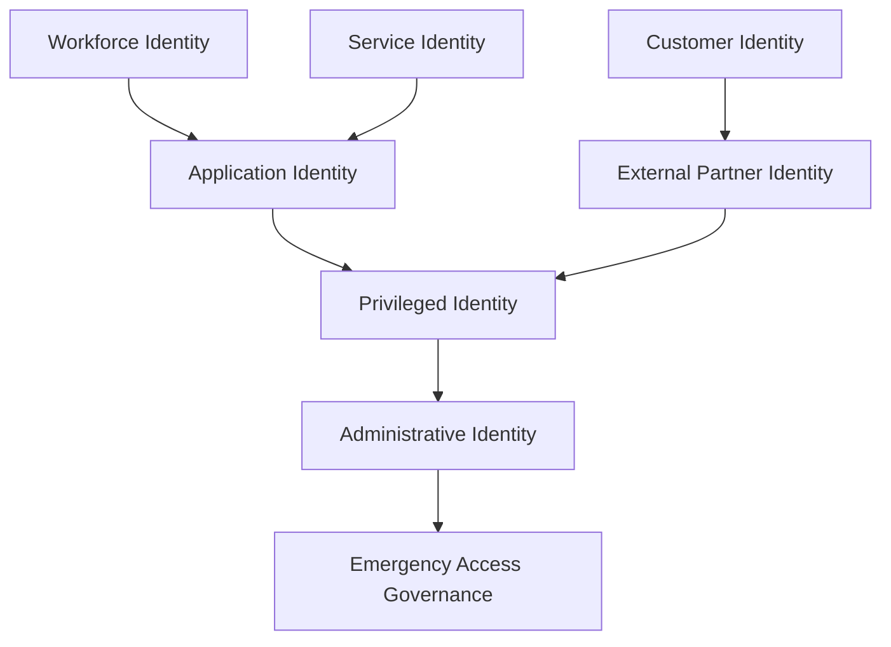
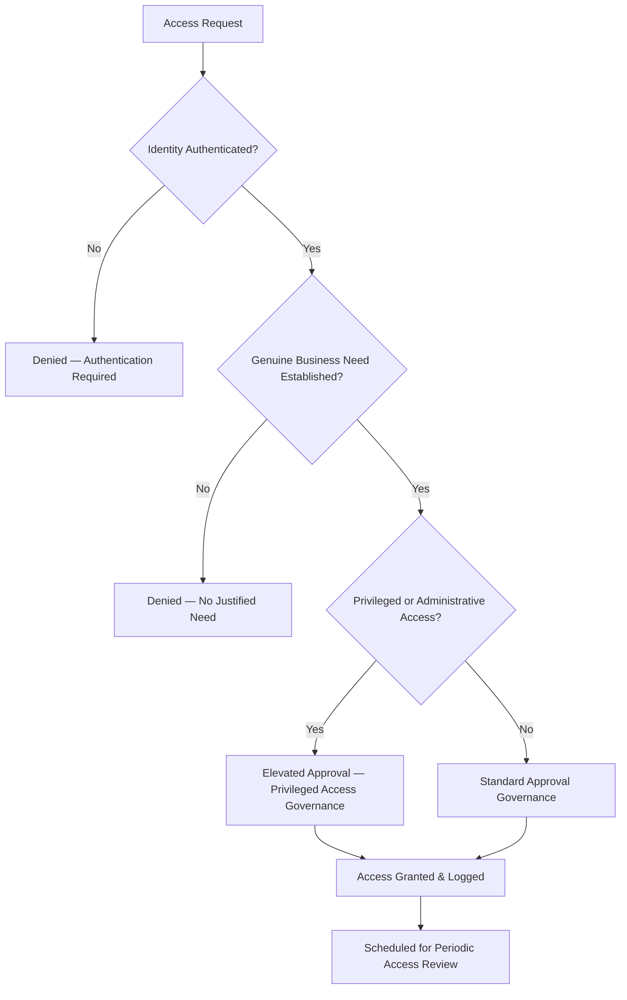
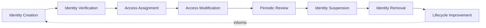
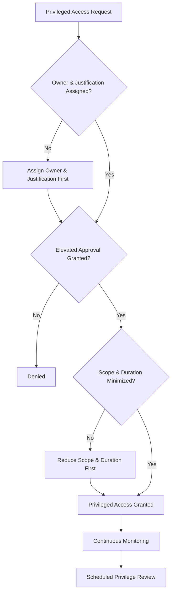
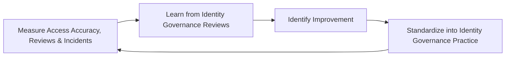
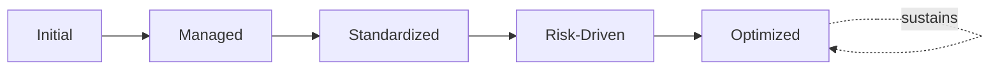

# Enterprise Identity and Access Governance Framework

## 1. Executive Summary

**Purpose** — This document defines the official Enterprise Identity and Access Governance Framework for **StackLeo Tech Store**. It establishes identity ownership, access governance, authentication principles, authorization governance, privilege management, lifecycle governance, accountability, executive oversight, and long-term identity maturity as a single, consolidated governance reference. `identity-access-strategy.md` remains the CISO/CIDO-owned executive charter for identity and access at StackLeo; `identity-access-management.md` remains the master operational governance framework holding identity, authentication, authorization, and Zero Trust practice together; and a family of dedicated elaborations — `authentication-strategy.md`, `authorization-model.md`, `privileged-access-management.md`, `identity-lifecycle-management.md`, `identity-federation.md`, `service-accounts-management.md`, and `access-review-governance.md` — govern each domain in full operational depth. This framework does not compete with any of them for authority. It is the consolidated governance reference that synthesizes accountability, risk, and executive oversight across every identity and access domain into one coherent document, for readers — auditors, new leaders, cross-functional stakeholders — who need the complete governance picture without independently assembling it from seven separate documents.

**Scope** — This framework applies to every category of identity and access at StackLeo — workforce, customer, privileged, service, application, external partner, and administrative identity, plus emergency access — coordinated with `identity-access-strategy.md`, `identity-access-management.md`, and `security-strategy.md`.

**Strategic Objectives** — To ensure every identity exists and persists only because an accountable person deliberately decided it should; that access is granted strictly on a genuine, need-based footing and never accumulates unreviewed; that privileged access carries proportionately elevated scrutiny; and that executive leadership has one coherent, consolidated view of the organization's identity and access governance posture.

**Business Value** — A consolidated identity and access governance reference protects the organization from the risk of governance gaps hiding in the seams between seven separately-maintained documents, protects auditors' and new leaders' ability to understand the full picture quickly, and gives executive leadership confidence that identity — the platform's durable security perimeter — is genuinely and coherently governed end to end.

**Intended Audience** — The Board of Directors, executive leadership, the Chief Technology Officer, security leadership, the Identity Governance Team, engineering leadership, operations teams, human resources, compliance teams, and business owners.

## 2. Enterprise Identity Vision

- **Identity as Security Foundation** — identity is governed as the foundation every other security domain ultimately depends on to know who is acting, consistent with `identity-access-strategy.md` (Section 1).
- **Trusted Access** — access is governed to be trustworthy by construction — granted deliberately, reviewed regularly, and removed promptly.
- **Business Protection** — identity governance protects the business from the disproportionate consequence of a compromised or misused identity.
- **User Accountability** — every action taken on the platform is governed to trace back to a specific, accountable identity.
- **Customer Trust** — identity governance protects the trust customers place in StackLeo with their credentials and account access.
- **Operational Security** — identity governance gives operations teams confidence that access reflects genuine, current business need.
- **Digital Identity Evolution** — identity governance is structured to evolve as StackLeo's identity landscape grows across web, mobile, physical, and future channels.

### Enterprise Identity Vision Matrix

| Vision Element | Focus | Business Value |
|---|---|---|
| Identity as Security Foundation | The foundation every other security domain depends on | Protects the platform's durable security perimeter |
| Trusted Access | Access trustworthy by construction | Reduces the risk of access silently drifting out of justification |
| Business Protection | Protection from a compromised or misused identity | Limits the genuine consequence of an identity-related failure |
| User Accountability | Every action traces to a specific, accountable identity | Enables confident investigation of any given occurrence |
| Customer Trust | Protects trust in credential and account handling | Protects the trust relationship every login depends on |
| Operational Security | Confidence that access reflects genuine business need | Supports informed day-to-day operational decisions |
| Digital Identity Evolution | Structured to evolve across every current and future channel | Protects the business consistently as channels diversify |

## 3. Identity Governance Principles

Identity and access governance at StackLeo rests on nine principles, each producing a specific business outcome.

- **Least Privilege** — every identity is granted only the access its defined purpose genuinely requires. *Business Value:* limits the genuine blast radius of a compromised credential or account.
- **Need-Based Access** — access is granted based on genuine business need, never organizational convenience or seniority alone. *Business Value:* prevents access from accumulating beyond what is genuinely justified.
- **Identity Ownership** — every identity category traces to a specific, named, responsible owner. *Business Value:* ensures no identity category drifts without someone genuinely responsible for it.
- **Accountability** — every access decision traces to a specific, accountable person who made it. *Business Value:* ensures access decisions can be genuinely defended, not merely assumed reasonable.
- **Transparency** — identity and access status is documented and visible to those who genuinely need it. *Business Value:* allows access posture to be scrutinized and defended, not merely trusted on faith.
- **Access Review** — every access grant is periodically reviewed for continued genuine justification. *Business Value:* prevents access from silently outliving the need that justified it.
- **Privacy Protection** — identity data is governed with the same protective discipline as any other sensitive personal data, coordinated with `privacy-governance.md`. *Business Value:* protects customer and employee trust from careless identity data handling.
- **Security by Design** — identity and access governance is considered from the outset of any capability, never retrofitted after the fact. *Business Value:* prevents the disproportionate cost of remediating access after a capability is already built.
- **Continuous Improvement** — identity governance practice matures over time, informed by real access and risk outcomes. *Business Value:* keeps governance aligned with the organization's growing scale and complexity.

### Identity Governance Principles Matrix

| Principle | Description | Business Value |
|---|---|---|
| Least Privilege | Access limited to the minimum genuinely necessary | Limits the genuine blast radius of a compromised credential |
| Need-Based Access | Granted on genuine business need, not convenience | Prevents access accumulating beyond what is genuinely justified |
| Identity Ownership | Every category traces to a specific, named, responsible owner | Ensures no category drifts without genuine responsibility |
| Accountability | Every access decision traces to the accountable person | Ensures decisions can be genuinely defended |
| Transparency | Status documented and visible to those who need it | Allows access posture to be scrutinized and defended |
| Access Review | Every grant periodically reviewed for continued justification | Prevents access outliving the need that justified it |
| Privacy Protection | Identity data governed with the same protective discipline | Protects trust from careless identity data handling |
| Security by Design | Considered from the outset, never retrofitted | Prevents the disproportionate cost of after-the-fact remediation |
| Continuous Improvement | Practice matures from real access and risk outcomes | Keeps governance aligned with growing scale and complexity |

## 4. Enterprise Identity Governance Model

Identity governance operates across eight conceptual domains, each holding accountability for a distinct category of identity. Operational depth for each domain remains authoritative in its dedicated elaboration, referenced below.

### Workforce Identity

- **Purpose** — govern the identity of every StackLeo employee and contractor.
- **Governance Scope** — coordinated with `identity-lifecycle-management.md` and Human Resources (Section 8).
- **Business Value** — protects the platform from the risk of an unmanaged or orphaned employee identity.
- **Executive Expectations** — leadership expects workforce identity to be created, modified, and removed in lockstep with genuine employment status.

### Customer Identity

- **Purpose** — govern the identity of every customer interacting with the platform.
- **Governance Scope** — coordinated with `privacy-governance.md`, given the elevated privacy sensitivity of customer identity data.
- **Business Value** — protects the trust relationship every customer login and transaction depends on.
- **Executive Expectations** — leadership expects customer identity governance to balance genuine security against a genuinely usable experience.

### Privileged Identity

- **Purpose** — govern identity carrying elevated access to sensitive systems or operations.
- **Governance Scope** — coordinated with `privileged-access-management.md` and Privileged Access Governance (Section 7).
- **Business Value** — protects the organization from the outsized consequence of a compromised privileged identity.
- **Executive Expectations** — leadership expects privileged identity to be held to the highest rigor in this model.

### Service Identity

- **Purpose** — govern the identity of system and machine actors operating without direct human interaction.
- **Governance Scope** — coordinated with `service-accounts-management.md` and `service-identity-governance.md`.
- **Business Value** — protects the platform from the risk of an unmanaged or over-privileged service account.
- **Executive Expectations** — leadership expects service identity to be governed with the same rigor as any human identity.

### Application Identity

- **Purpose** — govern the identity through which one application or service authenticates to another.
- **Governance Scope** — coordinated with `authentication-strategy.md` and `05_API/api-governance.md`.
- **Business Value** — protects the integrity of trust between the platform's internal components.
- **Executive Expectations** — leadership expects application identity to be governed as deliberately as any customer-facing credential.

### External Partner Identity

- **Purpose** — govern the identity of vendors, wholesale partners, and future marketplace sellers.
- **Governance Scope** — coordinated with `identity-federation.md` and `06_Security/third-party-risk-governance.md`.
- **Business Value** — protects the platform from risk introduced through an external relationship StackLeo does not directly control.
- **Executive Expectations** — leadership expects external partner identity to be governed with elevated scrutiny given reduced direct oversight.

### Administrative Identity

- **Purpose** — govern identity carrying administrative control over platform configuration or governance itself.
- **Governance Scope** — coordinated with Privileged Access Governance (Section 7), held to the highest rigor in this model.
- **Business Value** — protects the organization from the most consequential category of identity compromise.
- **Executive Expectations** — leadership expects administrative identity to be minimal in number and continuously monitored.

### Emergency Access Governance

- **Purpose** — govern the exceptional, time-bound grant of elevated access during a genuine emergency.
- **Governance Scope** — coordinated with `09_Operations/incident-management.md` and Privileged Access Governance (Section 7).
- **Business Value** — protects the organization's ability to respond to a genuine crisis without abandoning access discipline entirely.
- **Executive Expectations** — leadership expects emergency access to be time-bound, logged, and reviewed without exception.

### Identity Governance Matrix

| Domain | Purpose | Business Value | Executive Expectations |
|---|---|---|---|
| Workforce Identity | Govern the identity of employees and contractors | Protects against an unmanaged or orphaned identity | Expects lockstep with genuine employment status |
| Customer Identity | Govern the identity of every customer | Protects the trust relationship every login depends on | Expects balance of security against genuine usability |
| Privileged Identity | Govern identity with elevated access | Protects against the outsized consequence of compromise | Expects the highest rigor in this model |
| Service Identity | Govern the identity of system and machine actors | Protects against an unmanaged or over-privileged account | Expects rigor equal to any human identity |
| Application Identity | Govern identity between applications and services | Protects the integrity of internal component trust | Expects governance as deliberate as any customer credential |
| External Partner Identity | Govern the identity of vendors and partners | Protects against risk from an externally-controlled relationship | Expects elevated scrutiny given reduced direct oversight |
| Administrative Identity | Govern identity with administrative control | Protects against the most consequential compromise category | Expects minimal number and continuous monitoring |
| Emergency Access Governance | Govern exceptional, time-bound emergency access | Protects crisis response without abandoning access discipline | Expects time-bound, logged, and reviewed access without exception |

*Diagram 1: Enterprise Identity Governance Framework — workforce, customer, and service identity feed application identity, converging with external partner identity into privileged identity, which flows into administrative identity and, in exceptional circumstances, emergency access governance.*

## 5. Access Governance Framework

Access is governed across eight conceptual layers, each requiring a distinct governance emphasis. Operational depth for authentication and authorization mechanics remains authoritative in `authentication-strategy.md` and `authorization-model.md`.

- **Authentication Governance** — governs how an identity's claimed identity is verified before access is extended.
- **Authorization Governance** — governs how an authenticated identity's scope of permitted action is determined.
- **Role Governance** — governs how access is grouped into genuinely coherent, business-meaningful roles.
- **Permission Governance** — governs how an individual permission within a role is defined and justified.
- **Privilege Governance** — governs how elevated access beyond standard role permission is deliberately extended.
- **Access Approval Governance** — governs how an access request is genuinely reviewed and approved before it takes effect.
- **Access Review Governance** — governs the periodic, formal review of existing access for continued justification, coordinated with `access-review-governance.md`.
- **Access Removal Governance** — governs how access is promptly and completely removed once it is no longer genuinely justified.

### Access Governance Matrix

| Governance Area | Governance Focus | Coordination |
|---|---|---|
| Authentication Governance | Verifying claimed identity before access is extended | `authentication-strategy.md` |
| Authorization Governance | Determining an authenticated identity's permitted scope | `authorization-model.md` |
| Role Governance | Grouping access into coherent, business-meaningful roles | Identity Ownership (Section 3) |
| Permission Governance | Defining and justifying an individual permission | Need-Based Access (Section 3) |
| Privilege Governance | Deliberately extending elevated access | Privileged Access Governance (Section 7) |
| Access Approval Governance | Genuinely reviewing and approving a request | Accountability (Section 3) |
| Access Review Governance | Periodic review of existing access for justification | `access-review-governance.md` |
| Access Removal Governance | Prompt, complete removal once unjustified | Identity Lifecycle Governance (Section 6) |

*Diagram 3: Access Governance Decision Flow — an access request is checked for authentication and genuine business need, routed to elevated approval for privileged or administrative access, resolving into a logged grant scheduled for periodic review.*

## 6. Identity Lifecycle Governance

Identity governance operates across eight conceptual lifecycle stages, coordinated with `identity-lifecycle-management.md`.

- **Identity Creation** — govern how a new identity is established only through an authorized, deliberate process.
- **Identity Verification** — govern how a created identity's claimed attributes are genuinely confirmed.
- **Access Assignment** — govern how initial access is assigned to a verified identity based on genuine role and need.
- **Access Modification** — govern how a change in an identity's access is deliberately reviewed and approved.
- **Periodic Review** — govern the recurring, formal confirmation that an identity's access remains genuinely justified.
- **Identity Suspension** — govern how an identity's access is promptly suspended when its justification is temporarily interrupted.
- **Identity Removal** — govern how an identity and its access are completely and promptly removed once no longer justified.
- **Lifecycle Improvement** — govern how lifecycle practice is deliberately strengthened based on real operational outcomes.

### Identity Lifecycle Matrix

| Stage | Governance Objective | Business Value |
|---|---|---|
| Identity Creation | Establish a new identity only through an authorized process | Prevents identities from being created outside governance |
| Identity Verification | Genuinely confirm a created identity's claimed attributes | Protects against a fraudulently established identity |
| Access Assignment | Assign initial access based on genuine role and need | Ensures access begins proportionate to genuine need |
| Access Modification | Deliberately review and approve an access change | Prevents access from drifting without genuine review |
| Periodic Review | Recurring confirmation access remains justified | Prevents access outliving the need that justified it |
| Identity Suspension | Promptly suspend access when justification is interrupted | Limits exposure during a genuine, temporary gap |
| Identity Removal | Completely and promptly remove unjustified identity | Prevents an orphaned identity from persisting as risk |
| Lifecycle Improvement | Strengthen practice from real operational outcomes | Keeps lifecycle practice compounding in capability |

*Diagram 2: Identity Lifecycle Governance Model — identity creation and verification inform access assignment and modification, feeding periodic review, with suspension and removal governed deliberately, and lifecycle improvement feeding lessons back into the cycle.*

## 7. Privileged Access Governance

- **Administrative Access** — governs access carrying control over platform configuration, coordinated with Administrative Identity (Section 4).
- **High-Risk Access** — governs access whose misuse would carry a genuinely disproportionate consequence.
- **Sensitive Operations** — governs the deliberate additional scrutiny applied to a genuinely sensitive operation, regardless of the identity performing it.
- **Accountability** — governs every privileged access grant's traceability to a specific, named, responsible owner.
- **Approval Governance** — governs how a privileged access request is reviewed and approved with elevated rigor before it takes effect.
- **Monitoring Responsibility** — governs the continuous observation of privileged access activity for genuine anomaly or misuse.
- **Risk Reduction** — governs how privileged access is deliberately minimized in scope, duration, and number of holders.

### Privilege Governance Matrix

| Governance Area | Focus | Coordination |
|---|---|---|
| Administrative Access | Control over platform configuration | Administrative Identity (Section 4) |
| High-Risk Access | Access whose misuse carries disproportionate consequence | Identity & Access Risk Governance (Section 9) |
| Sensitive Operations | Additional scrutiny regardless of the identity performing it | `privileged-access-management.md` |
| Accountability | Traceability to a specific, named, responsible owner | Accountability (Section 3) |
| Approval Governance | Elevated-rigor review before access takes effect | Access Approval Governance (Section 5) |
| Monitoring Responsibility | Continuous observation for anomaly or misuse | `06_Security/security-monitoring.md` |
| Risk Reduction | Deliberate minimization of scope, duration, and holders | Least Privilege (Section 3) |

*Diagram 4: Privilege Management Governance Structure — a privileged access request requires assigned ownership and justification, elevated approval, and minimized scope and duration before it is granted, continuously monitored, and scheduled for privilege review.*

## 8. Organizational Governance

Governance accountability is distributed deliberately across ten organizational roles.

- **Board of Directors** — holds ultimate accountability for StackLeo's overall identity and access risk posture.
- **Executive Leadership** — holds accountability for whether identity governance genuinely serves the business, in partnership with the Board.
- **Chief Technology Officer** — owns the coherence of this framework's synthesis across `identity-access-strategy.md` and `identity-access-management.md`.
- **Security Leadership** — owns the operational governance defined in `identity-access-management.md` and its family of elaborations.
- **Identity Governance Team** — owns the day-to-day execution of Identity Lifecycle Governance (Section 6) and Access Governance (Section 5).
- **Engineering Leadership** — owns Application and Service Identity (Section 4) within their accountable teams.
- **Operations Teams** — own Operational Security's identity-relevant practice in coordination with `09_Operations/operations-governance.md`.
- **Human Resources** — own Workforce Identity's (Section 4) alignment with genuine employment status.
- **Compliance Teams** — own this framework's alignment with `compliance-governance.md`.
- **Business Owners** — own External Partner Identity's (Section 4) alignment with genuine business relationships.

### Organizational Responsibility Matrix

| Role | Governance Objective | Business Value |
|---|---|---|
| Board of Directors | Hold ultimate accountability for identity and access risk posture | Provides the highest point of ultimate accountability |
| Executive Leadership | Hold accountability for identity governance serving the business | Provides a single point of executive-level accountability |
| Chief Technology Officer | Own coherence of this framework's synthesis | Connects the consolidated view to authoritative sources |
| Security Leadership | Own operational governance and its family of elaborations | Applies governance to day-to-day identity practice |
| Identity Governance Team | Own day-to-day execution of lifecycle and access governance | Ensures governance is genuinely, continuously executed |
| Engineering Leadership | Own application and service identity | Embeds accountability closest to where identities are created |
| Operations Teams | Own identity-relevant operational practice | Ensures accountability extends into sustained operation |
| Human Resources | Own workforce identity alignment with employment status | Ensures identity lockstep with genuine employment reality |
| Compliance Teams | Own alignment with `compliance-governance.md` | Ensures governance genuinely meets regulatory obligation |
| Business Owners | Own external partner identity alignment | Connects identity governance to genuine business relationships |

## 9. Identity & Access Risk Governance

Identity and access-related risk is governed across eight conceptual categories.

- **Unauthorized Access Risks** — the risk that an identity accesses a resource without genuine authorization.
- **Excessive Privileges** — the risk that an identity holds more access than its genuine purpose requires.
- **Identity Misuse** — the risk that a legitimate identity is genuinely used for an unauthorized or harmful purpose.
- **Access Accumulation** — the risk that an identity's access grows over time without corresponding removal of what is no longer needed.
- **Insider Risks** — the risk that a legitimate, trusted identity is the source of a genuine security incident.
- **Compliance Risks** — the risk that identity and access practice fails to meet a genuine regulatory or contractual obligation.
- **Business Impact Risks** — the risk that an identity-related failure produces genuine, material harm to the business.
- **Reputation Risks** — the risk that an identity-related failure damages StackLeo's standing with customers, partners, or the market.

### Identity Risk Matrix

| Risk Category | Focus | Governance Coordination |
|---|---|---|
| Unauthorized Access Risks | Access without genuine authorization | Coordinated with Authorization Governance (Section 5) |
| Excessive Privileges | Access beyond genuine purpose | Coordinated with Least Privilege (Section 3) |
| Identity Misuse | A legitimate identity used for unauthorized purpose | Coordinated with Monitoring Responsibility (Section 7) |
| Access Accumulation | Access growing without corresponding removal | Coordinated with Access Review Governance (Section 5) |
| Insider Risks | A trusted identity as the source of an incident | Coordinated with `06_Security/security-monitoring.md` |
| Compliance Risks | Failure to meet regulatory or contractual obligation | Coordinated with `compliance-governance.md` |
| Business Impact Risks | Genuine, material harm to the business | Coordinated with `security-risk-management.md` |
| Reputation Risks | Damage to standing with customers, partners, market | Coordinated with Executive Oversight (Section 10) |

## 10. Executive Oversight

- **Identity Governance Reviews** — the overall coherence of this consolidated framework is formally reviewed on a regular cadence.
- **Access Risk Reviews** — the organization's genuine access risk posture is reviewed directly with executive leadership.
- **Privilege Reviews** — privileged and administrative access is reviewed directly with executive leadership.
- **Compliance Reviews** — identity and access adherence to regulatory and contractual obligation is periodically reviewed.
- **Security Performance Reviews** — the genuine effectiveness of identity and access practice is reviewed as a distinct, ongoing concern.
- **Continuous Improvement Reviews** — the organization's follow-through on captured identity governance lessons is reviewed directly with executive leadership.

### Executive Oversight Matrix

| Oversight Mechanism | Purpose | Governance Role |
|---|---|---|
| Identity Governance Reviews | Confirm overall consolidated framework coherence | Regular, predictable cadence for the framework as a whole |
| Access Risk Reviews | Review genuine access risk posture | Direct executive-level review of risk exposure |
| Privilege Reviews | Review privileged and administrative access | Direct executive-level review of the highest-rigor domain |
| Compliance Reviews | Review adherence to regulatory and contractual obligation | Periodic executive-level compliance review |
| Security Performance Reviews | Review genuine effectiveness of identity practice | Treats effectiveness as ongoing, not assumed |
| Continuous Improvement Reviews | Review follow-through on captured lessons | Direct executive-level review of improvement completion |

## 11. Future Readiness

This framework is designed to remain valid as StackLeo evolves in scale, geography, and organizational complexity.

- **Adaptive Identity Governance** — as access decisions increasingly incorporate contextual, adaptive signals, that capability remains governed under Authorization Governance (Section 5) at the same rigor as any other method.
- **AI-Assisted Access Intelligence** — as access review increasingly incorporates AI-assisted methods, coordinated with `04_Database/ai-governance.md`, they remain governed under Access Review Governance (Section 5) at the same rigor as any other method.
- **Zero Trust Identity Evolution (Conceptual)** — as the trust-verification posture established in `zero-trust-strategy.md` matures, it remains governed as a standing commitment under Authentication Governance (Section 5).
- **Passwordless Identity Evolution (Conceptual)** — where authentication increasingly moves beyond passwords, that evolution remains governed under Authentication Governance (Section 5) at the same rigor as any other verification method.
- **Global Identity Management** — Identity Creation and Access Assignment (Section 6) are structured to be re-applied as StackLeo expands from Bangladesh into South Asia and global markets, each with genuinely distinct identity and privacy conditions.
- **Digital Trust Ecosystems** — this framework's governance discipline is treated as a direct, durable contributor to the digital trust customers, partners, and regulators extend to StackLeo.

## 12. Identity Governance Maturity Model

Identity governance maturity is described across five conceptual levels.

- **Initial** — identity governance, where it exists, is informal and inconsistent; access is granted reactively, and ownership is unclear.
- **Managed** — basic identity governance exists for individual domains, but consistency across the eight domains in Section 4 varies significantly.
- **Standardized** — the governance model, domains, and lifecycle are standardized, documented, and consistently applied across the organization.
- **Risk-Driven** — access decisions are genuinely and routinely made from evidenced risk understanding, not assumption.
- **Optimized** — identity governance is continuously and deliberately improved based on quantitative evidence and organizational learning; improvement itself is a managed, ongoing discipline.

### Identity Maturity Matrix

| Level | Characteristics | Primary Focus |
|---|---|---|
| Initial | Informal, inconsistent governance; access granted reactively | Ad hoc, individually-dependent identity practice |
| Managed | Basic governance exists per domain; consistency varies | Domain-level consistency |
| Standardized | Standardized governance model, domains, and lifecycle | Organization-wide consistency and clear ownership |
| Risk-Driven | Access decisions genuinely and routinely risk-informed | Evidence-based access decision-making |
| Optimized | Practice continuously and deliberately improved from evidence | Sustained, deliberate improvement as a discipline |

*Diagram 5: Continuous Identity Improvement Cycle — access accuracy, review completion, and identity-related incidents are measured, learned from, improved upon, and standardized back into governed practice, on a continuing basis.*

*Diagram 6: Identity Governance Maturity Progression — maturity advances from informal, reactively-granted access practice toward standardized, genuinely risk-driven, and continuously optimized identity governance.*

## 13. Identity & Access Anti-Patterns

- **Shared Identities** — multiple people using a single identity destroys the accountability every access decision depends on.
- **Excessive Privileges** — granting more access than a genuine purpose requires expands the blast radius of any single compromise.
- **Missing Ownership** — an identity category with no accountable owner has no one genuinely responsible for its governance.
- **Weak Access Reviews** — reviews performed as a formality rather than a genuine confirmation allow unjustified access to persist unnoticed.
- **Permanent Access** — access granted without a genuine review or expiration point accumulates indefinitely.
- **Poor Lifecycle Management** — an identity not promptly suspended or removed when its justification ends persists as unnecessary risk.
- **Security Without Accountability** — technical controls without genuine, named ownership behind them leave no one accountable when they fail.
- **Reactive Identity Governance** — addressing identity governance only once an incident has already occurred forfeits the chance to prevent it.

### Anti-Pattern Summary

| Anti-Pattern | Organizational & Business Impact |
|---|---|
| Shared Identities | Destroys the accountability every access decision depends on |
| Excessive Privileges | Expands the blast radius of any single compromise |
| Missing Ownership | Leaves no one genuinely responsible for a category's governance |
| Weak Access Reviews | Allows unjustified access to persist unnoticed |
| Permanent Access | Accumulates indefinitely without genuine review or expiration |
| Poor Lifecycle Management | Leaves unnecessary risk persisting after justification ends |
| Security Without Accountability | Leaves no one accountable when a control fails |
| Reactive Identity Governance | Forfeits the chance to prevent an incident before it occurs |

## Related Documents

| Document | Relationship |
|---|---|
| `identity-access-strategy.md` | The CISO/CIDO-owned executive charter this framework consolidates a governance-level view of, without restating its philosophy. |
| `identity-access-management.md` | The master operational governance framework this document's domains and lifecycle synthesize a consolidated reference from. |
| `security-strategy.md` | Sets the enterprise-wide security strategic direction this framework's Identity Security domain elaborates. |
| `application-security.md` | Elaborates the application-specific security practice this framework's Application Identity (Section 4) coordinates with. |
| `privacy-governance.md` | Elaborates the privacy discipline this framework's Privacy Protection principle (Section 3) depends on. |
| `security-risk-management.md` | Elaborates the operational risk management practice this framework's Identity & Access Risk Governance (Section 9) coordinates with. |
| `compliance-governance.md` | Elaborates the compliance discipline this framework's Compliance Teams responsibility (Section 8) coordinates with. |
| `security-roadmap.md` | Elaborates the time-bound execution plan this framework's Identity Governance Maturity Model (Section 12) informs. |
| `security-maturity-framework.md` | Consolidates this framework's Identity Maturity Model (Section 12) into the enterprise-wide capability maturity picture. |
| `enterprise-risk-management-strategy.md` | Governs the enterprise risk discipline this framework's Identity & Access Risk Governance (Section 9) is the identity-specific instantiation of. |

## Document Information

| Property | Value |
|----------|-------|
| Document | identity-access-governance.md |
| Version | 1.0.0 |
| Status | Active |
| Maintained By | StackLeo |
| Last Updated | 2026-07-28 |

---

© StackLeo. All Rights Reserved.
