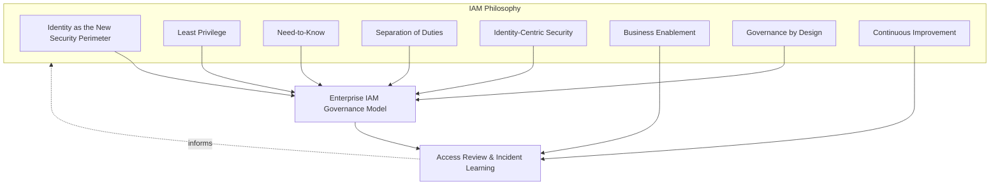
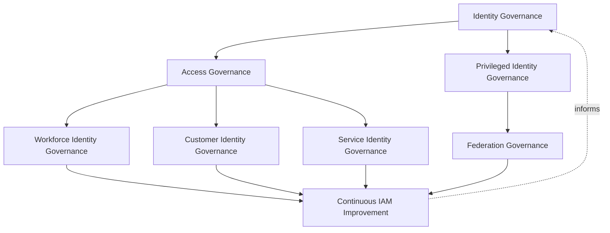
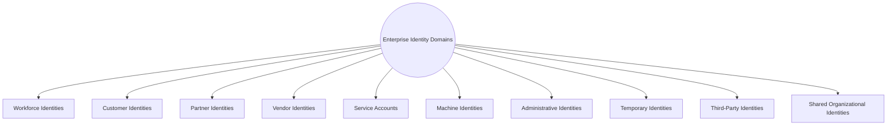
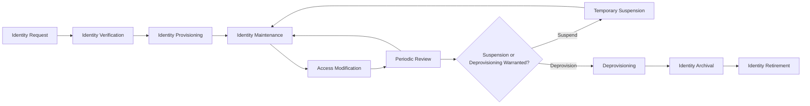
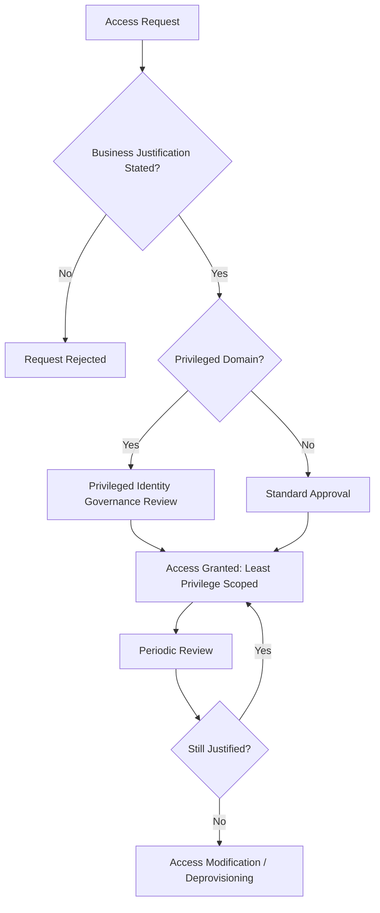
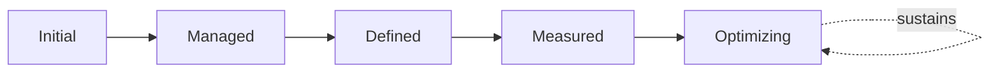
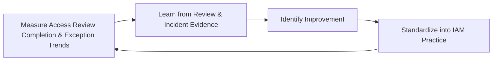

# Enterprise Identity & Access Management Strategy

## 1. Document Purpose

This document defines the official Enterprise Identity & Access Management (IAM) Strategy for **StackLeo Tech Store**. It is the master governance framework for identity and access across the platform — the document that holds `identity-management.md` (identity lifecycle and categories), `authentication.md` (identity verification), `authorization.md` (access scoping), and `zero-trust-strategy.md` (trust posture) together as a coherent, accountable governance whole, without redefining what any of them individually establish.

- **Purpose of Identity & Access Management** — to ensure that every identity interacting with the platform — human or machine — and every access decision made on its behalf, is governed deliberately, by accountable people, against a consistent set of principles, rather than left to accumulate as ad hoc, per-team practice.
- **Relationship with Security Governance** — this document is the identity-specific elaboration of Identity Governance in `security-governance.md` (Section 3.3); it defines specifically how identity and access are governed across the workforce, customer, partner, and machine domains this strategy introduces.
- **Relationship with Zero Trust** — this framework operationalizes `zero-trust-strategy.md`'s "never trust, always verify" posture into concrete governance accountability — who owns verification decisions, who reviews access, and who is accountable when trust is extended.
- **Relationship with Enterprise Architecture** — identity is architected as the platform's durable security perimeter in `security-architecture.md` (Section 3.1, Identity Security); this document governs how that architectural commitment is sustained organizationally over time.
- **Relationship with Risk Management** — identity-related risk — excessive privilege, orphaned accounts, weak verification — is a distinct, tracked category within `security-risk-management.md` (Section 4), governed here at the domain-specific level.
- **Relationship with Privacy** — identity data is itself sensitive customer and business data; this framework's governance is coordinated with `privacy.md` and `data-protection.md` to ensure identity information is handled under the same protective discipline as any other sensitive data.
- **Relationship with Business Operations** — IAM governance directly enables `01_Business/business-model.md`; every new business relationship — a corporate customer, a wholesale partner, a marketplace seller — introduces a new identity relationship this framework must be structured to absorb.

This document is implementation-independent and vendor-neutral. It defines IAM governance philosophy, model, domains, and lifecycle conceptually — not specific IAM vendors, Identity Providers, authentication platforms, SSO products, directory services, cloud providers, authentication mechanisms, authorization models, token formats, protocols, implementation workflows, infrastructure configurations, or deployment architectures.

## 2. IAM Philosophy

IAM governance at StackLeo is built on eight principles. Each exists to produce a specific business outcome — identity is governed deliberately because it is the foundation every other security domain depends on, not as administrative overhead.

### 2.1 Identity as the New Security Perimeter

As StackLeo operates across Web, future Mobile App, future Physical Store, and future POS channels, no fixed network boundary can serve as a meaningful perimeter; identity itself becomes the durable boundary of trust, consistent with `identity-management.md` (Section 2).

- **Business Value** — protects the business consistently across every current and future channel, rather than depending on a network boundary that channel diversity makes unreliable.

### 2.2 Least Privilege

Every identity, regardless of category (Section 4), is granted only the access its defined purpose genuinely requires.

- **Business Value** — limits the blast radius of any single compromised identity, reducing the consequence of an inevitable eventual failure.

### 2.3 Need-to-Know

Access to information is granted only where a genuine, defined need exists, distinct from but complementary to Least Privilege's focus on functional access.

- **Business Value** — protects sensitive information from unnecessary exposure even to identities that otherwise hold legitimate system access.

### 2.4 Separation of Duties

No single identity holds unchecked authority over a complete, sensitive business process end to end, where genuine risk warrants division of responsibility.

- **Business Value** — prevents a single compromised or malicious identity from unilaterally causing significant harm, whether through error or intent.

### 2.5 Identity-Centric Security

Every access decision across the platform begins with a verified identity, never with network origin or convenience alone, consistent with `security-principles.md` (Section 3.4).

- **Business Value** — ensures access decisions are always grounded in a genuine, accountable identity, not an assumption of trust based on circumstance.

### 2.6 Business Enablement

IAM governance exists to let the business operate and grow safely — from single-seller B2C toward corporate sales, wholesale, and the multi-vendor marketplace — not to obstruct legitimate activity with disproportionate friction.

- **Business Value** — keeps IAM governance genuinely followed rather than resented and quietly bypassed as an obstacle to real work.

### 2.7 Governance by Design

IAM governance structures are established deliberately as identity capability is built, not retrofitted once identity sprawl or excessive privilege has already emerged.

- **Business Value** — prevents the costly, high-visibility discovery of IAM governance gaps only after an incident has already demonstrated their absence.

### 2.8 Continuous Improvement

IAM governance practice matures over time, informed by real access review findings, incidents, and the organization's growth in scale and complexity.

- **Business Value** — keeps identity governance aligned with StackLeo's growth in workforce, customer base, and partner ecosystem.

*Diagram: IAM Philosophy Overview — the eight principles shape the enterprise IAM governance model, and access review and incident learning feed back into the philosophy itself.*

## 3. Enterprise IAM Governance Model

IAM governance operates across eight conceptual layers, each holding accountability for a distinct dimension of identity and access practice.

### 3.1 Identity Governance

- **Purpose** — own the coherence of identity lifecycle and categorization practice, elaborated fully in `identity-management.md`.
- **Governance Scope** — oversight of how identities are created, maintained, and retired across every category in Section 4.
- **Business Value** — ensures every identity's existence and state can be reasoned about consistently as the organization grows.
- **Executive Expectations** — leadership trusts that no identity exists outside this framework's visibility.

### 3.2 Access Governance

- **Purpose** — own the coherence of authorization and access-scoping practice, elaborated fully in `authorization.md`.
- **Governance Scope** — oversight of how access is granted, reviewed, and revoked across every identity category.
- **Business Value** — ensures access decisions consistently reflect Least Privilege (Section 2.2) rather than individual team judgment.
- **Executive Expectations** — leadership trusts that access, once granted, does not silently persist beyond genuine need.

### 3.3 Privileged Identity Governance

- **Purpose** — own the elevated governance rigor administrative and other high-impact identities require.
- **Governance Scope** — oversight of Administrative Identities (Section 4.7) and any identity with capability to affect the platform broadly; the full dedicated lifecycle, domains, and executive oversight for privileged access are elaborated in `privileged-access-management.md`.
- **Business Value** — ensures the identities with the greatest potential impact receive commensurately greater scrutiny.
- **Executive Expectations** — leadership expects privileged access to be rare, justified, time-bound where feasible, and closely reviewed.

### 3.4 Workforce Identity Governance

- **Purpose** — own the governance of identities representing StackLeo's own employees and contractors.
- **Governance Scope** — oversight of Workforce Identities (Section 4.1) across their employment lifecycle.
- **Business Value** — ensures workforce access reflects actual role and employment status, not historical assignment.
- **Executive Expectations** — leadership trusts workforce access is promptly adjusted as roles and employment status change.

### 3.5 Customer Identity Governance

- **Purpose** — own the governance of identities representing StackLeo's customers.
- **Governance Scope** — oversight of Customer Identities (Section 4.2), coordinated with `privacy.md` given the sensitivity of customer data.
- **Business Value** — protects the trust relationship every customer transaction depends on.
- **Executive Expectations** — leadership expects customer identity governance to scale smoothly as the customer base grows.

### 3.6 Service Identity Governance

- **Purpose** — own the governance of non-human identities — service accounts and machine identities.
- **Governance Scope** — oversight of Service Accounts and Machine Identities (Sections 4.5–4.6); the full dedicated governance model, domains, and lifecycle for every non-human identity are elaborated in `service-accounts-management.md`.
- **Business Value** — prevents non-human identities from becoming an ungoverned blind spot, since they are often granted broad access by default.
- **Executive Expectations** — leadership trusts that machine identities receive the same governance rigor as human ones, not less.

### 3.7 Federation Governance

- **Purpose** — own the governance of identity trust extended to or received from external parties.
- **Governance Scope** — oversight of Partner, Vendor, and Third-Party Identities (Sections 4.3, 4.4, 4.9), anticipating future federation with marketplace sellers and B2B customers; the full dedicated governance model, trust domains, and lifecycle are elaborated in `identity-federation.md`.
- **Business Value** — ensures external identity trust is deliberately scoped, never assumed equivalent to internal trust.
- **Executive Expectations** — leadership expects federation arrangements to be reviewed before being trusted, not discovered informally.

### 3.8 Continuous IAM Improvement

- **Purpose** — govern the mechanism by which every other layer in this model matures over time.
- **Governance Scope** — consolidates findings from Periodic Review (Section 5.6) and access governance reviews across every domain.
- **Business Value** — prevents IAM governance itself from becoming the next thing that quietly stagnates as the organization scales.
- **Executive Expectations** — leadership expects IAM maturity to be assessed periodically, not assumed static once established.

### IAM Governance Model Matrix

| Layer | Purpose | Business Value | Executive Expectations |
|---|---|---|---|
| Identity Governance | Own coherence of identity lifecycle and categorization | Ensures every identity is reasoned about consistently | Trusts no identity exists outside this framework's visibility |
| Access Governance | Own coherence of authorization and access-scoping | Ensures access reflects Least Privilege consistently | Trusts access doesn't silently persist beyond genuine need |
| Privileged Identity Governance | Own elevated rigor for administrative/high-impact identities | Ensures greatest-impact identities receive greatest scrutiny | Expects privileged access to be rare, justified, closely reviewed |
| Workforce Identity Governance | Own governance of employee/contractor identities | Ensures access reflects actual role and status | Trusts access is promptly adjusted as roles change |
| Customer Identity Governance | Own governance of customer identities | Protects the trust relationship every transaction depends on | Expects governance to scale smoothly with customer growth |
| Service Identity Governance | Own governance of non-human identities | Prevents machine identities becoming an ungoverned blind spot | Trusts machine identities get the same rigor as human ones |
| Federation Governance | Own governance of external identity trust | Ensures external trust is deliberately scoped, never assumed | Expects federation to be reviewed before being trusted |
| Continuous IAM Improvement | Govern maturation of every other layer | Prevents governance itself from stagnating | Expects maturity to be assessed periodically |

*Diagram 1: Enterprise IAM Governance Framework — eight layers spanning foundational identity and access governance through domain-specific oversight, converging on continuous improvement that feeds back into the model.*

## 4. Enterprise Identity Domains

Identity is organized across ten conceptual domains, each requiring a somewhat different governance emphasis.

### 4.1 Workforce Identities

- **Purpose** — represent StackLeo's own employees across their employment lifecycle.
- **Governance Scope** — governed under Workforce Identity Governance (Section 3.4), coordinated with HR processes for onboarding and offboarding.
- **Business Importance** — protects internal systems and data from access that has outlived its legitimate employment basis.
- **Executive Expectations** — leadership expects workforce identity changes to be triggered promptly by employment status change.

### 4.2 Customer Identities

- **Purpose** — represent individual shoppers' accounts and their relationship with StackLeo, elaborated in `identity-management.md`.
- **Governance Scope** — governed under Customer Identity Governance (Section 3.5), coordinated with `privacy.md`.
- **Business Importance** — foundation of the direct-to-consumer relationship and repeat commerce.
- **Executive Expectations** — leadership expects customer identity governance to protect trust without adding friction to genuine shopping.

### 4.3 Partner Identities

- **Purpose** — represent future marketplace sellers and B2B business relationships.
- **Governance Scope** — governed under Federation Governance (Section 3.7), anticipating the multi-vendor marketplace model.
- **Business Importance** — will become foundational to the marketplace business model as it launches.
- **Executive Expectations** — leadership expects partner identity governance to be designed ahead of, not after, marketplace launch.

### 4.4 Vendor Identities

- **Purpose** — represent external suppliers and service providers — payment, courier, communication providers.
- **Governance Scope** — governed under Federation Governance (Section 3.7), coordinated with Third-Party Risks in `security-risk-management.md` (Section 4.6).
- **Business Importance** — protects the integrations the commerce experience directly depends on.
- **Executive Expectations** — leadership expects vendor identity access to be scoped narrowly to the specific integration purpose.

### 4.5 Service Accounts

- **Purpose** — represent non-human identities used by application components to interact with one another.
- **Governance Scope** — governed under Service Identity Governance (Section 3.6).
- **Business Importance** — protects against the common failure mode where service accounts accumulate broad, unreviewed access over time.
- **Executive Expectations** — leadership expects service accounts to be inventoried and reviewed with the same rigor as human accounts.

### 4.6 Machine Identities

- **Purpose** — represent devices, workloads, and automated processes requiring their own verifiable identity.
- **Governance Scope** — governed under Service Identity Governance (Section 3.6), distinct from service accounts in representing infrastructure-level rather than application-level actors.
- **Business Importance** — protects the infrastructure layer from unauthorized machine-to-machine interaction.
- **Executive Expectations** — leadership expects machine identity growth to be anticipated as infrastructure scales, not discovered after the fact.

### 4.7 Administrative Identities

- **Purpose** — represent identities with elevated capability to administer platform, security, or business-critical systems.
- **Governance Scope** — governed under Privileged Identity Governance (Section 3.3), the highest-scrutiny domain in this framework.
- **Business Importance** — protects against the single highest-consequence category of identity compromise.
- **Executive Expectations** — leadership expects administrative identity grants to require explicit, documented justification.

### 4.8 Temporary Identities

- **Purpose** — represent identities granted for a bounded purpose or duration — contractors, seasonal staff, time-limited access needs.
- **Governance Scope** — governed jointly across Workforce and Access Governance (Sections 3.4, 3.2), with mandatory expiration as a defining characteristic.
- **Business Importance** — prevents temporary access needs from becoming permanent, unreviewed grants.
- **Executive Expectations** — leadership expects every temporary identity to carry an explicit expiration, never open-ended by default.

### 4.9 Third-Party Identities

- **Purpose** — represent external identities StackLeo does not directly control but must extend some degree of trust to.
- **Governance Scope** — governed under Federation Governance (Section 3.7), distinct from Vendor Identities in representing broader third-party access scenarios.
- **Business Importance** — protects against risk introduced by parties outside StackLeo's direct organizational control.
- **Executive Expectations** — leadership expects third-party identity trust to be reviewed before extension, not assumed.

### 4.10 Shared Organizational Identities

- **Purpose** — represent identities used by more than one individual, recognized here specifically to govern their deliberate minimization.
- **Governance Scope** — governed under Access Governance (Section 3.2), with a standing expectation that shared identities are the exception, not the norm.
- **Business Importance** — protects individual accountability, since a shared identity cannot attribute an action to a specific person.
- **Executive Expectations** — leadership expects shared identities to require explicit justification and compensating oversight, consistent with the anti-pattern in Section 10.1.

### Enterprise Identity Domain Matrix

| Domain | Purpose | Business Importance | Executive Expectations |
|---|---|---|---|
| Workforce Identities | Represent employees across the employment lifecycle | Protects systems from access outliving employment basis | Changes triggered promptly by employment status change |
| Customer Identities | Represent shoppers' accounts and relationship with StackLeo | Foundation of the direct-to-consumer relationship | Protects trust without adding shopping friction |
| Partner Identities | Represent future marketplace sellers and B2B relationships | Will become foundational to the marketplace business model | Designed ahead of, not after, marketplace launch |
| Vendor Identities | Represent external suppliers and service providers | Protects integrations commerce directly depends on | Access scoped narrowly to specific integration purpose |
| Service Accounts | Represent non-human, application-level actors | Prevents accumulation of broad, unreviewed access | Inventoried and reviewed with the same rigor as human accounts |
| Machine Identities | Represent devices, workloads, automated processes | Protects the infrastructure layer from unauthorized interaction | Growth anticipated as infrastructure scales |
| Administrative Identities | Represent elevated, high-impact administrative capability | Protects against the highest-consequence compromise category | Grants require explicit, documented justification |
| Temporary Identities | Represent bounded-purpose or bounded-duration access | Prevents temporary needs becoming permanent grants | Every grant carries an explicit expiration |
| Third-Party Identities | Represent external identities outside direct control | Protects against risk from parties outside organizational control | Trust reviewed before extension, never assumed |
| Shared Organizational Identities | Represent identities used by more than one individual | Protects individual accountability for actions taken | Require explicit justification and compensating oversight |

*Diagram 3: Enterprise Identity Domain Architecture — ten domains, each requiring a distinct governance emphasis proportionate to its trust level and business role.*

## 5. Identity Lifecycle Governance

Identity is governed across ten conceptual lifecycle stages, applicable across every domain in Section 4. The full, dedicated elaboration of identity state governance — including the additional distinction between Identity Creation and Provisioning, and heightened treatment of Identity Review and Deprovisioning — is provided in `identity-lifecycle-management.md`.

### 5.1 Identity Request

- **Purpose** — formally initiate the creation of a new identity with a stated business purpose.
- **Governance Objectives** — require every request to state its purpose and the domain (Section 4) it belongs to.
- **Business Value** — ensures identity creation is deliberate, not an incidental byproduct of onboarding activity.

### 5.2 Identity Verification

- **Purpose** — confirm the requested identity genuinely represents who or what it claims to, elaborated fully in `authentication.md`.
- **Governance Objectives** — require verification rigor proportionate to the identity's domain and intended access.
- **Business Value** — ensures the identity being provisioned is genuine before any access is granted.

### 5.3 Identity Provisioning

- **Purpose** — formally establish the verified identity and its initial access, consistent with Least Privilege (Section 2.2).
- **Governance Objectives** — require initial access to be scoped to genuine, stated need, never granted broadly by default.
- **Business Value** — ensures every identity begins its life with only the access it genuinely requires.

### 5.4 Identity Maintenance

- **Purpose** — keep identity attributes current as circumstances change.
- **Governance Objectives** — require maintenance to be triggered by genuine change events, not left to drift indefinitely.
- **Business Value** — ensures identity records remain an accurate reflection of current reality.

### 5.5 Access Modification

- **Purpose** — adjust an identity's access as role, responsibility, or need genuinely changes.
- **Governance Objectives** — require modification to be justified and recorded, consistent with Access Governance (Section 3.2).
- **Business Value** — prevents access from silently accumulating beyond current, genuine need.

### 5.6 Periodic Review

- **Purpose** — formally reassess whether an identity's existence and access remain genuinely justified.
- **Governance Objectives** — require review to occur on a predictable, regular cadence, proportionate to the identity's domain and privilege level.
- **Business Value** — catches unjustified access before it becomes a genuine risk, rather than relying on individual initiative to report it.

### 5.7 Temporary Suspension

- **Purpose** — deliberately and reversibly disable an identity's access without fully removing it, where circumstance warrants.
- **Governance Objectives** — require suspension to be a distinct, recorded state, not conflated with full deprovisioning.
- **Business Value** — provides a proportionate response to circumstances (leave, investigation, temporary role change) that do not yet warrant full removal.

### 5.8 Deprovisioning

- **Purpose** — formally remove an identity's access once its legitimate purpose has genuinely ended.
- **Governance Objectives** — require deprovisioning to be triggered promptly by the relevant change event (termination, contract end, project completion).
- **Business Value** — prevents the single most common source of identity risk: access that outlives its legitimate purpose.

### 5.9 Identity Archival

- **Purpose** — retain historical identity records for a defined period after deprovisioning, where genuine business or compliance need exists.
- **Governance Objectives** — coordinate retention with `04_Database/data-retention.md` and applicable obligations in `compliance.md`.
- **Business Value** — preserves evidence needed for audit or investigation without indefinitely retaining active access.

### 5.10 Identity Retirement

- **Purpose** — formally and finally remove an identity's records once archival retention needs have genuinely expired.
- **Governance Objectives** — require retirement to be an explicit, recorded decision, coordinated with Privacy (`privacy.md`) data minimization principles.
- **Business Value** — prevents indefinite accumulation of identity data no longer serving any genuine purpose.

### Identity Lifecycle Matrix

| Stage | Purpose | Governance Objective | Business Value |
|---|---|---|---|
| Identity Request | Formally initiate creation with a stated purpose | Requests state purpose and domain | Ensures creation is deliberate, not incidental |
| Identity Verification | Confirm the identity genuinely represents its claim | Rigor proportionate to domain and intended access | Ensures genuineness before any access is granted |
| Identity Provisioning | Establish the identity and its initial access | Initial access scoped to genuine, stated need | Every identity begins with only access it requires |
| Identity Maintenance | Keep identity attributes current | Triggered by genuine change events | Keeps records an accurate reflection of reality |
| Access Modification | Adjust access as role or need genuinely changes | Justified and recorded | Prevents access silently accumulating beyond need |
| Periodic Review | Reassess whether existence/access remain justified | Predictable cadence, proportionate to privilege level | Catches unjustified access before it becomes risk |
| Temporary Suspension | Deliberately, reversibly disable access | A distinct, recorded state | Provides proportionate response short of full removal |
| Deprovisioning | Formally remove access once purpose has ended | Triggered promptly by the relevant change event | Prevents the most common source of identity risk |
| Identity Archival | Retain historical records for a defined period | Coordinated with data retention and compliance obligations | Preserves audit evidence without indefinite active access |
| Identity Retirement | Finally remove records once retention needs expire | An explicit decision, coordinated with privacy principles | Prevents indefinite accumulation of unneeded identity data |

*Diagram 2: Identity Lifecycle Model — an identity proceeds from request through verification and provisioning into ongoing maintenance and review, with suspension, deprovisioning, archival, and retirement handling its eventual, deliberate wind-down.*

## 6. Access Governance Principles

- **Business Justification** — every access grant traces to a stated, genuine business need, never granted merely because it was easy or convenient to include.
- **Least Privilege** — access is scoped to the minimum necessary for the stated need, consistent with Section 2.2.
- **Role Alignment** — access reflects an identity's genuine current role, not a historical accumulation of grants from prior responsibilities.
- **Accountability** — every access grant traces to a specific approver and a specific, identifiable recipient.
- **Periodic Review** — access is reassessed on a recurring basis, consistent with Section 5.6, not left unexamined once granted.
- **Traceability** — every access decision can be traced to its business justification, approver, and timing.
- **Auditability** — access grants, modifications, and reviews can be independently reviewed after the fact, supporting ISO/IEC 27001-aligned assurance.
- **Continuous Improvement** — access governance practice matures over time, informed by real review findings and incidents.

### Access Governance Principles Matrix

| Principle | Description | Business Value |
|---|---|---|
| Business Justification | Every grant traces to a stated, genuine need | Prevents access granted merely for convenience |
| Least Privilege | Access scoped to the minimum necessary | Limits blast radius of any single compromised identity |
| Role Alignment | Access reflects genuine current role | Prevents accumulation from prior, no-longer-relevant responsibilities |
| Accountability | Every grant traces to a specific approver and recipient | Ensures access decisions have a clear, responsible party |
| Periodic Review | Access reassessed on a recurring basis | Catches unjustified access before it becomes risk |
| Traceability | Decisions traceable to justification, approver, timing | Enables defensible, evidence-based access decisions |
| Auditability | Grants, modifications, reviews independently reviewable | Supports ISO/IEC 27001-aligned assurance and audit confidence |
| Continuous Improvement | Governance matures from real review findings | Keeps access governance aligned with organizational growth |

*Diagram 4: Identity Governance & Access Decision Flow — an access request is justified, escalated for elevated review where privileged, granted at minimum scope, and periodically reassessed until it is either reconfirmed or revoked.*

## 7. Executive Oversight

- **Identity Governance Reviews** — the overall coherence of identity and access governance is formally reviewed on a regular cadence, consistent with `security-governance.md` (Section 6, Executive Oversight).
- **Executive Reporting** — aggregated IAM health — access review completion, privileged access counts, exception trends — is reported to executive leadership, coordinated with `09_Operations/operations-metrics-kpis.md`.
- **Risk Reviews** — identity-related risk from `security-risk-management.md` (Section 4) is reviewed alongside broader security risk, not in isolation.
- **Compliance Reviews** — IAM practice is reviewed against applicable regulatory and contractual obligations, coordinated with `compliance.md`.
- **Documentation Governance** — this framework's relationship to `identity-management.md`, `authentication.md`, `authorization.md`, and `zero-trust-strategy.md` is kept current as those documents evolve.
- **Audit Readiness** — identity and access governance decisions, reviews, and their outcomes are maintained in a state ready for internal or external audit at any time.

### Executive Oversight Matrix

| Oversight Mechanism | Purpose | Governance Role |
|---|---|---|
| Identity Governance Reviews | Confirm overall IAM governance coherence | Regular, predictable cadence for the framework as a whole |
| Executive Reporting | Provide leadership a single, coherent IAM picture | Coordinated with enterprise operational KPI reporting |
| Risk Reviews | Review identity risk alongside broader security risk | Not conducted in isolation from enterprise risk visibility |
| Compliance Reviews | Confirm alignment with regulatory/contractual obligations | Reviewed jointly with `compliance.md` |
| Documentation Governance | Keep this framework's subordinate relationships current | Updated as identity, authentication, authorization docs evolve |
| Audit Readiness | Maintain decisions and reviews ready for independent review | Continuous state, not preparation-triggered |

### Governance Responsibility Matrix

| Role | Responsibility |
|---|---|
| CISO | Owns coherence and enforcement of this IAM strategy, in partnership with Security and Executive leadership. |
| IAM Governance Lead | Owns Identity and Access Governance (Sections 3.1–3.2) across every domain. |
| Security Leadership | Owns Privileged Identity Governance (Section 3.3), the highest-scrutiny governance layer. |
| HR / People Lead | Coordinates Workforce Identity Governance (Section 3.4) for onboarding and offboarding events. |
| Engineering Leads | Own Service Identity Governance (Section 3.6) for accounts and machine identities within their domain. |
| Partner / Vendor Manager | Owns Federation Governance (Section 3.7) coordination for external identity relationships. |
| Executive Leadership | Reviews significant privileged access decisions and overall IAM governance health. |
| Internal Audit / Review Function | Independently verifies that IAM governance records reflect actual practice. |

## 8. Future Readiness

This framework is designed to remain valid as StackLeo evolves in scale and organizational complexity, without requiring redefinition of its underlying philosophy.

- **Cloud-Native Platforms** — governance layers (Section 3) are defined independently of any specific runtime or Identity Provider, so they apply unchanged as infrastructure evolves.
- **AI Systems** — as AI-assisted capability is introduced, it is governed under Service Identity Governance (Section 3.6) as a machine identity, without prescribing AI-specific authentication mechanisms.
- **Marketplace Platform** — Partner Identities (Section 4.3) and Federation Governance (Section 3.7) are structured to absorb the multi-vendor marketplace model as it launches, using the same governance model defined here.
- **Multi-Tenant Architecture** — where future architecture introduces tenant isolation, Access Governance (Section 3.2) extends to explicitly scope access per tenant.
- **Workforce Expansion** — Workforce Identity Governance (Section 3.4) is structured to scale with growing headcount without requiring the underlying lifecycle to be redesigned.
- **Global Identity Federation** — Federation Governance (Section 3.7) extends to accommodate identity trust with partners and customers across new regional markets as StackLeo expands.
- **Enterprise Scale** — the governance model, domains, and lifecycle defined in Sections 3–5 are defined independently of organizational size or structure, so they remain coherent as the identity population grows substantially.
- **Evolving Identity Risks** — Continuous IAM Improvement (Section 3.8) and Periodic Review (Section 5.6) are structured to absorb genuinely new categories of identity risk as they emerge.

## 9. IAM Maturity Model

IAM governance maturity is described across five conceptual levels, adapted from established process maturity thinking and consistent with NIST Cybersecurity Framework tiers.

- **Initial** — identity and access governance, where it exists, is informal and inconsistent; access accumulates without regular review, and ownership is unclear.
- **Managed** — basic governance exists for individual identity domains, but consistency across the ten domains in Section 4 varies significantly.
- **Defined** — the governance model, domains, and lifecycle are standardized, documented, and consistently applied across the organization, consistent with the model defined throughout this document; ownership is clear organization-wide.
- **Measured** — access review completion, privileged access counts, and exception trends are measured systematically, and decisions are grounded in genuine evidence rather than qualitative impression alone.
- **Optimizing** — IAM governance is continuously and deliberately improved based on quantitative evidence and organizational learning; improvement itself is a managed, ongoing discipline rather than an occasional initiative.

### IAM Maturity Model Matrix

| Level | Characteristics | Primary Focus |
|---|---|---|
| Initial | Informal, inconsistent governance; access accumulates without review | Ad hoc, individually-dependent identity practice |
| Managed | Basic governance exists per domain; consistency varies | Domain-level consistency |
| Defined | Standardized governance model, domains, and lifecycle | Organization-wide consistency and clear ownership |
| Measured | Review completion and access trends measured systematically | Evidence-based IAM governance decisions |
| Optimizing | Practice continuously and deliberately improved from evidence | Sustained, deliberate improvement as a discipline |

*Diagram 6: IAM Maturity Progression Model — maturity advances from informal, unreviewed identity practice toward standardized, measured, and continuously optimized IAM governance.*

*Diagram 5: Continuous IAM Improvement Cycle — access review outcomes are measured, learned from, improved upon, and standardized back into practice, on a continuing basis.*

## 10. Anti-Patterns

The following recurring failure patterns are explicitly recognized and avoided, as each one structurally undermines this framework.

| Anti-Pattern | Why It's Avoided |
|---|---|
| Shared Accounts Everywhere | Contradicts Shared Organizational Identities governance (Section 4.10); widespread shared accounts destroy individual accountability for any action taken. |
| Excessive Privileges | Contradicts Least Privilege (Section 2.2); access broader than genuine need increases the consequence of any single compromised identity. |
| Identity Sprawl | Contradicts Identity Governance (Section 3.1); identities created without deliberate tracking accumulate into an unmanageable, ungoverned population. |
| Weak Ownership | Contradicts Accountability (Section 6); an identity or access grant without a clear owner has no one specifically responsible for its continued justification. |
| Missing Identity Reviews | Contradicts Periodic Review (Section 5.6); without regular reassessment, unjustified access persists silently until it causes harm. |
| Poor Lifecycle Governance | Contradicts the Identity Lifecycle (Section 5); skipping stages, particularly Deprovisioning, leaves access outliving its legitimate purpose. |
| Weak Documentation | Undermines Documentation Governance (Section 7) and Traceability (Section 6), leaving identity and access decisions unclear or unverifiable after the fact. |
| Missing Continuous Improvement | Contradicts Continuous Improvement (Section 2.8, Section 3.8); without deliberate improvement, IAM governance stagnates as the organization and identity population grow. |

## 11. Document Information

| Property | Value |
|----------|-------|
| Document | identity-access-management.md |
| Version | 1.0.0 |
| Status | Active |
| Maintained By | StackLeo |
| Last Updated | 2026-07-24 |

---

© StackLeo. All Rights Reserved.
