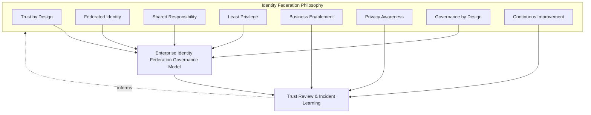
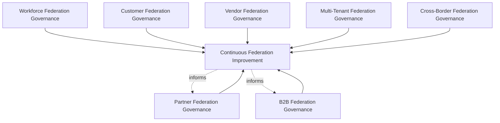
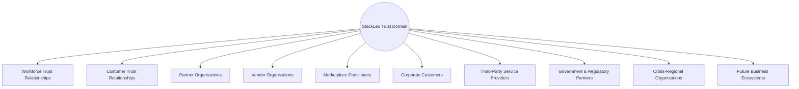
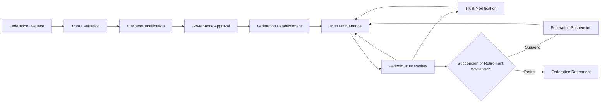
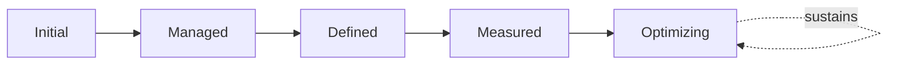
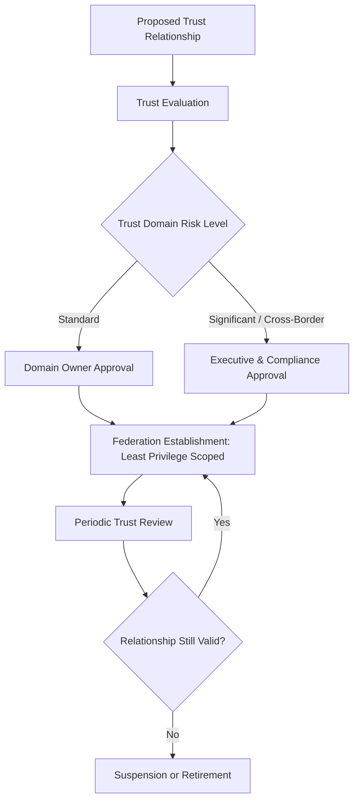

# Enterprise Identity Federation & Trust Governance Strategy

## 1. Document Purpose

This document defines the official Enterprise Identity Federation & Trust Governance Strategy for **StackLeo Tech Store**. It establishes how trust is deliberately extended to and received from external organizations — partners, vendors, corporate customers, and future marketplace participants — independent of any specific Identity Provider, federation provider, SSO platform, IAM vendor, or authentication protocol.

Federation Governance is referenced across every IAM document in `06_Security` — `identity-access-management.md` (Section 3.7), `authentication-strategy.md` (Section 3.7), `authorization-model.md` (Section 3.6), and `identity-lifecycle-management.md` (Sections 3.3–3.4, 3.7) — each pointing here for the full treatment. Federation warrants this dedicated document because trust extended across an organizational boundary is structurally different from trust governed entirely within StackLeo: it depends on another organization's practices, cannot be unilaterally enforced, and requires an explicit, bilateral governance relationship rather than internal policy alone.

- **Purpose of Identity Federation** — to ensure that trust extended to or received from an external organization is always deliberate, bounded, and governed, never assumed equivalent to internally managed trust simply because a relationship exists.
- **Relationship with Identity & Access Management** — this document is the dedicated elaboration of Federation Governance in `identity-access-management.md` (Section 3.7); every principle in that framework applies here, adapted to the specific characteristics of cross-organizational trust.
- **Relationship with Authentication** — federated identities are verified under Federated Authentication in `authentication-strategy.md` (Section 3.7); this document governs the broader trust relationship and lifecycle that verification arrangement depends on.
- **Relationship with Authorization** — federated permission decisions are governed under Third-Party Authorization Governance in `authorization-model.md` (Section 3.6); this document defines the dedicated trust domains and lifecycle those decisions are subject to.
- **Relationship with Zero Trust** — federation is the scenario in which "never trust, always verify" is tested most directly, since the identity being verified originates from outside StackLeo's direct control; this document ensures that verification discipline is never relaxed merely because a formal relationship exists.
- **Relationship with Enterprise Security Governance** — this document operates within the broader governance model and executive accountability established in `security-governance.md`, applying it to the domain where trust decisions are least reversible once extended.
- **Relationship with Business Ecosystems** — federation is the technical foundation for StackLeo's stated growth into corporate sales, wholesale, and the multi-vendor marketplace, consistent with `01_Business/business-model.md`; every new category of business relationship introduces a new federation governance need this document must be structured to absorb.

This document is implementation-independent and vendor-neutral. It defines federation governance philosophy, model, domains, and lifecycle conceptually — not specific Identity Providers, federation providers, SSO platforms, IAM vendors, cloud providers, authentication protocols, federation protocols, SAML, OAuth, OpenID Connect, WS-Federation, SCIM, token formats, metadata exchange procedures, infrastructure configurations, deployment architectures, or implementation workflows.

## 2. Identity Federation Philosophy

Identity federation at StackLeo is governed by eight principles. Each exists to produce a specific business outcome — federation is governed deliberately because trust extended across an organizational boundary cannot be unilaterally controlled once granted.

### 2.1 Trust by Design

Every federation relationship is evaluated for whether it makes StackLeo's trust commitment structurally justified, consistent with Trust by Design in `security-governance.md` (Section 2.2), never extended by default or convenience.

- **Business Value** — ensures external trust relationships strengthen rather than dilute the trust commitment central to StackLeo's brand.

### 2.2 Federated Identity

An external organization's own identity governance is relied upon only to the extent it has been deliberately evaluated and bounded, never assumed equivalent to StackLeo's internal standards.

- **Business Value** — allows StackLeo to benefit from partner relationships without inheriting their governance weaknesses unexamined.

### 2.3 Shared Responsibility

Federation trust is a bilateral responsibility; both StackLeo and the federated organization are accountable for their respective sides of the relationship.

- **Business Value** — ensures federation risk is not silently absorbed entirely by StackLeo while the partner organization bears none of the accountability.

### 2.4 Least Privilege

Federated identities receive only the access their specific business relationship genuinely requires, never broadened for convenience.

- **Business Value** — limits the consequence of a compromise originating from a partner organization StackLeo does not directly control.

### 2.5 Business Enablement

Federation governance exists to let the business pursue growth — corporate sales, wholesale, the multi-vendor marketplace — with confidence, not to obstruct legitimate partnership with disproportionate friction.

- **Business Value** — keeps federation governance genuinely followed rather than resented and quietly bypassed as an obstacle to real partnership.

### 2.6 Privacy Awareness

Federated identity data is itself sensitive, handled under the same minimization and protection principles as any other customer or business data, consistent with `privacy.md`.

- **Business Value** — protects StackLeo and its partners from the compounding consequence of a federation-related data exposure.

### 2.7 Governance by Design

Federation governance structures are established deliberately as partnership capability is built, not retrofitted once an unreviewed or excessive trust relationship has already emerged.

- **Business Value** — prevents the costly, high-visibility discovery of federation governance gaps only after a partner-originated incident has already demonstrated their absence.

### 2.8 Continuous Improvement

Federation governance practice matures over time, informed by real trust review findings, incidents, and the organization's growth in partnerships and markets.

- **Business Value** — keeps federation governance aligned with StackLeo's growth in corporate sales, wholesale, and marketplace partnerships.

*Diagram: Identity Federation Philosophy Overview — the eight principles shape the enterprise federation governance model, and trust review and incident learning feed back into the philosophy itself.*

## 3. Enterprise Identity Federation Governance Model

Federation governance operates across eight conceptual layers, each holding accountability for a distinct category of cross-organizational trust.

### 3.1 Workforce Federation Governance

- **Purpose** — own trust relationships involving contracted staff augmentation or outsourced workforce arrangements.
- **Governance Scope** — coordinated with Workforce Identity Governance in `identity-lifecycle-management.md` (Section 3.1) where workforce identity originates outside StackLeo directly.
- **Business Value** — extends trusted workforce capacity without diluting the internal governance standard.
- **Executive Expectations** — leadership expects outsourced workforce trust to be evaluated with the same rigor as direct employment.

### 3.2 Customer Federation Governance

- **Purpose** — own the readiness for customers to authenticate using external identity sources, where genuinely beneficial.
- **Governance Scope** — coordinated with Customer Identity Governance in `identity-access-management.md` (Section 3.5).
- **Business Value** — provides a potential future convenience for customers without compromising the trust relationship StackLeo directly owns.
- **Executive Expectations** — leadership expects customer federation to be evaluated deliberately, never adopted merely because it is conventional.

### 3.3 Partner Federation Governance

- **Purpose** — own trust relationships with future marketplace sellers.
- **Governance Scope** — anticipates the multi-vendor marketplace model, coordinated with Partner Identity Governance in `identity-lifecycle-management.md` (Section 3.3).
- **Business Value** — will become foundational to safely onboarding and trusting external sellers as the marketplace launches.
- **Executive Expectations** — leadership expects partner federation governance to be designed ahead of, not after, marketplace launch.

### 3.4 Vendor Federation Governance

- **Purpose** — own trust relationships with external suppliers and service providers.
- **Governance Scope** — coordinated with Vendor Identity Governance in `identity-lifecycle-management.md` (Section 3.4).
- **Business Value** — protects the integrations the commerce experience directly depends on.
- **Executive Expectations** — leadership expects vendor federation trust to be scoped narrowly to the specific integration purpose.

### 3.5 B2B Federation Governance

- **Purpose** — own trust relationships with corporate customers and wholesale business accounts.
- **Governance Scope** — anticipates the future B2B, corporate sales, and wholesale business models in `01_Business/business-model.md`.
- **Business Value** — will become foundational to serving business customers who expect their own identity governance to be respected.
- **Executive Expectations** — leadership expects B2B federation governance to be designed ahead of the first corporate sales relationship.

### 3.6 Multi-Tenant Federation Governance

- **Purpose** — own trust boundaries between StackLeo's own identity space and any future tenant-specific identity space.
- **Governance Scope** — anticipates future multi-tenant architecture, coordinated with `identity-access-management.md` (Section 8, Future Readiness).
- **Business Value** — ensures tenant isolation extends to identity trust, not only to data or application isolation.
- **Executive Expectations** — leadership expects multi-tenant federation governance to be designed before, not retrofitted after, multi-tenancy is introduced.

### 3.7 Cross-Border Federation Governance

- **Purpose** — own trust relationships and identity data flows that cross national or regional boundaries.
- **Governance Scope** — anticipates StackLeo's expansion from Bangladesh into South Asia and beyond, coordinated with `compliance.md`.
- **Business Value** — protects the business from regulatory exposure specific to cross-border identity and data flows.
- **Executive Expectations** — leadership expects cross-border federation governance to be evaluated ahead of each new market entered.

### 3.8 Continuous Federation Improvement

- **Purpose** — govern the mechanism by which every other layer in this model matures over time.
- **Governance Scope** — consolidates findings from Periodic Trust Review (Section 5.7) and executive oversight (Section 7).
- **Business Value** — prevents federation governance itself from becoming the next thing that quietly stagnates as partnerships grow.
- **Executive Expectations** — leadership expects federation maturity to be assessed periodically, not assumed static once established.

### Enterprise Identity Federation Governance Matrix

| Layer | Purpose | Business Value | Executive Expectations |
|---|---|---|---|
| Workforce Federation Governance | Own trust for outsourced/augmented workforce | Extends capacity without diluting governance standard | Same rigor as direct employment |
| Customer Federation Governance | Own readiness for external customer identity sources | Potential convenience without compromising owned trust | Evaluated deliberately, never merely conventional |
| Partner Federation Governance | Own trust with future marketplace sellers | Foundational to safely onboarding external sellers | Designed ahead of, not after, marketplace launch |
| Vendor Federation Governance | Own trust with external suppliers/service providers | Protects integrations commerce directly depends on | Scoped narrowly to specific integration purpose |
| B2B Federation Governance | Own trust with corporate/wholesale business accounts | Foundational to serving business customers | Designed ahead of the first corporate sales relationship |
| Multi-Tenant Federation Governance | Own trust boundaries for future tenant identity space | Extends tenant isolation to identity trust | Designed before, not retrofitted after, multi-tenancy |
| Cross-Border Federation Governance | Own trust and data flows crossing regional boundaries | Protects against cross-border regulatory exposure | Evaluated ahead of each new market entered |
| Continuous Federation Improvement | Govern maturation of every other layer | Prevents governance itself from stagnating | Maturity assessed periodically |

*Diagram 1: Enterprise Identity Federation Governance Framework — seven domain-specific governance layers feed continuous federation improvement, which in turn informs the ongoing practice of the domains anticipating the most growth.*

## 4. Federation Trust Domains

Federation trust spans ten conceptual domains, each requiring a somewhat different governance emphasis.

### 4.1 Workforce Trust Relationships

- **Purpose** — represent trust extended to contracted staff augmentation or outsourced workforce arrangements.
- **Governance Scope** — governed under Workforce Federation Governance (Section 3.1).
- **Business Importance** — extends trusted capacity while preserving internal governance standards.
- **Executive Expectations** — leadership expects outsourced workforce trust boundaries to be explicit, not assumed.

### 4.2 Customer Trust Relationships

- **Purpose** — represent trust involving customer identity, including any future external identity sources customers might use.
- **Governance Scope** — governed under Customer Federation Governance (Section 3.2).
- **Business Importance** — protects the direct-to-consumer trust relationship central to the business.
- **Executive Expectations** — leadership expects customer trust to remain StackLeo's own, even where convenience options are introduced.

### 4.3 Partner Organizations

- **Purpose** — represent future marketplace sellers as trusted, federated organizations.
- **Governance Scope** — governed under Partner Federation Governance (Section 3.3).
- **Business Importance** — will become foundational to the marketplace business model.
- **Executive Expectations** — leadership expects partner organization trust to be evaluated before onboarding, not after.

### 4.4 Vendor Organizations

- **Purpose** — represent payment providers, couriers, and communication providers as trusted, federated organizations.
- **Governance Scope** — governed under Vendor Federation Governance (Section 3.4).
- **Business Importance** — protects the integrations the commerce experience directly depends on.
- **Executive Expectations** — leadership expects vendor trust to be reviewed as the underlying business relationship evolves.

### 4.5 Marketplace Participants

- **Purpose** — represent the broader ecosystem of sellers and buyers within the future multi-vendor marketplace.
- **Governance Scope** — governed jointly under Partner and Multi-Tenant Federation Governance (Sections 3.3, 3.6).
- **Business Importance** — protects the integrity of the marketplace as it scales to a growing number of participants.
- **Executive Expectations** — leadership expects marketplace participant trust governance to scale without requiring redesign at each growth stage.

### 4.6 Corporate Customers

- **Purpose** — represent B2B and corporate sales business accounts.
- **Governance Scope** — governed under B2B Federation Governance (Section 3.5).
- **Business Importance** — will become foundational to serving corporate customers with their own identity expectations.
- **Executive Expectations** — leadership expects corporate customer trust governance to respect the customer's own governance standards where reasonable.

### 4.7 Third-Party Service Providers

- **Purpose** — represent external systems and services StackLeo integrates with but does not directly control.
- **Governance Scope** — governed jointly with `service-accounts-management.md` (Section 3.7, Third-Party Service Identity Governance).
- **Business Importance** — protects against risk introduced by automated systems outside StackLeo's direct organizational control.
- **Executive Expectations** — leadership expects third-party service trust to be reviewed before extension, not assumed.

### 4.8 Government & Regulatory Partners

- **Purpose** — represent trust relationships with government and regulatory bodies where digital identity interaction is required.
- **Governance Scope** — coordinated with `compliance.md`, anticipating potential future regulatory identity verification requirements.
- **Business Importance** — protects StackLeo's regulatory standing and license to operate.
- **Executive Expectations** — leadership expects government and regulatory trust relationships to be governed with particular care given their public accountability.

### 4.9 Cross-Regional Organizations

- **Purpose** — represent trust relationships spanning StackLeo's expansion beyond Bangladesh into South Asia and beyond.
- **Governance Scope** — governed under Cross-Border Federation Governance (Section 3.7).
- **Business Importance** — protects the business as it enters new regulatory and cultural trust contexts.
- **Executive Expectations** — leadership expects cross-regional trust governance to be evaluated ahead of each market entry.

### 4.10 Future Business Ecosystems

- **Purpose** — represent trust relationships not yet defined but anticipated as the business model evolves.
- **Governance Scope** — cross-cutting; ensures this framework's governance model (Section 3) can absorb genuinely new categories of relationship.
- **Business Importance** — protects the organization's ability to pursue new business opportunities without a governance redesign each time.
- **Executive Expectations** — leadership expects this framework to be revisited, not replaced, as new ecosystem relationships emerge.

### Federation Trust Domain Matrix

| Domain | Purpose | Business Importance | Executive Expectations |
|---|---|---|---|
| Workforce Trust Relationships | Represent outsourced/augmented workforce trust | Extends capacity while preserving governance standards | Trust boundaries explicit, not assumed |
| Customer Trust Relationships | Represent customer identity trust | Protects the direct-to-consumer trust relationship | Trust remains StackLeo's own even with convenience options |
| Partner Organizations | Represent future marketplace sellers | Foundational to the marketplace business model | Evaluated before onboarding, not after |
| Vendor Organizations | Represent payment/courier/communication providers | Protects integrations commerce directly depends on | Reviewed as the business relationship evolves |
| Marketplace Participants | Represent the broader seller/buyer ecosystem | Protects marketplace integrity as it scales | Scales without requiring redesign at each growth stage |
| Corporate Customers | Represent B2B and corporate sales accounts | Foundational to serving corporate customer expectations | Respects the customer's own governance where reasonable |
| Third-Party Service Providers | Represent external, uncontrolled integrated systems | Protects against risk from systems outside direct control | Trust reviewed before extension, never assumed |
| Government & Regulatory Partners | Represent government/regulatory digital identity trust | Protects regulatory standing and license to operate | Governed with particular care given public accountability |
| Cross-Regional Organizations | Represent trust spanning regional expansion | Protects the business entering new regulatory contexts | Evaluated ahead of each market entry |
| Future Business Ecosystems | Represent not-yet-defined future relationships | Protects ability to pursue new opportunities without redesign | Framework revisited, not replaced, as ecosystems emerge |

*Diagram 2: Federation Trust Relationship Model — StackLeo's own trust domain extends deliberately outward across ten distinct categories of external relationship, each individually evaluated and bounded.*

## 5. Federation Lifecycle

Federation trust is governed across ten conceptual lifecycle stages.

### 5.1 Federation Request

- **Purpose** — formally initiate a proposed trust relationship with an external organization.
- **Governance Objectives** — require every request to identify the specific trust domain (Section 4) and the organization involved.
- **Business Value** — ensures federation relationships are deliberately initiated, not assumed from a business conversation alone.

### 5.2 Trust Evaluation

- **Purpose** — assess the external organization's own identity and security governance maturity.
- **Governance Objectives** — require evaluation to be documented and to directly inform Governance Approval (Section 5.4).
- **Business Value** — ensures StackLeo understands what it is actually trusting before extending any access.

### 5.3 Business Justification

- **Purpose** — state the genuine business rationale for establishing the federation relationship.
- **Governance Objectives** — require justification to reference the specific business relationship the federation supports.
- **Business Value** — ensures federation exists only where it demonstrably serves genuine business need.

### 5.4 Governance Approval

- **Purpose** — render a deliberate, accountable decision to formally establish the proposed federation relationship.
- **Governance Objectives** — require approval authority proportionate to the trust domain's risk significance (Section 4).
- **Business Value** — converts federation establishment into a governed decision point, not a default outcome of a business handshake.

### 5.5 Federation Establishment

- **Purpose** — formally activate the approved trust relationship.
- **Governance Objectives** — require establishment to be scoped precisely to what was approved, never broader.
- **Business Value** — ensures the activated relationship matches the deliberate decision that approved it.

### 5.6 Trust Maintenance

- **Purpose** — keep the federation relationship's records current as circumstances change.
- **Governance Objectives** — require maintenance to be triggered by genuine change events in the relationship or the partner organization.
- **Business Value** — ensures federation records remain an accurate reflection of the current relationship.

### 5.7 Periodic Trust Review

- **Purpose** — formally reassess whether the federation relationship remains genuinely justified and appropriately scoped.
- **Governance Objectives** — require review to occur on a predictable, regular cadence, proportionate to the trust domain's risk level.
- **Business Value** — catches an outdated or overextended trust relationship before it becomes a genuine risk.

### 5.8 Trust Modification

- **Purpose** — adjust the scope or terms of a federation relationship as the underlying business relationship genuinely changes.
- **Governance Objectives** — require modification to be justified and recorded, consistent with Section 5.3.
- **Business Value** — prevents federation trust from silently expanding beyond current, genuine need.

### 5.9 Federation Suspension

- **Purpose** — deliberately and reversibly disable a federation relationship without fully terminating it, where circumstance warrants.
- **Governance Objectives** — require suspension to be a distinct, recorded state, never conflated with full retirement.
- **Business Value** — provides a proportionate response to circumstances (dispute, investigation, temporary relationship pause) that do not yet warrant full termination.

### 5.10 Federation Retirement

- **Purpose** — formally and finally terminate a federation relationship once it no longer serves a genuine business purpose.
- **Governance Objectives** — require retirement to be an explicit, recorded decision, coordinated with the underlying business relationship's own conclusion.
- **Business Value** — prevents indefinite accumulation of stale, unused trust relationships.

### Federation Lifecycle Matrix

| Stage | Purpose | Governance Objective | Business Value |
|---|---|---|---|
| Federation Request | Formally initiate a proposed trust relationship | Identifies trust domain and organization involved | Ensures relationships are deliberately initiated |
| Trust Evaluation | Assess the external organization's own governance maturity | Documented, directly informs approval | Ensures StackLeo understands what it is trusting |
| Business Justification | State the genuine rationale for the relationship | References the specific supported business relationship | Ensures federation exists only where genuinely needed |
| Governance Approval | Render a deliberate, accountable decision | Authority proportionate to trust domain risk | Converts establishment into a governed decision point |
| Federation Establishment | Formally activate the approved relationship | Scoped precisely to what was approved | Ensures the activated relationship matches the decision |
| Trust Maintenance | Keep records current as circumstances change | Triggered by genuine change events | Keeps records an accurate reflection of the relationship |
| Periodic Trust Review | Reassess whether the relationship remains justified | Predictable cadence, proportionate to risk level | Catches outdated/overextended trust before it becomes risk |
| Trust Modification | Adjust scope as the business relationship changes | Justified and recorded | Prevents trust silently expanding beyond genuine need |
| Federation Suspension | Deliberately, reversibly disable without termination | A distinct, recorded state | Provides proportionate response short of full termination |
| Federation Retirement | Finally terminate a no-longer-needed relationship | An explicit, recorded decision | Prevents accumulation of stale, unused trust relationships |

*Diagram 3: Identity Federation Lifecycle — a proposed relationship proceeds through evaluation, justification, and approval into establishment and ongoing maintenance and review, with modification, suspension, and retirement handling its evolution and eventual wind-down.*

## 6. Federation Governance Principles

- **Explicit Trust** — no federation relationship exists implicitly; every trust extension is deliberately requested, evaluated, and approved.
- **Shared Accountability** — both StackLeo and the federated organization hold responsibility for their respective sides of the relationship, consistent with Section 2.3.
- **Least Privilege** — federated access is scoped to the minimum necessary for the specific business relationship, consistent with Section 2.4.
- **Traceability** — every federation decision can be traced to its trust evaluation, business justification, and approver.
- **Auditability** — federation relationships and their governance history can be independently reviewed, supporting ISO/IEC 27001-aligned assurance.
- **Risk Awareness** — federation decisions are made with explicit awareness of the risk inherent in trust extended across an organizational boundary.
- **Privacy Protection** — federated identity data is protected consistent with `privacy.md` and `data-protection.md`.
- **Continuous Improvement** — federation governance practice matures over time, informed by real trust review findings and incidents.

### Federation Governance Principles Matrix

| Principle | Description | Business Value |
|---|---|---|
| Explicit Trust | No relationship exists implicitly; every extension is deliberate | Prevents trust from accumulating without genuine review |
| Shared Accountability | Both parties hold responsibility for their side | Prevents StackLeo silently absorbing all federation risk |
| Least Privilege | Access scoped to the minimum the relationship requires | Limits consequence of compromise from a partner organization |
| Traceability | Decisions traceable to evaluation, justification, approver | Enables defensible, evidence-based federation decisions |
| Auditability | Relationships and history independently reviewable | Supports ISO/IEC 27001-aligned assurance and audit confidence |
| Risk Awareness | Decisions made with awareness of cross-boundary risk | Ensures scrutiny matches the genuine stakes of external trust |
| Privacy Protection | Federated identity data protected consistently | Protects StackLeo and partners from compounding exposure |
| Continuous Improvement | Governance matures from real review findings | Keeps federation governance aligned with organizational growth |

## 7. Executive Oversight

- **Federation Governance Reviews** — the overall coherence of federation governance across every trust domain (Section 4) is formally reviewed on a regular cadence, consistent with `identity-access-management.md` (Section 7).
- **Executive Reporting** — aggregated federation health — active relationship counts, trust review completion, suspension/retirement trends — is reported to executive leadership, coordinated with `09_Operations/operations-metrics-kpis.md`.
- **Risk Reviews** — federation-related risk from `security-risk-management.md` (Section 4.6, Third-Party Risks) is reviewed as a distinct category given its cross-organizational nature.
- **Compliance Reviews** — federation practice is reviewed against applicable regulatory and contractual obligations, particularly for Cross-Border and Government & Regulatory relationships (Sections 4.9, 4.8), coordinated with `compliance.md`.
- **Documentation Governance** — this framework's relationship to `identity-access-management.md`, `authentication-strategy.md`, `authorization-model.md`, and `identity-lifecycle-management.md` is kept current as those documents evolve.
- **Audit Readiness** — federation governance decisions, reviews, and their outcomes are maintained in a state ready for internal or external audit at any time.

### Executive Oversight Matrix

| Oversight Mechanism | Purpose | Governance Role |
|---|---|---|
| Federation Governance Reviews | Confirm overall governance coherence across trust domains | Regular, predictable cadence for the framework as a whole |
| Executive Reporting | Provide leadership a single, coherent federation picture | Coordinated with enterprise operational KPI reporting |
| Risk Reviews | Review federation risk as a distinct, cross-organizational category | Connected to Third-Party Risks in enterprise risk management |
| Compliance Reviews | Confirm alignment with regulatory/contractual obligations | Particular attention to cross-border and regulatory relationships |
| Documentation Governance | Keep this framework's subordinate relationships current | Updated as IAM, authentication, authorization, lifecycle docs evolve |
| Audit Readiness | Maintain decisions and reviews ready for independent review | Continuous state, not preparation-triggered |

### Governance Responsibility Matrix

| Role | Responsibility |
|---|---|
| CISO | Owns coherence and enforcement of this federation strategy, in partnership with Security and Executive leadership. |
| Federation Governance Lead | Owns the governance model (Section 3) and lifecycle (Section 5) across every trust domain. |
| Partner / Vendor Manager | Owns Partner, Vendor, and B2B Federation Governance (Sections 3.3–3.5) coordination. |
| Legal / Compliance Lead | Owns Government & Regulatory and Cross-Border Federation Governance (Sections 4.8–4.9), coordinated with `compliance.md`. |
| HR / People Lead | Owns Workforce Federation Governance (Section 3.1) for outsourced or augmented workforce relationships. |
| Product Manager | Owns Customer Federation Governance (Section 3.2) evaluation. |
| Executive Leadership | Approves significant federation relationships and reviews overall trust governance health. |
| Internal Audit / Review Function | Independently verifies that federation governance records reflect actual practice. |

## 8. Future Readiness

This framework is designed to remain valid as StackLeo evolves in scale and organizational complexity, without requiring redefinition of its underlying philosophy.

- **Global Federation** — Cross-Border Federation Governance (Section 3.7) is structured to absorb new categories of international trust relationship as StackLeo expands from Bangladesh into South Asia and beyond.
- **Multi-Cloud Ecosystems** — this framework's governance model (Section 3) is defined independently of any specific cloud provider or infrastructure, so it applies unchanged regardless of underlying technical implementation.
- **AI Agent Federation** — where AI agents from external organizations require trust extension, they are governed under the same Trust Evaluation and Least Privilege principles (Sections 5.2, 2.4) as any other federated identity, coordinated with `service-accounts-management.md` (Section 4.9).
- **Marketplace Expansion** — Partner and Marketplace Participant governance (Sections 3.3, 4.5) is structured to scale to a substantially larger seller population without requiring the underlying governance model to be redesigned.
- **Multi-Tenant Platforms** — Multi-Tenant Federation Governance (Section 3.6) is structured to be designed proactively as tenant isolation architecture is introduced, not retrofitted afterward.
- **Cross-Border Digital Identity** — as digital identity standards evolve regionally, Cross-Border Federation Governance (Section 3.7) is structured to absorb new regulatory expectations without requiring a new governance model.
- **Enterprise Scale** — the governance model, domains, and lifecycle defined in Sections 3–5 are defined independently of organizational size or structure, so they remain coherent as the federation relationship population grows substantially.
- **Evolving Trust Models** — Continuous Federation Improvement (Section 3.8) and Periodic Trust Review (Section 5.7) are structured to absorb genuinely new trust models as they emerge in the broader identity ecosystem.

## 9. Identity Federation Maturity Model

Federation governance maturity is described across five conceptual levels, adapted from established process maturity thinking and consistent with NIST Cybersecurity Framework tiers.

- **Initial** — federation relationships, where they exist, are informal and inconsistent; trust is often extended based on business convenience alone, with no formal evaluation or review process.
- **Managed** — basic governance exists for individual trust domains, but consistency across the ten domains in Section 4 varies significantly.
- **Defined** — the governance model, domains, and lifecycle are standardized, documented, and consistently applied across the organization, consistent with the model defined throughout this document; ownership is clear organization-wide.
- **Measured** — active relationship counts, trust review completion, and risk trends are measured systematically, and decisions are grounded in genuine evidence rather than qualitative impression alone.
- **Optimizing** — federation governance is continuously and deliberately improved based on quantitative evidence and organizational learning; improvement itself is a managed, ongoing discipline rather than an occasional initiative.

### Identity Federation Maturity Model Matrix

| Level | Characteristics | Primary Focus |
|---|---|---|
| Initial | Informal, convenience-based trust; no formal evaluation or review | Ad hoc, individually-dependent federation practice |
| Managed | Basic governance exists per domain; consistency varies | Domain-level consistency |
| Defined | Standardized governance model, domains, and lifecycle | Organization-wide consistency and clear ownership |
| Measured | Relationship counts, review completion, risk trends measured | Evidence-based federation governance decisions |
| Optimizing | Practice continuously and deliberately improved from evidence | Sustained, deliberate improvement as a discipline |

*Diagram 6: Identity Federation Maturity Progression Model — maturity advances from informal, convenience-based trust toward standardized, measured, and continuously optimized federation governance.*

*Diagram 4: Cross-Organization Trust Governance Flow — a proposed relationship is evaluated and approved proportionate to its risk domain, established at minimum scope, and subject to recurring trust review until reconfirmed or wound down.*

*Diagram 5: Continuous Federation Improvement Cycle — relationship health and trust review outcomes are measured, learned from, improved upon, and standardized back into practice, on a continuing basis.*

## 10. Anti-Patterns

The following recurring failure patterns are explicitly recognized and avoided, as each one structurally undermines this strategy.

| Anti-Pattern | Why It's Avoided |
|---|---|
| Blind Trust Relationships | Contradicts Trust Evaluation (Section 5.2); extending trust without genuinely assessing a partner's own governance maturity inherits their weaknesses unexamined. |
| Unverified Federation Partners | Contradicts Explicit Trust (Section 6); a federation relationship established without deliberate evaluation and approval is not genuinely governed at all. |
| Weak Trust Governance | Undermines Section 3; without clear ownership and review across every trust domain, federation practice drifts into inconsistency as partnerships grow. |
| Excessive Federated Access | Contradicts Least Privilege (Section 2.4); federated access broader than the specific business relationship requires multiplies the consequence of a partner-side compromise. |
| Stale Federation Agreements | Contradicts Periodic Trust Review (Section 5.7); a relationship no longer reflecting genuine business need persists as an unreviewed, unnecessary risk. |
| Weak Documentation | Undermines Documentation Governance (Section 7) and Traceability (Section 6), leaving federation decisions unclear or unverifiable after the fact. |
| Weak Executive Visibility | Undermines Executive Reporting (Section 7); without genuine visibility, leadership cannot make informed decisions about the organization's cross-organizational trust exposure. |
| Missing Continuous Improvement | Contradicts Continuous Improvement (Section 2.8, Section 3.8); without deliberate improvement, federation governance stagnates as partnerships and markets evolve. |

## 11. Document Information

| Property | Value |
|----------|-------|
| Document | identity-federation.md |
| Version | 1.0.0 |
| Status | Active |
| Maintained By | StackLeo |
| Last Updated | 2026-07-24 |

---

© StackLeo. All Rights Reserved.
