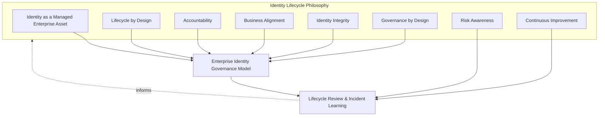
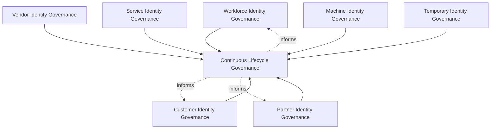
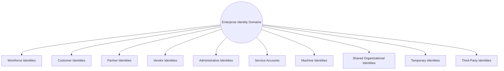
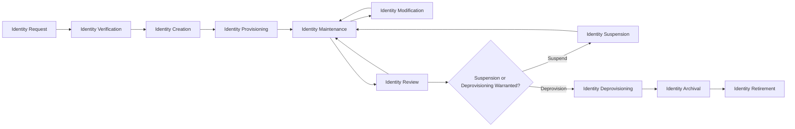
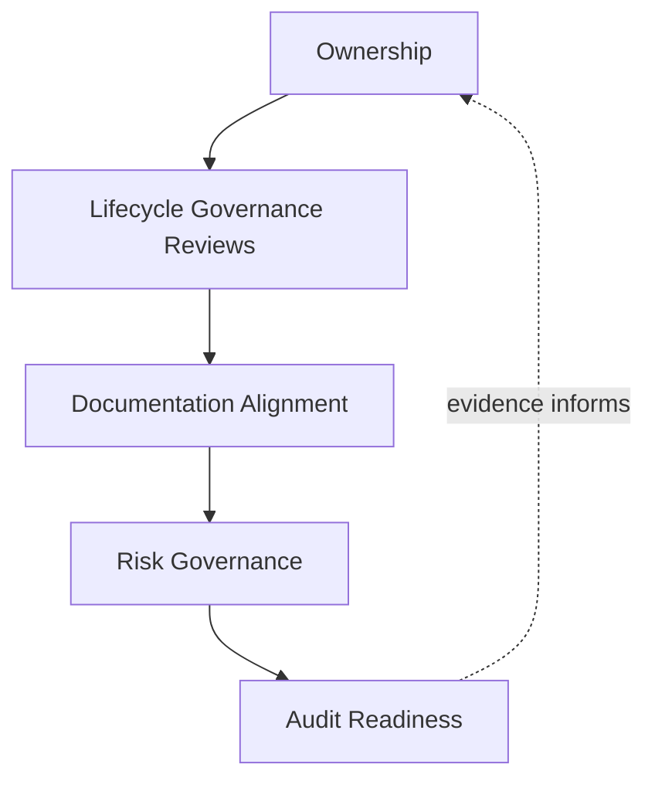
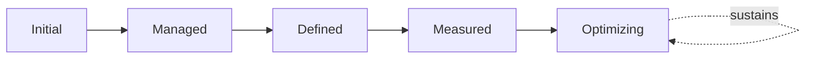
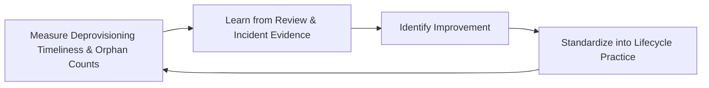

# Enterprise Identity Lifecycle Management Strategy

## 1. Document Purpose

This document defines the official Enterprise Identity Lifecycle Management (ILM) Strategy for **StackLeo Tech Store**. It establishes the dedicated governance of an identity's own state — from its first request through its final retirement — independent of any specific IAM vendor, identity platform, cloud provider, HR system, or directory service.

`identity-access-management.md` (Section 5) introduces the general identity lifecycle as part of its broader governance model. This document is that lifecycle's dedicated, full elaboration: it governs identity *state* specifically — whether an identity exists, is active, is suspended, or has been retired — distinct from `authorization-model.md` (Section 5), which governs the *access decision* lifecycle of what a given identity is permitted to do. An identity can exist in good standing while holding no access at all, and access governance depends entirely on this document's lifecycle state being accurate and current.

- **Purpose of Identity Lifecycle Management** — to ensure every identity's existence and state — from creation through retirement — is governed as a managed enterprise asset, so that stale, orphaned, or unaccounted-for identities never become an ungoverned source of risk.
- **Relationship with Identity & Access Management** — this document is the dedicated lifecycle elaboration of `identity-access-management.md` (Section 5); every identity domain defined there (Section 4) is governed through the lifecycle stages defined in full here.
- **Relationship with Authentication** — an identity must exist in an active, verified lifecycle state before `authentication-strategy.md` governance can meaningfully apply to it; a retired or suspended identity has no legitimate authentication claim to verify.
- **Relationship with Authorization** — this document governs whether an identity exists and is active; `authorization-model.md` governs what an existing, active identity may do. Identity Deprovisioning (Section 5.9) is what makes prior authorization grants moot, regardless of whether they were separately revoked.
- **Relationship with Privileged Access Management** — privileged identities are governed under this same lifecycle at heightened rigor, consistent with `privileged-access-management.md` (Section 5), particularly for Identity Review and Deprovisioning given their elevated consequence.
- **Relationship with Enterprise Security Governance** — this document operates within the broader governance model and executive accountability established in `security-governance.md`, applying it specifically to identity state management.
- **Relationship with Business Operations** — identity lifecycle events are triggered by genuine business events — hiring, termination, contract completion, customer account closure — and this framework exists to ensure those business events reliably translate into corresponding identity state changes.

This document is implementation-independent and vendor-neutral. It defines identity lifecycle philosophy, governance model, domains, and stages conceptually — not specific IAM vendors, identity platforms, cloud providers, HR systems, directory services, provisioning workflows, synchronization methods, authentication mechanisms, infrastructure configurations, deployment architectures, or implementation procedures.

## 2. Identity Lifecycle Philosophy

Identity lifecycle governance at StackLeo is built on eight principles. Each exists to produce a specific business outcome — identity state is governed deliberately because an inaccurate or stale identity record undermines every other security domain that depends on it.

### 2.1 Identity as a Managed Enterprise Asset

Every identity is treated as a deliberately managed asset with a known state, not an artifact that persists indefinitely once created.

- **Business Value** — ensures the organization always knows what identities exist and why, rather than accumulating an unaccounted-for population over time.

### 2.2 Lifecycle by Design

Lifecycle governance is established deliberately as an identity domain is introduced, not retrofitted once orphaned or stale identities have already accumulated.

- **Business Value** — prevents the costly, high-visibility discovery of lifecycle governance gaps only after a stale identity has already been exploited or discovered in an audit.

### 2.3 Accountability

Every identity's lifecycle state traces to a specific, named accountable owner responsible for keeping it current.

- **Business Value** — prevents the anti-pattern in Section 10.4, where an identity's state drifts out of accuracy because no one is specifically responsible for maintaining it.

### 2.4 Business Alignment

Identity lifecycle events are triggered by genuine business events, consistent with `01_Business/business-model.md`, not arbitrary or convenient timing disconnected from real organizational change.

- **Business Value** — keeps identity state a genuine reflection of business reality, rather than a record that has drifted apart from it.

### 2.5 Identity Integrity

An identity's recorded state genuinely reflects its actual, current standing — active, suspended, or retired — never left ambiguous or contradictory.

- **Business Value** — makes every downstream access and authentication decision trustworthy, since they all depend on an accurate lifecycle state.

### 2.6 Governance by Design

Lifecycle governance structures are established deliberately as identity capability is built, not retrofitted once inconsistent state management has already caused a gap.

- **Business Value** — prevents the costly rework of introducing lifecycle discipline only after inconsistency has already demonstrated its absence.

### 2.7 Risk Awareness

Lifecycle governance decisions are made with explicit awareness of the risk a stale, orphaned, or delayed state transition represents, consistent with ISO 31000 thinking.

- **Business Value** — directs governance attention toward the lifecycle transitions carrying the greatest genuine consequence if delayed or missed.

### 2.8 Continuous Improvement

Identity lifecycle governance practice matures over time, informed by real review findings, incidents, and the organization's growth in scale and complexity.

- **Business Value** — keeps lifecycle governance aligned with StackLeo's growth in workforce, customer base, and partner ecosystem.

*Diagram: Identity Lifecycle Philosophy Overview — the eight principles shape the enterprise identity governance model, and lifecycle review and incident learning feed back into the philosophy itself.*

## 3. Enterprise Identity Governance Model

Identity lifecycle governance operates across eight conceptual layers, each holding accountability for a distinct identity domain's state management.

### 3.1 Workforce Identity Governance

- **Purpose** — own the lifecycle of identities representing StackLeo's own employees and contractors.
- **Governance Scope** — coordinated with HR processes for onboarding, role change, and offboarding events.
- **Business Value** — ensures workforce identity state reflects actual, current employment status.
- **Executive Expectations** — leadership expects workforce identity state changes to be triggered promptly by employment events.

### 3.2 Customer Identity Governance

- **Purpose** — own the lifecycle of identities representing StackLeo's customers.
- **Governance Scope** — coordinated with `privacy.md` given the sensitivity of customer data retained across the lifecycle.
- **Business Value** — protects the trust relationship every customer transaction depends on.
- **Executive Expectations** — leadership expects customer identity lifecycle governance to scale smoothly as the customer base grows.

### 3.3 Partner Identity Governance

- **Purpose** — own the lifecycle of identities representing future marketplace sellers and B2B relationships.
- **Governance Scope** — anticipates the multi-vendor marketplace model, coordinated with `identity-access-management.md` (Section 3.7, Federation Governance); the full dedicated trust governance model is elaborated in `identity-federation.md`.
- **Business Value** — will become foundational to safely onboarding and offboarding external sellers as the marketplace launches.
- **Executive Expectations** — leadership expects partner identity lifecycle governance to be designed ahead of, not after, marketplace launch.

### 3.4 Vendor Identity Governance

- **Purpose** — own the lifecycle of identities representing external suppliers and service providers.
- **Governance Scope** — coordinated with Third-Party Risks in `security-risk-management.md` (Section 4.6).
- **Business Value** — protects the integrations the commerce experience directly depends on from stale or orphaned vendor identities.
- **Executive Expectations** — leadership expects vendor identity lifecycle to be tied to the underlying contractual relationship's actual status.

### 3.5 Service Identity Governance

- **Purpose** — own the lifecycle of non-human identities used by application components.
- **Governance Scope** — coordinated with Service Identity Governance in `identity-access-management.md` (Section 3.6); the full dedicated governance model and lifecycle for every non-human identity are elaborated in `service-accounts-management.md`.
- **Business Value** — prevents service identities from persisting indefinitely after the component they represent is retired.
- **Executive Expectations** — leadership trusts service identity lifecycle receives the same governance rigor as human identity lifecycle.

### 3.6 Machine Identity Governance

- **Purpose** — own the lifecycle of identities representing devices, workloads, and automated processes.
- **Governance Scope** — distinct from Service Identity Governance in representing infrastructure-level rather than application-level actors; elaborated fully in `service-accounts-management.md`.
- **Business Value** — prevents machine identity sprawl as infrastructure scales.
- **Executive Expectations** — leadership expects machine identity lifecycle to be anticipated as infrastructure grows, not discovered after the fact.

### 3.7 Temporary Identity Governance

- **Purpose** — own the lifecycle of identities granted for a bounded purpose or duration.
- **Governance Scope** — mandatory expiration as the defining lifecycle characteristic, coordinated with Temporary Identities in `identity-access-management.md` (Section 4.8).
- **Business Value** — prevents temporary identity needs from becoming permanent, unreviewed populations.
- **Executive Expectations** — leadership expects every temporary identity to carry an explicit, enforced expiration.

### 3.8 Continuous Lifecycle Governance

- **Purpose** — govern the mechanism by which every other layer in this model matures over time.
- **Governance Scope** — consolidates findings from Identity Review (Section 5.7) and executive oversight (Section 7) across every domain.
- **Business Value** — prevents lifecycle governance itself from becoming the next thing that quietly stagnates as the organization scales.
- **Executive Expectations** — leadership expects lifecycle maturity to be assessed periodically, not assumed static once established.

### Identity Lifecycle Governance Matrix

| Layer | Purpose | Business Value | Executive Expectations |
|---|---|---|---|
| Workforce Identity Governance | Own lifecycle of employee/contractor identities | Ensures state reflects actual, current employment status | Changes triggered promptly by employment events |
| Customer Identity Governance | Own lifecycle of customer identities | Protects the trust relationship every transaction depends on | Scales smoothly as customer base grows |
| Partner Identity Governance | Own lifecycle of marketplace seller/B2B identities | Foundational to safely onboarding/offboarding sellers | Designed ahead of, not after, marketplace launch |
| Vendor Identity Governance | Own lifecycle of supplier/service provider identities | Protects integrations from stale or orphaned identities | Tied to actual contractual relationship status |
| Service Identity Governance | Own lifecycle of application-level non-human identities | Prevents identities persisting after component retirement | Same rigor as human identity lifecycle |
| Machine Identity Governance | Own lifecycle of device/workload/process identities | Prevents machine identity sprawl as infrastructure scales | Anticipated as infrastructure grows |
| Temporary Identity Governance | Own lifecycle of bounded-purpose identities | Prevents temporary needs becoming permanent populations | Every identity carries explicit, enforced expiration |
| Continuous Lifecycle Governance | Govern maturation of every other layer | Prevents governance itself from stagnating | Maturity assessed periodically |

*Diagram 1: Enterprise Identity Lifecycle Governance Framework — seven domain-specific governance layers feed continuous lifecycle governance, which in turn informs the ongoing practice of every domain.*

## 4. Enterprise Identity Domains

Identity lifecycle governance spans ten conceptual domains, each requiring a somewhat different lifecycle emphasis.

### 4.1 Workforce Identities

- **Purpose** — represent StackLeo's own employees across their employment lifecycle, per Section 3.1.
- **Governance Scope** — tied to HR-triggered onboarding, role change, and offboarding events.
- **Business Importance** — protects internal systems from access based on an identity whose employment basis has ended.
- **Executive Expectations** — leadership expects deprovisioning to follow termination promptly, without exception.

### 4.2 Customer Identities

- **Purpose** — represent individual shoppers' accounts, per Section 3.2.
- **Governance Scope** — coordinated with account closure and data retention obligations in `04_Database/data-retention.md`.
- **Business Importance** — foundation of the direct-to-consumer relationship and repeat commerce.
- **Executive Expectations** — leadership expects customer identity lifecycle to protect both trust and privacy simultaneously.

### 4.3 Partner Identities

- **Purpose** — represent future marketplace sellers and B2B relationships, per Section 3.3.
- **Governance Scope** — anticipated ahead of marketplace launch.
- **Business Importance** — will become foundational to the marketplace business model.
- **Executive Expectations** — leadership expects the partner lifecycle to be designed before it is needed.

### 4.4 Vendor Identities

- **Purpose** — represent external suppliers and service providers, per Section 3.4.
- **Governance Scope** — tied to the underlying contractual relationship's lifecycle.
- **Business Importance** — protects integrations the commerce experience directly depends on.
- **Executive Expectations** — leadership expects vendor identity state to be reconciled against actual contract status.

### 4.5 Administrative Identities

- **Purpose** — represent identities with elevated capability to administer platform, security, or business-critical systems.
- **Governance Scope** — governed under this framework at heightened rigor, elaborated fully in `privileged-access-management.md` (Section 5).
- **Business Importance** — protects against the single highest-consequence category of stale-identity risk.
- **Executive Expectations** — leadership expects administrative identity lifecycle events to be reviewed without exception.

### 4.6 Service Accounts

- **Purpose** — represent non-human identities used by application components, per Section 3.5.
- **Governance Scope** — tied to the lifecycle of the application component they represent.
- **Business Importance** — prevents the common failure mode where a service account outlives the component it was created for.
- **Executive Expectations** — leadership expects service account lifecycle to be reviewed alongside application deployment lifecycle.

### 4.7 Machine Identities

- **Purpose** — represent devices, workloads, and automated processes, per Section 3.6.
- **Governance Scope** — tied to infrastructure provisioning and decommissioning events.
- **Business Importance** — protects the infrastructure layer from an accumulating population of orphaned machine identities.
- **Executive Expectations** — leadership expects machine identity lifecycle to be reconciled against actual infrastructure inventory.

### 4.8 Shared Organizational Identities

- **Purpose** — represent identities used by more than one individual, governed here specifically for their deliberate lifecycle minimization.
- **Governance Scope** — treated as an exception requiring explicit justification and heightened lifecycle scrutiny.
- **Business Importance** — protects individual accountability, since a shared identity's lifecycle cannot be tied to any single person's status.
- **Executive Expectations** — leadership expects shared identities to be actively minimized, not passively tolerated.

### 4.9 Temporary Identities

- **Purpose** — represent bounded-purpose or bounded-duration identities, per Section 3.7.
- **Governance Scope** — mandatory expiration as a defining lifecycle characteristic.
- **Business Importance** — prevents temporary access needs from becoming permanent, unreviewed identity grants.
- **Executive Expectations** — leadership expects every temporary identity's expiration to be enforced automatically.

### 4.10 Third-Party Identities

- **Purpose** — represent external identities StackLeo does not directly control.
- **Governance Scope** — governed jointly with Federation Governance in `identity-access-management.md` (Section 3.7).
- **Business Importance** — protects against risk introduced by parties outside StackLeo's direct organizational control.
- **Executive Expectations** — leadership expects third-party identity lifecycle to be reviewed as part of the broader partner relationship lifecycle.

### Enterprise Identity Domain Matrix

| Domain | Purpose | Business Importance | Executive Expectations |
|---|---|---|---|
| Workforce Identities | Represent employees across employment lifecycle | Protects systems from access outliving employment | Deprovisioning follows termination promptly, without exception |
| Customer Identities | Represent shoppers' accounts | Foundation of the direct-to-consumer relationship | Protects both trust and privacy simultaneously |
| Partner Identities | Represent future marketplace sellers/B2B relationships | Will become foundational to the marketplace model | Designed before it is needed |
| Vendor Identities | Represent external suppliers/service providers | Protects integrations commerce depends on | State reconciled against actual contract status |
| Administrative Identities | Represent elevated, high-impact identities | Protects against the highest-consequence stale-identity risk | Lifecycle events reviewed without exception |
| Service Accounts | Represent non-human, application-level identities | Prevents accounts outliving the component they serve | Reviewed alongside application deployment lifecycle |
| Machine Identities | Represent devices/workloads/automated processes | Protects infrastructure from orphaned identity accumulation | Reconciled against actual infrastructure inventory |
| Shared Organizational Identities | Represent identities used by more than one individual | Protects individual accountability for actions taken | Actively minimized, not passively tolerated |
| Temporary Identities | Represent bounded-purpose or bounded-duration identities | Prevents temporary needs becoming permanent grants | Expiration enforced automatically |
| Third-Party Identities | Represent external, uncontrolled identities | Protects against risk from parties outside organizational control | Reviewed as part of broader partner relationship lifecycle |

*Diagram 3: Identity State Transition Model (domain view) — ten domains, each requiring a distinct lifecycle emphasis proportionate to its business role and risk.*

## 5. Identity Lifecycle Stages

Identity state is governed across eleven conceptual stages, applicable across every domain in Section 4.

### 5.1 Identity Request

- **Purpose** — formally initiate the creation of a new identity with a stated business purpose.
- **Governance Objectives** — require every request to state its purpose and the domain (Section 4) it belongs to.
- **Business Value** — ensures identity creation is deliberate, not an incidental byproduct of onboarding activity.

### 5.2 Identity Verification

- **Purpose** — confirm the requested identity genuinely represents who or what it claims to be, coordinated with `authentication-strategy.md` (Section 5.1).
- **Governance Objectives** — require verification rigor proportionate to the identity's domain.
- **Business Value** — ensures the identity being created rests on a genuine, confirmed claim.

### 5.3 Identity Creation

- **Purpose** — formally instantiate the verified identity as a distinct, recognized record.
- **Governance Objectives** — require creation to produce a uniquely identifiable, traceable identity record.
- **Business Value** — establishes the identity as a managed enterprise asset from its very first moment of existence.

### 5.4 Identity Provisioning

- **Purpose** — establish the created identity's initial state and access, consistent with Least Privilege in `identity-access-management.md` (Section 2.2).
- **Governance Objectives** — require initial state to be active and scoped to genuine, stated need.
- **Business Value** — ensures every identity begins its lifecycle in a deliberate, well-understood state.

### 5.5 Identity Maintenance

- **Purpose** — keep identity attributes current as circumstances genuinely change.
- **Governance Objectives** — require maintenance to be triggered by genuine change events, not left to drift indefinitely.
- **Business Value** — ensures identity records remain an accurate reflection of current reality, consistent with Identity Integrity (Section 2.5).

### 5.6 Identity Modification

- **Purpose** — formally change an identity's state or attributes in response to a significant change event — role change, relationship change, status change.
- **Governance Objectives** — require modification to be recorded and traceable to the triggering event.
- **Business Value** — ensures state changes are deliberate and auditable, not informal or undocumented.

### 5.7 Identity Review

- **Purpose** — formally reassess whether an identity's continued existence and current state remain genuinely justified.
- **Governance Objectives** — require review to occur on a predictable, regular cadence, proportionate to the identity's domain and privilege level.
- **Business Value** — catches orphaned or stale identities before they become a genuine risk, rather than relying on individual initiative to report them.

### 5.8 Identity Suspension

- **Purpose** — deliberately and reversibly disable an identity without fully removing it, where circumstance warrants.
- **Governance Objectives** — require suspension to be a distinct, recorded state, never conflated with full deprovisioning.
- **Business Value** — provides a proportionate response to circumstances (leave, investigation, temporary status change) that do not yet warrant full removal.

### 5.9 Identity Deprovisioning

- **Purpose** — formally remove an identity's active state once its legitimate purpose has genuinely ended.
- **Governance Objectives** — require deprovisioning to be triggered promptly by the relevant business event (termination, contract end, project completion).
- **Business Value** — prevents the single most common source of identity risk: an identity that outlives its legitimate purpose.

### 5.10 Identity Archival

- **Purpose** — retain historical identity records for a defined period after deprovisioning, where genuine business or compliance need exists.
- **Governance Objectives** — coordinate retention with `04_Database/data-retention.md` and applicable obligations in `compliance.md`.
- **Business Value** — preserves evidence needed for audit or investigation without indefinitely retaining an active identity.

### 5.11 Identity Retirement

- **Purpose** — formally and finally remove an identity's records once archival retention needs have genuinely expired.
- **Governance Objectives** — require retirement to be an explicit, recorded decision, coordinated with `privacy.md` data minimization principles.
- **Business Value** — prevents indefinite accumulation of identity data no longer serving any genuine purpose.

### Identity Lifecycle Stage Matrix

| Stage | Purpose | Governance Objective | Business Value |
|---|---|---|---|
| Identity Request | Formally initiate creation with a stated purpose | Requests state purpose and domain | Ensures creation is deliberate, not incidental |
| Identity Verification | Confirm the identity genuinely represents its claim | Rigor proportionate to domain | Ensures creation rests on a genuine, confirmed claim |
| Identity Creation | Formally instantiate the verified identity | Produces a uniquely identifiable, traceable record | Establishes the identity as a managed asset from inception |
| Identity Provisioning | Establish initial state and access | Initial state active, scoped to genuine need | Every identity begins in a deliberate, well-understood state |
| Identity Maintenance | Keep attributes current as circumstances change | Triggered by genuine change events | Keeps records an accurate reflection of reality |
| Identity Modification | Formally change state/attributes for significant events | Recorded and traceable to the triggering event | Ensures state changes are deliberate and auditable |
| Identity Review | Reassess whether existence/state remain justified | Predictable cadence, proportionate to privilege level | Catches orphaned or stale identities before they become risk |
| Identity Suspension | Deliberately, reversibly disable without full removal | A distinct, recorded state | Provides proportionate response short of full removal |
| Identity Deprovisioning | Formally remove active state once purpose ends | Triggered promptly by the relevant business event | Prevents the most common source of identity risk |
| Identity Archival | Retain historical records for a defined period | Coordinated with data retention and compliance obligations | Preserves audit evidence without indefinite active identity |
| Identity Retirement | Finally remove records once retention needs expire | An explicit decision, coordinated with privacy principles | Prevents indefinite accumulation of unneeded identity data |

*Diagram 2: Identity Lifecycle Flow — an identity proceeds from request through verification, creation, and provisioning into ongoing maintenance, modification, and review, with suspension, deprovisioning, archival, and retirement handling its eventual, deliberate wind-down.*

## 6. Lifecycle Governance Principles

- **Ownership** — every identity has a single, named accountable owner responsible for its lifecycle state.
- **Accountability** — every lifecycle transition — creation, modification, suspension, deprovisioning — traces to a specific, responsible role.
- **Traceability** — every identity's complete lifecycle history can be reconstructed after the fact.
- **Auditability** — lifecycle decisions and their outcomes can be independently reviewed, supporting ISO/IEC 27001-aligned assurance.
- **Risk Awareness** — lifecycle governance decisions are made with explicit awareness of the risk a delayed or missed transition represents.
- **Data Integrity** — identity records genuinely reflect current reality at every stage of the lifecycle, consistent with Identity Integrity (Section 2.5).
- **Business Alignment** — lifecycle events are triggered by genuine business events, consistent with Business Alignment (Section 2.4).
- **Continuous Improvement** — lifecycle governance practice matures over time, informed by real review findings and incidents.

### Lifecycle Governance Principles Matrix

| Principle | Description | Business Value |
|---|---|---|
| Ownership | Every identity has a single, named accountable owner | Ensures lifecycle state has a specific, responsible party |
| Accountability | Every transition traces to a specific, responsible role | Ensures lifecycle decisions have a clear owner |
| Traceability | Complete lifecycle history can be reconstructed | Enables defensible, evidence-based lifecycle decisions |
| Auditability | Decisions and outcomes independently reviewable | Supports ISO/IEC 27001-aligned assurance and audit confidence |
| Risk Awareness | Decisions made with awareness of transition-delay risk | Enables deliberate, informed governance prioritization |
| Data Integrity | Records genuinely reflect current reality at every stage | Makes every downstream decision that depends on identity trustworthy |
| Business Alignment | Events triggered by genuine business events | Keeps identity state a genuine reflection of business reality |
| Continuous Improvement | Governance matures from real review findings | Keeps lifecycle governance aligned with organizational growth |

*Diagram 4: Identity Governance & Review Framework — ownership anchors lifecycle review activity, which feeds documentation alignment, risk governance, and ultimately auditable evidence.*

## 7. Executive Oversight

- **Lifecycle Governance Reviews** — the overall coherence of identity lifecycle governance across every domain (Section 4) is formally reviewed on a regular cadence, consistent with `identity-access-management.md` (Section 7).
- **Executive Reporting** — aggregated lifecycle health — orphaned identity counts, deprovisioning timeliness, review completion — is reported to executive leadership, coordinated with `09_Operations/operations-metrics-kpis.md`.
- **Risk Reviews** — identity lifecycle risk from `security-risk-management.md` (Section 4) is reviewed alongside broader identity risk, not in isolation.
- **Compliance Reviews** — lifecycle practice is reviewed against applicable regulatory and contractual obligations, coordinated with `compliance.md`.
- **Documentation Governance** — this framework's relationship to `identity-access-management.md`, `authentication-strategy.md`, `authorization-model.md`, and `privileged-access-management.md` is kept current as those documents evolve.
- **Audit Readiness** — identity lifecycle governance decisions, reviews, and their outcomes are maintained in a state ready for internal or external audit at any time.

### Executive Oversight Matrix

| Oversight Mechanism | Purpose | Governance Role |
|---|---|---|
| Lifecycle Governance Reviews | Confirm overall governance coherence across domains | Regular, predictable cadence for the framework as a whole |
| Executive Reporting | Provide leadership a single, coherent lifecycle picture | Coordinated with enterprise operational KPI reporting |
| Risk Reviews | Review lifecycle risk alongside broader identity risk | Not conducted in isolation from enterprise risk visibility |
| Compliance Reviews | Confirm alignment with regulatory/contractual obligations | Reviewed jointly with `compliance.md` |
| Documentation Governance | Keep this framework's subordinate relationships current | Updated as IAM, authentication, authorization, PAM docs evolve |
| Audit Readiness | Maintain decisions and reviews ready for independent review | Continuous state, not preparation-triggered |

### Governance Responsibility Matrix

| Role | Responsibility |
|---|---|
| CISO | Owns coherence and enforcement of this ILM strategy, in partnership with Security and Executive leadership. |
| Identity Lifecycle Governance Lead | Owns the governance model (Section 3) and lifecycle stages (Section 5) across every domain. |
| HR / People Lead | Coordinates Workforce Identity Governance (Section 3.1) for onboarding and offboarding events. |
| Engineering Leads | Own Service and Machine Identity Governance (Sections 3.5–3.6) within their domain. |
| Partner / Vendor Manager | Owns Partner and Vendor Identity Governance (Sections 3.3–3.4) coordination. |
| Security Leadership | Owns Administrative Identity lifecycle rigor jointly with `privileged-access-management.md`. |
| Executive Leadership | Reviews lifecycle governance health and significant orphaned/stale identity findings. |
| Internal Audit / Review Function | Independently verifies that identity lifecycle records reflect actual practice. |

## 8. Future Readiness

This framework is designed to remain valid as StackLeo evolves in scale and organizational complexity, without requiring redefinition of its underlying philosophy.

- **Cloud-Native Platforms** — governance layers (Section 3) are defined independently of any specific runtime or identity platform, so they apply unchanged as infrastructure evolves.
- **AI Systems** — as AI-assisted capability is introduced, it is governed under Service or Machine Identity Governance (Sections 3.5–3.6) using the same lifecycle stages as any other non-human identity.
- **Marketplace Platforms** — Partner Identity Governance (Section 3.3) is structured to absorb the multi-vendor marketplace model as it launches, using the same lifecycle defined here.
- **Multi-Tenant Architecture** — where future architecture introduces tenant isolation, Identity Review (Section 5.7) extends to explicitly account for cross-tenant identity implications.
- **Global Expansion** — Customer and Partner Identity Governance (Sections 3.2–3.3) extend to accommodate region-specific identity requirements as StackLeo expands into new markets.
- **Enterprise Scale** — the governance model, domains, and lifecycle defined in Sections 3–5 are defined independently of organizational size or structure, so they remain coherent as the identity population grows substantially.
- **Machine Identity Growth** — Machine Identity Governance (Section 3.6) is structured to scale as infrastructure automation grows, without requiring the underlying lifecycle to be redesigned.
- **Evolving Identity Risks** — Continuous Lifecycle Governance (Section 3.8) and Identity Review (Section 5.7) are structured to absorb genuinely new categories of identity risk as they emerge.

## 9. Identity Lifecycle Maturity Model

Identity lifecycle maturity is described across five conceptual levels, adapted from established process maturity thinking and consistent with NIST Cybersecurity Framework tiers.

- **Initial** — identity lifecycle governance, where it exists, is informal and inconsistent; deprovisioning is delayed or missed, and orphaned identities accumulate unnoticed.
- **Managed** — basic lifecycle practice exists for individual identity domains, but consistency across the ten domains in Section 4 varies significantly.
- **Defined** — the governance model, domains, and lifecycle stages are standardized, documented, and consistently applied across the organization, consistent with the model defined throughout this document; ownership is clear organization-wide.
- **Measured** — deprovisioning timeliness, orphaned identity counts, and review completion are measured systematically, and decisions are grounded in genuine evidence rather than qualitative impression alone.
- **Optimizing** — identity lifecycle governance is continuously and deliberately improved based on quantitative evidence and organizational learning; improvement itself is a managed, ongoing discipline rather than an occasional initiative.

### Identity Lifecycle Maturity Model Matrix

| Level | Characteristics | Primary Focus |
|---|---|---|
| Initial | Informal, inconsistent governance; deprovisioning delayed, identities orphaned | Ad hoc, individually-dependent lifecycle practice |
| Managed | Basic practice exists per domain; consistency varies | Domain-level consistency |
| Defined | Standardized governance model, domains, and lifecycle stages | Organization-wide consistency and clear ownership |
| Measured | Deprovisioning timeliness and orphan counts measured systematically | Evidence-based lifecycle governance decisions |
| Optimizing | Practice continuously and deliberately improved from evidence | Sustained, deliberate improvement as a discipline |

*Diagram 6: Identity Lifecycle Maturity Progression Model — maturity advances from informal, orphan-prone practice toward standardized, measured, and continuously optimized identity lifecycle governance.*

*Diagram 5: Continuous Identity Lifecycle Improvement Cycle — deprovisioning timeliness and orphan counts are measured, learned from, improved upon, and standardized back into practice, on a continuing basis.*

## 10. Anti-Patterns

The following recurring failure patterns are explicitly recognized and avoided, as each one structurally undermines this strategy.

| Anti-Pattern | Why It's Avoided |
|---|---|
| Orphaned Identities | Contradicts Identity as a Managed Enterprise Asset (Section 2.1); identities with no clear owner or purpose persist as an unaccounted-for, ungoverned risk. |
| Stale Identities | Contradicts Identity Integrity (Section 2.5); an identity whose state no longer reflects reality misleads every downstream decision that depends on it. |
| Delayed Deprovisioning | Contradicts Identity Deprovisioning (Section 5.9); access outliving its legitimate purpose is the single most common source of identity risk. |
| Weak Ownership | Contradicts Ownership (Section 6); an identity without a named owner has no one specifically responsible for keeping its state current. |
| Identity Sprawl | Contradicts Lifecycle by Design (Section 2.2); identities created without deliberate lifecycle tracking accumulate into an unmanageable population. |
| Poor Documentation | Undermines Documentation Governance (Section 7) and Traceability (Section 6), leaving lifecycle decisions unclear or unverifiable after the fact. |
| Weak Governance | Undermines Section 3; without clear ownership and review across every domain, lifecycle practice drifts into inconsistency as the organization scales. |
| Missing Continuous Improvement | Contradicts Continuous Improvement (Section 2.8, Section 3.8); without deliberate improvement, lifecycle governance stagnates as the organization and identity population grow. |

## 11. Document Information

| Property | Value |
|----------|-------|
| Document | identity-lifecycle-management.md |
| Version | 1.0.0 |
| Status | Active |
| Maintained By | StackLeo |
| Last Updated | 2026-07-24 |

---

© StackLeo. All Rights Reserved.
