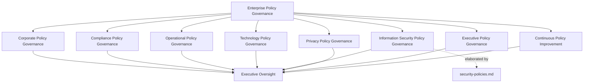
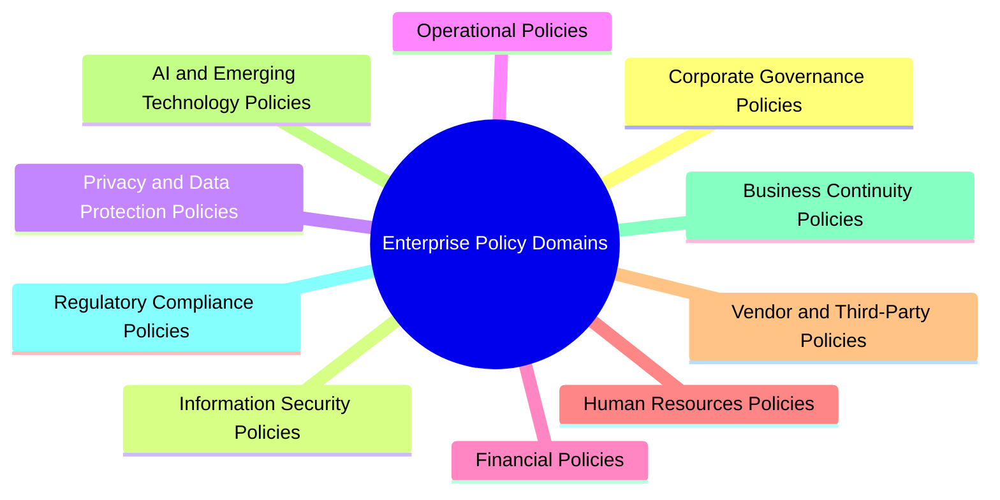
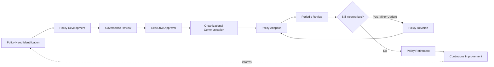
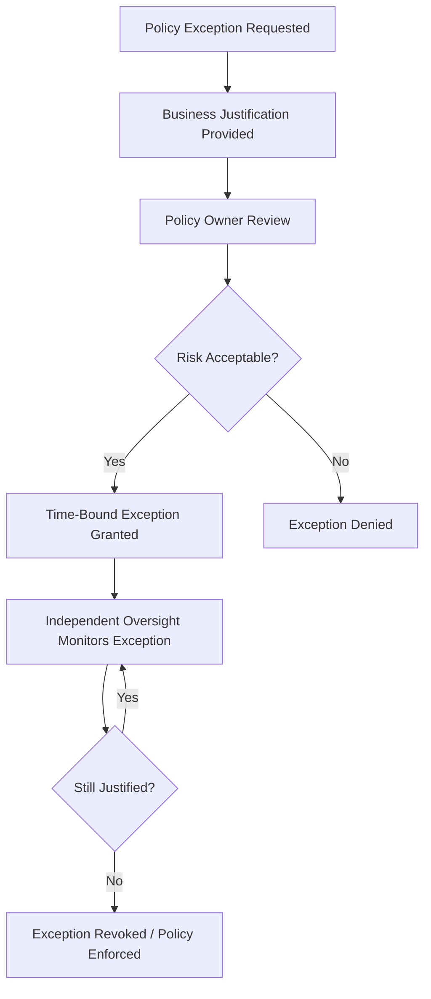
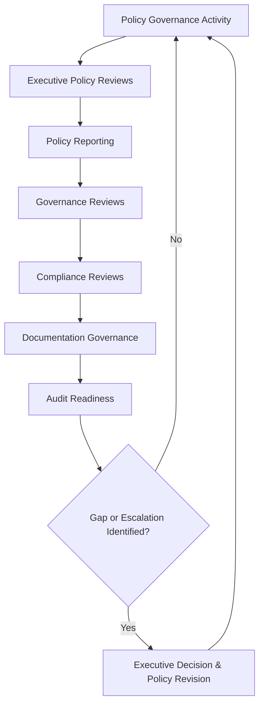
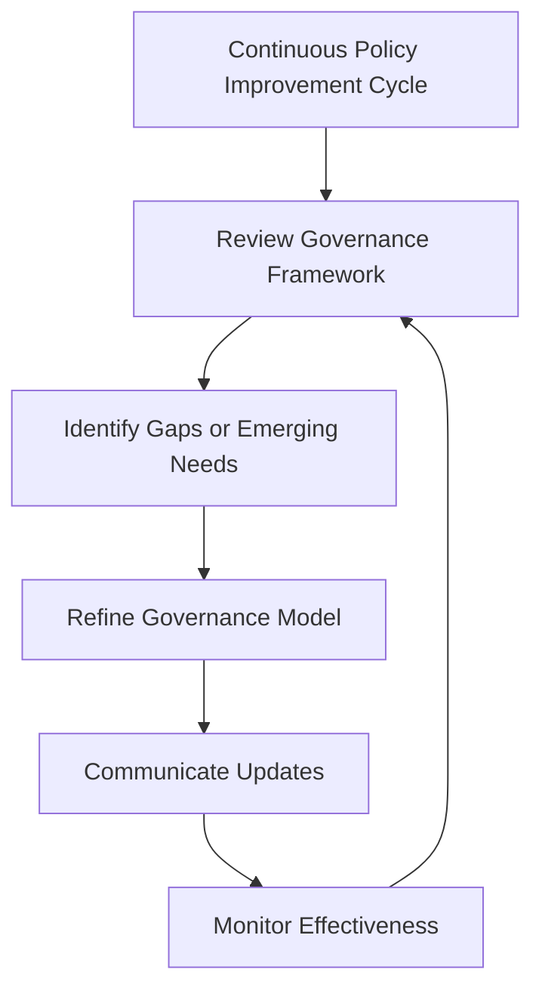

# Enterprise Policy Management Governance Framework

## 1. Document Purpose

This document establishes the enterprise-wide policy management governance framework for StackLeo Tech Store, consistent with ISO/IEC 37301 and ISO 9001 governance thinking. It defines how policy across every domain of the business — not information security alone — is created, governed, adopted, reviewed, and retired, providing the shared discipline specialized policy frameworks operate within.

- **Purpose of Policy Management** — to ensure "what StackLeo requires" is never ambiguous, informally inherited, or dependent on individual interpretation, across every domain of the business.
- **Relationship with Compliance Governance** — policy is the mechanism through which the regulatory and contractual obligations tracked in `compliance.md` become enforced, actionable expectation rather than obligations merely acknowledged in prose.
- **Relationship with Enterprise Risk Management** — policy content and rigor are set in proportion to genuine risk, consistent with `risk-management.md`, ensuring policy effort is directed at what matters most.
- **Relationship with Internal Controls** — policy establishes the expectation a control exists to enforce; a control without a traceable policy, or a policy without any corresponding control, is treated as a governance gap under `internal-controls.md`.
- **Relationship with Audit Governance** — policy adoption and currency are subject to independent verification through the audit practice defined in `audit-governance.md`.
- **Relationship with Corporate Governance** — policy management is a core mechanism of corporate governance, translating governance decisions into the specific expectations the organization actually operates under.
- **Relationship with Business Operations** — policies exist to let the business operate with clarity and confidence, not to obstruct it with rigidity disconnected from genuine need.
- **Relationship with Information Security Policy** — `security-policies.md` is the domain-specific elaboration of this framework for information security; this document does not restate that hierarchy but establishes the enterprise-wide policy governance model information security policy, along with every other policy domain, operates within.

This document is implementation-independent and vendor-neutral. It defines policy philosophy, governance model, domains, and lifecycle conceptually — not specific policy management software, GRC platforms, approval workflows, or document formatting standards.

## 2. Policy Governance Philosophy

| Principle | Business Value |
|---|---|
| **Policies as Organizational Direction** | Treating policy as a direct expression of organizational direction, not administrative paperwork, ensures policy genuinely shapes how the business operates. |
| **Governance Before Documentation** | Establishing the governance structure a policy operates within before drafting it ensures policies are coherent, not ad hoc. |
| **Accountability** | Assigning clear ownership for every policy ensures someone is always responsible for its accuracy and currency. |
| **Consistency** | Applying a shared governance discipline across every policy domain prevents fragmented, inconsistent practice from one function to the next. |
| **Transparency** | Making policy content and status visible to those who must follow it builds genuine understanding rather than passive compliance. |
| **Governance by Design** | Building policy governance into how new business capability is introduced, rather than retrofitting it, keeps the organization consistently aligned. |
| **Business Alignment** | Writing policy to enable genuine business objectives, not an abstract notion of best practice, keeps policy relevant and followed. |
| **Continuous Improvement** | Treating policy governance as an evolving discipline keeps it aligned with a growing business and changing regulatory landscape. |

## 3. Enterprise Policy Governance Model

### Enterprise Policy Governance Matrix

| Governance Layer | Purpose | Governance Scope | Business Value | Executive Expectations |
|---|---|---|---|---|
| **Corporate Policy Governance** | Governs policy expressing board- and executive-level direction. | Corporate governance, ethics, and organizational conduct policy. | Establishes the foundation every other policy domain operates within. | Expect corporate policy to be visibly connected to governance decisions. |
| **Compliance Policy Governance** | Governs policy translating regulatory and contractual obligations into practice. | Coordinated with `compliance.md`. | Ensures tracked obligations become enforced expectation. | Expect compliance policy to trace directly to a tracked obligation. |
| **Operational Policy Governance** | Governs policy shaping day-to-day operational practice. | Ordinary business operation across functions. | Ensures operational consistency at scale. | Expect operational policy to be genuinely followed, not merely published. |
| **Technology Policy Governance** | Governs policy shaping technology decisions and platform capability. | Coordinated with `security-architecture.md` and engineering practice. | Ensures technology decisions reflect organizational expectation. | Expect technology policy to evolve alongside the platform. |
| **Information Security Policy Governance** | Governs the enterprise's relationship to the specialized security policy discipline. | Coordination with `security-policies.md`. | Ensures security policy is consolidated into enterprise-wide policy governance. | Expect security policy currency to be represented in enterprise reporting. |
| **Privacy Policy Governance** | Governs policy shaping how personal data is handled. | Coordinated with `privacy.md`. | Protects customer and workforce trust. | Expect privacy policy to receive dedicated governance attention. |
| **Executive Policy Governance** | Governs the executive-level accountability and reporting structure for policy. | Executive reporting, review cadence, and ultimate policy accountability. | Keeps policy currency a visible, actively managed executive concern. | Expect regular, substantive policy governance reporting. |
| **Continuous Policy Improvement** | Governs how the policy governance framework itself evolves over time. | Governance review cadence, lessons learned, and framework refinement. | Keeps policy governance relevant as the business and regulatory landscape evolve. | Expect periodic evidence that the framework itself is being actively improved. |

*Diagram 1: Enterprise Policy Governance Framework.*

## 4. Enterprise Policy Domains

### Enterprise Policy Domain Matrix

| Domain | Purpose | Governance Scope | Business Importance | Executive Expectations |
|---|---|---|---|---|
| **Corporate Governance Policies** | Establish board- and executive-level expectations for organizational conduct. | Corporate governance and ethics policy. | Establishes the foundation every other policy domain builds on. | Expect corporate governance policy to be reviewed at the highest level. |
| **Information Security Policies** | Establish security expectations across the platform. | Elaborated in full by `security-policies.md`. | Protects the platform and data the business depends on. | Expect this domain's detail to be found in the dedicated security policy framework. |
| **Privacy & Data Protection Policies** | Establish expectations for handling personal data. | Coordinated with `privacy.md` and `data-protection.md`. | Protects customer and workforce trust and regulatory standing. | Expect privacy policy to be reviewed whenever data use changes. |
| **Operational Policies** | Establish expectations for day-to-day business operation. | Ordinary business operation across functions. | Ensures operational consistency and reliability. | Expect operational policy adoption to be visible and genuine. |
| **Financial Policies** | Establish expectations for financial practice and reporting. | Financial transactions, reconciliation, and reporting. | Protects financial integrity and stakeholder trust. | Expect financial policy to receive the highest governance rigor. |
| **Human Resources Policies** | Establish expectations for workforce conduct and management. | Employment and workforce practice. | Supports fair, consistent, and legally sound people management. | Expect HR policy to be reviewed as the workforce grows. |
| **Vendor & Third-Party Policies** | Establish expectations for external parties StackLeo relies on. | Vendor, partner, and marketplace participant relationships. | Ensures external reliance does not become uncontrolled exposure. | Expect third-party policy proportionate to access granted. |
| **AI & Emerging Technology Policies** | Establish expectations for AI-assisted capability and emerging technology adoption. | Automated and AI-assisted decision-making. | Increasingly significant as AI capability grows within the business. | Expect proactive governance attention to this domain rather than retroactive correction. |
| **Business Continuity Policies** | Establish expectations for organizational resilience. | Coordinated with `09_Operations/business-continuity.md`. | Protects the business precisely when disruption is most consequential. | Expect continuity policy to be validated through genuine exercises. |
| **Regulatory Compliance Policies** | Establish expectations translating regulatory obligations into practice. | Coordinated with `compliance.md`. | Protects the organization's license to operate in current and future markets. | Expect regulatory policy to trace directly to a tracked obligation. |

*Diagram: Enterprise Policy Domain Overview.*

## 5. Enterprise Policy Lifecycle

### Enterprise Policy Lifecycle Matrix

| Stage | Purpose | Governance Objectives | Business Value |
|---|---|---|---|
| **Policy Need Identification** | Recognizes that a genuine need exists for new or revised policy. | Ground the need in a real business, risk, or regulatory driver. | Prevents policy from being created without genuine justification. |
| **Policy Development** | Drafts policy content addressing the identified need. | Ensure content is business-aligned and proportionate to genuine risk. | Produces policy that is followed because it makes sense, not merely imposed. |
| **Governance Review** | Reviews draft policy for coherence with the broader governance framework. | Confirm alignment with related policy, risk, and control frameworks. | Prevents contradictory or duplicative policy from being introduced. |
| **Executive Approval** | Formally authorizes a policy for adoption. | Ensure policy is never adopted without deliberate governance sign-off. | Prevents unauthorized or informally introduced policy. |
| **Organizational Communication** | Ensures the policy is genuinely communicated to those it affects. | Confirm communication reaches the relevant audience. | Closes the gap between a policy existing and being known. |
| **Policy Adoption** | Ensures the policy is genuinely followed in practice. | Confirm adoption, not merely awareness. | Closes the gap between a policy being known and being followed. |
| **Periodic Review** | Reassesses whether a policy remains current and appropriate. | Review on a defined cadence and whenever material change occurs. | Prevents stale policy from persisting unexamined. |
| **Policy Revision** | Updates policy content in response to review findings or business change. | Ensure revisions go through the same governance rigor as original approval. | Keeps policy current without bypassing governance discipline. |
| **Policy Retirement** | Formally retires policy that no longer serves a genuine purpose. | Ensure retirement is a deliberate, documented act. | Prevents an accumulation of obsolete, confusing policy. |
| **Continuous Improvement** | Feeds lessons learned back into the policy governance framework itself. | Track improvement actions to completion. | Ensures policy governance effectiveness compounds over time. |

*Diagram 2: Enterprise Policy Lifecycle.*

## 6. Policy Governance Principles

### Policy Governance Principles Matrix

| Principle | Explanation |
|---|---|
| **Accountability** | Every policy has a specific, named accountable owner. |
| **Transparency** | Policy content and status are visible to those who must follow it. |
| **Traceability** | Every policy traces back to the business, risk, or regulatory driver that justified it. |
| **Consistency** | Policy across every domain follows the same governance discipline. |
| **Business Alignment** | Policy content remains connected to genuine business objectives. |
| **Regulatory Alignment** | Policy governance remains aware of and responsive to applicable regulatory expectations. |
| **Accessibility** | Policy is written and communicated so those affected can genuinely understand it. |
| **Continuous Improvement** | Policy governance practice is periodically reassessed and refined. |

## 7. Policy Ownership & Exception Governance

### Policy Ownership & Exception Governance Matrix

| Accountability Layer | Governance Objective | Business Value |
|---|---|---|
| **Policy Owners** | Own the accuracy, currency, and enforcement of a specific policy. | Provides clear, individual accountability for every policy. |
| **Business Owners** | Ensure policy within their area genuinely serves the business objective it protects. | Keeps policy connected to real business purpose, not abstract compliance. |
| **Compliance Functions** | Ensure policy addressing regulatory obligations is mapped and current, coordinated with `compliance.md`. | Provides the evidence base for demonstrating regulatory compliance. |
| **Risk Functions** | Ensure policy content is proportionate to the risk it addresses, coordinated with `risk-management.md`. | Keeps policy effort aligned with genuine risk significance. |
| **Executive Leadership** | Ensure executive leadership approves significant policy and owns the overall policy governance posture. | Establishes policy governance as a genuine governance priority. |
| **Policy Exceptions** | Ensure deviations from policy are formally requested, evaluated, and time-bound. | Prevents informal, undocumented departures from stated expectation. |
| **Independent Oversight** | Ensure an independent function verifies that policy exceptions remain justified and current. | Provides credible, unbiased confirmation that exceptions have not become permanent workarounds. |
| **Organizational Accountability** | Ensure the broader workforce understands its obligation to follow adopted policy. | Policy ultimately depends on consistent day-to-day behavior, not documentation alone. |

This section addresses policy ownership and exception governance from a governance-objective perspective; specific approval workflows remain a matter for the domain owning each policy.

*Diagram 3: Policy Ownership & Exception Governance Model.*

## 8. Executive Oversight

### Executive Oversight Matrix

| Oversight Activity | Purpose |
|---|---|
| **Executive Policy Reviews** | Confirm the overall policy governance framework remains coherent and effective. |
| **Policy Reporting** | Provide leadership with visibility into the state of enterprise policy currency and adoption. |
| **Governance Reviews** | Confirm policy governance remains aligned with the broader enterprise governance model. |
| **Compliance Reviews** | Confirm policy content remains aligned with obligations tracked in `compliance.md`. |
| **Documentation Governance** | Confirm policy governance documentation remains current and accurate. |
| **Audit Readiness** | Confirm the organization is prepared to demonstrate its policy governance on request, coordinated with `audit-governance.md`. |

*Diagram 4: Enterprise Policy Governance Decision Flow.*

## 9. Future Readiness

| Future Direction | Readiness Consideration |
|---|---|
| **AI Governance Policies** | Extends policy governance to AI-assisted capability as a distinct, actively monitored policy domain. |
| **Digital Business Policies** | Anticipates policy needs introduced by continued digital capability growth. |
| **Global Expansion** | Regulatory Compliance and Corporate Governance Policy domains extend to cover new markets as StackLeo expands regionally and globally. |
| **Multi-Jurisdiction Operations** | Policy governance remains jurisdiction-agnostic in structure, with jurisdiction-specific content layered on as markets activate. |
| **Enterprise Scale** | Ensures the governance framework remains coherent as policy volume and diversity grow substantially. |
| **Continuous Regulatory Evolution** | Continuous Policy Improvement ensures policy content adapts as the regulatory landscape evolves. |
| **Intelligent Policy Governance** | Anticipates tooling that may assist policy currency review, subject to the same governance rigor as any other practice. |
| **Organizational Transformation** | Ensures policy governance remains coherent through significant organizational or business model change. |

## 10. Policy Management Maturity Model

### Policy Management Maturity Model Matrix

| Level | Characteristics |
|---|---|
| **Initial** | Policy exists ad hoc, is inconsistently applied, and ownership is unclear. |
| **Managed** | Core policy domains have identified owners and basic review practice, though governance is still largely reactive. |
| **Defined** | A documented, organization-wide policy governance framework exists and is consistently applied across domains. |
| **Measured** | Policy governance effectiveness is actively monitored, with visibility into adoption, currency, and exception status. |
| **Optimizing** | Policy governance is continuously refined based on organizational learning, regulatory evolution, and business growth. |

*Diagram 6: Policy Management Maturity Progression Model.*

## 11. Anti-Patterns

### Anti-Pattern Summary

| Anti-Pattern | Why It Is Avoided |
|---|---|
| **Policies Without Governance** | Policy introduced without a governing framework becomes inconsistent and disconnected from genuine need. |
| **Outdated Policies** | Policy left unreviewed no longer reflects current business, risk, or regulatory reality. |
| **Unknown Policy Ownership** | A policy without a named owner has no one responsible for keeping it accurate and current. |
| **Poor Documentation** | Undocumented policy rationale cannot be defended, audited, or consistently applied. |
| **Weak Executive Visibility** | Without executive oversight, policy governance drifts from a strategic discipline into an unmonitored operational afterthought. |
| **Siloed Policies** | Managing policy in isolation across domains produces inconsistent, potentially contradictory expectations. |
| **Compliance Without Adoption** | Publishing policy that is never genuinely followed closes no real compliance gap. |
| **Missing Continuous Improvement** | A static policy framework falls out of alignment with a growing, evolving business and regulatory landscape. |

## 12. Document Information

| Property | Value |
|----------|-------|
| Document | policy-management.md |
| Version | 1.0.0 |
| Status | Active |
| Maintained By | StackLeo |
| Last Updated | 2026-07-27 |

---

### Governance Responsibility Matrix

| Role | Responsibility |
|---|---|
| Chief Governance Officer / CCO function | Owns coherence and currency of this enterprise policy governance framework across all domains. |
| CISO | Owns `security-policies.md` as the elaboration of this framework for information security policy. |
| Compliance & Risk Functions | Coordinate Regulatory and Compliance Policy Governance with `compliance.md` and `risk-management.md`. |
| Policy Owners | Own individual policies and their currency within their assigned domain. |
| Executive Leadership | Approves significant policy and is accountable for the organization's overall policy governance posture. |
| Internal Audit / Independent Assurance | Independently verifies that policy adoption and exception status reflect actual practice. |

*Diagram 5: Continuous Policy Improvement Cycle.*

© StackLeo. All Rights Reserved.
