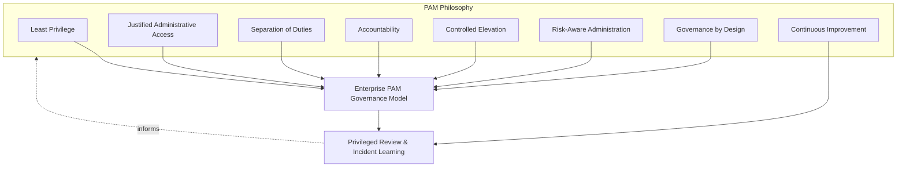
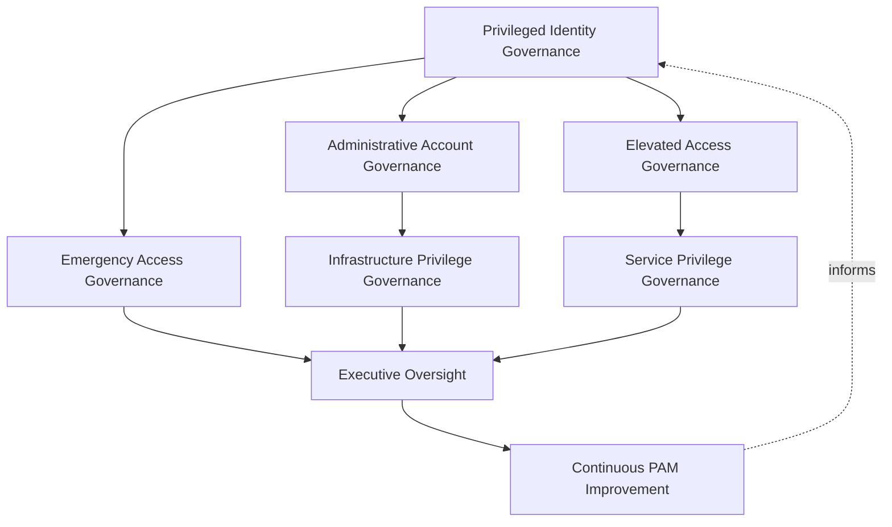
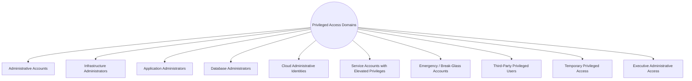
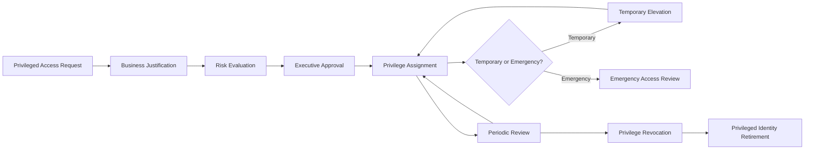
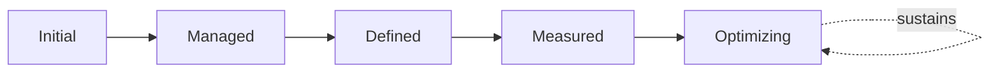
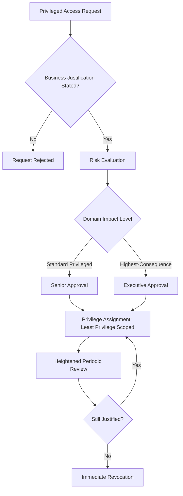
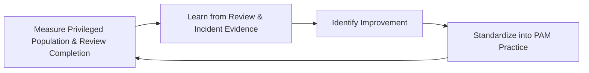

# Enterprise Privileged Access Management Strategy

## 1. Document Purpose

This document defines the official Enterprise Privileged Access Management (PAM) Strategy for **StackLeo Tech Store**. It establishes the elevated governance rigor applied specifically to the highest-impact identities and access across the platform — independent of any specific PAM vendor, vault product, IAM tool, or security platform.

Privileged access is the single point at which every other IAM document in `06_Security` concentrates its highest scrutiny: Privileged Identity Governance in `identity-access-management.md` (Section 3.3), Administrative Authentication in `authentication-strategy.md` (Section 3.4), and Administrative Access Governance in `authorization-model.md` (Section 3.4) each point to this document as their full elaboration. This document exists because privileged access — the capability to affect the platform broadly rather than narrowly — carries disproportionate consequence and therefore warrants a dedicated, deeper governance treatment than any single general-purpose IAM document can provide.

- **Purpose of Privileged Access Management** — to ensure the identities and access capable of affecting the platform, its data, or its business operations broadly are governed with commensurately greater scrutiny, justification, and oversight than ordinary access.
- **Relationship with Identity & Access Management** — this document is the privileged-specific deep elaboration of Privileged Identity Governance in `identity-access-management.md` (Section 3.3); every principle in that framework applies here, intensified.
- **Relationship with Authentication** — privileged identities are verified under Administrative Authentication in `authentication-strategy.md` (Section 3.4); this document governs the access lifecycle that verification supports, not verification itself.
- **Relationship with Authorization** — privileged permission decisions are governed under Administrative Access Governance in `authorization-model.md` (Section 3.4); this document defines the dedicated lifecycle and executive oversight those decisions are subject to.
- **Relationship with Zero Trust** — privileged access is the scenario in which "never trust, always verify" matters most; a compromised privileged identity carries the greatest possible consequence of any single compromised identity on the platform.
- **Relationship with Risk Management** — privileged access risk is the highest-severity subset of identity risk tracked in `security-risk-management.md` (Section 4), warranting dedicated tracking and executive-level treatment.
- **Relationship with Enterprise Security Governance** — this document operates within the broader governance model and executive accountability established in `security-governance.md`, applying it to the domain where governance failure carries the most severe consequence.

This document is implementation-independent and vendor-neutral. It defines PAM governance philosophy, model, domains, and lifecycle conceptually — not specific PAM vendors, vault products, IAM tools, cloud providers, operating systems, security platforms, privileged session recording, credential storage mechanisms, MFA implementations, password rotation methods, infrastructure configurations, or deployment architectures.

## 2. PAM Philosophy

Privileged access governance at StackLeo is built on eight principles. Each exists to produce a specific business outcome — privileged access is governed with heightened rigor because of the disproportionate consequence its misuse or compromise carries.

### 2.1 Least Privilege

Even among privileged identities, access is scoped to the minimum genuinely necessary for the specific administrative purpose, never broadened for convenience.

- **Business Value** — limits the consequence of a compromised privileged identity to the narrowest scope its genuine purpose requires, rather than the widest scope convenience might otherwise grant.

### 2.2 Justified Administrative Access

Every privileged grant traces to a specific, current, genuine administrative need, never granted by default, by role tradition, or by convenience.

- **Business Value** — ensures the organization's most consequential access exists only where it is genuinely earning its risk.

### 2.3 Separation of Duties

No single privileged identity holds unchecked authority over a complete, sensitive process end to end, where genuine risk warrants division of responsibility.

- **Business Value** — prevents a single compromised or malicious privileged identity from unilaterally causing catastrophic harm.

### 2.4 Accountability

Every privileged action traces to a specific, identifiable individual, never to a shared or anonymous identity.

- **Business Value** — ensures the organization can always determine who took a given privileged action, which is the foundation of meaningful privileged oversight.

### 2.5 Controlled Elevation

Privilege is elevated deliberately and temporarily where genuinely needed, rather than held persistently by default.

- **Business Value** — minimizes the window during which elevated capability exists and could be misused or compromised.

### 2.6 Risk-Aware Administration

Privileged access decisions weigh the disproportionate business impact privileged compromise carries, consistent with ISO 31000 thinking applied at heightened intensity.

- **Business Value** — ensures the organization's scarcest, most consequential governance attention is directed at its highest-consequence access category.

### 2.7 Governance by Design

PAM governance structures are established deliberately as administrative capability is built, not retrofitted once excessive or unreviewed privileged access has already emerged.

- **Business Value** — prevents the costly, high-visibility discovery of PAM governance gaps only after a privileged compromise has already demonstrated their absence.

### 2.8 Continuous Improvement

PAM governance practice matures over time, informed by real privileged access review findings, incidents, and the organization's growth in scale and complexity.

- **Business Value** — keeps PAM governance aligned with StackLeo's growth in infrastructure, administrative headcount, and architectural complexity.

*Diagram: PAM Philosophy Overview — the eight principles shape the enterprise PAM governance model, and privileged review and incident learning feed back into the philosophy itself.*

## 3. Enterprise PAM Governance Model

PAM governance operates across eight conceptual layers, each holding accountability for a distinct dimension of privileged access practice.

### 3.1 Privileged Identity Governance

- **Purpose** — own the coherence of which identities are recognized as privileged and how that recognition is maintained.
- **Governance Scope** — the entry point into every other layer in this model, coordinated with `identity-access-management.md` (Section 3.3).
- **Business Value** — ensures the population of privileged identities is deliberately known and bounded, never allowed to grow undetected.
- **Executive Expectations** — leadership trusts that no identity holds privileged capability outside this framework's visibility.

### 3.2 Administrative Account Governance

- **Purpose** — own the coherence of standing administrative accounts and their scope.
- **Governance Scope** — oversight of Administrative Accounts (Section 4.1) and their relationship to individual accountable identities.
- **Business Value** — ensures administrative accounts remain traceable to specific individuals, never anonymous or ambiguous.
- **Executive Expectations** — leadership expects every administrative account to have a clear, current, named owner.

### 3.3 Elevated Access Governance

- **Purpose** — own the coherence of temporary privilege elevation, consistent with Controlled Elevation (Section 2.5).
- **Governance Scope** — oversight of Temporary Privileged Access (Section 4.9).
- **Business Value** — ensures elevated capability exists only for the duration it is genuinely needed.
- **Executive Expectations** — leadership expects elevation to be time-bound and automatically reverted, never left standing indefinitely.

### 3.4 Emergency Access Governance

- **Purpose** — own the coherence of break-glass access used to resolve significant, active harm.
- **Governance Scope** — oversight of Emergency (Break-Glass) Accounts (Section 4.7), coordinated with `09_Operations/incident-management.md`.
- **Business Value** — allows urgent response without abandoning privileged governance discipline entirely.
- **Executive Expectations** — leadership expects every emergency access use to be reviewed after the fact with full rigor, never exempted from scrutiny.

### 3.5 Service Privilege Governance

- **Purpose** — own the coherence of elevated privilege held by non-human identities.
- **Governance Scope** — oversight of Service Accounts with Elevated Privileges (Section 4.6).
- **Business Value** — prevents machine-held privilege from becoming an ungoverned blind spot behind the human-focused governance layers.
- **Executive Expectations** — leadership trusts privileged service accounts receive the same rigor as privileged human accounts.

### 3.6 Infrastructure Privilege Governance

- **Purpose** — own the coherence of privileged access to infrastructure, platform, and database systems.
- **Governance Scope** — oversight of Infrastructure Administrators, Database Administrators, and Cloud Administrative Identities (Sections 4.2, 4.4, 4.5).
- **Business Value** — protects the foundational layer every other capability on the platform ultimately depends on.
- **Executive Expectations** — leadership expects infrastructure privilege to be governed independently of any specific underlying technology or provider.

### 3.7 Executive Oversight

- **Purpose** — ensure Executive Leadership reviews and, where warranted, ratifies significant privileged access decisions.
- **Governance Scope** — elaborated fully in Section 7, coordinated with `security-governance.md` (Section 6).
- **Business Value** — ensures the organization's most consequential access decisions receive commensurate leadership attention.
- **Executive Expectations** — leadership treats privileged access oversight as a standing, not occasional, responsibility.

### 3.8 Continuous PAM Improvement

- **Purpose** — govern the mechanism by which every other layer in this model matures over time.
- **Governance Scope** — consolidates findings from Periodic Review (Section 5.6) and Emergency Access Review (Section 5.9).
- **Business Value** — prevents PAM governance itself from becoming the next thing that quietly stagnates as the organization scales.
- **Executive Expectations** — leadership expects PAM maturity to be assessed periodically, not assumed static once established.

### Enterprise PAM Governance Matrix

| Layer | Purpose | Business Value | Executive Expectations |
|---|---|---|---|
| Privileged Identity Governance | Own coherence of which identities are recognized as privileged | Ensures the privileged population is deliberately known and bounded | Trusts no identity holds privilege outside this framework's visibility |
| Administrative Account Governance | Own coherence of standing administrative accounts | Ensures accounts remain traceable to specific individuals | Every account has a clear, current, named owner |
| Elevated Access Governance | Own coherence of temporary privilege elevation | Ensures elevated capability exists only as long as genuinely needed | Elevation is time-bound and automatically reverted |
| Emergency Access Governance | Own coherence of break-glass access | Allows urgent response without abandoning discipline entirely | Every use reviewed after the fact with full rigor |
| Service Privilege Governance | Own coherence of elevated non-human privilege | Prevents machine privilege becoming an ungoverned blind spot | Same rigor as privileged human accounts |
| Infrastructure Privilege Governance | Own coherence of infrastructure/platform/database privilege | Protects the foundational layer every capability depends on | Governed independently of any specific technology |
| Executive Oversight | Ensure leadership reviews significant privileged decisions | Ensures consequential decisions receive leadership attention | Treats oversight as standing, not occasional |
| Continuous PAM Improvement | Govern maturation of every other layer | Prevents governance itself from stagnating | Maturity assessed periodically |

*Diagram 1: Enterprise PAM Governance Framework — Privileged Identity Governance anchors account, elevation, and emergency governance, converging on executive oversight and continuous improvement that feed back into the model.*

## 4. Privileged Access Domains

Privileged access is organized across ten conceptual domains, each requiring a somewhat different governance emphasis proportionate to its potential impact.

### 4.1 Administrative Accounts

- **Purpose** — represent standing accounts with elevated capability to administer platform, business, or security systems.
- **Governance Scope** — governed under Administrative Account Governance (Section 3.2).
- **Business Importance** — represents the most direct and common form of privileged access.
- **Executive Expectations** — leadership expects every administrative account to be justified, reviewed, and individually attributable.

### 4.2 Infrastructure Administrators

- **Purpose** — represent identities with elevated capability over the underlying technical environment.
- **Governance Scope** — governed under Infrastructure Privilege Governance (Section 3.6), coordinated with `infrastructure-security.md`.
- **Business Importance** — protects the foundational layer that every other capability on the platform depends on.
- **Executive Expectations** — leadership expects infrastructure administrative access to be minimized and closely reviewed.

### 4.3 Application Administrators

- **Purpose** — represent identities with elevated capability to configure or modify application-level behavior.
- **Governance Scope** — governed under Administrative Account Governance (Section 3.2), coordinated with `application-security.md`.
- **Business Importance** — protects the integrity of the customer-facing commerce experience from unauthorized or accidental modification.
- **Executive Expectations** — leadership expects application administrative changes to be traceable to a specific, accountable identity.

### 4.4 Database Administrators

- **Purpose** — represent identities with elevated capability over data storage and structure.
- **Governance Scope** — governed under Infrastructure Privilege Governance (Section 3.6), coordinated with `04_Database/security-model.md`.
- **Business Importance** — protects the confidentiality and integrity of the business and customer data the platform depends on.
- **Executive Expectations** — leadership expects database administrative access to be among the most tightly governed in the entire framework.

### 4.5 Cloud Administrative Identities

- **Purpose** — represent identities with elevated capability over the platform's cloud or hosting environment.
- **Governance Scope** — governed under Infrastructure Privilege Governance (Section 3.6), defined independently of any specific cloud provider.
- **Business Importance** — protects the environment every other technical capability is built on top of.
- **Executive Expectations** — leadership expects cloud administrative governance to remain consistent regardless of provider.

### 4.6 Service Accounts with Elevated Privileges

- **Purpose** — represent non-human identities granted capability beyond routine service-to-service interaction.
- **Governance Scope** — governed under Service Privilege Governance (Section 3.5).
- **Business Importance** — protects against the common failure mode where a service account is granted broad privilege as a shortcut, then never revisited.
- **Executive Expectations** — leadership expects elevated service account privilege to be exceptional and explicitly justified, not routine.

### 4.7 Emergency (Break-Glass) Accounts

- **Purpose** — represent access reserved for resolving significant, active harm when standard access processes would introduce unacceptable delay.
- **Governance Scope** — governed under Emergency Access Governance (Section 3.4), coordinated with Major Incident Governance in `09_Operations/incident-management.md` (Section 4.8).
- **Business Importance** — allows the organization to respond to genuine crisis without being blocked by routine process.
- **Executive Expectations** — leadership expects break-glass use to be rare, logged, and reviewed without exception.

### 4.8 Third-Party Privileged Users

- **Purpose** — represent external individuals or organizations granted elevated access to support, maintain, or integrate with the platform.
- **Governance Scope** — governed under Emergency and Infrastructure Privilege Governance as relevant (Sections 3.4, 3.6), coordinated with Third-Party Authorization Governance in `authorization-model.md` (Section 3.6).
- **Business Importance** — protects against the elevated risk of privilege extended to parties outside StackLeo's direct organizational control.
- **Executive Expectations** — leadership expects third-party privileged access to be time-bound and closely monitored.

### 4.9 Temporary Privileged Access

- **Purpose** — represent privilege elevated for a specific, bounded task or duration.
- **Governance Scope** — governed under Elevated Access Governance (Section 3.3), with mandatory automatic expiration as a defining characteristic.
- **Business Importance** — prevents task-specific privilege needs from becoming permanent, unreviewed grants.
- **Executive Expectations** — leadership expects every temporary privileged grant to carry an explicit, enforced expiration.

### 4.10 Executive Administrative Access

- **Purpose** — represent privileged access held by executive or senior leadership roles themselves.
- **Governance Scope** — governed under Executive Oversight (Section 3.7), recognizing that leadership is not exempt from this framework's discipline.
- **Business Importance** — protects against the perception, and reality, that governance applies to everyone except the most senior roles.
- **Executive Expectations** — leadership expects its own privileged access to be governed with the same rigor demanded of every other domain.

### Privileged Access Domain Matrix

| Domain | Purpose | Business Importance | Executive Expectations |
|---|---|---|---|
| Administrative Accounts | Represent standing elevated administrative capability | Most direct and common form of privileged access | Justified, reviewed, individually attributable |
| Infrastructure Administrators | Represent elevated capability over the technical environment | Protects the foundational layer everything depends on | Minimized and closely reviewed |
| Application Administrators | Represent elevated capability over application behavior | Protects the customer-facing experience from unauthorized change | Changes traceable to a specific, accountable identity |
| Database Administrators | Represent elevated capability over data storage/structure | Protects confidentiality and integrity of business/customer data | Among the most tightly governed access in the framework |
| Cloud Administrative Identities | Represent elevated capability over the hosting environment | Protects the environment other technical capability builds on | Governance remains consistent regardless of provider |
| Service Accounts with Elevated Privileges | Represent non-human identities with beyond-routine capability | Prevents broad privilege granted as an unrevisited shortcut | Exceptional and explicitly justified, not routine |
| Emergency (Break-Glass) Accounts | Represent access for resolving significant, active harm | Allows crisis response without being blocked by routine process | Rare, logged, reviewed without exception |
| Third-Party Privileged Users | Represent external parties with elevated platform access | Protects against risk from parties outside direct control | Time-bound and closely monitored |
| Temporary Privileged Access | Represent privilege elevated for a bounded task/duration | Prevents task-specific needs becoming permanent grants | Every grant carries explicit, enforced expiration |
| Executive Administrative Access | Represent privileged access held by leadership itself | Protects against the perception governance has exceptions | Governed with the same rigor as every other domain |

*Diagram 3: Privileged Access Decision Model (domain view) — ten domains, each requiring governance intensity proportionate to the scope of impact it could cause.*

## 5. Privileged Access Lifecycle

Privileged access is governed across ten conceptual lifecycle stages, applying the general Identity Lifecycle in `identity-access-management.md` (Section 5) at heightened rigor.

### 5.1 Privileged Access Request

- **Purpose** — formally initiate a request for privileged capability, distinct from and more rigorous than a standard access request.
- **Governance Objectives** — require every request to identify the specific privileged domain (Section 4) and the precise capability sought.
- **Business Value** — ensures privileged access is never granted as an incidental byproduct of a broader, less scrutinized process.

### 5.2 Business Justification

- **Purpose** — state the genuine, specific administrative need the requested privilege would fulfill, consistent with Justified Administrative Access (Section 2.2).
- **Governance Objectives** — require justification detail proportionate to the domain's potential impact.
- **Business Value** — ensures the organization's most consequential access exists only where it demonstrably earns its risk.

### 5.3 Risk Evaluation

- **Purpose** — assess the genuine risk the requested privilege would introduce if granted.
- **Governance Objectives** — require evaluation to be documented and to directly inform Executive Approval (Section 5.4).
- **Business Value** — ensures privileged decisions are grounded in genuine risk understanding, not assumption.

### 5.4 Executive Approval

- **Purpose** — render a deliberate, accountable decision by an appropriately senior role to grant the requested privilege.
- **Governance Objectives** — require approval authority proportionate to the domain's potential impact, escalating for the highest-consequence domains.
- **Business Value** — ensures the organization's most consequential access decisions receive commensurate leadership scrutiny.

### 5.5 Privilege Assignment

- **Purpose** — formally establish the approved privileged access for the requesting identity.
- **Governance Objectives** — require assignment to be scoped precisely to what was approved, never broader, consistent with Least Privilege (Section 2.1).
- **Business Value** — ensures the granted privilege matches the deliberate decision that approved it.

### 5.6 Periodic Review

- **Purpose** — formally reassess whether existing privileged access remains genuinely justified.
- **Governance Objectives** — require review to occur on a more frequent, more rigorous cadence than standard access review, per Section 6.
- **Business Value** — catches unjustified privileged access before it becomes a genuine, high-consequence risk.

### 5.7 Temporary Elevation

- **Purpose** — grant privilege for a specific, bounded task, automatically reverting once the task or duration concludes, consistent with Controlled Elevation (Section 2.5).
- **Governance Objectives** — require every elevation to carry an explicit, enforced expiration, never left standing by default.
- **Business Value** — minimizes the window during which elevated capability exists and could be misused.

### 5.8 Privilege Revocation

- **Purpose** — deliberately and promptly remove privileged access once its legitimate purpose has genuinely ended.
- **Governance Objectives** — require revocation to be triggered promptly and, for the highest-risk domains, immediately upon the relevant change event.
- **Business Value** — prevents the single most consequential source of privileged risk: elevated access that outlives its legitimate purpose.

### 5.9 Emergency Access Review

- **Purpose** — formally review every instance of break-glass or emergency access use after the fact.
- **Governance Objectives** — require review without exception, connected to Emergency Access Governance (Section 3.4) and post-incident review practice.
- **Business Value** — ensures urgency never becomes a permanent excuse to bypass privileged governance discipline.

### 5.10 Privileged Identity Retirement

- **Purpose** — formally and finally remove privileged identity records once genuinely no longer needed.
- **Governance Objectives** — coordinate with Identity Retirement in `identity-access-management.md` (Section 5.10) and privacy data minimization principles.
- **Business Value** — prevents indefinite accumulation of privileged identity records serving no genuine ongoing purpose.

### Privileged Access Lifecycle Matrix

| Stage | Purpose | Governance Objective | Business Value |
|---|---|---|---|
| Privileged Access Request | Formally initiate a request for privileged capability | Identifies specific domain and precise capability sought | Prevents privilege granted as an incidental byproduct |
| Business Justification | State the genuine administrative need | Detail proportionate to potential impact | Ensures access exists only where it earns its risk |
| Risk Evaluation | Assess the genuine risk of granting the request | Documented, directly informs approval | Grounds decisions in genuine understanding, not assumption |
| Executive Approval | Render a deliberate decision by a senior role | Authority proportionate to potential impact | Ensures consequential decisions get leadership scrutiny |
| Privilege Assignment | Formally establish the approved access | Scoped precisely to what was approved | Ensures granted privilege matches the deliberate decision |
| Periodic Review | Reassess whether access remains justified | More frequent, more rigorous cadence than standard review | Catches unjustified privileged access before high consequence |
| Temporary Elevation | Grant privilege for a bounded task, auto-reverting | Every elevation carries explicit, enforced expiration | Minimizes the window of elevated capability existing |
| Privilege Revocation | Promptly remove access once purpose has ended | Immediate for the highest-risk domains | Prevents the most consequential source of privileged risk |
| Emergency Access Review | Review every break-glass use after the fact | Without exception | Ensures urgency never excuses bypassing discipline |
| Privileged Identity Retirement | Finally remove records once no longer needed | Coordinated with identity retirement and privacy principles | Prevents indefinite accumulation of unneeded records |

*Diagram 2: Privileged Access Lifecycle — a request proceeds through justification, risk evaluation, and executive approval into assignment and heightened periodic review, with temporary elevation, emergency review, revocation, and retirement handling its wind-down.*

## 6. Privileged Governance Principles

- **Least Privilege** — even among privileged identities, access is scoped to the minimum genuinely necessary, consistent with Section 2.1.
- **Accountability** — every privileged action traces to a specific, identifiable individual, never a shared or anonymous identity.
- **Separation of Duties** — sensitive processes are divided across multiple privileged identities where genuine risk warrants it, consistent with Section 2.3.
- **Traceability** — every privileged access decision can be traced to its business justification, risk evaluation, and approver.
- **Auditability** — privileged access grants, elevations, and reviews can be independently reviewed after the fact, supporting ISO/IEC 27001-aligned assurance.
- **Risk Awareness** — privileged decisions are made with explicit awareness of the disproportionate consequence privileged compromise carries.
- **Executive Visibility** — significant privileged access decisions and trends are visible to Executive Leadership, never confined to the Security function alone.
- **Continuous Improvement** — PAM governance practice matures over time, informed by real review findings and incidents.

### Privileged Governance Principles Matrix

| Principle | Description | Business Value |
|---|---|---|
| Least Privilege | Access scoped to the minimum genuinely necessary | Limits blast radius of any single compromised privileged identity |
| Accountability | Every action traces to a specific, identifiable individual | Enables genuine attribution of privileged actions |
| Separation of Duties | Sensitive processes divided where risk warrants | Prevents unilateral, catastrophic harm from one identity |
| Traceability | Decisions traceable to justification, evaluation, approver | Enables defensible, evidence-based privileged decisions |
| Auditability | Grants, elevations, reviews independently reviewable | Supports ISO/IEC 27001-aligned assurance and audit confidence |
| Risk Awareness | Decisions made with awareness of disproportionate consequence | Ensures scrutiny matches the genuine stakes involved |
| Executive Visibility | Significant decisions visible to Executive Leadership | Prevents privileged risk from being confined to Security alone |
| Continuous Improvement | Governance matures from real review findings | Keeps PAM governance aligned with organizational growth |

## 7. Executive Oversight

- **Privileged Access Reviews** — the overall privileged access population and its justification are formally reviewed on a cadence more frequent than standard access review, given the elevated consequence involved.
- **Executive Reporting** — aggregated PAM health — privileged account counts, elevation frequency, emergency access use — is reported to Executive Leadership, coordinated with `09_Operations/operations-metrics-kpis.md`.
- **Risk Reviews** — privileged access risk from `security-risk-management.md` (Section 4) is reviewed as a distinct, elevated-priority category, not folded indistinctly into broader identity risk.
- **Compliance Reviews** — privileged access practice is reviewed against applicable regulatory and contractual obligations, coordinated with `compliance.md`.
- **Documentation Governance** — this framework's relationship to `identity-access-management.md`, `authentication-strategy.md`, and `authorization-model.md` is kept current as those documents evolve.
- **Audit Readiness** — privileged access governance decisions, reviews, and their outcomes are maintained in a state ready for internal or external audit at any time.

### Executive Oversight Matrix

| Oversight Mechanism | Purpose | Governance Role |
|---|---|---|
| Privileged Access Reviews | Confirm the privileged population remains justified | More frequent cadence than standard access review |
| Executive Reporting | Provide leadership a single, coherent PAM picture | Coordinated with enterprise operational KPI reporting |
| Risk Reviews | Review privileged risk as a distinct, elevated category | Not folded indistinctly into broader identity risk |
| Compliance Reviews | Confirm alignment with regulatory/contractual obligations | Reviewed jointly with `compliance.md` |
| Documentation Governance | Keep this framework's subordinate relationships current | Updated as IAM, authentication, authorization docs evolve |
| Audit Readiness | Maintain decisions and reviews ready for independent review | Continuous state, not preparation-triggered |

### Governance Responsibility Matrix

| Role | Responsibility |
|---|---|
| CISO | Owns coherence and enforcement of this PAM strategy, and chairs Executive Oversight (Section 3.7). |
| PAM Governance Lead | Owns the governance model (Section 3) and lifecycle (Section 5) across every privileged domain. |
| Infrastructure Lead | Owns Infrastructure Privilege Governance (Section 3.6) for infrastructure and cloud administrative identities. |
| Database Lead | Owns privileged governance for Database Administrators (Section 4.4). |
| Engineering Leads | Own Service Privilege Governance (Section 3.5) within their domain. |
| Incident Response Coordinator | Owns Emergency Access Governance (Section 3.4) execution during active incidents, per `09_Operations/incident-management.md`. |
| Executive Leadership | Approves the highest-consequence privileged access decisions and reviews PAM health regularly. |
| Internal Audit / Review Function | Independently verifies that PAM governance records reflect actual practice. |

## 8. Future Readiness

This framework is designed to remain valid as StackLeo evolves in scale and architectural complexity, without requiring redefinition of its underlying philosophy.

- **Cloud-Native Platforms** — Infrastructure Privilege Governance (Section 3.6) is defined independently of any specific cloud provider, so it applies unchanged as infrastructure evolves.
- **AI Administrative Systems** — where AI-assisted capability is granted administrative function, it is governed under Service Privilege Governance (Section 3.5) with the same rigor as any other privileged non-human identity.
- **Marketplace Platform** — Third-Party Privileged Users (Section 4.8) extends to cover marketplace seller support relationships as the marketplace launches.
- **Multi-Tenant Architecture** — where future architecture introduces tenant isolation, Infrastructure and Database Privilege Governance (Sections 3.6, 4.4) extend to explicitly address cross-tenant privileged access boundaries.
- **Global Operations** — Executive Oversight (Section 3.7) extends to accommodate distributed leadership and region-specific privileged access as operations scale geographically.
- **Enterprise Scale** — the governance model, domains, and lifecycle defined in Sections 3–5 are defined independently of organizational size or structure, so they remain coherent as the privileged population grows.
- **Zero Trust Evolution** — this framework's Controlled Elevation and Risk-Aware Administration principles (Sections 2.5–2.6) are structured to deepen as `zero-trust-strategy.md` matures.
- **Emerging Privileged Threats** — Continuous PAM Improvement (Section 3.8) and Periodic Review (Section 5.6) are structured to absorb genuinely new categories of privileged threat as they emerge.

## 9. PAM Maturity Model

PAM maturity is described across five conceptual levels, adapted from established process maturity thinking and consistent with NIST Cybersecurity Framework tiers.

- **Initial** — privileged access, where governed at all, is informal and inconsistent; administrative accounts are often shared, and elevated access persists indefinitely without review.
- **Managed** — basic governance exists for individual privileged domains, but consistency across the ten domains in Section 4 varies significantly.
- **Defined** — the governance model, domains, and lifecycle are standardized, documented, and consistently applied across the organization, consistent with the model defined throughout this document; ownership is clear organization-wide.
- **Measured** — privileged account counts, elevation frequency, and review completion are measured systematically, and decisions are grounded in genuine evidence rather than qualitative impression alone.
- **Optimizing** — PAM governance is continuously and deliberately improved based on quantitative evidence and organizational learning; improvement itself is a managed, ongoing discipline rather than an occasional initiative.

### PAM Maturity Model Matrix

| Level | Characteristics | Primary Focus |
|---|---|---|
| Initial | Informal, inconsistent governance; shared accounts, unreviewed elevation | Ad hoc, individually-dependent privileged practice |
| Managed | Basic governance exists per domain; consistency varies | Domain-level consistency |
| Defined | Standardized governance model, domains, and lifecycle | Organization-wide consistency and clear ownership |
| Measured | Account counts, elevation frequency, review completion measured | Evidence-based PAM governance decisions |
| Optimizing | Practice continuously and deliberately improved from evidence | Sustained, deliberate improvement as a discipline |

*Diagram 6: PAM Maturity Progression Model — maturity advances from informal, shared-account practice toward standardized, measured, and continuously optimized privileged access governance.*

*Diagram 4: Administrative Access Governance Flow — a privileged request is justified, risk-evaluated, and approved at a level proportionate to its impact, assigned at minimum scope, and subject to heightened periodic review until reconfirmed or immediately revoked.*

*Diagram 5: Continuous PAM Improvement Cycle — privileged population health and review outcomes are measured, learned from, improved upon, and standardized back into practice, on a continuing basis.*

## 10. Anti-Patterns

The following recurring failure patterns are explicitly recognized and avoided, as each one structurally undermines this strategy.

| Anti-Pattern | Why It's Avoided |
|---|---|
| Permanent Administrative Access | Contradicts Controlled Elevation (Section 2.5); standing privilege held indefinitely by default carries unnecessary, ongoing risk beyond what genuine need requires. |
| Shared Administrator Accounts | Contradicts Accountability (Section 2.4); a shared privileged account makes it impossible to attribute a privileged action to a specific individual. |
| Unreviewed Elevated Privileges | Contradicts Periodic Review (Section 5.6); privilege granted and never reassessed accumulates unjustified risk silently over time. |
| Excessive Administrative Permissions | Contradicts Least Privilege (Section 2.1); privileged access broader than genuine need multiplies the consequence of any single compromise. |
| Weak Emergency Access Governance | Contradicts Emergency Access Review (Section 5.9); break-glass access never reviewed after use allows urgency to become a permanent excuse for bypassing discipline. |
| Weak Documentation | Undermines Documentation Governance (Section 7) and Traceability (Section 6), leaving privileged decisions unclear or unverifiable after the fact. |
| Weak Executive Visibility | Contradicts Executive Visibility (Section 6) and Executive Oversight (Section 3.7); privileged risk confined to the Security function alone leaves leadership blind to the organization's highest-consequence exposure. |
| Missing Continuous Improvement | Contradicts Continuous Improvement (Section 2.8, Section 3.8); without deliberate improvement, PAM governance stagnates as the organization and threat landscape evolve. |

## 11. Document Information

| Property | Value |
|----------|-------|
| Document | privileged-access-management.md |
| Version | 1.0.0 |
| Status | Active |
| Maintained By | StackLeo |
| Last Updated | 2026-07-24 |

---

© StackLeo. All Rights Reserved.
