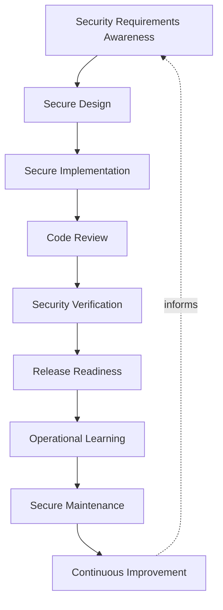
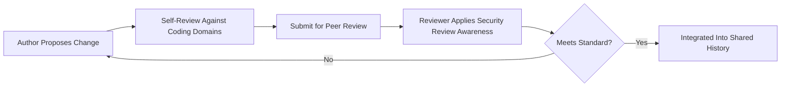
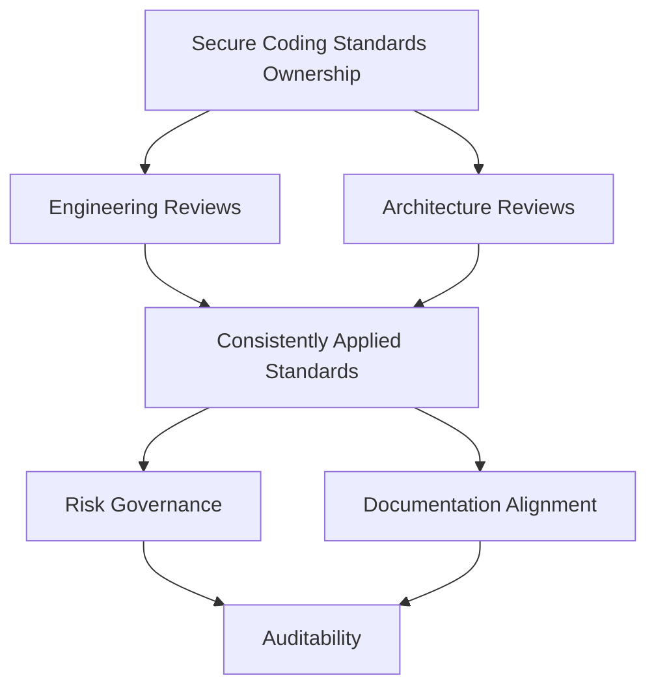
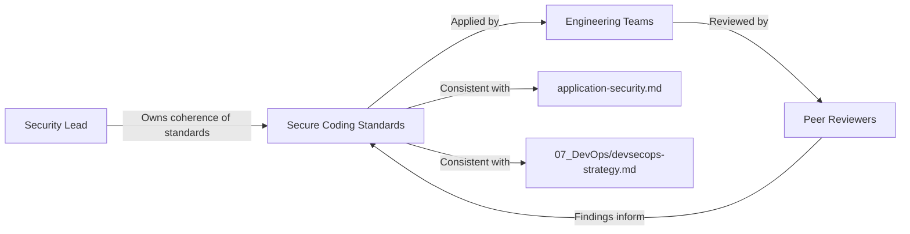
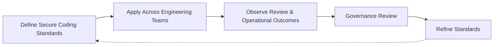

# Secure Coding Standards

## 1. Document Purpose

This document defines the official Enterprise Secure Coding Standards for **StackLeo Tech Store**. It is the engineering-level companion to `application-security.md`: where that document defines the enterprise application security strategy and Secure SDLC at an architectural level, this document elaborates the same discipline down to the level of everyday engineering practice — what a secure-minded engineer considers while writing, reviewing, and maintaining code.

- **Purpose of Secure Coding Standards** — to ensure that secure behavior is a normal, expected property of everyday engineering work, not a specialized activity performed separately from writing code.
- **Relationship with Secure SDLC** — this document elaborates the Development, Testing, and Maintenance phases of the Secure SDLC defined in `application-security.md` (Section 3) into concrete, engineering-facing standards.
- **Relationship with Application Security** — this document does not redefine application security strategy; it operationalizes the Security Design Principles in `application-security.md` (Section 5) as standards engineers apply directly in their day-to-day work.
- **Relationship with DevSecOps** — this document is the secure-coding counterpart to the delivery-lifecycle discipline defined in `07_DevOps/devsecops-strategy.md`; DevSecOps embeds security into the pipeline, while this document embeds it into the code the pipeline carries.
- **Relationship with Software Quality** — secure code and quality code are not separate concerns; the review, maintainability, and readability standards in Section 5 exist because insecure code is, in practice, a category of poor-quality code, consistent with `security-testing.md`.
- **Relationship with Business Risk Management** — avoidable coding weaknesses are one of the most common, most preventable sources of business risk; this document exists to reduce that risk at its most upstream, least expensive point of correction, consistent with `security-principles.md` (Section 5).

This document is implementation-independent and vendor-neutral. It defines secure coding philosophy, lifecycle, domains, and governance — not specific programming languages, frameworks, tools, or code.

## 2. Secure Development Philosophy

- **Secure by Design** — security is considered while a solution is being designed, not inspected in after implementation, consistent with `security-principles.md` (Section 8). *Business value:* avoids the materially higher cost of retrofitting security into an already-built solution.
- **Security by Default** — the natural, unconfigured behavior of code is its most secure reasonable behavior. *Business value:* protects against risk introduced by oversight rather than intent.
- **Least Privilege** — code operates with only the access its function genuinely requires, consistent with `authorization.md`. *Business value:* limits the damage a single compromised or defective component can cause.
- **Defense in Depth** — no single coding safeguard is relied upon exclusively; protections reinforce one another, consistent with `security-architecture.md` (Section 5). *Business value:* preserves protection even when one safeguard fails or is bypassed.
- **Fail Secure** — when code cannot make a confident decision, the default outcome is denial, never silent permission, consistent with `security-principles.md` (Section 3.5). *Business value:* prevents ambiguous conditions from becoming unintended access.
- **Simplicity** — the simplest solution that genuinely meets a requirement is preferred over a more complex one that anticipates unproven future need. *Business value:* reduces the surface area available for defects and misuse, and makes code easier to review with confidence.
- **Shared Responsibility** — every engineer is responsible for the security of the code they write and review, not only a specialized security function. *Business value:* scales secure practice across the entire engineering organization rather than bottlenecking it through a single team.
- **Continuous Improvement** — secure coding practice matures deliberately as the codebase, team, and threat landscape evolve. *Business value:* keeps standards relevant rather than fixed to assumptions made at an earlier, smaller scale.

## 3. Secure Development Lifecycle

### Security Requirements Awareness

- **Purpose** — recognize the security-relevant expectations a unit of work must satisfy before implementation begins.
- **Business Value** — prevents security needs from being discovered reactively during or after implementation.
- **Governance Objectives** — connect every unit of work to a deliberate awareness of its security-relevant requirements.

### Secure Design

- **Purpose** — shape the specific approach to a unit of work with security consequence in mind, informed by `threat-model.md`.
- **Business Value** — identifies realistic risk before implementation effort is invested in a specific approach.
- **Governance Objectives** — ensure design decisions with meaningful security consequence are reviewed before implementation begins.

### Secure Implementation

- **Purpose** — write code consistent with the domains defined in Section 4.
- **Business Value** — reduces the introduction of avoidable weaknesses during implementation.
- **Governance Objectives** — treat secure implementation as a normal expectation of engineering work, not an exception.

### Code Review

- **Purpose** — have code examined by someone other than its author before it is integrated, consistent with `git-strategy.md`.
- **Business Value** — catches defects and design concerns, including security-relevant ones, before they affect the wider codebase.
- **Governance Objectives** — ensure security-relevant review criteria are a genuine, not nominal, part of every review.

### Security Verification

- **Purpose** — confirm that security assumptions about the implemented code are genuinely true, per `security-testing.md`, rather than merely trusted.
- **Business Value** — provides evidence-based confidence before release, not assumed correctness.
- **Governance Objectives** — treat security verification as a required condition of progressing, not an optional check.

### Release Readiness

- **Purpose** — confirm that what is about to reach production matches its intended, reviewed design.
- **Business Value** — prevents undocumented drift between what was designed, reviewed, and what actually ships.
- **Governance Objectives** — connect release readiness directly to the gates defined in `07_DevOps/ci-cd-strategy.md`.

### Operational Learning

- **Purpose** — extract insight from how code actually behaves once it is live.
- **Business Value** — turns real operational experience into durable engineering knowledge.
- **Governance Objectives** — ensure operational signal is fed back into coding practice, not observed and forgotten.

### Secure Maintenance

- **Purpose** — sustain a codebase's security posture as it evolves and its dependencies change.
- **Business Value** — prevents security relevance from decaying silently as software ages.
- **Governance Objectives** — treat maintenance as an ongoing security responsibility, not a purely functional one.

### Continuous Improvement

- **Purpose** — mature secure coding practice itself as the codebase, organization, and threat landscape evolve.
- **Business Value** — keeps standards aligned with genuine, current risk rather than static assumption.
- **Governance Objectives** — ensure this document is reviewed and evolved deliberately, not left static.

*Diagram 1: Enterprise Secure Development Lifecycle — security awareness moves from requirements and design through implementation, review, and verification, into release, operational learning, and ongoing maintenance, with outcomes feeding continuous improvement.*

### Secure Development Lifecycle Matrix

| Stage | Purpose | Business Value |
|---|---|---|
| Security Requirements Awareness | Recognize security-relevant expectations before implementation | Prevents reactive discovery of security needs |
| Secure Design | Shape approach with security consequence in mind | Identifies realistic risk before implementation investment |
| Secure Implementation | Write code consistent with defined coding domains | Reduces avoidable weaknesses introduced during implementation |
| Code Review | Independent examination before integration | Catches security-relevant defects before wider impact |
| Security Verification | Confirm security assumptions are genuinely true | Provides evidence-based confidence before release |
| Release Readiness | Confirm shipped code matches reviewed design | Prevents undocumented drift between design and reality |
| Operational Learning | Extract insight from live behavior | Turns operational experience into durable knowledge |
| Secure Maintenance | Sustain posture as code and dependencies evolve | Prevents security relevance from decaying silently |
| Continuous Improvement | Mature practice itself over time | Keeps standards aligned with genuine, current risk |

## 4. Secure Coding Domains

### Input Validation

- **Purpose** — treat data entering code from any source as untrusted until validated against expected form and business rules.
- **Scope** — every point at which code receives data from a user, another system, or an external source.
- **Governance Expectations** — validation is applied consistently, never assumed to have occurred upstream.
- **Business Importance** — prevents malformed or malicious data from being treated as trustworthy, consistent with `application-security.md` (Section 5).

### Output Handling

- **Purpose** — present data leaving code toward a user or another system in a manner that prevents unintended interpretation or execution.
- **Scope** — every point at which code produces data consumed by a user interface, another system, or a log.
- **Governance Expectations** — output handling is applied proportionate to where the data is going and how it will be interpreted there.
- **Business Importance** — prevents outbound data from becoming a vector for compromising its recipient.

### Authentication Awareness

- **Purpose** — recognize where code depends on a verified identity, and never assume identity that has not been genuinely established.
- **Scope** — every point at which code makes a decision that should depend on who is making a request.
- **Governance Expectations** — coordinated with `authentication.md`, which remains authoritative for authentication principles.
- **Business Importance** — prevents unverified actors from being treated as verified ones.

### Authorization Awareness

- **Purpose** — recognize where code must confirm that a verified actor is permitted to perform a specific action, distinct from confirming who they are.
- **Scope** — every point at which code grants access to a capability or data.
- **Governance Expectations** — coordinated with `authorization.md`, which remains authoritative for authorization principles.
- **Business Importance** — prevents a verified but unauthorized actor from acting beyond their legitimate scope.

### Session Management Awareness

- **Purpose** — recognize that a session's validity can change over its lifetime and should not be assumed constant.
- **Scope** — every point at which code relies on the continued legitimacy of an established session.
- **Governance Expectations** — coordinated with the Zero Trust continuous verification principles in `security-principles.md` (Section 4).
- **Business Importance** — closes the gap a one-time authentication check leaves open for the remainder of a long-lived session.

### Error Handling

- **Purpose** — ensure that failure conditions are handled deliberately, and that error information does not itself become a source of exposure.
- **Scope** — every point at which code can encounter an unexpected or invalid condition.
- **Governance Expectations** — errors are handled consistently with Fail Secure (Section 2); ambiguous conditions default to denial.
- **Business Importance** — prevents error handling from becoming an accidental disclosure of internal detail or an accidental grant of access.

### Logging Awareness

- **Purpose** — recognize what should and should not be recorded when code logs an event.
- **Scope** — every point at which code produces a record intended for later diagnostic or audit use.
- **Governance Expectations** — logging content is deliberately scoped to avoid recording secrets or excessive personal data, consistent with `privacy.md`.
- **Business Importance** — ensures logs remain a trustworthy diagnostic asset without becoming a secondary exposure risk.

### Secrets Handling

- **Purpose** — recognize where code interacts with credentials, keys, or other sensitive operational material.
- **Scope** — every point at which code reads, uses, or passes a secret.
- **Governance Expectations** — governed jointly with `secrets-management.md` and `07_DevOps/secrets-management.md`, which remain authoritative for secrets lifecycle and protection.
- **Business Importance** — prevents secrets from being embedded, logged, or exposed through careless handling.

### Dependency Governance

- **Purpose** — treat every third-party component a codebase relies on as a deliberate decision, not a default.
- **Scope** — libraries, frameworks, and other external components integrated into a codebase.
- **Governance Expectations** — coordinated with the Supply Chain Security principles in `application-security.md` (Section 7).
- **Business Importance** — prevents an externally introduced weakness from becoming an internally exploitable one.

### Configuration Awareness

- **Purpose** — recognize that code behavior often depends on configuration, and that configuration itself carries security consequence.
- **Scope** — every point at which code's behavior is shaped by environment- or context-specific settings.
- **Governance Expectations** — coordinated with `07_DevOps/configuration-management.md`, which remains authoritative for configuration governance.
- **Business Importance** — prevents secure code from being undermined by insecure configuration.

### Secure Coding Domain Matrix

| Domain | Purpose | Business Importance |
|---|---|---|
| Input Validation | Treat incoming data as untrusted until validated | Prevents malformed or malicious data being trusted |
| Output Handling | Prevent unintended interpretation of outbound data | Prevents outbound data becoming a compromise vector |
| Authentication Awareness | Never assume unverified identity as verified | Prevents unverified actors being treated as verified |
| Authorization Awareness | Confirm permission distinct from identity | Prevents verified actors acting beyond legitimate scope |
| Session Management Awareness | Recognize session validity can change over time | Closes the gap left open by one-time authentication |
| Error Handling | Handle failure deliberately, without exposure | Prevents errors becoming disclosure or unintended access |
| Logging Awareness | Recognize what should and should not be recorded | Keeps logs a trustworthy asset, not a secondary exposure |
| Secrets Handling | Recognize interaction points with sensitive material | Prevents secrets from careless embedding or exposure |
| Dependency Governance | Treat third-party components as deliberate decisions | Prevents external weakness becoming internal exposure |
| Configuration Awareness | Recognize configuration's security consequence | Prevents secure code being undermined by insecure config |

## 5. Code Quality & Security Governance

- **Code Review Principles** — every change is reviewed by someone other than its author, evaluating correctness, design, and security consistency, consistent with `git-strategy.md`.
- **Security Review Awareness** — reviewers deliberately consider the coding domains in Section 4 as part of every review, not only functional correctness.
- **Peer Review** — review is a genuine, collaborative examination, not a formality performed to satisfy a process requirement.
- **Maintainability** — code is written to be safely changed by someone other than its original author, reducing the risk of insecure modification later.
- **Readability** — clear, well-named code is treated as a security property, since unclear code is materially harder to review for security consequence.
- **Secure Documentation** — code that implements a security-relevant decision documents the reasoning behind it, consistent with `commit-conventions.md`.
- **Continuous Refactoring** — code is deliberately improved over time, preventing the accumulation of complexity that erodes reviewability and security confidence.

*Diagram 3: Secure Code Review Workflow — a proposed change is self-checked, submitted for peer review with deliberate security awareness, and either returned for correction or integrated once it genuinely meets the standard.*

### Code Quality Governance Matrix

| Practice | Focus | Business Value |
|---|---|---|
| Code Review Principles | Independent examination of every change | Catches defects and security concerns before integration |
| Security Review Awareness | Deliberate consideration of coding domains | Ensures security is genuinely, not nominally, reviewed |
| Peer Review | Genuine collaborative examination | Prevents review from becoming a hollow formality |
| Maintainability | Code safely changeable by others | Reduces risk of insecure modification later |
| Readability | Clear, well-named code | Makes security consequence easier to identify in review |
| Secure Documentation | Reasoning behind security-relevant decisions | Preserves context for future maintainers |
| Continuous Refactoring | Deliberate ongoing improvement | Prevents complexity eroding reviewability and confidence |

## 6. Secure Development Governance

- **Ownership** — a designated secure coding standards owner, coordinated with the Security Lead in `security-governance.md`, is accountable for the coherence of this document.
- **Engineering Reviews** — Engineering leads are accountable for ensuring the standards in Section 4 and Section 5 are genuinely applied within their domain.
- **Architecture Reviews** — significant secure coding standard changes are evaluated for consistency with `application-security.md` and `security-architecture.md`.
- **Risk Governance** — gaps identified through code review or operational learning are assessed for risk consistent with `security-principles.md` (Section 5).
- **Documentation Alignment** — this document remains consistent with `application-security.md`, `authentication.md`, `authorization.md`, and `secrets-management.md` as those documents evolve.
- **Auditability** — significant secure coding decisions and review outcomes are recorded consistently with `security-principles.md` (Section 9).

*Diagram 2: Secure Coding Governance Framework — ownership drives engineering and architecture review, sustaining consistently applied standards, risk governance, documentation alignment, and full auditability.*

*Diagram 4: Secure Engineering Operating Model — the Security Lead owns standards applied by engineering teams and checked through peer review, with review findings feeding back into the standards, kept consistent with application security and DevSecOps strategy.*

### Secure Development Governance Matrix

| Governance Area | Focus | Accountable For |
|---|---|---|
| Ownership | Coherence of this document | Overall standards coherence and currency |
| Engineering Reviews | Genuine application within engineering domains | Standards being followed in practice, not only on paper |
| Architecture Reviews | Consistency with broader security architecture | Preventing divergence from `application-security.md` |
| Risk Governance | Assessment of identified gaps | Proportionate response to genuine risk |
| Documentation Alignment | Consistency with related security documents | Preventing contradictory or stale guidance |
| Auditability | Recorded decisions and review outcomes | Supporting investigation and compliance |

## 7. Future Readiness

- **Cloud-Native Platforms** — secure coding domains are defined independent of any specific provider, allowing adoption of elastic, provider-hosted infrastructure without redefining this document.
- **Microservices** — as capability decomposes into a growing number of independently deployable services, secure coding domains scale to each service boundary without requiring redefinition.
- **AI-Assisted Development** — code produced with the assistance of AI tooling is held to the same secure coding domains and review discipline as any other code, with no reduced scrutiny on the basis of how it was authored.
- **Marketplace Platform** — as StackLeo evolves toward business sales, corporate accounts, wholesale, and a multi-vendor marketplace, secure coding standards extend to seller-facing capability without redefinition.
- **Multi-Tenant Architecture** — authorization awareness (Section 4) extends to enforce isolation between tenants as the marketplace introduces multiple independent seller contexts.
- **Platform Engineering** — secure coding domain enforcement is intended to be supported by self-service platform capability through `07_DevOps/platform-engineering.md`, making the secure path the easy path.
- **Global Engineering Teams** — as StackLeo grows from Bangladesh into South Asia and, over time, global markets, these standards remain independent of contributor location, supporting distributed teams under consistent expectations.

## 8. Governance

- **Ownership** — a designated secure coding standards owner is accountable for the coherence and enforcement of this document across all engineering teams.
- **Review Process** — significant changes to secure coding domains or lifecycle expectations are reviewed consistent with the review discipline in `03_System_Design/architecture-decisions.md`.
- **Secure Coding Policies** — individual teams may define coding detail consistent with this document, but may not contradict the domains or principles defined here.
- **Audit Readiness** — review outcomes and standards decisions are maintained in a state that supports audit and investigation at any time.
- **Continuous Improvement** — this document is expected to mature as the codebase, organization, and threat landscape evolve, consistent with `security-principles.md` (Section 9).

*Diagram 5: Continuous Secure Development Improvement Cycle — standards are applied across engineering teams, their outcomes observed, reviewed by governance, and refined, with refinements feeding directly back into the standards.*

### Governance Responsibility Matrix

| Governance Area | Owner | Accountable For |
|---|---|---|
| Ownership | Secure Coding Standards Owner | Coherence and enforcement of this document |
| Review Process | Security & Architecture Teams | Reviewing changes to domains and lifecycle expectations |
| Secure Coding Policies | Engineering Teams | Detail consistent with enterprise domains and principles |
| Audit Readiness | Security Team | Review outcomes ready for audit at any time |
| Continuous Improvement | Security Lead / Engineering Leadership | Maturing standards as codebase and threat landscape evolve |

## 9. Anti-Patterns

- **Security as an Afterthought** — considering security only after implementation is complete, rather than during design. This contradicts Secure by Design and makes correction materially more costly.
- **Hardcoded Secrets** — embedding credentials or keys directly within code. This directly contradicts Secrets Handling (Section 4) and exposes secrets to anyone with codebase access.
- **Weak Input Validation** — treating incoming data as trustworthy without validation. This contradicts Input Validation (Section 4) and allows malformed or malicious data to be acted upon.
- **Weak Error Handling** — allowing failure conditions to expose internal detail or default to unintended access. This contradicts Fail Secure and Error Handling (Section 4).
- **Poor Dependency Governance** — adopting or retaining third-party components without deliberate evaluation. This contradicts Dependency Governance (Section 4) and allows external weakness to become internal exposure.
- **Weak Code Reviews** — treating review as a formality rather than genuine, security-aware examination. This contradicts Section 5 and removes the primary safeguard against defects reaching shared history.
- **Poor Documentation** — leaving security-relevant coding decisions unexplained. This makes standards difficult to apply consistently and future maintenance riskier.
- **Missing Continuous Improvement** — treating current coding standards as permanently sufficient. This guarantees standards fall behind the codebase's growing scale and the evolving threat landscape.

### Anti-Pattern Summary

| Anti-Pattern | Why It Must Be Avoided |
|---|---|
| Security as an Afterthought | Retrofitted security is materially costlier and structurally weaker |
| Hardcoded Secrets | Exposes secrets to anyone with codebase access |
| Weak Input Validation | Allows malformed or malicious data to be acted upon |
| Weak Error Handling | Errors become a source of disclosure or unintended access |
| Poor Dependency Governance | External weakness becomes internal exposure |
| Weak Code Reviews | Removes the primary safeguard against defects reaching shared history |
| Poor Documentation | Standards become difficult to apply consistently over time |
| Missing Continuous Improvement | Standards fall behind codebase scale and threat landscape |

## 10. Document Information

| Property | Value |
|----------|-------|
| Document | secure-coding-standards.md |
| Version | 1.0.0 |
| Status | Active |
| Maintained By | StackLeo |
| Last Updated | 2026-07-24 |

---

© StackLeo. All Rights Reserved.
