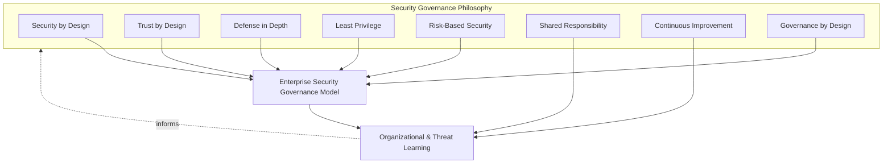
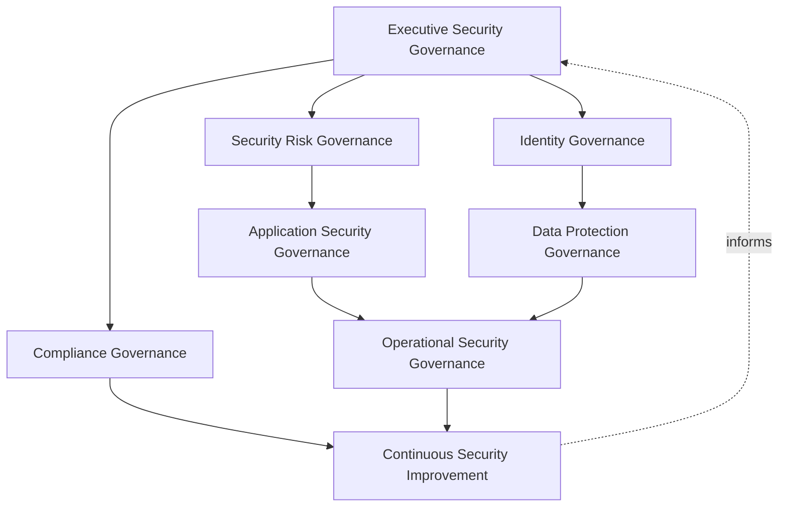
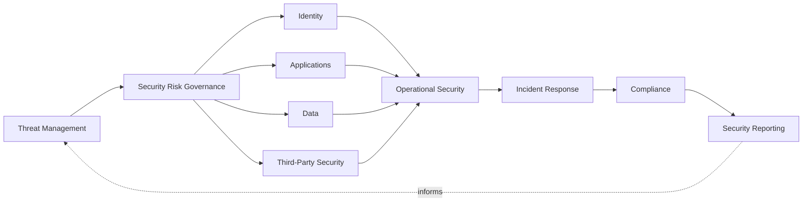
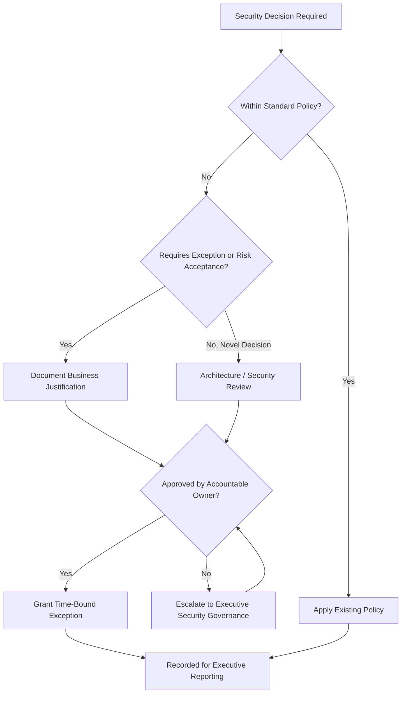
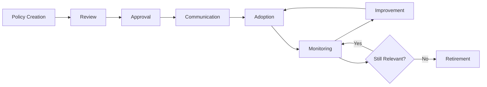
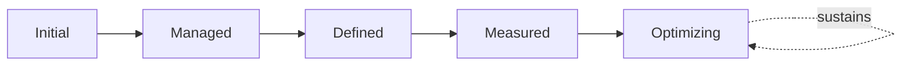

# Security Governance

## 1. Document Purpose

This document defines the official Enterprise Security Governance Strategy for **StackLeo Tech Store**. It is the master governance framework for the entire `06_Security` domain — the document that holds every other security strategy together as a coherent, accountable whole, without redefining what any of them individually establish.

- **Purpose of Security Governance** — to ensure that security decisions across the platform are made deliberately, by accountable people, against a consistent set of principles, never left to accumulate as ad hoc, undocumented judgment calls.
- **Relationship with Enterprise Governance** — security governance is not a separate, parallel structure to how StackLeo governs the rest of the business; it is the security-specific application of the same executive accountability and decision discipline that governs architecture (`03_System_Design/architecture-decisions.md`), quality (`08_Quality_Assurance/qa-governance.md`), and operations (`09_Operations/operations-governance.md`).
- **Relationship with Business Strategy** — this framework ensures security decisions serve `01_Business/business-model.md` and `01_Business/vision.md` directly; security exists to let the business pursue growth — corporate sales, wholesale, the multi-vendor marketplace — with confidence, not to obstruct it.
- **Relationship with Risk Management** — this document operationalizes accountability for the risk philosophy defined in `security-principles.md` (Section 5) and `threat-model.md`, consistent with ISO 31000 thinking, ensuring risk decisions have a clear, traceable owner.
- **Relationship with Enterprise Architecture** — this document is the governance layer sitting above the domain-specific strategies in `06_Security` (identity, application, data, infrastructure, operational), ensuring they remain coherent with one another and with `03_System_Design/architecture-principles.md` (Section 11).
- **Relationship with Operations** — day-to-day operational security execution is governed jointly with `09_Operations/operations-governance.md` (Section 3.7, Compliance Governance); this document remains authoritative for security philosophy and policy, while operational practice executes it continuously.
- **Relationship with Compliance** — this framework provides the structural governance foundation upon which the specific regulatory and contractual obligations tracked in `compliance.md` are reliably satisfied, never the reverse.

This document is implementation-independent and vendor-neutral. It defines governance philosophy, structure, and lifecycle — not specific security products, vendors, cloud providers, SIEM platforms, IAM platforms, firewalls, antivirus solutions, cryptographic algorithms, authentication protocols, workflows, infrastructure configurations, or code.

### Security Documents Covered

This governance framework sits above every subordinate security strategy, coordinating their relationships without repeating their implementation detail:

| Security Domain | Governing Document(s) | Governance Relationship |
|---|---|---|
| Identity & Access Management | `identity-management.md` | Provides the identity lifecycle model Identity Governance (Section 3.3) oversees. |
| Authentication & Authorization | `authentication.md`, `authorization.md` | Provide the verification and access-scoping mechanisms Identity Governance (Section 3.3) holds accountable. |
| Zero Trust Security | `zero-trust-strategy.md` | Provides the trust-verification posture that Security Risk Governance (Section 3.2) and Executive Security Governance (Section 3.1) hold as a standing commitment. |
| Application Security | `application-security.md`, `frontend-security.md`, `backend-security.md`, `secure-coding-standards.md` | Provide the Secure SDLC practice Application Security Governance (Section 3.4) oversees. |
| API Security | `api-security.md` | Provides the API-specific protection reviewed jointly with `05_API/api-governance.md`. |
| Data Security | `data-protection.md` | Provides the data classification and handling model Data Protection Governance (Section 3.5) oversees. |
| Secrets Management | `secrets-management.md` | Provides the credential and key protection practice Data Protection Governance (Section 3.5) holds accountable. |
| Encryption Governance | `encryption.md` | Provides the cryptographic protection philosophy Data Protection Governance (Section 3.5) oversees. |
| Privacy Management | `privacy.md` | Provides the privacy-by-design commitment Data Protection Governance (Section 3.5) and Compliance Governance (Section 3.7) jointly hold. |
| Security Logging | `security-monitoring.md` | Provides the log capture foundation Operational Security Governance (Section 3.6) depends on for evidence. |
| Security Monitoring | `security-monitoring.md` | Provides the continuous detection capability Operational Security Governance (Section 3.6) oversees. |
| Vulnerability Management | `vulnerability-management.md` | Provides the exception governance principles this framework's Decision-Making Framework (Section 6) references directly. |
| Threat Modeling | `threat-model.md` | Provides the risk classification Security Risk Governance (Section 3.2) uses to inform decisions. |
| Security Incident Response | `incident-response.md` | Provides the escalation and crisis response practice Operational Security Governance (Section 3.6) oversees, coordinated with `09_Operations/incident-management.md`. |
| Security Awareness | Addressed within `security-principles.md` (Section 4, Shared Responsibility) pending a dedicated strategy document | Reinforces Shared Responsibility (Section 2.6) as a cultural, not only technical, commitment. |
| Compliance Management | `compliance.md` | Provides the regulatory and contractual obligation tracking Compliance Governance (Section 3.7) oversees. |
| Third-Party Security | `security-architecture.md` (Section 4, trust boundaries), `application-security.md` (Section 7) | Provide the vendor and partner trust model Security Risk Governance (Section 3.2) extends to external dependencies. |
| Security Architecture | `security-architecture.md` | Provides the structural security model every governance layer in Section 3 is evaluated against for consistency. |

## 2. Security Governance Philosophy

Security governance at StackLeo is built on eight principles. Each exists to produce a specific business outcome — governance is pursued because of the trust and resilience it protects at scale, not as bureaucratic overhead.

### 2.1 Security by Design

Security is considered from the moment a capability is conceived, not inspected in after implementation is complete, consistent with `security-principles.md` (Section 2).

- **Business Value** — a security weakness prevented at design time costs a fraction of one discovered in production, protecting both delivery velocity and customer trust.

### 2.2 Trust by Design

Every architectural and governance decision is evaluated for whether it makes StackLeo's trust commitment structurally justified, not merely asserted, consistent with `security-architecture.md` (Section 2).

- **Business Value** — trust is StackLeo's core differentiator per `01_Business/vision.md`; governance exists to make that trust durable rather than aspirational.

### 2.3 Defense in Depth

Protection is distributed across independent layers — identity, application, data, infrastructure, operations — so no single control's failure compromises the whole, consistent with `security-architecture.md` (Section 5).

- **Business Value** — ensures a single point of failure in any one layer does not become a single point of failure for the entire business.

### 2.4 Least Privilege

Access and authority are scoped to the minimum necessary for a legitimate purpose, at every layer this governance framework oversees.

- **Business Value** — limits the blast radius of any single compromised credential, role, or component, reducing the consequence of an inevitable eventual failure.

### 2.5 Risk-Based Security

Governance decisions weigh business impact and likelihood, consistent with `security-principles.md` (Section 5) and ISO 31000 thinking, rather than applying uniform rigor regardless of consequence.

- **Business Value** — directs finite security investment toward the risks that matter most, rather than spreading effort evenly regardless of consequence.

### 2.6 Shared Responsibility

Security governance spans Executive Leadership, Security, Engineering, Operations, and Product, consistent with the shared responsibility model in `06_Security/README.md` (Section 7), not the sole burden of any one function.

- **Business Value** — prevents the anti-pattern in Section 10.3, where security degrades because it is treated as a specialist concern disconnected from everyday decisions.

### 2.7 Continuous Improvement

Governance itself is treated as a discipline that matures over time, reviewed and revised as the organization and threat landscape evolve.

- **Business Value** — keeps security governance aligned with StackLeo's growth in scale, architectural complexity, and business model, and with an evolving threat landscape.

### 2.8 Governance by Design

Governance structures are established deliberately as security capability is built, not retrofitted once gaps have already emerged.

- **Business Value** — prevents the costly, high-visibility discovery of governance gaps only after a security incident has already demonstrated their absence.

*Diagram 1: Enterprise Security Governance Framework — the eight principles shape the governance model, and organizational and threat-landscape learning feed back into the philosophy itself.*

## 3. Enterprise Security Governance Model

Security governance operates across eight conceptual layers, each holding accountability for a distinct dimension of security practice.

### 3.1 Executive Security Governance

- **Purpose** — provide visible, accountable executive sponsorship for security and make or ratify decisions of significant business risk.
- **Business Value** — signals that security is a genuine business priority and secures the resourcing security requires.
- **Governance Objectives** — ensure Executive Leadership is informed of and accountable for significant security risk decisions, consistent with Executive Sponsorship (Section 5.1).

### 3.2 Security Risk Governance

- **Purpose** — track, prioritize, and escalate security risk consistently across every domain, consistent with ISO 31000 thinking.
- **Business Value** — ensures accepted risk is always a deliberate, accountable decision, never a silent default.
- **Governance Objectives** — consolidate risk visibility from `threat-model.md`, `zero-trust-strategy.md`, and third-party trust boundaries in `security-architecture.md`; the full ISO 31000/27005-aligned risk lifecycle, domains, and treatment governance are elaborated in `security-risk-management.md`.

### 3.3 Identity Governance

- **Purpose** — own the coherence of identity, authentication, and authorization practice across the platform.
- **Business Value** — makes every downstream access decision trustworthy, since identity is foundational to all other security domains.
- **Governance Objectives** — ensure `identity-management.md`, `authentication.md`, and `authorization.md` remain mutually consistent; the complete IAM governance model, identity domains, and lifecycle are elaborated fully in `identity-access-management.md`.

### 3.4 Application Security Governance

- **Purpose** — own the coherence of Secure SDLC practice across frontend, backend, and API surfaces.
- **Business Value** — protects the integrity of the core commerce experience that directly generates revenue and trust.
- **Governance Objectives** — ensure `application-security.md`, `api-security.md`, and `secure-coding-standards.md` remain aligned with Engineering accountability (Section 4.4).

### 3.5 Data Protection Governance

- **Purpose** — own the coherence of data classification, encryption, secrets, and privacy practice.
- **Business Value** — protects the asset — customer and business data — that both commerce and trust depend on most directly.
- **Governance Objectives** — ensure `data-protection.md`, `encryption.md`, `secrets-management.md`, and `privacy.md` remain coherent with one another.

### 3.6 Operational Security Governance

- **Purpose** — own the coherence of monitoring, logging, vulnerability management, and incident response practice while the platform is running.
- **Business Value** — determines how quickly trust can be restored after an adverse event; prevention alone is insufficient without operational response capability.
- **Governance Objectives** — ensure `security-monitoring.md`, `vulnerability-management.md`, and `incident-response.md` remain coordinated with `09_Operations/incident-management.md`.

### 3.7 Compliance Governance

- **Purpose** — ensure security practice satisfies applicable regulatory and contractual obligations.
- **Business Value** — protects StackLeo's license to operate in its current and future markets.
- **Governance Objectives** — ensure `compliance.md` and `privacy.md` reflect obligations relevant to StackLeo's current and expanding markets.

### 3.8 Continuous Security Improvement

- **Purpose** — govern the mechanism by which every other layer in this model matures over time.
- **Business Value** — prevents governance itself from becoming the next thing that quietly stagnates as the organization and threat landscape evolve.
- **Governance Objectives** — ensure improvement actions from Section 9 (Governance Lifecycle) and post-incident findings are tracked to completion with equal discipline.

### Enterprise Security Governance Matrix

| Layer | Purpose | Business Value | Governance Objective |
|---|---|---|---|
| Executive Security Governance | Provide accountable executive sponsorship | Signals genuine business priority, secures resourcing | Executive Leadership accountable for significant risk decisions |
| Security Risk Governance | Track and escalate security risk consistently | Accepted risk is always a deliberate decision | Consolidates risk visibility across threat, zero trust, and third-party domains |
| Identity Governance | Own coherence of identity, authentication, authorization | Makes every downstream access decision trustworthy | Keeps the three identity documents mutually consistent |
| Application Security Governance | Own coherence of Secure SDLC across surfaces | Protects the core revenue-generating commerce experience | Keeps application/API/coding standards aligned with Engineering |
| Data Protection Governance | Own coherence of classification, encryption, privacy | Protects the asset trust and commerce depend on most | Keeps data, encryption, secrets, and privacy documents coherent |
| Operational Security Governance | Own coherence of monitoring, vulnerability, incident practice | Determines speed of trust restoration after an event | Coordinates with operational incident management practice |
| Compliance Governance | Ensure practice satisfies regulatory/contractual obligations | Protects license to operate in current and future markets | Keeps compliance and privacy current with expanding markets |
| Continuous Security Improvement | Govern maturation of every other governance layer | Prevents governance itself from stagnating | Improvement actions tracked with equal discipline |

*Diagram 2: Security Governance Operating Model — eight layers spanning executive sponsorship through continuous improvement, forming a closed organizational loop.*

## 4. Enterprise Security Domains

This section discusses governance responsibility for the security domains that the subordinate strategies in `06_Security` implement in full detail.

### 4.1 Identity

- **Purpose** — establish and continuously verify who or what is acting before any access decision is made.
- **Governance Scope** — oversight of `identity-management.md`, including lifecycle management for human and system identities.
- **Executive Expectations** — leadership trusts that every access decision downstream rests on a genuinely verified identity.
- **Business Importance** — makes every other security domain's access decisions meaningful.

### 4.2 Authentication

- **Purpose** — verify claimed identity before granting any access.
- **Governance Scope** — oversight of `authentication.md`, including verification strength proportionate to risk.
- **Executive Expectations** — leadership is confident authentication rigor matches the sensitivity of what it protects.
- **Business Importance** — the first structural checkpoint protecting every customer and administrative interaction.

### 4.3 Authorization

- **Purpose** — scope what a verified identity may legitimately do, consistent with Least Privilege (Section 2.4).
- **Governance Scope** — oversight of `authorization.md`, including role and permission model consistency.
- **Executive Expectations** — leadership trusts that access is never broader than legitimate need requires.
- **Business Importance** — limits the consequence of any single compromised identity.

### 4.4 Applications

- **Purpose** — ensure the platform's software resists misuse and attack across every layer customers or systems interact with.
- **Governance Scope** — oversight of `application-security.md`, `frontend-security.md`, `backend-security.md`, and `secure-coding-standards.md`.
- **Executive Expectations** — leadership is confident Secure SDLC practice is genuinely followed, not merely documented.
- **Business Importance** — protects the integrity of the core commerce experience — catalog, cart, checkout, order fulfillment.

### 4.5 APIs

- **Purpose** — protect the contracts through which channels and external parties consume platform capability.
- **Governance Scope** — oversight of `api-security.md`, coordinated with `05_API/api-governance.md`.
- **Executive Expectations** — leadership trusts API-level protection scales consistently as channels multiply.
- **Business Importance** — protects every current and future channel simultaneously, since a broken API affects all its consumers at once.

### 4.6 Data

- **Purpose** — protect the confidentiality, integrity, and availability of data across its lifecycle.
- **Governance Scope** — oversight of `data-protection.md`, `encryption.md`, and `secrets-management.md`.
- **Executive Expectations** — leadership understands data classification decisions and their protective implications.
- **Business Importance** — protects the asset both commerce and trust depend on most directly.

### 4.7 Privacy

- **Purpose** — ensure data is used only as customers would reasonably expect.
- **Governance Scope** — oversight of `privacy.md`, coordinated with Compliance Governance (Section 3.7).
- **Executive Expectations** — leadership is confident privacy commitments are structurally, not merely aspirationally, honored.
- **Business Importance** — protects customer trust and regulatory standing simultaneously.

### 4.8 Infrastructure

- **Purpose** — protect the environment the platform runs in, independent of any single provider or deployment model.
- **Governance Scope** — oversight of `infrastructure-security.md` and `network-security.md`.
- **Executive Expectations** — leadership trusts that environment weaknesses cannot become business weaknesses.
- **Business Importance** — supports the multi-cloud and cloud-portability posture referenced in `security-principles.md` (Section 10).

### 4.9 Third-Party Security

- **Purpose** — govern trust extended to external parties — payment, courier, communication providers, and future marketplace partners.
- **Governance Scope** — oversight of trust boundaries in `security-architecture.md` (Section 4) and vendor considerations in `application-security.md` (Section 7).
- **Executive Expectations** — leadership understands and consciously accepts the risk carried by each external dependency.
- **Business Importance** — protects the business from disruption or compromise it does not directly cause but remains responsible for managing.

### 4.10 Operational Security

- **Purpose** — sustain protection while the platform is running.
- **Governance Scope** — oversight of `security-monitoring.md`, coordinated with `09_Operations/monitoring-observability.md`.
- **Executive Expectations** — leadership trusts that significant security-relevant events would genuinely be detected.
- **Business Importance** — determines whether prevention failures are caught before they become customer-visible incidents.

### 4.11 Threat Management

- **Purpose** — maintain a current, structured understanding of the threats the platform genuinely faces.
- **Governance Scope** — oversight of `threat-model.md`, feeding Security Risk Governance (Section 3.2) directly.
- **Executive Expectations** — leadership reviews the threat landscape periodically, not only after an incident forces attention to it.
- **Business Importance** — provides the evidentiary foundation for proportionate, risk-based security investment.

### 4.12 Incident Response

- **Purpose** — respond to security-relevant disruption in a coordinated, timely, learning-oriented way.
- **Governance Scope** — oversight of `incident-response.md`, coordinated with `09_Operations/incident-management.md` (Section 4.4, Security Incidents).
- **Executive Expectations** — leadership is informed of significant security incidents promptly and reviews them formally.
- **Business Importance** — determines how much business and customer impact a security event ultimately causes.

### 4.13 Compliance

- **Purpose** — satisfy applicable regulatory, contractual, and policy obligations.
- **Governance Scope** — oversight of `compliance.md`, coordinated with `01_Business/business-rules.md` (Section 17).
- **Executive Expectations** — leadership understands current obligations and StackLeo's standing against them.
- **Business Importance** — protects StackLeo's license to operate in Bangladesh and its future markets.

### 4.14 Security Knowledge

- **Purpose** — sustain shared organizational understanding of security principles and practice.
- **Governance Scope** — oversight of security awareness as a cultural commitment, consistent with Shared Responsibility (Section 2.6), pending a dedicated strategy document.
- **Executive Expectations** — leadership trusts security understanding is not concentrated in the Security function alone.
- **Business Importance** — reduces the likelihood of avoidable security failures caused by lack of awareness outside the Security team.

### 4.15 Security Reporting

- **Purpose** — communicate security posture to the stakeholders who depend on it for decisions.
- **Governance Scope** — oversight of Executive Reporting (Section 6), coordinated with `09_Operations/operations-metrics-kpis.md`.
- **Executive Expectations** — leadership receives an honest, evidence-based security picture on a predictable cadence.
- **Business Importance** — is the mechanism through which every other domain's health becomes visible enough to govern.

### Security Domain Governance Matrix

| Domain | Purpose | Executive Expectations | Business Importance |
|---|---|---|---|
| Identity | Establish and verify who or what is acting | Trusts every access decision rests on verified identity | Makes every downstream access decision meaningful |
| Authentication | Verify claimed identity before granting access | Confident rigor matches sensitivity of what's protected | First structural checkpoint for every interaction |
| Authorization | Scope what a verified identity may legitimately do | Trusts access is never broader than legitimate need | Limits consequence of any single compromised identity |
| Applications | Resist misuse and attack across software layers | Confident Secure SDLC is genuinely followed | Protects the core revenue-generating commerce experience |
| APIs | Protect contracts consumed by channels and partners | Trusts protection scales as channels multiply | Protects every current and future channel simultaneously |
| Data | Protect confidentiality, integrity, availability | Understands classification decisions and implications | Protects the asset commerce and trust depend on most |
| Privacy | Ensure data used only as customers reasonably expect | Confident commitments are structurally honored | Protects customer trust and regulatory standing |
| Infrastructure | Protect the runtime environment | Trusts environment weaknesses can't become business weaknesses | Supports multi-cloud, cloud-portability posture |
| Third-Party Security | Govern trust extended to external parties | Understands and consciously accepts dependency risk | Protects against disruption StackLeo doesn't directly cause |
| Operational Security | Sustain protection while the platform runs | Trusts significant events would genuinely be detected | Catches prevention failures before customer-visible impact |
| Threat Management | Maintain current understanding of genuine threats | Reviews threat landscape periodically, not only reactively | Foundation for proportionate, risk-based investment |
| Incident Response | Respond to security disruption in a coordinated way | Informed promptly, reviews significant incidents formally | Determines ultimate business/customer impact of an event |
| Compliance | Satisfy regulatory, contractual, policy obligations | Understands current obligations and standing | Protects license to operate in current and future markets |
| Security Knowledge | Sustain shared organizational security understanding | Trusts understanding isn't concentrated in Security alone | Reduces avoidable failures from lack of awareness |
| Security Reporting | Communicate posture to dependent stakeholders | Receives an honest, evidence-based picture predictably | Makes every domain's health visible enough to govern |

*Diagram 3: Cross-Domain Security Governance Model — the fifteen security domains form a connected chain, from threat understanding through protective domains, operational response, and compliance, into reporting that informs the next cycle of threat awareness.*

## 5. Security Governance Principles

- **Executive Ownership** — significant security decisions are made or ratified at the executive level, proportionate to their business consequence, consistent with Executive Sponsorship.
- **Accountability** — every security decision, policy, and accepted risk traces to a specific, named accountable role, never left ambiguous.
- **Risk Awareness** — governance decisions are informed by a clear understanding of the risk involved, consistent with `threat-model.md` (Section 7) and ISO 31000.
- **Continuous Assessment** — security posture is assessed on an ongoing basis, not confirmed once and assumed to remain valid indefinitely.
- **Auditability** — governance decisions and their outcomes can be reviewed after the fact, supporting ISO/IEC 27001-aligned assurance.
- **Documentation Integrity** — this framework and its subordinate strategies are kept mutually consistent, never allowed to silently diverge.
- **Cross-Functional Collaboration** — governance decisions engage every function with a genuine stake, consistent with Shared Responsibility (Section 2.6).
- **Continuous Improvement** — governance practice itself matures over time, informed by real security experience and the evolving threat landscape.

### Security Governance Principle Matrix

| Principle | Description | Business Value |
|---|---|---|
| Executive Ownership | Significant decisions made or ratified at the executive level | Reflects genuine business consequence |
| Accountability | Every decision, policy, and accepted risk traces to a named role | Prevents gaps from persisting due to unclear responsibility |
| Risk Awareness | Decisions informed by clear understanding of the risk involved | Enables deliberate, informed risk-taking rather than blind exposure |
| Continuous Assessment | Posture assessed on an ongoing basis, not confirmed once | Keeps confidence current as conditions and threats change |
| Auditability | Decisions and outcomes can be reviewed after the fact | Supports ISO/IEC 27001-aligned assurance and audit confidence |
| Documentation Integrity | Framework and subordinate strategies kept mutually consistent | Prevents governance decisions being made against stale information |
| Cross-Functional Collaboration | Decisions engage every function with a genuine stake | Surfaces impact no single function could see alone |
| Continuous Improvement | Governance matures from real experience and threat evolution | Keeps governance aligned with organizational and threat-landscape growth |

## 6. Executive Oversight

- **Security Reviews** — significant architectural, product, and operational decisions are reviewed against the applicable strategy documents in `06_Security` before adoption.
- **Executive Reporting** — aggregated security posture is reported to executive leadership on a predictable cadence, coordinated with `09_Operations/operations-metrics-kpis.md`.
- **Governance Reviews** — this framework itself is formally reviewed on a regular cadence, ensuring the overall governance model remains coherent as `06_Security` grows.
- **Risk Reviews** — accepted risk (Section 6 Decision-Making Framework) is periodically reassessed, never left as a one-time decision assumed to remain valid indefinitely.
- **Compliance Reviews** — alignment with applicable regulatory and contractual obligations is reviewed jointly with `compliance.md`, particularly ahead of market expansion.
- **Audit Readiness** — governance decisions, reviews, and their outcomes are maintained in a state ready for internal or external audit at any time, without requiring advance preparation.

### Executive Oversight Matrix

| Oversight Mechanism | Purpose | Governance Role |
|---|---|---|
| Security Reviews | Evaluate significant decisions against applicable strategy documents | Confirms decisions are consistent with governed policy |
| Executive Reporting | Provide leadership a single, coherent security picture | Coordinated with enterprise operational KPI reporting |
| Governance Reviews | Confirm this framework itself remains coherent | Regular, predictable cadence for the framework as a whole |
| Risk Reviews | Reassess previously accepted risk periodically | Prevents stale risk acceptance from persisting unexamined |
| Compliance Reviews | Confirm alignment with regulatory/contractual obligations | Reviewed jointly with `compliance.md`, especially before expansion |
| Audit Readiness | Maintain decisions and reviews ready for independent review | Continuous state, not preparation-triggered |

*Diagram 4: Executive Security Decision Flow — decisions route through standard policy, exception justification, or architecture review, converging on an accountable approval that feeds executive reporting.*

### Governance Responsibility Matrix

| Role | Responsibility |
|---|---|
| Executive Leadership | Sets risk appetite, sponsors security investment, holds ultimate accountability for business consequences of security decisions. |
| Security Leadership | Owns coherence of security strategies across `06_Security`, coordinates cross-domain governance and Executive Security Governance (Section 3.1). |
| Enterprise Architecture | Ensures security governance remains consistent with `03_System_Design/architecture-principles.md`. |
| Engineering Teams | Apply governed security principles within their domain; surface gaps or conflicts for review. |
| Operations Teams | Execute operational security and monitoring practice, coordinated with `09_Operations/operations-governance.md`. |
| Product Teams | Ensure new capability is evaluated against applicable security governance before commitment. |
| Compliance & Risk Functions | Track alignment with applicable legal, regulatory, and contractual obligations, coordinated with `compliance.md`. |
| Internal Audit | Independently verifies that governed policy and practice actually match. |

## 7. Future Readiness

This framework is designed to remain valid as StackLeo evolves in scale and organizational complexity, without requiring redefinition of its underlying philosophy.

- **Cloud-Native Platforms** — governance principles (Section 2) apply consistently regardless of the specific infrastructure technologies adopted, per `infrastructure-security.md`.
- **AI Systems** — AI-assisted capability is governed under the same Decision-Making Framework (Section 6) as any other system component, with attention to its bounded scope per `identity-management.md` (Section 8), never adopted as an unreviewed shortcut around governance.
- **Marketplace Platform** — governance extends naturally to seller-facing policy domains (vendor identity, marketplace data) as the marketplace launches, using the same structure defined in Section 3.
- **Multi-Tenant Architecture** — Identity and Data Protection Governance (Sections 3.3, 3.5) extend to explicitly govern cross-tenant isolation as architecture evolves.
- **Multi-Region Operations** — governance structures apply consistently regardless of the number of regions the platform operates in.
- **Global Expansion** — this framework remains jurisdiction-agnostic, allowing region-specific compliance obligations to layer on via `compliance.md` without requiring the underlying governance structure to be redefined.
- **Evolving Cyber Threats** — Threat Management (Section 4.11) and Security Risk Governance (Section 3.2) are structured to absorb genuinely new categories of threat as they emerge, consistent with NIST Cybersecurity Framework's ongoing risk-identification discipline, without requiring the broader governance model to be redesigned.
- **Enterprise Scale** — corporate and wholesale customers bring heightened expectations for governance maturity, which this framework's Auditability and Continuous Assessment principles (Section 5) are designed to satisfy at any scale.

## 8. Governance Framework

- **Ownership** — the CISO (or equivalent accountable executive function) owns this framework and is accountable for the coherence of every subordinate strategy within `06_Security`, in partnership with Executive, Engineering, and Operations leadership.
- **Review Process** — this framework is formally reviewed whenever a material change occurs in business model (`01_Business/business-model.md`), architecture (`03_System_Design`), or the threat landscape (`threat-model.md`), and on a regular recurring cadence independent of specific change events.
- **Security Policies** — the detailed policy hierarchy, lifecycle, and exception governance are elaborated fully in `security-policies.md`; every document within `06_Security` operates as a policy subordinate to this governance framework, and a subordinate document that conflicts with the principles defined here is treated as a governance gap requiring resolution.
- **Documentation Governance** — the Security Documents Covered table (Section 1) is kept current as new security strategies are authored, ensuring this framework's coordinating role remains accurate.
- **Audit Readiness** — this framework and the evidence it requires are maintained in a state ready for internal or external audit at any time, without requiring advance preparation.
- **Continuous Improvement** — this framework itself is subject to Continuous Security Improvement (Section 3.8); its effectiveness is periodically assessed and revised based on genuine organizational and threat-landscape evidence.

Every policy and strategy document within `06_Security` follows a consistent lifecycle:

- **Policy Creation** — a new policy or strategy is drafted in response to an identified need, consistent with the domain structure in Section 4.
- **Review** — the draft is reviewed against this governance framework and relevant existing documents for consistency.
- **Approval** — the policy is formally approved by its accountable owner (Section 6, Governance Responsibility Matrix).
- **Communication** — the approved policy is communicated to the teams and stakeholders it affects.
- **Adoption** — the policy is put into actual practice, not merely published.
- **Monitoring** — adherence to the policy is observed over time, consistent with `security-testing.md` and `vulnerability-management.md` where applicable.
- **Improvement** — the policy is refined based on monitoring outcomes, incidents, and organizational change.
- **Retirement** — a policy no longer relevant is formally retired, avoiding the accumulation of stale, contradictory guidance.

*Diagram 5: Continuous Security Improvement Cycle — every policy proceeds through creation, review, approval, adoption, and monitoring, with improvement looping back into adoption until retirement is warranted.*

## 9. Security Governance Maturity Model

Security governance maturity is described across five conceptual levels, adapted from established process maturity thinking and consistent with NIST Cybersecurity Framework tiers. Progression reflects increasing consistency, measurement, and deliberate improvement — not merely increasing policy volume.

- **Initial** — security governance, where it exists, is informal and inconsistent; decisions depend heavily on individual initiative, and security is often addressed reactively after an issue has already surfaced.
- **Managed** — basic governance exists for individual security domains, but consistency across the fifteen domains in Section 4 varies significantly.
- **Defined** — governance layers, domains, and decision-making processes are standardized, documented, and consistently applied across the organization, consistent with the model defined throughout this document; ownership is clear organization-wide.
- **Measured** — security governance effectiveness is measured systematically — review completion, exception tracking, incident trend — and decisions are grounded in genuine evidence rather than qualitative impression alone.
- **Optimizing** — security governance is continuously and deliberately improved based on quantitative evidence and organizational learning; improvement itself is a managed, ongoing discipline rather than an occasional initiative.

### Security Governance Maturity Model Matrix

| Level | Characteristics | Primary Focus |
|---|---|---|
| Initial | Informal, individually-dependent governance; reactive to issues already surfaced | Ad hoc, reactive security decisions |
| Managed | Basic governance exists per domain; consistency varies | Domain-level consistency |
| Defined | Standardized, documented governance layers applied organization-wide | Organization-wide consistency and clear ownership |
| Measured | Effectiveness measured systematically via review and exception tracking | Evidence-based governance decisions |
| Optimizing | Practice continuously and deliberately improved from evidence | Sustained, deliberate improvement as a discipline |

*Diagram 6: Security Governance Maturity Progression Model — maturity advances from informal, reactive governance toward standardized, measured, and continuously optimized security governance.*

## 10. Anti-Patterns

The following recurring failure patterns are explicitly recognized and avoided, as each one structurally undermines this framework.

| Anti-Pattern | Why It's Avoided |
|---|---|
| Security as an Afterthought | Contradicts Security by Design (Section 2.1); retrofitted security is consistently costlier and structurally weaker than security considered from inception. |
| Weak Accountability | Contradicts Accountability (Section 5); when responsibility is diffused, security gaps persist because no specific role is answerable for them. |
| Siloed Security | Contradicts Cross-Functional Collaboration (Section 5); security governed in isolation from Engineering, Operations, and Product misses interdependencies the Cross-Domain Security Governance Model (Diagram 3) depends on. |
| Reactive Security | Contradicts Governance by Design (Section 2.8); governance assembled only after an incident has already occurred forfeits the far cheaper option of preventing it. |
| Poor Documentation | Undermines Documentation Integrity (Section 5), leaving this framework's coordinating role and subordinate policy unclear or unverifiable. |
| Weak Risk Visibility | Contradicts Risk Awareness (Section 5) and ISO 31000 thinking; decisions made without genuine risk understanding cannot be deliberately, proportionately governed. |
| Compliance Without Security | Confuses satisfying a regulatory checklist with genuine protection; compliance is a byproduct of sound governance (Section 3.7), never a substitute for the security practice it verifies. |
| Missing Continuous Improvement | Contradicts Continuous Improvement (Section 2.7) and Continuous Security Improvement (Section 3.8); without deliberate improvement, this framework itself becomes the next thing that silently stagnates as the organization and threat landscape evolve. |

## 11. Document Information

| Property | Value |
|----------|-------|
| Document | security-governance.md |
| Version | 1.1.0 |
| Status | Active |
| Maintained By | StackLeo |
| Last Updated | 2026-07-27 |

---

© StackLeo. All Rights Reserved.
