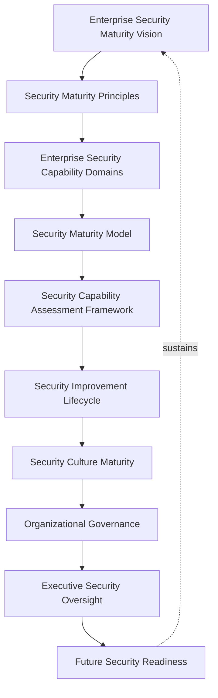
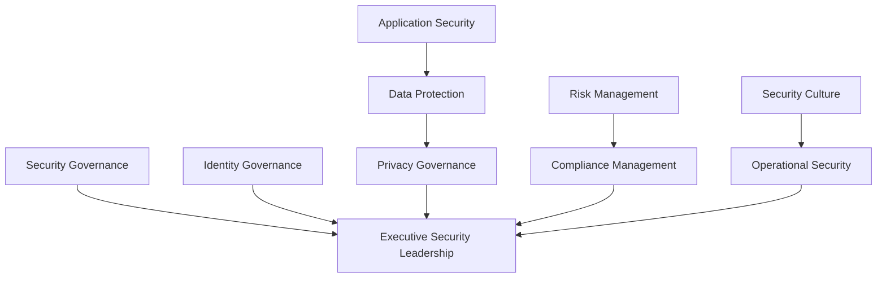
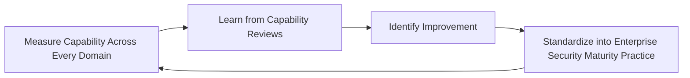
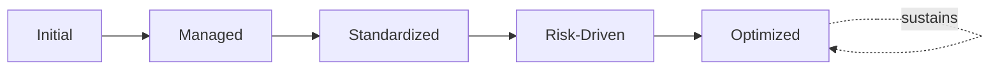
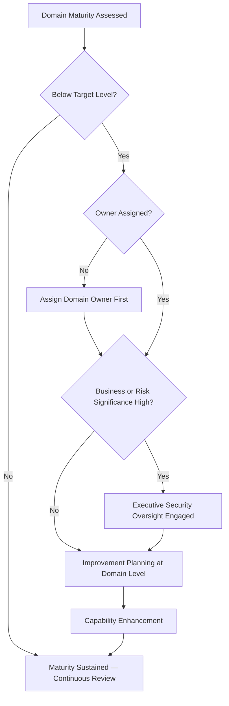

# Enterprise Security Maturity Framework

## 1. Executive Summary

**Purpose** — This document defines the official Enterprise Security Maturity Framework for **StackLeo Tech Store**. It establishes security capability evolution, governance maturity, security culture development, risk-based improvement, organizational accountability, executive oversight, and long-term security excellence as a single, consolidated maturity lens spanning every domain governed in `06_Security`. `security-roadmap.md` describes StackLeo's security evolution against the *business's* growth stages — from single-seller B2C toward corporate sales, wholesale, and marketplace; this framework describes the same evolution against a *capability maturity* lens, consolidating the individual maturity models already defined within `security-strategy.md`, `identity-access-governance.md`, `application-security-framework.md`, `data-privacy-framework.md`, `security-risk-management.md`, and `compliance-governance.md` into one coherent, cross-domain picture. It does not restate any domain's operational governance — it is the synthesis that lets leadership ask "how mature is our security posture overall?" and receive one coherent answer.

**Scope** — This framework applies to every capability domain governed in `06_Security` — security governance, identity governance, application security, data protection, privacy governance, risk management, compliance management, security culture, operational security, and executive security leadership — coordinated with every domain-specific governance document referenced throughout.

**Strategic Objectives** — To ensure security capability matures deliberately, not accidentally; that maturity is measured consistently across every domain rather than assessed unevenly; that improvement is prioritized by genuine risk and business alignment; and that executive leadership has one coherent, consolidated view of the organization's overall security maturity.

**Business Value** — A consolidated maturity framework protects security investment from being spent unevenly — heavily matured in one domain while another remains dangerously informal — protects leadership's ability to make proportionate investment decisions across the whole security portfolio, and gives the Board confidence that StackLeo's security capability is evolving deliberately alongside the business.

**Intended Audience** — The Board of Directors, executive leadership, the Chief Technology Officer, security leadership, engineering leadership, operations leadership, compliance leadership, and business stakeholders.

## 2. Enterprise Security Maturity Vision

- **Security as Organizational Capability** — security maturity is governed as a genuine organizational capability, never a static, one-time achievement.
- **Continuous Security Evolution** — security capability is expected to genuinely evolve over time, informed by real operational, risk, and threat outcomes.
- **Business Resilience** — a maturing security posture protects the organization's ability to withstand and recover from disruption.
- **Customer Trust** — security maturity is the organization's demonstrable evidence that customer trust is genuinely earned, not merely asserted.
- **Risk-Aware Culture** — security maturity is reflected in a genuine, organization-wide awareness of risk, not confined to the security function.
- **Sustainable Security Excellence** — security excellence is pursued as a durable, ongoing discipline, never a one-time hardening exercise.

### Enterprise Security Maturity Vision Matrix

| Vision Element | Focus | Business Value |
|---|---|---|
| Security as Organizational Capability | A genuine capability, not a one-time achievement | Prevents maturity from being treated as a completed project |
| Continuous Security Evolution | Genuine evolution informed by real outcomes | Keeps posture aligned with an evolving threat landscape |
| Business Resilience | Protects the ability to withstand and recover from disruption | Sustains reliability through active, ongoing operation |
| Customer Trust | Demonstrable evidence trust is genuinely earned | Protects the trust relationship every interaction depends on |
| Risk-Aware Culture | Genuine, organization-wide awareness of risk | Extends security beyond the security function alone |
| Sustainable Security Excellence | A durable, ongoing discipline, not a one-time exercise | Protects security investment from eroding over time |

*Diagram 1: Enterprise Security Maturity Framework — the maturity vision establishes principles and capability domains, flowing through the maturity model, assessment, and improvement lifecycle into culture, organizational governance, and executive oversight, with future readiness reinforcing the vision itself.*

## 3. Security Maturity Principles

Security maturity governance at StackLeo rests on eight principles, each producing a specific business outcome.

- **Continuous Improvement** — security capability is expected to genuinely mature over time, never assumed static once initially established. *Business Value:* keeps capability aligned with the organization's growing scale and an evolving threat landscape.
- **Risk-Based Evolution** — maturity investment is prioritized by genuine risk, not applied uniformly regardless of consequence. *Business Value:* directs limited maturity investment toward what genuinely matters most.
- **Business Alignment** — maturity evolution is paced to genuinely match the business's own growth, coordinated with `security-roadmap.md`. *Business Value:* prevents security from either lagging behind or over-investing ahead of genuine business need.
- **Security Ownership** — every capability domain traces to a specific, named, responsible owner accountable for its maturity. *Business Value:* ensures no domain drifts without someone genuinely responsible for its evolution.
- **Accountability** — maturity progress and gaps are documented and owned, never left as an informal, unverified impression. *Business Value:* ensures maturity claims can be genuinely defended, not merely asserted.
- **Measurement** — maturity is assessed against genuine, consistent criteria across every domain. *Business Value:* allows domains to be compared fairly and investment prioritized accordingly.
- **Organizational Learning** — real operational and risk outcomes are genuinely converted into improved practice. *Business Value:* converts the cost of a security event into durable organizational capability.
- **Proactive Security Thinking** — maturity evolution anticipates a genuine future need, rather than reacting only once a gap has already caused harm. *Business Value:* protects the organization from the disproportionate cost of reactive maturation.

### Security Maturity Principles Matrix

| Principle | Description | Business Value |
|---|---|---|
| Continuous Improvement | Capability expected to genuinely mature over time | Keeps capability aligned with growing scale and threat evolution |
| Risk-Based Evolution | Investment prioritized by genuine risk | Directs limited investment toward what genuinely matters most |
| Business Alignment | Evolution paced to genuinely match business growth | Prevents lagging behind or over-investing ahead of need |
| Security Ownership | Every domain traces to a specific, responsible owner | Ensures no domain drifts without genuine responsibility |
| Accountability | Progress and gaps documented and owned | Ensures maturity claims can be genuinely defended |
| Measurement | Assessed against genuine, consistent criteria | Allows domains to be compared fairly and prioritized |
| Organizational Learning | Real outcomes genuinely converted into improved practice | Converts the cost of an event into durable capability |
| Proactive Security Thinking | Anticipates genuine future need, not only reacting | Protects against the disproportionate cost of reactive maturation |

## 4. Enterprise Security Capability Domains

Security maturity is governed across ten conceptual capability domains, each consolidating the maturity model already defined within its authoritative governance document.

### Security Governance

- **Purpose** — assess the maturity of StackLeo's overall security governance coherence.
- **Maturity Expectations** — evaluated against the maturity model defined in `security-strategy.md` (Section 11).
- **Business Value** — protects the organization's ability to genuinely govern security as a coherent discipline.
- **Executive Expectations** — leadership expects security governance maturity to be the foundation every other domain builds upon.

### Identity Governance

- **Purpose** — assess the maturity of identity and access governance.
- **Maturity Expectations** — evaluated against the maturity model defined in `identity-access-governance.md` (Section 12).
- **Business Value** — protects the platform's durable security perimeter.
- **Executive Expectations** — leadership expects identity governance maturity to be treated as foundational.

### Application Security

- **Purpose** — assess the maturity of application security governance.
- **Maturity Expectations** — evaluated against the maturity model defined in `application-security-framework.md` (Section 12).
- **Business Value** — protects the software layer customers directly encounter.
- **Executive Expectations** — leadership expects application security maturity to keep pace with delivery velocity.

### Data Protection

- **Purpose** — assess the maturity of data protection capability.
- **Maturity Expectations** — evaluated jointly with `06_Security/data-protection.md` and `04_Database/data-quality-framework.md`.
- **Business Value** — protects the trustworthiness of the data every business decision depends on.
- **Executive Expectations** — leadership expects data protection maturity proportionate to data sensitivity.

### Privacy Governance

- **Purpose** — assess the maturity of privacy governance.
- **Maturity Expectations** — evaluated against the maturity model defined in `data-privacy-framework.md` (Section 12).
- **Business Value** — protects the trust individuals extend to StackLeo with their personal data.
- **Executive Expectations** — leadership expects privacy maturity to evolve alongside regulatory change.

### Risk Management

- **Purpose** — assess the maturity of security risk management.
- **Maturity Expectations** — evaluated against the maturity model defined in `security-risk-management.md` (Section 9).
- **Business Value** — protects the organization's ability to genuinely understand its own exposure.
- **Executive Expectations** — leadership expects risk management maturity to inform genuine investment decisions.

### Compliance Management

- **Purpose** — assess the maturity of compliance governance.
- **Maturity Expectations** — evaluated against the maturity model defined in `compliance-governance.md` (Section 10).
- **Business Value** — protects the organization's standing with regulators and counterparties.
- **Executive Expectations** — leadership expects compliance maturity to be proactive, not reactive to findings.

### Security Culture

- **Purpose** — assess the maturity of genuine, organization-wide security awareness and ownership.
- **Maturity Expectations** — evaluated against Security Culture Maturity (Section 8).
- **Business Value** — protects the organization from the outsized risk a single uninformed action can introduce.
- **Executive Expectations** — leadership expects security culture maturity to extend genuinely beyond the security function.

### Operational Security

- **Purpose** — assess the maturity of security through genuine day-to-day operation.
- **Maturity Expectations** — evaluated jointly with `09_Operations/operations-governance.md`.
- **Business Value** — protects the organization's ability to detect and respond to a genuine security event.
- **Executive Expectations** — leadership expects operational security maturity to extend genuinely beyond deployment.

### Executive Security Leadership

- **Purpose** — assess the maturity of executive and Board-level engagement with security.
- **Maturity Expectations** — evaluated against Executive Security Oversight (Section 10).
- **Business Value** — protects the organization's most consequential security decisions with genuine leadership attention.
- **Executive Expectations** — leadership expects its own engagement to be measured with the same rigor as any operational domain.

### Security Capability Maturity Matrix

| Domain | Purpose | Business Value | Executive Expectations |
|---|---|---|---|
| Security Governance | Assess overall governance coherence maturity | Protects the ability to govern security as a coherent discipline | Expects governance maturity as the foundation for other domains |
| Identity Governance | Assess identity and access governance maturity | Protects the platform's durable security perimeter | Expects treatment as foundational |
| Application Security | Assess application security governance maturity | Protects the software layer customers directly encounter | Expects maturity to keep pace with delivery velocity |
| Data Protection | Assess data protection capability maturity | Protects the trustworthiness of data decisions depend on | Expects maturity proportionate to data sensitivity |
| Privacy Governance | Assess privacy governance maturity | Protects trust individuals extend with their personal data | Expects maturity to evolve alongside regulatory change |
| Risk Management | Assess security risk management maturity | Protects the ability to genuinely understand exposure | Expects maturity to inform genuine investment decisions |
| Compliance Management | Assess compliance governance maturity | Protects standing with regulators and counterparties | Expects proactive, not reactive, maturity |
| Security Culture | Assess organization-wide awareness and ownership maturity | Protects against the outsized risk of a single uninformed action | Expects maturity extending beyond the security function |
| Operational Security | Assess maturity of security through daily operation | Protects the ability to detect and respond to an event | Expects maturity extending genuinely beyond deployment |
| Executive Security Leadership | Assess executive and Board-level engagement maturity | Protects the most consequential decisions with leadership attention | Expects engagement measured with the same rigor as any domain |

*Diagram 2: Security Capability Evolution Model — security and identity governance, application security and data protection, privacy governance, risk and compliance management, and security culture and operational security all consolidate into executive security leadership's overall maturity picture.*

## 5. Security Maturity Model

Security maturity is described across five conceptual levels, consistent with the maturity models already defined across every domain-specific governance document in `06_Security`.

### Level 1: Initial

Security, where it exists, is informal and inconsistent across domains. Practice is addressed reactively, ownership is unclear, and no consistent maturity picture exists across the organization.

### Level 2: Managed

Basic governance exists for individual domains, but consistency across the ten domains in Section 4 varies significantly. Some domains may be well-governed while others remain informal.

### Level 3: Standardized

The governance model, domains, and lifecycle are standardized, documented, and consistently applied across the organization. Every domain in Section 4 has a defined, comparable maturity baseline.

### Level 4: Risk-Driven

Security decisions across every domain are genuinely and routinely made from evidenced risk understanding, not assumption. Maturity investment is prioritized consistently by genuine business consequence.

### Level 5: Optimized

Security maturity is continuously and deliberately improved based on quantitative evidence and organizational learning across every domain. Improvement itself is a managed, ongoing, enterprise-wide discipline.

### Security Maturity Level Matrix

| Level | Characteristics | Primary Focus |
|---|---|---|
| Initial | Informal, inconsistent practice; addressed reactively | Ad hoc, individually-dependent security practice |
| Managed | Basic governance exists per domain; consistency varies | Domain-level consistency |
| Standardized | Standardized governance model, domains, and lifecycle | Organization-wide consistency and clear ownership |
| Risk-Driven | Decisions genuinely and routinely risk-informed | Evidence-based security decision-making |
| Optimized | Practice continuously and deliberately improved from evidence | Sustained, deliberate, enterprise-wide improvement |

*Diagram 5: Continuous Security Excellence Cycle — capability across every domain is measured, learned from, improved upon, and standardized back into enterprise-wide practice, on a continuing basis.*

*Diagram 6: Security Maturity Progression — maturity advances from informal, reactively-addressed practice toward standardized, genuinely risk-driven, and continuously optimized enterprise security capability.*

## 6. Security Capability Assessment Framework

- **Capability Evaluation** — governs how a domain's current maturity is genuinely evaluated against Section 5's levels.
- **Maturity Assessment** — governs the periodic, formal assessment of maturity across every domain in Section 4.
- **Improvement Planning** — governs how an identified maturity gap is planned for deliberate advancement.
- **Business Alignment** — governs how maturity investment is weighed against genuine business priority.
- **Risk Prioritization** — governs how improvement effort is prioritized by genuine risk consequence.
- **Executive Review** — governs the point at which assessed maturity is reviewed with executive leadership.

### Security Assessment Matrix

| Assessment Area | Focus | Governance Coordination |
|---|---|---|
| Capability Evaluation | Evaluating current maturity against defined levels | Security Maturity Model (Section 5) |
| Maturity Assessment | Periodic, formal assessment across every domain | Enterprise Security Capability Domains (Section 4) |
| Improvement Planning | Planning deliberate advancement of a gap | Security Improvement Lifecycle (Section 7) |
| Business Alignment | Weighing investment against genuine business priority | Business Alignment (Section 3) |
| Risk Prioritization | Prioritizing effort by genuine risk consequence | Risk-Based Evolution (Section 3) |
| Executive Review | Reviewing assessed maturity with leadership | Executive Security Oversight (Section 10) |

## 7. Security Improvement Lifecycle

Security maturity improvement operates across seven conceptual stages.

- **Current State Assessment** — govern how a domain's genuine current maturity level is established.
- **Gap Identification** — govern how the genuine distance between current and target maturity is identified.
- **Improvement Planning** — govern how a deliberate plan to close an identified gap is developed.
- **Capability Enhancement** — govern the oversight applied while a capability is genuinely being strengthened.
- **Business Validation** — govern how an enhanced capability is confirmed to genuinely deliver its intended maturity improvement.
- **Continuous Review** — govern the periodic, formal review of maturity progress for genuine insight.
- **Maturity Evolution** — govern the periodic reassessment of whether target maturity itself remains aligned with evolving business need.

### Security Improvement Lifecycle Matrix

| Stage | Governance Objective | Business Value |
|---|---|---|
| Current State Assessment | Establish a domain's genuine current maturity | Ensures improvement begins from an accurate baseline |
| Gap Identification | Identify the genuine distance to target maturity | Directs improvement effort toward what genuinely matters |
| Improvement Planning | Develop a deliberate plan to close the gap | Converts assessed gap into concrete, actionable steps |
| Capability Enhancement | Apply oversight while a capability is strengthened | Ensures enhancement remains within governed boundaries |
| Business Validation | Confirm the enhancement delivers genuine improvement | Protects against declaring maturity progress prematurely |
| Continuous Review | Periodically review progress for genuine insight | Confirms improvement investment is genuinely working |
| Maturity Evolution | Reassess whether target maturity remains aligned | Keeps maturity goals genuinely connected to business intent |

*Diagram 3: Security Improvement Lifecycle — current state assessment and gap identification inform improvement planning and capability enhancement, feeding business validation and continuous review, with maturity evolution feeding lessons back into the cycle.*

## 8. Security Culture Maturity

- **Security Awareness** — governs whether every employee genuinely understands common security risk and their role in mitigating it.
- **Employee Responsibility** — governs every employee's genuine acceptance of responsibility for security within their role.
- **Engineering Security Mindset** — governs whether engineering teams genuinely internalize security as a design-time concern, not a late-stage gate.
- **Leadership Commitment** — governs whether leadership genuinely models and prioritizes security, not merely endorses it in policy.
- **Organizational Learning** — governs how a real security event deepens the organization's genuine collective understanding.
- **Continuous Security Education** — governs how security awareness is genuinely sustained and refreshed over time, not established once and assumed permanent.

### Security Culture Maturity considerations feed the Security Culture domain in Section 4 and are assessed using the same five-level model defined in Section 5.

## 9. Organizational Governance

Governance accountability is distributed deliberately across eight organizational roles.

- **Board of Directors** — holds ultimate accountability for StackLeo's overall security maturity trajectory.
- **Executive Leadership** — holds accountability for whether security maturity genuinely keeps pace with business growth, in partnership with the Board.
- **Chief Technology Officer** — owns the coherence of this framework's consolidation across every domain-specific maturity model.
- **Security Leadership** — owns the operational maturity assessment and improvement practice across `06_Security`.
- **Engineering Leadership** — own Application Security and Identity Governance maturity (Section 4) within their accountable teams.
- **Operations Leadership** — own Operational Security maturity (Section 4) in coordination with `09_Operations/operations-governance.md`.
- **Compliance Leadership** — own Compliance Management maturity (Section 4) jointly with `compliance-governance.md`.
- **Business Stakeholders** — own Business Alignment (Section 6) between maturity investment and genuine business priority.

### Organizational Responsibility Matrix

| Role | Governance Objective | Business Value |
|---|---|---|
| Board of Directors | Hold ultimate accountability for overall maturity trajectory | Provides the highest point of ultimate accountability |
| Executive Leadership | Hold accountability for maturity keeping pace with growth | Provides a single point of executive-level accountability |
| Chief Technology Officer | Own coherence of this framework's cross-domain consolidation | Connects the consolidated view to authoritative sources |
| Security Leadership | Own operational maturity assessment and improvement practice | Applies the framework to day-to-day maturity practice |
| Engineering Leadership | Own application security and identity governance maturity | Embeds accountability closest to where these domains are built |
| Operations Leadership | Own operational security maturity | Ensures accountability extends genuinely into sustained operation |
| Compliance Leadership | Own compliance management maturity | Ensures maturity genuinely meets regulatory obligation |
| Business Stakeholders | Own business alignment of maturity investment | Connects maturity investment to genuine business priority |

*Diagram 4: Security Governance Maturity Structure — a domain's assessed maturity is checked against target level, escalating to executive security oversight for high business or risk significance, resolving into improvement planning, capability enhancement, and sustained continuous review.*

## 10. Executive Security Oversight

- **Security Maturity Reviews** — the overall maturity picture across every domain in Section 4 is formally reviewed with executive leadership on a regular cadence.
- **Strategic Security Planning** — maturity investment priorities are reviewed directly with executive leadership against genuine business direction.
- **Risk Reviews** — the organization's genuine risk posture, informed by maturity assessment, is reviewed directly with executive leadership.
- **Capability Reviews** — the genuine capability of each domain is reviewed as a distinct, ongoing concern.
- **Business Resilience Reviews** — the organization's overall resilience, as reflected in aggregate maturity, is reviewed with executive leadership.
- **Continuous Improvement Reviews** — the organization's follow-through on captured maturity improvement lessons is reviewed directly with executive leadership.

### Executive Oversight Matrix

| Oversight Mechanism | Purpose | Governance Role |
|---|---|---|
| Security Maturity Reviews | Review overall maturity picture across every domain | Regular, predictable cadence for the framework as a whole |
| Strategic Security Planning | Review investment priorities against business direction | Direct executive-level strategic alignment review |
| Risk Reviews | Review genuine risk posture informed by maturity | Direct executive-level review of risk exposure |
| Capability Reviews | Review genuine capability of each domain | Treats capability as ongoing, not assumed |
| Business Resilience Reviews | Review overall resilience reflected in aggregate maturity | Direct executive-level resilience review |
| Continuous Improvement Reviews | Review follow-through on captured lessons | Direct executive-level review of improvement completion |

## 11. Future Security Readiness

This framework is designed to remain valid as StackLeo evolves in scale, geography, and organizational complexity.

- **AI Security Evolution** — as AI capability is adopted, coordinated with `04_Database/ai-governance.md`, its maturity remains assessed under Application Security and Data Protection (Section 4) at the same rigor as any other domain.
- **Intelligent Risk Management** — where risk management maturity increasingly draws on intelligent pattern analysis, that capability remains assessed under Risk Management (Section 4) at the same rigor as any other method.
- **Autonomous Security Governance (Conceptual)** — where automation increasingly performs steps within capability assessment or improvement planning, that automation remains subject to the same ownership and executive oversight as any human-performed activity.
- **Global Security Operations** — Capability Evaluation and Business Alignment (Section 6) are structured to be re-applied as StackLeo expands from Bangladesh into South Asia and global markets, each with genuinely distinct threat and regulatory conditions.
- **Digital Trust Evolution** — this framework's maturity discipline is treated as a direct, durable contributor to the digital trust customers, partners, and regulators extend to StackLeo.
- **Responsible Innovation** — new security capability is adopted only in a manner consistent with this framework's principles (Section 3), never at their expense.

## 12. Security Maturity Anti-Patterns

- **Security Without Strategy** — pursuing security maturity without genuine connection to `security-strategy.md`'s direction produces effort without coherent purpose.
- **Technology-First Security** — evaluating maturity by tooling adoption alone, rather than genuine governance and culture, mistakes the means for the outcome.
- **Compliance-Only Security** — treating regulatory adherence as the ceiling of maturity ambition, rather than its floor, leaves genuine risk unaddressed.
- **Reactive Security Culture** — allowing culture to mature only in response to an incident forfeits the chance to build it deliberately.
- **Missing Ownership** — a capability domain with no accountable owner has no one genuinely responsible for its maturity trajectory.
- **No Security Measurement** — asserting maturity without genuine, consistent assessment leaves claims unverifiable and undefendable.
- **Ignoring Continuous Improvement** — treating current maturity as permanently finished guarantees it falls behind the organization's growing scale and an evolving threat landscape.
- **Weak Executive Engagement** — leadership disengaged from maturity oversight undermines the accountability this entire framework depends on.

### Anti-Pattern Summary

| Anti-Pattern | Organizational & Business Impact |
|---|---|
| Security Without Strategy | Produces maturity effort without coherent, strategic purpose |
| Technology-First Security | Mistakes tooling adoption for genuine governance and culture |
| Compliance-Only Security | Leaves genuine risk unaddressed beyond the regulatory floor |
| Reactive Security Culture | Forfeits the chance to build culture deliberately before an incident |
| Missing Ownership | Leaves no one genuinely responsible for a domain's trajectory |
| No Security Measurement | Leaves maturity claims unverifiable and undefendable |
| Ignoring Continuous Improvement | Guarantees practice falls behind scale and an evolving landscape |
| Weak Executive Engagement | Undermines the accountability this entire framework depends on |

## Related Documents

| Document | Relationship |
|---|---|
| `security-strategy.md` | Provides the domain-specific maturity model (Section 11) this framework's Security Governance (Section 4) consolidates. |
| `identity-access-governance.md` | Provides the domain-specific maturity model (Section 12) this framework's Identity Governance (Section 4) consolidates. |
| `application-security-framework.md` | Provides the domain-specific maturity model (Section 12) this framework's Application Security (Section 4) consolidates. |
| `data-privacy-framework.md` | Provides the domain-specific maturity model (Section 12) this framework's Privacy Governance (Section 4) consolidates. |
| `security-risk-management.md` | Provides the domain-specific maturity model (Section 9) this framework's Risk Management (Section 4) consolidates. |
| `compliance-governance.md` | Provides the domain-specific maturity model (Section 10) this framework's Compliance Management (Section 4) consolidates. |
| `security-roadmap.md` | Provides the business-growth-stage lens this framework's capability-maturity lens complements. |
| `enterprise-risk-management-strategy.md` | Governs the enterprise risk discipline this framework's Risk Prioritization (Section 6) coordinates with. |

## Document Information

| Property | Value |
|----------|-------|
| Document | security-maturity-framework.md |
| Version | 1.0.0 |
| Status | Active |
| Maintained By | StackLeo |
| Last Updated | 2026-07-28 |

---

© StackLeo. All Rights Reserved.
