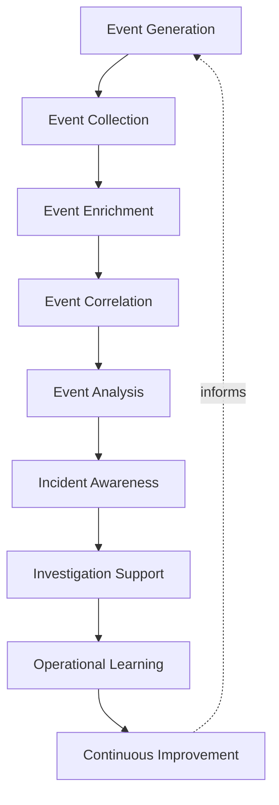
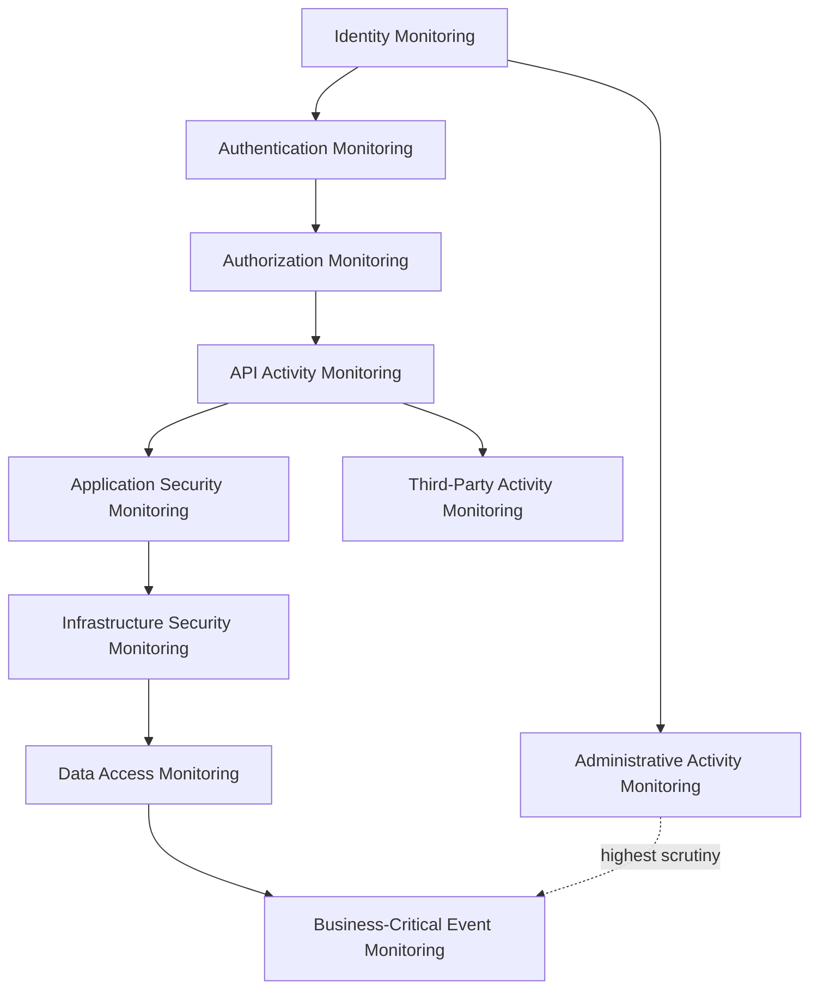
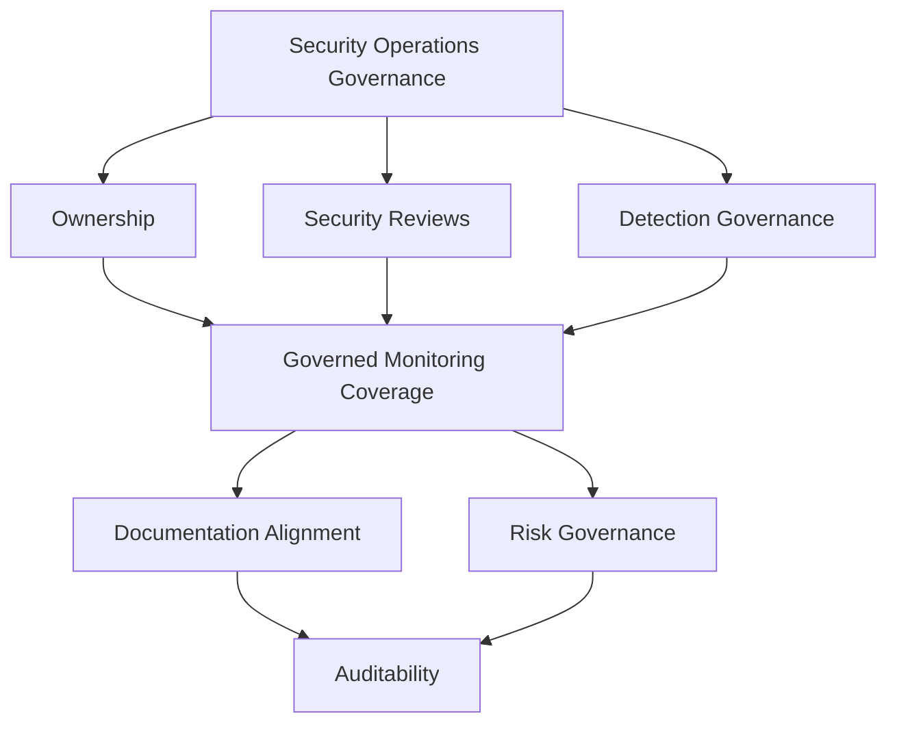
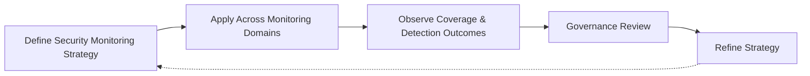

# Security Monitoring

## 1. Document Purpose

This document defines the official Enterprise Security Monitoring & Security Operations Strategy for **StackLeo Tech Store**. It establishes how security-relevant activity across the platform is made visible, understood, and acted upon continuously, without recommending specific SIEM, XDR, EDR, SOAR, or log management platforms.

- **Purpose of Security Monitoring** — to ensure that security-relevant activity across the platform is never invisible: that the organization can answer, at any time, what is happening, whether it is expected, and whether it warrants response.
- **Relationship with Enterprise Security** — this document elaborates the Operational Security domain defined in `security-architecture.md` (Section 4), applying it specifically to the discipline of continuous security event visibility.
- **Relationship with Security Operations** — this document defines the philosophy and governance that any Security Operations function, however it is eventually staffed and structured, is built upon.
- **Relationship with DevSecOps** — security monitoring is the operational-time counterpart to the delivery-time discipline in `07_DevOps/devsecops-strategy.md`; DevSecOps embeds security into how the platform is built and shipped, while this document embeds it into how the platform is watched while running.
- **Relationship with Incident Management** — this document is the detection and visibility foundation `incident-response.md` and `07_DevOps/incident-management.md` depend on; an incident cannot be responded to before it is detected, and detection quality directly determines response speed.
- **Relationship with Observability** — security monitoring and general operational observability, defined in `07_DevOps/observability-strategy.md`, share the same underlying telemetry foundation; this document defines the security-specific lens applied to that shared foundation.

This document is implementation-independent and vendor-neutral. It defines security monitoring philosophy, event lifecycle, domains, and governance — not specific platforms, detection rules, or monitoring configurations.

## 2. Security Monitoring Philosophy

- **Continuous Visibility** — the platform's security-relevant state is observed continuously, not sampled periodically or reconstructed only after something goes wrong. *Business value:* makes the organization's understanding of its own security posture current, not historical.
- **Security by Design** — monitoring coverage is considered from the point a capability is designed, consistent with `security-principles.md` (Section 8), not added as an afterthought once a capability is already live. *Business value:* avoids the coverage gaps that retrofitted monitoring consistently leaves behind.
- **Assume Breach** — monitoring is designed as though a compromise has already occurred somewhere within the platform, consistent with `security-principles.md` (Section 3.7). *Business value:* ensures detection capability exists for the scenario prevention cannot guarantee will never happen.
- **Defense in Depth** — no single monitoring source or technique is relied upon exclusively, consistent with `security-architecture.md` (Section 5). *Business value:* preserves detection capability even when a single monitoring source fails or is evaded.
- **Detection First** — the organization prioritizes the ability to detect a security-relevant condition promptly, treating detection as a prerequisite to every other response capability. *Business value:* reduces the window between a condition occurring and the organization becoming aware of it.
- **Shared Responsibility** — security monitoring coverage is owned jointly by the teams that build a capability and the function that watches it operate, not delegated entirely to a single specialized team. *Business value:* scales monitoring coverage across the organization rather than bottlenecking it.
- **Continuous Improvement** — security monitoring practice matures deliberately as the platform, organization, and threat landscape evolve, consistent with `security-principles.md` (Section 9). *Business value:* keeps monitoring coverage aligned with genuine, current risk.

## 3. Security Event Lifecycle

### Event Generation

- **Purpose** — ensure that security-relevant activity produces a discoverable record at the moment it occurs.
- **Business Value** — establishes the raw foundation every later stage of this lifecycle depends on.
- **Governance Objectives** — ensure event generation is a required property of security-relevant capability, not an optional addition.

### Event Collection

- **Purpose** — gather generated events reliably and consistently from across the platform.
- **Business Value** — ensures no security-relevant event is silently lost between where it occurs and where it can be analyzed.
- **Governance Objectives** — ensure collection coverage extends consistently across every domain defined in Section 4.

### Event Enrichment

- **Purpose** — add context to a raw event that makes it meaningfully interpretable on its own.
- **Business Value** — turns a bare technical record into something a human or system can genuinely act on.
- **Governance Objectives** — ensure enrichment is applied consistently, not dependent on which source produced the event.

### Event Correlation

- **Purpose** — connect related events across time, components, and domains to reveal a coherent picture.
- **Business Value** — surfaces patterns that no single isolated event would reveal on its own.
- **Governance Objectives** — ensure events are structured in a way that supports correlation, consistent with `07_DevOps/observability-strategy.md`.

### Event Analysis

- **Purpose** — interpret collected and correlated events to determine whether they represent expected or concerning activity.
- **Business Value** — converts raw and correlated data into an actionable security judgment.
- **Governance Objectives** — ensure analysis capability, human or automated, is available proportionate to the platform's risk.

### Incident Awareness

- **Purpose** — recognize when analyzed activity meets the threshold to be treated as a security incident.
- **Business Value** — connects detection directly to the response discipline in `incident-response.md`.
- **Governance Objectives** — ensure the threshold for incident awareness is defined consistently, not judged ad hoc.

### Investigation Support

- **Purpose** — provide the historical record and context needed to investigate a security-relevant condition thoroughly.
- **Business Value** — reduces the time and effort required to understand what happened and why.
- **Governance Objectives** — ensure retained telemetry is sufficient to support investigation without requiring reconstruction.

### Operational Learning

- **Purpose** — extract lasting understanding from what monitoring reveals, including gaps it exposes.
- **Business Value** — turns every detected condition, and every missed one, into an investment in future coverage.
- **Governance Objectives** — ensure learning is captured and acted upon, not lost after the moment passes.

### Continuous Improvement

- **Purpose** — mature the security event lifecycle itself as the platform, organization, and threat landscape evolve.
- **Business Value** — keeps monitoring capability aligned with genuine, current risk rather than static assumption.
- **Governance Objectives** — ensure this document is reviewed and evolved deliberately, not left static.

*Diagram 1: Enterprise Security Event Lifecycle — events move from generation and collection through enrichment and correlation, into analysis and incident awareness, supporting investigation, with operational learning driving continuous improvement.*

### Security Event Lifecycle Matrix

| Stage | Purpose | Business Value |
|---|---|---|
| Event Generation | Ensure security-relevant activity produces a discoverable record | Establishes the foundation every later stage depends on |
| Event Collection | Gather generated events reliably and consistently | Prevents silent loss of security-relevant events |
| Event Enrichment | Add context making events meaningfully interpretable | Turns bare technical records into actionable information |
| Event Correlation | Connect related events across time and components | Surfaces patterns no single isolated event would reveal |
| Event Analysis | Interpret events to judge expected vs. concerning activity | Converts data into an actionable security judgment |
| Incident Awareness | Recognize when analyzed activity meets incident threshold | Connects detection directly to response discipline |
| Investigation Support | Provide historical record and context for investigation | Reduces time and effort to understand what happened |
| Operational Learning | Extract understanding from detected and missed conditions | Turns every outcome into investment in future coverage |
| Continuous Improvement | Mature the lifecycle itself over time | Keeps capability aligned with genuine, current risk |

## 4. Security Monitoring Domains

### Identity Monitoring

- **Purpose** — observe activity related to the creation, modification, and use of identities.
- **Scope** — human and system identities across every category defined in `identity-management.md`.
- **Governance Expectations** — coordinated with `identity-management.md`, which remains authoritative for identity lifecycle principles.
- **Business Importance** — identity is the foundational trust domain; compromised identity monitoring undermines confidence in every other domain.

### Authentication Monitoring

- **Purpose** — observe patterns of successful and unsuccessful attempts to verify identity.
- **Scope** — every authentication event across every current and future sales channel.
- **Governance Expectations** — coordinated with `authentication.md`.
- **Business Importance** — surfaces credential compromise and abuse attempts before they succeed elsewhere.

### Authorization Monitoring

- **Purpose** — observe how granted access is actually exercised, distinct from how identity is verified.
- **Scope** — every access decision governed by `authorization.md`.
- **Governance Expectations** — coordinated with `authorization.md`.
- **Business Importance** — surfaces privilege misuse by otherwise legitimately authenticated actors.

### API Activity Monitoring

- **Purpose** — observe usage patterns across the contracts through which channels, services, and external parties interact with the platform.
- **Scope** — internal and external API traffic, consistent with `api-security.md`.
- **Governance Expectations** — coordinated with `05_API/api-strategy.md`.
- **Business Importance** — surfaces abuse, scraping, or misuse of the platform's most externally exposed surface.

### Application Security Monitoring

- **Purpose** — observe the behavior of application components for deviation from expected, secure operation.
- **Scope** — frontend, backend, and business logic capability defined in `application-security.md`.
- **Governance Expectations** — coordinated with `application-security.md`.
- **Business Importance** — surfaces application-layer compromise or misuse of business logic.

### Infrastructure Security Monitoring

- **Purpose** — observe the security-relevant state of the platform's underlying infrastructure.
- **Scope** — infrastructure defined in `infrastructure-security.md` and `07_DevOps/infrastructure-as-code.md`.
- **Governance Expectations** — coordinated with `infrastructure-security.md`.
- **Business Importance** — surfaces compromise of the foundation every other layer depends on.

### Data Access Monitoring

- **Purpose** — observe how sensitive data is accessed and used relative to its classification.
- **Scope** — data governed by `data-protection.md`.
- **Governance Expectations** — coordinated with `data-protection.md` and `privacy.md`.
- **Business Importance** — protects StackLeo's most sensitive asset from access that is technically permitted but contextually inappropriate.

### Administrative Activity Monitoring

- **Purpose** — observe the use of elevated, platform-wide privileged access with heightened scrutiny.
- **Scope** — administrative and operational personnel and systems with elevated privilege.
- **Governance Expectations** — held to the strictest monitoring standard of any domain, consistent with the Administrative Trust domain in `zero-trust-strategy.md`.
- **Business Importance** — protects against the highest-impact category of compromise, where a single account can affect the entire platform.

### Third-Party Activity Monitoring

- **Purpose** — observe activity originating from or directed toward external partners and integrations.
- **Scope** — payment providers, couriers, and future marketplace sellers.
- **Governance Expectations** — coordinated with the trust boundaries in `threat-model.md` (Section 6).
- **Business Importance** — surfaces risk introduced through relationships StackLeo does not directly control.

### Business-Critical Event Monitoring

- **Purpose** — observe activity affecting the platform's highest-value business assets, regardless of which technical domain it originates from.
- **Scope** — the Critical Assets defined in `threat-model.md` (Section 4), including customer accounts, orders, and payments.
- **Governance Expectations** — held to elevated visibility standards proportionate to business consequence.
- **Business Importance** — ensures monitoring priority reflects genuine business impact, not only technical convenience.

*Diagram 2: Security Monitoring Architecture — identity monitoring underpins authentication and authorization monitoring, extending through API, application, and infrastructure monitoring toward data access, with administrative and third-party activity held to heightened scrutiny and business-critical events given elevated priority.*

### Security Monitoring Domain Matrix

| Domain | Purpose | Business Importance |
|---|---|---|
| Identity Monitoring | Observe identity creation, modification, and use | Foundational domain underpinning confidence in all others |
| Authentication Monitoring | Observe successful and unsuccessful verification attempts | Surfaces credential compromise before it succeeds elsewhere |
| Authorization Monitoring | Observe how granted access is actually exercised | Surfaces privilege misuse by legitimate actors |
| API Activity Monitoring | Observe usage patterns across API contracts | Surfaces abuse of the most externally exposed surface |
| Application Security Monitoring | Observe application behavior for expected operation | Surfaces application-layer compromise or logic misuse |
| Infrastructure Security Monitoring | Observe security-relevant infrastructure state | Surfaces compromise of the platform's foundation |
| Data Access Monitoring | Observe access relative to data classification | Protects the platform's most sensitive asset |
| Administrative Activity Monitoring | Observe elevated privileged access use | Protects against the highest-impact compromise category |
| Third-Party Activity Monitoring | Observe activity involving external partners | Surfaces risk from relationships not directly controlled |
| Business-Critical Event Monitoring | Observe activity affecting highest-value assets | Ensures priority reflects genuine business impact |

## 5. Security Telemetry Strategy

- **Security Event Visibility** — the platform's true security-relevant state is always knowable, consistent with the Observability by Design principle in `07_DevOps/observability-strategy.md`.
- **Context Awareness** — security telemetry is interpreted alongside relevant context — identity, device, and behavior — consistent with the Zero Trust trust evaluation in `zero-trust-strategy.md`.
- **Risk-Based Visibility** — visibility investment is proportionate to the business importance of what is being observed, consistent with the risk management philosophy in `security-principles.md` (Section 5).
- **Threat Awareness** — telemetry strategy is informed by the realistic threat categories defined in `threat-model.md` (Section 5), ensuring coverage exists where it is most needed.
- **Operational Intelligence** — security telemetry contributes to broader operational understanding, not only incident detection, consistent with `07_DevOps/observability-strategy.md`.
- **Security Observability** — security-specific telemetry shares the same underlying observability foundation as general operational telemetry, applying a dedicated security lens rather than a separate, disconnected system of record.

*Diagram 3: Security Telemetry Flow — security-relevant sources feed visibility that is contextualized, prioritized by risk, and informed by threat awareness, converging on operational intelligence within a shared observability foundation.*

### Security Telemetry Matrix

| Concept | Focus | Business Value |
|---|---|---|
| Security Event Visibility | Platform's true security state always knowable | Removes guesswork from understanding platform behavior |
| Context Awareness | Telemetry interpreted alongside identity and behavior | Grounds judgments in the full picture, not isolated signals |
| Risk-Based Visibility | Investment proportionate to business importance | Focuses coverage where consequence is greatest |
| Threat Awareness | Strategy informed by realistic threat categories | Ensures coverage exists where genuinely needed |
| Operational Intelligence | Telemetry serves broader operational understanding | Extends value beyond incident detection alone |
| Security Observability | Shared foundation with general observability | Avoids a disconnected, duplicated system of record |

## 6. Security Operations Governance

- **Ownership** — a designated Security Operations owner, coordinated with the Security Lead in `security-governance.md`, is accountable for the coherence of monitoring coverage.
- **Security Reviews** — monitoring coverage is evaluated as part of the broader security review process defined in `security-architecture.md`.
- **Detection Governance** — the conditions under which analyzed activity is treated as concerning are defined consistently and applied uniformly across domains.
- **Documentation Alignment** — this document remains consistent with `security-architecture.md`, `threat-model.md`, and `incident-response.md` as those documents evolve.
- **Risk Governance** — monitoring investment priorities are assessed consistent with the risk management philosophy in `security-principles.md` (Section 5).
- **Auditability** — monitoring coverage decisions and their outcomes are recorded consistently with `security-principles.md` (Section 9).

*Diagram 4: Security Operations Governance Framework — ownership, security reviews, and detection governance converge on governed monitoring coverage, sustained by documentation alignment, risk governance, and full auditability.*

### Security Operations Governance Matrix

| Governance Area | Focus | Accountable For |
|---|---|---|
| Ownership | Coherence of monitoring coverage | Overall security operations coherence |
| Security Reviews | Evaluation within broader security review process | Monitoring coverage evaluated proactively |
| Detection Governance | Consistent, uniform conditions for concern | Preventing ad hoc, inconsistent detection judgment |
| Documentation Alignment | Consistency with related security documents | Preventing contradictory or stale guidance |
| Risk Governance | Investment priorities assessed by genuine risk | Coverage proportionate to business importance |
| Auditability | Recorded coverage decisions and outcomes | Supporting investigation and compliance |

## 7. Future Readiness

- **Cloud-Native Platforms** — security monitoring domains are defined independent of any specific provider, allowing adoption of elastic, provider-hosted infrastructure without redefining this strategy.
- **Kubernetes** — infrastructure and workload monitoring extend naturally to container orchestration concepts, consistent with `07_DevOps/kubernetes-strategy.md`, without requiring a separate monitoring philosophy.
- **AI Systems** — AI-assisted capability is monitored under the same domains and telemetry principles as any other system capability, with no reduced visibility on the basis of automation.
- **Marketplace Platform** — as StackLeo evolves toward business sales, corporate accounts, wholesale, and a multi-vendor marketplace, third-party and business-critical event monitoring extend to a broader set of partner and seller interactions.
- **Multi-Tenant Architecture** — data access and authorization monitoring extend to enforce visibility into cross-tenant isolation as the marketplace introduces multiple independent seller contexts.
- **Multi-Region Operations** — as StackLeo expands from Bangladesh into South Asia and, over time, global markets, monitoring coverage accommodates regional variation without disrupting core governance.
- **Security Operations Center (SOC)** — this strategy is structured to remain the governing philosophy regardless of whether Security Operations is eventually delivered by an internal team, a hybrid model, or an external function.
- **Global Engineering Teams** — security monitoring governance remains independent of contributor or operator location, supporting distributed teams sharing a consistent security picture.

## 8. Governance

- **Ownership** — a designated security monitoring strategy owner is accountable for the coherence and enforcement of this document across the organization.
- **Review Process** — significant changes to the event lifecycle, monitoring domains, or governance expectations are reviewed consistent with the review discipline in `security-architecture.md` and `03_System_Design/architecture-decisions.md`.
- **Security Monitoring Policies** — individual domains and teams may define monitoring detail consistent with this document, but may not bypass its coverage or governance principles.
- **Audit Readiness** — telemetry retention, coverage decisions, and review outcomes are maintained in a state that supports audit and investigation at any time.
- **Continuous Improvement** — this strategy is expected to mature as the platform, organization, and threat landscape evolve, consistent with `security-principles.md` (Section 9).

*Diagram 5: Continuous Security Monitoring Improvement Cycle — strategy is applied across every monitoring domain, its coverage and detection outcomes observed, reviewed by governance, and refined, with refinements feeding directly back into the strategy.*

### Governance Responsibility Matrix

| Governance Area | Owner | Accountable For |
|---|---|---|
| Ownership | Security Monitoring Strategy Owner | Coherence and enforcement of this document |
| Review Process | Security & Architecture Teams | Reviewing changes to lifecycle and monitoring domains |
| Security Monitoring Policies | Domain Owning Teams | Detail consistent with enterprise coverage principles |
| Audit Readiness | Security Team | Coverage and review records ready for audit at any time |
| Continuous Improvement | Security Lead / Security Operations | Maturing strategy as platform and threat landscape evolve |

## 9. Anti-Patterns

- **Blind Spots** — allowing capability to operate without adequate monitoring coverage. This creates conditions that are only discovered to be unmonitored when they are needed most, during an incident.
- **Excessive Noise** — generating monitoring output disproportionate to its genuine signal value. This trains reviewers to overlook or delay attention to output, undermining the value of visibility that does exist.
- **Weak Event Context** — collecting events without the enrichment needed to interpret them meaningfully. This produces data without insight, leaving teams no better equipped to understand what occurred.
- **Reactive Monitoring** — building monitoring coverage only after an incident reveals its absence. This means avoidable blind spots, rather than deliberate design, drive coverage investment.
- **Weak Ownership** — leaving monitoring coverage without a clearly accountable owner. This causes coverage and detection quality to degrade with no one responsible for correcting it.
- **Poor Documentation** — allowing monitoring domain coverage or governance expectations to go undocumented. This makes the strategy difficult to apply consistently across teams.
- **Missing Operational Reviews** — failing to periodically and deliberately assess monitoring coverage. This allows coverage gaps to persist unnoticed as the platform evolves.
- **No Continuous Improvement** — treating current monitoring coverage as a permanently finished state. This guarantees coverage falls behind the platform's growing scale and the evolving threat landscape.

### Anti-Pattern Summary

| Anti-Pattern | Why It Must Be Avoided |
|---|---|
| Blind Spots | Unmonitored conditions are discovered only when needed most |
| Excessive Noise | Trains reviewers to overlook or delay attention to output |
| Weak Event Context | Produces data without insight into what actually occurred |
| Reactive Monitoring | Avoidable blind spots, not deliberate design, drive investment |
| Weak Ownership | Coverage and detection quality degrade with no accountable owner |
| Poor Documentation | Makes the strategy difficult to apply consistently across teams |
| Missing Operational Reviews | Coverage gaps persist unnoticed as the platform evolves |
| No Continuous Improvement | Coverage falls behind platform scale and threat landscape |

## 10. Document Information

| Property | Value |
|----------|-------|
| Document | security-monitoring.md |
| Version | 1.0.0 |
| Status | Active |
| Maintained By | StackLeo |
| Last Updated | 2026-07-24 |

---

© StackLeo. All Rights Reserved.
