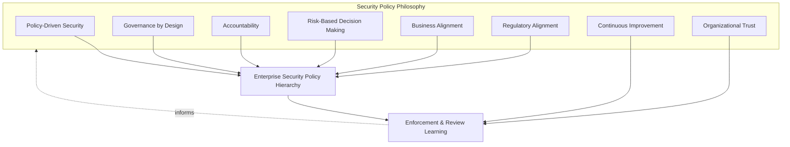
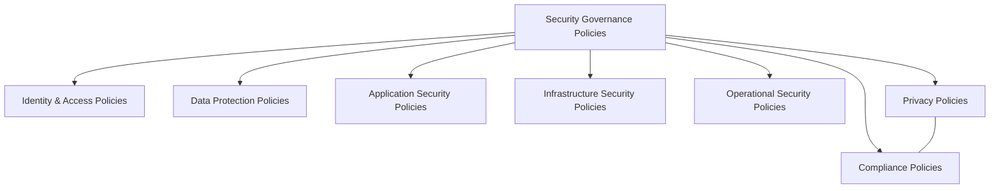
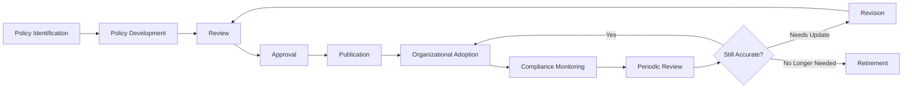
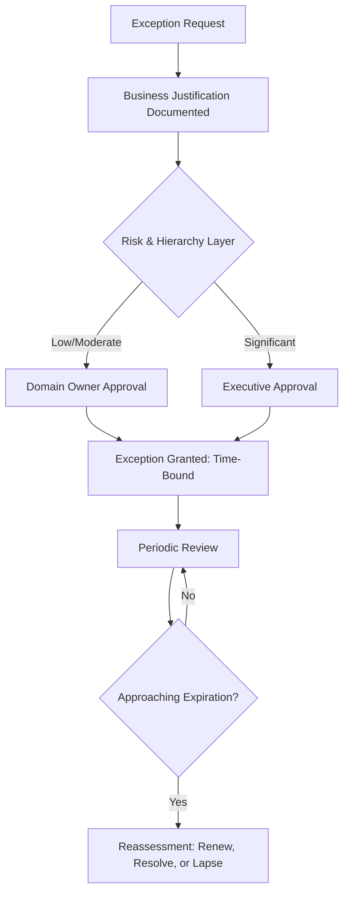
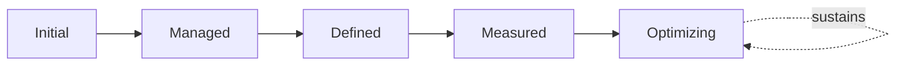
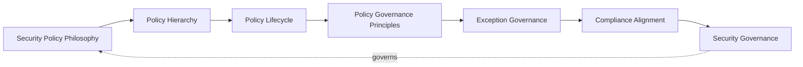

# Enterprise Information Security Policy Framework

## 1. Document Purpose

This document defines the official Enterprise Information Security Policy Framework for **StackLeo Tech Store**. It establishes the hierarchy, lifecycle, ownership, and exception governance that every security policy across `06_Security` is subject to — independent of any specific policy management software, governance tool, or vendor.

- **Purpose of Security Policies** — policies exist to translate security governance principles into specific, actionable, and consistently applied expectations, so that "what StackLeo requires" is never ambiguous, informally inherited, or dependent on individual interpretation.
- **Relationship with Security Governance** — this document is the policy-specific elaboration of `security-governance.md`; where that document establishes the governance model, domains, and decision-making structure for security as a whole, this document defines specifically how the policies operating within that structure are created, organized, reviewed, and retired.
- **Relationship with Enterprise Governance** — security policy governance is not a separate structure from how StackLeo governs the rest of the business; it is the security-specific application of the same accountability and documentation discipline applied to quality (`08_Quality_Assurance/qa-governance.md`) and operations (`09_Operations/operations-governance.md`). `policy-management.md` establishes the enterprise-wide policy governance model, lifecycle, and domains this document elaborates for information security policy specifically.
- **Relationship with Risk Management** — policy content and rigor are set in proportion to genuine risk, consistent with `threat-model.md` and ISO 31000 thinking; policies are not applied uniformly regardless of what they protect.
- **Relationship with Compliance** — this framework provides the structural discipline through which the regulatory and contractual obligations tracked in `compliance.md` are reliably reflected in actual, enforced policy, not merely referenced in prose.
- **Relationship with Operations** — policy adoption and monitoring depend on day-to-day operational execution, coordinated with `09_Operations/operations-governance.md` (Section 3.7, Compliance Governance) and `09_Operations/change-management.md` for policy-driven operational change.
- **Relationship with Business Strategy** — policies exist to let the business pursue its stated growth — corporate sales, wholesale, the multi-vendor marketplace — with confidence, consistent with `01_Business/business-model.md`, not to obstruct it with rigidity disconnected from genuine need.

- **Relationship with Security Controls** — this document governs the policies that require enforcement; the specific administrative, technical, and physical mechanisms that enforce them are governed in full in `security-controls-framework.md`. A policy without a corresponding control, or a control without a traceable policy, is treated as a governance gap in either document.
- **Relationship with Security Standards** — this document states general policy expectation; the specific, mandatory baseline every implementation must meet to satisfy that expectation consistently is defined in `security-standards.md`.

This document is implementation-independent and vendor-neutral. It defines policy philosophy, hierarchy, lifecycle, and exception governance conceptually — not specific security vendors, policy management software, governance tools, cloud providers, implementation procedures, technical controls, security technologies, cryptographic methods, or infrastructure configuration.

## 2. Security Policy Philosophy

Security policy governance at StackLeo is built on eight principles. Each exists to produce a specific business outcome — policies are governed deliberately because of the consistency and trust they protect, not as bureaucratic paperwork.

### 2.1 Policy-Driven Security

Security decisions are made against consistent, documented policy rather than case-by-case improvisation, consistent with Policy-Driven Decisions in `security-governance.md` (Section 5).

- **Business Value** — produces predictable, defensible outcomes as the organization scales beyond what any single person can personally oversee.

### 2.2 Governance by Design

Policy structures are established deliberately as security capability is built, not retrofitted once a gap has already caused harm.

- **Business Value** — prevents the costly, high-visibility discovery of policy gaps only after an incident has already demonstrated their absence.

### 2.3 Accountability

Every policy has a single, named accountable owner responsible for its accuracy, currency, and enforcement.

- **Business Value** — prevents the anti-pattern in Section 10.4, where a policy exists on paper but no one is specifically responsible for keeping it real.

### 2.4 Risk-Based Decision Making

Policy content and enforcement rigor are proportionate to the genuine risk a given domain represents, consistent with `security-governance.md` (Section 2.5) and ISO 31000 thinking.

- **Business Value** — directs finite policy governance effort toward the domains where a gap would cause the greatest harm.

### 2.5 Business Alignment

Policies are written to enable genuine business objectives, not to satisfy an abstract notion of "best practice" disconnected from StackLeo's actual context.

- **Business Value** — keeps policy content relevant and followed, rather than resented and quietly bypassed as an obstacle to real work.

### 2.6 Regulatory Alignment

Policies reflect applicable legal, regulatory, and contractual obligations, coordinated with `compliance.md`, without treating compliance as security's sole purpose.

- **Business Value** — protects StackLeo's license to operate while keeping the underlying security intent, not just the regulatory letter, genuinely served.

### 2.7 Continuous Improvement

Policy practice matures over time, informed by real enforcement experience, incidents, and organizational change.

- **Business Value** — keeps the policy framework relevant as StackLeo's business model, scale, and threat landscape evolve.

### 2.8 Organizational Trust

Policies are written and enforced in a way that builds genuine organizational trust in security governance, rather than being experienced as arbitrary or punitive.

- **Business Value** — sustains the Shared Responsibility model in `security-governance.md` (Section 2.6); policies followed willingly are far more effective than policies merely tolerated.

*Diagram: Security Policy Philosophy Overview — the eight principles shape the policy hierarchy, and enforcement and review learning feed back into the philosophy itself.*

## 3. Enterprise Security Policy Hierarchy

Security policy is organized across eight conceptual layers, from foundational governance policy down to compliance-specific policy.

### 3.1 Security Governance Policies

- **Purpose** — establish the overarching governance principles every other policy layer operates within.
- **Governance Scope** — elaborated fully in `security-governance.md`; this layer sits above every other policy layer in this hierarchy.
- **Business Value** — provides the single, coherent foundation every domain-specific policy traces back to.
- **Executive Expectations** — leadership treats this layer as the non-negotiable baseline every other policy must remain consistent with.

### 3.2 Identity & Access Policies

- **Purpose** — establish requirements for identity lifecycle, authentication, and authorization practice.
- **Governance Scope** — elaborated in `identity-management.md`, `authentication.md`, and `authorization.md`.
- **Business Value** — makes every downstream access decision trustworthy, since identity is foundational to all other security domains.
- **Executive Expectations** — leadership expects access to be scoped to genuine need at every layer, consistent with Least Privilege.

### 3.3 Data Protection Policies

- **Purpose** — establish requirements for data classification, handling, encryption, and secrets protection.
- **Governance Scope** — elaborated in `data-protection.md`, `encryption.md`, and `secrets-management.md`.
- **Business Value** — protects the asset both commerce and customer trust depend on most directly.
- **Executive Expectations** — leadership expects data handling requirements to be proportionate to genuine sensitivity, not applied uniformly regardless of classification.

### 3.4 Application Security Policies

- **Purpose** — establish requirements for secure design, construction, and review of application-level capability.
- **Governance Scope** — elaborated in `application-security.md`, `frontend-security.md`, `backend-security.md`, and `secure-coding-standards.md`.
- **Business Value** — protects the integrity of the core commerce experience that directly generates revenue and trust.
- **Executive Expectations** — leadership expects Secure SDLC policy to be genuinely followed, not merely documented.

### 3.5 Infrastructure Security Policies

- **Purpose** — establish requirements for protecting the environment the platform runs in.
- **Governance Scope** — elaborated in `infrastructure-security.md` and `network-security.md`.
- **Business Value** — ensures environment weaknesses cannot become business weaknesses, supporting cloud-portability posture.
- **Executive Expectations** — leadership expects infrastructure policy to remain consistent regardless of specific provider or deployment model.

### 3.6 Operational Security Policies

- **Purpose** — establish requirements for monitoring, vulnerability management, and incident response during live operation.
- **Governance Scope** — elaborated in `security-monitoring.md`, `vulnerability-management.md`, and `incident-response.md`.
- **Business Value** — determines how quickly trust can be restored after an adverse event.
- **Executive Expectations** — leadership expects operational security policy to be genuinely exercised, coordinated with `09_Operations/incident-management.md`.

### 3.7 Privacy Policies

- **Purpose** — establish requirements for ensuring data is used only as customers would reasonably expect.
- **Governance Scope** — elaborated in `privacy.md`.
- **Business Value** — protects customer trust and regulatory standing simultaneously.
- **Executive Expectations** — leadership expects privacy commitments to be structurally, not merely aspirationally, honored.

### 3.8 Compliance Policies

- **Purpose** — establish requirements for satisfying applicable regulatory, contractual, and policy obligations.
- **Governance Scope** — elaborated in `compliance.md`, coordinated with `01_Business/business-rules.md` (Section 17).
- **Business Value** — protects StackLeo's license to operate in Bangladesh and its future markets.
- **Executive Expectations** — leadership expects compliance obligations to be understood and tracked proactively, particularly ahead of market expansion.

### Security Policy Hierarchy Matrix

| Layer | Purpose | Governance Scope | Business Value |
|---|---|---|---|
| Security Governance Policies | Establish overarching governance principles | Elaborated in `security-governance.md` | Single, coherent foundation for every other layer |
| Identity & Access Policies | Establish identity, authentication, authorization requirements | `identity-management.md`, `authentication.md`, `authorization.md` | Makes every downstream access decision trustworthy |
| Data Protection Policies | Establish classification, handling, encryption requirements | `data-protection.md`, `encryption.md`, `secrets-management.md` | Protects the asset commerce and trust depend on most |
| Application Security Policies | Establish secure design and construction requirements | `application-security.md`, `frontend-security.md`, `backend-security.md`, `secure-coding-standards.md` | Protects the core revenue-generating commerce experience |
| Infrastructure Security Policies | Establish environment protection requirements | `infrastructure-security.md`, `network-security.md` | Ensures environment weaknesses can't become business weaknesses |
| Operational Security Policies | Establish monitoring, vulnerability, incident requirements | `security-monitoring.md`, `vulnerability-management.md`, `incident-response.md` | Determines speed of trust restoration after an event |
| Privacy Policies | Establish data-use-expectation requirements | `privacy.md` | Protects customer trust and regulatory standing |
| Compliance Policies | Establish regulatory/contractual obligation requirements | `compliance.md` | Protects license to operate in current and future markets |

*Diagram 1: Enterprise Security Policy Hierarchy — Security Governance Policies sit above every domain-specific policy layer, with Privacy and Compliance Policies closely related given their shared regulatory dimension.*

## 4. Security Policy Lifecycle

Security policy governance spans ten conceptual stages, from initial identification through retirement.

### 4.1 Policy Identification

- **Purpose** — recognize that a new policy, or a change to an existing one, is genuinely needed.
- **Governance Objectives** — require identification to trace to a genuine driver — new risk, regulatory change, incident learning, business expansion.
- **Business Value** — ensures policy creation is deliberate, not an accumulation of ad hoc documentation.

### 4.2 Policy Development

- **Purpose** — draft the policy's content, consistent with the hierarchy layer it belongs to (Section 3).
- **Governance Objectives** — require drafting to reference the governance principles in Section 2 and the relevant domain strategy document.
- **Business Value** — produces a policy grounded in genuine governance intent, not written in isolation from established practice.

### 4.3 Review

- **Purpose** — confirm the drafted policy is accurate, consistent with existing policy, and genuinely enforceable.
- **Governance Objectives** — require review by someone other than the policy's author, consistent with independent validation practice used throughout this repository.
- **Business Value** — prevents an unreviewed, potentially inconsistent policy from being adopted.

### 4.4 Approval

- **Purpose** — render a deliberate, accountable decision to formally adopt the reviewed policy.
- **Governance Objectives** — require approval authority proportionate to the policy's hierarchy layer and risk significance (Section 3).
- **Business Value** — converts policy adoption into a governed decision point, not a default outcome of drafting.

### 4.5 Publication

- **Purpose** — make the approved policy available to those who must follow it.
- **Governance Objectives** — require published policy to be accessible to all relevant roles.
- **Business Value** — ensures a governed policy actually reaches its intended audience, rather than existing but unused.

### 4.6 Organizational Adoption

- **Purpose** — establish the policy as the genuine, lived expectation across affected teams.
- **Governance Objectives** — require affected teams to be explicitly informed, not left to discover the policy incidentally.
- **Business Value** — converts a published document into genuine organizational practice.

### 4.7 Compliance Monitoring

- **Purpose** — observe whether actual practice genuinely adheres to the adopted policy.
- **Governance Objectives** — require monitoring to be connected to `vulnerability-management.md` and `security-testing.md` where applicable.
- **Business Value** — catches policy-practice drift before it becomes a genuine security or compliance gap.

### 4.8 Periodic Review

- **Purpose** — formally reassess whether the policy remains accurate and adequate on a recurring basis.
- **Governance Objectives** — require review to occur on a predictable, regular cadence, not only when a gap is already discovered.
- **Business Value** — prevents policies from silently drifting out of date as the business and threat landscape evolve.

### 4.9 Revision

- **Purpose** — update the policy based on periodic review or compliance monitoring findings.
- **Governance Objectives** — require material revisions to proceed through Review and Approval (Sections 4.3–4.4) again, not be applied informally.
- **Business Value** — keeps the policy framework a living, accurate asset rather than a static historical record.

### 4.10 Retirement

- **Purpose** — formally withdraw a policy once it no longer serves a genuine governance need.
- **Governance Objectives** — require retirement to be an explicit, recorded decision, never a policy simply left forgotten.
- **Business Value** — prevents the accumulation of stale, contradictory guidance that undermines confidence in the policy framework overall.

### Security Policy Lifecycle Matrix

| Stage | Purpose | Governance Objective | Business Value |
|---|---|---|---|
| Policy Identification | Recognize a genuine need for a new or changed policy | Traces to a genuine driver, not ad hoc accumulation | Ensures policy creation is deliberate |
| Policy Development | Draft content consistent with its hierarchy layer | References governance principles and domain strategy | Grounds the policy in genuine governance intent |
| Review | Confirm accuracy, consistency, enforceability | Reviewed by someone other than the author | Prevents an unreviewed, inconsistent policy from being adopted |
| Approval | Render a deliberate, accountable adoption decision | Authority proportionate to hierarchy layer and risk | Converts adoption into a governed decision point |
| Publication | Make the approved policy available to its audience | Accessible to all relevant roles | Ensures the policy reaches its intended audience |
| Organizational Adoption | Establish the policy as a genuine, lived expectation | Affected teams explicitly informed | Converts a document into genuine practice |
| Compliance Monitoring | Observe whether practice adheres to policy | Connected to vulnerability management and testing | Catches policy-practice drift before it becomes a gap |
| Periodic Review | Reassess accuracy and adequacy recurringly | Predictable, regular cadence | Prevents silent drift out of date |
| Revision | Update the policy based on review findings | Material revisions repeat review and approval | Keeps the framework a living, accurate asset |
| Retirement | Formally withdraw a no-longer-needed policy | An explicit, recorded decision, never forgotten | Prevents accumulation of stale, contradictory guidance |

*Diagram 2: Security Policy Lifecycle — a policy proceeds from identification through adoption and monitoring, with periodic review determining whether it continues in force, requires revision, or is retired.*

## 5. Security Policy Governance Principles

- **Executive Ownership** — significant policy decisions, particularly at the Security Governance Policies layer (Section 3.1), are made or ratified at the executive level.
- **Clear Accountability** — every policy has a single, named accountable owner, consistent with Accountability (Section 2.3).
- **Consistency** — policies across every hierarchy layer are structured and enforced consistently, regardless of which team owns them.
- **Transparency** — policy content and rationale are visible to the stakeholders who must follow them, not held privately within the authoring team.
- **Traceability** — every policy traces to the governance principle, risk, or obligation that justifies it.
- **Auditability** — policy approval, adoption, and review history can be independently reviewed after the fact, supporting ISO/IEC 27001-aligned assurance.
- **Regulatory Awareness** — policies are reviewed with explicit awareness of applicable regulatory and contractual obligations, coordinated with `compliance.md`.
- **Continuous Improvement** — policy governance itself matures over time, informed by real enforcement and review experience.

### Security Policy Governance Principles Matrix

| Principle | Description | Business Value |
|---|---|---|
| Executive Ownership | Significant decisions made or ratified at the executive level | Reflects genuine business consequence of governance-layer policy |
| Clear Accountability | Every policy has a single, named accountable owner | Prevents a policy existing without anyone responsible for it |
| Consistency | Policies structured and enforced consistently across layers | Makes the framework genuinely usable as a coherent whole |
| Transparency | Content and rationale visible to those who must follow them | Builds trust and understanding rather than resentment |
| Traceability | Every policy traces to a justifying principle, risk, or obligation | Prevents policies from feeling arbitrary or disconnected |
| Auditability | Approval, adoption, and review history reviewable | Supports ISO/IEC 27001-aligned assurance and audit confidence |
| Regulatory Awareness | Reviewed with explicit awareness of applicable obligations | Protects license to operate as obligations evolve |
| Continuous Improvement | Governance matures from real enforcement and review experience | Keeps the framework aligned with organizational growth |

## 6. Policy Exception Governance

- **Exception Requests** — a team or individual may request a deliberate, documented deviation from standard policy where genuine business or technical circumstance warrants it.
- **Business Justification** — every exception request states the genuine business or technical rationale for the deviation, not merely convenience.
- **Risk Acceptance** — an exception is only granted alongside an explicit, accountable decision to accept the residual risk it introduces, consistent with `security-governance.md` (Section 6, Decision-Making Framework).
- **Executive Approval** — exception approval authority is proportionate to the risk and hierarchy layer (Section 3) the deviation affects, escalating to executive level for significant exceptions.
- **Review Frequency** — every granted exception is reviewed on a recurring basis to confirm the justifying circumstance still holds.
- **Documentation** — exceptions are recorded consistently, including their justification, approver, and scope, never granted informally.
- **Expiration** — every exception is granted for a bounded, time-limited period, never indefinitely by default.
- **Reassessment** — an exception approaching expiration is deliberately reassessed — renewed, resolved, or allowed to lapse — never simply forgotten.

### Policy Exception Governance Matrix

| Element | Purpose | Governance Role |
|---|---|---|
| Exception Requests | Allow deliberate, documented deviation where warranted | Prevents informal, undocumented policy bypass |
| Business Justification | State the genuine rationale for the deviation | Ensures exceptions reflect real need, not convenience |
| Risk Acceptance | Explicitly accept the residual risk the exception introduces | Ensures accepted risk is always a deliberate decision |
| Executive Approval | Approve proportionate to risk and hierarchy layer | Ensures significant deviations receive commensurate scrutiny |
| Review Frequency | Reconfirm the justifying circumstance still holds | Prevents an exception outliving its original rationale |
| Documentation | Record justification, approver, and scope consistently | Supports auditability and prevents informal exceptions |
| Expiration | Bound every exception to a time-limited period | Prevents exceptions becoming permanent by default |
| Reassessment | Deliberately resolve an exception approaching expiration | Prevents exceptions from being simply forgotten |

*Diagram 4: Policy Review & Approval Framework — an exception request is justified, approved proportionate to its risk, granted with a bound expiration, and deliberately reassessed rather than left to expire unnoticed.*

## 7. Compliance Alignment

- **ISO/IEC 27001** — this framework's policy hierarchy, lifecycle, and exception governance are structured to support an Information Security Management System consistent with ISO/IEC 27001 principles, without prescribing a specific certification path.
- **NIST Cybersecurity Framework** — policy content across the hierarchy (Section 3) maps conceptually to the Identify, Protect, Detect, Respond, and Recover functions, without prescribing specific NIST implementation tiers here.
- **ISO 31000** — Risk-Based Decision Making (Section 2.4) and Policy Exception Governance (Section 6) apply ISO 31000 risk management principles directly to policy-level decisions.
- **Privacy Regulations** — Privacy Policies (Section 3.7) are structured to absorb applicable regional privacy regulation as StackLeo expands, coordinated with `privacy.md` and `compliance.md`.
- **Internal Governance** — this framework's own principles (Section 2) are the baseline standard StackLeo holds itself to, independent of any external requirement.
- **Enterprise Risk Management** — policy-level risk decisions are consolidated into the broader risk visibility maintained by `security-governance.md` (Section 3.2, Security Risk Governance).

### Compliance Alignment Matrix

| Framework / Regime | Alignment | Governance Role |
|---|---|---|
| ISO/IEC 27001 | Policy hierarchy and lifecycle support ISMS-consistent practice | Structural alignment, no prescribed certification path |
| NIST Cybersecurity Framework | Policy content maps conceptually to Identify/Protect/Detect/Respond/Recover | No prescribed implementation tier |
| ISO 31000 | Risk-based decision making applied to policy and exceptions | Direct application to Section 2.4 and Section 6 |
| Privacy Regulations | Privacy Policies structured to absorb regional regulation | Coordinated with `privacy.md` and `compliance.md` |
| Internal Governance | This framework's own principles are the baseline standard | Independent of external requirement |
| Enterprise Risk Management | Policy-level risk consolidated into broader risk visibility | Feeds `security-governance.md` Security Risk Governance |

## 8. Future Readiness

This framework is designed to remain valid as StackLeo evolves in scale and organizational complexity, without requiring redefinition of its underlying philosophy.

- **AI Systems** — as AI-assisted capability is introduced, it is governed under Application Security Policies (Section 3.4) and Data Protection Policies (Section 3.3) using the same hierarchy, without prescribing AI-specific technical controls.
- **Cloud-Native Platforms** — Infrastructure Security Policies (Section 3.5) apply consistently regardless of the specific infrastructure technologies adopted.
- **Marketplace Platforms** — the multi-vendor marketplace model extends Identity & Access and Data Protection Policies (Sections 3.2–3.3) to cover seller-facing identity and data handling, applying the same hierarchy used for StackLeo's own operations today.
- **Multi-Tenant Systems** — where future architecture introduces tenant isolation, Identity & Access and Infrastructure Security Policies (Sections 3.2, 3.5) extend to explicitly address cross-tenant policy requirements.
- **Global Expansion** — Compliance and Privacy Policies (Sections 3.8, 3.7) remain jurisdiction-agnostic in structure, allowing region-specific obligations to layer on via `compliance.md` without redesigning the underlying hierarchy.
- **Evolving Regulations** — Regulatory Alignment (Section 2.6) and Periodic Review (Section 4.8) are structured to absorb genuinely new regulatory obligations as they emerge.
- **Enterprise Scale** — the policy hierarchy, lifecycle, and exception governance defined in Sections 3–6 are defined independently of organizational size or structure, so they remain coherent as the business and its policy volume grow substantially.

## 9. Security Policy Maturity Model

Security policy maturity is described across five conceptual levels, adapted from established process maturity thinking and consistent with ISO/IEC 27001-aligned assurance expectations.

- **Initial** — policies, where they exist, are informal and inconsistent; ownership is unclear, and enforcement depends heavily on individual initiative.
- **Managed** — basic policies exist for individual hierarchy layers, but consistency and lifecycle discipline vary significantly across the framework.
- **Defined** — the policy hierarchy, lifecycle, and exception governance are standardized, documented, and consistently applied across the organization, consistent with the model defined throughout this document; ownership is clear organization-wide.
- **Measured** — policy adherence and exception trends are measured systematically, and revision decisions are grounded in genuine compliance monitoring evidence rather than qualitative impression alone.
- **Optimizing** — policy governance is continuously and deliberately improved based on quantitative evidence and organizational learning; improvement itself is a managed, ongoing discipline rather than an occasional initiative.

### Policy Maturity Model Matrix

| Level | Characteristics | Primary Focus |
|---|---|---|
| Initial | Informal, inconsistent policies; unclear ownership | Ad hoc, individually-dependent enforcement |
| Managed | Basic policies exist per layer; consistency varies | Layer-level consistency |
| Defined | Standardized hierarchy, lifecycle, and exception governance | Organization-wide consistency and clear ownership |
| Measured | Adherence and exception trends measured systematically | Evidence-based policy decisions |
| Optimizing | Practice continuously and deliberately improved from evidence | Sustained, deliberate improvement as a discipline |

*Diagram 6: Security Policy Maturity Progression Model — maturity advances from informal, individually-dependent enforcement toward standardized, measured, and continuously optimized policy governance.*

*Diagram 3: Security Governance & Policy Relationship Model — this policy framework operates entirely within, and reports back into, the broader Security Governance structure defined in `security-governance.md`.*

### Governance Responsibility Matrix

| Role | Responsibility |
|---|---|
| CISO | Owns coherence and enforcement of this policy framework, in partnership with Security and Executive leadership. |
| Security Leadership | Owns Security Governance Policies (Section 3.1) and coordinates the full hierarchy. |
| Domain Policy Owners | Own individual hierarchy layers (Sections 3.2–3.8) and their lifecycle stages. |
| Engineering Leads | Apply Application and Infrastructure Security Policies within their domain. |
| Compliance & Risk Functions | Own Compliance Policies (Section 3.8) and Compliance Alignment (Section 7). |
| Operations Teams | Execute Compliance Monitoring (Section 4.7) as part of day-to-day operational practice. |
| Executive Leadership | Approves significant exceptions and Security Governance Policy decisions. |
| Internal Audit / Review Function | Independently verifies that policy records reflect actual enforced practice. |

## 10. Anti-Patterns

The following recurring failure patterns are explicitly recognized and avoided, as each one structurally undermines this framework.

| Anti-Pattern | Why It's Avoided |
|---|---|
| Policies Nobody Reads | Contradicts Organizational Adoption (Section 4.6) and Transparency (Section 5); a policy that exists but is never genuinely read or understood provides no real protection. |
| Policy Without Governance | Contradicts Governance by Design (Section 2.2); a policy created outside this framework's lifecycle lacks accountable ownership and review discipline from the outset. |
| Outdated Policies | Contradicts Periodic Review (Section 4.8); a policy that no longer reflects genuine practice or risk actively misleads rather than protects. |
| Weak Ownership | Contradicts Clear Accountability (Section 5); a policy without a named owner has no one specifically responsible for keeping it accurate. |
| Compliance-Only Mindset | Contradicts Regulatory Alignment (Section 2.6); treating policy as satisfying a regulatory checklist alone, rather than genuine risk management, leaves real security gaps unaddressed. |
| Inconsistent Policies | Contradicts Consistency (Section 5); policies that vary arbitrarily across teams or hierarchy layers erode confidence in the framework overall. |
| Missing Reviews | Contradicts Periodic Review (Section 4.8) and Continuous Assessment principles used throughout `security-governance.md`; without regular review, policy and practice drift apart unnoticed. |
| Missing Continuous Improvement | Contradicts Continuous Improvement (Section 2.7); without deliberate improvement, the policy framework stagnates as the business, threat landscape, and regulatory context evolve. |

## 11. Document Information

| Property | Value |
|----------|-------|
| Document | security-policies.md |
| Version | 1.0.0 |
| Status | Active |
| Maintained By | StackLeo |
| Last Updated | 2026-07-24 |

---

© StackLeo. All Rights Reserved.
