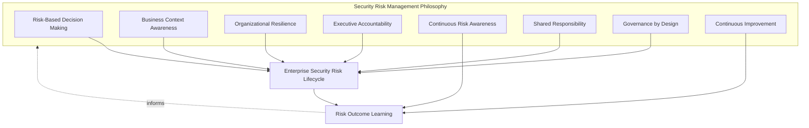
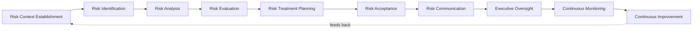
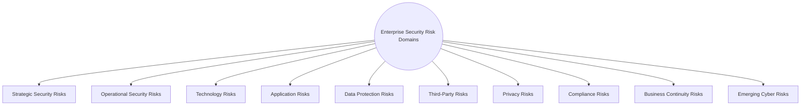
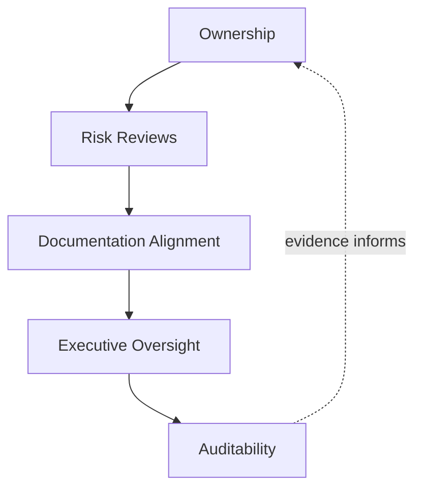
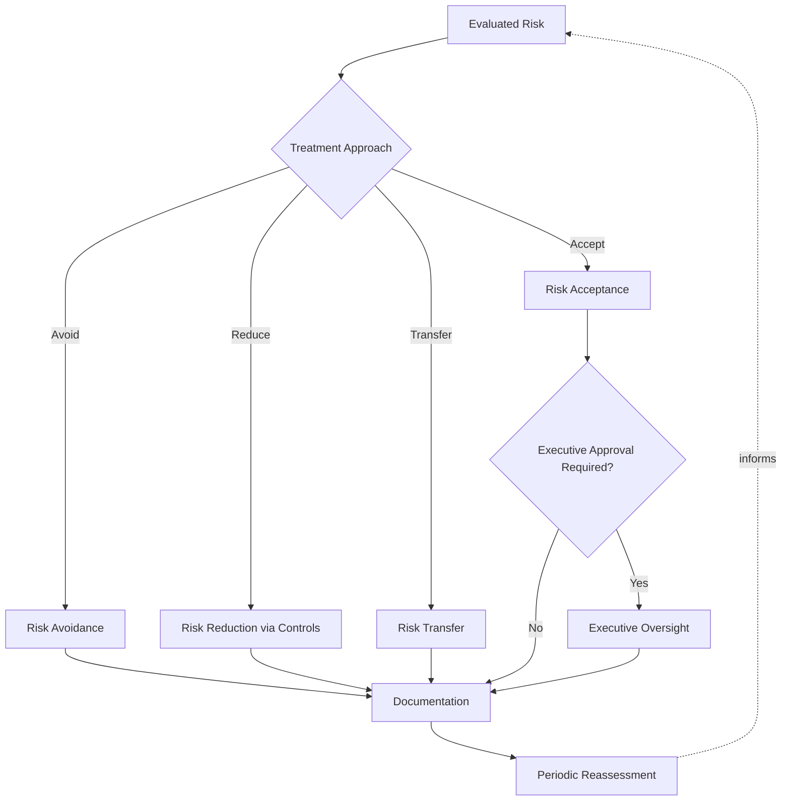
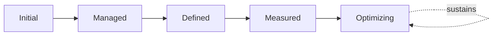
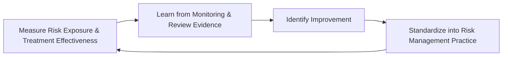

# Enterprise Security Risk Management Strategy

## 1. Document Purpose

This document defines the official Enterprise Security Risk Management Strategy for **StackLeo Tech Store**. It establishes the formal risk management lifecycle — how cyber risk is identified, analyzed, evaluated, treated, and continuously monitored — independent of any specific security product, governance software, GRC platform, or vendor.

This document is the ISO 31000 / ISO 27005-aligned elaboration of Security Risk Governance as introduced in `security-governance.md` (Section 3.2). Where `threat-model.md` identifies and classifies the specific threats the platform faces, this document defines the formal, repeatable process by which any identified risk — whether surfaced by threat modeling, an incident, an audit finding, or business change — is analyzed, evaluated, treated, and governed to an accountable decision.

- **Purpose of Security Risk Management** — to ensure cyber risk is understood, weighed, and decided upon deliberately by accountable people, rather than left as an implicit, unexamined assumption embedded in day-to-day technical and business decisions.
- **Relationship with Security Governance** — this document operationalizes Security Risk Governance in `security-governance.md` (Section 3.2) into a complete, formal risk lifecycle, consistent with the broader governance model that document establishes.
- **Relationship with Enterprise Risk Management** — security risk is not managed as an isolated technical concern; it is consolidated into StackLeo's broader enterprise risk visibility, ensuring cyber risk is weighed alongside every other category of business risk the organization carries. `risk-management.md` establishes the enterprise-wide governance model, appetite, and domains this document elaborates for security and cyber risk specifically.
- **Relationship with Business Strategy** — risk treatment decisions are made in direct service of `01_Business/business-model.md` and `01_Business/vision.md`, ensuring the business can pursue growth — corporate sales, wholesale, the multi-vendor marketplace — with risk knowingly and deliberately managed, not blindly accepted or reflexively avoided.
- **Relationship with Compliance** — this framework's risk evaluation and treatment discipline provides the structural evidence `compliance.md` depends on to demonstrate that regulatory and contractual risk obligations are genuinely managed, not merely asserted.
- **Relationship with Security Controls** — Risk Treatment Planning (Section 3.5) is the mechanism by which a decision to reduce risk becomes a specific control requirement, governed in full by `security-controls-framework.md`.
- **Relationship with Operational Resilience** — Business Continuity Risks and Emerging Cyber Risks (Sections 4.9–4.10) connect directly to `09_Operations/business-continuity.md` and `09_Operations/disaster-recovery.md`, ensuring risk management and operational resilience remain a single, coherent discipline rather than two disconnected ones.

This document is implementation-independent and vendor-neutral. It defines risk management philosophy, lifecycle, domains, and governance conceptually — not specific security products, governance software, GRC platforms, cloud providers, risk scoring formulas, probability calculations, implementation methodologies, quantitative models, technical mitigation procedures, or infrastructure configuration.

## 2. Security Risk Management Philosophy

Security risk management at StackLeo is governed by eight principles. Each exists to produce a specific business outcome — risk is managed deliberately because of the consequences it protects the business from, not as a compliance formality.

### 2.1 Risk-Based Decision Making

Security decisions weigh business impact and likelihood, consistent with `security-principles.md` (Section 5) and ISO 31000 thinking, rather than applying uniform rigor regardless of consequence.

- **Business Value** — directs finite security investment toward the risks that matter most, rather than spreading effort evenly regardless of consequence.

### 2.2 Business Context Awareness

Risk is evaluated in the context of genuine business impact — revenue, customer trust, regulatory standing — not as an abstract technical severity score disconnected from real consequence.

- **Business Value** — ensures risk decisions reflect what the business actually stands to lose, not merely what appears technically alarming.

### 2.3 Organizational Resilience

Risk management assumes some risks will eventually materialize and focuses on the organization's capacity to absorb and recover from them, not solely on preventing every risk outright.

- **Business Value** — accepts that perfect prevention is unrealistic and invests instead in the capability to withstand and recover from an eventual failure.

### 2.4 Executive Accountability

Significant risk decisions — acceptance, treatment investment, residual exposure — are made or ratified at the executive level, proportionate to their business consequence.

- **Business Value** — ensures the organization's most consequential risk decisions carry commensurate scrutiny and ownership.

### 2.5 Continuous Risk Awareness

Risk understanding is sustained on an ongoing basis, consistent with Continuous Assessment in `security-governance.md` (Section 5), not confirmed once and assumed to remain valid indefinitely.

- **Business Value** — keeps risk decisions current as the threat landscape, business model, and platform continue to evolve.

### 2.6 Shared Responsibility

Risk management spans Executive Leadership, Security, Engineering, Operations, and Product, consistent with the shared responsibility model in `security-governance.md` (Section 2.6), not the sole burden of the Security function alone.

- **Business Value** — ensures risk is genuinely understood and owned by the people closest to it, not only by a centralized risk function distant from daily decisions.

### 2.7 Governance by Design

Risk management structures are established deliberately as capability is built, not retrofitted once a risk has already materialized into an incident.

- **Business Value** — prevents the costly, high-visibility discovery of risk governance gaps only after a genuine failure has already demonstrated their absence.

### 2.8 Continuous Improvement

Risk management practice itself matures over time, informed by real risk outcomes, incidents, and the evolving threat landscape.

- **Business Value** — keeps risk management capability aligned with StackLeo's growth in scale, architectural complexity, and business model.

*Diagram: Security Risk Management Philosophy Overview — the eight principles shape the enterprise risk lifecycle, and risk outcome learning feeds back into the philosophy itself.*

## 3. Enterprise Security Risk Lifecycle

Security risk management is governed across ten conceptual stages, consistent with ISO 31000 and ISO/IEC 27005's risk management process, spanning from initial context establishment through continuous improvement.

### 3.1 Risk Context Establishment

- **Purpose** — establish the business, regulatory, and organizational context within which risk will be identified and evaluated.
- **Governance Objectives** — require context to be grounded in `01_Business/business-model.md` and applicable obligations tracked in `compliance.md`.
- **Business Value** — ensures subsequent risk analysis reflects StackLeo's actual business reality, not a generic, context-free assumption.

### 3.2 Risk Identification

- **Purpose** — identify specific risks the platform and business genuinely face, drawing on `threat-model.md` and real operational and incident evidence.
- **Governance Objectives** — require identification to draw on multiple sources — threat modeling, incidents, audits, business change — not a single narrow input.
- **Business Value** — surfaces risk before it materializes into an incident, when it is far cheaper to address.

### 3.3 Risk Analysis

- **Purpose** — understand the nature, source, and potential consequence of each identified risk.
- **Governance Objectives** — require analysis to be documented with sufficient detail to support a defensible evaluation decision.
- **Business Value** — converts a raw, identified risk into genuine understanding sufficient to make an informed decision.

### 3.4 Risk Evaluation

- **Purpose** — determine the significance of each analyzed risk and whether it warrants further treatment.
- **Governance Objectives** — require evaluation to weigh business impact and likelihood together, consistent with Risk-Based Decision Making (Section 2.1).
- **Business Value** — distinguishes risks requiring deliberate action from those genuinely tolerable as-is.

### 3.5 Risk Treatment Planning

- **Purpose** — determine the specific approach — avoidance, reduction, transfer, or acceptance (Section 6) — for addressing each evaluated risk.
- **Governance Objectives** — require treatment plans to be proportionate to the risk's evaluated significance, connecting to `security-controls-framework.md` where treatment involves a new or strengthened control.
- **Business Value** — converts risk understanding into concrete, actionable decisions rather than leaving risk acknowledged but unaddressed.

### 3.6 Risk Acceptance

- **Purpose** — formally, deliberately accept residual risk that treatment does not or cannot fully eliminate.
- **Governance Objectives** — require acceptance to be an explicit, documented decision by an accountable role proportionate to the risk's significance, per Executive Accountability (Section 2.4).
- **Business Value** — ensures the organization consciously understands, rather than unconsciously inherits, the risk it ultimately carries.

### 3.7 Risk Communication

- **Purpose** — ensure relevant stakeholders understand the risk, its treatment, and any accepted residual exposure.
- **Governance Objectives** — require communication proportionate to the risk's significance, reaching Executive Leadership for significant risk.
- **Business Value** — prevents decision-makers from being surprised by a risk that was known but never communicated to them.

### 3.8 Executive Oversight

- **Purpose** — ensure Executive Leadership reviews and, where warranted, ratifies significant risk decisions.
- **Governance Objectives** — connect to Executive Reviews in `security-governance.md` (Section 6), ensuring risk oversight is not a parallel, disconnected process.
- **Business Value** — ensures the organization's most consequential risk decisions receive commensurate leadership attention.

### 3.9 Continuous Monitoring

- **Purpose** — observe whether treated and accepted risks evolve, and whether new risks emerge, on an ongoing basis.
- **Governance Objectives** — connect to `security-monitoring.md` and `09_Operations/monitoring-observability.md` for evidentiary grounding.
- **Business Value** — keeps risk understanding current rather than fixed at a single historical evaluation.

### 3.10 Continuous Improvement

- **Purpose** — act on monitoring findings and real risk outcomes to deliberately improve risk management practice itself.
- **Governance Objectives** — require improvement actions to be documented and tracked to completion.
- **Business Value** — ensures risk management effectiveness compounds over time rather than remaining static as the business and threat landscape evolve.

### Enterprise Security Risk Lifecycle Matrix

| Stage | Purpose | Governance Objective | Business Value |
|---|---|---|---|
| Risk Context Establishment | Establish business, regulatory, organizational context | Grounded in business model and compliance obligations | Ensures analysis reflects actual business reality |
| Risk Identification | Identify specific risks the platform/business face | Draws on multiple sources, not a single narrow input | Surfaces risk before it materializes into an incident |
| Risk Analysis | Understand nature, source, potential consequence | Documented with sufficient detail for a defensible decision | Converts raw risk into genuine, actionable understanding |
| Risk Evaluation | Determine significance and treatment need | Weighs business impact and likelihood together | Distinguishes risks needing action from tolerable ones |
| Risk Treatment Planning | Determine avoidance, reduction, transfer, or acceptance approach | Proportionate to evaluated significance | Converts understanding into concrete, actionable decisions |
| Risk Acceptance | Formally accept residual, untreated risk | Explicit decision by an accountable role | Ensures conscious, not unconscious, risk exposure |
| Risk Communication | Ensure stakeholders understand risk and treatment | Proportionate to significance, reaching leadership | Prevents decision-makers being surprised by known risk |
| Executive Oversight | Review and ratify significant risk decisions | Connected to broader executive review practice | Ensures consequential decisions receive leadership attention |
| Continuous Monitoring | Observe risk evolution and emergence over time | Connected to observability and monitoring practice | Keeps risk understanding current, not fixed historically |
| Continuous Improvement | Improve risk management practice itself | Improvement actions documented and tracked | Effectiveness compounds over time |

*Diagram 1: Enterprise Security Risk Lifecycle — a continuous cycle in which monitoring and improvement directly inform the next iteration of context establishment and identification.*

## 4. Enterprise Security Risk Domains

Security risk is organized across ten conceptual domains, each corresponding to a distinct source of genuine business exposure.

### 4.1 Strategic Security Risks

- **Purpose** — capture risk arising from significant business direction — new markets, new business models — that carries security implications.
- **Governance Scope** — reviewed jointly with Executive Leadership and Product, coordinated with `01_Business/business-model.md`.
- **Business Importance** — connects security risk directly to the decisions most consequential to the business's future.
- **Executive Expectations** — leadership expects strategic risk to be evaluated before, not after, a significant business commitment is made.

### 4.2 Operational Security Risks

- **Purpose** — capture risk arising from day-to-day operational practice.
- **Governance Scope** — coordinated with `09_Operations/operations-governance.md` (Section 3.4, Risk Governance).
- **Business Importance** — protects against the accumulated, everyday risk that operational practice can introduce if left unexamined.
- **Executive Expectations** — leadership expects operational risk to be visible through routine reporting, not only after an incident.

### 4.3 Technology Risks

- **Purpose** — capture risk arising from the platform's underlying technical architecture and infrastructure.
- **Governance Scope** — coordinated with `security-architecture.md` and `03_System_Design/architecture-principles.md`.
- **Business Importance** — protects the structural foundation every other domain in this section ultimately depends on.
- **Executive Expectations** — leadership expects technology risk to be evaluated as architecture evolves, not only at initial design.

### 4.4 Application Risks

- **Purpose** — capture risk arising from application-level logic and behavior.
- **Governance Scope** — coordinated with `application-security.md` and `security-standards.md` (Section 3.3, Application Security Standards).
- **Business Importance** — protects the integrity of the core commerce experience that directly generates revenue.
- **Executive Expectations** — leadership expects application risk to be assessed throughout the delivery lifecycle, not only at release.

### 4.5 Data Protection Risks

- **Purpose** — capture risk to the confidentiality, integrity, and availability of data.
- **Governance Scope** — coordinated with `data-protection.md`, `encryption.md`, and `secrets-management.md`.
- **Business Importance** — protects the asset both commerce and customer trust depend on most directly.
- **Executive Expectations** — leadership expects data risk to be evaluated proportionate to genuine classification, not uniformly.

### 4.6 Third-Party Risks

- **Purpose** — capture risk arising from external dependencies — payment providers, couriers, future marketplace and B2B partners.
- **Governance Scope** — coordinated with trust boundaries in `security-architecture.md` (Section 4) and Vendor & Partner Continuity in `09_Operations/business-continuity.md` (Section 4.6).
- **Business Importance** — protects the business from disruption or compromise it does not directly cause but remains responsible for managing.
- **Executive Expectations** — leadership expects third-party risk to be evaluated before onboarding a new dependency, not only after a problem occurs.

### 4.7 Privacy Risks

- **Purpose** — capture risk that data is used in a way customers would not reasonably expect.
- **Governance Scope** — coordinated with `privacy.md`.
- **Business Importance** — protects customer trust and regulatory standing simultaneously.
- **Executive Expectations** — leadership expects privacy risk to be evaluated whenever new data collection or processing is introduced.

### 4.8 Compliance Risks

- **Purpose** — capture risk of failing to meet applicable regulatory, contractual, or policy obligations.
- **Governance Scope** — coordinated with `compliance.md` and `01_Business/business-rules.md` (Section 17).
- **Business Importance** — protects StackLeo's license to operate in Bangladesh and its future markets.
- **Executive Expectations** — leadership expects compliance risk to be evaluated proactively ahead of market expansion, not discovered reactively.

### 4.9 Business Continuity Risks

- **Purpose** — capture risk to the organization's ability to continue operating through disruption.
- **Governance Scope** — coordinated with `09_Operations/business-continuity.md` and `09_Operations/disaster-recovery.md`.
- **Business Importance** — protects the business precisely when disruption is most consequential.
- **Executive Expectations** — leadership expects continuity risk to be validated through genuine exercises, not assumed from documentation alone.

### 4.10 Emerging Cyber Risks

- **Purpose** — capture risk from genuinely new categories of threat not yet reflected in existing risk domains.
- **Governance Scope** — coordinated with Threat Management in `security-governance.md` (Section 4.11) and `threat-model.md`.
- **Business Importance** — ensures the organization's risk visibility keeps pace with an evolving threat landscape, rather than only historical patterns.
- **Executive Expectations** — leadership expects emerging risk to be surfaced proactively, consistent with Continuous Risk Awareness (Section 2.5).

### Security Risk Domain Matrix

| Domain | Purpose | Business Importance | Executive Expectations |
|---|---|---|---|
| Strategic Security Risks | Capture risk from significant business direction | Connects security risk to the business's most consequential decisions | Evaluated before, not after, significant commitment |
| Operational Security Risks | Capture risk from day-to-day operational practice | Protects against accumulated, everyday operational risk | Visible through routine reporting, not only post-incident |
| Technology Risks | Capture risk from underlying architecture and infrastructure | Protects the structural foundation other domains depend on | Evaluated as architecture evolves, not only at initial design |
| Application Risks | Capture risk from application-level logic and behavior | Protects the core revenue-generating commerce experience | Assessed throughout delivery, not only at release |
| Data Protection Risks | Capture risk to confidentiality, integrity, availability | Protects the asset commerce and trust depend on most | Evaluated proportionate to genuine classification |
| Third-Party Risks | Capture risk from external dependencies | Protects against disruption StackLeo doesn't directly cause | Evaluated before onboarding, not only after a problem |
| Privacy Risks | Capture risk of unexpected data use | Protects customer trust and regulatory standing | Evaluated whenever new collection/processing is introduced |
| Compliance Risks | Capture risk of failing regulatory/contractual obligations | Protects license to operate in current/future markets | Evaluated proactively ahead of expansion |
| Business Continuity Risks | Capture risk to ability to continue operating | Protects the business when disruption is most consequential | Validated through genuine exercises, not assumed |
| Emerging Cyber Risks | Capture risk from genuinely new threat categories | Keeps risk visibility pace with an evolving landscape | Surfaced proactively, not only reactively |

*Diagram: Enterprise Cyber Risk Decision Model (domain view) — ten domains, each requiring evaluation and treatment proportionate to its genuine business consequence.*

## 5. Security Risk Governance Principles

- **Executive Ownership** — significant risk decisions are made or ratified at the executive level, consistent with Executive Accountability (Section 2.4).
- **Risk Accountability** — every identified risk has a single, named accountable owner responsible for its evaluation and treatment.
- **Business Alignment** — risk decisions are evaluated by genuine business consequence, consistent with Business Context Awareness (Section 2.2).
- **Transparency** — risk status and treatment decisions are visible to stakeholders who depend on them, not held privately.
- **Traceability** — every risk traces to its identification source and analysis, and every treatment decision traces to the risk it addresses.
- **Auditability** — risk decisions and their outcomes can be independently reviewed after the fact, supporting ISO/IEC 27001 and 27005-aligned assurance.
- **Continuous Review** — accepted and treated risk is periodically reassessed, never treated as a permanent, one-time decision.
- **Continuous Improvement** — risk governance itself matures over time, informed by real risk outcomes and organizational evidence.

### Security Risk Governance Principles Matrix

| Principle | Description | Business Value |
|---|---|---|
| Executive Ownership | Significant decisions made or ratified at the executive level | Reflects genuine business consequence |
| Risk Accountability | Every identified risk has a named accountable owner | Ensures evaluation and treatment have a responsible party |
| Business Alignment | Decisions evaluated by genuine business consequence | Keeps risk management anchored to real business impact |
| Transparency | Status and decisions visible to dependent stakeholders | Prevents decision-makers being surprised by known risk |
| Traceability | Every risk and treatment traces to its source | Enables defensible, evidence-based risk decisions |
| Auditability | Decisions and outcomes independently reviewable | Supports ISO/IEC 27001/27005-aligned assurance |
| Continuous Review | Accepted/treated risk periodically reassessed | Prevents stale risk decisions from persisting unexamined |
| Continuous Improvement | Governance matures from real risk outcomes | Keeps governance aligned with organizational growth |

*Diagram 2: Security Risk Governance Framework — ownership anchors review activity, which feeds documentation alignment, executive oversight, and ultimately auditable evidence, consistent with the broader `security-governance.md` model.*

## 6. Risk Treatment Governance

- **Risk Avoidance** — the activity or exposure creating the risk is deliberately not pursued, where genuine business alternatives exist.
- **Risk Reduction** — the risk's likelihood or consequence is deliberately lowered through additional or strengthened controls, governed in `security-controls-framework.md`.
- **Risk Transfer** — responsibility for a risk's consequence is deliberately shared or shifted to another party — a partner, an insurer — where genuinely appropriate.
- **Risk Acceptance** — the risk is deliberately and explicitly accepted as-is, consistent with Risk Acceptance (Section 3.6), when treatment cost exceeds genuine business benefit.
- **Risk Review** — every treatment decision is reviewed periodically to confirm it remains the right approach as conditions evolve.
- **Documentation** — every treatment decision, its rationale, and its accountable owner are recorded consistently, never decided informally.
- **Governance Oversight** — the accumulated set of treatment decisions is reviewed at the governance level, ensuring individual decisions remain coherent in aggregate.
- **Periodic Reassessment** — treated and accepted risks are reassessed on a recurring basis, never assumed to remain valid indefinitely.

### Risk Treatment Governance Matrix

| Element | Purpose | Governance Role |
|---|---|---|
| Risk Avoidance | Deliberately forgo the activity creating the risk | Applied where genuine business alternatives exist |
| Risk Reduction | Lower likelihood or consequence through controls | Governed jointly with `security-controls-framework.md` |
| Risk Transfer | Share or shift consequence responsibility | Applied where genuinely appropriate, not as a default |
| Risk Acceptance | Explicitly accept risk as-is | Applied when treatment cost exceeds genuine benefit |
| Risk Review | Confirm the treatment approach remains right | Periodic, not assumed static |
| Documentation | Record decision, rationale, and accountable owner | Prevents informal, undocumented treatment decisions |
| Governance Oversight | Review the accumulated set of decisions in aggregate | Ensures individual decisions remain coherent together |
| Periodic Reassessment | Reassess treated/accepted risk recurringly | Prevents stale treatment decisions from persisting |

*Diagram 4: Risk Treatment & Executive Oversight Flow — an evaluated risk proceeds through one of four treatment approaches, with significant acceptance decisions escalating to executive oversight before documentation and periodic reassessment.*

### Governance Responsibility Matrix

| Role | Responsibility |
|---|---|
| CISO | Owns coherence and enforcement of this risk management strategy, in partnership with Executive leadership. |
| Risk Owners | Own individual identified risks (Section 3) through evaluation, treatment, and reassessment. |
| Security Leadership | Coordinates Risk Identification and Analysis (Sections 3.2–3.3) across domains (Section 4). |
| Engineering Leads | Surface Technology and Application Risks (Sections 4.3–4.4) within their domain. |
| Compliance & Risk Functions | Own Compliance Risks (Section 4.8) and coordinate with `compliance.md`. |
| Operations Teams | Own Operational and Business Continuity Risks (Sections 4.2, 4.9), coordinated with `09_Operations`. |
| Executive Leadership | Ratifies significant risk acceptance and treatment investment decisions (Section 3.6, 3.8). |
| Internal Audit / Review Function | Independently verifies that risk records reflect actual, decided practice. |

## 7. Compliance Alignment

- **ISO 31000** — this framework's lifecycle (Section 3) directly mirrors ISO 31000's risk management process: context establishment, identification, analysis, evaluation, treatment, monitoring, and review.
- **ISO/IEC 27005** — the risk domains (Section 4) and treatment governance (Section 6) apply ISO/IEC 27005's information security risk management guidance conceptually, without prescribing its specific quantitative techniques.
- **ISO/IEC 27001** — this framework provides the risk management process an Information Security Management System depends on, consistent with `security-governance.md` and `security-controls-framework.md`.
- **NIST Risk Management Framework (RMF)** — the lifecycle stages in Section 3 are conceptually consistent with RMF's categorize-assess-authorize-monitor structure, without adopting its specific control baselines here.
- **NIST Cybersecurity Framework (CSF)** — risk domains (Section 4) map conceptually to the Identify function, feeding Protect, Detect, Respond, and Recover practice governed elsewhere in `06_Security`.
- **Enterprise Risk Management** — security risk decisions are consolidated into StackLeo's broader enterprise risk visibility, ensuring cyber risk is weighed alongside every other business risk category.
- **Internal Governance** — this framework's own principles (Section 2) are the baseline standard StackLeo holds itself to, independent of any external requirement.

### Compliance Alignment Matrix

| Framework / Regime | Alignment | Governance Role |
|---|---|---|
| ISO 31000 | Lifecycle mirrors context/identify/analyze/evaluate/treat/monitor/review | Structural foundation for the entire lifecycle in Section 3 |
| ISO/IEC 27005 | Risk domains and treatment apply information security risk guidance | Conceptual alignment, no prescribed quantitative techniques |
| ISO/IEC 27001 | Provides the risk process an ISMS depends on | Coordinated with `security-governance.md` and control framework |
| NIST RMF | Lifecycle conceptually consistent with categorize-assess-authorize-monitor | No adopted control baselines here |
| NIST Cybersecurity Framework | Risk domains map conceptually to the Identify function | Feeds Protect/Detect/Respond/Recover elsewhere in `06_Security` |
| Enterprise Risk Management | Security risk consolidated into broader enterprise risk visibility | Ensures cyber risk weighed alongside other business risk |
| Internal Governance | This framework's own principles are the baseline standard | Independent of external requirement |

## 8. Future Readiness

This framework is designed to remain valid as StackLeo evolves in scale and architectural complexity, without requiring redefinition of its underlying philosophy.

- **Cloud-Native Platforms** — Technology Risks (Section 4.3) are defined independently of any specific runtime or deployment model, so they apply unchanged as infrastructure evolves.
- **AI Systems** — as AI-assisted capability is introduced, it is governed under Application and Emerging Cyber Risks (Sections 4.4, 4.10), extending existing risk domains rather than requiring an entirely new one.
- **Marketplace Platforms** — the multi-vendor marketplace model extends Third-Party Risks (Section 4.6) to cover a growing number of seller relationships requiring risk evaluation.
- **Multi-Tenant Architecture** — where future architecture introduces tenant isolation, Technology and Data Protection Risks (Sections 4.3, 4.5) extend to explicitly evaluate cross-tenant risk.
- **Multi-Region Operations** — as StackLeo expands from Bangladesh into South Asia and beyond, Compliance Risks (Section 4.8) extend to cover region-specific regulatory exposure.
- **Global Expansion** — Strategic Security Risks (Section 4.1) extend to evaluate the security implications of each new market entered.
- **Evolving Threat Landscape** — Emerging Cyber Risks (Section 4.10) and Continuous Risk Awareness (Section 2.5) are structured to absorb genuinely new categories of threat as they emerge.
- **Enterprise Scale** — the risk lifecycle, domains, and governance defined in Sections 3–6 are defined independently of organizational size or structure, so they remain coherent as the business grows substantially.

## 9. Security Risk Management Maturity Model

Security risk management maturity is described across five conceptual levels, adapted from established process maturity thinking and consistent with NIST Cybersecurity Framework tiers.

- **Initial** — risk management, where it exists, is informal and reactive; risks are addressed individually as they surface, with no consistent evaluation or treatment process.
- **Managed** — basic risk practice exists for individual domains, but consistency across the ten domains in Section 4 varies significantly.
- **Defined** — the risk lifecycle, domains, and treatment governance are standardized, documented, and consistently applied across the organization, consistent with the model defined throughout this document; ownership is clear organization-wide.
- **Measured** — risk exposure and treatment effectiveness are measured systematically, and decisions are grounded in genuine evidence rather than qualitative impression alone.
- **Optimizing** — risk management practice is continuously and deliberately improved based on quantitative evidence and organizational learning; improvement itself is a managed, ongoing discipline rather than an occasional initiative.

### Security Risk Management Maturity Model Matrix

| Level | Characteristics | Primary Focus |
|---|---|---|
| Initial | Informal, reactive risk handling; no consistent process | Ad hoc, individually-addressed risk |
| Managed | Basic practice exists per domain; consistency varies | Domain-level consistency |
| Defined | Standardized, documented lifecycle and governance applied organization-wide | Organization-wide consistency and clear ownership |
| Measured | Exposure and treatment effectiveness measured systematically | Evidence-based risk decisions |
| Optimizing | Practice continuously and deliberately improved from evidence | Sustained, deliberate improvement as a discipline |

*Diagram 6: Security Risk Management Maturity Progression Model — maturity advances from informal, reactive risk handling toward standardized, measured, and continuously optimized risk management.*

*Diagram 5: Continuous Security Risk Improvement Cycle — risk exposure and treatment effectiveness are measured, learned from, improved upon, and standardized back into practice, on a continuing basis.*

## 10. Anti-Patterns

The following recurring failure patterns are explicitly recognized and avoided, as each one structurally undermines this framework.

| Anti-Pattern | Why It's Avoided |
|---|---|
| Risk Without Ownership | Contradicts Risk Accountability (Section 5); a risk without a named owner has no one specifically responsible for its evaluation or treatment. |
| Reactive Risk Decisions | Contradicts Governance by Design (Section 2.7); addressing risk only after it has already materialized into an incident forfeits the far cheaper option of managing it proactively. |
| Weak Executive Visibility | Undermines Executive Oversight (Section 3.8); without genuine visibility, leadership cannot make informed decisions about the organization's most consequential risk. |
| Ignoring Business Context | Contradicts Business Context Awareness (Section 2.2); evaluating risk by technical severity alone, disconnected from genuine business consequence, misdirects treatment priority. |
| Compliance Without Risk Awareness | Confuses satisfying a regulatory checklist with genuine risk management; compliance is a byproduct of sound risk governance, never a substitute for understanding actual exposure. |
| Poor Documentation | Undermines Traceability (Section 5) and Auditability (Section 5), leaving risk decisions unclear or unverifiable after the fact. |
| Weak Governance | Undermines Section 5; without clear ownership and review, risk management drifts into inconsistency as the organization and threat landscape evolve. |
| Missing Continuous Improvement | Contradicts Continuous Improvement (Section 2.8, Section 3.10); without deliberate improvement, risk management effectiveness stagnates as the business and platform grow in complexity. |

## 11. Document Information

| Property | Value |
|----------|-------|
| Document | security-risk-management.md |
| Version | 1.0.0 |
| Status | Active |
| Maintained By | StackLeo |
| Last Updated | 2026-07-24 |

---

© StackLeo. All Rights Reserved.
