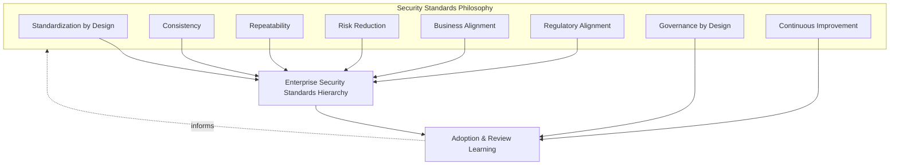
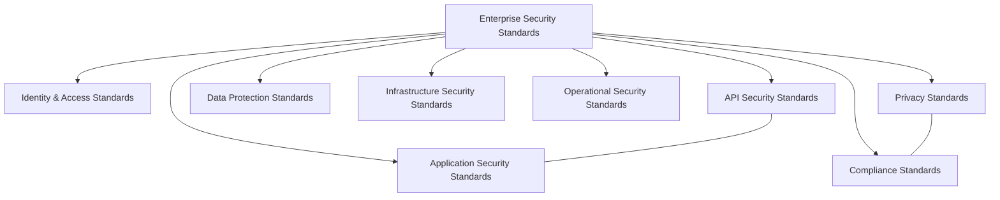
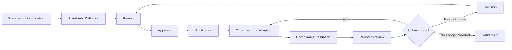
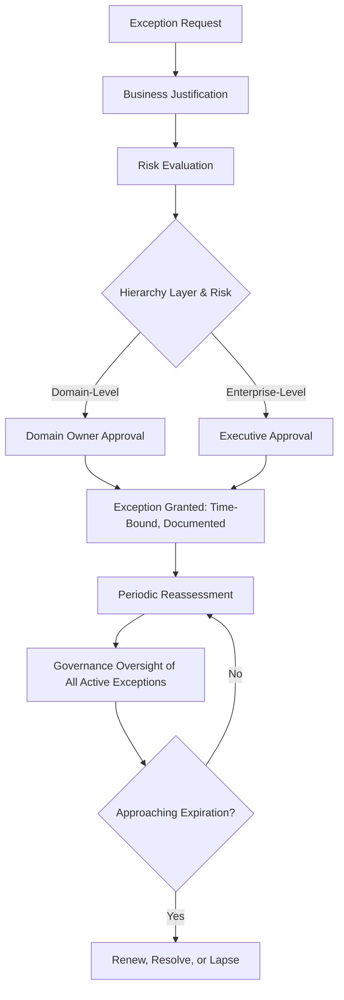
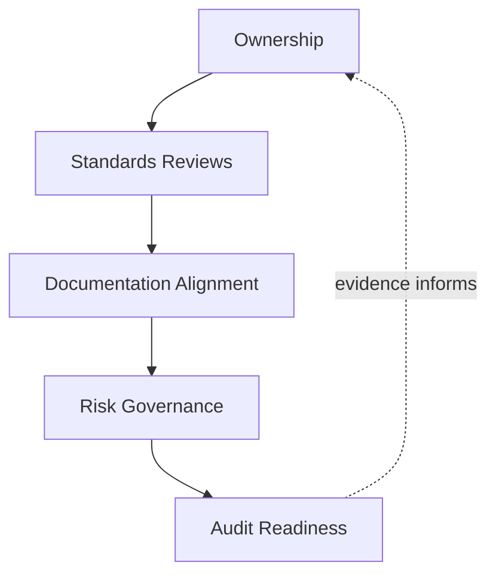
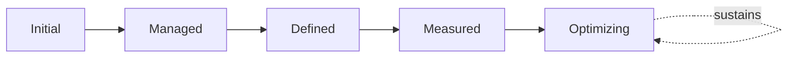
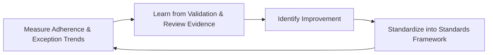

# Enterprise Security Standards Framework

## 1. Document Purpose

This document defines the official Enterprise Security Standards Framework for **StackLeo Tech Store**. It establishes the mandatory baselines that ensure security practice is applied consistently across every team, service, and domain — independent of any specific security product, development tool, or technology.

Standards occupy a distinct position between policy and control: `security-policies.md` states what StackLeo generally requires (for example, that sensitive data must be protected); this document defines the specific, mandatory, and measurable baseline every implementation must meet to satisfy that requirement consistently; and `security-controls-framework.md` governs the concrete mechanisms that achieve the standard in practice. A policy without a corresponding standard leaves "compliant" open to inconsistent interpretation across teams; a control without a governing standard has no consistent bar to be measured against.

- **Purpose of Security Standards** — standards exist to ensure that every team, service, and domain interprets "secure" the same way, converting general policy expectation into a specific, consistent, and verifiable baseline.
- **Relationship with Security Policies** — this document implements the mandatory baselines that satisfy the general expectations established in `security-policies.md`; every standard traces to the specific policy it operationalizes.
- **Relationship with Security Governance** — this document is the standards-specific elaboration of `security-governance.md`; it operates within the same governance model and domains, applying them specifically to the question of consistent baseline definition.
- **Relationship with Enterprise Architecture** — standards ensure architectural decisions made independently across teams remain consistent with one another and with `03_System_Design/architecture-principles.md`, rather than each team interpreting security requirements differently.
- **Relationship with Risk Management** — standard rigor is proportionate to genuine risk, consistent with `threat-model.md` and ISO 31000 thinking; a uniform baseline is not applied where risk genuinely differs.
- **Relationship with Compliance** — this document's mandatory baselines provide the consistent, demonstrable evidence base `compliance.md` depends on to show regulatory and contractual obligations are met the same way everywhere, not on a team-by-team basis.
- **Relationship with Business Strategy** — standards exist to let the business scale confidently — new teams, new services, new markets — without security consistency depending on individual judgment, consistent with `01_Business/business-model.md`.

This document is implementation-independent and vendor-neutral. It defines standards philosophy, hierarchy, lifecycle, and governance conceptually — not specific security products, development tools, cloud providers, security vendors, implementation methods, technical configurations, security algorithms, infrastructure settings, or deployment procedures.

## 2. Security Standards Philosophy

Security standards at StackLeo are governed by eight principles. Each exists to produce a specific business outcome — standards are maintained deliberately because of the consistency and confidence they create at scale, not as bureaucratic uniformity for its own sake.

### 2.1 Standardization by Design

Standards are established deliberately as a domain's security requirements are first defined, not assembled retroactively once inconsistent practice has already emerged across teams.

- **Business Value** — prevents the costly rework of reconciling divergent practice after multiple teams have already implemented a requirement differently.

### 2.2 Consistency

The same requirement is interpreted and met the same way regardless of which team, service, or domain implements it.

- **Business Value** — makes security posture genuinely knowable at the enterprise level, rather than a patchwork of team-specific interpretations.

### 2.3 Repeatability

A standard can be applied successfully by any team with the relevant context, not only by the team that originally defined it.

- **Business Value** — reduces StackLeo's exposure to any single team's or individual's specific knowledge, supporting sustainable growth.

### 2.4 Risk Reduction

Standards exist to reduce the likelihood and consequence of security failure, consistent with Risk-Based Controls in `security-controls-framework.md` (Section 2.2).

- **Business Value** — converts abstract risk awareness into a concrete, minimum bar every implementation is held to.

### 2.5 Business Alignment

Standards are set at a level that genuinely protects the business without imposing disproportionate friction on legitimate operation, consistent with Business Alignment in `security-policies.md` (Section 2.5).

- **Business Value** — keeps standards followed willingly rather than treated as an obstacle to be worked around.

### 2.6 Regulatory Alignment

Standards reflect applicable legal, regulatory, and contractual obligations, coordinated with `compliance.md`, ensuring the mandatory baseline is never lower than what the law or contract genuinely requires.

- **Business Value** — protects StackLeo's license to operate while providing a single, consistent bar that satisfies both internal and external expectations simultaneously.

### 2.7 Governance by Design

Standards governance structures are established deliberately as standards are defined, not retrofitted once inconsistency has already caused a gap or incident.

- **Business Value** — prevents the costly, high-visibility discovery of standards governance gaps only after inconsistent practice has already caused harm.

### 2.8 Continuous Improvement

Standards practice matures over time, informed by real implementation experience, incidents, and the evolving threat and regulatory landscape.

- **Business Value** — keeps the standards framework relevant as StackLeo's business model, scale, and obligations evolve.

*Diagram: Security Standards Philosophy Overview — the eight principles shape the enterprise standards hierarchy, and adoption and review learning feed back into the philosophy itself.*

## 3. Enterprise Security Standards Hierarchy

Security standards are organized across nine conceptual layers, from the enterprise-wide baseline down to compliance-specific standards.

### 3.1 Enterprise Security Standards

- **Purpose** — establish the foundational baseline every other standards layer inherits from.
- **Governance Scope** — sits above every domain-specific standard, consistent with the governance model in `security-governance.md` (Section 3).
- **Business Value** — provides the single, coherent foundation every domain-specific standard traces back to.
- **Executive Expectations** — leadership treats this layer as the non-negotiable enterprise-wide floor no domain may fall below.

### 3.2 Identity & Access Standards

- **Purpose** — establish the mandatory baseline for identity lifecycle, authentication strength, and authorization scoping.
- **Governance Scope** — implements the expectations of Identity & Access Policies in `security-policies.md` (Section 3.2), elaborated in `identity-management.md`, `authentication.md`, `authorization.md`.
- **Business Value** — ensures every access decision across the platform meets the same minimum bar of trustworthiness.
- **Executive Expectations** — leadership expects identity baselines to be applied uniformly, regardless of which team owns a given service.

### 3.3 Application Security Standards

- **Purpose** — establish the mandatory baseline for secure design, construction, and review across application surfaces.
- **Governance Scope** — implements Application Security Policies in `security-policies.md` (Section 3.4), elaborated in `application-security.md`, `frontend-security.md`, `backend-security.md`, `secure-coding-standards.md`.
- **Business Value** — ensures every engineering team builds to the same secure baseline, regardless of which capability they own.
- **Executive Expectations** — leadership expects application standards to be verifiable, not merely aspirational guidance.

### 3.4 API Security Standards

- **Purpose** — establish the mandatory baseline for protecting contracts consumed by channels and external parties.
- **Governance Scope** — implements `api-security.md`, coordinated with `05_API/api-standards.md` and `05_API/api-governance.md`.
- **Business Value** — ensures every current and future channel consumes APIs held to the same protective baseline.
- **Executive Expectations** — leadership expects API standards to scale consistently as channels multiply.

### 3.5 Data Protection Standards

- **Purpose** — establish the mandatory baseline for data classification, handling, encryption, and secrets protection.
- **Governance Scope** — implements Data Protection Policies in `security-policies.md` (Section 3.3), elaborated in `data-protection.md`, `encryption.md`, `secrets-management.md`.
- **Business Value** — ensures data of a given classification is protected the same way regardless of which service handles it.
- **Executive Expectations** — leadership expects the data protection baseline to be genuinely proportionate to classification, not applied loosely.

### 3.6 Infrastructure Security Standards

- **Purpose** — establish the mandatory baseline for protecting the environment the platform runs in.
- **Governance Scope** — implements `infrastructure-security.md` and `network-security.md`.
- **Business Value** — ensures environment protection is consistent regardless of specific provider or deployment model, supporting cloud-portability.
- **Executive Expectations** — leadership expects infrastructure standards to remain stable as underlying technology choices evolve.

### 3.7 Operational Security Standards

- **Purpose** — establish the mandatory baseline for monitoring, vulnerability management, and incident response during live operation.
- **Governance Scope** — implements Operational Security Policies in `security-policies.md` (Section 3.6), elaborated in `security-monitoring.md`, `vulnerability-management.md`, `incident-response.md`.
- **Business Value** — ensures every operational team responds to security-relevant events with the same baseline discipline.
- **Executive Expectations** — leadership expects operational standards to be exercised, coordinated with `09_Operations/incident-management.md`.

### 3.8 Privacy Standards

- **Purpose** — establish the mandatory baseline for ensuring data is used only as customers reasonably expect.
- **Governance Scope** — implements Privacy Policies in `security-policies.md` (Section 3.7), elaborated in `privacy.md`.
- **Business Value** — ensures privacy commitments are honored consistently across every customer touchpoint.
- **Executive Expectations** — leadership expects privacy standards to be structurally, not merely aspirationally, enforced.

### 3.9 Compliance Standards

- **Purpose** — establish the mandatory baseline for satisfying applicable regulatory, contractual, and policy obligations.
- **Governance Scope** — implements Compliance Policies in `security-policies.md` (Section 3.8), elaborated in `compliance.md`.
- **Business Value** — ensures obligations are met the same way across every team, not interpreted differently depending on who is responsible.
- **Executive Expectations** — leadership expects compliance standards to be understood and tracked proactively, ahead of market expansion.

### Enterprise Security Standards Hierarchy Matrix

| Layer | Purpose | Governance Scope | Business Value |
|---|---|---|---|
| Enterprise Security Standards | Establish the foundational, enterprise-wide baseline | Sits above every domain-specific standard | Single, coherent foundation for every layer beneath it |
| Identity & Access Standards | Establish identity, authentication, authorization baselines | Implements Identity & Access Policies | Every access decision meets the same trustworthiness bar |
| Application Security Standards | Establish secure design/construction baselines | Implements Application Security Policies | Every team builds to the same secure baseline |
| API Security Standards | Establish contract protection baselines | Implements API Security Policy, coordinated with `05_API` | Every channel consumes APIs at the same protective baseline |
| Data Protection Standards | Establish classification, handling, encryption baselines | Implements Data Protection Policies | Data of a given classification protected consistently |
| Infrastructure Security Standards | Establish environment protection baselines | Implements Infrastructure Security Policies | Consistent protection regardless of provider or deployment |
| Operational Security Standards | Establish monitoring, vulnerability, incident baselines | Implements Operational Security Policies | Every team responds with the same baseline discipline |
| Privacy Standards | Establish data-use-expectation baselines | Implements Privacy Policies | Privacy honored consistently across every touchpoint |
| Compliance Standards | Establish regulatory/contractual obligation baselines | Implements Compliance Policies | Obligations met consistently, not team-dependent |

*Diagram 1: Enterprise Security Standards Hierarchy — Enterprise Security Standards form the foundational baseline every domain-specific layer inherits from, with API and Application, and Privacy and Compliance, closely related given their shared scope.*

## 4. Security Standards Lifecycle

Security standards are governed across ten conceptual stages, from initial identification through retirement.

### 4.1 Standards Identification

- **Purpose** — recognize that a new standard, or a change to an existing one, is genuinely needed to satisfy a policy consistently.
- **Governance Objectives** — require identification to trace to a specific policy in `security-policies.md` lacking a defined baseline.
- **Business Value** — ensures standards creation is deliberate, responding to a genuine consistency gap, not created speculatively.

### 4.2 Standards Definition

- **Purpose** — draft the specific, mandatory baseline the standard will establish.
- **Governance Objectives** — require definition to reference the policy it implements and the risk it addresses.
- **Business Value** — produces a standard grounded in genuine governance intent, not written in isolation from established policy.

### 4.3 Review

- **Purpose** — confirm the drafted standard is accurate, consistent with existing standards, and genuinely achievable across affected teams.
- **Governance Objectives** — require review by someone other than the standard's author, consistent with independent validation practice used throughout this repository.
- **Business Value** — prevents an unreviewed, potentially unrealistic standard from being adopted.

### 4.4 Approval

- **Purpose** — render a deliberate, accountable decision to formally adopt the reviewed standard.
- **Governance Objectives** — require approval authority proportionate to the standard's hierarchy layer (Section 3) and risk significance.
- **Business Value** — converts standard adoption into a governed decision point, not a default outcome of drafting.

### 4.5 Publication

- **Purpose** — make the approved standard available to every team that must meet it.
- **Governance Objectives** — require published standards to be accessible to all relevant roles.
- **Business Value** — ensures a governed standard actually reaches every team responsible for meeting it.

### 4.6 Organizational Adoption

- **Purpose** — establish the standard as the genuine, lived baseline across every affected team.
- **Governance Objectives** — require affected teams to be explicitly informed, not left to discover the standard incidentally.
- **Business Value** — converts a published baseline into genuine, consistent organizational practice.

### 4.7 Compliance Validation

- **Purpose** — confirm that actual implementation genuinely meets the adopted standard.
- **Governance Objectives** — connect to Compliance Validation in `security-controls-framework.md` (Section 4.8) and coordinate with `compliance.md`.
- **Business Value** — provides the evidentiary foundation StackLeo depends on to demonstrate consistent baseline achievement.

### 4.8 Periodic Review

- **Purpose** — formally reassess whether the standard remains accurate and adequate on a recurring basis.
- **Governance Objectives** — require review to occur on a predictable, regular cadence, not only when inconsistency is already discovered.
- **Business Value** — prevents standards from silently drifting out of date as the business and threat landscape evolve.

### 4.9 Revision

- **Purpose** — update the standard based on periodic review or compliance validation findings.
- **Governance Objectives** — require material revisions to proceed through Review and Approval (Sections 4.3–4.4) again, not be applied informally.
- **Business Value** — keeps the standards framework a living, accurate baseline rather than a static historical record.

### 4.10 Retirement

- **Purpose** — formally withdraw a standard once it no longer serves a genuine consistency need.
- **Governance Objectives** — require retirement to be an explicit, recorded decision, never a standard simply left forgotten.
- **Business Value** — prevents the accumulation of stale, contradictory baselines that undermine confidence in the framework overall.

### Security Standards Lifecycle Matrix

| Stage | Purpose | Governance Objective | Business Value |
|---|---|---|---|
| Standards Identification | Recognize a genuine need for a new or changed standard | Traces to a policy lacking a defined baseline | Ensures standards creation responds to a genuine gap |
| Standards Definition | Draft the specific, mandatory baseline | References the implemented policy and addressed risk | Grounds the standard in genuine governance intent |
| Review | Confirm accuracy, consistency, achievability | Reviewed by someone other than the author | Prevents an unreviewed, unrealistic standard |
| Approval | Render a deliberate, accountable adoption decision | Authority proportionate to hierarchy layer and risk | Converts adoption into a governed decision point |
| Publication | Make the approved standard available to every team | Accessible to all relevant roles | Ensures the standard reaches every responsible team |
| Organizational Adoption | Establish the standard as a genuine, lived baseline | Affected teams explicitly informed | Converts a baseline into genuine, consistent practice |
| Compliance Validation | Confirm implementation genuinely meets the standard | Coordinated with control and compliance validation | Provides evidentiary foundation for baseline achievement |
| Periodic Review | Reassess accuracy and adequacy recurringly | Predictable, regular cadence | Prevents silent drift out of date |
| Revision | Update the standard based on review findings | Material revisions repeat review and approval | Keeps the framework a living, accurate baseline |
| Retirement | Formally withdraw a no-longer-needed standard | An explicit, recorded decision, never forgotten | Prevents accumulation of stale, contradictory baselines |

*Diagram 2: Security Standards Lifecycle — a standard proceeds from identification through adoption and validation, with periodic review determining whether it continues in force, requires revision, or is retired.*

## 5. Security Standards Governance Principles

- **Executive Ownership** — significant standards decisions, particularly at the Enterprise Security Standards layer (Section 3.1), are made or ratified at the executive level.
- **Mandatory Baselines** — a published, adopted standard is a mandatory minimum, not discretionary guidance a team may choose to follow.
- **Consistency** — standards across every hierarchy layer are applied uniformly, regardless of which team owns the implementation.
- **Traceability** — every standard traces to the specific policy it implements and the risk it addresses.
- **Auditability** — standard approval, adoption, and validation history can be independently reviewed after the fact, supporting ISO/IEC 27001-aligned assurance.
- **Accountability** — every standard has a single, named accountable owner responsible for its accuracy and currency.
- **Regulatory Awareness** — standards are reviewed with explicit awareness of applicable regulatory and contractual obligations, coordinated with `compliance.md`.
- **Continuous Improvement** — standards governance itself matures over time, informed by real adoption and validation experience.

### Security Standards Governance Principles Matrix

| Principle | Description | Business Value |
|---|---|---|
| Executive Ownership | Significant decisions made or ratified at the executive level | Reflects genuine business consequence of enterprise-wide baselines |
| Mandatory Baselines | Adopted standards are mandatory minimums, not discretionary | Ensures genuine, consistent enforcement, not optional guidance |
| Consistency | Standards applied uniformly across every hierarchy layer | Makes security posture genuinely knowable at the enterprise level |
| Traceability | Every standard traces to a policy and addressed risk | Prevents standards from feeling arbitrary or disconnected |
| Auditability | Approval, adoption, and validation history reviewable | Supports ISO/IEC 27001-aligned assurance and audit confidence |
| Accountability | Every standard has a single, named accountable owner | Prevents a standard existing without anyone responsible for it |
| Regulatory Awareness | Reviewed with explicit awareness of applicable obligations | Protects license to operate as obligations evolve |
| Continuous Improvement | Governance matures from real adoption and validation evidence | Keeps the framework aligned with organizational growth |

## 6. Standards Exception Governance

- **Exception Requests** — a team may request a deliberate, documented deviation from a mandatory standard where genuine business or technical circumstance warrants it.
- **Business Justification** — every exception request states the genuine business or technical rationale for the deviation, not merely convenience or difficulty of compliance.
- **Risk Evaluation** — every exception request is evaluated for the genuine risk the deviation introduces, consistent with ISO 31000 thinking.
- **Executive Approval** — exception approval authority is proportionate to the standard's hierarchy layer (Section 3) and evaluated risk, escalating to executive level for enterprise-wide standards.
- **Documentation** — exceptions are recorded consistently, including their justification, approver, scope, and evaluated risk, never granted informally.
- **Periodic Reassessment** — every granted exception is reviewed on a recurring basis to confirm the justifying circumstance still holds.
- **Expiration** — every exception is granted for a bounded, time-limited period, never indefinitely by default.
- **Governance Oversight** — the accumulated set of active exceptions is reviewed periodically at the governance level, ensuring exceptions do not silently accumulate into a de facto alternate standard.

### Standards Exception Governance Matrix

| Element | Purpose | Governance Role |
|---|---|---|
| Exception Requests | Allow deliberate, documented deviation where warranted | Prevents informal, undocumented standard bypass |
| Business Justification | State the genuine rationale for the deviation | Ensures exceptions reflect real need, not convenience |
| Risk Evaluation | Assess the genuine risk the deviation introduces | Grounds the exception decision in evidence, not assumption |
| Executive Approval | Approve proportionate to hierarchy layer and risk | Ensures significant deviations receive commensurate scrutiny |
| Documentation | Record justification, approver, scope, and risk consistently | Supports auditability and prevents informal exceptions |
| Periodic Reassessment | Reconfirm the justifying circumstance still holds | Prevents an exception outliving its original rationale |
| Expiration | Bound every exception to a time-limited period | Prevents exceptions becoming permanent by default |
| Governance Oversight | Review the accumulated set of active exceptions | Prevents exceptions silently becoming a de facto alternate standard |

*Diagram 4: Standards Review & Approval Model — an exception request is justified, risk-evaluated, and approved proportionate to its hierarchy layer, with the full set of active exceptions subject to ongoing governance oversight.*

## 7. Compliance Alignment

- **ISO/IEC 27001** — this framework's standards hierarchy and lifecycle are structured to support an Information Security Management System consistent with ISO/IEC 27001 principles, without prescribing specific Annex A control mappings here.
- **NIST Cybersecurity Framework** — standards across the hierarchy (Section 3) map conceptually to the Protect and Identify functions, providing the consistent baseline those functions depend on, without prescribing specific NIST implementation tiers.
- **ISO 31000** — Risk Reduction (Section 2.4) and Standards Exception Governance (Section 6) apply ISO 31000 risk management principles directly to standards-level decisions.
- **Internal Governance** — this framework's own principles (Section 2) are the baseline standard StackLeo holds itself to, independent of any external requirement.
- **Privacy Regulations** — Privacy Standards (Section 3.8) are structured to absorb applicable regional privacy regulation as StackLeo expands, coordinated with `privacy.md` and `compliance.md`.
- **Enterprise Risk Management** — standards-level risk decisions are consolidated into the broader risk visibility maintained by `security-governance.md` (Section 3.2, Security Risk Governance).

### Compliance Alignment Matrix

| Framework / Regime | Alignment | Governance Role |
|---|---|---|
| ISO/IEC 27001 | Standards hierarchy and lifecycle support ISMS-consistent practice | Structural alignment, no prescribed Annex A mapping |
| NIST Cybersecurity Framework | Standards map conceptually to Protect/Identify functions | No prescribed implementation tier |
| ISO 31000 | Risk-based standards decisions and exceptions | Direct application to Section 2.4 and Section 6 |
| Internal Governance | This framework's own principles are the baseline standard | Independent of external requirement |
| Privacy Regulations | Privacy Standards structured to absorb regional regulation | Coordinated with `privacy.md` and `compliance.md` |
| Enterprise Risk Management | Standards-level risk consolidated into broader risk visibility | Feeds `security-governance.md` Security Risk Governance |

*Diagram 3: Security Standards Governance Framework — ownership anchors review activity, which feeds documentation alignment, risk governance, and ultimately auditable evidence, consistent with the broader `security-governance.md` model.*

### Governance Responsibility Matrix

| Role | Responsibility |
|---|---|
| CISO | Owns coherence and enforcement of this standards framework, in partnership with Security and Executive leadership. |
| Security Leadership | Owns Enterprise Security Standards (Section 3.1) and coordinates the full hierarchy. |
| Domain Standards Owners | Own individual hierarchy layers (Sections 3.2–3.9) and their lifecycle stages. |
| Engineering Leads | Apply Application, API, and Infrastructure Security Standards within their domain. |
| Compliance & Risk Functions | Own Compliance Standards (Section 3.9) and Compliance Alignment (Section 7). |
| Operations Teams | Execute Compliance Validation (Section 4.7) as part of day-to-day operational practice. |
| Executive Leadership | Approves significant exceptions and Enterprise Security Standards decisions. |
| Internal Audit / Review Function | Independently verifies that standards records reflect actual enforced practice. |

## 8. Future Readiness

This framework is designed to remain valid as StackLeo evolves in scale and architectural complexity, without requiring redefinition of its underlying philosophy.

- **AI Systems** — as AI-assisted capability is introduced, it is governed under Application Security and Data Protection Standards (Sections 3.3, 3.5) using the same hierarchy, without prescribing AI-specific technical baselines.
- **Cloud-Native Platforms** — Infrastructure Security Standards (Section 3.6) apply consistently regardless of the specific infrastructure technologies adopted.
- **Marketplace Platforms** — the multi-vendor marketplace model extends Identity & Access and Data Protection Standards (Sections 3.2, 3.5) to cover seller-facing identity and data handling, applying the same baseline used for StackLeo's own operations today.
- **Multi-Tenant Architectures** — where future architecture introduces tenant isolation, Identity & Access and Infrastructure Security Standards (Sections 3.2, 3.6) extend to explicitly define cross-tenant baseline requirements.
- **Global Expansion** — Compliance and Privacy Standards (Sections 3.9, 3.8) remain jurisdiction-agnostic in structure, allowing region-specific obligations to layer on via `compliance.md` without redesigning the underlying hierarchy.
- **Evolving Regulatory Requirements** — Regulatory Alignment (Section 2.6) and Periodic Review (Section 4.8) are structured to absorb genuinely new regulatory obligations as they emerge.
- **Enterprise Scale** — the standards hierarchy, lifecycle, and exception governance defined in Sections 3–6 are defined independently of organizational size or structure, so they remain coherent as the business and its standards volume grow substantially.

## 9. Security Standards Maturity Model

Security standards maturity is described across five conceptual levels, adapted from established process maturity thinking and consistent with ISO/IEC 27001-aligned assurance expectations.

- **Initial** — standards, where they exist, are informal and inconsistent; teams interpret security requirements independently, and no genuine enterprise-wide baseline exists.
- **Managed** — basic standards exist for individual hierarchy layers, but consistency and lifecycle discipline vary significantly across the framework.
- **Defined** — the standards hierarchy, lifecycle, and exception governance are standardized, documented, and consistently applied across the organization, consistent with the model defined throughout this document; ownership is clear organization-wide.
- **Measured** — standard adherence and exception trends are measured systematically, and revision decisions are grounded in genuine compliance validation evidence rather than qualitative impression alone.
- **Optimizing** — standards governance is continuously and deliberately improved based on quantitative evidence and organizational learning; improvement itself is a managed, ongoing discipline rather than an occasional initiative.

### Security Standards Maturity Model Matrix

| Level | Characteristics | Primary Focus |
|---|---|---|
| Initial | Informal, inconsistent standards; teams interpret requirements independently | Ad hoc, team-dependent interpretation |
| Managed | Basic standards exist per layer; consistency varies | Layer-level consistency |
| Defined | Standardized hierarchy, lifecycle, and exception governance | Organization-wide consistency and clear ownership |
| Measured | Adherence and exception trends measured systematically | Evidence-based standards decisions |
| Optimizing | Practice continuously and deliberately improved from evidence | Sustained, deliberate improvement as a discipline |

*Diagram 6: Security Standards Maturity Progression Model — maturity advances from informal, team-dependent interpretation toward standardized, measured, and continuously optimized standards governance.*

*Diagram 5: Continuous Standards Improvement Cycle — adherence and exception trends are measured, learned from, improved upon, and standardized back into the framework, on a continuing basis.*

## 10. Anti-Patterns

The following recurring failure patterns are explicitly recognized and avoided, as each one structurally undermines this framework.

| Anti-Pattern | Why It's Avoided |
|---|---|
| Inconsistent Standards | Contradicts Consistency (Section 2.2); standards applied differently across teams undermine the entire purpose of standardization. |
| Undefined Baselines | Contradicts Standardization by Design (Section 2.1); a policy without a corresponding standard leaves "compliant" open to inconsistent, team-specific interpretation. |
| Weak Governance | Contradicts Governance by Design (Section 2.7); standards created outside this framework's lifecycle lack accountable ownership and review discipline from the outset. |
| Poor Traceability | Contradicts Traceability (Section 5); a standard that cannot be traced to a specific policy or risk cannot be evaluated for whether it remains genuinely justified. |
| Outdated Standards | Contradicts Periodic Review (Section 4.8); a standard that no longer reflects genuine risk or regulatory context actively misleads rather than protects. |
| Weak Ownership | Contradicts Accountability (Section 5); a standard without a named owner has no one specifically responsible for keeping it accurate. |
| Compliance Without Standardization | Contradicts Regulatory Alignment (Section 2.6); treating compliance obligations as satisfied without genuine, consistent standards leaves real inconsistency unaddressed. |
| Missing Continuous Improvement | Contradicts Continuous Improvement (Section 2.8); without deliberate improvement, the standards framework stagnates as the business, threat landscape, and regulatory context evolve. |

## 11. Document Information

| Property | Value |
|----------|-------|
| Document | security-standards.md |
| Version | 1.0.0 |
| Status | Active |
| Maintained By | StackLeo |
| Last Updated | 2026-07-24 |

---

© StackLeo. All Rights Reserved.
