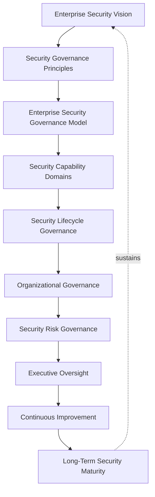
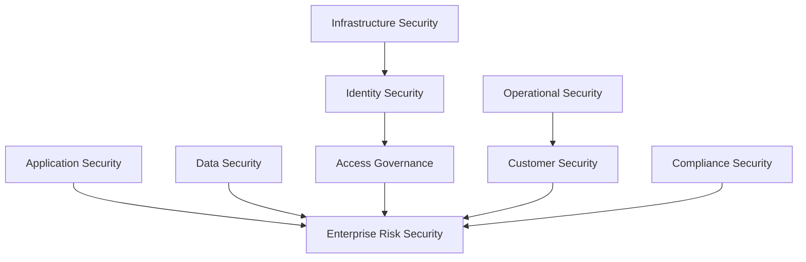
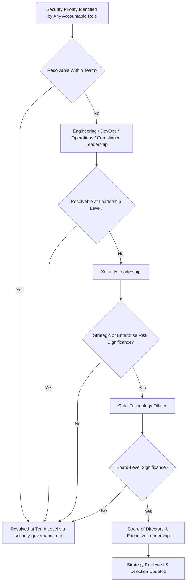
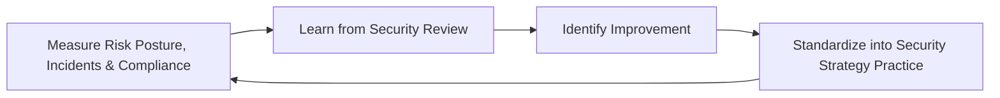
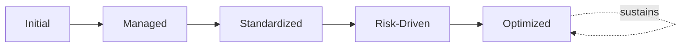

# Enterprise Security Strategy Framework

## 1. Executive Summary

**Purpose** — This document defines the official Enterprise Security Strategy Framework for **StackLeo Tech Store**. It establishes security vision, strategic direction, organizational accountability, risk protection, security culture, executive oversight, continuous improvement, and long-term security maturity as StackLeo's deliberate, business-level security direction. `security-governance.md` remains the master operational governance framework for the entire `06_Security` domain — the document that holds every domain-specific security strategy accountable as a coherent, enforced whole. This document sits upstream of that governance structure, not above or in competition with it: it is the strategic "why" — the business vision, principles, and direction security exists to serve — that `security-governance.md` governs the accountable "how" of. Wherever this framework defines a domain, principle, or model, `security-governance.md` remains the authoritative source for how that direction is operationally enforced, escalated, and coordinated across `06_Security`.

**Scope** — This strategy applies to every category of security at StackLeo — application, data, infrastructure, identity, access, operational, customer, compliance, and enterprise risk security — across the full platform lifecycle, coordinated with `security-governance.md`, `security-principles.md`, and `01_Business/vision.md`.

**Strategic Objectives** — To ensure security is pursued as a deliberate business capability that enables StackLeo's growth, not merely a defensive cost; that security risk is genuinely understood and proportionately managed; that a genuine security culture exists across every team, not only within the security function; and that executive leadership and the Board have continuous, honest visibility into the organization's security posture and direction.

**Business Value** — A governed security strategy protects the trust customers, partners, and regulators place in StackLeo, protects the business from the disproportionate cost of an avoidable security failure, and gives leadership the confidence to pursue growth — corporate sales, wholesale, the multi-vendor marketplace — without unknowingly trading away security for speed.

**Intended Audience** — The Board of Directors, executive leadership, the Chief Technology Officer, security leadership, engineering leadership, DevOps leadership, development teams, operations teams, compliance teams, and business stakeholders.

## 2. Enterprise Security Vision

- **Security as Business Capability** — security is governed as a genuine business capability that enables growth, never merely a defensive, cost-centered function.
- **Protection of Business Assets** — security protects the business's genuine assets — data, platform, brand, and relationships — as a deliberate, strategic priority.
- **Customer Trust** — security is the customer's most direct, continuous evidence of whether StackLeo genuinely deserves their trust with sensitive data and transactions.
- **Business Continuity** — security protects the organization's ability to keep operating through a genuine security event, coordinated with `06_Security/business-continuity.md`.
- **Risk Reduction** — security exists to genuinely reduce the organization's exposure to consequential harm, not to eliminate risk beyond what is proportionate.
- **Responsible Technology Usage** — security governs the organization's adoption of new technology responsibly, never at the expense of genuine protection.
- **Sustainable Growth** — security strategy ensures StackLeo's growth in scale and complexity is matched by proportionate, deliberate security investment.

### Enterprise Security Vision Matrix

| Vision Element | Focus | Business Value |
|---|---|---|
| Security as Business Capability | A genuine capability that enables growth | Prevents security from being treated as a pure cost center |
| Protection of Business Assets | Data, platform, brand, and relationships as strategic priority | Protects what the business genuinely depends on |
| Customer Trust | The customer's most direct evidence of trustworthiness | Protects the trust relationship every transaction depends on |
| Business Continuity | The ability to keep operating through a security event | Protects revenue and commitments tied to continuous service |
| Risk Reduction | Genuinely reducing exposure to consequential harm | Directs investment toward what genuinely matters most |
| Responsible Technology Usage | Adopting new technology responsibly, not carelessly | Protects the organization from avoidable, self-inflicted exposure |
| Sustainable Growth | Growth matched by proportionate security investment | Keeps expansion from silently eroding the organization's posture |

*Diagram 1: Enterprise Security Governance Framework — enterprise security vision establishes governance principles and the governance model, flowing through capability domains, lifecycle governance, and organizational governance into risk governance and executive oversight, with continuous improvement driving long-term security maturity that reinforces the vision itself.*

## 3. Security Governance Principles

Security strategy at StackLeo rests on nine principles, each producing a specific business outcome. These are the strategic principles `security-governance.md` (Section 2) operationalizes into enforceable governance practice.

- **Security by Design** — security is considered from the outset of any capability, never retrofitted after the fact. *Business Value:* prevents the disproportionate cost of remediating security after a capability is already built.
- **Risk-Based Security** — security investment is proportionate to genuine risk, not applied uniformly regardless of consequence. *Business Value:* directs limited security resource toward what genuinely matters most.
- **Defense in Depth** — no single control is relied upon exclusively to protect a genuinely important asset. *Business Value:* protects the organization from a single point of security failure.
- **Least Privilege** — access is granted only to the minimum genuinely necessary for a role's defined responsibility. *Business Value:* limits the genuine blast radius of a compromised credential or account.
- **Privacy Protection** — security is governed with explicit, genuine regard for the privacy of the individuals whose data it protects, coordinated with `06_Security/privacy-governance.md`. *Business Value:* protects customer trust and regulatory standing from careless data exposure.
- **Accountability** — every security domain traces to a specific, named, responsible owner. *Business Value:* ensures no security domain drifts without someone genuinely responsible for it.
- **Continuous Improvement** — security practice matures over time, informed by real operational and threat outcomes. *Business Value:* keeps security aligned with the organization's growing scale and an evolving threat landscape.
- **Security Awareness** — every employee, not only the security function, is expected to genuinely understand their role in protecting the organization. *Business Value:* protects the organization from the outsized risk a single uninformed action can introduce.
- **Business Alignment** — security decisions are made with genuine awareness of their effect on the business `security-governance.md` (Section 1) exists to serve. *Business Value:* ensures security strengthens, rather than obstructs, genuine business pursuit.

### Security Governance Principles Matrix

| Principle | Description | Business Value |
|---|---|---|
| Security by Design | Considered from the outset, never retrofitted | Prevents the disproportionate cost of after-the-fact remediation |
| Risk-Based Security | Investment proportionate to genuine risk | Directs limited resource toward what genuinely matters most |
| Defense in Depth | No single control relied upon exclusively | Protects against a single point of security failure |
| Least Privilege | Access limited to the minimum genuinely necessary | Limits the genuine blast radius of a compromised credential |
| Privacy Protection | Explicit, genuine regard for individual privacy | Protects customer trust and regulatory standing |
| Accountability | Every domain traces to a specific, named, responsible owner | Ensures no domain drifts without genuine responsibility |
| Continuous Improvement | Practice matures from real operational and threat outcomes | Keeps security aligned with scale and an evolving threat landscape |
| Security Awareness | Every employee understands their protective role | Protects against the outsized risk of a single uninformed action |
| Business Alignment | Decisions made with genuine awareness of business effect | Ensures security strengthens, rather than obstructs, the business |

## 4. Enterprise Security Governance Model

Security strategy sets direction across nine conceptual domains. Each domain's operational governance, escalation, and enforcement remain authoritative in `security-governance.md`; this model defines the strategic direction that operational governance is held accountable to.

### Application Security

- **Purpose** — set strategic direction for protecting application-level behavior and business logic.
- **Governance Scope** — strategic direction; operational governance held by Application Security Governance (`security-governance.md`, Section 3.4).
- **Business Value** — protects confidence that application behavior remains genuinely secure under real conditions.
- **Executive Expectations** — leadership expects application security direction to be embedded from design, not added at release.

### Data Security

- **Purpose** — set strategic direction for protecting the confidentiality, integrity, and availability of platform data.
- **Governance Scope** — strategic direction; operational governance held by Data Protection Governance (`security-governance.md`, Section 3.5).
- **Business Value** — protects the trustworthiness of the data every business decision and customer interaction depends on.
- **Executive Expectations** — leadership expects data security direction to be proportionate to data sensitivity.

### Infrastructure Security

- **Purpose** — set strategic direction for protecting the platform's underlying technical foundation.
- **Governance Scope** — strategic direction coordinated with `infrastructure-security.md` and `network-security.md`.
- **Business Value** — protects the technical foundation every other security domain ultimately depends on.
- **Executive Expectations** — leadership expects infrastructure security direction to remain consistent regardless of scale.

### Identity Security

- **Purpose** — set strategic direction for protecting the identity of every human and system actor on the platform.
- **Governance Scope** — strategic direction; operational governance held by Identity Governance (`security-governance.md`, Section 3.3).
- **Business Value** — protects the platform from the outsized consequence of a compromised identity.
- **Executive Expectations** — leadership expects identity security direction to be treated as foundational, not incidental.

### Access Governance

- **Purpose** — set strategic direction for who may access what, and under which genuine justification.
- **Governance Scope** — strategic direction coordinated with `06_Security/access-review-governance.md` and `06_Security/authorization-governance.md`.
- **Business Value** — protects the organization from the consequence of excessive or unreviewed access.
- **Executive Expectations** — leadership expects access direction to be governed by Least Privilege (Section 3) without exception.

### Operational Security

- **Purpose** — set strategic direction for protecting the platform through genuine day-to-day operation.
- **Governance Scope** — strategic direction; operational governance held by Operational Security Governance (`security-governance.md`, Section 3.6).
- **Business Value** — protects the organization's ability to genuinely detect and respond to a security event.
- **Executive Expectations** — leadership expects operational security direction to extend genuinely beyond deployment.

### Customer Security

- **Purpose** — set strategic direction for protecting the customer's genuine security and trust in the platform.
- **Governance Scope** — strategic direction coordinated with `01_Business/vision.md`'s trust-centered brand commitment.
- **Business Value** — protects the trust relationship every customer transaction depends on.
- **Executive Expectations** — leadership expects customer security direction to be weighed alongside internal technical priority.

### Compliance Security

- **Purpose** — set strategic direction for security's role in meeting genuine regulatory and contractual obligation.
- **Governance Scope** — strategic direction; operational governance held by Compliance Governance (`06_Security/compliance-governance.md`).
- **Business Value** — protects the organization's standing with regulators and counterparties.
- **Executive Expectations** — leadership expects compliance security direction to be proactive, not reactive to audit findings.

### Enterprise Risk Security

- **Purpose** — set strategic direction for security's contribution to the organization's overall risk posture.
- **Governance Scope** — strategic direction coordinated with `06_Security/enterprise-risk-management-strategy.md`.
- **Business Value** — connects security direction directly to genuine enterprise risk consequence.
- **Executive Expectations** — leadership expects enterprise risk security direction to be reviewed with the same rigor as any other enterprise risk.

### Security Governance Matrix

| Domain | Purpose | Business Value | Executive Expectations |
|---|---|---|---|
| Application Security | Set direction for protecting application behavior and logic | Protects confidence application behavior remains genuinely secure | Expects security embedded from design, not added at release |
| Data Security | Set direction for protecting data confidentiality and integrity | Protects the trustworthiness of data every decision depends on | Expects direction proportionate to data sensitivity |
| Infrastructure Security | Set direction for protecting the technical foundation | Protects the foundation every other domain depends on | Expects consistency regardless of scale |
| Identity Security | Set direction for protecting every actor's identity | Protects against the outsized consequence of compromised identity | Expects treatment as foundational, not incidental |
| Access Governance | Set direction for who may access what, and why | Protects against the consequence of excessive or unreviewed access | Expects governance by Least Privilege without exception |
| Operational Security | Set direction for protecting the platform through operation | Protects the ability to genuinely detect and respond | Expects direction extending genuinely beyond deployment |
| Customer Security | Set direction for protecting genuine customer trust | Protects the trust relationship every transaction depends on | Expects weighting alongside internal technical priority |
| Compliance Security | Set direction for security's role in regulatory obligation | Protects the organization's standing with regulators | Expects proactive, not reactive, direction |
| Enterprise Risk Security | Set direction for security's contribution to risk posture | Connects security direction to genuine enterprise risk | Expects rigor equal to any other enterprise risk |

*Diagram 2: Security Governance Model — application, data, infrastructure, and identity security feed access governance, while operational and customer security converge with compliance security, all resolving into enterprise risk security's strategic picture.*

## 5. Security Capability Domains

Security strategy is exercised across nine conceptual capability domains, each requiring a distinct strategic emphasis. Remaining implementation independent, these domains describe security capability at the level of direction and outcome — never a specific control, tool, or product.

- **Security Governance** — the capability to hold every security decision accountable to a consistent, deliberate structure, held authoritative in `security-governance.md`.
- **Security Risk Management** — the capability to genuinely identify, weigh, and respond to security risk.
- **Identity Protection** — the capability to genuinely protect the identity of every human and system actor.
- **Data Protection** — the capability to genuinely protect the confidentiality, integrity, and availability of data.
- **Application Protection** — the capability to genuinely protect application behavior and business logic.
- **Operational Protection** — the capability to genuinely detect, respond to, and recover from a security event.
- **Threat Awareness** — the capability to genuinely understand the threats the organization actually faces.
- **Compliance Readiness** — the capability to genuinely and continuously demonstrate regulatory and contractual adherence.
- **Security Culture** — the capability for every employee to genuinely understand and act on their role in protecting the organization.

### Security Capability Domain Matrix

| Capability | Governance Focus | Coordination |
|---|---|---|
| Security Governance | Holding every decision accountable to a consistent structure | `security-governance.md` |
| Security Risk Management | Identifying, weighing, and responding to security risk | `06_Security/security-risk-management.md` |
| Identity Protection | Protecting every human and system actor's identity | Identity Security (Section 4) |
| Data Protection | Protecting confidentiality, integrity, and availability | Data Security (Section 4) |
| Application Protection | Protecting application behavior and business logic | Application Security (Section 4) |
| Operational Protection | Detecting, responding to, and recovering from an event | Operational Security (Section 4) |
| Threat Awareness | Understanding the threats the organization actually faces | `06_Security/threat-model.md` |
| Compliance Readiness | Continuously demonstrating regulatory and contractual adherence | Compliance Security (Section 4) |
| Security Culture | Every employee understanding their protective role | Security Awareness (Section 3) |

## 6. Security Lifecycle Governance

Security strategy operates across eight conceptual lifecycle stages.

- **Security Strategy Definition** — govern how the organization decides its overall strategic direction toward security investment.
- **Risk Identification** — govern how a genuine security risk is recognized before it is weighed or addressed.
- **Security Planning** — govern how a strategic security priority is translated into a deliberate plan of action.
- **Governance Alignment** — govern how a planned security initiative is aligned to the operational governance held in `security-governance.md`.
- **Operational Adoption** — govern how an aligned initiative is genuinely adopted into day-to-day operational practice.
- **Security Review** — govern the periodic, formal review of security posture for genuine strategic insight.
- **Continuous Improvement** — govern how security strategy is deliberately strengthened based on real operational and threat outcomes.
- **Security Evolution** — govern the periodic reassessment of whether security strategy remains aligned with evolving business and threat conditions.

### Security Lifecycle Matrix

| Stage | Governance Objective | Business Value |
|---|---|---|
| Security Strategy Definition | Decide overall strategic direction toward investment | Ensures security effort is deliberately directed |
| Risk Identification | Recognize a genuine security risk | Enables strategy to begin before risk compounds |
| Security Planning | Translate strategic priority into a deliberate plan | Ensures strategic intent converts into concrete action |
| Governance Alignment | Align a planned initiative to operational governance | Ensures initiatives are executed through the accountable structure |
| Operational Adoption | Adopt an aligned initiative into daily practice | Ensures strategic investment converts into genuine protection |
| Security Review | Periodically review posture for genuine strategic insight | Confirms strategic investment is genuinely working |
| Continuous Improvement | Strengthen strategy from real operational and threat outcomes | Keeps strategy aligned with an evolving threat landscape |
| Security Evolution | Reassess alignment with evolving business and threat conditions | Keeps strategy genuinely connected to business intent |

*Diagram 3: Security Lifecycle Framework — strategy definition and risk identification inform security planning and governance alignment, feeding operational adoption and security review, with continuous improvement and security evolution feeding lessons back into the cycle.*

## 7. Organizational Governance

Governance accountability is distributed deliberately across ten organizational roles. Day-to-day enforcement and escalation for each role remain governed operationally in `security-governance.md`; this strategy defines each role's strategic accountability.

- **Board of Directors** — holds ultimate accountability for StackLeo's overall security posture and its alignment with organizational values.
- **Executive Leadership** — holds accountability for whether security genuinely serves the business, in partnership with the Board.
- **Chief Technology Officer** — owns the coherence of this strategy's direction and its translation into `security-governance.md`'s operational structure.
- **Security Leadership** — owns the operational governance defined in `security-governance.md`, applying this strategy's direction to day-to-day security practice.
- **Engineering Leadership** — owns Application Security (Section 4) strategic direction within their accountable teams.
- **DevOps Leadership** — owns Infrastructure and Operational Security (Section 4) strategic direction in coordination with `devops-governance-framework.md`.
- **Development Teams** — own the strategic direction of Security by Design (Section 3) within their assigned capability.
- **Operations Teams** — own Operational Security (Section 4) strategic direction in coordination with `09_Operations/operations-governance.md`.
- **Compliance Teams** — own Compliance Security (Section 4) strategic direction jointly with `06_Security/compliance-governance.md`.
- **Business Stakeholders** — own Customer Security (Section 4) strategic direction alignment with genuine business priority.

### Organizational Responsibility Matrix

| Role | Governance Objective | Business Value |
|---|---|---|
| Board of Directors | Hold ultimate accountability for overall security posture | Provides the highest point of ultimate accountability |
| Executive Leadership | Hold accountability for security genuinely serving the business | Provides a single point of executive-level accountability |
| Chief Technology Officer | Own coherence of strategy and its translation into governance | Connects strategic direction to operational enforcement |
| Security Leadership | Own operational governance, applying this strategy's direction | Applies strategy to day-to-day security practice |
| Engineering Leadership | Own application security strategic direction | Embeds direction closest to where code is built |
| DevOps Leadership | Own infrastructure and operational security direction | Keeps direction coordinated with broader DevOps governance |
| Development Teams | Own strategic direction of Security by Design | Ensures security is designed in, not added after the fact |
| Operations Teams | Own operational security strategic direction | Ensures direction extends genuinely into sustained operation |
| Compliance Teams | Own compliance security strategic direction | Ensures direction genuinely meets regulatory obligation |
| Business Stakeholders | Own customer security strategic direction alignment | Connects direction to genuine business relevance |

### Governance Responsibility Matrix

| Role | Responsibility |
|---|---|
| Board of Directors | Owns ultimate accountability for the organization's overall security posture. |
| Executive Leadership | Owns accountability for security genuinely serving the business, in partnership with the Board. |
| Chief Technology Officer | Owns coherence of this strategy and its translation into `security-governance.md`. |
| Security Leadership | Owns the operational governance defined in `security-governance.md`. |
| Engineering Leadership | Owns application security strategic direction within accountable teams. |
| DevOps Leadership | Owns infrastructure and operational security direction in coordination with `devops-governance-framework.md`. |
| Development Teams | Own the strategic direction of Security by Design within their assigned capability. |
| Operations Teams | Own operational security strategic direction in coordination with `09_Operations/operations-governance.md`. |
| Compliance Teams | Own compliance security strategic direction jointly with `06_Security/compliance-governance.md`. |
| Business Stakeholders | Own customer security strategic direction alignment with genuine business priority. |

*Diagram 4: Organizational Security Responsibility Structure — a security priority identified by any accountable role escalates through leadership, security leadership, and the CTO only as far as genuinely required, reaching the Board and executive leadership for the most strategically significant matters, with resolution at every level executed through `security-governance.md`.*

## 8. Security Risk Governance

Security-related risk is governed strategically across nine conceptual categories. Operational risk identification, classification, and response remain governed in `06_Security/security-risk-management.md` and `06_Security/enterprise-risk-management-strategy.md`.

- **Cybersecurity Risks** — the risk of a genuine attack, breach, or compromise affecting the platform or its data.
- **Data Protection Risks** — the risk that data's confidentiality, integrity, or availability is genuinely compromised.
- **Identity Risks** — the risk that a human or system identity is genuinely compromised or misused.
- **Application Risks** — the risk that a genuine vulnerability in application behavior or logic is exploited.
- **Operational Risks** — the risk that the organization cannot adequately detect, respond to, or recover from a security event.
- **Compliance Risks** — the risk that security practice fails to meet a genuine regulatory or contractual obligation.
- **Third-Party Risks** — the risk introduced through a security dependency on a vendor or integration partner, coordinated with `06_Security/third-party-risk-governance.md`.
- **Business Continuity Risks** — the risk that a security event escalates into a genuine threat to business continuity.
- **Reputation Risks** — the risk that a security failure damages StackLeo's standing with customers, partners, or the market.

### Security Risk Matrix

| Risk Category | Focus | Governance Coordination |
|---|---|---|
| Cybersecurity Risks | A genuine attack, breach, or compromise | Coordinated with `06_Security/threat-model.md` |
| Data Protection Risks | Compromised confidentiality, integrity, or availability | Coordinated with Data Security (Section 4) |
| Identity Risks | A compromised or misused identity | Coordinated with Identity Security (Section 4) |
| Application Risks | An exploited vulnerability in behavior or logic | Coordinated with Application Security (Section 4) |
| Operational Risks | Inadequate ability to detect, respond, or recover | Coordinated with Operational Security (Section 4) |
| Compliance Risks | Failure to meet regulatory or contractual obligation | Coordinated with `06_Security/compliance-governance.md` |
| Third-Party Risks | Risk introduced through a vendor or integration partner | Coordinated with `06_Security/third-party-risk-governance.md` |
| Business Continuity Risks | A security event escalating into a continuity threat | Coordinated with `06_Security/business-continuity.md` |
| Reputation Risks | Damage to standing with customers, partners, market | Coordinated with Enterprise Risk Security (Section 4) |

## 9. Executive Oversight

- **Executive Security Reviews** — the overall coherence of security strategy and its translation into governance is formally reviewed directly with executive leadership and the Board.
- **Security Risk Reviews** — the organization's genuine security risk posture is reviewed directly with executive leadership.
- **Compliance Reviews** — security's contribution to genuine regulatory and contractual adherence is periodically reviewed.
- **Security Performance Reviews** — the genuine effectiveness of security practice is reviewed as a distinct, ongoing concern.
- **Strategic Security Planning** — security strategy's alignment with evolving business direction is reviewed directly with executive leadership.
- **Continuous Improvement Reviews** — the organization's follow-through on captured security strategy lessons is reviewed directly with executive leadership.

### Executive Oversight Matrix

| Oversight Mechanism | Purpose | Governance Role |
|---|---|---|
| Executive Security Reviews | Confirm overall strategy coherence and translation into governance | Regular, predictable cadence for the strategy as a whole |
| Security Risk Reviews | Review genuine security risk posture | Direct executive-level review of risk exposure |
| Compliance Reviews | Review contribution to regulatory and contractual adherence | Periodic executive-level compliance review |
| Security Performance Reviews | Review genuine effectiveness of security practice | Treats effectiveness as ongoing, not assumed |
| Strategic Security Planning | Review alignment with evolving business direction | Direct executive-level strategic alignment review |
| Continuous Improvement Reviews | Review follow-through on captured lessons | Direct executive-level review of improvement completion |

## 10. Future Readiness

This strategy is designed to remain valid as StackLeo evolves in scale, geography, and organizational complexity.

- **AI Security Governance** — as AI capability is adopted, coordinated with `04_Database/ai-governance.md`, its security dimension remains governed under this strategy's Security by Design principle (Section 3) at the same rigor as any other capability.
- **Zero Trust Security Evolution (Conceptual)** — as the trust-verification posture established in `zero-trust-strategy.md` matures, it remains governed as a standing strategic commitment under Identity Security (Section 4).
- **Intelligent Threat Awareness** — where threat awareness increasingly draws on intelligent pattern analysis, that capability remains governed under Threat Awareness (Section 5) at the same rigor as any other method.
- **Automated Security Governance (Conceptual)** — where automation increasingly performs steps within security review or risk identification, that automation remains subject to the same ownership and executive oversight as any human-performed activity.
- **Enterprise Scale** — the strategic direction, domains, and lifecycle defined throughout this framework are defined independently of organizational size.
- **Global Security Operations** — Security Planning and Governance Alignment (Section 6) are structured to be re-applied as StackLeo expands from Bangladesh into South Asia and global markets, each with genuinely distinct threat and regulatory conditions.
- **Digital Trust Evolution** — this strategy's direction is treated as a direct, durable contributor to the digital trust customers, partners, and regulators extend to StackLeo.

## 11. Security Maturity Model

Security strategy maturity is described across five conceptual levels.

- **Initial** — security, where it exists, is informal and inconsistent; direction is set reactively, and ownership is unclear.
- **Managed** — basic strategic direction exists for individual domains, but consistency across the nine domains in Section 4 varies significantly.
- **Standardized** — the strategic model, domains, and lifecycle are standardized, documented, and consistently applied across the organization.
- **Risk-Driven** — strategic direction is genuinely and routinely set from evidenced risk understanding, not assumption.
- **Optimized** — security strategy is continuously and deliberately improved based on quantitative evidence and organizational learning; improvement itself is a managed, ongoing discipline.

### Security Maturity Matrix

| Level | Characteristics | Primary Focus |
|---|---|---|
| Initial | Informal, inconsistent direction; set reactively | Ad hoc, individually-dependent security practice |
| Managed | Basic direction exists per domain; consistency varies | Domain-level consistency |
| Standardized | Standardized strategic model, domains, and lifecycle | Organization-wide consistency and clear ownership |
| Risk-Driven | Direction genuinely and routinely set from risk understanding | Evidence-based strategic decision-making |
| Optimized | Practice continuously and deliberately improved from evidence | Sustained, deliberate improvement as a discipline |

*Diagram 5: Continuous Security Improvement Cycle — risk posture, incidents, and compliance standing are measured, learned from, improved upon, and standardized back into governed strategic practice, on a continuing basis.*

*Diagram 6: Security Maturity Progression — maturity advances from informal, reactively-set security direction toward standardized, genuinely risk-driven, and continuously optimized security strategy.*

## 12. Security Anti-Patterns

- **Security as Afterthought** — considering security only after a capability is built, rather than by design, guarantees avoidable rework and exposure.
- **Weak Ownership** — a security domain with no accountable owner has no one genuinely responsible for its posture.
- **Reactive Security** — addressing security only once an incident has already occurred forfeits the chance to prevent it.
- **Ignoring Risk** — proceeding without genuine risk evaluation accepts avoidable exposure without an accountable decision behind it.
- **Lack of Security Culture** — treating security as solely the security function's concern leaves the rest of the organization as an uninformed, avoidable point of failure.
- **Poor Governance** — pursuing security direction without genuine translation into `security-governance.md`'s accountable structure leaves strategy unenforced.
- **Compliance-Only Security** — treating regulatory adherence as the ceiling of security ambition, rather than its floor, leaves genuine risk unaddressed.
- **Missing Continuous Improvement** — treating current security strategy as permanently finished guarantees it falls behind the organization's growing scale and an evolving threat landscape.

### Anti-Pattern Summary

| Anti-Pattern | Organizational & Business Impact |
|---|---|
| Security as Afterthought | Guarantees avoidable rework and exposure from late consideration |
| Weak Ownership | Leaves no one genuinely responsible for a domain's posture |
| Reactive Security | Forfeits the chance to prevent an incident before it occurs |
| Ignoring Risk | Accepts avoidable exposure without an accountable decision behind it |
| Lack of Security Culture | Leaves the organization with an uninformed, avoidable point of failure |
| Poor Governance | Leaves strategic direction unenforced and ungoverned |
| Compliance-Only Security | Leaves genuine risk unaddressed beyond the regulatory floor |
| Missing Continuous Improvement | Guarantees practice falls behind scale and an evolving threat landscape |

## Related Documents

| Document | Relationship |
|---|---|
| `security-governance.md` | The master operational governance framework this strategy's direction is executed and enforced through. |
| `security-principles.md` | Establishes the foundational security principles this strategy's Section 3 elaborates at the strategic level. |
| `identity-access-strategy.md` | Elaborates the identity and access strategy this framework's Identity Security and Access Governance (Section 4) set direction for. |
| `application-security.md` | Elaborates the application-specific security practice this framework's Application Security (Section 4) sets direction for. |
| `privacy-governance.md` | Elaborates the privacy discipline this framework's Privacy Protection principle (Section 3) depends on. |
| `security-risk-management.md` | Elaborates the operational risk management practice this framework's Security Risk Governance (Section 5) sets direction for. |
| `compliance-governance.md` | Elaborates the compliance discipline this framework's Compliance Security (Section 4) sets direction for. |
| `security-roadmap.md` | Elaborates the time-bound execution plan this framework's Security Evolution (Section 6) and Security Maturity Model (Section 11) inform. |
| `security-maturity-framework.md` | Consolidates this framework's Security Maturity Model (Section 11) into the enterprise-wide capability maturity picture. |
| `enterprise-risk-management-strategy.md` | Governs the enterprise risk discipline this framework's Enterprise Risk Security (Section 4) is the security-specific instantiation of. |

## Document Information

| Property | Value |
|----------|-------|
| Document | security-strategy.md |
| Version | 1.0.0 |
| Status | Active |
| Maintained By | StackLeo |
| Last Updated | 2026-07-28 |

---

© StackLeo. All Rights Reserved.
