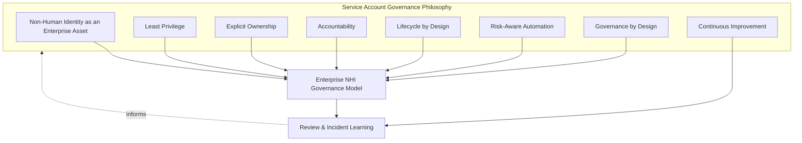
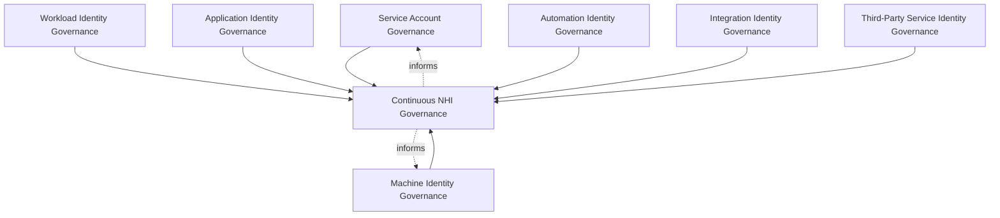
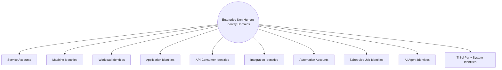
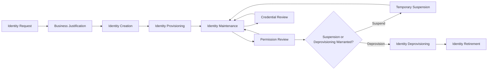
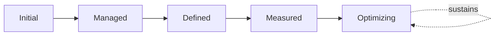
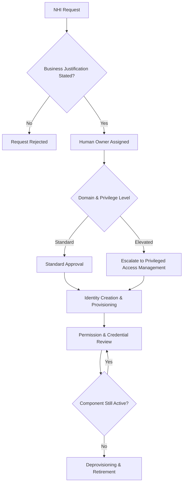

# Enterprise Service Accounts & Non-Human Identity Governance Strategy

## 1. Document Purpose

This document defines the official Enterprise Service Accounts & Non-Human Identity (NHI) Governance Strategy for **StackLeo Tech Store**. It establishes dedicated governance for every identity that is not a human being — service accounts, machine identities, workload identities, automation, and AI agents — independent of any specific IAM vendor, secrets manager, cloud provider, Kubernetes platform, CI/CD platform, or container technology.

Service Identity Governance and Machine Identity Governance are referenced across every IAM document in `06_Security` — `identity-access-management.md` (Section 3.6), `authentication-strategy.md` (Sections 3.5–3.6), `authorization-model.md` (Section 3.5), and `identity-lifecycle-management.md` (Sections 3.5–3.6) — each pointing here for the full treatment. Non-human identities warrant this dedicated document because they now typically outnumber human identities on any modern platform, are frequently granted broad access as a convenient shortcut, and are far more easily forgotten once created, making them a distinct and growing governance concern in their own right.

- **Purpose of Non-Human Identity Governance** — to ensure every service account, machine identity, and automated actor is governed with the same deliberate rigor as a human identity, preventing the platform's growing population of non-human identities from becoming an unaccounted-for, ungoverned source of risk.
- **Relationship with Identity & Access Management** — this document is the dedicated elaboration of Service Identity Governance in `identity-access-management.md` (Section 3.6); every principle in that framework applies here, adapted to the specific characteristics of non-human identities.
- **Relationship with Authentication** — non-human identities are verified under Service and Machine Authentication in `authentication-strategy.md` (Sections 3.5–3.6); this document governs the broader lifecycle and ownership those verification mechanisms depend on.
- **Relationship with Authorization** — non-human permission decisions are governed under Service Authorization Governance in `authorization-model.md` (Section 3.5); this document defines the dedicated domains and lifecycle those decisions are subject to.
- **Relationship with Privileged Access Management** — where a non-human identity holds elevated capability, it is governed jointly with `privileged-access-management.md` (Section 3.5, Service Privilege Governance), applying PAM's heightened rigor to the specific case of privileged automation.
- **Relationship with Zero Trust** — non-human identities are verified under the same "never trust, always verify" posture as human ones, consistent with `zero-trust-strategy.md`; a machine's location or network origin is never a substitute for genuine identity verification.
- **Relationship with Enterprise Security Governance** — this document operates within the broader governance model and executive accountability established in `security-governance.md`, applying it to a category of identity that is easy to overlook precisely because it never asks for anything, never complains, and rarely leaves.

This document is implementation-independent and vendor-neutral. It defines NHI governance philosophy, model, domains, and lifecycle conceptually — not specific IAM vendors, secrets managers, cloud providers, Kubernetes platforms, CI/CD platforms, container technologies, identity providers, security products, credential formats, authentication protocols, token types, certificate mechanisms, workload identity implementations, infrastructure configurations, deployment architectures, or implementation workflows.

## 2. Service Account Governance Philosophy

Non-human identity governance at StackLeo is built on eight principles. Each exists to produce a specific business outcome — non-human identity is governed deliberately because it is easily overlooked, not because it is inherently less consequential than human identity.

### 2.1 Non-Human Identity as an Enterprise Asset

Every service account, machine identity, and automated actor is treated as a deliberately managed enterprise asset, exactly as a human identity would be, consistent with `identity-lifecycle-management.md` (Section 2.1).

- **Business Value** — ensures the organization always knows what non-human identities exist and why, preventing an unaccounted-for population from silently accumulating.

### 2.2 Least Privilege

Every non-human identity is granted only the access its defined, specific purpose genuinely requires, never broadened as a convenient shortcut.

- **Business Value** — limits the blast radius of any single compromised non-human identity, which is often granted broad access precisely because no one is watching it closely.

### 2.3 Explicit Ownership

Every non-human identity has a single, named human owner accountable for its continued justification, since the identity itself cannot advocate for or report on its own status.

- **Business Value** — prevents the anti-pattern in Section 10.4, where a non-human identity's ownership becomes unknown as the individual who created it moves on or forgets.

### 2.4 Accountability

Every action taken by a non-human identity traces back to that specific identity, and every identity traces back to its accountable owner.

- **Business Value** — ensures automated or machine-driven actions remain attributable and investigable, exactly as a human action would be.

### 2.5 Lifecycle by Design

Non-human identity lifecycle governance is established deliberately as the identity is created, not retrofitted once an orphaned or forgotten identity has already accumulated risk.

- **Business Value** — prevents the costly, high-visibility discovery of non-human identity governance gaps only after an incident has already demonstrated their absence.

### 2.6 Risk-Aware Automation

Non-human identity governance decisions weigh the genuine business impact of automation and machine-to-machine interaction, consistent with ISO 31000 thinking, rather than treating automation as inherently low-risk simply because no human directly acts.

- **Business Value** — directs governance attention proportionately, since automated actors can often cause harm faster and at greater scale than a human ever could.

### 2.7 Governance by Design

Non-human identity governance structures are established deliberately as automation and integration capability is built, not retrofitted once identity sprawl has already emerged.

- **Business Value** — prevents the costly rework of introducing NHI governance only after an unmanageable population has already accumulated.

### 2.8 Continuous Improvement

Non-human identity governance practice matures over time, informed by real review findings, incidents, and the organization's growth in automation and infrastructure complexity.

- **Business Value** — keeps NHI governance aligned with StackLeo's growth in automation, integrations, and machine-to-machine communication.

*Diagram: Service Account Governance Philosophy Overview — the eight principles shape the enterprise NHI governance model, and review and incident learning feed back into the philosophy itself.*

## 3. Enterprise Non-Human Identity Governance Model

NHI governance operates across eight conceptual layers, each holding accountability for a distinct category of non-human identity.

### 3.1 Service Account Governance

- **Purpose** — own the coherence of application-level service accounts used for internal component interaction.
- **Governance Scope** — coordinated with Service Identity Governance in `identity-access-management.md` (Section 3.6).
- **Business Value** — protects internal service-to-service communication from unauthorized or unreviewed access accumulation.
- **Executive Expectations** — leadership expects service accounts to be inventoried and reviewed with the same rigor as human accounts.

### 3.2 Machine Identity Governance

- **Purpose** — own the coherence of identities representing devices, workloads, and infrastructure components.
- **Governance Scope** — distinct from service accounts in representing infrastructure-level rather than application-level actors.
- **Business Value** — protects the infrastructure layer from unauthorized machine-to-machine interaction.
- **Executive Expectations** — leadership expects machine identity governance to scale consistently as infrastructure grows.

### 3.3 Workload Identity Governance

- **Purpose** — own the coherence of identities representing running application workloads, distinct from the static infrastructure they run on.
- **Governance Scope** — coordinated with Machine Identity Governance (Section 3.2), reflecting the dynamic, often short-lived nature of workload identity.
- **Business Value** — protects against the specific risk of workload identity persisting beyond the workload's actual runtime.
- **Executive Expectations** — leadership expects workload identity lifecycle to track actual workload deployment and teardown.

### 3.4 Application Identity Governance

- **Purpose** — own the coherence of identities representing entire application components, distinct from the individual service accounts within them.
- **Governance Scope** — coordinated with Application Security Standards in `security-standards.md` (Section 3.3).
- **Business Value** — provides a coherent identity for an application as a whole, supporting clearer accountability at the component level.
- **Executive Expectations** — leadership expects application identity to be clearly mapped to the application it represents in `service-catalog.md` equivalents.

### 3.5 Automation Identity Governance

- **Purpose** — own the coherence of identities representing automated processes, scheduled jobs, and scripted actions.
- **Governance Scope** — oversight of Automation Accounts and Scheduled Job Identities (Sections 4.7–4.8).
- **Business Value** — prevents automation identities from being granted broad, standing access as a shortcut to avoid configuring precise scope.
- **Executive Expectations** — leadership expects automation identity permission to be scoped to the specific task automated.

### 3.6 Integration Identity Governance

- **Purpose** — own the coherence of identities representing connections between StackLeo's platform and external systems.
- **Governance Scope** — oversight of Integration Identities and API Consumer Identities (Sections 4.5–4.6), coordinated with `05_API/api-security.md`.
- **Business Value** — protects the integration points multiple channels and partners depend on simultaneously.
- **Executive Expectations** — leadership expects integration identities to be reviewed whenever an integration relationship changes.

### 3.7 Third-Party Service Identity Governance

- **Purpose** — own the coherence of non-human identities representing external systems StackLeo does not directly control.
- **Governance Scope** — coordinated with Third-Party Authorization Governance in `authorization-model.md` (Section 3.6) and Vendor Identity Governance in `identity-lifecycle-management.md` (Section 3.4).
- **Business Value** — protects against risk introduced by automated systems outside StackLeo's direct organizational control.
- **Executive Expectations** — leadership expects third-party service identity trust to be reviewed before extension, not assumed.

### 3.8 Continuous NHI Governance

- **Purpose** — govern the mechanism by which every other layer in this model matures over time.
- **Governance Scope** — consolidates findings from Permission and Credential Review (Sections 5.6–5.7) and executive oversight (Section 7).
- **Business Value** — prevents NHI governance itself from becoming the next thing that quietly stagnates as automation grows.
- **Executive Expectations** — leadership expects NHI maturity to be assessed periodically, not assumed static once established.

### NHI Governance Model Matrix

| Layer | Purpose | Business Value | Executive Expectations |
|---|---|---|---|
| Service Account Governance | Own coherence of application-level service accounts | Protects internal communication from unreviewed access | Same rigor as human accounts |
| Machine Identity Governance | Own coherence of device/workload/infrastructure identities | Protects infrastructure from unauthorized machine interaction | Scales consistently as infrastructure grows |
| Workload Identity Governance | Own coherence of running application workload identities | Protects against identity outliving actual workload runtime | Lifecycle tracks actual deployment and teardown |
| Application Identity Governance | Own coherence of whole-application-component identities | Provides clearer accountability at the component level | Clearly mapped to the application it represents |
| Automation Identity Governance | Own coherence of automated process/scheduled job identities | Prevents broad access granted as a scoping shortcut | Permission scoped to the specific automated task |
| Integration Identity Governance | Own coherence of platform-to-external-system connections | Protects integration points multiple parties depend on | Reviewed whenever an integration relationship changes |
| Third-Party Service Identity Governance | Own coherence of external, uncontrolled system identities | Protects against risk from automated systems outside control | Trust reviewed before extension, never assumed |
| Continuous NHI Governance | Govern maturation of every other layer | Prevents governance itself from stagnating | Maturity assessed periodically |

*Diagram 1: Enterprise Non-Human Identity Governance Framework — seven domain-specific governance layers feed continuous NHI governance, which in turn informs the ongoing practice of every domain.*

## 4. Enterprise Non-Human Identity Domains

Non-human identity is organized across ten conceptual domains, each requiring a somewhat different governance emphasis.

### 4.1 Service Accounts

- **Purpose** — represent application components interacting with one another internally, per Section 3.1.
- **Governance Scope** — inventoried and reviewed alongside the application components they belong to.
- **Business Importance** — protects internal service-to-service communication from unauthorized impersonation.
- **Executive Expectations** — leadership expects a complete, current inventory of every service account.

### 4.2 Machine Identities

- **Purpose** — represent devices, workloads, and infrastructure components, per Section 3.2.
- **Governance Scope** — coordinated with infrastructure provisioning and decommissioning events.
- **Business Importance** — protects the infrastructure layer from unauthorized machine-level action.
- **Executive Expectations** — leadership expects machine identity governance to be anticipated as infrastructure scales.

### 4.3 Workload Identities

- **Purpose** — represent running application workloads, distinct from the infrastructure hosting them, per Section 3.3.
- **Governance Scope** — reflects the often short-lived, dynamic nature of workload existence.
- **Business Importance** — protects against a class of identity most likely to be forgotten given its typically ephemeral nature.
- **Executive Expectations** — leadership expects workload identity governance to keep pace with dynamic scaling.

### 4.4 Application Identities

- **Purpose** — represent an application component as a coherent whole, per Section 3.4.
- **Governance Scope** — coordinated with `03_System_Design/component-architecture.md`.
- **Business Importance** — provides a clear, single identity accountable at the component level.
- **Executive Expectations** — leadership expects every significant application component to have a corresponding governed identity.

### 4.5 API Consumer Identities

- **Purpose** — represent clients consuming StackLeo's APIs, coordinated with `05_API/authentication.md`.
- **Governance Scope** — governed under Integration Identity Governance (Section 3.6).
- **Business Importance** — protects every current and future channel simultaneously, since compromised API consumer identity affects all consumers of it at once.
- **Executive Expectations** — leadership expects API consumer identity governance to scale as channels multiply.

### 4.6 Integration Identities

- **Purpose** — represent connections between StackLeo's platform and external systems — payment, courier, communication providers.
- **Governance Scope** — governed under Integration Identity Governance (Section 3.6), coordinated with `05_API/api-security.md`.
- **Business Importance** — protects the integrations the commerce experience directly depends on.
- **Executive Expectations** — leadership expects integration identities to be reviewed as partner relationships evolve.

### 4.7 Automation Accounts

- **Purpose** — represent scripted or automated processes performing defined tasks without direct human initiation.
- **Governance Scope** — governed under Automation Identity Governance (Section 3.5).
- **Business Importance** — prevents automation from becoming an ungoverned, broadly-privileged shortcut.
- **Executive Expectations** — leadership expects automation account scope to match the specific task it performs.

### 4.8 Scheduled Job Identities

- **Purpose** — represent recurring, time-triggered processes distinct from event-driven automation.
- **Governance Scope** — governed under Automation Identity Governance (Section 3.5).
- **Business Importance** — protects against scheduled processes accumulating access beyond their defined, recurring purpose.
- **Executive Expectations** — leadership expects scheduled job identities to be reviewed alongside the business process they support.

### 4.9 AI Agent Identities

- **Purpose** — represent AI-assisted or autonomous agents acting on the platform's behalf.
- **Governance Scope** — governed under the same rigor as any other automation identity, per Risk-Aware Automation (Section 2.6), without prescribing any specific AI implementation.
- **Business Importance** — protects against the emerging risk of AI-driven action taken without a clearly attributable, accountable identity behind it.
- **Executive Expectations** — leadership expects AI agent identity governance to be established before, not after, AI capability is deployed.

### 4.10 Third-Party System Identities

- **Purpose** — represent external systems StackLeo does not directly control but exchanges data or capability with.
- **Governance Scope** — governed under Third-Party Service Identity Governance (Section 3.7).
- **Business Importance** — protects against risk introduced by automated systems outside StackLeo's direct organizational control.
- **Executive Expectations** — leadership expects third-party system identity trust to be reviewed before extension, not assumed.

### Enterprise Non-Human Identity Domain Matrix

| Domain | Purpose | Business Importance | Executive Expectations |
|---|---|---|---|
| Service Accounts | Represent internal application components interacting | Protects internal communication from unauthorized impersonation | Complete, current inventory of every account |
| Machine Identities | Represent devices, workloads, infrastructure components | Protects infrastructure from unauthorized machine action | Governance anticipated as infrastructure scales |
| Workload Identities | Represent running application workloads | Protects against a class of identity most likely forgotten | Governance keeps pace with dynamic scaling |
| Application Identities | Represent an application component as a coherent whole | Provides clear, single accountability at the component level | Every significant component has a governed identity |
| API Consumer Identities | Represent clients consuming StackLeo's APIs | Protects every current/future channel simultaneously | Governance scales as channels multiply |
| Integration Identities | Represent connections to external systems | Protects integrations commerce directly depends on | Reviewed as partner relationships evolve |
| Automation Accounts | Represent scripted/automated task processes | Prevents automation becoming an ungoverned shortcut | Scope matches the specific task performed |
| Scheduled Job Identities | Represent recurring, time-triggered processes | Protects against access beyond defined, recurring purpose | Reviewed alongside the business process supported |
| AI Agent Identities | Represent AI-assisted/autonomous platform agents | Protects against unattributable AI-driven action | Governance established before AI capability deployment |
| Third-Party System Identities | Represent external, uncontrolled system connections | Protects against risk from automated systems outside control | Trust reviewed before extension, never assumed |

*Diagram 3: Service Account & Machine Identity Governance Model (domain view) — ten domains, each requiring a governance emphasis proportionate to its scope and business role.*

## 5. Non-Human Identity Lifecycle

Non-human identity is governed across ten conceptual lifecycle stages, applying the general Identity Lifecycle in `identity-lifecycle-management.md` (Section 5) with adaptations specific to non-human characteristics.

### 5.1 Identity Request

- **Purpose** — formally initiate the creation of a new non-human identity with a stated technical and business purpose.
- **Governance Objectives** — require every request to identify the specific domain (Section 4) and the human owner who will be accountable for it.
- **Business Value** — ensures non-human identity creation is deliberate, not an incidental byproduct of technical setup.

### 5.2 Business Justification

- **Purpose** — state the genuine business or technical need the non-human identity would fulfill.
- **Governance Objectives** — require justification to reference the specific application, integration, or process the identity supports.
- **Business Value** — ensures non-human identity exists only where it demonstrably serves a genuine purpose.

### 5.3 Identity Creation

- **Purpose** — formally instantiate the requested non-human identity as a distinct, recognized, and owned record.
- **Governance Objectives** — require creation to produce a uniquely identifiable identity with an assigned human owner, consistent with Explicit Ownership (Section 2.3).
- **Business Value** — establishes the non-human identity as a managed enterprise asset from its very first moment of existence.

### 5.4 Identity Provisioning

- **Purpose** — establish the identity's initial access, scoped to the specific purpose stated in Section 5.2.
- **Governance Objectives** — require initial access to be scoped to genuine, stated need, consistent with Least Privilege (Section 2.2).
- **Business Value** — ensures every non-human identity begins with only the access its purpose genuinely requires.

### 5.5 Identity Maintenance

- **Purpose** — keep the identity's records current as the application, workload, or integration it represents evolves.
- **Governance Objectives** — require maintenance to be triggered by genuine change events in the underlying technical component.
- **Business Value** — ensures identity records remain an accurate reflection of the current technical reality.

### 5.6 Permission Review

- **Purpose** — formally reassess whether the identity's granted access remains genuinely justified.
- **Governance Objectives** — require review to occur on a predictable, regular cadence, proportionate to the identity's domain and privilege level.
- **Business Value** — catches unjustified or excessive non-human permission before it becomes a genuine risk.

### 5.7 Credential Review

- **Purpose** — formally reassess whether the identity's authentication credentials remain appropriate and current.
- **Governance Objectives** — coordinate with Service and Machine Authentication in `authentication-strategy.md` (Sections 3.5–3.6), without prescribing specific credential mechanisms.
- **Business Value** — prevents non-human credentials from becoming stale or inappropriately long-lived.

### 5.8 Temporary Suspension

- **Purpose** — deliberately and reversibly disable a non-human identity without fully removing it, where circumstance warrants.
- **Governance Objectives** — require suspension to be a distinct, recorded state, never conflated with full deprovisioning.
- **Business Value** — provides a proportionate response to circumstances (investigation, temporary component pause) that do not yet warrant full removal.

### 5.9 Identity Deprovisioning

- **Purpose** — formally remove a non-human identity's active state once the component, integration, or process it represents is retired.
- **Governance Objectives** — require deprovisioning to be triggered promptly by the relevant technical decommissioning event.
- **Business Value** — prevents the single most common source of non-human identity risk: an identity that outlives the component it represented.

### 5.10 Identity Retirement

- **Purpose** — formally and finally remove the non-human identity's records once no longer needed for audit or historical purposes.
- **Governance Objectives** — coordinate with Identity Retirement in `identity-lifecycle-management.md` (Section 5.11).
- **Business Value** — prevents indefinite accumulation of non-human identity records no longer serving any genuine purpose.

### Non-Human Identity Lifecycle Matrix

| Stage | Purpose | Governance Objective | Business Value |
|---|---|---|---|
| Identity Request | Formally initiate creation with stated purpose | Identifies domain and accountable human owner | Ensures creation is deliberate, not incidental |
| Business Justification | State the genuine business/technical need | References the specific supported component | Ensures identity exists only where it demonstrably serves purpose |
| Identity Creation | Formally instantiate the identity | Produces a uniquely identifiable, owned record | Establishes the identity as a managed asset from inception |
| Identity Provisioning | Establish initial, purpose-scoped access | Scoped to genuine, stated need | Every identity begins with only access its purpose requires |
| Identity Maintenance | Keep records current as the component evolves | Triggered by genuine technical change events | Keeps records an accurate reflection of technical reality |
| Permission Review | Reassess whether access remains justified | Predictable cadence, proportionate to privilege level | Catches unjustified/excessive permission before it becomes risk |
| Credential Review | Reassess whether credentials remain appropriate | Coordinated with authentication governance | Prevents credentials becoming stale or inappropriately long-lived |
| Temporary Suspension | Deliberately, reversibly disable without removal | A distinct, recorded state | Provides proportionate response short of full removal |
| Identity Deprovisioning | Remove active state once component is retired | Triggered promptly by decommissioning event | Prevents identity outliving the component it represented |
| Identity Retirement | Finally remove records once no longer needed | Coordinated with broader identity retirement practice | Prevents indefinite accumulation of unneeded records |

*Diagram 2: Non-Human Identity Lifecycle — an identity proceeds from request and justification through creation and provisioning into ongoing maintenance and dual permission/credential review, with suspension, deprovisioning, and retirement handling its eventual, deliberate wind-down.*

## 6. Governance Principles

- **Explicit Ownership** — every non-human identity has a single, named human owner, consistent with Section 2.3.
- **Least Privilege** — access is scoped to the minimum necessary for the identity's specific, defined purpose, consistent with Section 2.2.
- **Accountability** — every non-human action traces back to its specific identity, and every identity traces back to its accountable owner.
- **Traceability** — every non-human identity's complete history — creation, permission changes, credential changes — can be reconstructed after the fact.
- **Auditability** — non-human identity governance decisions and their outcomes can be independently reviewed, supporting ISO/IEC 27001-aligned assurance.
- **Risk Awareness** — governance decisions are made with explicit awareness of the disproportionate scale and speed at which non-human identity compromise can cause harm.
- **Business Alignment** — non-human identities exist only where they serve a genuine, current business or technical need.
- **Continuous Improvement** — NHI governance practice matures over time, informed by real review findings and incidents.

### Governance Principles Matrix

| Principle | Description | Business Value |
|---|---|---|
| Explicit Ownership | Every identity has a single, named human owner | Prevents ownership becoming unknown over time |
| Least Privilege | Access scoped to the specific, defined purpose | Limits blast radius of any single compromised identity |
| Accountability | Every action traces to its identity and owner | Ensures automated actions remain attributable |
| Traceability | Complete history can be reconstructed | Enables defensible, evidence-based governance decisions |
| Auditability | Decisions and outcomes independently reviewable | Supports ISO/IEC 27001-aligned assurance and audit confidence |
| Risk Awareness | Decisions made with awareness of automation-scale risk | Ensures scrutiny matches the genuine speed and scale of harm |
| Business Alignment | Identities exist only where genuinely needed | Prevents identity sprawl disconnected from real purpose |
| Continuous Improvement | Governance matures from real review findings | Keeps NHI governance aligned with organizational growth |

## 7. Executive Oversight

- **NHI Governance Reviews** — the overall coherence of non-human identity governance across every domain (Section 4) is formally reviewed on a regular cadence, consistent with `identity-access-management.md` (Section 7).
- **Executive Reporting** — aggregated NHI health — total non-human identity count, orphaned identity findings, permission review completion — is reported to executive leadership, coordinated with `09_Operations/operations-metrics-kpis.md`.
- **Risk Reviews** — non-human identity risk from `security-risk-management.md` (Section 4) is reviewed as a distinct, growing category, not folded indistinctly into broader identity risk.
- **Compliance Reviews** — NHI practice is reviewed against applicable regulatory and contractual obligations, coordinated with `compliance.md`.
- **Documentation Governance** — this framework's relationship to `identity-access-management.md`, `authentication-strategy.md`, `authorization-model.md`, and `privileged-access-management.md` is kept current as those documents evolve.
- **Audit Readiness** — NHI governance decisions, reviews, and their outcomes are maintained in a state ready for internal or external audit at any time.

### Executive Oversight Matrix

| Oversight Mechanism | Purpose | Governance Role |
|---|---|---|
| NHI Governance Reviews | Confirm overall governance coherence across domains | Regular, predictable cadence for the framework as a whole |
| Executive Reporting | Provide leadership a single, coherent NHI picture | Coordinated with enterprise operational KPI reporting |
| Risk Reviews | Review NHI risk as a distinct, growing category | Not folded indistinctly into broader identity risk |
| Compliance Reviews | Confirm alignment with regulatory/contractual obligations | Reviewed jointly with `compliance.md` |
| Documentation Governance | Keep this framework's subordinate relationships current | Updated as IAM, authentication, authorization, PAM docs evolve |
| Audit Readiness | Maintain decisions and reviews ready for independent review | Continuous state, not preparation-triggered |

### Governance Responsibility Matrix

| Role | Responsibility |
|---|---|
| CISO | Owns coherence and enforcement of this NHI strategy, in partnership with Security and Executive leadership. |
| NHI Governance Lead | Owns the governance model (Section 3) and lifecycle (Section 5) across every non-human domain. |
| Engineering Leads | Own Service Account, Workload, and Application Identity Governance (Sections 3.1, 3.3–3.4) within their domain. |
| Infrastructure Lead | Owns Machine Identity Governance (Section 3.2) for devices and infrastructure components. |
| Integration / API Lead | Owns Integration Identity Governance (Section 3.6), coordinated with `05_API/api-security.md`. |
| Automation Lead | Owns Automation Identity Governance (Section 3.5), including AI Agent Identities (Section 4.9). |
| Executive Leadership | Reviews significant NHI risk findings and overall governance health. |
| Internal Audit / Review Function | Independently verifies that NHI governance records reflect actual practice. |

## 8. Future Readiness

This framework is designed to remain valid as StackLeo evolves in scale and architectural complexity, without requiring redefinition of its underlying philosophy.

- **Cloud-Native Platforms** — Machine and Workload Identity Governance (Sections 3.2–3.3) are defined independently of any specific runtime or cloud provider, so they apply unchanged as infrastructure evolves.
- **Kubernetes & Container Ecosystems** — Workload Identity Governance (Section 3.3) is structured to absorb the dynamic, ephemeral identity patterns common to containerized and orchestrated workloads, without prescribing any specific orchestration platform.
- **AI Agents** — AI Agent Identities (Section 4.9) are governed under the same Explicit Ownership and Risk-Aware Automation principles (Sections 2.3, 2.6) as any other automation identity, established ahead of AI capability deployment rather than after.
- **Autonomous Systems** — as increasingly autonomous decision-making capability is introduced, Accountability (Section 6) ensures every autonomous action remains traceable to a specific identity and human owner.
- **Multi-Tenant Platforms** — where future architecture introduces tenant isolation, Integration and Third-Party Service Identity Governance (Sections 3.6–3.7) extend to explicitly address per-tenant non-human identity boundaries.
- **Global Expansion** — Third-Party Service Identity Governance (Section 3.7) extends to accommodate a growing set of regional integrations as StackLeo expands into new markets.
- **Enterprise Scale** — the governance model, domains, and lifecycle defined in Sections 3–5 are defined independently of organizational size or infrastructure scale, so they remain coherent as the non-human identity population grows substantially.
- **Increasing Machine-to-Machine Communication** — as the platform's architecture grows more distributed, Machine and Workload Identity Governance (Sections 3.2–3.3) are structured to absorb a growing volume of machine-to-machine interaction without requiring the underlying governance model to be redesigned.

## 9. Non-Human Identity Maturity Model

NHI governance maturity is described across five conceptual levels, adapted from established process maturity thinking and consistent with NIST Cybersecurity Framework tiers.

- **Initial** — non-human identity, where governed at all, is informal and inconsistent; service accounts are often shared, ownership is unknown, and identities persist indefinitely after the component they served is retired.
- **Managed** — basic governance exists for individual non-human domains, but consistency across the ten domains in Section 4 varies significantly.
- **Defined** — the governance model, domains, and lifecycle are standardized, documented, and consistently applied across the organization, consistent with the model defined throughout this document; ownership is clear organization-wide.
- **Measured** — non-human identity population, orphan rate, and review completion are measured systematically, and decisions are grounded in genuine evidence rather than qualitative impression alone.
- **Optimizing** — NHI governance is continuously and deliberately improved based on quantitative evidence and organizational learning; improvement itself is a managed, ongoing discipline rather than an occasional initiative.

### Non-Human Identity Maturity Model Matrix

| Level | Characteristics | Primary Focus |
|---|---|---|
| Initial | Informal, inconsistent governance; shared accounts, unknown ownership | Ad hoc, individually-dependent NHI practice |
| Managed | Basic governance exists per domain; consistency varies | Domain-level consistency |
| Defined | Standardized governance model, domains, and lifecycle | Organization-wide consistency and clear ownership |
| Measured | Population, orphan rate, and review completion measured | Evidence-based NHI governance decisions |
| Optimizing | Practice continuously and deliberately improved from evidence | Sustained, deliberate improvement as a discipline |

*Diagram 6: Non-Human Identity Maturity Progression Model — maturity advances from informal, unknown-ownership practice toward standardized, measured, and continuously optimized non-human identity governance.*

*Diagram 4: Non-Human Identity Governance Decision Flow — a request is justified and assigned a human owner, escalated to PAM governance where privilege is elevated, provisioned, and subject to recurring dual permission and credential review until the underlying component is retired.*

*Diagram 5: Continuous NHI Improvement Cycle — non-human identity population health and review outcomes are measured, learned from, improved upon, and standardized back into practice, on a continuing basis.*

## 10. Anti-Patterns

The following recurring failure patterns are explicitly recognized and avoided, as each one structurally undermines this strategy.

| Anti-Pattern | Why It's Avoided |
|---|---|
| Orphaned Service Accounts | Contradicts Explicit Ownership (Section 2.3); an account with no accountable owner persists as an unaccounted-for, ungoverned risk. |
| Shared Service Accounts | Contradicts Accountability (Section 2.4); a shared non-human identity makes it impossible to attribute a specific action to its true originating component. |
| Excessive Permissions | Contradicts Least Privilege (Section 2.2); non-human identities are frequently granted broad access as a shortcut, multiplying the consequence of compromise. |
| Unknown Ownership | Contradicts Explicit Ownership (Section 2.3); ownership that becomes unknown over time leaves no one accountable for the identity's continued justification. |
| Long-Lived Identities | Contradicts Identity Deprovisioning (Section 5.9); a non-human identity that outlives the component it represented accumulates unjustified, unreviewed risk. |
| Weak Documentation | Undermines Documentation Governance (Section 7) and Traceability (Section 6), leaving non-human identity records unclear or unverifiable after the fact. |
| Weak Governance | Undermines Section 3; without clear ownership and review across every domain, non-human identity practice drifts into inconsistency as automation grows. |
| Missing Continuous Improvement | Contradicts Continuous Improvement (Section 2.8, Section 3.8); without deliberate improvement, NHI governance stagnates as automation and machine-to-machine communication continue to grow. |

## 11. Document Information

| Property | Value |
|----------|-------|
| Document | service-accounts-management.md |
| Version | 1.0.0 |
| Status | Active |
| Maintained By | StackLeo |
| Last Updated | 2026-07-24 |

---

© StackLeo. All Rights Reserved.
