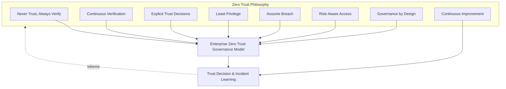
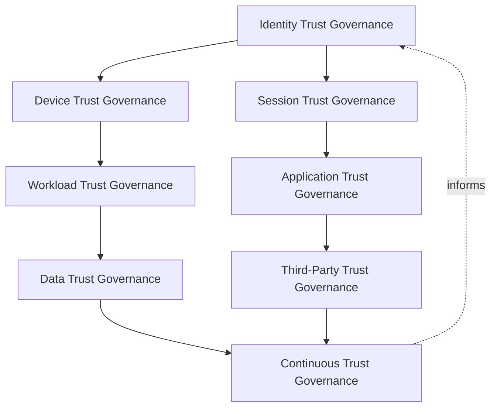
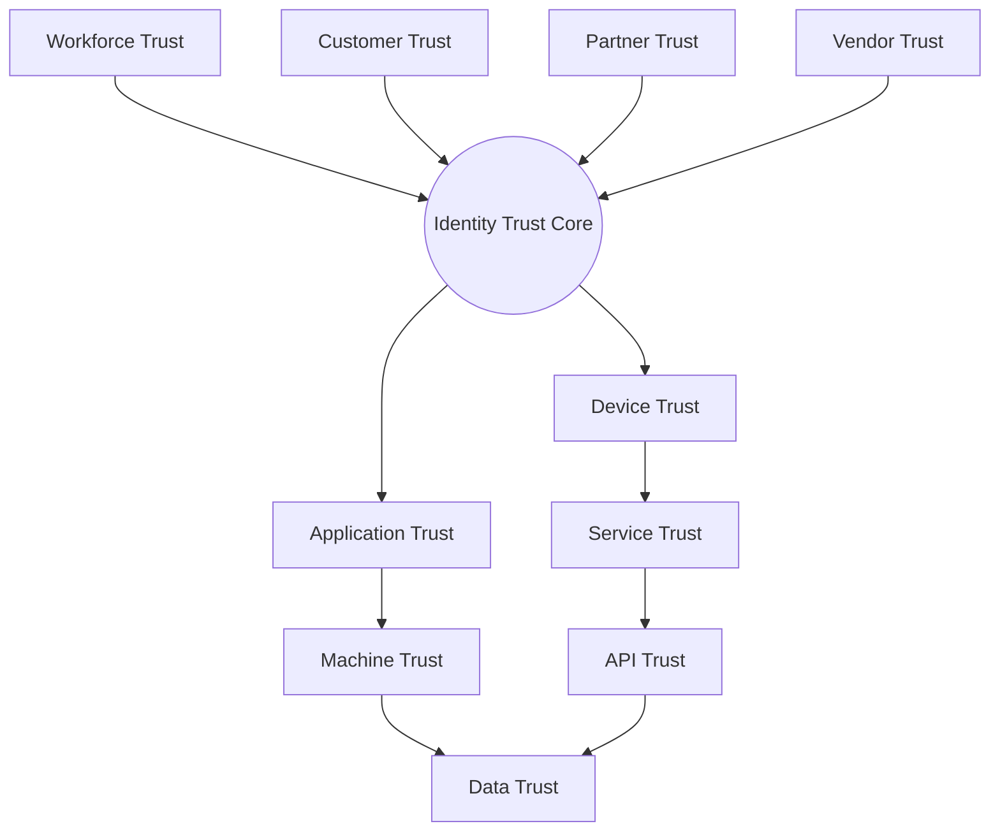
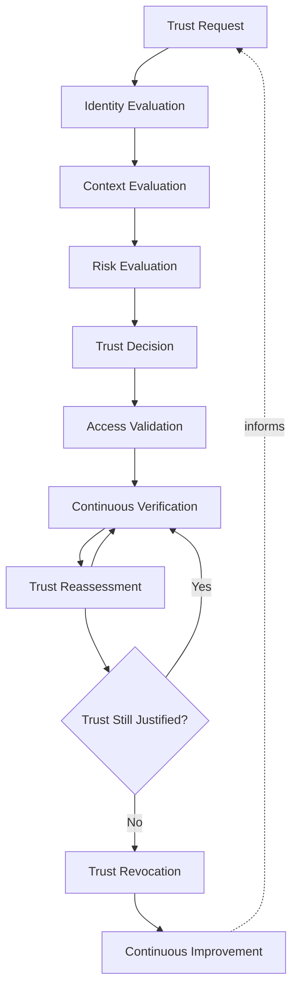
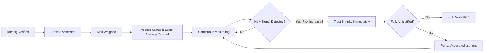
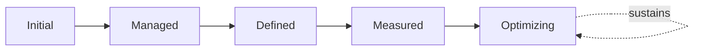
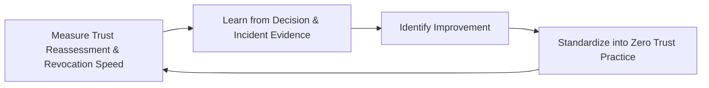

# Zero Trust Strategy

## 1. Document Purpose

This document defines StackLeo's official Enterprise Zero Trust Architecture Strategy — the philosophy, governance model, trust domains, and trust decision lifecycle through which the Zero Trust Mindset introduced in `security-principles.md` (Section 4) is elaborated into a coherent, organization-wide, NIST SP 800-207-aligned approach to how trust is established, evaluated, and continuously re-verified.

- **Purpose of Zero Trust** — to ensure that no request, actor, device, or prior authentication event is trusted implicitly anywhere on the platform, so that a compromise in one place cannot silently extend into trust everywhere else.
- **Relationship with Security Governance** — this document is the dedicated Zero Trust deep-dive operating within the broader governance model and executive accountability established in `security-governance.md`, elaborating its Trust by Design principle (Section 2.2) into a complete architecture.
- **Relationship with Identity & Access Management** — this document is inseparable from `identity-access-management.md`; identity establishes and governs *who* an actor is across its lifecycle, while this document governs *how much* that identity, and every other signal accompanying a request, is trusted at any given moment.
- **Relationship with Authentication** — `authentication-strategy.md` verifies claimed identity; this document defines how that verification feeds into a broader trust evaluation that also weighs device, context, and behavior, never treating authentication alone as sufficient trust.
- **Relationship with Authorization** — `authorization-model.md` governs what a verified, trusted identity may do; this document governs whether that identity should be trusted at all in the current moment, a prerequisite evaluation authorization depends on.
- **Relationship with Enterprise Architecture** — this document does not redefine the platform's broader security architecture; it elaborates the trust dimension of `security-architecture.md`, ensuring architectural decisions remain consistent with Zero Trust principles.
- **Relationship with Risk Management** — Zero Trust is a direct, proportionate response to the risk of operating a multi-channel, expanding platform where trust cannot reasonably be anchored to network location or organizational boundary alone, consistent with `security-risk-management.md`.

This document is implementation-independent and vendor-neutral. It defines Zero Trust philosophy, governance model, trust domains, and lifecycle conceptually — not specific Zero Trust vendors, IAM vendors, endpoint platforms, cloud providers, networking vendors, security products, authentication protocols, authorization models, network segmentation, infrastructure configurations, deployment architectures, or implementation workflows.

## 2. Zero Trust Philosophy

Eight principles, elaborating the Zero Trust Mindset established in `security-principles.md`, govern this strategy. Each exists to produce a specific business outcome.

### 2.1 Never Trust, Always Verify

Every request is evaluated on its own merits at the point of access, regardless of its origin or what trusted it previously.

- **Business Value** — removes reliance on a fixed, defensible perimeter across web, and future mobile, physical store, and POS channels.

### 2.2 Continuous Verification

Trust, once granted, is never treated as permanent; it is re-evaluated as conditions change throughout the life of a session or relationship.

- **Business Value** — closes the gap a one-time check leaves open for the remainder of a session, protecting against post-authentication compromise.

### 2.3 Explicit Trust Decisions

Trust is established through deliberate evaluation of identity, device, and context, never inferred from convenience or prior relationship.

- **Business Value** — makes trust decisions defensible and auditable rather than assumed, supporting ISO/IEC 27001-aligned assurance.

### 2.4 Least Privilege

Every actor and system is granted only the access its defined responsibility requires, and nothing more.

- **Business Value** — limits the damage a compromised account, credential, or workload can cause.

### 2.5 Assume Breach

The platform is designed as though a compromise has already occurred somewhere within it, limiting what any single compromised point can reach.

- **Business Value** — bounds the impact of a breach that prevention alone cannot guarantee will never happen.

### 2.6 Risk-Aware Access

The strength of verification and the scope of access granted scale with the sensitivity and potential business impact of the action requested, consistent with ISO 31000 thinking.

- **Business Value** — directs finite verification friction toward the actions that carry genuine consequence, rather than applying uniform scrutiny regardless of stakes.

### 2.7 Governance by Design

Trust evaluation is considered from the point a capability is conceived, and Zero Trust governance structures are established deliberately, not layered on or retrofitted after the fact.

- **Business Value** — makes secure-by-default the natural, lowest-friction outcome rather than a costly retrofit once gaps have already emerged.

### 2.8 Continuous Improvement

Zero Trust practice itself matures over time, informed by real trust decisions, incidents, and the evolving threat landscape.

- **Business Value** — keeps trust evaluation aligned with genuine, current risk rather than a static assumption fixed at initial design.

*Diagram 1: Enterprise Zero Trust Governance Framework — the eight principles shape the enterprise Zero Trust governance model, and trust decision and incident learning feed back into the philosophy itself.*

## 3. Enterprise Zero Trust Governance Model

Zero Trust governance operates across eight conceptual layers, each holding accountability for a distinct dimension of trust.

### 3.1 Identity Trust Governance

- **Purpose** — own the coherence of trust evaluation applied to human and system identity.
- **Governance Scope** — coordinated with `identity-access-management.md` and `authentication-strategy.md`; the foundational layer every other layer partially depends on.
- **Business Value** — makes every downstream trust decision meaningful, since identity trust underpins device, session, and application trust alike.
- **Executive Expectations** — leadership trusts identity verification never falls below the rigor Section 2.3 requires.

### 3.2 Device Trust Governance

- **Purpose** — own the coherence of trust evaluation applied to the device through which a request is made.
- **Governance Scope** — spans customer devices across web and future mobile and POS channels, and staff and administrative devices; the full dedicated governance model, domains, and lifecycle are elaborated in `device-trust.md`.
- **Business Value** — accounts for the risk of a compromised or unmanaged device acting on behalf of a legitimate identity.
- **Executive Expectations** — leadership expects device trust to be evaluated independently of identity trust, never assumed from it.

### 3.3 Session Trust Governance

- **Purpose** — own the coherence of how long and under what conditions a granted trust relationship remains valid.
- **Governance Scope** — spans every active session across every identity domain in Section 4; the full dedicated governance model, trust domains, and lifecycle are elaborated in `session-security.md`.
- **Business Value** — prevents a session from silently outliving the conditions that originally justified it.
- **Executive Expectations** — leadership expects session governance to be applied uniformly, not left to individual team discretion.

### 3.4 Workload Trust Governance

- **Purpose** — own the coherence of trust evaluation applied to running system components and processes.
- **Governance Scope** — coordinated with `service-accounts-management.md`, independent of the identity operating through a given workload.
- **Business Value** — protects against a compromised workload being trusted simply because it runs in an expected location.
- **Executive Expectations** — leadership expects workload trust to be evaluated with the same rigor as human identity trust.

### 3.5 Data Trust Governance

- **Purpose** — own the coherence of trust evaluation applied to data access and use.
- **Governance Scope** — coordinated with `data-protection.md` and `privacy.md` across the data lifecycle.
- **Business Value** — protects StackLeo's most sensitive asset from access that is technically authorized but contextually inappropriate.
- **Executive Expectations** — leadership expects data trust decisions to account for classification, not only for the requester's identity.

### 3.6 Application Trust Governance

- **Purpose** — own the coherence of trust evaluation applied to requesting applications and clients.
- **Governance Scope** — coordinated with `application-security.md` and `07_DevOps/devsecops-strategy.md`.
- **Business Value** — prevents a legitimate-looking but compromised or spoofed client from being trusted by default.
- **Executive Expectations** — leadership expects application trust to be verified continuously, not only at initial integration.

### 3.7 Third-Party Trust Governance

- **Purpose** — own the coherence of trust extended to or received from external organizations and their systems.
- **Governance Scope** — coordinated with `identity-federation.md`, the dedicated elaboration of cross-organizational trust.
- **Business Value** — ensures external trust is deliberately scoped, never assumed equivalent to internally managed trust.
- **Executive Expectations** — leadership expects third-party trust to be reviewed before extension, not discovered informally.

### 3.8 Continuous Trust Governance

- **Purpose** — govern the mechanism by which every other layer in this model matures over time.
- **Governance Scope** — consolidates findings from Trust Reassessment (Section 5.8) and executive oversight (Section 7).
- **Business Value** — prevents Zero Trust governance itself from becoming the next thing that quietly stagnates as the organization scales.
- **Executive Expectations** — leadership expects Zero Trust maturity to be assessed periodically, not assumed static once established.

### Enterprise Zero Trust Governance Matrix

| Layer | Purpose | Business Value | Executive Expectations |
|---|---|---|---|
| Identity Trust Governance | Own coherence of trust evaluation for identity | Makes every downstream trust decision meaningful | Verification never falls below required rigor |
| Device Trust Governance | Own coherence of trust evaluation for devices | Accounts for compromised/unmanaged device risk | Evaluated independently of identity trust |
| Session Trust Governance | Own coherence of session validity conditions | Prevents sessions outliving their justification | Applied uniformly, not left to team discretion |
| Workload Trust Governance | Own coherence of trust evaluation for workloads | Protects against workloads trusted by location alone | Same rigor as human identity trust |
| Data Trust Governance | Own coherence of trust evaluation for data access | Protects the asset commerce and trust depend on most | Accounts for classification, not just requester identity |
| Application Trust Governance | Own coherence of trust evaluation for clients | Prevents spoofed/compromised clients trusted by default | Verified continuously, not only at integration |
| Third-Party Trust Governance | Own coherence of trust extended cross-organizationally | Ensures external trust is deliberately scoped | Reviewed before extension, never discovered informally |
| Continuous Trust Governance | Govern maturation of every other layer | Prevents governance itself from stagnating | Maturity assessed periodically |

*Diagram 2: Enterprise Zero Trust Governance Framework (layer model) — identity trust anchors device and session governance, extending into workload, application, and data trust, converging on continuous governance that informs the whole model.*

## 4. Enterprise Trust Domains

Trust is organized across ten conceptual domains, spanning business actor categories and the technical signals that accompany their requests.

### 4.1 Workforce Trust

- **Purpose** — establish and continuously validate confidence in StackLeo's own employees and contractors.
- **Governance Scope** — coordinated with Workforce Identity Governance in `identity-lifecycle-management.md` (Section 3.1).
- **Business Importance** — protects internal systems from access based on an insufficiently verified employee claim.
- **Executive Expectations** — leadership expects workforce trust to reflect current, not historical, employment status.

### 4.2 Customer Trust

- **Purpose** — establish and continuously validate confidence in customer identities during account access and checkout.
- **Governance Scope** — coordinated with Customer Identity Governance in `identity-access-management.md` (Section 3.5).
- **Business Importance** — protects the direct-to-consumer relationship every transaction depends on.
- **Executive Expectations** — leadership expects customer trust evaluation to balance security and usability deliberately.

### 4.3 Partner Trust

- **Purpose** — establish and continuously validate confidence in future marketplace sellers and B2B relationships.
- **Governance Scope** — coordinated with `identity-federation.md` (Section 3.3, Partner Federation Governance).
- **Business Importance** — will become foundational to the marketplace business model as it launches.
- **Executive Expectations** — leadership expects partner trust evaluation to be designed ahead of, not after, marketplace launch.

### 4.4 Vendor Trust

- **Purpose** — establish and continuously validate confidence in external suppliers and service providers.
- **Governance Scope** — coordinated with `identity-federation.md` (Section 3.4, Vendor Federation Governance).
- **Business Importance** — protects the integrations the commerce experience directly depends on.
- **Executive Expectations** — leadership expects vendor trust to be scoped narrowly to the specific integration purpose.

### 4.5 Device Trust

- **Purpose** — evaluate the trustworthiness of the device through which any request is made.
- **Governance Scope** — governed under Device Trust Governance (Section 3.2), elaborated fully in `device-trust.md`.
- **Business Importance** — accounts for the risk of a compromised or unmanaged device acting on behalf of a legitimate identity.
- **Executive Expectations** — leadership expects device trust to be a distinct, independent evaluation input.

### 4.6 Service Trust

- **Purpose** — evaluate trust in service-to-service communication independent of the identities each service acts on behalf of.
- **Governance Scope** — coordinated with `api-security.md` and `service-accounts-management.md` (Section 3.1).
- **Business Importance** — prevents lateral movement between services from being an implicit consequence of network proximity.
- **Executive Expectations** — leadership expects service trust to be verified explicitly, never assumed from internal network position.

### 4.7 Machine Trust

- **Purpose** — evaluate the trustworthiness of devices, workloads, and automated processes.
- **Governance Scope** — coordinated with `service-accounts-management.md` (Section 3.2, Machine Identity Governance).
- **Business Importance** — protects the infrastructure layer from unauthorized machine-to-machine interaction.
- **Executive Expectations** — leadership expects machine trust governance to scale as infrastructure and automation grow.

### 4.8 Application Trust

- **Purpose** — evaluate whether a requesting application or client behaves consistently with its expected, legitimate identity.
- **Governance Scope** — governed under Application Trust Governance (Section 3.6).
- **Business Importance** — prevents a legitimate-looking but compromised or spoofed client from being trusted by default.
- **Executive Expectations** — leadership expects application trust to extend across current and future sales channels consistently.

### 4.9 API Trust

- **Purpose** — evaluate trust in the contracts through which channels and external parties consume platform capability.
- **Governance Scope** — coordinated with `api-security.md` and `05_API/api-governance.md`.
- **Business Importance** — protects every current and future channel simultaneously, since compromised API trust affects all consumers at once.
- **Executive Expectations** — leadership expects API trust evaluation to scale consistently as channels multiply.

### 4.10 Data Trust

- **Purpose** — ensure data is accessed and used consistently with its classification and legitimate purpose.
- **Governance Scope** — governed under Data Trust Governance (Section 3.5).
- **Business Importance** — protects StackLeo's most sensitive asset from access that is technically authorized but contextually inappropriate.
- **Executive Expectations** — leadership expects data trust decisions to be proportionate to classification sensitivity.

### Enterprise Trust Domain Matrix

| Domain | Purpose | Business Importance | Executive Expectations |
|---|---|---|---|
| Workforce Trust | Validate confidence in employees and contractors | Protects internal systems from insufficiently verified claims | Reflects current, not historical, employment status |
| Customer Trust | Validate confidence in customer identities | Protects the direct-to-consumer relationship | Balances security and usability deliberately |
| Partner Trust | Validate confidence in marketplace sellers/B2B partners | Foundational to the future marketplace business model | Designed ahead of, not after, marketplace launch |
| Vendor Trust | Validate confidence in external suppliers/providers | Protects integrations commerce directly depends on | Scoped narrowly to specific integration purpose |
| Device Trust | Evaluate trustworthiness of the requesting device | Accounts for compromised or unmanaged device risk | A distinct, independent evaluation input |
| Service Trust | Evaluate service-to-service communication trust | Prevents lateral movement via network proximity | Verified explicitly, never assumed from network position |
| Machine Trust | Evaluate devices, workloads, automated process trust | Protects infrastructure from unauthorized machine interaction | Governance scales with infrastructure and automation growth |
| Application Trust | Evaluate legitimacy of requesting applications/clients | Prevents spoofed/compromised clients trusted by default | Extends across channels consistently |
| API Trust | Evaluate trust in contracts consumed by channels/partners | Protects every current/future channel simultaneously | Scales consistently as channels multiply |
| Data Trust | Ensure access matches classification and legitimate purpose | Protects StackLeo's most sensitive asset | Proportionate to classification sensitivity |

*Diagram 3: Cross-Domain Trust Evaluation Model — business-actor trust domains (workforce, customer, partner, vendor) converge on an identity trust core, extending through device, application, service, machine, and API trust into the ultimate protection of data trust.*

## 5. Trust Decision Lifecycle

Every access decision, regardless of actor or resource, moves through ten conceptual stages.

### 5.1 Trust Request

- **Purpose** — recognize that an actor is requesting access to a specific resource or capability.
- **Governance Objectives** — ensure every request is captured as a discrete evaluation event, never silently assumed from a prior grant.
- **Business Value** — establishes the starting point for a deliberate, evidence-based trust decision.

### 5.2 Identity Evaluation

- **Purpose** — confirm that the actor making the request is who it claims to be, consistent with `authentication-strategy.md`.
- **Governance Objectives** — ensure no access decision proceeds without a verified identity.
- **Business Value** — establishes the foundational fact every subsequent trust decision depends on.

### 5.3 Context Evaluation

- **Purpose** — assess the circumstances surrounding the request — device, location, time, and behavior pattern.
- **Governance Objectives** — ensure context is evaluated as a distinct input, never folded indistinctly into identity evaluation.
- **Business Value** — produces a trust judgment grounded in the full picture, not identity alone.

### 5.4 Risk Evaluation

- **Purpose** — assess the genuine business impact and likelihood of harm the requested access represents.
- **Governance Objectives** — ensure risk evaluation is documented and directly informs the Trust Decision (Section 5.5), consistent with ISO 31000 thinking.
- **Business Value** — ensures verification rigor and scope are proportionate to genuine consequence, per Risk-Aware Access (Section 2.6).

### 5.5 Trust Decision

- **Purpose** — determine, based on identity, context, and risk evaluation together, whether and to what extent access is granted.
- **Governance Objectives** — ensure decisions are proportionate to the sensitivity of the action requested, consistent with Least Privilege (Section 2.4).
- **Business Value** — connects the full evaluation to a concrete, defensible access outcome.

### 5.6 Access Validation

- **Purpose** — confirm the granted access is genuinely enacted as decided, no broader and no narrower.
- **Governance Objectives** — ensure validation is a distinct checkpoint, not assumed automatically from the decision alone.
- **Business Value** — closes the gap between a correct trust decision and its correct technical enforcement.

### 5.7 Continuous Verification

- **Purpose** — observe and re-evaluate trust throughout the duration of a granted session or access relationship.
- **Governance Objectives** — connect monitoring directly to `09_Operations/monitoring-observability.md`, ensuring trust is never treated as permanent once granted.
- **Business Value** — detects conditions that would have changed the original access decision had they been known at the time.

### 5.8 Trust Reassessment

- **Purpose** — formally re-evaluate whether previously granted trust remains genuinely justified as new information emerges.
- **Governance Objectives** — ensure reassessment triggers are defined and consistently applied, feeding Continuous Trust Governance (Section 3.8).
- **Business Value** — allows trust to shrink immediately when risk increases, without waiting for a session to naturally end.

### 5.9 Trust Revocation

- **Purpose** — immediately withdraw access when trust is no longer justified.
- **Governance Objectives** — ensure revocation can be executed rapidly, without dependency on a lengthy process.
- **Business Value** — limits the impact of a compromise or a no-longer-legitimate access relationship to the shortest possible window.

### 5.10 Continuous Improvement

- **Purpose** — extract insight from trust decisions, reassessments, and revocations to mature the lifecycle itself.
- **Governance Objectives** — ensure learning is fed back into policy, not merely observed and forgotten.
- **Business Value** — improves the accuracy and proportionality of future trust evaluation as the platform and threat landscape evolve.

### Trust Decision Lifecycle Matrix

| Stage | Purpose | Governance Objective | Business Value |
|---|---|---|---|
| Trust Request | Recognize a request for access to a resource | Captured as a discrete evaluation event | Establishes the starting point for a deliberate decision |
| Identity Evaluation | Confirm the actor is who it claims to be | No decision proceeds without verified identity | Establishes the foundation every decision depends on |
| Context Evaluation | Assess device, location, time, behavior | Evaluated as a distinct input | Produces a judgment grounded in the full picture |
| Risk Evaluation | Assess genuine business impact and likelihood | Documented, directly informs the trust decision | Ensures rigor and scope proportionate to consequence |
| Trust Decision | Determine whether and how much access to grant | Proportionate to sensitivity of the action | Connects evaluation to a concrete, defensible outcome |
| Access Validation | Confirm granted access is enacted as decided | A distinct checkpoint, not assumed | Closes the gap between decision and technical enforcement |
| Continuous Verification | Observe and re-evaluate trust throughout use | Connected to observability practice | Detects conditions that would change the original decision |
| Trust Reassessment | Formally re-evaluate trust as information emerges | Triggers defined and consistently applied | Allows trust to shrink immediately as risk increases |
| Trust Revocation | Immediately withdraw unjustified access | Executable rapidly, no lengthy dependency | Limits impact to the shortest possible window |
| Continuous Improvement | Extract insight to mature the lifecycle itself | Learning fed back into policy | Improves accuracy of future trust evaluation |

*Diagram: Trust Decision Lifecycle — a request proceeds through identity, context, and risk evaluation into a decision and validated access, then continuous verification and reassessment until trust is either sustained or revoked, feeding improvement back into future requests.*

*Diagram 4: Continuous Verification Flow — access, once granted at minimum scope, is continuously monitored, with any new risk signal immediately shrinking or fully revoking trust rather than waiting for a session to naturally conclude.*

## 6. Zero Trust Governance Principles

- **Explicit Verification** — trust is established through deliberate evaluation of identity, device, and context, never inferred from convenience or prior relationship, consistent with Section 2.3.
- **Least Privilege** — every actor and system is granted only the access its defined responsibility requires, consistent with Section 2.4.
- **Continuous Validation** — trust already granted remains subject to ongoing verification for as long as it is in effect, consistent with Section 2.2.
- **Accountability** — every trust decision traces to the evaluation that produced it, never made informally or invisibly.
- **Traceability** — every trust decision, adjustment, and revocation is traceable to its inputs, reasoning, and outcome.
- **Auditability** — trust governance decisions and their outcomes can be independently reviewed, supporting ISO/IEC 27001-aligned assurance.
- **Risk Awareness** — trust governance decisions are made with explicit awareness of the genuine business risk involved, consistent with Section 2.6.
- **Continuous Improvement** — trust governance practice matures over time, informed by real trust decisions and incidents.

### Zero Trust Governance Principles Matrix

| Principle | Description | Business Value |
|---|---|---|
| Explicit Verification | Trust established through deliberate evaluation, never inferred | Makes trust decisions defensible and auditable rather than assumed |
| Least Privilege | Access scoped to the minimum genuine responsibility requires | Limits the damage a compromised account or workload can cause |
| Continuous Validation | Granted trust remains subject to ongoing verification | Prevents trust from becoming stale or assumed |
| Accountability | Every decision traces to the evaluation that produced it | Ensures trust decisions have a clear, responsible basis |
| Traceability | Decisions, adjustments, revocations traceable to reasoning | Enables defensible, evidence-based governance |
| Auditability | Decisions and outcomes independently reviewable | Supports ISO/IEC 27001-aligned assurance and audit confidence |
| Risk Awareness | Decisions made with explicit awareness of business risk | Balances customer experience against genuine consequence |
| Continuous Improvement | Governance matures from real decisions and incidents | Keeps trust evaluation aligned with genuine, current risk |

## 7. Executive Oversight

- **Zero Trust Governance Reviews** — the overall coherence of Zero Trust governance across every trust domain (Section 4) is formally reviewed on a regular cadence, consistent with `identity-access-management.md` (Section 7).
- **Executive Reporting** — aggregated Zero Trust health — trust reassessment volume, revocation trends, continuous verification coverage — is reported to executive leadership, coordinated with `09_Operations/operations-metrics-kpis.md`.
- **Risk Reviews** — Zero Trust-related risk from `security-risk-management.md` (Section 4) is reviewed as part of the broader security risk picture.
- **Compliance Reviews** — Zero Trust practice is reviewed against applicable regulatory and contractual obligations, coordinated with `compliance.md`.
- **Documentation Governance** — this strategy's relationship to `identity-access-management.md`, `authentication-strategy.md`, `authorization-model.md`, and `identity-federation.md` is kept current as those documents evolve.
- **Audit Readiness** — Zero Trust governance decisions, reviews, and their outcomes are maintained in a state ready for internal or external audit at any time.

### Executive Oversight Matrix

| Oversight Mechanism | Purpose | Governance Role |
|---|---|---|
| Zero Trust Governance Reviews | Confirm overall governance coherence across domains | Regular, predictable cadence for the strategy as a whole |
| Executive Reporting | Provide leadership a single, coherent trust picture | Coordinated with enterprise operational KPI reporting |
| Risk Reviews | Review Zero Trust risk as part of the broader security picture | Connected to enterprise security risk management |
| Compliance Reviews | Confirm alignment with regulatory/contractual obligations | Reviewed jointly with `compliance.md` |
| Documentation Governance | Keep this strategy's subordinate relationships current | Updated as IAM, authentication, authorization, federation docs evolve |
| Audit Readiness | Maintain decisions and reviews ready for independent review | Continuous state, not preparation-triggered |

### Governance Responsibility Matrix

| Role | Responsibility |
|---|---|
| CISO | Owns coherence and enforcement of this Zero Trust strategy, in partnership with Security and Executive leadership. |
| Zero Trust Program Owner | Owns the governance model (Section 3) and trust decision lifecycle (Section 5) across every domain. |
| Security Architecture Function | Ensures Zero Trust alignment of significant architectural decisions, per `security-architecture.md`. |
| Engineering Leads | Apply Workload and Application Trust Governance (Sections 3.4, 3.6) within their domain. |
| IAM Governance Lead | Coordinates Identity and Device Trust Governance (Sections 3.1–3.2) with `identity-access-management.md`. |
| Partner / Vendor Manager | Coordinates Third-Party Trust Governance (Section 3.7) with `identity-federation.md`. |
| Executive Leadership | Reviews significant trust risk findings and overall Zero Trust governance health. |
| Internal Audit / Review Function | Independently verifies that Zero Trust governance records reflect actual practice. |

## 8. Future Readiness

This strategy is designed to remain valid as StackLeo evolves in scale and architectural complexity, without requiring redefinition of its underlying philosophy.

- **AI Systems** — AI-assisted capability is subject to the same identity, workload, and data trust domains as any other system capability, with no implicit trust granted on the basis of automation, coordinated with `service-accounts-management.md` (Section 4.9).
- **Cloud-Native Platforms** — trust domains (Section 4) are defined independently of any specific provider, allowing adoption of elastic, provider-hosted infrastructure without redefining this strategy.
- **Multi-Cloud Environments** — trust evaluation principles remain consistent regardless of how many distinct infrastructure environments the platform eventually spans.
- **Marketplace Expansion** — as StackLeo evolves toward business sales, corporate accounts, wholesale, and a multi-vendor marketplace, Partner and Vendor Trust (Sections 4.3–4.4) are governed under the same explicit, continuously verified model as internal actors, coordinated with `identity-federation.md`.
- **Multi-Tenant Architecture** — trust domains extend to enforce isolation between tenants as the marketplace introduces multiple independent seller contexts sharing the platform.
- **Global Operations** — as StackLeo grows from Bangladesh into South Asia and, over time, global markets, trust governance remains independent of contributor or customer location, supporting distributed operations under consistent verification discipline.
- **Enterprise Scale** — the governance model, domains, and lifecycle defined in Sections 3–5 are defined independently of organizational size or structure, so they remain coherent as the trust relationship population grows substantially.
- **Evolving Threat Landscape** — Continuous Trust Governance (Section 3.8) and Trust Reassessment (Section 5.8) are structured to absorb genuinely new categories of threat as they emerge, consistent with NIST SP 800-207's ongoing verification discipline.

## 9. Zero Trust Maturity Model

Zero Trust maturity is described across five conceptual levels, adapted from established process maturity thinking and consistent with NIST Cybersecurity Framework tiers.

- **Initial** — trust decisions, where deliberate at all, are informal and inconsistent; access is often granted based on network location or organizational convenience rather than explicit verification.
- **Managed** — basic trust evaluation exists for individual domains, but consistency across the ten domains in Section 4 varies significantly.
- **Defined** — the governance model, domains, and trust decision lifecycle are standardized, documented, and consistently applied across the organization, consistent with the model defined throughout this document; ownership is clear organization-wide.
- **Measured** — trust reassessment frequency, revocation speed, and continuous verification coverage are measured systematically, and decisions are grounded in genuine evidence rather than qualitative impression alone.
- **Optimizing** — Zero Trust governance is continuously and deliberately improved based on quantitative evidence and organizational learning; improvement itself is a managed, ongoing discipline rather than an occasional initiative.

### Zero Trust Maturity Model Matrix

| Level | Characteristics | Primary Focus |
|---|---|---|
| Initial | Informal, inconsistent decisions; access often granted by convenience | Ad hoc, network-location-dependent trust |
| Managed | Basic evaluation exists per domain; consistency varies | Domain-level consistency |
| Defined | Standardized governance model, domains, and lifecycle | Organization-wide consistency and clear ownership |
| Measured | Reassessment frequency, revocation speed, coverage measured | Evidence-based Zero Trust governance decisions |
| Optimizing | Practice continuously and deliberately improved from evidence | Sustained, deliberate improvement as a discipline |

*Diagram 6: Zero Trust Maturity Progression Model — maturity advances from informal, convenience-based trust toward standardized, measured, and continuously optimized Zero Trust governance.*

*Diagram 5: Continuous Zero Trust Improvement Cycle — trust reassessment and revocation outcomes are measured, learned from, improved upon, and standardized back into practice, on a continuing basis.*

## 10. Anti-Patterns

The following recurring failure patterns are explicitly recognized and avoided, as each one structurally undermines this strategy.

| Anti-Pattern | Why It's Avoided |
|---|---|
| Implicit Trust | Contradicts Never Trust, Always Verify (Section 2.1); granting access based on network location or prior relationship rather than explicit verification allows a single compromised point to grant broad, unverified access. |
| Permanent Trust Decisions | Contradicts Continuous Verification (Section 2.2); treating an access grant as permanent once made leaves trust unresponsive to changed conditions for the remainder of a session or relationship. |
| Excessive Privileges | Contradicts Least Privilege (Section 2.4); access broader than a defined responsibility genuinely requires expands the impact of any single compromised account. |
| Weak Context Awareness | Contradicts Context Evaluation (Section 5.3); trust decisions based on identity alone, without device or behavioral context, miss signals that would otherwise reveal genuine risk. |
| Weak Governance | Undermines Section 3; without clear ownership and review across every domain, Zero Trust practice drifts into inconsistency as the organization scales. |
| Poor Documentation | Undermines Documentation Governance (Section 7) and Traceability (Section 6), leaving trust domain definitions and decisions unclear or unverifiable after the fact. |
| Reactive Security | Contradicts Governance by Design (Section 2.7); treating Zero Trust maturity as adequate until an incident proves otherwise means avoidable failures, rather than deliberate design, drive program investment. |
| Missing Continuous Improvement | Contradicts Continuous Improvement (Section 2.8, Section 3.8); without deliberate improvement, Zero Trust governance stagnates as the organization and threat landscape evolve. |

## 11. Document Information

| Property | Value |
|----------|-------|
| Document | zero-trust-strategy.md |
| Version | 1.1.0 |
| Status | Active |
| Maintained By | StackLeo |
| Last Updated | 2026-07-27 |

---

© StackLeo. All Rights Reserved.
