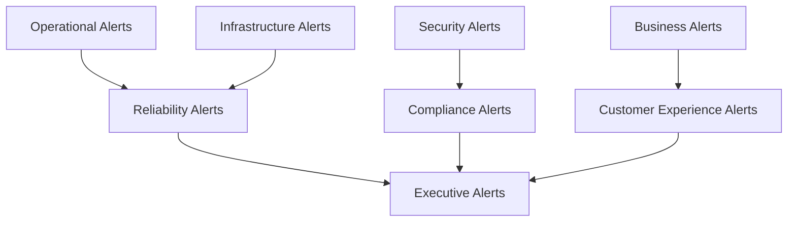
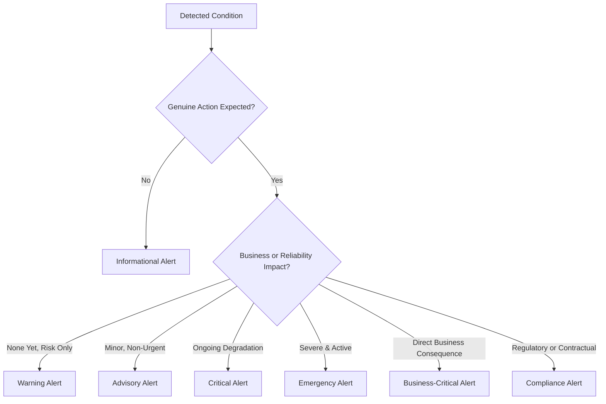
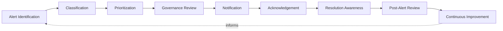
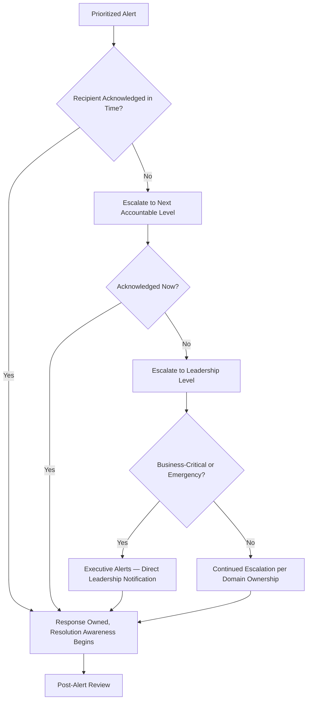
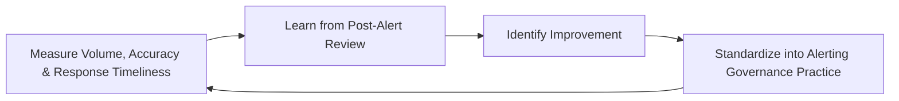
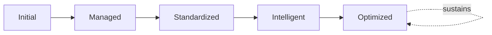

# Enterprise Alerting Governance Framework

## 1. Executive Summary

**Purpose** — This document defines the official Enterprise Alerting Governance Framework for **StackLeo Tech Store**. It establishes alert governance, alert classification, prioritization, notification governance, escalation governance, organizational accountability, executive visibility, and continuous alert quality improvement as a deliberate, accountable enterprise discipline. `monitoring-strategy.md` and `logging-governance.md` each anticipated this framework as the dedicated governance treatment of how monitored and logged signals become alerts. This framework does not restate either. It is the governance layer specifically responsible for the moment a signal becomes a demand on a human being's attention — ensuring that demand is genuinely warranted, correctly prioritized, and reaches the right person in time to matter.

**Scope** — This framework applies to every category of alert produced across StackLeo — operational, security, reliability, infrastructure, business, customer experience, executive, and compliance alerts — across every platform domain, coordinated with `monitoring-strategy.md`, `logging-governance.md`, `metrics-governance.md`, and `06_Security/security-monitoring.md`.

**Strategic Objectives** — To ensure every alert StackLeo raises is genuinely actionable; that alert priority genuinely reflects business impact; that notification and escalation reach the genuinely accountable responder in time; and that executive leadership has continuous, honest visibility into the organization's alerting discipline and readiness to respond.

**Business Value** — Governed alerting protects the organization's ability to respond to what genuinely matters without being overwhelmed by what does not, protects responder attention and wellbeing from the corrosive effect of alert fatigue, and gives leadership confidence that when a genuinely critical condition arises, the right person is told, correctly, and in time.

**Intended Audience** — Executive leadership, the Chief Technology Officer, engineering leadership, DevOps leadership, security leadership, operations leadership, platform teams, and business stakeholders.

## 2. Enterprise Alerting Vision

- **Alerting as Business Awareness** — alerting is governed as a genuine business awareness capability, never merely a technical notification convenience.
- **Operational Responsiveness** — alerts exist to trigger genuinely timely human response to a condition that warrants it.
- **Business Continuity** — alerting protects the organization's ability to notice and respond to a threat to continued operation, coordinated with `09_Operations/business-continuity-governance.md`.
- **Reliability Protection** — alerts inform the reliability discipline governed in `sre-strategy.md`, converting detected degradation into timely intervention.
- **Customer Experience** — alerting protects the organization's ability to notice a genuine threat to customer experience before the customer has to report it.
- **Risk Visibility** — alerting is governed as a first-class risk visibility mechanism, surfacing genuine exposure while it can still be addressed.
- **Executive Decision Support** — alerting gives executive leadership the timely awareness their most consequential decisions depend on.

### Enterprise Alerting Vision Matrix

| Vision Element | Focus | Business Value |
|---|---|---|
| Alerting as Business Awareness | Genuine business awareness capability, not a technical convenience | Prevents alerting from being treated as a low-priority afterthought |
| Operational Responsiveness | Triggers genuinely timely human response | Ensures conditions that warrant action receive it promptly |
| Business Continuity | Protects the ability to notice and respond to continuity threats | Supports the organization's most fundamental operating obligation |
| Reliability Protection | Converts detected degradation into timely intervention | Connects alerting directly to the reliability discipline |
| Customer Experience | Notices a genuine threat before the customer has to report it | Protects the trust relationship every interaction depends on |
| Risk Visibility | Surfaces genuine exposure while it can still be addressed | Prevents risk from compounding unnoticed |
| Executive Decision Support | Gives leadership the timely awareness decisions depend on | Informs the organization's most consequential decisions |

## 3. Alerting Governance Principles

Alerting governance at StackLeo rests on nine principles, each producing a specific business outcome.

- **Actionable Alerts Only** — an alert is raised only where a genuine action is expected of its recipient. *Business Value:* protects responder attention from being spent on conditions no one is meant to act upon.
- **Business Impact First** — an alert's priority is set by its genuine business impact, not merely its technical severity. *Business Value:* directs the most urgent response to what genuinely matters to the business.
- **Priority-Based Response** — response effort is proportionate to an alert's genuinely governed priority. *Business Value:* ensures the organization's most limited resource, responder attention, is spent where it matters most.
- **Timely Awareness** — an alert reaches its genuinely accountable recipient without avoidable delay. *Business Value:* protects the window in which a condition can still be addressed before it compounds.
- **Accountability** — every alert category traces to a specific, named, responsible owner. *Business Value:* ensures no alert category drifts without someone genuinely responsible for it.
- **Traceability** — every alert can be traced to the specific condition, evidence, and governance decision that produced it. *Business Value:* supports confident post-alert review and continuous improvement.
- **Consistency** — alerting follows a consistent, governed pattern of classification and prioritization across every domain and team. *Business Value:* reduces the variance that makes cross-team response coordination difficult.
- **Signal Over Noise** — alerting is judged by the genuine signal it delivers, never by the sheer volume of notifications raised. *Business Value:* protects response quality from the corrosive effect of alert fatigue.
- **Continuous Improvement** — alerting governance practice matures over time, informed by real response and quality outcomes. *Business Value:* keeps alerting aligned with the organization's growing scale and complexity.

### Alerting Governance Principles Matrix

| Principle | Description | Business Value |
|---|---|---|
| Actionable Alerts Only | Raised only where genuine action is expected | Protects attention from conditions no one is meant to act upon |
| Business Impact First | Priority set by genuine business impact | Directs urgent response to what genuinely matters |
| Priority-Based Response | Response effort proportionate to governed priority | Ensures responder attention is spent where it matters most |
| Timely Awareness | Reaches the accountable recipient without avoidable delay | Protects the window in which a condition can still be addressed |
| Accountability | Every category traces to a specific, named, responsible owner | Ensures no category drifts without genuine responsibility |
| Traceability | Traces to the condition, evidence, and decision behind it | Supports confident post-alert review and improvement |
| Consistency | Consistent, governed classification and prioritization pattern | Reduces variance that complicates cross-team coordination |
| Signal Over Noise | Judged by genuine signal, never by notification volume | Protects response quality from alert fatigue |
| Continuous Improvement | Practice matures from real response and quality outcomes | Keeps alerting aligned with growing scale and complexity |

## 4. Enterprise Alerting Governance Model

Alerting governance operates across eight conceptual domains, each holding accountability for a distinct category of alert.

### Operational Alerts

- **Purpose** — govern alerting on conditions affecting day-to-day platform operation.
- **Governance Scope** — oversight coordinated with `09_Operations/operations-governance-strategy.md`.
- **Business Value** — protects the organization's ability to notice and respond to operational degradation.
- **Executive Expectations** — leadership expects operational alerts to enable genuinely timely intervention.

### Security Alerts

- **Purpose** — govern alerting on security-relevant events, jointly with, and never superseding, `06_Security/security-monitoring.md`.
- **Governance Scope** — oversight ensuring security alerts meet the rigor `06_Security/security-governance.md` requires.
- **Business Value** — protects StackLeo's core trust differentiator through genuinely timely security response.
- **Executive Expectations** — leadership expects security alerts to be treated as mandatory, non-negotiable escalation.

### Reliability Alerts

- **Purpose** — govern alerting on conditions threatening platform reliability and service health.
- **Governance Scope** — oversight coordinated with `sre-strategy.md` and `09_Operations/service-level-governance.md`.
- **Business Value** — protects the organization's ability to intervene before a reliability commitment is breached.
- **Executive Expectations** — leadership expects reliability alerts to precede, not follow, customer-visible impact wherever possible.

### Infrastructure Alerts

- **Purpose** — govern alerting on conditions affecting the platform's underlying technical foundation.
- **Governance Scope** — oversight coordinated with `infrastructure-as-code.md` and `environment-governance.md`.
- **Business Value** — protects the technical foundation every other alert domain ultimately depends on.
- **Executive Expectations** — leadership expects infrastructure alerts to be governed with consistent rigor regardless of scale.

### Business Alerts

- **Purpose** — govern alerting on conditions affecting genuine business outcome or commercial performance.
- **Governance Scope** — oversight coordinated with `01_Business/business-model.md` and Business Metrics (`metrics-governance.md`, Section 4).
- **Business Value** — connects alerting directly to genuine business consequence.
- **Executive Expectations** — leadership expects business alerts to reach decision-makers, not only technical responders.

### Customer Experience Alerts

- **Purpose** — govern alerting on conditions affecting the customer's genuine experience of the platform.
- **Governance Scope** — oversight coordinated with `09_Operations/service-level-governance.md`, with heightened business sensitivity.
- **Business Value** — protects the trust relationship every customer interaction depends on.
- **Executive Expectations** — leadership expects customer experience alerts to precede, not merely confirm, a customer complaint.

### Executive Alerts

- **Purpose** — govern the escalation of the organization's most consequential conditions directly to executive leadership.
- **Governance Scope** — oversight exclusively accountable for converging every domain into the alerts genuinely warranting executive attention.
- **Business Value** — protects leadership's ability to know about, and act on, the organization's most significant conditions.
- **Executive Expectations** — leadership expects to be told promptly, not merely eventually, of genuinely executive-relevant conditions.

### Compliance Alerts

- **Purpose** — govern alerting on conditions threatening genuine regulatory or contractual obligation.
- **Governance Scope** — oversight coordinated with `06_Security/compliance-governance.md` and `06_Security/audit-governance.md`.
- **Business Value** — protects the organization's standing with regulators and counterparties.
- **Executive Expectations** — leadership expects compliance alerts to be raised with sufficient lead time to genuinely respond.

### Alert Governance Matrix

| Domain | Purpose | Business Value | Executive Expectations |
|---|---|---|---|
| Operational Alerts | Govern alerting on day-to-day operational conditions | Protects the ability to notice and respond to degradation | Expects genuinely timely intervention |
| Security Alerts | Govern alerting on security-relevant events | Protects StackLeo's core trust differentiator | Expects treatment as mandatory, non-negotiable escalation |
| Reliability Alerts | Govern alerting on threats to reliability and service health | Protects the ability to intervene before a breach | Expects alerts to precede customer-visible impact |
| Infrastructure Alerts | Govern alerting on the technical foundation | Protects the foundation every alert domain depends on | Expects consistent rigor regardless of scale |
| Business Alerts | Govern alerting on business outcome or commercial performance | Connects alerting to genuine business consequence | Expects alerts to reach decision-makers directly |
| Customer Experience Alerts | Govern alerting on genuine customer experience conditions | Protects the trust relationship every interaction depends on | Expects alerts to precede, not confirm, customer complaints |
| Executive Alerts | Govern escalation of the most consequential conditions | Protects leadership's ability to know about and act on conditions | Expects prompt, not merely eventual, notification |
| Compliance Alerts | Govern alerting on regulatory or contractual threats | Protects the organization's standing with regulators | Expects sufficient lead time to genuinely respond |

*Diagram 1: Enterprise Alert Governance Framework — operational and infrastructure alerts feed reliability alerts, security alerts feed compliance alerts, and business alerts feed customer experience alerts, with reliability, compliance, and customer experience alerts converging on executive alerts.*

## 5. Alert Classification Framework

Alerts are governed across seven conceptual classifications, each carrying a distinct governance objective. Remaining implementation independent, this framework classifies alerts by genuine severity and consequence — never by tool, channel, or notification mechanism.

- **Informational Alerts** — govern awareness-only conditions carrying no expectation of action.
- **Advisory Alerts** — govern conditions warranting attention but not immediate response.
- **Warning Alerts** — govern conditions indicating a genuine risk of degradation if left unaddressed.
- **Critical Alerts** — govern conditions indicating a genuine, ongoing degradation requiring prompt response.
- **Emergency Alerts** — govern conditions indicating a severe, active threat to the platform or business requiring immediate response.
- **Business-Critical Alerts** — govern conditions carrying direct, severe consequence to genuine business outcome.
- **Compliance Alerts** — govern conditions threatening genuine regulatory or contractual obligation, coordinated with Compliance Alerts (Section 4).

### Alert Classification Matrix

| Classification | Governance Objective | Expected Response Posture |
|---|---|---|
| Informational Alerts | Awareness-only, no expectation of action | Logged for context, no response required |
| Advisory Alerts | Attention warranted, not immediate response | Reviewed within routine operational cadence |
| Warning Alerts | Genuine risk of degradation if unaddressed | Reviewed and addressed within a bounded window |
| Critical Alerts | Genuine, ongoing degradation | Prompt response by an accountable owner |
| Emergency Alerts | Severe, active threat to platform or business | Immediate response, coordinated with `incident-management.md` |
| Business-Critical Alerts | Direct, severe consequence to business outcome | Immediate response with business stakeholder visibility |
| Compliance Alerts | Threat to regulatory or contractual obligation | Prompt response with compliance function involvement |

*Diagram 3: Alert Classification Decision Flow — a detected condition is checked for genuine expected action, then classified by the nature and severity of its business, reliability, regulatory, or contractual impact into the seven governed alert classifications.*

## 6. Alert Lifecycle Governance

Alerting governance operates across nine conceptual lifecycle stages.

- **Alert Identification** — govern how a genuinely warranted condition is recognized as alert-worthy.
- **Classification** — govern how an identified condition is assigned to the appropriate category in Section 5.
- **Prioritization** — govern how a classified alert's response urgency is determined by genuine business impact.
- **Governance Review** — govern how an alert is reviewed against the appropriate domain in Section 4.
- **Notification** — govern how a prioritized alert reaches its genuinely accountable recipient.
- **Acknowledgement** — govern how a recipient's receipt and ownership of an alert is confirmed.
- **Resolution Awareness** — govern how the organization remains aware of an alert's status until genuine resolution.
- **Post-Alert Review** — govern the periodic, formal review of raised alerts for genuine insight.
- **Continuous Improvement** — govern how alerting practice is deliberately strengthened based on real response outcomes.

### Alert Lifecycle Matrix

| Stage | Governance Objective | Business Value |
|---|---|---|
| Alert Identification | Recognize a genuinely warranted, alert-worthy condition | Ensures alerting effort is deliberately directed |
| Classification | Assign an identified condition to the appropriate category | Ensures consistent treatment across domains |
| Prioritization | Determine response urgency by genuine business impact | Ensures response effort is proportionate to genuine consequence |
| Governance Review | Review an alert against the appropriate domain | Ensures review by the genuinely accountable function |
| Notification | Reach the genuinely accountable recipient | Protects the window in which a condition can still be addressed |
| Acknowledgement | Confirm receipt and ownership | Prevents an alert from being silently missed |
| Resolution Awareness | Remain aware of status until genuine resolution | Prevents a condition from being forgotten before it is resolved |
| Post-Alert Review | Periodically review raised alerts for genuine insight | Confirms alerting investment is genuinely working |
| Continuous Improvement | Strengthen practice from real response outcomes | Keeps alerting practice compounding in capability |

*Diagram 2: Alert Lifecycle Model — identification and classification inform prioritization and governance review, feeding notification, acknowledgement, and resolution awareness, with post-alert review and continuous improvement feeding lessons back into the cycle.*

## 7. Organizational Governance

Governance accountability is distributed deliberately across eight organizational roles.

- **Executive Leadership** — holds ultimate accountability for whether alerting genuinely serves the organization's awareness and response needs.
- **CTO** — owns the coherence and enforcement of this framework across every alert domain and governance layer it defines.
- **Engineering Leadership** — owns Operational and Infrastructure Alerts (Section 4) within their accountable teams.
- **DevOps Leadership** — owns Reliability Alerts (Section 4) in coordination with `devops-governance-framework.md`.
- **Security Leadership** — owns Security and Compliance Alerts (Section 4) jointly with `06_Security/security-governance.md`, which remains authoritative for security-specific obligations.
- **Operations Leadership** — owns Operational and Customer Experience Alerts (Section 4) in coordination with `09_Operations/operations-governance-strategy.md`.
- **Platform Teams** — own the classification and prioritization discipline within their assigned alert domain.
- **Business Stakeholders** — own Business Alerts (Section 4) alignment with genuine business priority.

### Organizational Responsibility Matrix

| Role | Governance Objective | Business Value |
|---|---|---|
| Executive Leadership | Hold ultimate accountability for alerting's genuine service to the organization | Provides a single point of ultimate accountability |
| CTO | Own coherence and enforcement of this framework | Provides a single point of specialist accountability |
| Engineering Leadership | Own operational and infrastructure alerts | Embeds alert accountability closest to where conditions occur |
| DevOps Leadership | Own reliability alerts | Keeps alerting coordinated with broader DevOps governance |
| Security Leadership | Own security and compliance alerts jointly with security governance | Ensures alerts genuinely support security and compliance response |
| Operations Leadership | Own operational and customer experience alerts | Ensures accountability extends beyond deployment into operation |
| Platform Teams | Own classification and prioritization within their domain | Keeps classification decisions close to genuine domain expertise |
| Business Stakeholders | Own business alerts alignment with genuine priority | Connects alerting to genuine business relevance |

### Governance Responsibility Matrix

| Role | Responsibility |
|---|---|
| Executive Leadership | Owns ultimate accountability for the organization's alerting discipline. |
| CTO | Owns coherence and enforcement of this framework, in partnership with executive leadership. |
| Engineering Leadership | Owns operational and infrastructure alerts within accountable teams. |
| DevOps Leadership | Owns reliability alerts in coordination with `devops-governance-framework.md`. |
| Security Leadership | Owns security and compliance alerts jointly with `06_Security/security-governance.md`. |
| Operations Leadership | Owns operational and customer experience alerts in coordination with `09_Operations/operations-governance-strategy.md`. |
| Platform Teams | Own classification and prioritization discipline within their assigned domain. |
| Business Stakeholders | Own business alerts alignment with genuine business priority. |

*Diagram 4: Alert Escalation Governance Model — a prioritized alert escalates through accountable levels when acknowledgement does not occur in time, reaching executive alerts directly for business-critical or emergency conditions, resolving into owned response and post-alert review.*

## 8. Alert Quality Governance

- **Alert Accuracy** — an alert is governed to genuinely and reliably reflect the condition it claims to represent.
- **False Positives** — alerting is governed to minimize conditions raised where no genuine issue exists, protecting responder trust in the alerting system.
- **False Negatives** — alerting is governed to minimize genuine conditions that fail to raise an alert, protecting the organization from unnoticed exposure.
- **Duplicate Alerts** — alerting is governed to prevent a single genuine condition from producing redundant, uncorrelated notifications.
- **Alert Fatigue** — alerting is governed with explicit awareness of the risk that excessive volume degrades genuine responsiveness over time.
- **Business Relevance** — an alert is governed to carry genuine business or operational relevance, not incidental technical noise.
- **Response Readiness** — alerting is governed to confirm the organization genuinely retains the capacity and process to respond when an alert is raised.

### Alert Quality Matrix

| Quality Area | Focus | Governance Coordination |
|---|---|---|
| Alert Accuracy | Genuinely and reliably reflecting the condition represented | Coordinated with Actionable Alerts Only (Section 3) |
| False Positives | Minimizing conditions raised where no genuine issue exists | Coordinated with Signal Over Noise (Section 3) |
| False Negatives | Minimizing genuine conditions that fail to raise an alert | Coordinated with Alert Identification (Section 6) |
| Duplicate Alerts | Preventing redundant, uncorrelated notifications | Coordinated with Consistency (Section 3) |
| Alert Fatigue | Awareness that excessive volume degrades responsiveness | Coordinated with Signal Over Noise (Section 3) |
| Business Relevance | Genuine business or operational relevance, not noise | Coordinated with Business Impact First (Section 3) |
| Response Readiness | Confirming genuine capacity and process to respond | Coordinated with `incident-management.md` |

## 9. Executive Oversight

- **Executive Alert Reviews** — the alerts genuinely warranting executive attention are formally reviewed directly with executive leadership on a regular cadence.
- **Critical Event Reviews** — critical and emergency alert response is reviewed directly with executive leadership.
- **Operational Readiness Reviews** — the organization's genuine capacity to respond to alerts is reviewed as a distinct, ongoing concern.
- **Executive Reporting** — aggregated alerting health — volume, classification accuracy, response timeliness — is reported to executive leadership and the Board.
- **Alert Quality Reviews** — alert accuracy, false positive and false negative rates, and alert fatigue indicators are periodically reviewed with executive leadership.
- **Continuous Improvement Reviews** — the organization's follow-through on captured alerting governance lessons is reviewed directly with executive leadership.

### Executive Oversight Matrix

| Oversight Mechanism | Purpose | Governance Role |
|---|---|---|
| Executive Alert Reviews | Review alerts genuinely warranting executive attention | Direct executive-level review of the most consequential alerts |
| Critical Event Reviews | Review critical and emergency alert response | Direct executive-level review of high-severity response |
| Operational Readiness Reviews | Review genuine capacity to respond to alerts | Treats response readiness as ongoing, not assumed |
| Executive Reporting | Provide leadership a single, coherent alerting picture | Reports volume, classification accuracy, response timeliness |
| Alert Quality Reviews | Review accuracy, false positive/negative rates, fatigue | Periodic executive-level quality review |
| Continuous Improvement Reviews | Review follow-through on captured lessons | Direct executive-level review of improvement completion |

## 10. Future Readiness

This framework is designed to remain valid as StackLeo evolves in scale, geography, and organizational complexity.

- **AI-Assisted Alert Intelligence** — as classification and prioritization increasingly incorporate AI-assisted methods, they remain governed under Classification and Prioritization (Section 6) at the same rigor as any other method.
- **Predictive Alerting** — where the organization develops the capability to anticipate a condition before it fully materializes, that capability is governed as an extension of Alert Identification (Section 6).
- **Intelligent Prioritization** — where prioritization increasingly draws on intelligent pattern analysis, that analysis remains subject to the same Governance Review (Section 4) as any other prioritization method.
- **Context-Aware Notifications** — where notification increasingly incorporates genuine situational context, that capability remains governed under Notification (Section 6) at the same rigor as any other method.
- **Enterprise Scale** — the governance model, domains, and lifecycle defined throughout this framework are defined independently of organizational size.
- **Global Operations** — Notification and Escalation governance (Sections 6 and 7) are structured to be re-applied as StackLeo expands from Bangladesh into South Asia and global markets, each with genuinely distinct operating hours and response expectations.
- **Autonomous Alert Governance (Conceptual)** — where automation increasingly performs steps within classification, prioritization, or notification, that automation remains subject to the same ownership and executive oversight as any human-performed activity.

## 11. Alerting Maturity Model

Alerting governance maturity is described across five conceptual levels.

- **Initial** — alerting, where it exists, is informal and inconsistent; conditions are raised reactively, and ownership is unclear.
- **Managed** — basic alerting governance exists for individual domains, but consistency across the eight domains in Section 4 varies significantly.
- **Standardized** — the governance model, domains, and lifecycle are standardized, documented, and consistently applied across the organization.
- **Intelligent** — alerting governance draws systematically on accumulated evidence and pattern analysis to inform genuinely proactive prioritization.
- **Optimized** — alerting governance is continuously and deliberately improved based on quantitative evidence and organizational learning; improvement itself is a managed, ongoing discipline.

### Alert Maturity Matrix

| Level | Characteristics | Primary Focus |
|---|---|---|
| Initial | Informal, inconsistent alerting; conditions raised reactively | Ad hoc, individually-dependent alerting practice |
| Managed | Basic governance exists per domain; consistency varies | Domain-level consistency |
| Standardized | Standardized governance model, domains, and lifecycle | Organization-wide consistency and clear ownership |
| Intelligent | Governance draws systematically on evidence and pattern analysis | Proactive, evidence-informed prioritization |
| Optimized | Practice continuously and deliberately improved from evidence | Sustained, deliberate improvement as a discipline |

*Diagram 5: Continuous Alert Quality Improvement Cycle — alert volume, accuracy, and response timeliness are measured, learned from, improved upon, and standardized back into governed practice, on a continuing basis.*

*Diagram 6: Alert Maturity Progression — maturity advances from informal, reactively-raised alerting practice toward standardized, intelligently informed, and continuously optimized alerting governance.*

## 12. Alerting Anti-Patterns

- **Alert Storms** — a single underlying condition producing a flood of uncorrelated notifications overwhelms genuine response capacity.
- **Alert Fatigue** — excessive alert volume erodes responder trust and genuine responsiveness over time.
- **Poor Prioritization** — priority set by technical severity alone, without genuine business impact, misdirects response effort.
- **Weak Ownership** — an alert category with no accountable owner has no one genuinely responsible for its accuracy or relevance.
- **Missing Business Context** — alerts that carry only technical detail without business relevance fail to inform genuine business decisions.
- **Excessive Notifications** — notifying more recipients than genuinely necessary dilutes accountability and response ownership.
- **Reactive Alert Governance** — treating alerting governance as adequate only until a missed or excessive alert proves otherwise forfeits the chance to improve deliberately.
- **No Continuous Review** — failing to formally review raised alerts forfeits the organization's ability to genuinely improve alerting quality over time.

### Anti-Pattern Summary

| Anti-Pattern | Organizational & Business Impact |
|---|---|
| Alert Storms | Overwhelms genuine response capacity with uncorrelated notifications |
| Alert Fatigue | Erodes responder trust and genuine responsiveness over time |
| Poor Prioritization | Misdirects response effort away from genuine business impact |
| Weak Ownership | Leaves no one genuinely responsible for accuracy or relevance |
| Missing Business Context | Fails to inform genuine business decisions |
| Excessive Notifications | Dilutes accountability and genuine response ownership |
| Reactive Alert Governance | Lets missed or excessive alerts, not deliberate design, drive improvement |
| No Continuous Review | Forfeits the ability to genuinely improve alerting quality over time |

## Related Documents

| Document | Relationship |
|---|---|
| `monitoring-strategy.md` | Produces the monitored signal this framework governs the conversion of into a governed alert. |
| Observability Framework (conceptual future companion) | An anticipated deeper technical elaboration of instrumentation practice this framework's alerts draw upon. |
| `logging-governance.md` | Governs the discrete-event evidence this framework's alerts often reference during Post-Alert Review (Section 6). |
| `metrics-governance.md` | Governs the measured evidence this framework's Business and Reliability Alerts (Section 4) draw upon. |
| Incident Observability (conceptual future companion) | An anticipated elaboration of how governed alerts feed `incident-management.md` and `09_Operations/incident-management-governance.md`. |
| `reliability-engineering-framework.md` | Consumes this framework's Reliability Alerts (Section 4) as a direct input to reliability response. |

## Document Information

| Property | Value |
|----------|-------|
| Document | alerting-governance.md |
| Version | 1.0.0 |
| Status | Active |
| Maintained By | StackLeo |
| Last Updated | 2026-07-28 |

---

© StackLeo. All Rights Reserved.
