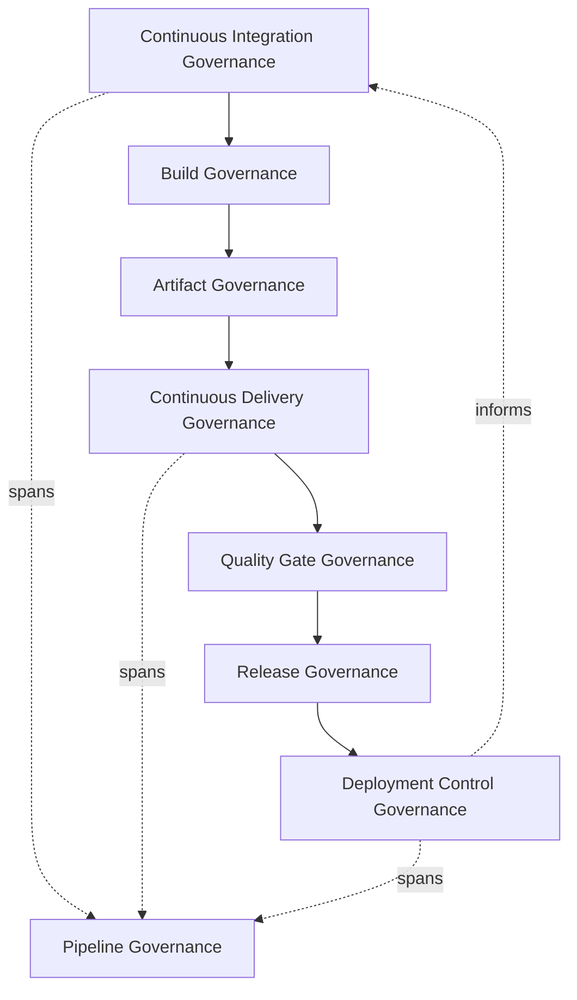
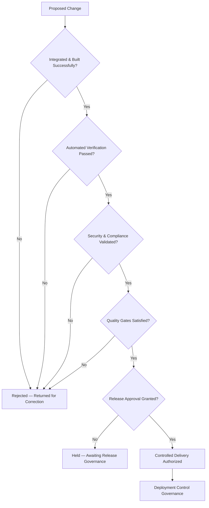
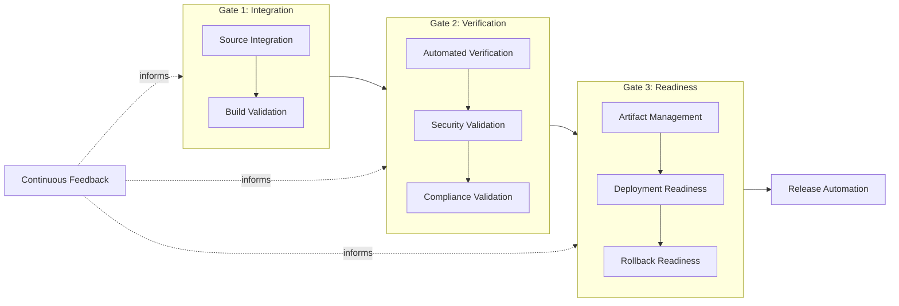
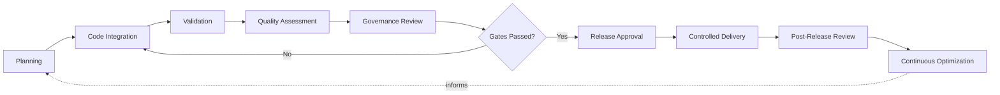
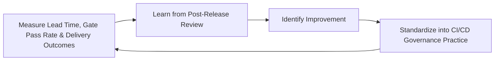
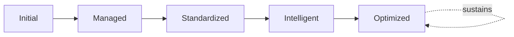

# Enterprise CI/CD Governance Framework

## 1. Executive Summary

**Purpose** — This document defines the official Enterprise CI/CD Governance Framework for **StackLeo Tech Store**. It establishes continuous integration governance, continuous delivery governance, pipeline governance, automation governance, quality gates, deployment controls, organizational accountability, executive oversight, and continuous delivery maturity as a deliberate, accountable enterprise discipline. `ci-cd-strategy.md` remains the operational CI/CD framework for `07_DevOps` — the document that elaborates CI/CD philosophy, the software delivery lifecycle, core capabilities, and quality gates in full operational depth. This framework sits above it as the highest-level executive mandate, consistent with the executive-charter relationship `configuration-management-governance.md` holds over `configuration-management.md` and `environment-governance.md` holds over `environment-management.md`: it does not restate pipeline mechanics or capability detail, it establishes the accountability structure, governance model, and executive expectations that give CI/CD practice its authority across the whole organization.

**Scope** — This framework applies to the full path from source code integration through validated, production-ready delivery at StackLeo — continuous integration, continuous delivery, pipeline governance, build governance, artifact governance, and quality gate enforcement — across every capability domain and every environment governed under `environment-governance.md`.

**Strategic Objectives** — To ensure delivery automation is genuinely governed, not an ungoverned accumulation of scripts and tools; that quality gates are honored consistently, never silently bypassed; that every stage of delivery produces genuine, traceable evidence; and that executive leadership has continuous visibility into delivery governance health and maturity.

**Business Value** — Governed CI/CD practice converts delivery speed into a genuine, sustainable competitive advantage, protects the business from the disruption ungoverned automation and bypassed quality gates would otherwise cause, and gives leadership confidence to increase delivery frequency without trading away reliability.

**Intended Audience** — Executive leadership, the Chief Technology Officer, engineering leadership, DevOps leadership, platform engineering, QA leadership, security leadership, operations leadership, product leadership, and independent audit and oversight functions.

## 2. Enterprise CI/CD Vision

- **Continuous Delivery Vision** — validated change moves from commit to production-ready state through a single, coherent, governed path, never through disconnected, team-specific practice.
- **Business Agility** — CI/CD governance exists to make StackLeo's ability to adapt and respond to market opportunity an engineering reality, not merely a stated ambition.
- **Engineering Excellence** — CI/CD governance is treated as a direct expression of engineering discipline, coordinated with `08_Quality_Assurance/quality-maturity-framework.md`.
- **Release Reliability** — every governed delivery path protects, rather than threatens, the reliability of what ultimately reaches customers.
- **Delivery Consistency** — the same governed rigor applies to every delivery, regardless of which team or capability is involved.
- **Operational Stability** — CI/CD governance protects the operational stability the business depends on through active, ongoing delivery.
- **Customer Value** — every CI/CD governance decision is ultimately weighed against its genuine effect on the value delivered to the customer, consistent with `01_Business/vision.md`.

### Enterprise CI/CD Vision Matrix

| Vision Element | Focus | Business Value |
|---|---|---|
| Continuous Delivery Vision | Single, coherent, governed path from commit to production-ready | Ensures consistent delivery outcomes regardless of team |
| Business Agility | Makes market adaptability an engineering reality | Supports responsiveness to genuine business opportunity |
| Engineering Excellence | CI/CD governance as a direct expression of engineering discipline | Connects delivery practice to broader quality maturity |
| Release Reliability | Every path protects, rather than threatens, reliability | Protects the operational trust every release depends on |
| Delivery Consistency | Same governed rigor applies regardless of team or capability | Prevents rigor from depending on which team is delivering |
| Operational Stability | Governance protects stability through active delivery | Prevents delivery activity from becoming a disruption source |
| Customer Value | Every decision weighed against genuine customer effect | Keeps governance connected to the trust-centered brand promise |

## 3. CI/CD Governance Principles

CI/CD governance at StackLeo rests on nine principles, each producing a specific business outcome.

- **Automation with Governance** — automation is pursued deliberately, under genuine governance, never as an ungoverned accumulation of scripts and tools. *Business Value:* ensures automation investment is trustworthy and sustainable, not a hidden liability.
- **Quality Before Speed** — delivery speed is never pursued at the expense of genuine quality confidence. *Business Value:* protects customer trust from the compounding cost of quality shortcuts.
- **Shift-Left Quality** — quality verification begins as early in the delivery path as possible, coordinated with `08_Quality_Assurance/testing-governance.md`. *Business Value:* a defect caught early costs a fraction of one caught after release.
- **Secure Delivery** — security verification is embedded into the delivery path from the outset, coordinated with `devsecops-strategy.md`, never treated as a separate, later concern. *Business Value:* prevents delivery automation from becoming an unmonitored path around security discipline.
- **Controlled Change** — every change moving through the delivery path is deliberate, bounded, and well-understood. *Business Value:* keeps the consequence of any single delivery predictable and contained.
- **Traceability** — every artifact moving through the delivery path traces to its source, its validation, and its authorization. *Business Value:* supports accountability, audit, and confident investigation when something goes wrong.
- **Accountability** — every CI/CD capability domain and governance decision traces to a specific, named, responsible owner. *Business Value:* ensures no dimension of delivery practice drifts without someone genuinely responsible for it.
- **Standardization** — the same governed delivery pattern applies consistently across every team and capability. *Business Value:* reduces the variance that makes delivery-specific failures difficult to diagnose.
- **Continuous Improvement** — CI/CD governance practice matures over time, informed by real delivery outcomes. *Business Value:* keeps delivery governance aligned with the organization's growing scale and complexity.

### CI/CD Governance Principles Matrix

| Principle | Description | Business Value |
|---|---|---|
| Automation with Governance | Automation pursued deliberately, under genuine governance | Ensures automation is trustworthy, not a hidden liability |
| Quality Before Speed | Speed never pursued at the expense of genuine quality confidence | Protects customer trust from the cost of quality shortcuts |
| Shift-Left Quality | Verification begins as early in delivery as possible | A defect caught early costs a fraction of one caught late |
| Secure Delivery | Security embedded into delivery from the outset | Prevents delivery automation bypassing security discipline |
| Controlled Change | Every change is deliberate, bounded, well-understood | Keeps the consequence of any single delivery predictable |
| Traceability | Every artifact traces to source, validation, and authorization | Supports accountability, audit, and investigation |
| Accountability | Every domain and decision traces to a named owner | Ensures no dimension of practice drifts without responsibility |
| Standardization | The same governed pattern applies across every team | Reduces variance that complicates diagnosis |
| Continuous Improvement | Practice matures from real delivery outcomes | Keeps governance aligned with growing scale and complexity |

## 4. Enterprise CI/CD Governance Model

CI/CD governance operates across eight conceptual layers, each holding accountability for a distinct dimension of the delivery path.

### Continuous Integration Governance

- **Purpose** — own the coherence of how source code change is continuously combined and validated.
- **Governance Scope** — oversight of Source Integration and Build (`ci-cd-strategy.md`, Section 3), coordinated with `git-strategy.md`.
- **Business Value** — ensures integration issues are surfaced early, before they compound in cost and complexity.
- **Executive Expectations** — leadership trusts integration occurs continuously, not as a rare, high-stakes event.

### Continuous Delivery Governance

- **Purpose** — own the coherence of how validated change is kept in a genuinely deployable state.
- **Governance Scope** — oversight of Delivery Readiness (`ci-cd-strategy.md`, Section 3), coordinated with `release-management-governance.md`.
- **Business Value** — ensures the organization can release with confidence at any time, not only after last-minute scrambling.
- **Executive Expectations** — leadership trusts delivery readiness is a continuous state, not an occasional achievement.

### Pipeline Governance

- **Purpose** — own the overall coherence of the governed path validated change travels through.
- **Governance Scope** — oversight spanning every capability domain in Section 5.
- **Business Value** — ensures the delivery path itself is trustworthy, consistent, and understood.
- **Executive Expectations** — leadership trusts the delivery path is genuinely governed end to end, not fragmented by tool or team.

### Build Governance

- **Purpose** — own the coherence of how source code is deterministically converted into a validated build artifact.
- **Governance Scope** — oversight of Build Automation (`ci-cd-strategy.md`, Section 4.2).
- **Business Value** — ensures every build is reproducible and trustworthy, never a source of unexplained variance.
- **Executive Expectations** — leadership trusts a build's outcome can be trusted and reproduced.

### Artifact Governance

- **Purpose** — own the coherence of how validated build artifacts are tracked, secured, and made traceable.
- **Governance Scope** — oversight of Artifact Management (`ci-cd-strategy.md`, Section 4.5), coordinated with `configuration-management-governance.md`.
- **Business Value** — ensures every deployed artifact traces to a known, validated source.
- **Executive Expectations** — leadership trusts no artifact reaches production without genuine, traceable provenance.

### Release Governance

- **Purpose** — own the coherence of how a validated, deployment-ready artifact becomes an actual business release.
- **Governance Scope** — oversight coordinated with `release-management-governance.md`, without duplicating its authority.
- **Business Value** — ensures the technical delivery path and the business release decision remain connected and consistent.
- **Executive Expectations** — leadership trusts the release decision genuinely governs what the delivery path exposes to customers.

### Quality Gate Governance

- **Purpose** — own the coherence of how quality gates are defined, enforced, and never silently bypassed.
- **Governance Scope** — oversight of Quality Gates (`ci-cd-strategy.md`, Section 5), coordinated with `08_Quality_Assurance/release-quality-gates.md`.
- **Business Value** — ensures quality confidence is genuinely earned at every gate, not assumed.
- **Executive Expectations** — leadership trusts quality gates are never bypassed under schedule pressure, without exception.

### Deployment Control Governance

- **Purpose** — own the coherence of how the delivery path connects to the controlled act of deployment.
- **Governance Scope** — oversight coordinated with `deployment-governance.md`, without duplicating its authority.
- **Business Value** — ensures delivery automation and deployment safety remain connected disciplines, not disconnected ones.
- **Executive Expectations** — leadership trusts deployment controls are genuinely exercised at the point of delivery.

### CI/CD Governance Matrix

| Layer | Purpose | Business Value | Executive Expectations |
|---|---|---|---|
| Continuous Integration Governance | Own coherence of continuously combining and validating change | Surfaces integration issues early, before they compound | Trusts integration occurs continuously, not rarely |
| Continuous Delivery Governance | Own coherence of keeping change genuinely deployable | Enables release with confidence at any time | Trusts delivery readiness is continuous, not occasional |
| Pipeline Governance | Own overall coherence of the governed delivery path | Ensures the delivery path is trustworthy and consistent | Trusts the path is governed end to end, not fragmented |
| Build Governance | Own coherence of deterministic build conversion | Ensures every build is reproducible and trustworthy | Trusts a build's outcome can be trusted and reproduced |
| Artifact Governance | Own coherence of tracking and securing build artifacts | Ensures every deployed artifact traces to a known source | Trusts no artifact reaches production without provenance |
| Release Governance | Own coherence of connecting delivery to business release | Keeps the delivery path and release decision connected | Trusts the release decision genuinely governs exposure |
| Quality Gate Governance | Own coherence of defining and enforcing quality gates | Ensures quality confidence is genuinely earned, not assumed | Trusts gates are never bypassed under pressure |
| Deployment Control Governance | Own coherence of connecting delivery to deployment | Keeps delivery automation and deployment safety connected | Trusts controls are genuinely exercised at delivery |

*Diagram 1: Enterprise CI/CD Governance Framework — continuous integration governance feeds build and artifact governance into continuous delivery governance, gated by quality gate governance ahead of release and deployment control governance, with pipeline governance spanning the full path and deployment control feeding back into integration.*

*Diagram 3: Enterprise Delivery Governance Flow — a proposed change proceeds only through successive confirmation of integration, verification, security and compliance validation, and quality gate satisfaction, with release approval required before controlled delivery is authorized.*

## 5. CI/CD Capability Domains

CI/CD governance is exercised across ten conceptual capability domains, each requiring a distinct governance emphasis. Every domain here is elaborated in full operational depth in `ci-cd-strategy.md`.

- **Source Integration** — governs how source code change is continuously combined, coordinated with `git-strategy.md` and `branching-strategy.md`.
- **Build Validation** — governs how a build is confirmed correct and reproducible before proceeding.
- **Automated Verification** — governs how automated testing confirms quality confidence, coordinated with `08_Quality_Assurance/test-automation-governance.md`.
- **Artifact Management** — governs how validated build artifacts are tracked and secured through their lifecycle.
- **Deployment Readiness** — governs how a validated artifact is confirmed ready for the controlled act of deployment.
- **Release Automation** — governs how automation supports, without replacing, the governed release decision.
- **Security Validation** — governs how security verification is embedded into the delivery path, jointly with `06_Security/security-governance.md`.
- **Compliance Validation** — governs how regulatory and contractual obligation is confirmed before delivery proceeds.
- **Rollback Readiness (Conceptual)** — governs how the ability to reverse a delivered change is confirmed before delivery proceeds, coordinated with `deployment-governance.md`.
- **Continuous Feedback** — governs how outcomes from every stage of delivery inform the stages before it.

### Capability Domain Matrix

| Domain | Governance Focus | Coordination |
|---|---|---|
| Source Integration | Continuous combination of source code change | `git-strategy.md`, `branching-strategy.md` |
| Build Validation | Confirmed correctness and reproducibility of a build | Build Governance (Section 4) |
| Automated Verification | Automated confirmation of quality confidence | `08_Quality_Assurance/test-automation-governance.md` |
| Artifact Management | Tracking and securing validated build artifacts | Artifact Governance (Section 4) |
| Deployment Readiness | Confirmed readiness for controlled deployment | `deployment-governance.md` |
| Release Automation | Automation supporting, not replacing, the release decision | `release-management-governance.md` |
| Security Validation | Security verification embedded into the delivery path | `06_Security/security-governance.md` |
| Compliance Validation | Confirmed regulatory and contractual obligation | `06_Security/compliance-governance.md` |
| Rollback Readiness (Conceptual) | Confirmed ability to reverse a delivered change | `deployment-governance.md` |
| Continuous Feedback | Outcomes from every stage informing prior stages | Continuous Improvement (Section 3) |

*Diagram 4: Quality Gate Governance Model — change passes through three successive gates, integration, verification, and readiness, each holding a distinct set of capability domains accountable, before release automation, with continuous feedback informing every gate.*

## 6. CI/CD Governance Lifecycle

CI/CD governance operates across nine conceptual lifecycle stages.

- **Planning** — govern how a proposed change traces to a deliberate, governed intent before development begins.
- **Code Integration** — govern how change is continuously combined into the shared codebase, coordinated with Continuous Integration Governance (Section 4).
- **Validation** — govern how the integrated change is confirmed correct through automated verification.
- **Quality Assessment** — govern how validation outcomes are interpreted against genuine quality expectations.
- **Governance Review** — govern how a change is confirmed to have passed the appropriate quality gates before proceeding.
- **Release Approval** — govern the point at which a validated, deployment-ready artifact receives release authorization.
- **Controlled Delivery** — govern how an approved artifact is delivered through a consistent, governed process.
- **Post-Release Review** — govern the deliberate assessment of how the delivery performed, regardless of whether it succeeded without incident.
- **Continuous Optimization** — govern how lessons from every prior stage are converted into genuine, lasting delivery improvement.

### CI/CD Lifecycle Matrix

| Stage | Governance Objective | Business Value |
|---|---|---|
| Planning | Ensure change traces to deliberate, governed intent | Prevents effort spent on undeliberate, ungoverned activity |
| Code Integration | Ensure change is continuously combined into the codebase | Surfaces integration issues before they compound |
| Validation | Confirm integrated change is correct through automated verification | Produces genuine, objective evidence of correctness |
| Quality Assessment | Interpret validation outcomes against genuine expectations | Ensures outcomes are honestly understood, not assumed favorable |
| Governance Review | Confirm the appropriate quality gates were passed | Ensures no change proceeds without genuine confidence |
| Release Approval | Authorize a validated, deployment-ready artifact for release | Ensures release proceeds on a genuine, accountable decision |
| Controlled Delivery | Deliver an approved artifact through a consistent process | Makes delivery routine and predictable |
| Post-Release Review | Deliberately assess how the delivery performed | Converts every delivery into organizational learning |
| Continuous Optimization | Convert lessons into lasting delivery improvement | Keeps delivery practice compounding in capability over time |

*Diagram 2: CI/CD Governance Lifecycle — planning and integration feed validation and quality assessment, cycling back to integration until governance review confirms gates are passed, before release approval, controlled delivery, and post-release review feed continuous optimization back into the cycle.*

## 7. Organizational Governance

Governance accountability is distributed deliberately across nine organizational roles.

- **Executive Leadership** — holds ultimate accountability for whether CI/CD practice is genuinely governed as an enterprise discipline.
- **CTO** — owns the coherence and enforcement of this framework across every capability domain and governance layer it defines.
- **Engineering Leadership** — owns Continuous Integration and Build Governance (Section 4) within their accountable teams.
- **DevOps Leadership** — owns Pipeline and Deployment Control Governance (Section 4) in coordination with `devops-governance-framework.md`.
- **Platform Engineering** — owns the self-service capability that makes governed delivery the default path for every team.
- **QA Leadership** — owns Quality Gate Governance (Section 4) in coordination with `08_Quality_Assurance/testing-governance.md`.
- **Security Leadership** — owns Security Validation (Section 5) jointly with `06_Security/security-governance.md`, which remains authoritative for security-specific obligations.
- **Operations Leadership** — owns Deployment Readiness (Section 5) in coordination with `09_Operations/operations-governance-strategy.md`.
- **Product Leadership** — owns Release Governance (Section 4) alignment with genuine business value, in coordination with `release-management-governance.md`.

### Organizational Responsibility Matrix

| Role | Governance Objective | Business Value |
|---|---|---|
| Executive Leadership | Hold ultimate accountability for governed CI/CD practice | Provides a single point of ultimate accountability |
| CTO | Own coherence and enforcement of this framework | Provides a single point of specialist accountability |
| Engineering Leadership | Own continuous integration and build governance | Embeds governance closest to where code is integrated |
| DevOps Leadership | Own pipeline and deployment control governance | Keeps the delivery path coordinated with broader DevOps governance |
| Platform Engineering | Own self-service capability enabling governed delivery by default | Makes the governed path the path of least resistance |
| QA Leadership | Own quality gate governance | Ensures gates rest on genuine verification evidence |
| Security Leadership | Own security validation jointly with security governance | Keeps security embedded, not a separate, later concern |
| Operations Leadership | Own deployment readiness | Ensures the organization can sustain what is delivered |
| Product Leadership | Own release governance alignment with business value | Ensures releases connect to genuine business intent |

## 8. CI/CD Risk Governance

CI/CD-related risk is governed across seven conceptual categories, coordinated with `06_Security/enterprise-risk-management-strategy.md`.

- **Pipeline Failure Risks** — the risk that the delivery path itself fails to function reliably.
- **Automation Risks** — the risk that ungoverned automation introduces error or inconsistency into delivery outcomes.
- **Build Integrity Risks** — the risk that a build does not genuinely reflect its intended source or produce reproducible results.
- **Deployment Risks** — the risk that a validated artifact fails to deploy safely, coordinated with `deployment-governance.md` (Section 7).
- **Security Risks** — the risk that the delivery path introduces or fails to detect a genuine security weakness.
- **Compliance Risks** — the risk that delivery practice fails to meet a genuine regulatory or contractual obligation.
- **Business Continuity Risks** — the risk that CI/CD practice itself becomes a source of business disruption rather than protection against it.

### Risk Governance Matrix

| Risk Category | Focus | Governance Coordination |
|---|---|---|
| Pipeline Failure Risks | Delivery path failing to function reliably | Coordinated with Pipeline Governance (Section 4) |
| Automation Risks | Ungoverned automation introducing error or inconsistency | Coordinated with Automation with Governance (Section 3) |
| Build Integrity Risks | Build not genuinely reflecting intended source | Coordinated with Build Governance (Section 4) |
| Deployment Risks | Validated artifact failing to deploy safely | Coordinated with `deployment-governance.md` (Section 7) |
| Security Risks | Introduced or undetected security weakness | Coordinated with `06_Security/security-governance.md` |
| Compliance Risks | Failure to meet regulatory or contractual obligation | Coordinated with `06_Security/compliance-governance.md` |
| Business Continuity Risks | CI/CD practice as a source of disruption | Coordinated with `09_Operations/business-continuity-governance.md` |

## 9. Executive Oversight

- **Delivery Governance Reviews** — the overall coherence of CI/CD governance is formally reviewed on a regular cadence.
- **Pipeline Governance Reviews** — the health and consistency of the governed delivery path is reviewed directly with executive leadership.
- **Executive Reporting** — aggregated delivery health — integration frequency, quality gate pass rate, delivery lead time — is reported to executive leadership and the Board.
- **Release Readiness Reviews** — the organization's readiness to authorize release through the governed delivery path is reviewed with executive leadership.
- **Operational Readiness Reviews** — sustained operational preparedness for what the delivery path produces is reviewed as a distinct, ongoing concern.
- **Continuous Improvement Reviews** — the organization's follow-through on captured CI/CD governance lessons is reviewed directly with executive leadership.

### Executive Oversight Matrix

| Oversight Mechanism | Purpose | Governance Role |
|---|---|---|
| Delivery Governance Reviews | Confirm overall CI/CD governance coherence | Regular, predictable cadence for the framework as a whole |
| Pipeline Governance Reviews | Review health and consistency of the delivery path | Direct executive-level review of pipeline governance |
| Executive Reporting | Provide leadership a single, coherent delivery picture | Reports integration frequency, gate pass rate, lead time |
| Release Readiness Reviews | Review readiness to authorize release | Direct executive-level review of release decision rigor |
| Operational Readiness Reviews | Review sustained operational preparedness | Treats readiness as ongoing, not assumed from delivery success |
| Continuous Improvement Reviews | Review follow-through on captured lessons | Direct executive-level review of improvement completion |

## 10. Future Readiness

This framework is designed to remain valid as StackLeo evolves in scale, geography, and organizational complexity.

- **AI-Assisted Delivery Governance** — as build validation and quality assessment increasingly incorporate AI-assisted analysis, they remain governed under Quality Gate Governance (Section 4) at the same rigor as any other method.
- **Intelligent Pipeline Governance** — where pipeline health monitoring increasingly draws on intelligent pattern analysis, that analysis remains subject to Pipeline Governance (Section 4).
- **Predictive Delivery Analytics** — where the organization develops the capability to anticipate a delivery risk before it materializes, that capability is governed as an extension of Continuous Feedback (Section 5), not a separate discipline.
- **Self-Healing Pipelines (Conceptual)** — where the delivery path increasingly incorporates self-correcting mechanisms, that capability remains subject to the same ownership and executive oversight as any human-performed activity.
- **Enterprise Scale** — the governance model, domains, and lifecycle defined throughout this framework are defined independently of organizational size.
- **Global Engineering Organizations** — Organizational Governance (Section 7) is structured to remain coherent as engineering scales into distributed, multi-region teams supporting StackLeo's expansion beyond Bangladesh.
- **Autonomous Delivery Governance (Conceptual)** — where automation increasingly performs steps within Governance Review or Release Approval (Section 6), that automation remains subject to the same accountability as any human-performed decision.

## 11. CI/CD Maturity Model

CI/CD governance maturity is described across five conceptual levels.

- **Initial** — CI/CD governance, where it exists, is informal and inconsistent; delivery practice varies by team, and ownership is unclear.
- **Managed** — basic governance exists for individual capability domains, but consistency across the ten domains in Section 5 varies significantly.
- **Standardized** — the governance model, domains, and lifecycle are standardized, documented, and consistently applied across the organization.
- **Intelligent** — delivery governance draws systematically on accumulated evidence and pattern analysis to inform genuinely proactive decisions.
- **Optimized** — CI/CD governance is continuously and deliberately improved based on quantitative evidence and organizational learning; improvement itself is a managed, ongoing discipline.

### CI/CD Maturity Matrix

| Level | Characteristics | Primary Focus |
|---|---|---|
| Initial | Informal, inconsistent governance; delivery practice varies by team | Ad hoc, individually-dependent delivery practice |
| Managed | Basic governance exists per domain; consistency varies | Domain-level consistency |
| Standardized | Standardized governance model, domains, and lifecycle | Organization-wide consistency and clear ownership |
| Intelligent | Governance draws systematically on evidence and pattern analysis | Proactive, evidence-informed governance decisions |
| Optimized | Practice continuously and deliberately improved from evidence | Sustained, deliberate improvement as a discipline |

*Diagram 5: Continuous Delivery Governance Cycle — delivery outcomes are measured, learned from, improved upon, and standardized back into governed practice, on a continuing basis.*

*Diagram 6: CI/CD Maturity Progression — maturity advances from informal, team-dependent delivery practice toward standardized, intelligently informed, and continuously optimized CI/CD governance.*

## 12. Governance Anti-Patterns

- **Pipeline Without Governance** — a delivery path pursued without genuine governance leaves no accountable structure behind what reaches customers, creating risk that compounds as delivery frequency increases.
- **Automation Without Quality** — automating delivery without genuine quality confidence merely accelerates the rate at which defects reach customers.
- **Weak Approval Controls** — approval that exists in name only, without genuine scrutiny, leaves consequential releases effectively ungoverned.
- **Manual Release Dependency** — reliance on manual, person-executed release steps introduces variance, error, and dependency on individual availability that automation and governance exist to remove.
- **Missing Traceability** — an artifact that cannot be traced to its source, validation, and authorization cannot be trusted or investigated.
- **Weak Ownership** — a capability domain with no accountable owner has no one genuinely responsible for its governance.
- **Poor Documentation** — allowing delivery records to diverge from actual outcomes makes investigation and future governance decisions unreliable.
- **Reactive Delivery** — treating delivery governance as adequate only until a failure proves otherwise means avoidable failures, not deliberate design, drive improvement.

### Anti-Pattern Summary

| Anti-Pattern | Business Impact |
|---|---|
| Pipeline Without Governance | Leaves no accountable structure as delivery frequency increases |
| Automation Without Quality | Merely accelerates the rate defects reach customers |
| Weak Approval Controls | Leaves consequential releases effectively ungoverned |
| Manual Release Dependency | Introduces variance, error, and individual-availability dependency |
| Missing Traceability | Leaves artifacts unable to be trusted or investigated |
| Weak Ownership | Leaves governance gaps with no one genuinely responsible |
| Poor Documentation | Makes investigation and future governance decisions unreliable |
| Reactive Delivery | Lets avoidable failures, not deliberate design, drive improvement |

## Related Documents

| Document | Relationship |
|---|---|
| `deployment-strategy.md` | Elaborates the deployment mechanics this framework's Deployment Control Governance (Section 4) coordinates with. |
| `devops-governance-framework.md` | The broader DevOps executive charter this framework's Pipeline Governance (Section 4) operates within. |
| `release-management-governance.md` | Governs the business release decision this framework's Release Governance (Section 4) coordinates with, without duplicating its authority. |
| `environment-governance.md` | Governs the environments this framework's delivery path progresses artifacts through. |
| `configuration-management-governance.md` | Governs the configuration state this framework's Artifact Governance (Section 4) coordinates with. |
| Deployment Risk Governance (`deployment-governance.md`, Section 7) | The deployment-specific elaboration of this framework's CI/CD Risk Governance (Section 8). |
| DevOps Maturity Framework (`devops-governance-framework.md`, Section 11) | The enterprise-wide DevOps maturity model this framework's CI/CD Maturity Model (Section 11) extends into delivery-specific practice. |
| `08_Quality_Assurance/testing-strategy.md`, `testing-governance.md` | Provide the verification evidence this framework's Quality Gate Governance (Section 4) depends on. |

## Document Information

| Property | Value |
|----------|-------|
| Document | ci-cd-governance.md |
| Version | 1.0.0 |
| Status | Active |
| Maintained By | StackLeo |
| Last Updated | 2026-07-24 |

---

© StackLeo. All Rights Reserved.
