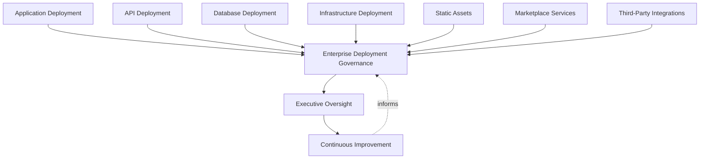
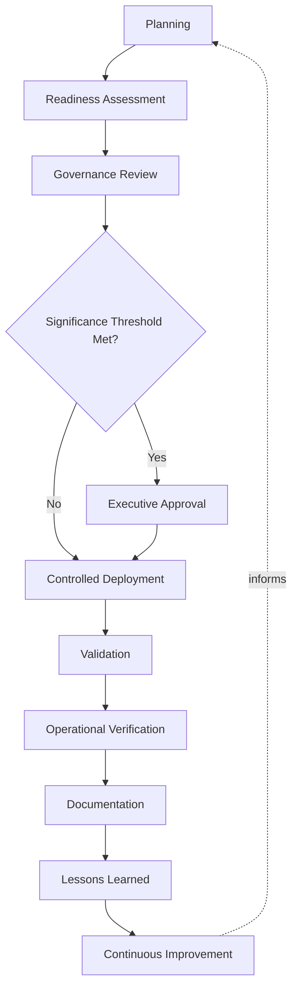
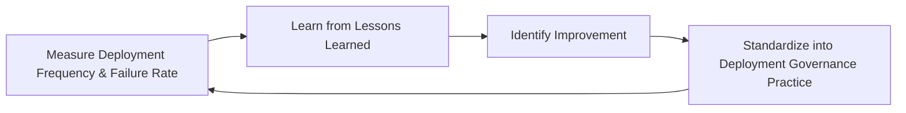
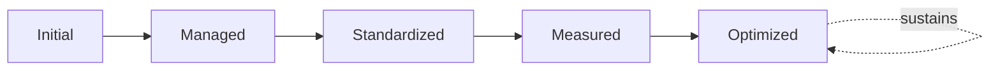

# Enterprise Deployment Governance Framework

## 1. Executive Summary

**Purpose** — This document defines the official Enterprise Deployment Governance Framework for **StackLeo Tech Store**. It establishes the governance, philosophy, release readiness discipline, environment strategy, operational resilience, business continuity alignment, and executive oversight under which deployment is governed as a deliberate, accountable enterprise discipline. `deployment-strategy.md` remains the operational deployment framework for `07_DevOps` — the document that elaborates deployment philosophy, lifecycle, deployment strategy patterns (rolling, blue-green, canary, progressive delivery, and related approaches), and safety practice in full operational depth. This framework sits above it as the highest-level executive mandate: it does not restate deployment mechanics or strategy selection detail, it establishes the accountability structure, governance model, and executive expectations that give deployment practice its authority across the whole organization.

**Scope** — This framework applies to every category of deployable change at StackLeo — application, API, database, infrastructure, static assets, marketplace services, and third-party integrations — across every environment from development through production and disaster recovery, for the full business lifecycle from the current B2C web platform through future mobile app, physical store, POS, corporate sales, wholesale, and multi-vendor marketplace expansion.

**Objectives** — To ensure deployment decisions are made deliberately by accountable people; that release readiness is genuinely confirmed before customer exposure; that environments are governed consistently; that deployment risk is identified and weighed before it is accepted; and that executive leadership has genuine, continuous visibility into deployment health and governance maturity.

**Business Value** — Governed deployment protects the operational reliability every customer transaction depends on, reduces the business cost and reputational risk of avoidable deployment failure, and gives leadership the confidence to pursue faster delivery cadence without accepting ungoverned risk.

**Intended Audience** — Executive leadership, the Chief Technology Officer, engineering and platform leadership, service owning teams, risk and compliance functions, and independent audit and oversight functions.

## 2. Enterprise Deployment Vision

- **Deployment Vision** — deployment at StackLeo is a routine, low-risk, fully governed event at any scale, never an occasion for organizational anxiety regardless of how frequently it occurs or how large the platform grows.
- **Strategic Objectives** — deployment governance exists to make delivery speed and operational safety mutually reinforcing, not competing goals, so the business can pursue growth and market expansion without trading away reliability.
- **Reliability Goals** — every deployment protects, rather than threatens, the platform's ability to serve customers correctly and consistently, consistent with the reliability principles governed in `sre-strategy.md`.
- **Scalability Goals** — deployment governance is defined independently of platform size, so it remains coherent as StackLeo grows from a single-market B2C platform toward multi-region, multi-channel, multi-vendor operation.
- **Operational Excellence** — deployment is treated as complete only once genuine operational health is confirmed, never merely once execution has finished, consistent with `09_Operations/operational-excellence-framework.md`.
- **Customer Experience** — deployment governance exists in direct service of protecting the customer's uninterrupted experience of the platform, consistent with the trust-centered brand commitment in `01_Business/vision.md`.
- **Business Continuity** — deployment safety practice is treated as a direct contributor to business continuity, coordinated with `09_Operations/business-continuity-governance.md`, not an independent technical concern.

### Enterprise Deployment Vision Matrix

| Vision Element | Focus | Business Value |
|---|---|---|
| Deployment Vision | Routine, low-risk, fully governed event at any scale | Removes deployment anxiety as the platform and organization grow |
| Strategic Objectives | Speed and safety as mutually reinforcing goals | Enables growth without trading away reliability |
| Reliability Goals | Every deployment protects customer-facing correctness | Sustains the reliability customers depend on |
| Scalability Goals | Governance defined independently of platform size | Remains coherent through multi-region, multi-channel growth |
| Operational Excellence | Deployment complete only once operational health confirmed | Prevents premature confidence in an unverified outcome |
| Customer Experience | Governance protects uninterrupted customer experience | Protects the trust-centered brand commitment |
| Business Continuity | Deployment safety as a direct continuity contributor | Connects technical safety practice to business resilience |

## 3. Deployment Principles

Deployment governance at StackLeo rests on nine principles, each producing a specific business outcome.

- **Reliability First** — the reliability of the running platform takes precedence over the convenience or speed of any individual deployment. *Business Value:* protects the operational trust every customer transaction depends on.
- **Governance Before Deployment** — the accountability structure for a deployment is established before it is executed, never inferred after the fact. *Business Value:* ensures deployment proceeds because a genuine, governed decision called for it.
- **Controlled Change** — every deployment is a deliberate, bounded, well-understood change, never an uncontrolled or improvised event. *Business Value:* keeps the consequence of any single deployment predictable and contained.
- **Risk Awareness** — the scrutiny a deployment receives is proportionate to its genuine potential impact. *Business Value:* directs governance attention where a deployment failure would matter most.
- **Security by Design** — deployment governance treats security posture as a first-class deployment concern, coordinated with `devsecops-strategy.md`, not a separate afterthought. *Business Value:* prevents deployment from becoming an unmonitored path around security discipline.
- **Traceability** — every deployment is traceable to its authorizing decision, its artifact, and its outcome. *Business Value:* supports accountability, audit, and confident investigation when something goes wrong.
- **Accountability** — every deployable service and every deployment decision traces to a specific, named, responsible owner. *Business Value:* ensures no deployment occurs without someone genuinely responsible for its outcome.
- **Operational Stability** — deployment governance exists to protect the stability the business depends on to operate, never to be the source of its own disruption. *Business Value:* protects continuity of service through periods of active, ongoing change.
- **Continuous Improvement** — deployment governance practice matures over time, informed by real deployment outcomes and organizational growth. *Business Value:* keeps deployment governance aligned with the platform's growing scale and complexity.

### Deployment Principles Matrix

| Principle | Description | Business Value |
|---|---|---|
| Reliability First | Platform reliability takes precedence over deployment convenience | Protects the operational trust every transaction depends on |
| Governance Before Deployment | Accountability established before execution | Ensures deployment proceeds on a genuine, governed decision |
| Controlled Change | Every deployment is deliberate, bounded, well-understood | Keeps consequence predictable and contained |
| Risk Awareness | Scrutiny proportionate to genuine potential impact | Directs governance attention where it matters most |
| Security by Design | Security posture treated as a first-class deployment concern | Prevents deployment from bypassing security discipline |
| Traceability | Every deployment traceable to decision, artifact, outcome | Supports accountability, audit, and investigation |
| Accountability | Every service and decision traces to a named owner | Ensures no deployment occurs without genuine responsibility |
| Operational Stability | Governance protects the stability the business depends on | Protects continuity of service through active change |
| Continuous Improvement | Practice matures from real deployment outcomes | Keeps governance aligned with growing scale and complexity |

## 4. Enterprise Deployment Governance

Deployment is governed across seven conceptual domains, each requiring distinct governance emphasis. Every domain here is elaborated in operational depth in `deployment-strategy.md`.

### Application Deployment

- **Purpose** — govern the deployment of the platform's core application capability.
- **Governance Scope** — oversight of application deployment safety and readiness, coordinated with `ci-cd-strategy.md` and `release-management.md`.
- **Business Value** — protects the primary customer-facing capability the business depends on for revenue.
- **Executive Expectations** — leadership expects application deployments to be governed with the highest consistency of any deployment category.

### API Deployment

- **Purpose** — govern the deployment of interfaces consumed by internal components and external integration partners.
- **Governance Scope** — oversight coordinated with Integration Test Automation (`08_Quality_Assurance/test-automation-governance.md`) and platform integration boundaries.
- **Business Value** — protects the contracts other systems and partners rely on to interact correctly with StackLeo.
- **Executive Expectations** — leadership expects API deployment governance to explicitly account for compatibility with existing consumers.

### Database Deployment

- **Purpose** — govern the deployment of schema and data-layer change.
- **Governance Scope** — oversight coordinated with `configuration-management.md`, given the elevated and often irreversible consequence of data-layer error.
- **Business Value** — protects the integrity of the business's most consequential and hardest-to-recover asset — its data.
- **Executive Expectations** — leadership expects database deployments to receive the strictest governance rigor in this model.

### Infrastructure Deployment

- **Purpose** — govern the deployment of the platform's underlying technical infrastructure.
- **Governance Scope** — oversight coordinated with `infrastructure-as-code.md` and `platform-engineering.md`.
- **Business Value** — protects the technical foundation every other deployment category ultimately depends on.
- **Executive Expectations** — leadership expects infrastructure deployment governance to be exercised with consistent rigor regardless of scale.

### Static Assets

- **Purpose** — govern the deployment of customer-facing static content and assets.
- **Governance Scope** — oversight ensuring static asset deployment meets the same accountability standard as dynamic application deployment.
- **Business Value** — protects the customer's direct, first-impression experience of the platform.
- **Executive Expectations** — leadership expects static asset deployment to never be treated as low-consequence simply because it is technically simple.

### Marketplace Services

- **Purpose** — govern the deployment of the platform's sales and, eventually, multi-vendor marketplace capability.
- **Governance Scope** — oversight structured ahead of the marketplace model's launch, coordinated with future service-owning teams.
- **Business Value** — protects the durability of the platform's core and future revenue-generating function.
- **Executive Expectations** — leadership expects marketplace service deployment to receive the highest business-criticality governance priority.

### Third-Party Integrations

- **Purpose** — govern the deployment of change affecting integration with external vendors and partners.
- **Governance Scope** — oversight coordinated with third-party risk practice defined elsewhere in this repository.
- **Business Value** — protects the business from disruption introduced through a dependency it does not directly control.
- **Executive Expectations** — leadership expects third-party integration deployment to be governed with the same rigor as internal deployment.

### Deployment Governance Matrix

| Domain | Purpose | Business Value | Executive Expectations |
|---|---|---|---|
| Application Deployment | Govern deployment of core application capability | Protects the primary customer-facing revenue capability | Highest consistency of any deployment category |
| API Deployment | Govern deployment of consumed interfaces | Protects contracts partners and systems rely on | Explicit accounting for consumer compatibility |
| Database Deployment | Govern deployment of schema and data-layer change | Protects the integrity of the business's hardest-to-recover asset | Strictest governance rigor in this model |
| Infrastructure Deployment | Govern deployment of underlying technical infrastructure | Protects the technical foundation every category depends on | Consistent rigor regardless of scale |
| Static Assets | Govern deployment of customer-facing static content | Protects the customer's first-impression experience | Never treated as low-consequence for being simple |
| Marketplace Services | Govern deployment of sales and marketplace capability | Protects the core and future revenue-generating function | Highest business-criticality priority |
| Third-Party Integrations | Govern deployment affecting external dependencies | Protects against disruption not directly controlled | Same rigor as internal deployment |

*Diagram 1: Enterprise Deployment Governance Framework — every deployment domain converges on the enterprise deployment governance model, resolving into executive oversight and continuous improvement that feeds back into governance across every domain.*

## 5. Enterprise Deployment Lifecycle

Deployment governance operates across ten conceptual lifecycle stages.

- **Planning** — *Objective:* determine what will be deployed, to which environment, and under what conditions, before any execution activity is authorized.
- **Readiness Assessment** — *Objective:* confirm the artifact, environment, and organization are genuinely prepared, consistent with `08_Quality_Assurance/testing-governance.md` release quality evidence.
- **Governance Review** — *Objective:* confirm the planned deployment has been reviewed against the appropriate governance domain in Section 4.
- **Executive Approval** — *Objective:* secure explicit executive authorization for any deployment meeting a defined significance threshold.
- **Controlled Deployment** — *Objective:* carry out the deployment through a consistent, governed process, executed the same way every time.
- **Validation** — *Objective:* confirm the deployed change is genuinely present and functioning as intended immediately following execution.
- **Operational Verification** — *Objective:* confirm sustained operational health over a meaningful period following deployment, not only at the moment of execution.
- **Documentation** — *Objective:* maintain a complete, accurate record of what was deployed, why, and with what outcome.
- **Lessons Learned** — *Objective:* formally capture what the deployment reveals about governance itself, regardless of whether it succeeded without incident.
- **Continuous Improvement** — *Objective:* apply captured lessons to strengthen future deployment governance practice.

### Deployment Lifecycle Matrix

| Stage | Objective | Business Value |
|---|---|---|
| Planning | Determine what, where, and under what conditions | Ensures deliberate, traceable deployment intent |
| Readiness Assessment | Confirm genuine artifact, environment, organizational readiness | Surfaces gaps before deployment-time failure |
| Governance Review | Confirm review against the appropriate governance domain | Ensures every deployment is reviewed by the accountable function |
| Executive Approval | Secure explicit authorization above significance thresholds | Ensures the most consequential deployments carry genuine sign-off |
| Controlled Deployment | Execute through a consistent, governed process | Makes deployment routine and predictable |
| Validation | Confirm the change is genuinely present and functioning | Catches deployment-specific issues immediately |
| Operational Verification | Confirm sustained health over a meaningful period | Catches issues only visible under real, sustained conditions |
| Documentation | Maintain a complete, accurate record | Preserves a genuine, trustworthy record of outcome |
| Lessons Learned | Capture what the deployment reveals about governance | Converts every deployment into organizational learning |
| Continuous Improvement | Apply lessons to strengthen future governance | Keeps practice aligned with growing scale and complexity |

*Diagram 2: Enterprise Deployment Lifecycle — planning and readiness assessment inform governance review, escalating to executive approval only where thresholds are met before controlled deployment, validation, and operational verification, with documentation and lessons learned feeding continuous improvement back into the cycle.*

## 6. Environment Strategy

Environment governance is described conceptually across seven environment categories, each serving a distinct purpose in the path from development to production and recovery.

- **Development** — the environment in which change is actively authored and initially exercised; governed for developer productivity with minimal deployment ceremony.
- **Testing** — the environment in which verification defined in `08_Quality_Assurance/testing-governance.md` is exercised in a controlled, repeatable setting.
- **Staging** — the environment that most closely mirrors production configuration, used to validate deployment behavior before customer exposure.
- **Pre-Production** — a final, production-representative checkpoint reserved for the highest-confidence validation immediately ahead of release.
- **Production** — the environment in which customers directly experience the platform; governed with the highest deployment rigor of any environment.
- **Sandbox** — an isolated environment used for experimentation and integration exploration without risk to any governed environment.
- **Disaster Recovery** — the environment maintained to restore service in the event production becomes unavailable, coordinated with `disaster-recovery.md` and `09_Operations/business-continuity-governance.md`.

### Environment Governance Matrix

| Environment | Purpose | Governance Emphasis |
|---|---|---|
| Development | Active authoring and initial exercise of change | Productivity-focused, minimal deployment ceremony |
| Testing | Controlled, repeatable verification | Consistency with defined testing governance |
| Staging | Mirror production configuration ahead of release | Deployment behavior validation before exposure |
| Pre-Production | Final, production-representative checkpoint | Highest-confidence validation immediately before release |
| Production | Direct customer experience of the platform | Highest deployment rigor of any environment |
| Sandbox | Experimentation and integration exploration | Isolated from any governed environment |
| Disaster Recovery | Restoration of service after production disruption | Coordinated with continuity and recovery governance |

*Diagram 4: Environment Relationship Diagram — change progresses from development through testing, staging, and pre-production toward production, with sandbox available as isolated exploration and disaster recovery standing ready to restore production should it become unavailable.*

## 7. Deployment Risk Governance

Deployment risk is governed across seven conceptual categories, each weighted proportionate to genuine consequence, consistent with `06_Security/enterprise-risk-management-strategy.md`.

- **Business Risks** — the risk that a deployment disrupts revenue-generating capability or a genuine business commitment.
- **Technical Risks** — the risk that a deployment introduces instability, defects, or incompatibility into the running platform.
- **Operational Risks** — the risk that a deployment cannot be adequately operated, supported, or recovered once live.
- **Security Risks** — the risk that a deployment introduces or exposes a genuine security weakness, governed jointly with `06_Security/security-governance.md`.
- **Compliance Risks** — the risk that a deployment fails to meet a genuine regulatory or contractual obligation.
- **Vendor Risks** — the risk introduced through a deployment's dependency on a third-party vendor or integration partner.
- **Customer Impact** — the risk that a deployment produces a genuine, negative effect on the customer's experience of the platform.

### Risk Governance Matrix

| Risk Category | Focus | Governance Coordination |
|---|---|---|
| Business Risks | Disruption to revenue-generating capability | Coordinated with enterprise risk management |
| Technical Risks | Instability, defects, or incompatibility | Coordinated with testing and release quality governance |
| Operational Risks | Inadequate ability to operate or recover | Coordinated with operational excellence and readiness practice |
| Security Risks | Introduced or exposed security weakness | Coordinated with `06_Security/security-governance.md` |
| Compliance Risks | Failure to meet regulatory or contractual obligation | Coordinated with compliance governance |
| Vendor Risks | Dependency on third-party vendors or partners | Coordinated with third-party risk governance |
| Customer Impact | Genuine, negative effect on customer experience | Coordinated with customer experience governance |

## 8. Executive Oversight

- **Executive Reviews** — the overall coherence of deployment governance is formally reviewed on a regular cadence.
- **Release Readiness Reviews** — executive leadership reviews the organization's readiness to activate significant deployments, coordinated with `release-management.md`.
- **Governance Reporting** — aggregated deployment health — deployment frequency, failure rate, rollback incidence — is reported to executive leadership and the Board.
- **Deployment Health Reviews** — sustained operational health following deployment is reviewed as a distinct, ongoing concern, not assumed from successful execution alone.
- **Continuous Improvement Reviews** — the organization's follow-through on captured deployment lessons is reviewed directly with executive leadership.

### Executive Oversight Matrix

| Oversight Mechanism | Purpose | Governance Role |
|---|---|---|
| Executive Reviews | Confirm overall deployment governance coherence | Regular, predictable cadence for the framework as a whole |
| Release Readiness Reviews | Review readiness to activate significant deployments | Direct executive-level review of release decision rigor |
| Governance Reporting | Provide leadership a single, coherent deployment picture | Reports frequency, failure rate, rollback incidence |
| Deployment Health Reviews | Review sustained operational health post-deployment | Treats health as ongoing, not assumed from execution alone |
| Continuous Improvement Reviews | Review follow-through on captured lessons | Direct executive-level review of improvement completion |

## 9. Future Readiness

This framework is designed to remain valid as StackLeo evolves in scale, geography, and organizational complexity.

- **AI-Assisted Operations** — as deployment monitoring and readiness assessment increasingly incorporate AI-assisted analysis, they remain governed under the same rigor as any other method.
- **Intelligent Deployment Governance** — where deployment risk evaluation increasingly draws on intelligent pattern analysis, that analysis remains subject to the same Risk Governance (Section 7) as any other evaluation method.
- **Progressive Delivery (Conceptual)** — as gradual, staged exposure practice matures, it remains governed under the same lifecycle and risk principles defined in this framework, elaborated operationally in `deployment-strategy.md`.
- **Enterprise Scale** — the governance model, domains, and lifecycle defined throughout this framework are defined independently of organizational size.
- **Multi-Region Deployment** — Environment Strategy (Section 6) and Deployment Governance (Section 4) are structured to extend coherently as StackLeo expands from Bangladesh into South Asia and global markets.
- **Digital Transformation** — this framework's governance discipline is treated as a direct enabler of digital transformation, ensuring transformation proceeds deliberately rather than chaotically.
- **Global Expansion** — deployment governance remains coherent as the business model extends into corporate sales, wholesale, and multi-vendor marketplace operation.

## 10. Deployment Maturity Model

Deployment governance maturity is described across five conceptual levels.

- **Initial** — deployment governance, where it exists, is informal and inconsistent; deployments proceed reactively, and ownership is unclear.
- **Managed** — basic deployment governance exists for individual domains, but consistency across the seven domains in Section 4 varies significantly.
- **Standardized** — the governance model, domains, and lifecycle are standardized, documented, and consistently applied across the organization.
- **Measured** — deployment frequency, failure rate, and recovery outcomes are measured systematically, and decisions are grounded in genuine evidence.
- **Optimized** — deployment governance is continuously and deliberately improved based on quantitative evidence and organizational learning; improvement itself is a managed, ongoing discipline.

### Deployment Maturity Matrix

| Level | Characteristics | Primary Focus |
|---|---|---|
| Initial | Informal, inconsistent governance; deployments proceed reactively | Ad hoc, individually-dependent deployment practice |
| Managed | Basic governance exists per domain; consistency varies | Domain-level consistency |
| Standardized | Standardized governance model, domains, and lifecycle | Organization-wide consistency and clear ownership |
| Measured | Frequency, failure rate, and recovery measured systematically | Evidence-based deployment governance decisions |
| Optimized | Practice continuously and deliberately improved from evidence | Sustained, deliberate improvement as a discipline |

*Diagram 5: Continuous Deployment Improvement Cycle — deployment outcomes are measured, learned from, improved upon, and standardized back into governed practice, on a continuing basis.*

*Diagram 6: Deployment Maturity Model — maturity advances from informal, reactive deployment practice toward standardized, measured, and continuously optimized deployment governance.*

## 11. Governance Anti-Patterns

- **Deployments Without Governance** — deployment proceeding without genuine governance leaves no accountable record of why it occurred or who authorized it.
- **Weak Ownership** — a deployable service without a clearly accountable owner has no one genuinely responsible for its deployment safety.
- **Environment Drift** — environments that silently diverge from their intended configuration undermine the reliability of every deployment validated against them.
- **Reactive Releases** — treating deployment governance as adequate only until an incident proves otherwise means avoidable failures, not deliberate design, drive improvement.
- **Manual Dependency** — reliance on manual, person-executed deployment steps introduces variance, error, and dependency on individual availability.
- **Poor Documentation** — allowing deployment records to diverge from actual outcomes makes investigation and future governance decisions unreliable.
- **Risk-Blind Decisions** — proceeding with deployment without genuine risk evaluation accepts avoidable exposure.
- **Missing Continuous Learning** — treating current deployment practice as a permanently finished state guarantees it falls behind the platform's growing scale and complexity.

### Anti-Pattern Summary

| Anti-Pattern | Why It's Avoided |
|---|---|
| Deployments Without Governance | Leaves no accountable record of why a deployment occurred or who authorized it |
| Weak Ownership | Leaves no one genuinely responsible for deployment safety |
| Environment Drift | Undermines the reliability of validation performed against a diverged environment |
| Reactive Releases | Lets avoidable failures, rather than deliberate design, drive improvement |
| Manual Dependency | Introduces variance, error, and dependency on individual availability |
| Poor Documentation | Makes investigation and future governance decisions unreliable |
| Risk-Blind Decisions | Accepts avoidable exposure by proceeding without genuine risk evaluation |
| Missing Continuous Learning | Guarantees practice falls behind growing scale and complexity |

## 12. Related Documents

| Document | Relationship |
|---|---|
| DevOps Governance (`devops-principles.md`, `devops-overview.md`) | Establishes the broader DevOps philosophy this framework applies specifically to deployment. |
| Release Management (`release-management.md`) | Governs the business timing decision this framework's Executive Approval (Section 5) depends on. |
| Environment Governance (`environment-management.md`) | Elaborates environment practice in operational depth beyond the conceptual strategy in Section 6. |
| Configuration Management (`configuration-management.md`) | Governs the configuration state this framework's Database and Infrastructure Deployment domains depend on. |
| CI/CD Governance (`ci-cd-strategy.md`) | Governs the broader path from commit to production this framework's deployment governance sits within. |
| Deployment Risk Governance (Section 7 of this document, coordinated with `06_Security/enterprise-risk-management-strategy.md`) | Connects deployment-specific risk to the enterprise risk framework. |
| Business Continuity (`09_Operations/business-continuity-governance.md`) | Governs the broader continuity discipline this framework's disaster recovery environment strategy connects to. |
| Testing Strategy (`08_Quality_Assurance/testing-strategy.md`, `testing-governance.md`) | Provides the release readiness evidence this framework's Readiness Assessment (Section 5) depends on. |

## 13. Document Information

| Property | Value |
|----------|-------|
| Document | deployment-governance.md |
| Version | 1.0.0 |
| Status | Active |
| Maintained By | StackLeo |
| Last Updated | 2026-07-24 |

---

© StackLeo. All Rights Reserved.
