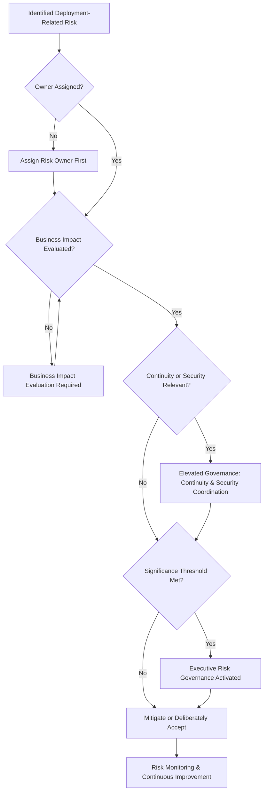
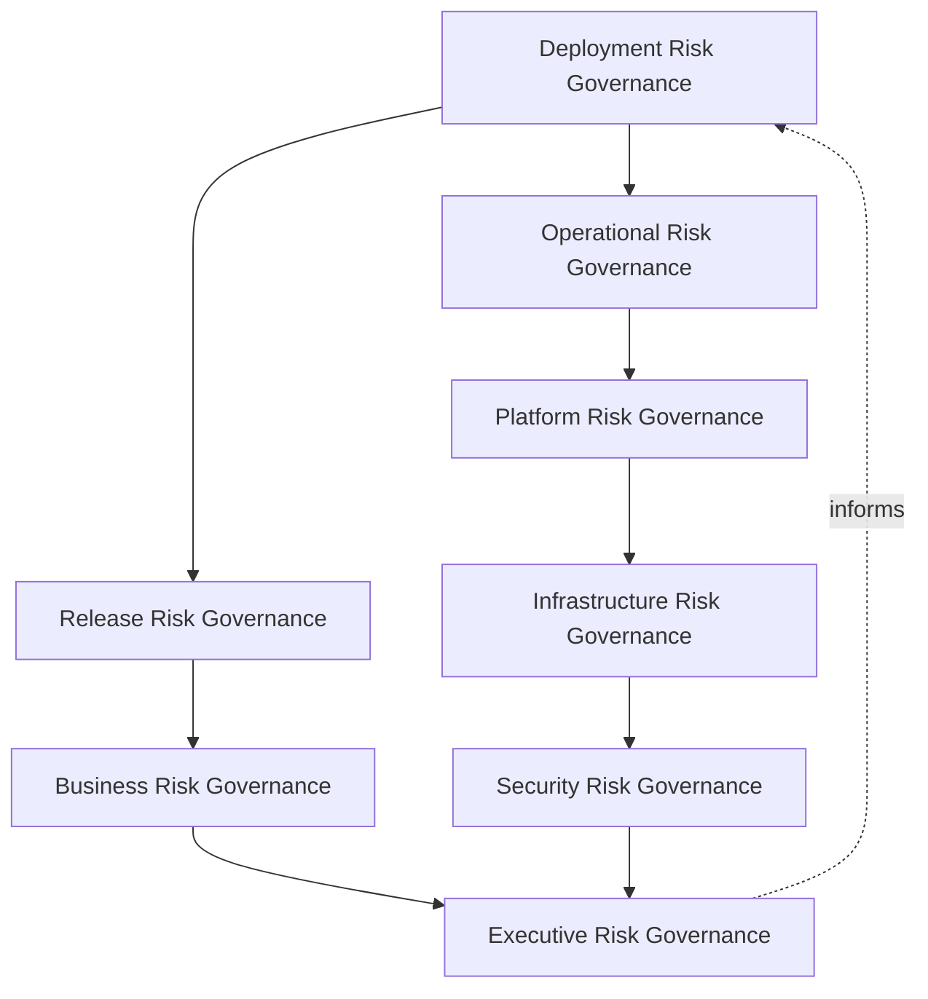
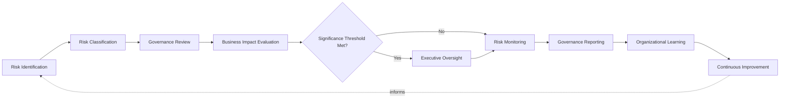
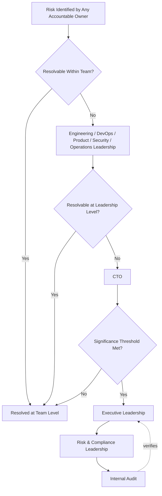
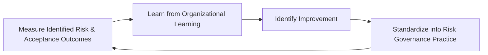
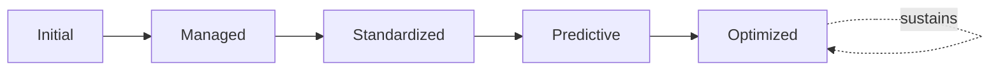

# Enterprise Deployment Risk Governance Framework

## 1. Executive Summary

**Purpose** — This document defines the official Enterprise Deployment Risk Governance Framework for **StackLeo Tech Store**. It establishes deployment risk governance, release risk oversight, operational resilience, business continuity alignment, organizational accountability, executive risk visibility, and continuous risk improvement as a deliberate, accountable enterprise discipline. Risk governance for deployment and delivery is already referenced across `deployment-governance.md` (Section 7), `release-management-governance.md` (Section 8), `ci-cd-governance.md` (Section 8), `environment-governance.md` (Section 8), and `configuration-management-governance.md` (Section 8) — each defining risk categories specific to its own domain. This framework does not restate or replace any of those. It is the dedicated, enterprise-wide capstone that synthesizes deployment- and delivery-related risk into a single, coherent governance discipline, and it is the delivery-specific instantiation of `06_Security/enterprise-risk-management-strategy.md` (Section 3.2, Operational Risk Governance), giving deployment risk the full, dedicated executive treatment it has so far only received as a subordinate section of other documents.

**Scope** — This framework applies to every category of risk arising from deployment and delivery activity at StackLeo — business, operational, technical, deployment, release, security, compliance, third-party dependency, customer experience, and reputational risk — across every environment, release type, and delivery domain governed elsewhere in `07_DevOps`.

**Strategic Objectives** — To ensure deployment-related risk is genuinely identified and weighed before it is accepted; that risk acceptance is always a deliberate, accountable decision, never a silent default; that operational resilience and business continuity are protected through every deployment; and that executive leadership has continuous, honest visibility into the organization's deployment risk posture.

**Business Value** — Governed deployment risk management protects the business from the disproportionate cost of avoidable deployment failure, gives leadership the confidence to pursue faster delivery cadence without accepting ungoverned exposure, and ensures the organization's growing delivery frequency is matched by proportionate, deliberate risk discipline.

**Intended Audience** — Executive leadership, the Chief Technology Officer, engineering and DevOps leadership, product leadership, security leadership, operations leadership, risk and compliance leadership, and internal audit.

## 2. Enterprise Deployment Risk Strategy

- **Deployment Risk Vision** — every deployment-related risk at StackLeo is identified, weighed, and either mitigated or deliberately accepted by an accountable owner, never left unexamined.
- **Enterprise Risk Awareness** — deployment risk is understood as a genuine subset of enterprise risk, connected directly to `06_Security/enterprise-risk-management-strategy.md`, never treated as an isolated technical concern.
- **Operational Resilience** — this framework exists to ensure the organization's ability to withstand and recover from a deployment-related disruption, coordinated with `sre-strategy.md`.
- **Business Continuity Alignment** — deployment risk governance is treated as a direct contributor to business continuity, coordinated with `09_Operations/business-continuity-governance.md` and `disaster-recovery.md`.
- **Governance Objectives** — this framework exists to ensure risk decisions are made deliberately, by accountable people, against a consistent framework, never left to accumulate as ad hoc, undocumented judgment calls.
- **Executive Decision Support** — this framework exists to give executive leadership the genuine, evidence-based understanding of deployment risk their investment, prioritization, and expansion decisions depend on.

### Enterprise Deployment Risk Strategy Matrix

| Strategy Element | Focus | Business Value |
|---|---|---|
| Deployment Risk Vision | Every risk identified, weighed, mitigated or deliberately accepted | Ensures no deployment risk goes unexamined |
| Enterprise Risk Awareness | Deployment risk as a genuine subset of enterprise risk | Connects technical risk decisions to the broader risk framework |
| Operational Resilience | Protects the ability to withstand and recover from disruption | Sustains reliability through active, ongoing deployment |
| Business Continuity Alignment | Deployment risk governance as a continuity contributor | Connects technical risk decisions to business resilience |
| Governance Objectives | Risk decisions made deliberately, by accountable people | Prevents accumulation of undocumented, ad hoc risk judgment |
| Executive Decision Support | Gives leadership genuine, evidence-based risk understanding | Informs investment, prioritization, and expansion decisions |

## 3. Deployment Risk Governance Principles

Deployment risk governance at StackLeo rests on nine principles, each producing a specific business outcome.

- **Governance Before Deployment** — the risk accountability structure for a deployment is established before it is executed, never inferred after the fact. *Business Value:* ensures deployment proceeds because a genuine, governed risk decision called for it.
- **Risk-Based Decision Making** — the scrutiny a deployment receives is proportionate to its genuine potential risk. *Business Value:* directs governance attention where a deployment failure would matter most.
- **Business Continuity First** — deployment risk decisions are weighed first against their effect on the business's ability to continue operating. *Business Value:* keeps risk governance connected to the organization's most fundamental obligation to its customers.
- **Accountability** — every identified deployment risk traces to a specific, named, responsible owner. *Business Value:* ensures no risk is left to drift without someone genuinely responsible for its disposition.
- **Transparency** — deployment risk status, decisions, and acceptance are documented and visible to those who genuinely need them. *Business Value:* allows deployment risk posture to be scrutinized and defended, not merely asserted.
- **Traceability** — every risk decision traces to the specific evidence and reasoning that produced it. *Business Value:* supports accountability, audit, and confident investigation when something goes wrong.
- **Controlled Change** — deployment proceeds only as a deliberate, bounded, well-understood change. *Business Value:* keeps the consequence of any single deployment predictable and contained.
- **Operational Stability** — deployment risk governance exists to protect the stability the business depends on to operate. *Business Value:* protects continuity of service through periods of active, ongoing change.
- **Continuous Improvement** — deployment risk governance practice matures over time, informed by real risk outcomes. *Business Value:* keeps risk governance aligned with the organization's growing scale and complexity.

### Deployment Risk Governance Principles Matrix

| Principle | Description | Business Value |
|---|---|---|
| Governance Before Deployment | Risk accountability established before execution | Ensures deployment proceeds on a genuine, governed decision |
| Risk-Based Decision Making | Scrutiny proportionate to genuine potential risk | Directs governance attention where it matters most |
| Business Continuity First | Risk decisions weighed first against continuity effect | Connects governance to the organization's fundamental obligation |
| Accountability | Every identified risk traces to a specific, named, responsible owner | Ensures no risk drifts without genuine responsibility |
| Transparency | Status, decisions, and acceptance documented and visible | Allows risk posture to be scrutinized and defended |
| Traceability | Every decision traces to the evidence and reasoning behind it | Supports accountability, audit, and investigation |
| Controlled Change | Deployment proceeds only as a deliberate, bounded change | Keeps consequence predictable and contained |
| Operational Stability | Governance protects the stability the business depends on | Protects continuity of service through active change |
| Continuous Improvement | Practice matures from real risk outcomes | Keeps governance aligned with growing scale and complexity |

*Diagram 3: Enterprise Risk Governance Decision Flow — an identified risk is checked for assigned ownership and evaluated business impact, with elevated coordination applied where continuity or security relevance is present, escalating to executive risk governance upon meeting significance thresholds, resolving into a deliberate mitigation or acceptance decision and ongoing monitoring.*

## 4. Enterprise Deployment Risk Governance Model

Deployment risk governance operates across eight conceptual layers, each holding accountability for a distinct dimension of risk. Every layer here synthesizes, and does not duplicate, the risk sections already present in `deployment-governance.md`, `release-management-governance.md`, `ci-cd-governance.md`, `environment-governance.md`, and `configuration-management-governance.md`.

### Deployment Risk Governance

- **Purpose** — own the overall coherence of how deployment-specific risk is identified and governed, synthesizing `deployment-governance.md` (Section 7).
- **Governance Scope** — oversight spanning every layer in this model and every domain in Section 5.
- **Business Value** — ensures deployment risk is governed as a single coherent discipline, not fragmented across documents.
- **Executive Expectations** — leadership trusts no deployment risk exists outside this framework's visibility.

### Release Risk Governance

- **Purpose** — own the coherence of how release-specific risk is identified and governed, synthesizing `release-management-governance.md` (Section 8).
- **Governance Scope** — oversight of business, technical, and customer impact risk tied to the release decision.
- **Business Value** — ensures release risk is weighed consistently regardless of release type.
- **Executive Expectations** — leadership trusts release risk is genuinely evaluated before authorization, not assumed acceptable.

### Operational Risk Governance

- **Purpose** — own the coherence of how deployment risk affecting the organization's ability to operate is governed.
- **Governance Scope** — oversight coordinated with `09_Operations/operations-governance-strategy.md` and Operational Risk Governance (`06_Security/enterprise-risk-management-strategy.md`, Section 3.2).
- **Business Value** — ensures deployment risk affecting sustained operation is genuinely understood before acceptance.
- **Executive Expectations** — leadership trusts operational risk is weighed as seriously as technical risk.

### Platform Risk Governance

- **Purpose** — own the coherence of how risk introduced through shared platform capability is governed.
- **Governance Scope** — oversight coordinated with `platform-engineering.md` and Platform Governance (`devops-governance-framework.md`, Section 4).
- **Business Value** — ensures a platform-level risk is never treated as a single team's isolated concern.
- **Executive Expectations** — leadership trusts platform risk is escalated with awareness of its broad dependency footprint.

### Infrastructure Risk Governance

- **Purpose** — own the coherence of how risk introduced through the platform's underlying technical foundation is governed.
- **Governance Scope** — oversight coordinated with `infrastructure-as-code.md` and `environment-governance.md` (Section 8).
- **Business Value** — protects the technical foundation every other risk domain ultimately depends on.
- **Executive Expectations** — leadership trusts infrastructure risk is governed with consistent rigor regardless of scale.

### Security Risk Governance

- **Purpose** — own the coherence of how deployment-related security risk is governed jointly with, and never superseding, `06_Security/security-governance.md`.
- **Governance Scope** — oversight of Security Risk (`06_Security/enterprise-risk-management-strategy.md`, Section 3.4) as it applies specifically to deployment activity.
- **Business Value** — protects StackLeo's core trust differentiator through deployment-aware security risk discipline.
- **Executive Expectations** — leadership expects security risk to carry mandatory, non-negotiable weight in every deployment decision.

### Business Risk Governance

- **Purpose** — own the coherence of how deployment-related risk to genuine business value and commercial outcome is governed.
- **Governance Scope** — oversight coordinated with `01_Business/business-model.md` and Strategic Risk Governance (`06_Security/enterprise-risk-management-strategy.md`, Section 3.1).
- **Business Value** — ensures deployment decisions never inadvertently trade away genuine business value for technical convenience.
- **Executive Expectations** — leadership expects business risk to be weighed alongside technical risk, not subordinated to it.

### Executive Risk Governance

- **Purpose** — own executive-level accountability for the deployment risks carrying the greatest organizational consequence.
- **Governance Scope** — oversight spanning Sections 4.1–4.7 wherever a risk rises to genuine executive concern, consistent with Executive Risk Governance (`06_Security/enterprise-risk-management-strategy.md`, Section 3.7).
- **Business Value** — ensures the most consequential deployment risk is visible at the level accountable for the organization as a whole.
- **Executive Expectations** — leadership expects to be informed of, not surprised by, the organization's most significant accepted deployment risk.

### Deployment Risk Governance Matrix

| Layer | Purpose | Business Value | Executive Expectations |
|---|---|---|---|
| Deployment Risk Governance | Own overall coherence of deployment-specific risk | Ensures risk is a single coherent discipline, not fragmented | Trusts no deployment risk exists outside this framework |
| Release Risk Governance | Own coherence of release-specific risk | Ensures risk is weighed consistently regardless of release type | Trusts risk is genuinely evaluated before authorization |
| Operational Risk Governance | Own coherence of risk affecting the ability to operate | Ensures risk to sustained operation is genuinely understood | Trusts operational risk is weighed as seriously as technical |
| Platform Risk Governance | Own coherence of risk from shared platform capability | Ensures platform-level risk is never isolated to one team | Trusts risk is escalated with awareness of broad dependency |
| Infrastructure Risk Governance | Own coherence of risk from the technical foundation | Protects the foundation every risk domain depends on | Trusts governance with consistent rigor regardless of scale |
| Security Risk Governance | Own coherence of deployment-related security risk | Protects StackLeo's core trust differentiator | Expects mandatory, non-negotiable weight in every decision |
| Business Risk Governance | Own coherence of risk to genuine business value | Prevents trading away business value for technical convenience | Expects business risk weighed alongside technical risk |
| Executive Risk Governance | Own executive accountability for highest-consequence risk | Ensures the most consequential risk is visible to leadership | Expects leadership informed of, not surprised by, accepted risk |

*Diagram 1: Enterprise Deployment Risk Governance Framework — deployment risk governance branches into release and operational risk governance, converging through business, platform, infrastructure, and security risk governance on executive risk governance, which feeds back into the model.*

## 5. Deployment Risk Domains

Deployment risk is governed across ten conceptual domains, each requiring a distinct governance emphasis.

- **Business Risks** — the risk that a deployment fails to deliver, or actively undermines, genuine business value.
- **Operational Risks** — the risk that a deployment cannot be adequately operated, supported, or recovered once live.
- **Technical Risks** — the risk that a deployment introduces instability, defects, or incompatibility into the running platform.
- **Deployment Risks** — the risk inherent to the technical act of putting change into a running environment.
- **Release Risks** — the risk associated with the business decision and timing of exposing change to customers.
- **Security Risks** — the risk that a deployment introduces or exposes a genuine security weakness.
- **Compliance Risks** — the risk that a deployment fails to meet a genuine regulatory or contractual obligation.
- **Third-Party Dependency Risks** — the risk introduced through a deployment's dependency on a vendor or integration partner.
- **Customer Experience Risks** — the risk that a deployment produces a genuine, negative effect on the customer's experience of the platform.
- **Reputational Risks** — the risk that a deployment's failure or mishandling damages StackLeo's standing with customers, partners, or the market.

### Risk Domain Matrix

| Domain | Focus | Governance Coordination |
|---|---|---|
| Business Risks | Failure to deliver, or actively undermining, business value | Coordinated with Business Risk Governance (Section 4) |
| Operational Risks | Inadequate ability to operate, support, or recover | Coordinated with Operational Risk Governance (Section 4) |
| Technical Risks | Instability, defects, or incompatibility | Coordinated with `ci-cd-governance.md` (Section 8) |
| Deployment Risks | Risk inherent to the technical act of deployment | Coordinated with `deployment-governance.md` (Section 7) |
| Release Risks | Risk associated with the business release decision | Coordinated with `release-management-governance.md` (Section 8) |
| Security Risks | Introduced or exposed security weakness | Coordinated with `06_Security/security-governance.md` |
| Compliance Risks | Failure to meet regulatory or contractual obligation | Coordinated with `06_Security/compliance-governance.md` |
| Third-Party Dependency Risks | Dependency on vendors or integration partners | Coordinated with `06_Security/third-party-risk-governance.md` |
| Customer Experience Risks | Genuine, negative effect on customer experience | Coordinated with customer experience governance |
| Reputational Risks | Damage to standing with customers, partners, market | Coordinated with Executive Risk Governance (Section 4) |

## 6. Deployment Risk Lifecycle

Deployment risk governance operates across nine conceptual lifecycle stages.

- **Risk Identification** — govern how a genuine deployment-related risk is recognized.
- **Risk Classification** — govern how an identified risk is assigned to the appropriate domain in Section 5.
- **Governance Review** — govern how a classified risk is reviewed against the appropriate layer in Section 4.
- **Business Impact Evaluation** — govern how a risk's genuine business, customer, and financial impact is evaluated.
- **Executive Oversight** — govern the point at which a risk requires executive-level visibility or decision.
- **Risk Monitoring** — govern how an accepted or mitigated risk is continuously observed for change in its genuine severity.
- **Governance Reporting** — govern how risk status is communicated to those who genuinely need it.
- **Organizational Learning** — govern how a realized or near-miss risk deepens the organization's genuine understanding.
- **Continuous Improvement** — govern how accumulated lessons strengthen future risk governance.

### Risk Lifecycle Matrix

| Stage | Governance Objective | Business Value |
|---|---|---|
| Risk Identification | Recognize a genuine deployment-related risk | Enables governance to begin before risk compounds |
| Risk Classification | Assign an identified risk to the appropriate domain | Ensures the risk is governed by the accountable function |
| Governance Review | Review a classified risk against the appropriate layer | Ensures consistent, deliberate risk evaluation |
| Business Impact Evaluation | Evaluate genuine business, customer, financial impact | Ensures urgency genuinely reflects potential consequence |
| Executive Oversight | Elevate risks requiring executive-level decisions | Engages leadership exactly when genuinely warranted |
| Risk Monitoring | Continuously observe accepted or mitigated risk | Detects change in severity while it can still be addressed |
| Governance Reporting | Communicate risk status to those who need it | Ensures risk visibility reaches the right audience |
| Organizational Learning | Deepen understanding from realized or near-miss risk | Converts risk experience into durable organizational learning |
| Continuous Improvement | Strengthen future risk governance from lessons | Makes future risk governance genuinely stronger |

*Diagram 2: Deployment Risk Lifecycle — identification and classification inform governance review and business impact evaluation, escalating to executive oversight only where thresholds are met before monitoring, reporting, and organizational learning feed continuous improvement back into the cycle.*

## 7. Organizational Governance

Governance accountability is distributed deliberately across nine organizational roles.

- **Executive Leadership** — holds ultimate accountability for the organization's genuine deployment risk posture.
- **CTO** — owns the coherence and enforcement of this framework across every risk domain and governance layer it defines.
- **Engineering Leadership** — owns Technical and Platform Risk Governance (Section 4) within their accountable teams.
- **DevOps Leadership** — owns Deployment and Infrastructure Risk Governance (Section 4) in coordination with `devops-governance-framework.md`.
- **Product Leadership** — owns Business Risk Governance (Section 4) alignment with genuine business value.
- **Security Leadership** — owns Security Risk Governance (Section 4) jointly with `06_Security/security-governance.md`, which remains authoritative for security-specific obligations.
- **Operations Leadership** — owns Operational Risk Governance (Section 4) in coordination with `09_Operations/operations-governance-strategy.md`.
- **Risk & Compliance Leadership** — owns alignment of this framework with `06_Security/enterprise-risk-management-strategy.md` and `06_Security/compliance-governance.md`.
- **Internal Audit** — independently verifies the overall effectiveness of this framework's governance.

### Organizational Responsibility Matrix

| Role | Governance Objective | Business Value |
|---|---|---|
| Executive Leadership | Hold ultimate accountability for deployment risk posture | Provides a single point of ultimate accountability |
| CTO | Own coherence and enforcement of this framework | Provides a single point of specialist accountability |
| Engineering Leadership | Own technical and platform risk governance | Embeds risk accountability closest to where risk originates |
| DevOps Leadership | Own deployment and infrastructure risk governance | Keeps risk governance coordinated with broader DevOps governance |
| Product Leadership | Own business risk governance alignment with business value | Ensures risk decisions reflect genuine business intent |
| Security Leadership | Own security risk governance jointly with security governance | Keeps security risk embedded, not a separate concern |
| Operations Leadership | Own operational risk governance | Ensures risk to sustained operation is genuinely managed |
| Risk & Compliance Leadership | Own alignment with enterprise risk and compliance frameworks | Keeps this framework a genuine extension of enterprise risk |
| Internal Audit | Independently verify overall governance effectiveness | Prevents self-assessed assumption of effectiveness |

### Governance Responsibility Matrix

| Role | Responsibility |
|---|---|
| Executive Leadership | Owns ultimate accountability for the organization's deployment risk posture. |
| CTO | Owns coherence and enforcement of this framework, in partnership with executive leadership. |
| Engineering Leadership | Owns technical and platform risk governance within their accountable teams. |
| DevOps Leadership | Owns deployment and infrastructure risk governance. |
| Product Leadership | Owns business risk governance alignment with genuine business value. |
| Security Leadership | Owns security risk governance jointly with `06_Security/security-governance.md`. |
| Operations Leadership | Owns operational risk governance. |
| Risk & Compliance Leadership | Owns alignment with enterprise risk and compliance frameworks. |
| Internal Audit | Independently verifies the overall effectiveness of this framework. |

*Diagram 4: Risk Escalation Model — a risk identified by any accountable owner escalates through leadership and the CTO only as far as genuinely required, reaching executive leadership and risk and compliance leadership for the most significant risks, with internal audit independently verifying the outcome.*

## 8. Executive Oversight

- **Executive Risk Reviews** — the overall coherence of deployment risk governance is formally reviewed on a regular cadence.
- **Release Risk Reviews** — release-specific risk is reviewed directly with executive leadership ahead of significant release decisions.
- **Enterprise Risk Reporting** — aggregated deployment risk health — identified risk, acceptance decisions, mitigation progress — is reported to executive leadership and the Board.
- **Governance Reviews** — the governance model, domains, and lifecycle defined in this framework (Sections 4–7) are periodically reassessed for continued fitness.
- **Operational Resilience Reviews** — the organization's operational resilience to deployment-related disruption is reviewed as a distinct, ongoing concern.
- **Continuous Improvement Reviews** — the organization's follow-through on captured risk governance lessons is reviewed directly with executive leadership.

### Executive Oversight Matrix

| Oversight Mechanism | Purpose | Governance Role |
|---|---|---|
| Executive Risk Reviews | Confirm overall deployment risk governance coherence | Regular, predictable cadence for the framework as a whole |
| Release Risk Reviews | Review release-specific risk ahead of significant decisions | Direct executive-level review of release risk posture |
| Enterprise Risk Reporting | Provide leadership a single, coherent risk picture | Reports identified risk, acceptance, mitigation progress |
| Governance Reviews | Reassess the governance model itself for continued fitness | Applies to Sections 4–7 of this framework |
| Operational Resilience Reviews | Review resilience to deployment-related disruption | Treats resilience as ongoing, not assumed |
| Continuous Improvement Reviews | Review follow-through on captured lessons | Direct executive-level review of improvement completion |

### Risk Communication Matrix

| Audience | What Is Communicated | Cadence | Mechanism |
|---|---|---|---|
| Executive Leadership & Board | Aggregated risk posture, accepted risk, top exposure | Regular, predictable cadence | Enterprise Risk Reporting |
| CTO | Domain-level risk status across all layers in Section 4 | Continuous, with formal review cadence | Governance Reporting (Section 6) |
| Engineering & DevOps Leadership | Technical, platform, and infrastructure risk detail | Continuous, at point of identification | Governance Review (Section 6) |
| Security & Risk/Compliance Leadership | Security, compliance, and third-party dependency risk | Continuous, with formal review cadence | Joint review with respective governance frameworks |
| Internal Audit | Governance effectiveness and evidentiary record | Periodic, independent | Direct access to governance and risk records |

## 9. Future Readiness

This framework is designed to remain valid as StackLeo evolves in scale, geography, and organizational complexity.

- **AI-Assisted Risk Intelligence** — as risk identification and classification increasingly incorporate AI-assisted analysis, they remain governed under Risk Identification and Classification (Section 6) at the same rigor as any other method.
- **Predictive Deployment Risk Analysis** — where the organization develops the capability to anticipate a deployment risk before it fully materializes, that capability is governed as an extension of Risk Monitoring (Section 6), not a separate discipline.
- **Intelligent Governance** — where risk governance decisions increasingly draw on intelligent pattern analysis across domains, that analysis remains subject to the same Governance Review (Section 6) as any other evaluation method.
- **Enterprise Scale** — the governance model, domains, and lifecycle defined throughout this framework are defined independently of organizational size.
- **Global Operations** — Risk Classification and Business Impact Evaluation (Section 6) are structured to be re-applied as StackLeo expands from Bangladesh into South Asia and global markets, each with genuinely distinct risk considerations.
- **Digital Risk Management** — this framework's governance discipline is treated as a direct contributor to the digital trust customers, partners, and regulators extend to StackLeo, not merely an internal technical exercise.
- **Autonomous Risk Insights (Conceptual)** — where automation increasingly performs steps within risk monitoring or reporting, that automation remains subject to the same ownership and executive oversight as any human-performed activity.

## 10. Deployment Risk Maturity Model

Deployment risk governance maturity is described across five conceptual levels.

- **Initial** — risk governance, where it exists, is informal and inconsistent; risk is identified reactively, and ownership is unclear.
- **Managed** — basic risk governance exists for individual domains, but consistency across the ten domains in Section 5 varies significantly.
- **Standardized** — the governance model, domains, and lifecycle are standardized, documented, and consistently applied across the organization.
- **Predictive** — the organization anticipates deployment risk before it materializes, grounded in accumulated evidence rather than reactive discovery.
- **Optimized** — deployment risk governance is continuously and deliberately improved based on quantitative evidence and organizational learning; improvement itself is a managed, ongoing discipline.

### Deployment Risk Maturity Matrix

| Level | Characteristics | Primary Focus |
|---|---|---|
| Initial | Informal, inconsistent governance; risk identified reactively | Ad hoc, individually-dependent risk practice |
| Managed | Basic governance exists per domain; consistency varies | Domain-level consistency |
| Standardized | Standardized governance model, domains, and lifecycle | Organization-wide consistency and clear ownership |
| Predictive | Risk anticipated before it materializes, grounded in evidence | Proactive, evidence-based risk governance decisions |
| Optimized | Practice continuously and deliberately improved from evidence | Sustained, deliberate improvement as a discipline |

*Diagram 5: Continuous Risk Improvement Cycle — deployment risk outcomes are measured, learned from, improved upon, and standardized back into governed practice, on a continuing basis.*

*Diagram 6: Deployment Risk Maturity Progression — maturity advances from informal, reactively-identified risk practice toward standardized, predictive, and continuously optimized deployment risk governance.*

## 11. Governance Anti-Patterns

- **Deploying Without Risk Governance** — deployment proceeding without genuine risk governance accepts avoidable exposure without an accountable decision behind it.
- **Reactive Risk Management** — treating risk governance as adequate only until a failure proves otherwise means avoidable failures, not deliberate design, drive improvement.
- **Weak Executive Visibility** — leadership cannot govern deployment risk it is never genuinely shown, undermining the accountability this framework depends on.
- **Poor Risk Ownership** — a risk with no accountable owner has no one genuinely responsible for its disposition.
- **Ignoring Business Impact** — evaluating deployment risk purely in technical terms, without genuine business impact evaluation, produces decisions disconnected from real consequence.
- **Weak Documentation** — allowing risk records to diverge from actual decisions and outcomes makes investigation and future governance unreliable.
- **Siloed Risk Decisions** — risk decisions made within a single domain without genuine coordination across Section 4's layers leave no coherent, organization-wide picture of exposure.
- **Missing Continuous Learning** — treating current risk governance practice as a permanently finished state guarantees it falls behind the platform's growing scale and complexity.

### Anti-Pattern Summary

| Anti-Pattern | Organizational & Business Impact |
|---|---|
| Deploying Without Risk Governance | Accepts avoidable exposure without any accountable decision behind it |
| Reactive Risk Management | Lets avoidable failures, not deliberate design, drive improvement |
| Weak Executive Visibility | Undermines the accountability this entire framework depends on |
| Poor Risk Ownership | Leaves no one genuinely responsible for a risk's disposition |
| Ignoring Business Impact | Produces risk decisions disconnected from real business consequence |
| Weak Documentation | Makes investigation and future governance decisions unreliable |
| Siloed Risk Decisions | Leaves no coherent, organization-wide picture of exposure |
| Missing Continuous Learning | Guarantees practice falls behind growing scale and complexity |

## Related Documents

| Document | Relationship |
|---|---|
| `deployment-strategy.md` | Elaborates the deployment mechanics this framework's Deployment Risk Governance (Section 4) applies risk discipline to. |
| `devops-governance-framework.md` | The broader DevOps executive charter this framework's risk governance operates within. |
| `release-management-governance.md` | Elaborates release-specific risk this framework's Release Risk Governance (Section 4) synthesizes at the enterprise level. |
| `environment-governance.md` | Elaborates environment-specific risk this framework's Infrastructure Risk Governance (Section 4) coordinates with. |
| `configuration-management-governance.md` | Elaborates configuration-specific risk this framework's Deployment Risk Governance (Section 4) coordinates with. |
| `ci-cd-governance.md` | Elaborates delivery-path-specific risk this framework's Technical Risks domain (Section 5) synthesizes at the enterprise level. |
| DevOps Maturity Framework (`devops-governance-framework.md`, Section 11) | The enterprise-wide DevOps maturity model this framework's Deployment Risk Maturity Model (Section 10) extends into risk-specific practice. |
| `09_Operations/business-continuity-governance.md` | Governs the broader continuity discipline this framework's Business Continuity Alignment (Section 2) connects to. |
| `disaster-recovery.md` | Governs the technical recovery capability this framework's Operational Risk Governance (Section 4) depends on. |

## Document Information

| Property | Value |
|----------|-------|
| Document | deployment-risk-governance.md |
| Version | 1.0.0 |
| Status | Active |
| Maintained By | StackLeo |
| Last Updated | 2026-07-24 |

---

© StackLeo. All Rights Reserved.
