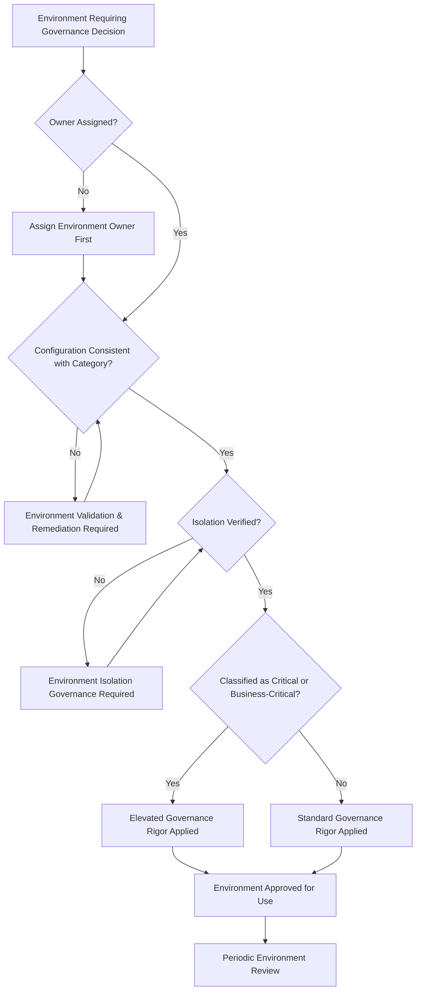
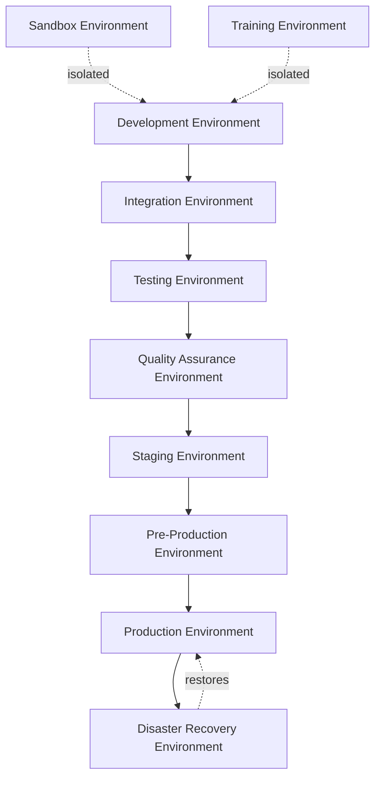
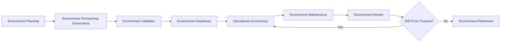
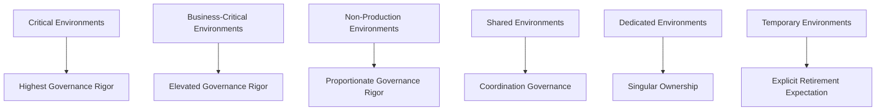
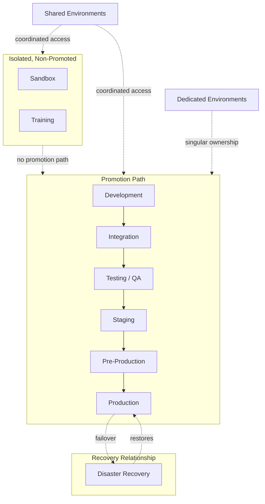
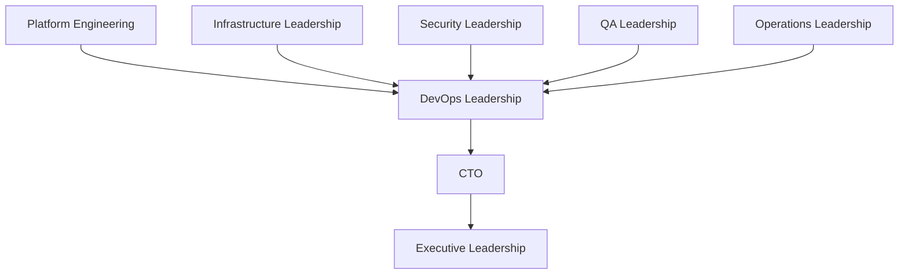

# Enterprise Environment Governance Framework

## 1. Executive Summary

**Purpose** — This document defines the official Enterprise Environment Governance Framework for **StackLeo Tech Store**. It establishes environment lifecycle governance, ownership, isolation, consistency, operational readiness, compliance, and executive oversight as a deliberate, accountable enterprise discipline. `environment-management.md` remains the operational environment framework for `07_DevOps` — the document that elaborates environment philosophy, lifecycle, categories, and isolation practice in full operational depth. This framework sits above it as the highest-level executive mandate, consistent with the executive-charter relationship `deployment-governance.md` holds over `deployment-strategy.md` and `release-management-governance.md` holds over `release-management.md`: it does not restate environment provisioning or configuration detail, it establishes the accountability structure, governance model, and executive expectations that give environment practice its authority across the whole organization.

**Scope** — This framework applies to every environment category at StackLeo — development, integration, testing, quality assurance, staging, pre-production, production, disaster recovery, sandbox, and training — across the full platform lifecycle, from the current single-region deployment through future multi-region operation.

**Strategic Objectives** — To ensure every environment has genuine, accountable ownership; that environments remain consistent with their intended configuration over time; that environment isolation genuinely protects each environment's integrity; and that executive leadership has continuous visibility into environment governance health and maturity.

**Business Value** — Governed environment practice protects the reliability every deployment and release decision depends on, prevents environment drift from silently undermining the confidence testing and validation are meant to provide, and gives leadership assurance that the platform's technical foundation is genuinely under control as it scales.

**Intended Audience** — Executive leadership, the Chief Technology Officer, platform engineering, DevOps leadership, infrastructure leadership, security leadership, QA leadership, operations leadership, and independent audit and oversight functions.

## 2. Enterprise Environment Strategy

- **Environment Vision** — every environment at StackLeo is a deliberately governed, accountable asset, never an incidental byproduct of individual team activity.
- **Environment Governance** — the accountability and consistency of every environment is governed centrally, even where day-to-day use is distributed across many teams.
- **Environment Standardization** — environments of the same category are configured and governed consistently, so behavior observed in one is genuinely representative of another.
- **Business Alignment** — environment investment is made in service of genuine business priority, connecting environment governance to `01_Business/business-model.md`.
- **Operational Stability** — environment governance protects the stability every deployment, release, and testing activity depends on.
- **Environment Reliability** — every governed environment is dependable enough that its behavior can be trusted for the purpose it exists to serve.
- **Scalability** — environment governance is defined independently of platform size, so it remains coherent as the number and complexity of environments grows.

### Enterprise Environment Strategy Matrix

| Strategy Element | Focus | Business Value |
|---|---|---|
| Environment Vision | Every environment is a deliberately governed, accountable asset | Prevents environments from being incidental, ungoverned byproducts |
| Environment Governance | Centralized accountability despite distributed daily use | Ensures consistency regardless of who uses an environment |
| Environment Standardization | Environments of the same category configured consistently | Ensures observed behavior is genuinely representative |
| Business Alignment | Investment made in service of genuine business priority | Connects environment governance to business intent |
| Operational Stability | Governance protects the stability dependent activity relies on | Protects deployment, release, and testing confidence |
| Environment Reliability | Every environment dependable for its intended purpose | Ensures trust in environment behavior is genuinely warranted |
| Scalability | Governance defined independently of platform size | Remains coherent as environment count and complexity grow |

## 3. Environment Governance Principles

Environment governance at StackLeo rests on nine principles, each producing a specific business outcome.

- **Environment Consistency** — environments of the same category are configured and governed identically. *Business Value:* ensures behavior observed in one environment is genuinely predictive of another.
- **Environment Isolation** — an environment's state, data, and behavior cannot be inadvertently affected by another environment. *Business Value:* prevents a problem in one environment from silently compromising another.
- **Least Privilege** — access to any environment is limited to what is genuinely required, proportionate to that environment's sensitivity. *Business Value:* limits the scope of harm any single compromised credential or careless action can cause.
- **Security by Default** — every environment is governed as a security-relevant asset from the outset, coordinated with `06_Security/security-governance.md`, never treated as security-exempt because it is non-production. *Business Value:* prevents non-production environments from becoming an unmonitored path around security discipline.
- **Operational Stability** — environment governance protects the stability every dependent activity relies on. *Business Value:* prevents environment instability from becoming a hidden source of unreliable testing or deployment outcomes.
- **Accountability** — every environment has a specific, named, responsible owner. *Business Value:* ensures no environment is left to drift without someone genuinely responsible for it.
- **Traceability** — every environment's configuration and change history can be reconstructed after the fact. *Business Value:* supports investigation, audit, and confident root cause analysis.
- **Standardization** — environment provisioning and configuration follow a consistent, governed pattern. *Business Value:* reduces the variance that makes environment-specific failures difficult to diagnose.
- **Continuous Improvement** — environment governance practice matures over time, informed by real environment outcomes. *Business Value:* keeps environment governance aligned with the organization's growing scale and complexity.

### Environment Governance Principles Matrix

| Principle | Description | Business Value |
|---|---|---|
| Environment Consistency | Same-category environments configured and governed identically | Ensures observed behavior is genuinely predictive |
| Environment Isolation | State, data, and behavior protected from other environments | Prevents one environment's problem from compromising another |
| Least Privilege | Access limited to what is genuinely required | Limits the scope of harm from compromise or error |
| Security by Default | Every environment governed as security-relevant from the outset | Prevents non-production from becoming an unmonitored gap |
| Operational Stability | Governance protects stability dependent activity relies on | Prevents instability from producing unreliable outcomes |
| Accountability | Every environment has a specific, named, responsible owner | Ensures no environment drifts without genuine ownership |
| Traceability | Configuration and change history reconstructable after the fact | Supports investigation, audit, and root cause analysis |
| Standardization | Provisioning and configuration follow a consistent pattern | Reduces variance that complicates diagnosis |
| Continuous Improvement | Practice matures from real environment outcomes | Keeps governance aligned with growing scale and complexity |

*Diagram 4: Environment Governance Decision Flow — an environment is checked for assigned ownership, configuration consistency, and verified isolation, with governance rigor scaled to its classification before approval for use and entry into periodic review.*

## 4. Enterprise Environment Governance Model

Environment governance is exercised across ten conceptual environment categories, each requiring a distinct governance emphasis. Every category here is elaborated in full operational depth in `environment-management.md`.

### Development Environment

- **Purpose** — govern the environment in which change is actively authored and initially exercised.
- **Governance Scope** — oversight balancing developer productivity with baseline Security by Default (Section 3).
- **Business Value** — protects engineering velocity while preventing development activity from becoming an ungoverned exception.
- **Executive Expectations** — leadership expects development environments to carry minimal but genuine governance, not none.

### Integration Environment

- **Purpose** — govern the environment in which components from multiple teams are combined and exercised together.
- **Governance Scope** — oversight of Environment Consistency (Section 3), given its role in surfacing cross-team integration issues.
- **Business Value** — protects the organization's ability to detect integration defects before they reach later stages.
- **Executive Expectations** — leadership expects integration environments to remain genuinely representative of combined system behavior.

### Testing Environment

- **Purpose** — govern the environment in which verification defined in `08_Quality_Assurance/testing-governance.md` is exercised.
- **Governance Scope** — oversight ensuring test results are trustworthy, coordinated with Test Environment Governance (`08_Quality_Assurance/testing-governance.md`, Section 3.4).
- **Business Value** — protects the credibility of every test result produced against this environment.
- **Executive Expectations** — leadership expects testing environments to be governed with sufficient rigor that results can be trusted.

### Quality Assurance Environment

- **Purpose** — govern the environment dedicated to broader quality verification activity beyond automated testing alone.
- **Governance Scope** — oversight coordinated with `08_Quality_Assurance/quality-assurance-framework.md`.
- **Business Value** — protects the organization's ability to confirm genuine quality before further progression.
- **Executive Expectations** — leadership expects the QA environment to remain consistent with the standard defined for its category.

### Staging Environment

- **Purpose** — govern the environment that most closely mirrors production configuration ahead of release.
- **Governance Scope** — oversight of Environment Consistency (Section 3) held to the highest standard short of production itself.
- **Business Value** — protects confidence that deployment behavior validated in staging will hold true in production.
- **Executive Expectations** — leadership expects staging to be governed as a genuine production proxy, not an approximate one.

### Pre-Production Environment

- **Purpose** — govern the final, production-representative checkpoint immediately ahead of release.
- **Governance Scope** — oversight coordinated with Release Readiness Governance (`release-management-governance.md`, Section 4).
- **Business Value** — protects the last opportunity to detect a release-blocking issue before customer exposure.
- **Executive Expectations** — leadership expects pre-production to be governed with rigor equivalent to production itself.

### Production Environment

- **Purpose** — govern the environment in which customers directly experience the platform.
- **Governance Scope** — oversight held to the highest governance rigor of any environment category in this model.
- **Business Value** — protects the operational reliability every customer transaction directly depends on.
- **Executive Expectations** — leadership expects production governance to be genuinely exercised, never assumed sufficient by default.

### Disaster Recovery Environment

- **Purpose** — govern the environment maintained to restore service should production become unavailable.
- **Governance Scope** — oversight coordinated with `disaster-recovery.md` and `09_Operations/business-continuity-governance.md`.
- **Business Value** — protects the business's ability to genuinely recover from a significant production disruption.
- **Executive Expectations** — leadership expects disaster recovery environment readiness to be verified, not assumed adequate.

### Sandbox Environment

- **Purpose** — govern the isolated environment used for experimentation and integration exploration.
- **Governance Scope** — oversight of Environment Isolation (Section 3), ensuring experimentation cannot affect any governed environment.
- **Business Value** — protects the organization's ability to innovate safely without risk to trusted environments.
- **Executive Expectations** — leadership expects sandbox isolation to be genuinely verified, not merely assumed by naming convention.

### Training Environment

- **Purpose** — govern the environment used to onboard and train personnel without risk to governed environments.
- **Governance Scope** — oversight ensuring training activity remains isolated from customer-facing or sensitive data.
- **Business Value** — protects the organization's ability to develop its people without introducing operational or data risk.
- **Executive Expectations** — leadership expects training environments to never contain genuine customer or business-sensitive data.

### Environment Governance Matrix

| Environment | Purpose | Business Value | Executive Expectations |
|---|---|---|---|
| Development Environment | Govern active authoring and initial exercise of change | Protects velocity while preventing an ungoverned exception | Expects minimal but genuine governance, not none |
| Integration Environment | Govern combined exercise of multi-team components | Protects the ability to detect integration defects early | Expects environments to remain genuinely representative |
| Testing Environment | Govern the environment where verification is exercised | Protects the credibility of every test result | Expects sufficient rigor that results can be trusted |
| Quality Assurance Environment | Govern broader quality verification activity | Protects the ability to confirm genuine quality | Expects consistency with the standard for its category |
| Staging Environment | Govern the closest mirror to production configuration | Protects confidence that staging behavior holds in production | Expects governance as a genuine production proxy |
| Pre-Production Environment | Govern the final production-representative checkpoint | Protects the last opportunity to catch a blocking issue | Expects rigor equivalent to production itself |
| Production Environment | Govern the environment customers directly experience | Protects the operational reliability every transaction depends on | Expects governance genuinely exercised, never assumed |
| Disaster Recovery Environment | Govern the environment restoring service after disruption | Protects the ability to genuinely recover from disruption | Expects readiness to be verified, not assumed |
| Sandbox Environment | Govern isolated experimentation and exploration | Protects the ability to innovate safely | Expects isolation to be genuinely verified |
| Training Environment | Govern onboarding and training activity | Protects the ability to develop people without introducing risk | Expects no genuine customer or sensitive data present |

*Diagram 1: Enterprise Environment Governance Framework — change progresses through development, integration, testing, QA, staging, and pre-production toward production, with disaster recovery standing ready to restore it, while sandbox and training environments remain isolated from the governed progression.*

## 5. Environment Lifecycle Governance

Environment governance operates across eight conceptual lifecycle stages.

- **Environment Planning** — govern how the need for a new or modified environment is deliberately identified and justified.
- **Environment Provisioning Governance** — govern how a planned environment is confirmed to meet its intended standard before use begins.
- **Environment Validation** — govern how an environment's configuration is confirmed correct and consistent with its category.
- **Environment Readiness** — govern how an environment is confirmed genuinely ready for its intended purpose.
- **Operational Governance** — govern how an environment is sustained and monitored throughout its active use.
- **Environment Maintenance** — govern how an environment's configuration is kept current and consistent over time.
- **Environment Review** — govern the periodic, formal reassessment of whether an environment remains fit for purpose.
- **Environment Retirement** — govern how an environment is deliberately decommissioned once no longer needed.

### Environment Lifecycle Matrix

| Stage | Governance Objective | Business Value |
|---|---|---|
| Environment Planning | Deliberately identify and justify the need for an environment | Prevents environments accumulating without genuine purpose |
| Environment Provisioning Governance | Confirm a planned environment meets its intended standard | Ensures a new environment is trustworthy from first use |
| Environment Validation | Confirm configuration is correct and consistent with category | Prevents an environment being used before genuinely validated |
| Environment Readiness | Confirm genuine readiness for intended purpose | Prevents premature reliance on an unready environment |
| Operational Governance | Sustain and monitor throughout active use | Keeps an environment trustworthy for its full active life |
| Environment Maintenance | Keep configuration current and consistent over time | Prevents silent drift from its intended, governed state |
| Environment Review | Periodically reassess fitness for purpose | Prevents an environment from silently outliving its usefulness |
| Environment Retirement | Deliberately decommission when no longer needed | Prevents abandoned environments becoming an ungoverned risk |

*Diagram 2: Environment Lifecycle — planning, provisioning, validation, and readiness precede sustained operational governance and maintenance, with periodic review determining whether an environment continues in active use or proceeds to deliberate retirement.*

## 6. Environment Classification

Environments are classified across six conceptual categories, each carrying a distinct governance weight.

- **Critical Environments** — environments whose failure would directly and immediately disrupt customer-facing service, governed with the highest rigor in this model.
- **Business-Critical Environments** — environments whose failure would significantly disrupt business operation without necessarily affecting customers directly, governed with elevated rigor.
- **Non-Production Environments** — environments supporting development and verification activity, governed proportionate to their role in producing trustworthy evidence.
- **Shared Environments** — environments used concurrently by multiple teams, governed with explicit coordination to prevent conflicting use.
- **Dedicated Environments** — environments reserved for a single team or purpose, governed with clear, singular ownership.
- **Temporary Environments** — environments provisioned for a bounded, time-limited purpose, governed with explicit retirement expectations from the outset.

### Environment Classification Matrix

| Classification | Governance Weight | Focus |
|---|---|---|
| Critical Environments | Highest rigor in this model | Direct, immediate customer-facing disruption risk |
| Business-Critical Environments | Elevated rigor | Significant business operation disruption risk |
| Non-Production Environments | Proportionate to evidentiary role | Trustworthiness of development and verification activity |
| Shared Environments | Explicit coordination governance | Preventing conflicting concurrent use |
| Dedicated Environments | Clear, singular ownership | Accountability concentrated in one team or purpose |
| Temporary Environments | Explicit retirement expectations | Preventing indefinite, ungoverned persistence |

*Diagram 3: Environment Classification Model — each classification carries a governance weight proportionate to its consequence, from the highest rigor applied to critical environments through explicit retirement expectations for temporary ones.*

*Diagram 5: Environment Relationship Architecture — environments relate through a governed promotion path from development to production, a recovery relationship with disaster recovery, and isolated, non-promoted sandbox and training environments, with shared and dedicated environments overlaying coordination and ownership expectations across the model.*

## 7. Organizational Governance

Governance accountability is distributed deliberately across eight organizational roles.

- **Executive Leadership** — holds ultimate accountability for whether environment practice is genuinely governed as an enterprise discipline.
- **CTO** — owns the coherence and enforcement of this framework across every environment category and governance layer it defines.
- **Platform Engineering** — owns the self-service capability that makes governed environment provisioning the default path for every team.
- **DevOps Leadership** — owns Environment Lifecycle Governance (Section 5) in coordination with `devops-governance-framework.md`.
- **Infrastructure Leadership** — owns the technical foundation every environment category depends on, coordinated with `infrastructure-as-code.md`.
- **Security Leadership** — owns Security by Default (Section 3) jointly with `06_Security/security-governance.md`, which remains authoritative for security-specific obligations.
- **QA Leadership** — owns Testing and Quality Assurance Environment governance (Section 4) in coordination with `08_Quality_Assurance/testing-governance.md`.
- **Operations Leadership** — owns Production and Disaster Recovery Environment governance (Section 4) in coordination with `09_Operations/operations-governance-strategy.md`.

### Organizational Responsibility Matrix

| Role | Governance Objective | Business Value |
|---|---|---|
| Executive Leadership | Hold ultimate accountability for governed environment practice | Provides a single point of ultimate accountability |
| CTO | Own coherence and enforcement of this framework | Provides a single point of specialist accountability |
| Platform Engineering | Own self-service capability enabling governed provisioning by default | Makes the governed path the path of least resistance |
| DevOps Leadership | Own environment lifecycle governance | Keeps environment practice coordinated with broader DevOps governance |
| Infrastructure Leadership | Own the technical foundation environments depend on | Protects the foundation every environment category relies on |
| Security Leadership | Own security by default jointly with security governance | Ensures no environment becomes an unmonitored security gap |
| QA Leadership | Own testing and quality assurance environment governance | Protects the credibility of verification evidence |
| Operations Leadership | Own production and disaster recovery environment governance | Protects operational reliability and recovery readiness |

### Governance Responsibility Matrix

| Role | Responsibility |
|---|---|
| Executive Leadership | Owns ultimate accountability for governed environment practice. |
| CTO | Owns coherence and enforcement of this framework, in partnership with executive leadership. |
| Platform Engineering | Owns self-service capability enabling governed provisioning by default. |
| DevOps Leadership | Owns environment lifecycle governance within `environment-management.md`. |
| Infrastructure Leadership | Owns the technical foundation every environment category depends on. |
| Security Leadership | Owns security by default jointly with `06_Security/security-governance.md`. |
| QA Leadership | Owns testing and quality assurance environment governance. |
| Operations Leadership | Owns production and disaster recovery environment governance. |

*Diagram: Organizational Environment Governance Structure — accountability flows from platform engineering, infrastructure, security, QA, and operations leadership into DevOps leadership and the CTO, converging on executive leadership.*

## 8. Environment Risk Governance

Environment-related risk is governed across seven conceptual categories, coordinated with `06_Security/enterprise-risk-management-strategy.md`.

- **Environment Drift** — the risk that an environment's actual configuration silently diverges from its intended, governed state.
- **Configuration Consistency** — the risk that environments of the same category are not genuinely equivalent, undermining the validity of evidence produced against them.
- **Unauthorized Changes** — the risk that an environment is modified outside governed change and access control.
- **Data Exposure** — the risk that sensitive or customer data is present in an environment without adequate protection.
- **Operational Risks** — the risk that an environment cannot be adequately operated, monitored, or recovered.
- **Availability Risks** — the risk that an environment becomes unavailable when genuinely needed for its intended purpose.
- **Compliance Risks** — the risk that an environment fails to meet a genuine regulatory or contractual obligation.

### Risk Governance Matrix

| Risk Category | Focus | Governance Coordination |
|---|---|---|
| Environment Drift | Actual configuration silently diverging from intended state | Coordinated with Environment Maintenance (Section 5) |
| Configuration Consistency | Same-category environments not genuinely equivalent | Coordinated with Environment Consistency (Section 3) |
| Unauthorized Changes | Modification outside governed change and access control | Coordinated with `06_Security/privileged-access-management.md` |
| Data Exposure | Sensitive or customer data present without adequate protection | Coordinated with `06_Security/data-protection.md` |
| Operational Risks | Inadequate ability to operate, monitor, or recover | Coordinated with operational readiness governance |
| Availability Risks | Environment unavailable when genuinely needed | Coordinated with disaster recovery and business continuity governance |
| Compliance Risks | Failure to meet regulatory or contractual obligation | Coordinated with `06_Security/compliance-governance.md` |

## 9. Executive Oversight

- **Environment Governance Reviews** — the overall coherence of environment governance is formally reviewed on a regular cadence.
- **Operational Readiness Reviews** — sustained operational preparedness of critical and business-critical environments is reviewed as a distinct, ongoing concern.
- **Executive Reporting** — aggregated environment health — drift incidence, consistency confirmation, readiness status — is reported to executive leadership and the Board.
- **Compliance Reviews** — environment adherence to regulatory and contractual obligation is periodically reviewed with executive leadership.
- **Capacity Reviews** — the organization's environment capacity relative to genuine demand is reviewed directly with executive leadership.
- **Continuous Improvement Reviews** — the organization's follow-through on captured environment governance lessons is reviewed directly with executive leadership.

### Executive Oversight Matrix

| Oversight Mechanism | Purpose | Governance Role |
|---|---|---|
| Environment Governance Reviews | Confirm overall environment governance coherence | Regular, predictable cadence for the framework as a whole |
| Operational Readiness Reviews | Review preparedness of critical and business-critical environments | Direct executive-level review of readiness rigor |
| Executive Reporting | Provide leadership a single, coherent environment picture | Reports drift incidence, consistency, readiness status |
| Compliance Reviews | Review adherence to regulatory and contractual obligation | Periodic executive-level compliance review |
| Capacity Reviews | Review environment capacity relative to genuine demand | Direct executive-level review of capacity sufficiency |
| Continuous Improvement Reviews | Review follow-through on captured lessons | Direct executive-level review of improvement completion |

## 10. Future Readiness

This framework is designed to remain valid as StackLeo evolves in scale, geography, and organizational complexity.

- **Ephemeral Environments (Conceptual)** — where environments increasingly exist only for the bounded duration of a specific need, that practice remains governed under the same lifecycle and classification principles defined in Sections 5–6.
- **Platform Engineering** — as self-service environment provisioning capability matures, this framework's governance model extends coherently without requiring redefinition.
- **AI-Assisted Environment Governance** — as environment drift detection and readiness assessment increasingly incorporate AI-assisted analysis, they remain governed under the same rigor as any other method.
- **Intelligent Capacity Planning** — where capacity decisions increasingly draw on intelligent pattern analysis, that analysis remains subject to Capacity Reviews (Section 9).
- **Enterprise Scale** — the governance model, categories, and lifecycle defined throughout this framework are defined independently of organizational size.
- **Global Expansion** — Environment Classification and Governance (Sections 4, 6) are structured to extend coherently as StackLeo expands from Bangladesh into South Asia and global markets.
- **Multi-Region Readiness** — this framework's governance model is structured to absorb genuinely multi-region environment topology without requiring its underlying philosophy to be rewritten.

## 11. Environment Maturity Model

Environment governance maturity is described across five conceptual levels.

- **Initial** — environment governance, where it exists, is informal and inconsistent; environments are provisioned reactively, and ownership is unclear.
- **Managed** — basic environment governance exists for individual categories, but consistency across the ten categories in Section 4 varies significantly.
- **Standardized** — environment provisioning and configuration follow a standardized, documented, consistently applied pattern.
- **Governed** — the full governance model — lifecycle, classification, risk, and organizational accountability — operates as one coherent, enforced discipline.
- **Optimized** — environment governance is continuously and deliberately improved based on quantitative evidence and organizational learning; improvement itself is a managed, ongoing discipline.

### Environment Maturity Matrix

| Level | Characteristics | Primary Focus |
|---|---|---|
| Initial | Informal, inconsistent governance; environments provisioned reactively | Ad hoc, individually-dependent environment practice |
| Managed | Basic governance exists per category; consistency varies | Category-level consistency |
| Standardized | Provisioning and configuration follow a standardized pattern | Consistent, documented environment practice |
| Governed | Full governance model operates as one coherent, enforced discipline | Organization-wide accountability and enforcement |
| Optimized | Practice continuously and deliberately improved from evidence | Sustained, deliberate improvement as a discipline |

*Diagram 6: Environment Maturity Progression — maturity advances from informal, reactive provisioning toward standardized, fully governed, and continuously optimized environment governance.*

## 12. Governance Anti-Patterns

- **Environment Drift** — an environment's actual configuration silently diverging from its intended state undermines the validity of every result produced against it, and worsens the longer it goes undetected.
- **Shared Everything** — treating every environment as freely shared without genuine isolation or coordination creates conflicting use and unpredictable outcomes.
- **Poor Environment Isolation** — an environment that can be inadvertently affected by another loses the reliability it exists to provide.
- **Weak Ownership** — an environment with no accountable owner has no one genuinely responsible for its configuration, consistency, or health.
- **Manual Environment Management** — relying on manual, person-executed environment changes introduces variance and error that automation and governance exist to remove.
- **Missing Documentation** — allowing an environment's documented configuration to diverge from what actually exists makes investigation and decision-making unreliable.
- **Inconsistent Standards** — environments of the same category configured differently produce results that cannot be genuinely compared or trusted.
- **Reactive Governance** — treating environment governance as adequate only until a failure proves otherwise means avoidable failures, not deliberate design, drive improvement.

### Anti-Pattern Summary

| Anti-Pattern | Business Impact |
|---|---|
| Environment Drift | Undermines the validity of every result produced against a diverged environment |
| Shared Everything | Creates conflicting use and unpredictable outcomes |
| Poor Environment Isolation | Loses the reliability isolation exists to provide |
| Weak Ownership | Leaves no one genuinely responsible for configuration, consistency, or health |
| Manual Environment Management | Introduces variance and error automation and governance exist to remove |
| Missing Documentation | Makes investigation and decision-making unreliable |
| Inconsistent Standards | Produces results that cannot be genuinely compared or trusted |
| Reactive Governance | Lets avoidable failures, not deliberate design, drive improvement |

## Related Documents

| Document | Relationship |
|---|---|
| `deployment-strategy.md` | Elaborates the environments a governed deployment proceeds through, in operational depth. |
| `devops-governance-framework.md` | The broader DevOps executive charter this framework's environment governance operates within. |
| `release-management-governance.md` | Governs the release decision this framework's Pre-Production and Staging Environment governance (Section 4) supports. |
| Configuration Management Governance (`configuration-management.md`) | Governs the configuration state this framework's Environment Consistency principle (Section 3) depends on. |
| CI/CD Governance (`ci-cd-strategy.md`) | Governs the broader delivery path environments in Section 4 support at each stage. |
| Deployment Risk Governance (`deployment-governance.md`, Section 7) | The deployment-specific elaboration of this framework's Environment Risk Governance (Section 8). |
| DevOps Maturity Framework (`devops-governance-framework.md`, Section 11) | The enterprise-wide DevOps maturity model this framework's Environment Maturity Model (Section 11) extends into environment-specific practice. |

## Document Information

| Property | Value |
|----------|-------|
| Document | environment-governance.md |
| Version | 1.0.0 |
| Status | Active |
| Maintained By | StackLeo |
| Last Updated | 2026-07-24 |

---

© StackLeo. All Rights Reserved.
