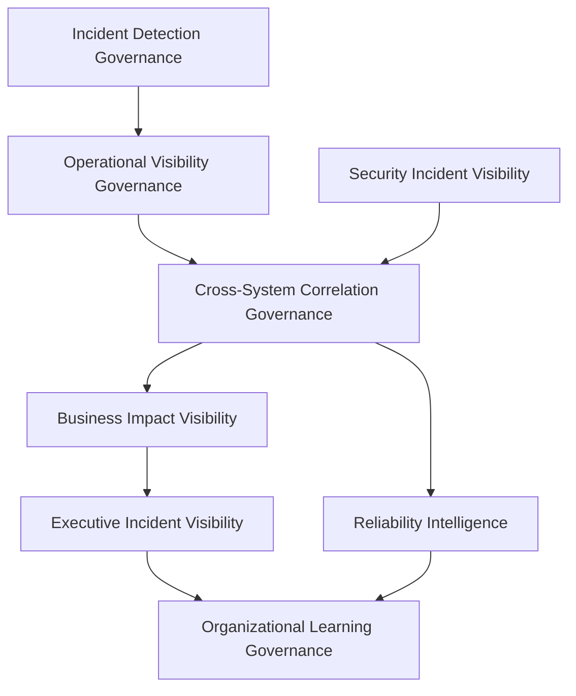
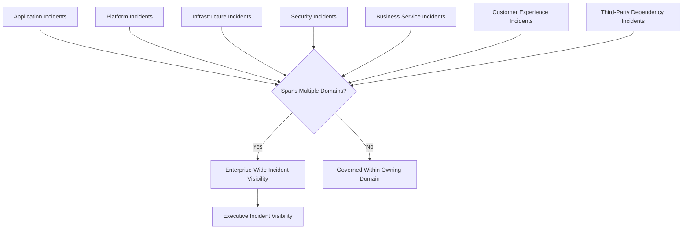
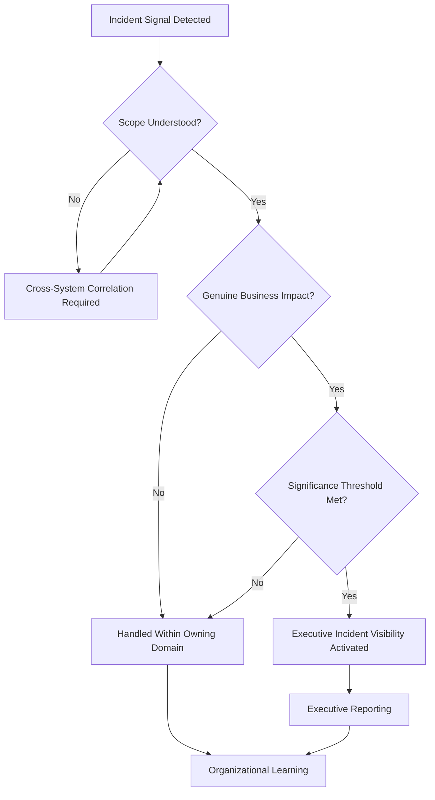
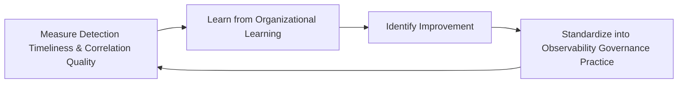
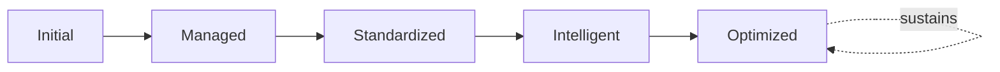

# Enterprise Incident Observability Framework

## 1. Executive Summary

**Purpose** — This document defines the official Enterprise Incident Observability Framework for **StackLeo Tech Store**. It establishes incident visibility, detection governance, operational intelligence, cross-system awareness, executive reporting, organizational learning, and continuous incident observability improvement as a deliberate, accountable enterprise discipline. `09_Operations/incident-management-governance.md` governs how the organization responds to, owns, and escalates an incident once it is known. This framework governs something distinct and prior to that: how the organization comes to know an incident is happening at all, how completely it understands what is happening while it is happening, and how that understanding is preserved as durable organizational learning afterward. It does not restate incident response, ownership, or escalation governance — it is the visibility and intelligence layer those disciplines depend on.

**Scope** — This framework applies to every source of incident visibility across StackLeo — application, platform, infrastructure, security, business service, customer experience, third-party dependency, and enterprise-wide incidents — across the full platform lifecycle, coordinated with `monitoring-strategy.md`, `logging-governance.md`, `metrics-governance.md`, `alerting-governance.md`, and `09_Operations/incident-management-governance.md`.

**Strategic Objectives** — To ensure an incident is genuinely detected as early as possible; that responders and leadership have the cross-system context needed to understand an incident while it is unfolding, not only afterward; that an incident's genuine business impact is understood, not merely its technical symptoms; and that every incident deepens the organization's collective understanding rather than being forgotten once resolved.

**Business Value** — Governed incident observability protects the organization from the disproportionate cost of a disruption that goes unnoticed or misunderstood, gives responders the context to act with confidence rather than guesswork, and gives executive leadership honest, timely visibility into the incidents that genuinely matter to the business.

**Intended Audience** — Executive leadership, the Chief Technology Officer, engineering leadership, DevOps leadership, security leadership, operations leadership, reliability engineering, business stakeholders, and risk and compliance functions.

## 2. Enterprise Incident Observability Vision

- **Incident Visibility as Business Capability** — the ability to genuinely see an incident as it happens is governed as a strategic business capability, never merely a technical convenience.
- **Early Detection** — observability exists to shrink the gap between when a genuine problem begins and when the organization becomes aware of it.
- **Operational Awareness** — observability gives responders and operators a genuinely accurate picture of what is happening across the platform during a disruption.
- **Customer Experience Protection** — observability protects the organization's ability to notice a genuine threat to customer experience before the customer has to report it.
- **Reliability Engineering** — incident observability directly informs the reliability discipline governed in `sre-strategy.md`, converting understood disruption into future prevention.
- **Business Continuity** — observability protects the organization's ability to recognize when a disruption threatens genuine business continuity, coordinated with `09_Operations/business-continuity-governance.md`.
- **Decision Intelligence** — observability converts raw signal into the genuine understanding that responders, operators, and executives need to decide well under pressure.

### Enterprise Incident Observability Vision Matrix

| Vision Element | Focus | Business Value |
|---|---|---|
| Incident Visibility as Business Capability | Genuine strategic capability, not a technical convenience | Prevents visibility from being treated as a low-priority afterthought |
| Early Detection | Shrinking the gap between problem onset and awareness | Reduces the duration and cost of undetected disruption |
| Operational Awareness | An accurate picture of what is happening during disruption | Enables responders to act on genuine understanding, not guesswork |
| Customer Experience Protection | Notices a genuine threat before the customer has to report it | Protects the trust relationship every interaction depends on |
| Reliability Engineering | Converts understood disruption into future prevention | Connects observability directly to the reliability discipline |
| Business Continuity | Recognizes when disruption threatens genuine continuity | Supports the organization's most fundamental operating obligation |
| Decision Intelligence | Converts raw signal into genuine understanding | Supports confident decisions made under genuine pressure |

## 3. Incident Observability Principles

Incident observability governance at StackLeo rests on eight principles, each producing a specific business outcome.

- **Early Detection Over Late Reaction** — visibility is governed to surface a genuine problem as early as possible, never to merely confirm one already obvious to customers. *Business Value:* protects the window in which a disruption can be addressed before it compounds.
- **Context Before Action** — genuine understanding of an incident is governed to precede the decisions made in response to it. *Business Value:* protects responders from acting on incomplete or misleading information.
- **Business Impact Awareness** — incident visibility is governed to convey genuine business consequence, not only technical symptom. *Business Value:* ensures the organization's response urgency reflects genuine business stakes.
- **Cross-System Visibility** — an incident is governed to be understood across every system it touches, never confined to the single system where it was first noticed. *Business Value:* prevents an incident's genuine scope from being underestimated.
- **Traceability** — every element of incident understanding traces to the specific signal and evidence that produced it. *Business Value:* supports confident post-incident review and organizational learning.
- **Accountability** — every incident visibility domain has a specific, named, responsible owner. *Business Value:* ensures no visibility domain drifts without someone genuinely responsible for it.
- **Evidence-Based Decisions** — decisions made during and after an incident are grounded in genuine, governed evidence, not solely in impression. *Business Value:* reduces the risk of decisions being driven by whoever argues most persuasively rather than by genuine evidence.
- **Continuous Learning** — every incident is governed to deepen the organization's genuine collective understanding of how the platform actually behaves. *Business Value:* converts the cost of disruption into a lasting organizational asset.

### Incident Observability Principles Matrix

| Principle | Description | Business Value |
|---|---|---|
| Early Detection Over Late Reaction | Surfaces problems early, never merely confirms the obvious | Protects the window before disruption compounds |
| Context Before Action | Genuine understanding precedes response decisions | Protects responders from acting on incomplete information |
| Business Impact Awareness | Conveys genuine business consequence, not only symptom | Ensures response urgency reflects genuine business stakes |
| Cross-System Visibility | Understood across every system it touches | Prevents underestimating an incident's genuine scope |
| Traceability | Every element traces to the signal and evidence behind it | Supports confident post-incident review and learning |
| Accountability | Every domain has a specific, named, responsible owner | Ensures no domain drifts without genuine responsibility |
| Evidence-Based Decisions | Grounded in genuine, governed evidence, not impression | Reduces the risk of decisions driven by persuasion alone |
| Continuous Learning | Deepens genuine collective understanding of platform behavior | Converts the cost of disruption into a lasting organizational asset |

## 4. Enterprise Incident Observability Governance Model

Incident observability governance operates across eight conceptual layers, each holding accountability for a distinct dimension of incident understanding.

### Incident Detection Governance

- **Purpose** — govern how the organization comes to genuinely know a disruption is occurring.
- **Governance Scope** — oversight coordinated with `alerting-governance.md`, which governs the notification an eventual detection produces.
- **Business Value** — protects the organization's ability to notice a genuine problem before it compounds.
- **Executive Expectations** — leadership expects detection to be timely and genuinely comprehensive, not merely present.

### Operational Visibility Governance

- **Purpose** — govern the ongoing, real-time picture of platform behavior available to operators and responders.
- **Governance Scope** — oversight coordinated with `monitoring-strategy.md` and Operational Monitoring practice.
- **Business Value** — protects responders' ability to act on a genuinely accurate operational picture.
- **Executive Expectations** — leadership expects operational visibility to remain reliable precisely when it is needed most.

### Cross-System Correlation Governance

- **Purpose** — govern how signals from independent systems are understood together as a single, coherent incident picture.
- **Governance Scope** — oversight spanning every domain in Section 5, ensuring no domain's visibility is understood in isolation.
- **Business Value** — prevents a genuinely enterprise-wide incident from being misread as several unrelated, smaller events.
- **Executive Expectations** — leadership expects cross-system correlation to reveal an incident's true scope, not merely its first symptom.

### Business Impact Visibility

- **Purpose** — govern how an incident's genuine business, financial, and customer consequence is understood, not only its technical detail.
- **Governance Scope** — oversight coordinated with `01_Business/business-model.md` and Business Metrics (`metrics-governance.md`, Section 4).
- **Business Value** — connects incident understanding directly to genuine business consequence.
- **Executive Expectations** — leadership expects business impact visibility to answer "how much does this matter," not only "what is broken."

### Executive Incident Visibility

- **Purpose** — govern the synthesized, executive-relevant picture of an incident's status and consequence.
- **Governance Scope** — oversight exclusively accountable for converging every domain above into one coherent picture for leadership.
- **Business Value** — protects leadership's ability to understand a significant incident without wading through raw technical detail.
- **Executive Expectations** — leadership expects to be shown one coherent incident picture, not eight disconnected technical feeds.

### Reliability Intelligence

- **Purpose** — govern how incident observability feeds the reliability discipline governed in `sre-strategy.md`.
- **Governance Scope** — oversight coordinated with `sre-strategy.md` and `09_Operations/service-level-governance.md`.
- **Business Value** — converts understood disruption into a genuine input for future reliability investment.
- **Executive Expectations** — leadership expects incident understanding to visibly inform reliability priorities, not merely be filed away.

### Security Incident Visibility

- **Purpose** — govern visibility into security-relevant incidents, jointly with, and never superseding, `06_Security/incident-response.md`.
- **Governance Scope** — oversight ensuring security incident visibility meets the rigor `06_Security/security-governance.md` requires.
- **Business Value** — protects StackLeo's core trust differentiator through genuine security incident awareness.
- **Executive Expectations** — leadership expects security incident visibility to be treated as mandatory, non-negotiable awareness.

### Organizational Learning Governance

- **Purpose** — govern how understanding gained from an incident is captured as durable organizational knowledge.
- **Governance Scope** — oversight coordinated with Post-Incident Review practice under `09_Operations/incident-management-governance.md`.
- **Business Value** — ensures the cost of an incident produces a lasting organizational asset, not only a resolved ticket.
- **Executive Expectations** — leadership expects visible evidence that past incidents genuinely inform future practice.

### Incident Observability Governance Matrix

| Domain | Purpose | Business Value | Executive Expectations |
|---|---|---|---|
| Incident Detection Governance | Govern how a disruption is genuinely known to be occurring | Protects the ability to notice a problem before it compounds | Expects timely, genuinely comprehensive detection |
| Operational Visibility Governance | Govern the real-time picture available to operators | Protects the ability to act on an accurate operational picture | Expects reliability precisely when it is needed most |
| Cross-System Correlation Governance | Govern how independent signals form one coherent picture | Prevents an enterprise-wide incident being read as smaller events | Expects correlation to reveal true scope, not first symptom |
| Business Impact Visibility | Govern understanding of genuine business consequence | Connects incident understanding to genuine business consequence | Expects visibility to answer how much it matters |
| Executive Incident Visibility | Synthesize the enterprise incident picture for leadership | Protects leadership's ability to understand without raw detail | Expects one coherent picture, not disconnected feeds |
| Reliability Intelligence | Govern how observability feeds the reliability discipline | Converts understood disruption into future reliability investment | Expects visible influence on reliability priorities |
| Security Incident Visibility | Govern visibility into security-relevant incidents | Protects StackLeo's core trust differentiator | Expects treatment as mandatory, non-negotiable awareness |
| Organizational Learning Governance | Govern capture of understanding as durable knowledge | Ensures incident cost produces a lasting organizational asset | Expects visible evidence past incidents inform future practice |

*Diagram 1: Enterprise Incident Observability Framework — incident detection feeds operational visibility, which converges with security incident visibility into cross-system correlation, informing business impact visibility, executive incident visibility, and reliability intelligence, all of which feed organizational learning.*

## 5. Incident Visibility Domains

Incident observability is governed across eight conceptual visibility domains, each requiring a distinct governance emphasis. Remaining implementation independent, these domains classify where visibility is needed — never which tool or platform provides it.

- **Application Incidents** — govern visibility into disruption originating in application-level behavior and business logic.
- **Platform Incidents** — govern visibility into disruption originating in shared platform capability.
- **Infrastructure Incidents** — govern visibility into disruption originating in the platform's underlying technical foundation.
- **Security Incidents** — govern visibility into disruption arising from a genuine security event, coordinated with `06_Security/incident-response.md`.
- **Business Service Incidents** — govern visibility into disruption affecting a defined business service or commitment.
- **Customer Experience Incidents** — govern visibility into disruption the customer genuinely experiences, regardless of underlying technical cause.
- **Third-Party Dependency Incidents** — govern visibility into disruption originating in a vendor or integration partner StackLeo does not directly control.
- **Enterprise-Wide Incidents** — govern visibility into disruption whose genuine scope spans multiple domains above simultaneously.

### Incident Visibility Domain Matrix

| Domain | Governance Focus | Coordination |
|---|---|---|
| Application Incidents | Disruption in application behavior and business logic | Application Logging (`logging-governance.md`, Section 4) |
| Platform Incidents | Disruption in shared platform capability | `platform-engineering.md` |
| Infrastructure Incidents | Disruption in the technical foundation | `infrastructure-as-code.md`, `environment-governance.md` |
| Security Incidents | Disruption arising from a genuine security event | `06_Security/incident-response.md` |
| Business Service Incidents | Disruption affecting a defined business service | `09_Operations/service-level-governance.md` |
| Customer Experience Incidents | Disruption genuinely experienced by the customer | Customer Experience Alerts (`alerting-governance.md`, Section 4) |
| Third-Party Dependency Incidents | Disruption originating outside StackLeo's direct control | `06_Security/third-party-risk-governance.md` |
| Enterprise-Wide Incidents | Disruption spanning multiple domains simultaneously | Executive Incident Visibility (Section 4) |

*Diagram 3: Cross-System Incident Visibility Model — visibility originating in any of the eight domains is evaluated for cross-domain scope, remaining within its owning domain where contained, or escalating to enterprise-wide and executive incident visibility where it genuinely spans multiple domains.*

## 6. Incident Observability Lifecycle

Incident observability governance operates across eight conceptual lifecycle stages.

- **Visibility Planning** — govern how the organization decides, in advance, what genuinely warrants visibility across each domain in Section 5.
- **Detection Readiness** — govern the organization's genuine preparedness to detect a disruption before visibility planning is tested by a real incident.
- **Incident Awareness** — govern the moment and manner in which a genuine incident becomes known to the organization.
- **Correlation & Context** — govern how an incident's signals are understood together, across systems, to form a coherent picture.
- **Business Impact Evaluation** — govern how an incident's genuine business, customer, and financial consequence is assessed.
- **Executive Visibility** — govern the point at which an incident's status and consequence are made visible to executive leadership.
- **Organizational Learning** — govern how understanding gained from an incident is captured as durable organizational knowledge.
- **Continuous Improvement** — govern how incident observability practice is deliberately strengthened based on real detection and understanding outcomes.

### Incident Lifecycle Matrix

| Stage | Governance Objective | Business Value |
|---|---|---|
| Visibility Planning | Decide in advance what genuinely warrants visibility | Ensures observability investment is deliberately directed |
| Detection Readiness | Confirm genuine preparedness before a real incident tests it | Prevents readiness gaps from being discovered during a disruption |
| Incident Awareness | Govern how and when a genuine incident becomes known | Shrinks the gap between problem onset and organizational awareness |
| Correlation & Context | Understand signals together as a coherent picture | Prevents an incident's genuine scope from being underestimated |
| Business Impact Evaluation | Assess genuine business, customer, and financial consequence | Ensures response urgency reflects genuine business stakes |
| Executive Visibility | Make status and consequence visible to leadership | Protects leadership's ability to act on timely, honest visibility |
| Organizational Learning | Capture understanding as durable organizational knowledge | Converts incident cost into a lasting organizational asset |
| Continuous Improvement | Strengthen practice from real detection and understanding outcomes | Keeps observability practice compounding in capability |

*Diagram 2: Incident Observability Lifecycle — visibility planning and detection readiness precede incident awareness, correlation, and business impact evaluation, feeding executive visibility, with organizational learning and continuous improvement feeding lessons back into the cycle.*

## 7. Organizational Governance

Governance accountability is distributed deliberately across nine organizational roles.

- **Executive Leadership** — holds ultimate accountability for whether the organization genuinely sees its own incidents in time to act.
- **CTO** — owns the coherence and enforcement of this framework across every visibility domain and governance layer it defines.
- **Engineering Leadership** — owns Application and Platform Incident visibility (Section 5) within their accountable teams.
- **DevOps Leadership** — owns Infrastructure Incident visibility (Section 5) and Operational Visibility Governance (Section 4), in coordination with `devops-governance-framework.md`.
- **Security Leadership** — owns Security Incident Visibility (Section 4) jointly with `06_Security/incident-response.md`, which remains authoritative for security-specific response.
- **Operations Leadership** — owns Business Service and Customer Experience Incident visibility (Section 5) in coordination with `09_Operations/operations-governance-strategy.md`.
- **Reliability Engineering** — owns Reliability Intelligence (Section 4) in coordination with `sre-strategy.md`.
- **Business Stakeholders** — own Business Impact Visibility (Section 4) alignment with genuine business priority.
- **Risk & Compliance Functions** — own the alignment of Third-Party Dependency Incident visibility (Section 5) with `06_Security/third-party-risk-governance.md` and `06_Security/compliance-governance.md`.

### Organizational Responsibility Matrix

| Role | Governance Objective | Business Value |
|---|---|---|
| Executive Leadership | Hold ultimate accountability for genuine, timely incident visibility | Provides a single point of ultimate accountability |
| CTO | Own coherence and enforcement of this framework | Provides a single point of specialist accountability |
| Engineering Leadership | Own application and platform incident visibility | Embeds visibility accountability closest to where incidents occur |
| DevOps Leadership | Own infrastructure incident visibility and operational visibility | Keeps observability coordinated with broader DevOps governance |
| Security Leadership | Own security incident visibility jointly with incident response | Ensures visibility genuinely supports security response |
| Operations Leadership | Own business service and customer experience visibility | Ensures accountability extends into sustained operation |
| Reliability Engineering | Own reliability intelligence | Ensures incident understanding directly informs reliability priority |
| Business Stakeholders | Own business impact visibility alignment with priority | Connects incident understanding to genuine business relevance |
| Risk & Compliance Functions | Own third-party dependency visibility alignment | Ensures visibility genuinely meets regulatory and contractual obligation |

### Governance Responsibility Matrix

| Role | Responsibility |
|---|---|
| Executive Leadership | Owns ultimate accountability for the organization's genuine incident visibility. |
| CTO | Owns coherence and enforcement of this framework, in partnership with executive leadership. |
| Engineering Leadership | Owns application and platform incident visibility within accountable teams. |
| DevOps Leadership | Owns infrastructure incident and operational visibility in coordination with `devops-governance-framework.md`. |
| Security Leadership | Owns security incident visibility jointly with `06_Security/incident-response.md`. |
| Operations Leadership | Owns business service and customer experience visibility in coordination with `09_Operations/operations-governance-strategy.md`. |
| Reliability Engineering | Owns reliability intelligence in coordination with `sre-strategy.md`. |
| Business Stakeholders | Owns business impact visibility alignment with genuine business priority. |
| Risk & Compliance Functions | Owns third-party dependency visibility alignment with `06_Security/third-party-risk-governance.md`. |

*Diagram 4: Incident Intelligence Decision Flow — a detected incident signal is correlated until its genuine scope is understood, evaluated for genuine business impact, and escalated to executive incident visibility where significance thresholds are met, resolving into organizational learning regardless of path.*

## 8. Incident Visibility Risk Governance

Incident visibility-related risk is governed across seven conceptual categories.

- **Detection Blind Spots** — the risk that a genuinely important disruption goes undetected.
- **Delayed Visibility** — the risk that a genuine incident is detected, but not understood or escalated, in time to matter.
- **Incomplete Context** — the risk that responders act on a partial or misleading understanding of an incident.
- **Cross-Team Communication Gaps** — the risk that genuine incident understanding fails to reach every team that needs it.
- **Business Impact Misinterpretation** — the risk that an incident's genuine business consequence is over- or under-estimated.
- **Operational Risks** — the risk that weak visibility itself degrades the organization's ability to operate through a disruption.
- **Reputational Risks** — the risk that poor incident visibility damages StackLeo's standing with customers, partners, or the market.

### Risk Governance Matrix

| Risk Category | Focus | Governance Coordination |
|---|---|---|
| Detection Blind Spots | A genuinely important disruption goes undetected | Coordinated with Incident Detection Governance (Section 4) |
| Delayed Visibility | Detected but not understood or escalated in time | Coordinated with Incident Awareness (Section 6) |
| Incomplete Context | Responders act on partial or misleading understanding | Coordinated with Correlation & Context (Section 6) |
| Cross-Team Communication Gaps | Understanding fails to reach every team that needs it | Coordinated with Cross-System Correlation Governance (Section 4) |
| Business Impact Misinterpretation | Consequence over- or under-estimated | Coordinated with Business Impact Visibility (Section 4) |
| Operational Risks | Weak visibility degrades the ability to operate | Coordinated with `09_Operations/operations-governance-strategy.md` |
| Reputational Risks | Damage to standing with customers, partners, market | Coordinated with Executive Incident Visibility (Section 4) |

## 9. Executive Oversight

- **Executive Incident Reviews** — the visibility and understanding produced for the organization's most significant incidents is formally reviewed with executive leadership.
- **Operational Intelligence Reviews** — the genuine operational insight produced by incident observability is reviewed as a distinct, ongoing concern.
- **Business Impact Reviews** — the accuracy of business impact assessment across recent incidents is periodically reviewed with executive leadership.
- **Reliability Reviews** — the degree to which incident understanding has genuinely informed reliability priority is reviewed directly with executive leadership.
- **Governance Reporting** — aggregated incident observability health — detection timeliness, correlation quality, learning follow-through — is reported to executive leadership and the Board.
- **Continuous Improvement Reviews** — the organization's follow-through on captured incident observability lessons is reviewed directly with executive leadership.

### Executive Oversight Matrix

| Oversight Mechanism | Purpose | Governance Role |
|---|---|---|
| Executive Incident Reviews | Review visibility and understanding for significant incidents | Direct executive-level review of the most consequential incidents |
| Operational Intelligence Reviews | Review genuine operational insight produced by observability | Treats insight quality as ongoing, not assumed |
| Business Impact Reviews | Review accuracy of business impact assessment | Periodic executive-level accuracy review |
| Reliability Reviews | Review whether incident understanding informs reliability priority | Direct executive-level review of reliability influence |
| Governance Reporting | Provide leadership a single, coherent observability picture | Reports detection timeliness, correlation quality, learning follow-through |
| Continuous Improvement Reviews | Review follow-through on captured lessons | Direct executive-level review of improvement completion |

## 10. Future Readiness

This framework is designed to remain valid as StackLeo evolves in scale, geography, and organizational complexity.

- **AI-Assisted Incident Intelligence** — as correlation and impact evaluation increasingly incorporate AI-assisted methods, they remain governed under Correlation & Context and Business Impact Evaluation (Section 6) at the same rigor as any other method.
- **Predictive Incident Detection** — where the organization develops the capability to anticipate an incident before it fully materializes, that capability is governed as an extension of Detection Readiness (Section 6).
- **Intelligent Correlation** — where cross-system correlation increasingly draws on intelligent pattern analysis, that analysis remains subject to the same Cross-System Correlation Governance (Section 4) as any other method.
- **Autonomous Observability (Conceptual)** — where automation increasingly performs steps within correlation, business impact evaluation, or organizational learning, that automation remains subject to the same ownership and executive oversight as any human-performed activity.
- **Enterprise Scale** — the governance model, domains, and lifecycle defined throughout this framework are defined independently of organizational size.
- **Global Operations** — Visibility Planning and Detection Readiness (Section 6) are structured to be re-applied as StackLeo expands from Bangladesh into South Asia and global markets, each with genuinely distinct operating footprints.
- **Digital Resilience** — this framework's governance discipline is treated as a direct contributor to the digital trust customers, partners, and regulators extend to StackLeo.

## 11. Incident Observability Maturity Model

Incident observability governance maturity is described across five conceptual levels.

- **Initial** — visibility, where it exists, is informal and inconsistent; incidents are discovered reactively, often by customers, and ownership is unclear.
- **Managed** — basic observability governance exists for individual domains, but consistency across the eight domains in Section 5 varies significantly.
- **Standardized** — the governance model, domains, and lifecycle are standardized, documented, and consistently applied across the organization.
- **Intelligent** — incident observability draws systematically on accumulated evidence and pattern analysis to inform genuinely proactive detection and correlation.
- **Optimized** — incident observability governance is continuously and deliberately improved based on quantitative evidence and organizational learning; improvement itself is a managed, ongoing discipline.

### Incident Observability Maturity Matrix

| Level | Characteristics | Primary Focus |
|---|---|---|
| Initial | Informal, inconsistent visibility; incidents discovered reactively | Ad hoc, individually-dependent observability practice |
| Managed | Basic governance exists per domain; consistency varies | Domain-level consistency |
| Standardized | Standardized governance model, domains, and lifecycle | Organization-wide consistency and clear ownership |
| Intelligent | Governance draws systematically on evidence and pattern analysis | Proactive, evidence-informed detection and correlation |
| Optimized | Practice continuously and deliberately improved from evidence | Sustained, deliberate improvement as a discipline |

*Diagram 5: Continuous Incident Learning Cycle — detection timeliness and correlation quality are measured, learned from, improved upon, and standardized back into governed practice, on a continuing basis.*

*Diagram 6: Incident Observability Maturity Progression — maturity advances from informal, reactively-discovered incident visibility toward standardized, intelligently informed, and continuously optimized incident observability governance.*

## 12. Incident Observability Anti-Patterns

- **Reactive Visibility** — discovering an incident only once a customer reports it forfeits the chance to detect and contain it proactively.
- **Siloed Incident Information** — understanding held within a single team's tools or awareness prevents the organization from seeing an incident's true scope.
- **Weak Business Context** — visibility that captures only technical symptom without business consequence fails to inform genuine response urgency.
- **Missing Executive Visibility** — leadership learning of a significant incident late, or informally, undermines the accountability this framework depends on.
- **Poor Cross-System Awareness** — treating each system's signals in isolation causes a genuinely enterprise-wide incident to be misread as several unrelated events.
- **Inconsistent Incident Classification** — visibility that varies in meaning by team or system produces understanding that cannot be genuinely compared or correlated.
- **Lack of Organizational Learning** — resolving an incident without capturing genuine understanding forfeits the chance to prevent its recurrence.
- **Weak Governance** — incident observability introduced without genuine governance review accumulates as ungoverned, inconsistent practice.

### Anti-Pattern Summary

| Anti-Pattern | Organizational & Business Impact |
|---|---|
| Reactive Visibility | Forfeits the chance to detect and contain an incident proactively |
| Siloed Incident Information | Prevents the organization from seeing an incident's true scope |
| Weak Business Context | Fails to inform genuine response urgency |
| Missing Executive Visibility | Undermines the accountability this entire framework depends on |
| Poor Cross-System Awareness | Causes an enterprise-wide incident to be misread as smaller events |
| Inconsistent Incident Classification | Produces understanding that cannot be genuinely compared or correlated |
| Lack of Organizational Learning | Forfeits the chance to prevent an incident's recurrence |
| Weak Governance | Accumulates as ungoverned, inconsistent observability practice |

## Related Documents

| Document | Relationship |
|---|---|
| `monitoring-strategy.md` | Produces the operational signal this framework's Operational Visibility Governance (Section 4) draws upon. |
| Observability Framework (conceptual future companion) | An anticipated deeper technical elaboration of instrumentation practice this framework's visibility draws upon. |
| `logging-governance.md` | Governs the discrete-event evidence this framework's Correlation & Context (Section 6) draws upon. |
| `metrics-governance.md` | Governs the measured evidence this framework's Business Impact Visibility (Section 4) draws upon. |
| `alerting-governance.md` | Governs how the signal this framework surfaces becomes a notification demanding response. |
| `reliability-engineering-framework.md` | Consumes this framework's Reliability Intelligence (Section 4) as a direct input to reliability priority. |
| `09_Operations/incident-management-governance.md` | Governs incident response, ownership, and escalation; consumes this framework's visibility as its evidentiary foundation. |

## Document Information

| Property | Value |
|----------|-------|
| Document | incident-observability.md |
| Version | 1.0.0 |
| Status | Active |
| Maintained By | StackLeo |
| Last Updated | 2026-07-28 |

---

© StackLeo. All Rights Reserved.
