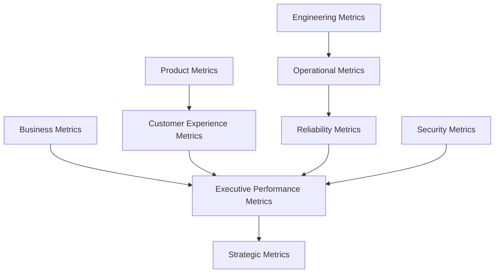
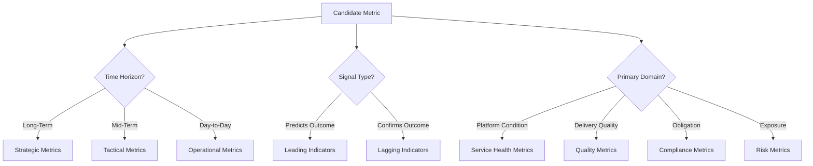
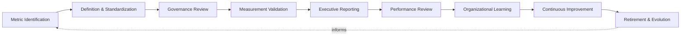
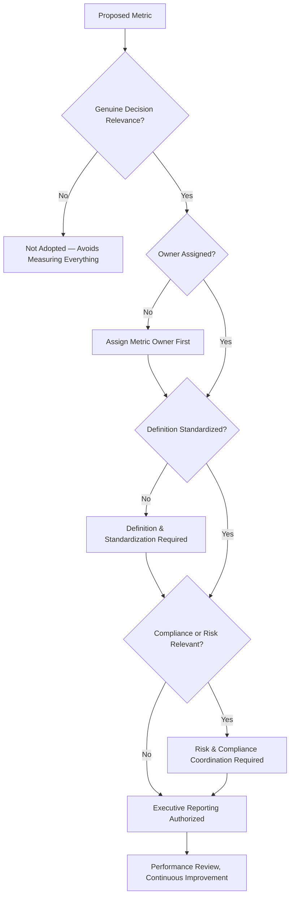
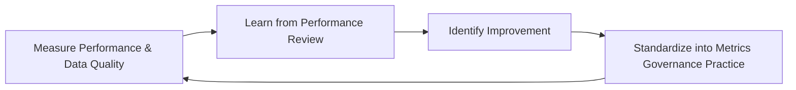
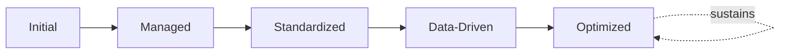

# Enterprise Metrics Governance Framework

## 1. Executive Summary

**Purpose** — This document defines the official Enterprise Metrics Governance Framework for **StackLeo Tech Store**. It establishes measurement strategy, enterprise metrics governance, KPI alignment, decision intelligence, organizational accountability, executive visibility, continuous improvement, and long-term metrics maturity as a deliberate, accountable enterprise discipline. `monitoring-strategy.md` anticipated this framework directly (Related Documents) as the dedicated governance treatment of metric data specifically, extending `observability-strategy.md` (Section 4, Metrics). `08_Quality_Assurance/quality-metrics-governance.md` already governs quality measurement as its own executive charter. This framework does not restate or replace either. It is the enterprise-wide capstone that governs measurement as a StackLeo-wide discipline — how a metric of any kind comes to exist, what makes it trustworthy, who owns it, and how it earns a place in front of executive leadership.

**Scope** — This framework applies to every category of metric produced or consumed across StackLeo — business, product, engineering, operational, reliability, security, customer experience, executive performance, and strategic metrics — across every platform domain, coordinated with `08_Quality_Assurance/quality-metrics-governance.md`, `monitoring-strategy.md`, and `09_Operations/service-level-governance.md`.

**Strategic Objectives** — To ensure StackLeo measures what genuinely matters, not merely what is convenient to collect; that every metric is trustworthy, consistently defined, and traceable to a genuinely accountable owner; that measurement produces decision intelligence rather than accumulating as unused data; and that executive leadership has continuous, honest visibility into genuine organizational performance.

**Business Value** — Governed metrics protect the organization's ability to make decisions grounded in genuine evidence rather than impression, protect leadership attention from dilution across metrics that do not genuinely inform action, and give the Board and executive leadership confidence that reported performance is honest, consistent, and decision-relevant.

**Intended Audience** — Executive leadership, the Chief Technology Officer, product leadership, engineering leadership, DevOps leadership, QA leadership, operations leadership, business stakeholders, and risk and compliance functions.

## 2. Enterprise Measurement Vision

- **Measurement as Strategic Capability** — measurement is governed as a genuine strategic capability, never merely a technical or administrative afterthought.
- **Data-Driven Decision Making** — metrics exist to be acted upon; governance ensures every metric genuinely informs a decision someone is accountable for making.
- **Operational Visibility** — metrics provide the aggregated, trend-level understanding that complements the discrete-event detail `logging-governance.md` governs.
- **Business Performance** — metrics connect platform and organizational activity directly to genuine business outcome, coordinated with `01_Business/business-model.md`.
- **Engineering Excellence** — metrics give engineering leadership an honest, evidence-based view of delivery and technical health, coordinated with `devops-governance-framework.md`.
- **Customer Success** — metrics reflect the customer's genuine experience and outcome, not only internal technical convenience.
- **Organizational Learning** — measured evidence, once understood, deepens the organization's genuine collective understanding of how it actually performs.

### Enterprise Measurement Vision Matrix

| Vision Element | Focus | Business Value |
|---|---|---|
| Measurement as Strategic Capability | Genuine strategic capability, not an afterthought | Prevents measurement from being treated as a low-priority exercise |
| Data-Driven Decision Making | Every metric genuinely informs an accountable decision | Converts measurement effort into genuine decision value |
| Operational Visibility | Aggregated, trend-level understanding of platform behavior | Complements discrete-event logging with pattern-level insight |
| Business Performance | Activity connected directly to genuine business outcome | Keeps measurement tethered to what the business actually values |
| Engineering Excellence | Honest, evidence-based view of delivery and technical health | Supports genuinely informed engineering investment decisions |
| Customer Success | Metrics reflecting genuine customer experience and outcome | Keeps measurement grounded in what customers actually experience |
| Organizational Learning | Measured evidence deepening collective understanding | Converts measured evidence into durable organizational insight |

## 3. Metrics Governance Principles

Metrics governance at StackLeo rests on nine principles, each producing a specific business outcome.

- **Measure What Matters** — measurement is directed toward what genuinely informs a decision, not toward everything that happens to be measurable. *Business Value:* protects leadership attention from being diluted across metrics that do not genuinely inform action.
- **Business Alignment** — every governed metric traces to a genuine business, product, or operational priority. *Business Value:* ensures measurement effort is spent on what the organization genuinely values.
- **Accuracy & Integrity** — a metric is trusted to genuinely and reliably reflect what it claims to measure. *Business Value:* protects the credibility of every decision that relies on it.
- **Transparency** — metric definitions, data sources, and calculation logic are documented and visible to those who genuinely need them. *Business Value:* allows reported performance to be scrutinized and defended, not merely trusted on faith.
- **Consistency** — a metric means the same thing wherever it is reported, across every team and domain. *Business Value:* prevents the same label from concealing incompatible measurements.
- **Accountability** — every metric traces to a specific, named, responsible owner. *Business Value:* ensures no metric is left to silently drift out of accuracy or relevance.
- **Traceability** — every reported metric value can be traced back to the definition and evidence that produced it. *Business Value:* supports confident audit, investigation, and defense of reported performance.
- **Actionable Insights** — a metric is governed to produce genuine insight leading to action, not passive observation alone. *Business Value:* ensures measurement investment converts into genuine organizational response.
- **Continuous Improvement** — metrics governance practice matures over time, informed by real decision and performance outcomes. *Business Value:* keeps measurement aligned with the organization's growing scale and complexity.

### Metrics Governance Principles Matrix

| Principle | Description | Business Value |
|---|---|---|
| Measure What Matters | Directed toward what genuinely informs a decision | Protects attention from dilution across low-value metrics |
| Business Alignment | Traces to a genuine business, product, or operational priority | Ensures measurement effort is spent on what is genuinely valued |
| Accuracy & Integrity | Trusted to genuinely and reliably reflect what it measures | Protects credibility of every decision relying on it |
| Transparency | Definitions, sources, and logic documented and visible | Allows reported performance to be scrutinized and defended |
| Consistency | Means the same thing wherever it is reported | Prevents the same label from concealing incompatible measurement |
| Accountability | Every metric traces to a specific, named, responsible owner | Ensures no metric drifts without genuine responsibility |
| Traceability | Every reported value traces to its definition and evidence | Supports confident audit, investigation, and defense |
| Actionable Insights | Governed to produce genuine insight leading to action | Ensures measurement investment converts into genuine response |
| Continuous Improvement | Practice matures from real decision and performance outcomes | Keeps governance aligned with growing scale and complexity |

## 4. Enterprise Metrics Governance Model

Metrics governance operates across nine conceptual domains, each holding accountability for a distinct category of measured performance.

### Business Metrics

- **Purpose** — govern measurement of genuine commercial and business-model performance.
- **Governance Scope** — oversight coordinated with `01_Business/business-model.md`.
- **Business Value** — connects measured evidence directly to genuine business consequence.
- **Executive Expectations** — leadership expects business metrics to answer genuine business questions, not proxy for them.

### Product Metrics

- **Purpose** — govern measurement of how the product is genuinely adopted, used, and valued.
- **Governance Scope** — oversight coordinated with product leadership and Customer Experience Metrics (below).
- **Business Value** — protects the ability to understand whether the product is genuinely succeeding with customers.
- **Executive Expectations** — leadership expects product metrics to reflect genuine usage and value, not vanity volume.

### Engineering Metrics

- **Purpose** — govern measurement of engineering delivery performance and technical health.
- **Governance Scope** — oversight coordinated with `devops-governance-framework.md` and `ci-cd-governance.md`.
- **Business Value** — protects confidence that engineering investment is genuinely producing durable delivery capability.
- **Executive Expectations** — leadership expects engineering metrics to support investment decisions, not merely activity tracking.

### Operational Metrics

- **Purpose** — govern measurement that supports how the platform is genuinely operated and sustained once live.
- **Governance Scope** — oversight coordinated with `09_Operations/operations-governance-strategy.md`.
- **Business Value** — protects the organization's ability to genuinely operate what it has built.
- **Executive Expectations** — leadership expects operational metrics to extend genuinely beyond the moment of deployment.

### Reliability Metrics

- **Purpose** — govern measurement of platform reliability and service health.
- **Governance Scope** — oversight coordinated with `sre-strategy.md` and `09_Operations/service-level-governance.md`.
- **Business Value** — protects the organization's evidentiary basis for reliability investment and commitment.
- **Executive Expectations** — leadership expects reliability metrics to be honest, even when the result is unfavorable.

### Security Metrics

- **Purpose** — govern measurement of security posture and control effectiveness, jointly with, and never superseding, `06_Security/security-governance.md`.
- **Governance Scope** — oversight ensuring security metrics meet the rigor `06_Security/security-governance.md` requires.
- **Business Value** — protects StackLeo's core trust differentiator through genuine security measurement.
- **Executive Expectations** — leadership expects security metrics to be treated as mandatory, non-negotiable evidence.

### Customer Experience Metrics

- **Purpose** — govern measurement that reflects the customer's genuine experience of the platform.
- **Governance Scope** — oversight coordinated with `09_Operations/service-level-governance.md`, with heightened business sensitivity.
- **Business Value** — protects the trust relationship every customer interaction depends on.
- **Executive Expectations** — leadership expects customer experience metrics to be weighted alongside internal technical metrics.

### Executive Performance Metrics

- **Purpose** — govern the synthesized, executive-relevant picture of performance across every domain in this model.
- **Governance Scope** — oversight exclusively accountable for converging every domain into one coherent enterprise picture.
- **Business Value** — protects leadership's ability to understand overall performance as a whole, not domain by domain.
- **Executive Expectations** — leadership expects one coherent performance picture, not nine disconnected domain views.

### Strategic Metrics

- **Purpose** — govern measurement of progress against StackLeo's long-term strategic objectives.
- **Governance Scope** — oversight coordinated with Executive Performance Metrics and `01_Business/business-model.md`.
- **Business Value** — connects day-to-day measurement to genuine long-term organizational direction.
- **Executive Expectations** — leadership expects strategic metrics to be reviewed with the same rigor as quarterly financial performance.

### Metrics Governance Matrix

| Domain | Purpose | Business Value | Executive Expectations |
|---|---|---|---|
| Business Metrics | Govern measurement of commercial and business-model performance | Connects measured evidence to genuine business consequence | Expects metrics to answer genuine business questions |
| Product Metrics | Govern measurement of product adoption, usage, and value | Protects ability to understand genuine product success | Expects reflection of genuine usage and value, not vanity volume |
| Engineering Metrics | Govern measurement of delivery performance and technical health | Protects confidence in durable delivery capability | Expects support for investment decisions, not activity tracking |
| Operational Metrics | Govern measurement supporting sustained operation | Protects the ability to genuinely operate what is built | Expects metrics extending genuinely beyond deployment |
| Reliability Metrics | Govern measurement of reliability and service health | Protects the evidentiary basis for reliability investment | Expects honesty, even when the result is unfavorable |
| Security Metrics | Govern measurement of security posture and control effectiveness | Protects StackLeo's core trust differentiator | Expects treatment as mandatory, non-negotiable evidence |
| Customer Experience Metrics | Govern measurement reflecting genuine customer experience | Protects the trust relationship every interaction depends on | Expects weighting alongside internal technical metrics |
| Executive Performance Metrics | Synthesize the enterprise performance picture | Protects leadership's ability to understand performance as a whole | Expects one coherent picture, not nine disconnected views |
| Strategic Metrics | Govern measurement of progress against strategic objectives | Connects measurement to genuine long-term direction | Expects rigor equal to quarterly financial performance |

*Diagram 1: Enterprise Metrics Governance Framework — business metrics converge with product and customer experience metrics, engineering metrics flow through operational and reliability metrics, and security metrics feed executive performance metrics, which synthesizes every domain into StackLeo's strategic metrics picture.*

## 5. Metrics Classification Framework

Metrics are governed across nine conceptual classifications, each requiring a distinct governance emphasis. Remaining implementation independent, this framework classifies metrics by role, timing, and use — never by dashboard, platform, or tool.

- **Strategic Metrics** — govern measurement of progress against long-term organizational direction.
- **Tactical Metrics** — govern measurement supporting mid-term operational and product decisions.
- **Operational Metrics** — govern measurement of day-to-day platform and process behavior.
- **Leading Indicators** — govern measurement that signals a future outcome before it fully materializes.
- **Lagging Indicators** — govern measurement that confirms an outcome that has already occurred.
- **Service Health Metrics** — govern measurement of the platform's ongoing operational condition.
- **Quality Metrics** — govern measurement of platform and delivery quality, coordinated with `08_Quality_Assurance/quality-metrics-governance.md`.
- **Compliance Metrics** — govern measurement of adherence to genuine regulatory and contractual obligation.
- **Risk Metrics** — govern measurement of genuine organizational exposure, coordinated with `06_Security/enterprise-risk-management-strategy.md`.

### Metrics Classification Matrix

| Classification | Governance Focus | Coordination |
|---|---|---|
| Strategic Metrics | Progress against long-term organizational direction | Strategic Metrics (Section 4) |
| Tactical Metrics | Support for mid-term operational and product decisions | Product and Engineering Metrics (Section 4) |
| Operational Metrics | Day-to-day platform and process behavior | Operational Metrics (Section 4) |
| Leading Indicators | Signal a future outcome before it fully materializes | Predictive Metrics (Section 10) |
| Lagging Indicators | Confirm an outcome that has already occurred | Performance Review (Section 6) |
| Service Health Metrics | Ongoing operational condition of the platform | Reliability Metrics (Section 4), `sre-strategy.md` |
| Quality Metrics | Platform and delivery quality | `08_Quality_Assurance/quality-metrics-governance.md` |
| Compliance Metrics | Adherence to regulatory and contractual obligation | `06_Security/compliance-governance.md` |
| Risk Metrics | Genuine organizational exposure | `06_Security/enterprise-risk-management-strategy.md` |

*Diagram 3: Metrics Classification Framework — a candidate metric is classified by time horizon into strategic, tactical, or operational metrics, by signal type into leading or lagging indicators, and by primary domain into service health, quality, compliance, or risk metrics.*

## 6. Metrics Lifecycle Governance

Metrics governance operates across nine conceptual lifecycle stages.

- **Metric Identification** — govern how a genuinely warranted candidate metric is recognized.
- **Definition & Standardization** — govern how a metric's meaning, calculation logic, and scope are defined consistently.
- **Governance Review** — govern how a defined metric is reviewed against the appropriate domain in Section 4.
- **Measurement Validation** — govern how a metric's ongoing accuracy and integrity are confirmed.
- **Executive Reporting** — govern how a validated metric is presented to executive leadership.
- **Performance Review** — govern the periodic, formal review of measured performance for genuine insight.
- **Organizational Learning** — govern how understanding gained from measurement is captured as durable organizational knowledge.
- **Continuous Improvement** — govern how metrics governance practice is deliberately strengthened based on real decision outcomes.
- **Retirement & Evolution** — govern the periodic reassessment of whether a metric remains genuinely relevant, and its deliberate retirement when it no longer is.

### Metrics Lifecycle Matrix

| Stage | Governance Objective | Business Value |
|---|---|---|
| Metric Identification | Recognize a genuinely warranted candidate metric | Ensures measurement effort is deliberately directed |
| Definition & Standardization | Define meaning, calculation logic, and scope consistently | Prevents the same label from concealing incompatible measurement |
| Governance Review | Review a defined metric against the appropriate domain | Ensures review by the genuinely accountable function |
| Measurement Validation | Confirm ongoing accuracy and integrity | Protects the credibility of every reliant decision |
| Executive Reporting | Present validated metrics to executive leadership | Ensures leadership sees only genuinely trustworthy performance data |
| Performance Review | Periodically review measured performance for genuine insight | Confirms measurement investment is genuinely working |
| Organizational Learning | Capture understanding as durable organizational knowledge | Converts measured evidence into lasting organizational insight |
| Continuous Improvement | Strengthen practice from real decision outcomes | Keeps measurement practice compounding in capability |
| Retirement & Evolution | Reassess relevance and retire metrics deliberately | Prevents accumulation of stale, unused, or misleading metrics |

*Diagram 2: Metrics Lifecycle Model — identification and definition inform governance review and measurement validation, feeding executive reporting and performance review, with organizational learning, continuous improvement, and deliberate retirement feeding lessons back into the cycle.*

## 7. Organizational Governance

Governance accountability is distributed deliberately across nine organizational roles.

- **Executive Leadership** — holds ultimate accountability for whether StackLeo's metrics genuinely inform decisions.
- **CTO** — owns the coherence and enforcement of this framework across every metrics domain and governance layer it defines.
- **Product Leadership** — owns Product Metrics (Section 4) alignment with genuine customer and business value.
- **Engineering Leadership** — owns Engineering Metrics (Section 4) within their accountable teams.
- **DevOps Leadership** — owns Operational and Reliability Metrics (Section 4) in coordination with `devops-governance-framework.md`.
- **QA Leadership** — owns Quality Metrics (Section 5) jointly with `08_Quality_Assurance/quality-metrics-governance.md`, which remains authoritative for quality-specific obligations.
- **Operations Leadership** — owns Operational Metrics (Section 4) in coordination with `09_Operations/operations-governance-strategy.md`.
- **Business Stakeholders** — own Business and Strategic Metrics (Section 4) alignment with genuine business priority.
- **Risk & Compliance Functions** — own Compliance and Risk Metrics (Section 5) in coordination with `06_Security/compliance-governance.md` and `06_Security/enterprise-risk-management-strategy.md`.

### Organizational Responsibility Matrix

| Role | Governance Objective | Business Value |
|---|---|---|
| Executive Leadership | Hold ultimate accountability for decision-informing metrics | Provides a single point of ultimate accountability |
| CTO | Own coherence and enforcement of this framework | Provides a single point of specialist accountability |
| Product Leadership | Own product metrics aligned to customer and business value | Ensures product measurement reflects genuine value, not volume |
| Engineering Leadership | Own engineering metrics | Embeds metrics accountability closest to where delivery occurs |
| DevOps Leadership | Own operational and reliability metrics | Keeps metrics coordinated with broader DevOps governance |
| QA Leadership | Own quality metrics jointly with quality metrics governance | Ensures quality measurement remains authoritative and coherent |
| Operations Leadership | Own operational metrics | Ensures accountability extends beyond deployment into operation |
| Business Stakeholders | Own business and strategic metrics alignment with priority | Connects measurement to genuine business relevance |
| Risk & Compliance Functions | Own compliance and risk metrics | Ensures measurement genuinely meets regulatory obligation |

### Governance Responsibility Matrix

| Role | Responsibility |
|---|---|
| Executive Leadership | Owns ultimate accountability for whether metrics genuinely inform decisions. |
| CTO | Owns coherence and enforcement of this framework, in partnership with executive leadership. |
| Product Leadership | Owns product metrics alignment with genuine customer and business value. |
| Engineering Leadership | Owns engineering metrics within accountable teams. |
| DevOps Leadership | Owns operational and reliability metrics in coordination with `devops-governance-framework.md`. |
| QA Leadership | Owns quality metrics jointly with `08_Quality_Assurance/quality-metrics-governance.md`. |
| Operations Leadership | Owns operational metrics in coordination with `09_Operations/operations-governance-strategy.md`. |
| Business Stakeholders | Owns business and strategic metrics alignment with genuine business priority. |
| Risk & Compliance Functions | Owns compliance and risk metrics in coordination with `06_Security/compliance-governance.md`. |

*Diagram 4: Enterprise Performance Decision Flow — a proposed metric is checked for genuine decision relevance and assigned ownership, standardized in definition, coordinated with risk and compliance where relevant, resolving into authorized executive reporting and ongoing review.*

## 8. Metrics Risk Governance

Metrics-related risk is governed across eight conceptual categories.

- **Misleading Metrics** — the risk that a metric, though accurate, creates a genuinely false impression of performance.
- **Metric Manipulation** — the risk that a metric is deliberately or informally gamed to present a favorable result.
- **Data Quality Risks** — the risk that a metric's underlying data is inaccurate, incomplete, or stale.
- **Inconsistent Definitions** — the risk that the same metric label means different things across teams or reports.
- **Missing Business Context** — the risk that a metric is reported without the context needed to genuinely interpret it.
- **Decision Risks** — the risk that a flawed metric drives a genuinely consequential decision in the wrong direction.
- **Compliance Risks** — the risk that measurement fails to meet a genuine regulatory or contractual obligation.
- **Reporting Bias** — the risk that metrics are selectively presented to favor a particular narrative rather than genuine performance.

### Risk Governance Matrix

| Risk Category | Focus | Governance Coordination |
|---|---|---|
| Misleading Metrics | Accurate metric creating a genuinely false impression | Coordinated with Actionable Insights (Section 3) |
| Metric Manipulation | Deliberate or informal gaming of a metric | Coordinated with Accountability (Section 3) |
| Data Quality Risks | Inaccurate, incomplete, or stale underlying data | Coordinated with Measurement Validation (Section 6) |
| Inconsistent Definitions | Same label meaning different things across reports | Coordinated with Consistency (Section 3) |
| Missing Business Context | Metric reported without genuinely interpretable context | Coordinated with Business Alignment (Section 3) |
| Decision Risks | Flawed metric driving a consequential decision astray | Coordinated with Executive Reporting (Section 6) |
| Compliance Risks | Measurement failing to meet regulatory or contractual obligation | Coordinated with `06_Security/compliance-governance.md` |
| Reporting Bias | Selective presentation favoring a narrative over performance | Coordinated with Transparency (Section 3) |

## 9. Executive Oversight

- **Executive KPI Reviews** — the organization's key performance indicators are formally reviewed directly with executive leadership on a regular cadence.
- **Performance Governance Reviews** — the overall coherence of metrics governance is formally reviewed on a regular cadence.
- **Strategic Performance Reporting** — aggregated performance against strategic objectives is reported to executive leadership and the Board.
- **Business Alignment Reviews** — the alignment of governed metrics to genuine business priority is periodically reviewed.
- **Operational Excellence Reviews** — the genuine operational insight produced by metrics is reviewed as a distinct, ongoing concern.
- **Continuous Improvement Reviews** — the organization's follow-through on captured metrics governance lessons is reviewed directly with executive leadership.

### Executive Oversight Matrix

| Oversight Mechanism | Purpose | Governance Role |
|---|---|---|
| Executive KPI Reviews | Formally review key performance indicators | Direct executive-level review of decision-critical metrics |
| Performance Governance Reviews | Confirm overall metrics governance coherence | Regular, predictable cadence for the framework as a whole |
| Strategic Performance Reporting | Provide leadership a single, coherent performance picture | Reports aggregated performance against strategic objectives |
| Business Alignment Reviews | Review alignment of governed metrics to business priority | Periodic executive-level alignment review |
| Operational Excellence Reviews | Review genuine operational insight produced by metrics | Treats insight quality as ongoing, not assumed |
| Continuous Improvement Reviews | Review follow-through on captured lessons | Direct executive-level review of improvement completion |

## 10. Future Readiness

This framework is designed to remain valid as StackLeo evolves in scale, geography, and organizational complexity.

- **AI-Assisted Performance Intelligence** — as performance review increasingly incorporates AI-assisted methods, they remain governed under Performance Review (Section 6) at the same rigor as any other method.
- **Predictive Metrics** — where leading indicators increasingly anticipate an outcome before it fully materializes, that capability is governed as an extension of Leading Indicators (Section 5).
- **Intelligent Decision Support** — where decision-making increasingly draws on intelligent pattern analysis across metrics, that analysis remains subject to the same Governance Review (Section 4) as any other evaluation method.
- **Enterprise Scale** — the governance model, domains, and lifecycle defined throughout this framework are defined independently of organizational size.
- **Global Performance Management** — Metric Identification and Definition & Standardization (Section 6) are structured to be re-applied as StackLeo expands from Bangladesh into South Asia and global markets, each with genuinely distinct business and regulatory considerations.
- **Autonomous Analytics (Conceptual)** — where automation increasingly performs steps within Performance Review or Organizational Learning (Section 6), that automation remains subject to the same ownership and executive oversight as any human-performed activity.
- **Digital Enterprise Intelligence** — this framework's governance discipline is treated as a direct contributor to the digital trust customers, partners, and regulators extend to StackLeo.

## 11. Metrics Maturity Model

Metrics governance maturity is described across five conceptual levels.

- **Initial** — measurement, where it exists, is informal and inconsistent; metrics are collected reactively, and ownership is unclear.
- **Managed** — basic metrics governance exists for individual domains, but consistency across the nine domains in Section 4 varies significantly.
- **Standardized** — the governance model, domains, and lifecycle are standardized, documented, and consistently applied across the organization.
- **Data-Driven** — decisions across the organization are genuinely and routinely grounded in governed metrics rather than impression.
- **Optimized** — metrics governance is continuously and deliberately improved based on quantitative evidence and organizational learning; improvement itself is a managed, ongoing discipline.

### Metrics Maturity Matrix

| Level | Characteristics | Primary Focus |
|---|---|---|
| Initial | Informal, inconsistent measurement; metrics collected reactively | Ad hoc, individually-dependent measurement practice |
| Managed | Basic governance exists per domain; consistency varies | Domain-level consistency |
| Standardized | Standardized governance model, domains, and lifecycle | Organization-wide consistency and clear ownership |
| Data-Driven | Decisions genuinely and routinely grounded in governed metrics | Evidence-based decision-making as the organizational norm |
| Optimized | Practice continuously and deliberately improved from evidence | Sustained, deliberate improvement as a discipline |

*Diagram 5: Continuous Metrics Improvement Cycle — measured performance and data quality are learned from, improved upon, and standardized back into governed practice, on a continuing basis.*

*Diagram 6: Metrics Maturity Progression — maturity advances from informal, reactively-collected measurement practice toward standardized, genuinely data-driven, and continuously optimized metrics governance.*

## 12. Metrics Anti-Patterns

- **Measuring Everything** — capturing every measurable data point without genuine purpose produces volume without direction.
- **Vanity Metrics** — reporting figures that look favorable without genuinely informing a decision misleads rather than guides.
- **Undefined Ownership** — a metric with no accountable owner has no one genuinely responsible for its accuracy or relevance.
- **Poor Metric Quality** — a metric built on inaccurate or inconsistent data undermines every decision that relies on it.
- **Missing Business Alignment** — metrics disconnected from genuine business priority fail to answer questions leadership actually has.
- **Weak Governance** — metrics introduced without genuine governance review accumulate as an ungoverned, untrustworthy sprawl.
- **Siloed Reporting** — metrics reported independently by team, without genuine cross-domain coordination, prevent one coherent enterprise picture.
- **Ignoring Continuous Improvement** — treating current metrics practice as permanently finished guarantees it falls behind the organization's growing scale and complexity.

### Anti-Pattern Summary

| Anti-Pattern | Organizational & Business Impact |
|---|---|
| Measuring Everything | Produces volume without direction, wasting measurement investment |
| Vanity Metrics | Misleads decisions rather than genuinely guiding them |
| Undefined Ownership | Leaves no one genuinely responsible for accuracy or relevance |
| Poor Metric Quality | Undermines every decision that relies on the metric |
| Missing Business Alignment | Fails to answer questions leadership genuinely has |
| Weak Governance | Accumulates as an ungoverned, untrustworthy sprawl of metrics |
| Siloed Reporting | Prevents one coherent, organization-wide performance picture |
| Ignoring Continuous Improvement | Guarantees practice falls behind growing scale and complexity |

## Related Documents

| Document | Relationship |
|---|---|
| `monitoring-strategy.md` | Consumes this framework's governed metrics as part of broader operational and business visibility. |
| Observability Framework (conceptual future companion) | An anticipated deeper technical elaboration of instrumentation practice this framework's metrics contribute to. |
| `logging-governance.md` | Governs the discrete-event telemetry this framework's aggregated, trend-level metrics complement. |
| Alerting Governance (conceptual future companion) | An anticipated dedicated governance treatment of how governed metrics become alerts. |
| Incident Observability (conceptual future companion) | An anticipated elaboration of how measured evidence supports `incident-management.md` and `09_Operations/incident-management-governance.md`. |
| `reliability-engineering-framework.md` | Consumes this framework's Reliability Metrics (Section 4) as an evidentiary input. |
| `08_Quality_Assurance/quality-metrics-governance.md` | The existing dedicated executive charter for quality measurement; this framework governs measurement enterprise-wide without restating it. |

## Document Information

| Property | Value |
|----------|-------|
| Document | metrics-governance.md |
| Version | 1.0.0 |
| Status | Active |
| Maintained By | StackLeo |
| Last Updated | 2026-07-28 |

---

© StackLeo. All Rights Reserved.
