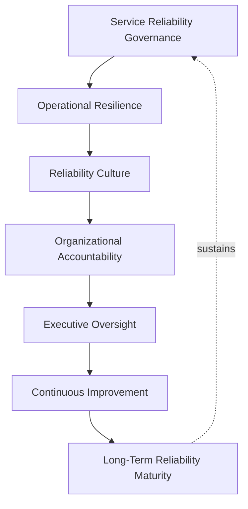
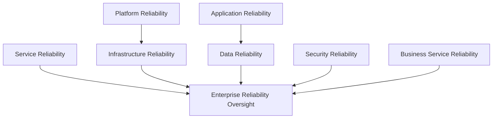
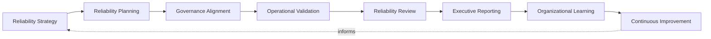
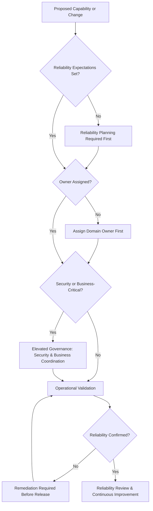
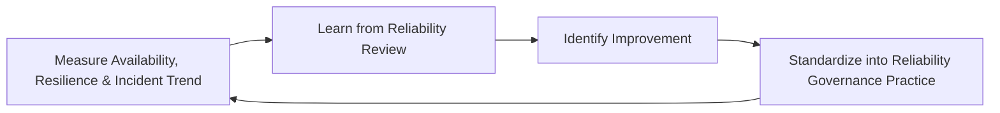
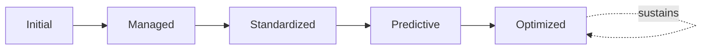

# Enterprise Reliability Engineering Framework

## 1. Executive Summary

**Purpose** — This document defines the official Enterprise Reliability Engineering Framework for **StackLeo Tech Store**. It establishes service reliability governance, operational resilience, reliability culture, organizational accountability, executive oversight, continuous improvement, and long-term reliability maturity as a deliberate, accountable enterprise discipline. `sre-strategy.md` remains the operational strategy for Site Reliability Engineering practice in this folder — the document that elaborates in full operational depth StackLeo's reliability philosophy, lifecycle, and day-to-day discipline. This document sits above it as the highest-level executive mandate, consistent with the executive-charter relationship `08_Quality_Assurance/quality-metrics-governance.md` holds over `quality-metrics.md`: it does not restate reliability practice or engineering technique, it establishes the governance, ownership, and executive expectations that give reliability engineering its authority and coherence at the level of the Board and executive leadership.

**Scope** — This framework applies to every category of reliability at StackLeo — service, platform, infrastructure, application, data, security, and business service reliability — across the full platform lifecycle, coordinated with `sre-strategy.md`, `monitoring-strategy.md`, `metrics-governance.md`, `alerting-governance.md`, `incident-observability.md`, and `09_Operations/service-level-governance.md`.

**Strategic Objectives** — To ensure reliability is engineered deliberately, not assumed as a byproduct of good intentions; that reliability investment is proportionate to genuine customer and business consequence; that operational resilience is sustained through every phase of growth and change; and that executive leadership has continuous, honest visibility into the organization's genuine reliability posture.

**Business Value** — Governed reliability engineering protects the organization from the disproportionate cost of avoidable disruption, protects the trust customers place in StackLeo every time they rely on the platform, and gives leadership the confidence to pursue growth and change without unknowingly eroding the stability the business depends on.

**Intended Audience** — Executive leadership, the Chief Technology Officer, engineering leadership, reliability leadership, DevOps leadership, platform engineering, security leadership, operations leadership, and business stakeholders.

## 2. Enterprise Reliability Vision

- **Reliability as a Business Capability** — reliability is governed as a genuine, deliberately delivered business capability, never an assumed background property of the platform.
- **Customer Trust** — reliability is the customer's most direct, continuous evidence of whether StackLeo genuinely deserves their trust.
- **Service Continuity** — reliability protects the organization's ability to keep delivering the services customers and the business depend on.
- **Operational Excellence** — reliability engineering is the specific discipline through which broader operational excellence becomes measurable and actionable.
- **Business Resilience** — reliability engineering is a direct, proactive protection against business disruption, coordinated with `09_Operations/business-continuity.md` and `disaster-recovery.md`.
- **Engineering Excellence** — reliability is treated with the same engineering rigor as feature delivery, never as a lesser, informally-pursued concern.
- **Sustainable Growth** — reliability engineering ensures StackLeo's growth in scale and complexity is matched by proportionate, deliberate reliability investment.

### Enterprise Reliability Vision Matrix

| Vision Element | Focus | Business Value |
|---|---|---|
| Reliability as a Business Capability | Genuine, deliberately delivered capability, not an assumption | Prevents reliability from being treated as a low-priority afterthought |
| Customer Trust | The customer's most direct, continuous evidence of trustworthiness | Protects the trust relationship every interaction depends on |
| Service Continuity | The ability to keep delivering services customers depend on | Protects revenue and commitments tied to continuous service |
| Operational Excellence | Makes operational excellence measurable and actionable | Converts a broad commitment into a governed, evidenced discipline |
| Business Resilience | Proactive protection against business disruption | Connects engineering discipline to business continuity |
| Engineering Excellence | Reliability pursued with the same rigor as feature delivery | Prevents reliability from being informally, inconsistently pursued |
| Sustainable Growth | Growth matched by proportionate reliability investment | Keeps expansion from silently eroding platform stability |

*Diagram 1: Enterprise Reliability Engineering Framework — service reliability governance establishes operational resilience and reliability culture, sustained by organizational accountability and executive oversight, with continuous improvement advancing long-term reliability maturity that reinforces governance itself.*

## 3. Reliability Engineering Principles

Reliability engineering at StackLeo rests on eight principles, each producing a specific business outcome.

- **Reliability by Design** — reliability expectations are established before a capability is built, never inferred or retrofitted afterward. *Business Value:* ensures reliability is a deliberate design outcome, not a lucky accident.
- **Prevention Over Recovery** — governance favors preventing a disruption over recovering gracefully from one. *Business Value:* avoids the disproportionate cost, both financial and reputational, of an avoidable disruption.
- **Customer-Centric Reliability** — reliability priorities are set by genuine customer impact, not solely by internal technical convenience. *Business Value:* directs reliability investment toward what customers genuinely experience and value.
- **Operational Resilience** — the platform and organization are governed to withstand and recover from disruption, not merely to avoid it in the ideal case. *Business Value:* protects continuity of service even when prevention is imperfect.
- **Accountability** — every reliability domain has a specific, named, responsible owner. *Business Value:* ensures no reliability domain drifts without someone genuinely responsible for it.
- **Measurable Reliability** — reliability is governed as a measured, evidenced property, coordinated with `metrics-governance.md`, never asserted on faith. *Business Value:* allows reliability posture to be scrutinized and defended, not merely claimed.
- **Continuous Learning** — every reliability event, whether a success or a failure, deepens the organization's genuine collective understanding. *Business Value:* converts real operational experience into durable organizational capability.
- **Continuous Improvement** — reliability engineering practice matures over time, informed by real operational outcomes. *Business Value:* keeps reliability discipline aligned with the organization's growing scale and complexity.

### Reliability Engineering Principles Matrix

| Principle | Description | Business Value |
|---|---|---|
| Reliability by Design | Expectations established before a capability is built | Ensures reliability is deliberate, not accidental |
| Prevention Over Recovery | Preventing disruption favored over recovering from it | Avoids the disproportionate cost of avoidable disruption |
| Customer-Centric Reliability | Priorities set by genuine customer impact | Directs investment toward what customers genuinely value |
| Operational Resilience | Governed to withstand and recover from disruption | Protects continuity even when prevention is imperfect |
| Accountability | Every domain has a specific, named, responsible owner | Ensures no domain drifts without genuine responsibility |
| Measurable Reliability | Governed as a measured, evidenced property | Allows reliability posture to be scrutinized and defended |
| Continuous Learning | Every event deepens genuine collective understanding | Converts operational experience into durable capability |
| Continuous Improvement | Practice matures from real operational outcomes | Keeps discipline aligned with growing scale and complexity |

## 4. Enterprise Reliability Governance Model

Reliability governance operates across eight conceptual domains, each holding accountability for a distinct dimension of platform reliability.

### Service Reliability

- **Purpose** — govern the reliability of a defined business service as experienced by its consumers.
- **Governance Scope** — oversight coordinated with `09_Operations/service-level-governance.md`.
- **Business Value** — protects the commitments StackLeo makes to customers and business partners.
- **Executive Expectations** — leadership expects service reliability to be governed against genuine business commitment, not internal convenience.

### Platform Reliability

- **Purpose** — govern the reliability of shared platform capability consumed across multiple services.
- **Governance Scope** — oversight coordinated with `platform-engineering.md`.
- **Business Value** — ensures a platform-level reliability failure is never treated as a single team's isolated concern.
- **Executive Expectations** — leadership expects platform reliability to be governed with awareness of its broad dependency footprint.

### Infrastructure Reliability

- **Purpose** — govern the reliability of the platform's underlying technical foundation.
- **Governance Scope** — oversight coordinated with `infrastructure-as-code.md` and `environment-governance.md`.
- **Business Value** — protects the technical foundation every other reliability domain ultimately depends on.
- **Executive Expectations** — leadership expects infrastructure reliability to be governed with consistent rigor regardless of scale.

### Application Reliability

- **Purpose** — govern the reliability of application-level behavior and business logic execution.
- **Governance Scope** — oversight coordinated with `08_Quality_Assurance/quality-metrics-governance.md` for reliability-relevant quality evidence.
- **Business Value** — protects confidence that application behavior remains dependable under genuine production conditions.
- **Executive Expectations** — leadership expects application reliability to be governed with the same rigor as feature functionality.

### Data Reliability

- **Purpose** — govern the reliability, integrity, and availability of the data the platform depends on.
- **Governance Scope** — oversight coordinated with `04_Database/data-governance.md` and `04_Database/data-quality-governance.md`.
- **Business Value** — protects the trustworthiness of every decision and transaction that depends on platform data.
- **Executive Expectations** — leadership expects data reliability to be governed as rigorously as service availability itself.

### Security Reliability

- **Purpose** — govern the reliability of security controls and their availability when genuinely needed, jointly with, and never superseding, `06_Security/security-governance.md`.
- **Governance Scope** — oversight ensuring security reliability meets the rigor `06_Security/security-governance.md` requires.
- **Business Value** — protects StackLeo's core trust differentiator through genuinely dependable security controls.
- **Executive Expectations** — leadership expects security reliability to be treated as mandatory, non-negotiable.

### Business Service Reliability

- **Purpose** — govern the reliability of the platform as it genuinely supports business outcome and commercial operation.
- **Governance Scope** — oversight coordinated with `01_Business/business-model.md`.
- **Business Value** — connects technical reliability directly to genuine business consequence.
- **Executive Expectations** — leadership expects business service reliability to answer genuine business questions, not only technical ones.

### Enterprise Reliability Oversight

- **Purpose** — govern the synthesized, executive-relevant picture of reliability across every domain above.
- **Governance Scope** — oversight exclusively accountable for converging every domain into one coherent enterprise picture.
- **Business Value** — protects leadership's ability to understand overall reliability posture as a whole, not domain by domain.
- **Executive Expectations** — leadership expects one coherent reliability picture, not eight disconnected domain views.

### Reliability Governance Matrix

| Domain | Purpose | Business Value | Executive Expectations |
|---|---|---|---|
| Service Reliability | Govern reliability of a defined business service | Protects commitments made to customers and partners | Expects governance against genuine business commitment |
| Platform Reliability | Govern reliability of shared platform capability | Ensures platform failure is never one team's isolated concern | Expects awareness of broad dependency footprint |
| Infrastructure Reliability | Govern reliability of the technical foundation | Protects the foundation every other domain depends on | Expects consistent rigor regardless of scale |
| Application Reliability | Govern reliability of application behavior and logic | Protects dependability under genuine production conditions | Expects rigor equal to feature functionality |
| Data Reliability | Govern reliability, integrity, and availability of data | Protects trustworthiness of decisions and transactions | Expects rigor equal to service availability |
| Security Reliability | Govern reliability of security controls | Protects StackLeo's core trust differentiator | Expects treatment as mandatory, non-negotiable |
| Business Service Reliability | Govern reliability supporting genuine business outcome | Connects technical reliability to business consequence | Expects answers to genuine business questions |
| Enterprise Reliability Oversight | Synthesize the enterprise reliability picture | Protects leadership's ability to understand posture as a whole | Expects one coherent picture, not eight disconnected views |

*Diagram 2: Reliability Governance Model — service reliability, platform and infrastructure reliability, application and data reliability, security reliability, and business service reliability all converge on enterprise reliability oversight, which synthesizes every domain into one coherent enterprise picture.*

## 5. Reliability Capability Domains

Reliability is governed across nine conceptual capability domains, each requiring a distinct governance emphasis. Remaining implementation independent, these domains describe what reliability means — never how a specific tool or platform delivers it.

- **Availability** — governs whether a capability is genuinely accessible and usable when needed.
- **Resilience** — governs the platform's genuine ability to withstand disruption without full failure.
- **Recoverability** — governs how genuinely and completely the platform returns to normal operation after disruption.
- **Maintainability** — governs how genuinely sustainable ongoing operation and change of the platform remain over time.
- **Performance Stability** — governs whether the platform's performance remains genuinely consistent under varying, real-world conditions.
- **Scalability Readiness** — governs whether the platform can genuinely absorb growth in demand without degrading reliability.
- **Operational Readiness** — governs whether the organization genuinely retains the capacity to operate the platform reliably.
- **Customer Experience Reliability** — governs whether reliability is genuinely reflected in the customer's actual experience, not only internal measurement.
- **Business Continuity Alignment** — governs how reliability engineering connects to the organization's broader continuity discipline, coordinated with `09_Operations/business-continuity.md`.

### Reliability Capability Domain Matrix

| Domain | Governance Focus | Coordination |
|---|---|---|
| Availability | Genuine accessibility and usability when needed | Service Reliability (Section 4) |
| Resilience | Genuine ability to withstand disruption without full failure | Operational Resilience (Section 2) |
| Recoverability | Genuine, complete return to normal operation | `disaster-recovery.md` |
| Maintainability | Genuine sustainability of ongoing operation and change | Platform Reliability (Section 4) |
| Performance Stability | Genuine consistency under varying, real-world conditions | Metrics Governance (`metrics-governance.md`, Section 4) |
| Scalability Readiness | Genuine ability to absorb demand growth | Infrastructure Reliability (Section 4) |
| Operational Readiness | Genuine organizational capacity to operate reliably | `09_Operations/operations-governance.md` |
| Customer Experience Reliability | Genuine reflection in actual customer experience | Business Service Reliability (Section 4) |
| Business Continuity Alignment | Connection to the organization's continuity discipline | `09_Operations/business-continuity.md` |

## 6. Reliability Lifecycle Governance

Reliability governance operates across eight conceptual lifecycle stages.

- **Reliability Strategy** — govern how the organization determines its overall approach and priority toward reliability investment.
- **Reliability Planning** — govern how reliability expectations for a specific capability are determined before it is built.
- **Governance Alignment** — govern how a reliability initiative is aligned to the appropriate domain in Section 4.
- **Operational Validation** — govern how a capability's genuine reliability is confirmed once operating in production.
- **Reliability Review** — govern the periodic, formal review of reliability posture for genuine insight.
- **Executive Reporting** — govern how validated reliability posture is presented to executive leadership.
- **Organizational Learning** — govern how understanding gained from reliability practice is captured as durable organizational knowledge.
- **Continuous Improvement** — govern how reliability engineering practice is deliberately strengthened based on real operational outcomes.

### Reliability Lifecycle Matrix

| Stage | Governance Objective | Business Value |
|---|---|---|
| Reliability Strategy | Determine overall approach and priority toward reliability | Ensures reliability investment is deliberately directed |
| Reliability Planning | Determine expectations before a capability is built | Ensures reliability is designed in, not added afterward |
| Governance Alignment | Align an initiative to the appropriate domain | Ensures review by the genuinely accountable function |
| Operational Validation | Confirm genuine reliability once in production | Prevents assumed reliability from going unverified |
| Reliability Review | Periodically review posture for genuine insight | Confirms reliability investment is genuinely working |
| Executive Reporting | Present validated posture to executive leadership | Ensures leadership sees only genuinely trustworthy data |
| Organizational Learning | Capture understanding as durable organizational knowledge | Converts operational evidence into lasting organizational insight |
| Continuous Improvement | Strengthen practice from real operational outcomes | Keeps reliability practice compounding in capability |

*Diagram 3: Reliability Lifecycle — reliability strategy and planning inform governance alignment and operational validation, feeding reliability review and executive reporting, with organizational learning and continuous improvement feeding lessons back into the cycle.*

## 7. Organizational Governance

Governance accountability is distributed deliberately across nine organizational roles.

- **Executive Leadership** — holds ultimate accountability for whether StackLeo's reliability genuinely protects customer trust and business continuity.
- **CTO** — owns the coherence and enforcement of this framework across every reliability domain and governance layer it defines.
- **Engineering Leadership** — owns Application Reliability (Section 4) within their accountable teams.
- **Reliability Leadership** — owns the operational discipline defined in `sre-strategy.md`, applying this framework's governance to day-to-day reliability practice.
- **DevOps Leadership** — owns Platform and Infrastructure Reliability (Section 4) in coordination with `devops-governance-framework.md`.
- **Platform Engineering** — owns the delivery of reliability capability as consistent, self-service platform practice, coordinated with `platform-engineering.md`.
- **Security Leadership** — owns Security Reliability (Section 4) jointly with `06_Security/security-governance.md`, which remains authoritative for security-specific obligations.
- **Operations Leadership** — owns Operational Readiness (Section 5) in coordination with `09_Operations/operations-governance.md`.
- **Business Stakeholders** — own Business Service Reliability (Section 4) alignment with genuine business priority.

### Organizational Responsibility Matrix

| Role | Governance Objective | Business Value |
|---|---|---|
| Executive Leadership | Hold ultimate accountability for reliability protecting trust and continuity | Provides a single point of ultimate accountability |
| CTO | Own coherence and enforcement of this framework | Provides a single point of specialist accountability |
| Engineering Leadership | Own application reliability | Embeds reliability accountability closest to where code runs |
| Reliability Leadership | Own operational reliability discipline defined in `sre-strategy.md` | Applies governance to day-to-day reliability practice |
| DevOps Leadership | Own platform and infrastructure reliability | Keeps reliability coordinated with broader DevOps governance |
| Platform Engineering | Own delivery of reliability as self-service platform capability | Ensures every team benefits from consistent reliability discipline |
| Security Leadership | Own security reliability jointly with security governance | Ensures reliability genuinely supports security posture |
| Operations Leadership | Own operational readiness | Ensures accountability extends genuinely into sustained operation |
| Business Stakeholders | Own business service reliability alignment with priority | Connects reliability to genuine business relevance |

### Governance Responsibility Matrix

| Role | Responsibility |
|---|---|
| Executive Leadership | Owns ultimate accountability for the organization's genuine reliability posture. |
| CTO | Owns coherence and enforcement of this framework, in partnership with executive leadership. |
| Engineering Leadership | Owns application reliability within accountable teams. |
| Reliability Leadership | Owns the operational reliability discipline in `sre-strategy.md`. |
| DevOps Leadership | Owns platform and infrastructure reliability in coordination with `devops-governance-framework.md`. |
| Platform Engineering | Owns reliability capability delivered as self-service platform practice. |
| Security Leadership | Owns security reliability jointly with `06_Security/security-governance.md`. |
| Operations Leadership | Owns operational readiness in coordination with `09_Operations/operations-governance.md`. |
| Business Stakeholders | Owns business service reliability alignment with genuine business priority. |

*Diagram 4: Organizational Reliability Governance — a proposed capability is checked for set reliability expectations and assigned ownership, elevated for security or business-critical coordination where relevant, validated operationally, and remediated before release if not yet confirmed reliable, resolving into ongoing review.*

## 8. Reliability Risk Governance

Reliability-related risk is governed across eight conceptual categories.

- **Service Availability Risks** — the risk that a genuinely important service becomes inaccessible to those who depend on it.
- **Operational Risks** — the risk that the organization cannot adequately operate, support, or recover a capability once live.
- **Performance Degradation Risks** — the risk that platform performance deteriorates under genuine, real-world load or condition.
- **Scalability Risks** — the risk that the platform cannot genuinely absorb growth in demand without degrading reliability.
- **Dependency Risks** — the risk that reliability is compromised by a dependency, internal or external, StackLeo does not directly control.
- **Security Risks** — the risk that a security weakness compromises the reliability of a control or capability.
- **Business Continuity Risks** — the risk that a reliability failure escalates into a genuine threat to business continuity.
- **Customer Trust Risks** — the risk that a reliability failure damages the trust customers place in StackLeo.

### Reliability Risk Matrix

| Risk Category | Focus | Governance Coordination |
|---|---|---|
| Service Availability Risks | A genuinely important service becomes inaccessible | Coordinated with Service Reliability (Section 4) |
| Operational Risks | Inadequate ability to operate, support, or recover | Coordinated with Operational Readiness (Section 5) |
| Performance Degradation Risks | Deterioration under genuine, real-world conditions | Coordinated with Performance Stability (Section 5) |
| Scalability Risks | Inability to absorb demand growth without degrading | Coordinated with Scalability Readiness (Section 5) |
| Dependency Risks | Reliability compromised by an uncontrolled dependency | Coordinated with `06_Security/third-party-risk-governance.md` |
| Security Risks | A security weakness compromising control reliability | Coordinated with `06_Security/security-governance.md` |
| Business Continuity Risks | A reliability failure escalating into a continuity threat | Coordinated with `09_Operations/business-continuity.md` |
| Customer Trust Risks | A reliability failure damaging genuine customer trust | Coordinated with Customer Experience Reliability (Section 5) |

## 9. Executive Oversight

- **Reliability Governance Reviews** — the overall coherence of reliability governance is formally reviewed on a regular cadence.
- **Executive Reliability Reporting** — aggregated reliability health — availability, resilience, incident trend, remediation progress — is reported to executive leadership and the Board.
- **Operational Excellence Reviews** — the genuine operational discipline behind reported reliability is reviewed as a distinct, ongoing concern.
- **Business Continuity Reviews** — the alignment of reliability engineering with broader business continuity is periodically reviewed with executive leadership.
- **Strategic Reliability Reviews** — reliability investment priorities are reviewed directly with executive leadership against genuine business and customer impact.
- **Continuous Improvement Reviews** — the organization's follow-through on captured reliability governance lessons is reviewed directly with executive leadership.

### Executive Oversight Matrix

| Oversight Mechanism | Purpose | Governance Role |
|---|---|---|
| Reliability Governance Reviews | Confirm overall reliability governance coherence | Regular, predictable cadence for the framework as a whole |
| Executive Reliability Reporting | Provide leadership a single, coherent reliability picture | Reports availability, resilience, incident trend, remediation |
| Operational Excellence Reviews | Review the genuine operational discipline behind reliability | Treats operational discipline as ongoing, not assumed |
| Business Continuity Reviews | Review alignment with broader business continuity | Direct executive-level continuity alignment review |
| Strategic Reliability Reviews | Review investment priorities against business impact | Connects reliability investment to genuine strategic priority |
| Continuous Improvement Reviews | Review follow-through on captured lessons | Direct executive-level review of improvement completion |

## 10. Future Readiness

This framework is designed to remain valid as StackLeo evolves in scale, geography, and organizational complexity.

- **AI-Assisted Reliability Engineering** — as reliability review increasingly incorporates AI-assisted methods, they remain governed under Reliability Review (Section 6) at the same rigor as any other method.
- **Predictive Reliability** — where the organization develops the capability to anticipate a reliability issue before it fully materializes, that capability is governed as an extension of Operational Validation (Section 6).
- **Intelligent Capacity Planning** — where scalability readiness increasingly draws on intelligent forecasting, that capability remains governed under Scalability Readiness (Section 5) at the same rigor as any other method.
- **Autonomous Operations (Conceptual)** — where automation increasingly performs steps within operational validation or reliability review, that automation remains subject to the same ownership and executive oversight as any human-performed activity.
- **Enterprise Scale** — the governance model, domains, and lifecycle defined throughout this framework are defined independently of organizational size.
- **Global Service Reliability** — Reliability Planning and Governance Alignment (Section 6) are structured to be re-applied as StackLeo expands from Bangladesh into South Asia and global markets, each with genuinely distinct operating conditions.
- **Digital Resilience** — this framework's governance discipline is treated as a direct contributor to the digital trust customers, partners, and regulators extend to StackLeo.

## 11. Reliability Engineering Maturity Model

Reliability engineering governance maturity is described across five conceptual levels.

- **Initial** — reliability, where it exists, is informal and inconsistent; issues are addressed reactively, and ownership is unclear.
- **Managed** — basic reliability governance exists for individual domains, but consistency across the eight domains in Section 4 varies significantly.
- **Standardized** — the governance model, domains, and lifecycle are standardized, documented, and consistently applied across the organization.
- **Predictive** — the organization anticipates a reliability issue before it materializes, grounded in accumulated evidence rather than reactive discovery.
- **Optimized** — reliability engineering governance is continuously and deliberately improved based on quantitative evidence and organizational learning; improvement itself is a managed, ongoing discipline.

### Reliability Maturity Matrix

| Level | Characteristics | Primary Focus |
|---|---|---|
| Initial | Informal, inconsistent reliability; issues addressed reactively | Ad hoc, individually-dependent reliability practice |
| Managed | Basic governance exists per domain; consistency varies | Domain-level consistency |
| Standardized | Standardized governance model, domains, and lifecycle | Organization-wide consistency and clear ownership |
| Predictive | Issues anticipated before they materialize, grounded in evidence | Proactive, evidence-based reliability governance |
| Optimized | Practice continuously and deliberately improved from evidence | Sustained, deliberate improvement as a discipline |

*Diagram 5: Continuous Reliability Improvement Cycle — availability, resilience, and incident trend are measured, learned from, improved upon, and standardized back into governed practice, on a continuing basis.*

*Diagram 6: Reliability Maturity Progression — maturity advances from informal, reactively-addressed reliability practice toward standardized, predictive, and continuously optimized reliability engineering governance.*

## 12. Reliability Engineering Anti-Patterns

- **Reactive Reliability** — addressing reliability only once a failure has already affected customers forfeits the chance to prevent it.
- **Reliability Without Governance** — reliability practice pursued without genuine governance oversight accumulates as inconsistent, unaccountable effort.
- **Weak Ownership** — a reliability domain with no accountable owner has no one genuinely responsible for its posture.
- **Siloed Operations** — reliability practiced independently by team, without genuine cross-domain coordination, prevents one coherent enterprise picture.
- **Ignoring Business Impact** — evaluating reliability purely in technical terms, without genuine business impact awareness, produces priorities disconnected from real consequence.
- **Inconsistent Standards** — reliability practice that varies by team or system produces posture that cannot be genuinely compared or governed.
- **Missing Continuous Learning** — resolving a reliability failure without capturing genuine understanding forfeits the chance to prevent its recurrence.
- **Reliability as an Afterthought** — treating reliability as a concern only after a capability is built, rather than by design, guarantees avoidable rework and risk.

### Anti-Pattern Summary

| Anti-Pattern | Organizational & Business Impact |
|---|---|
| Reactive Reliability | Forfeits the chance to prevent a failure before it affects customers |
| Reliability Without Governance | Accumulates as inconsistent, unaccountable effort |
| Weak Ownership | Leaves no one genuinely responsible for a domain's posture |
| Siloed Operations | Prevents one coherent, organization-wide reliability picture |
| Ignoring Business Impact | Produces priorities disconnected from real business consequence |
| Inconsistent Standards | Produces posture that cannot be genuinely compared or governed |
| Missing Continuous Learning | Forfeits the chance to prevent a failure's recurrence |
| Reliability as an Afterthought | Guarantees avoidable rework and risk from late consideration |

## 13. Relationship With Other Governance Frameworks

- **`monitoring-strategy.md`** — provides the operational and business visibility this framework's Operational Validation (Section 6) draws upon to confirm genuine reliability.
- **Observability Framework (conceptual future companion)** — the anticipated deeper technical elaboration of instrumentation practice this framework's reliability posture depends on.
- **`logging-governance.md`** — governs the discrete-event evidence this framework's Reliability Review (Section 6) draws upon during investigation.
- **`metrics-governance.md`** — governs the measured evidence this framework's Measurable Reliability principle (Section 3) depends on.
- **`alerting-governance.md`** — governs how a threat to reliability becomes a notification demanding response, consumed by this framework's Operational Resilience (Section 2).
- **`incident-observability.md`** — supplies this framework with the cross-system understanding of disruption that informs Reliability Review and Organizational Learning (Section 6).
- **`09_Operations/business-continuity.md`** — governs the broader continuity discipline this framework's Business Continuity Alignment (Section 5) connects to.
- **`disaster-recovery.md`** — governs the technical recovery capability this framework's Recoverability domain (Section 5) depends on.
- **`09_Operations/operations-governance.md`** — governs the broader operational discipline this framework's Operational Readiness (Section 5) coordinates with.

### Framework Relationship Matrix

| Document | Relationship |
|---|---|
| `monitoring-strategy.md` | Supplies operational visibility this framework's Operational Validation (Section 6) draws upon. |
| Observability Framework (conceptual future companion) | Anticipated deeper technical elaboration this framework's reliability posture depends on. |
| `logging-governance.md` | Supplies discrete-event evidence this framework's Reliability Review (Section 6) draws upon. |
| `metrics-governance.md` | Supplies measured evidence this framework's Measurable Reliability principle (Section 3) depends on. |
| `alerting-governance.md` | Governs how a reliability threat becomes a notification demanding response. |
| `incident-observability.md` | Supplies cross-system understanding informing Reliability Review and Organizational Learning (Section 6). |
| `09_Operations/business-continuity.md` | Governs the broader continuity discipline this framework's Business Continuity Alignment (Section 5) connects to. |
| `disaster-recovery.md` | Governs the technical recovery capability this framework's Recoverability domain (Section 5) depends on. |
| `09_Operations/operations-governance.md` | Governs the broader operational discipline this framework's Operational Readiness (Section 5) coordinates with. |

## 14. Document Information

| Property | Value |
|----------|-------|
| Document | reliability-engineering-framework.md |
| Version | 1.0.0 |
| Status | Active |
| Maintained By | StackLeo |
| Last Updated | 2026-07-28 |

---

© StackLeo. All Rights Reserved.
