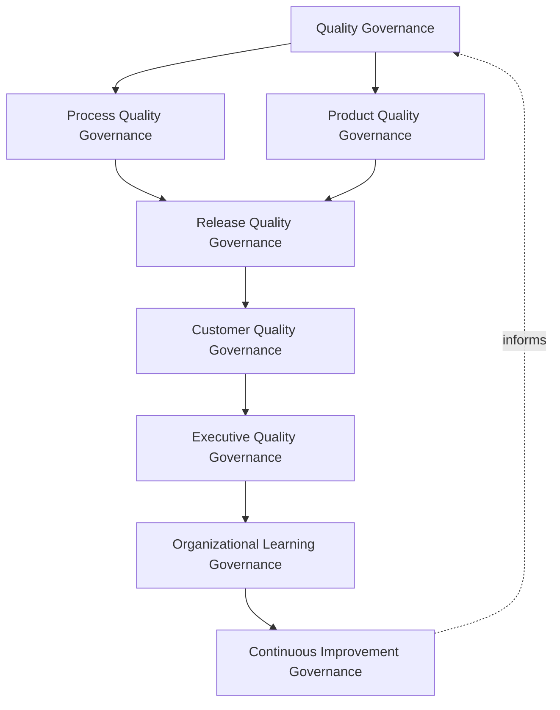
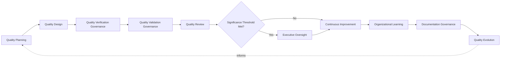
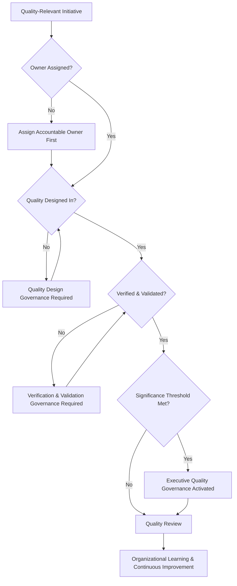
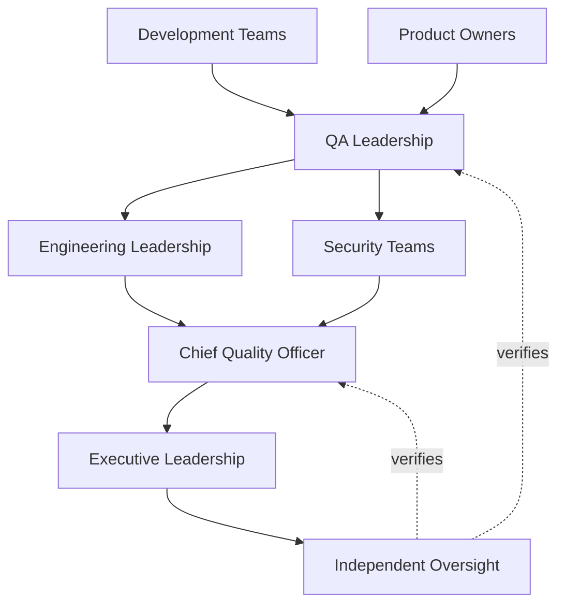
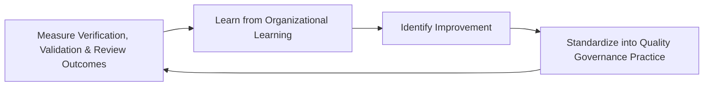
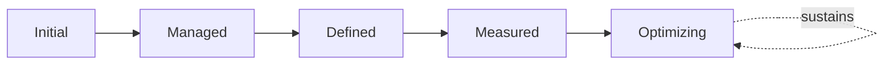

# Enterprise Quality Assurance Framework

## 1. Document Purpose

This document defines the official Enterprise Quality Assurance Framework for **StackLeo Tech Store** — the CQO/VP-of-Engineering-owned executive charter under which quality assurance, quality culture, quality ownership, and continuous quality improvement are governed as a deliberate, enterprise-wide capability. It establishes governance for quality culture, organizational quality accountability, executive oversight, continuous quality improvement, and long-term quality maturity across the StackLeo platform, consistent with ISTQB Advanced Level practice, IEEE 29119, ISO 9001, COBIT governance principles, and TOGAF enterprise architecture thinking.

`qa-governance.md` remains the operating-model governance framework for this folder — the document that defines who is accountable for quality, how quality decisions are made, and the ten specific governance domains (testing, release, defect, documentation, metrics, audit, risk, and compliance governance, among others) that structure day-to-day QA practice. This framework sits alongside it at the same executive tier, with a distinct and complementary emphasis: where `qa-governance.md` governs *how quality decisions are made and by whom*, this framework governs *quality as a lived, enterprise-wide organizational capability and culture* — spanning not only engineering and testing, but product, service, documentation, operations, and compliance quality alike. This framework is to quality culture what `operational-excellence-framework.md` (`09_Operations`) is to operational excellence: the capstone that gives an enterprise-wide capability its own dedicated philosophy and executive mandate, without restating the operating-model detail its companion documents already own.

- **Purpose of Quality Assurance** — to ensure genuine quality is treated as a deliberate, cultivated, enterprise-wide capability at StackLeo, owned by every function that touches the customer experience, rather than the isolated responsibility of a single team applied only at the point of testing.
- **Relationship with Testing Strategy** — `testing-strategy.md` and `testing-governance.md` define how testing verifies quality in operational and governance depth; this framework governs the broader quality culture and organizational capability within which testing practice operates as one, essential expression.
- **Relationship with Software Quality** — `quality-strategy.md` defines what quality means across ten technical quality domains; this framework governs the organizational capability and culture that determines whether those quality expectations are genuinely, consistently achieved in practice.
- **Relationship with SDLC** — quality assurance is exercised across the full software development lifecycle defined in `03_System_Design`, consistent with Prevention Over Detection (Section 2.2); this framework ensures that lifecycle-wide commitment is genuinely governed as an enterprise capability, not confined to a single phase.
- **Relationship with Risk Management** — this framework treats a weak or inconsistent quality culture as a genuine category of organizational risk, connected to `06_Security/enterprise-risk-management-strategy.md` (Section 3.2, Operational Risk Governance).
- **Relationship with Engineering Excellence** — this framework is the quality-specific application of the same accountability and continuous improvement discipline `operational-excellence-framework.md` establishes for operations broadly, ensuring engineering excellence and quality excellence remain genuinely connected, not parallel disciplines.
- **Relationship with Executive Decision-Making** — this framework exists to give executive leadership genuine confidence that quality is a deliberately cultivated organizational trait, a confidence every customer trust, delivery-speed, and market-expansion decision implicitly depends on.

This document is implementation-independent and vendor-neutral. It defines quality assurance philosophy, governance model, domains, and lifecycle conceptually — not specific QA tools, testing platforms, automation frameworks, cloud providers, consulting firms, commercial products, QA procedures, inspection workflows, acceptance testing processes, infrastructure configurations, deployment pipelines, implementation roadmaps, or code.

## 2. Quality Assurance Philosophy

Quality assurance at StackLeo rests on eight principles. Each exists to produce a specific business outcome — quality is governed deliberately because it is the compounding foundation every customer relationship and business ambition ultimately depends on.

### 2.1 Quality is Everyone's Responsibility

Quality is treated as a shared organizational responsibility carried by every function that touches the customer experience, not the sole accountability of a specialist QA team.

- **Business Value** — prevents the erosion that occurs when every other function assumes quality is someone else's job.

### 2.2 Prevention Over Detection

Governance prioritizes preventing defects and quality gaps at their source over relying on detection to catch them after the fact.

- **Business Value** — a defect prevented costs a fraction of one detected, and a fraction again of one that reaches a customer.

### 2.3 Governance Before Verification

The accountability structure — who owns quality, who evaluates it, who approves what proceeds — is established before specific verification activity is undertaken.

- **Business Value** — ensures verification exists because a genuine, governed decision called for it, not as disconnected activity without accountable ownership.

### 2.4 Customer-Centric Quality

Every quality governance decision is made with explicit awareness of its effect on the genuine customer experience, not only internal technical correctness.

- **Business Value** — protects the trust-centered brand commitment in `01_Business/vision.md` by ensuring quality governance never loses sight of genuine customer impact.

### 2.5 Accountability

Every quality domain traces to a specific, named, responsible owner.

- **Business Value** — ensures no dimension of quality is left to drift without someone genuinely responsible for it.

### 2.6 Transparency

Quality status, findings, and improvement progress are documented and visible to those who genuinely need them.

- **Business Value** — allows quality posture to be scrutinized and defended, rather than assumed or asserted.

### 2.7 Continuous Improvement

Quality assurance governance practice matures over time, informed by real quality outcomes and the organization's growth in scale and complexity.

- **Business Value** — keeps quality governance aligned with StackLeo's growth in scale, market reach, and operational complexity.

### 2.8 Business Alignment

Quality assurance decisions are made in service of genuine business priority, focusing attention where quality matters most to the business.

- **Business Value** — ensures limited quality investment is directed toward what genuinely matters most to the business and its customers.

## 3. Enterprise QA Governance Model

Quality assurance governance operates across eight conceptual layers, each holding accountability for a distinct dimension of how StackLeo cultivates quality as an enterprise capability.

### 3.1 Quality Governance

- **Purpose** — own the overall coherence of how the organization pursues quality as a deliberate, enterprise-wide capability.
- **Governance Scope** — oversight spanning every layer in this model and every domain in Section 4.
- **Business Value** — ensures quality is pursued as a single coherent discipline, not a collection of disconnected local efforts.
- **Executive Expectations** — leadership trusts no quality domain exists outside this framework's visibility.

### 3.2 Process Quality Governance

- **Purpose** — own the coherence of how quality is embedded into the processes by which work is planned, built, and delivered.
- **Governance Scope** — oversight of Quality Planning and Quality Design (Sections 5.1–5.2) across every domain in Section 4.
- **Business Value** — ensures quality is designed into how work is done, not inspected in after the fact.
- **Executive Expectations** — leadership trusts process quality is genuinely embedded, not merely documented.

### 3.3 Product Quality Governance

- **Purpose** — own the coherence of how the quality of what is actually built and delivered is verified and validated.
- **Governance Scope** — oversight of Quality Verification and Validation Governance (Sections 5.3–5.4), coordinated with `testing-governance.md`.
- **Business Value** — ensures the platform genuinely meets both its specification and its genuine customer purpose.
- **Executive Expectations** — leadership trusts product quality claims rest on genuine, governed evidence.

### 3.4 Release Quality Governance

- **Purpose** — own the coherence of how accumulated quality evidence supports the decision that a capability is genuinely ready for release.
- **Governance Scope** — oversight coordinated with Release Governance (`qa-governance.md`, Section 4.3) and `release-quality-gates.md`.
- **Business Value** — ensures release decisions rest on genuine, accumulated quality evidence, not assumption or schedule pressure.
- **Executive Expectations** — leadership trusts release quality criteria are never silently bypassed.

### 3.5 Customer Quality Governance

- **Purpose** — own the coherence of how genuine customer experience and feedback inform quality governance.
- **Governance Scope** — oversight applying Customer-Centric Quality (Section 2.4) across every domain in Section 4.
- **Business Value** — ensures quality governance genuinely reflects the customer's actual experience, not only internal measurement.
- **Executive Expectations** — leadership expects customer feedback to be a genuine, weighted input to quality decisions.

### 3.6 Executive Quality Governance

- **Purpose** — own executive-level accountability for the quality decisions carrying the greatest organizational consequence.
- **Governance Scope** — oversight spanning Sections 3.1–3.5 and 3.7 wherever a quality matter rises to genuine executive concern.
- **Business Value** — ensures the most consequential quality risk is visible at the level accountable for the organization as a whole.
- **Executive Expectations** — leadership expects to be informed of, not surprised by, the organization's most significant accepted quality risk.

### 3.7 Organizational Learning Governance

- **Purpose** — own the coherence of how the organization converts individual quality outcomes into durable, shared organizational learning.
- **Governance Scope** — oversight of Organizational Learning (Section 5.8) across every domain in Section 4.
- **Business Value** — ensures every significant quality outcome strengthens the organization's broader capability, not only the specific area affected.
- **Executive Expectations** — leadership expects every significant quality event to produce a documented, attributable lesson.

### 3.8 Continuous Improvement Governance

- **Purpose** — govern the mechanism by which every other layer in this model matures over time.
- **Governance Scope** — consolidates findings from quality reviews, organizational learning, and audits across every domain in Section 4.
- **Business Value** — prevents this framework itself from becoming the next thing that quietly stagnates as the organization scales.
- **Executive Expectations** — leadership expects quality assurance maturity to be assessed periodically, not assumed static once established.

### Enterprise QA Governance Matrix

| Layer | Purpose | Business Value | Executive Expectations |
|---|---|---|---|
| Quality Governance | Own overall coherence of quality as an enterprise-wide capability | Ensures quality is a single coherent discipline | Trusts no quality domain exists outside this framework's visibility |
| Process Quality Governance | Own coherence of embedding quality into how work is done | Ensures quality is designed in, not inspected in after | Trusts process quality is genuinely embedded |
| Product Quality Governance | Own coherence of verifying and validating what is built | Ensures the platform meets specification and genuine purpose | Trusts quality claims rest on genuine, governed evidence |
| Release Quality Governance | Own coherence of using evidence to support release decisions | Ensures release decisions rest on genuine, accumulated evidence | Trusts release criteria are never silently bypassed |
| Customer Quality Governance | Own coherence of how customer feedback informs governance | Ensures governance reflects genuine customer experience | Expects feedback to be a genuine, weighted input |
| Executive Quality Governance | Own executive accountability for highest-consequence decisions | Ensures the most consequential risk is visible to leadership | Expects leadership informed of, not surprised by, accepted risk |
| Organizational Learning Governance | Own coherence of converting outcomes into shared learning | Strengthens the organization's broader quality capability | Expects every significant event to produce a documented lesson |
| Continuous Improvement Governance | Govern maturation of every other layer | Prevents this framework itself from stagnating | Expects maturity to be assessed periodically |

*Diagram 1: Enterprise Quality Assurance Governance Framework — overall governance branches into process and product quality governance, converging on release quality governance ahead of customer quality governance, resolving into executive oversight and organizational learning that feeds continuous improvement back into the model.*

## 4. Enterprise QA Domains

Quality assurance is governed across ten conceptual domains, each requiring a distinct governance emphasis, organized by area of organizational quality rather than by governance activity type.

### 4.1 Product Quality

- **Purpose** — govern the organization's pursuit of genuine quality in the platform's functional and non-functional characteristics.
- **Governance Considerations** — governed under Product Quality Governance (Section 3.3), coordinated with `quality-strategy.md` (Section 4).
- **Business Importance** — protects the fundamental correctness and reliability customers directly depend on.
- **Executive Expectations** — leadership expects product quality to be evidenced, not assumed, before customer exposure.

### 4.2 Service Quality

- **Purpose** — govern the organization's pursuit of genuine quality in how services are delivered and experienced.
- **Governance Considerations** — governed under Customer Quality Governance (Section 3.5), coordinated with `09_Operations/service-level-governance.md`.
- **Business Importance** — protects the trust relationship every service interaction depends on.
- **Executive Expectations** — leadership expects service quality to be governed with the same rigor as product quality.

### 4.3 Engineering Quality

- **Purpose** — govern the organization's pursuit of genuine quality in how the platform is designed, built, and maintained.
- **Governance Considerations** — governed under Process Quality Governance (Section 3.2), coordinated with `03_System_Design/architecture-principles.md`.
- **Business Importance** — protects the technical foundation every other quality domain ultimately depends on.
- **Executive Expectations** — leadership expects engineering quality to be treated as a structural property, not a constraint imposed afterward.

### 4.4 Security Quality

- **Purpose** — govern the organization's pursuit of genuine quality in how the platform protects customer and business data.
- **Governance Considerations** — governed jointly with, and never superseding, `06_Security/security-governance.md`, which remains authoritative for security-specific obligations.
- **Business Importance** — protects customer data, platform integrity, and the trust foundation every other domain depends on.
- **Executive Expectations** — leadership expects security quality to be pursued with the rigor defined in `06_Security/security-governance.md`.

### 4.5 Performance Quality

- **Purpose** — govern the organization's pursuit of genuine quality in the platform's responsiveness and efficiency.
- **Governance Considerations** — governed under Product Quality Governance (Section 3.3), coordinated with `testing-governance.md` (Section 4.5).
- **Business Importance** — protects conversion and customer trust, both highly sensitive to responsiveness.
- **Executive Expectations** — leadership expects performance quality to be evidenced for capability affecting the critical path.

### 4.6 Customer Experience Quality

- **Purpose** — govern the organization's pursuit of genuine quality in the customer's overall experience of the platform.
- **Governance Considerations** — governed under Customer Quality Governance (Section 3.5), grounded in genuine customer feedback.
- **Business Importance** — protects the trust relationship every customer interaction depends on.
- **Executive Expectations** — leadership expects customer experience quality to be prioritized above internally-focused efficiency.

### 4.7 Documentation Quality

- **Purpose** — govern the organization's pursuit of genuine quality and integrity in the records that support the platform and its governance.
- **Governance Considerations** — governed under Process Quality Governance (Section 3.2), coordinated with Documentation Governance (`qa-governance.md`, Section 4.5).
- **Business Importance** — protects the organization's ability to trust and rely on its own accumulated evidence.
- **Executive Expectations** — leadership expects documentation quality to be sustained continuously, not reconstructed only when needed.

### 4.8 Operational Quality

- **Purpose** — govern the organization's pursuit of genuine quality in how the platform is operated once live.
- **Governance Considerations** — governed under Product Quality Governance (Section 3.3), coordinated with `09_Operations/operational-excellence-framework.md`.
- **Business Importance** — protects the operational reliability customers directly experience day to day.
- **Executive Expectations** — leadership expects operational quality to be governed with consistent rigor across the platform lifecycle.

### 4.9 Compliance Quality

- **Purpose** — govern the organization's pursuit of genuine quality in meeting its regulatory and contractual obligations.
- **Governance Considerations** — governed under Executive Quality Governance (Section 3.6), coordinated with `06_Security/compliance-governance.md`.
- **Business Importance** — protects the business's standing with regulators and its contractual counterparties.
- **Executive Expectations** — leadership expects compliance quality to be sustained continuously, not demonstrated only at audit time.

### 4.10 Enterprise Quality

- **Purpose** — govern the organization's pursuit of genuine quality in how it is led, governed, and directed at the highest level.
- **Governance Considerations** — governed exclusively under Executive Quality Governance (Section 3.6).
- **Business Importance** — protects the organization's most consequential capability — the integrity of its own leadership and decision-making.
- **Executive Expectations** — leadership expects to hold itself to the same quality standard this framework applies elsewhere.

### Enterprise QA Domain Matrix

| Domain | Purpose | Business Importance | Executive Expectations |
|---|---|---|---|
| Product Quality | Govern quality in functional and non-functional characteristics | Protects the fundamental correctness customers depend on | Evidenced, not assumed, before customer exposure |
| Service Quality | Govern quality in how services are delivered and experienced | Protects the trust relationship every service interaction depends on | Governed with the same rigor as product quality |
| Engineering Quality | Govern quality in how the platform is designed and built | Protects the technical foundation every domain depends on | Treated as a structural property, not an afterthought |
| Security Quality | Govern quality in protecting customer and business data | Protects data, integrity, and the trust foundation every domain depends on | Pursued with rigor per `security-governance.md` |
| Performance Quality | Govern quality in responsiveness and efficiency | Protects conversion and customer trust | Evidenced for capability affecting the critical path |
| Customer Experience Quality | Govern quality in the customer's overall experience | Protects the trust relationship every interaction depends on | Prioritized above internally-focused efficiency |
| Documentation Quality | Govern quality and integrity of supporting records | Protects the organization's ability to trust its own evidence | Sustained continuously, not reconstructed when needed |
| Operational Quality | Govern quality in how the platform is operated once live | Protects operational reliability customers experience daily | Governed with consistent rigor across the lifecycle |
| Compliance Quality | Govern quality in meeting regulatory and contractual obligations | Protects standing with regulators and counterparties | Sustained continuously, not demonstrated only at audit time |
| Enterprise Quality | Govern quality in leadership and governance itself | Protects the integrity of leadership and decision-making | Leadership holds itself to the same standard |

## 5. Enterprise QA Lifecycle

Quality assurance governance operates across ten conceptual lifecycle stages, applicable across every domain in Section 4.

### 5.1 Quality Planning

- **Purpose** — govern how quality expectations for a capability or initiative are determined before design begins.
- **Governance Objectives** — apply Prevention Over Detection (Section 2.2) from the earliest planning point.
- **Business Value** — ensures quality effort is deliberately planned and resourced, not assembled reactively.

### 5.2 Quality Design

- **Purpose** — govern how quality is deliberately designed into a capability's approach before it is built.
- **Governance Objectives** — apply Process Quality Governance (Section 3.2) consistently across every proposed capability.
- **Business Value** — ensures quality is a structural property of what is built, not a constraint imposed afterward.

### 5.3 Quality Verification Governance

- **Purpose** — govern how a built capability is confirmed to meet its defined specification, coordinated with `testing-governance.md`.
- **Governance Objectives** — apply Product Quality Governance (Section 3.3) to ensure verification evidence is genuine and trustworthy.
- **Business Value** — produces objective confidence that a capability was built correctly.

### 5.4 Quality Validation Governance

- **Purpose** — govern how a built capability is confirmed to genuinely serve its intended customer and business purpose.
- **Governance Objectives** — apply Customer-Centric Quality (Section 2.4) to ensure the correct thing was built, not only the specified thing.
- **Business Value** — reduces the risk of a capability passing every verification while still failing the real customer it was built for.

### 5.5 Quality Review

- **Purpose** — govern the formal, periodic assessment of overall quality posture across a domain or the platform.
- **Governance Objectives** — apply Quality Governance (Section 3.1) honestly, regardless of whether the outcome is favorable.
- **Business Value** — ensures the organization knows its genuine quality posture, not an assumed one.

### 5.6 Executive Oversight

- **Purpose** — govern the point at which a quality matter requires executive-level visibility or decision.
- **Governance Objectives** — apply Executive Quality Governance (Section 3.6) against clearly understood significance thresholds.
- **Business Value** — ensures leadership is engaged exactly when genuinely warranted.

### 5.7 Continuous Improvement

- **Purpose** — govern how confirmed quality gaps are translated into genuine, lasting improvement action.
- **Governance Objectives** — apply Continuous Improvement Governance (Section 3.8) through to verified completion.
- **Business Value** — ensures identified gaps genuinely lead to improved future quality outcomes.

### 5.8 Organizational Learning

- **Purpose** — formally capture what a quality review reveals about quality assurance governance itself.
- **Governance Objectives** — apply Organizational Learning Governance (Section 3.7), requiring lessons to be documented and attributed.
- **Business Value** — ensures the organization genuinely learns from experience rather than repeating the same gaps.

### 5.9 Documentation Governance

- **Purpose** — govern the completeness and integrity of the quality assurance record itself.
- **Governance Objectives** — require documentation to remain consistent with `qa-governance.md` and `quality-strategy.md` as they evolve.
- **Business Value** — ensures the organization retains a genuine, trustworthy record of quality decisions and outcomes.

### 5.10 Quality Evolution

- **Purpose** — apply accumulated lessons and review findings to strengthen future quality assurance governance.
- **Governance Objectives** — require findings to be genuinely analyzed for recurring patterns and evolving business need.
- **Business Value** — turns each cycle of quality practice into an input that makes future quality governance genuinely stronger.

### Enterprise QA Lifecycle Matrix

| Stage | Purpose | Governance Objective | Business Value |
|---|---|---|---|
| Quality Planning | Determine quality expectations before design begins | Applies prevention thinking from the earliest point | Ensures quality effort is deliberately planned, not reactive |
| Quality Design | Design quality into a capability's approach before it is built | Applied consistently across every proposed capability | Ensures quality is a structural property, not an afterthought |
| Quality Verification Governance | Confirm a built capability meets its specification | Ensures verification evidence is genuine and trustworthy | Produces objective confidence the capability was built correctly |
| Quality Validation Governance | Confirm the capability serves its genuine purpose | Ensures the correct thing was built, not only the specified thing | Reduces risk of passing verification while failing real customers |
| Quality Review | Formally assess overall quality posture | Applied honestly regardless of outcome | Ensures the organization knows its genuine quality posture |
| Executive Oversight | Elevate matters requiring executive visibility | Applied against clear significance thresholds | Engages leadership exactly when warranted |
| Continuous Improvement | Translate confirmed gaps into improvement action | Carried through to verified completion | Ensures gaps genuinely lead to improved outcomes |
| Organizational Learning | Capture governance implications from review | Documented and attributed to specific implications | Ensures genuine learning rather than repeated gaps |
| Documentation Governance | Maintain completeness and integrity of the record | Kept consistent with subordinate documentation | Retains a genuine, trustworthy record |
| Quality Evolution | Apply lessons to strengthen future governance | Findings genuinely analyzed for recurring patterns | Makes future quality governance genuinely stronger |

*Diagram 2: Enterprise QA Lifecycle — quality planning and design inform verification and validation governance, feeding quality review that escalates to executive oversight only where thresholds are met before continuous improvement, with organizational learning and documentation governance feeding quality evolution back into the cycle.*

## 6. Quality Assurance Principles

- **Prevention** — governance prioritizes preventing quality gaps at their source, consistent with Section 2.2.
- **Accountability** — every quality domain traces to a specific, named, responsible owner, consistent with Section 2.5.
- **Transparency** — quality status, findings, and improvement are documented and visible, consistent with Section 2.6.
- **Customer Focus** — every governance decision considers genuine customer impact, consistent with Section 2.4.
- **Risk Awareness** — quality scrutiny is proportionate to genuine business, customer, and financial risk.
- **Traceability** — every quality decision and its rationale can be reconstructed after the fact.
- **Continuous Learning** — every quality outcome deepens the organization's genuine collective understanding.
- **Continuous Improvement** — governance practice matures over time, informed by real quality outcomes.

### Quality Assurance Principles Matrix

| Principle | Description | Business Value |
|---|---|---|
| Prevention | Governance prioritizes preventing gaps at their source | Reduces the cumulative cost of defects discovered late |
| Accountability | Every domain traces to a specific, named, responsible owner | Ensures no dimension of quality drifts without genuine ownership |
| Transparency | Status, findings, and improvement documented and visible | Allows quality posture to be scrutinized and defended |
| Customer Focus | Every decision considers genuine customer impact | Protects the trust relationship every quality decision affects |
| Risk Awareness | Scrutiny proportionate to genuine business, customer, financial risk | Directs limited quality investment where it matters most |
| Traceability | Every decision and rationale can be reconstructed after the fact | Supports accountability, audit, and organizational learning |
| Continuous Learning | Every outcome deepens genuine collective understanding | Converts quality experience into compounding organizational capability |
| Continuous Improvement | Practice matures from real quality outcomes | Keeps governance aligned with organizational growth |

*Diagram 4: Enterprise QA Governance Decision Flow — a quality-relevant initiative is checked for assigned ownership, designed-in quality, and genuine verification and validation, with executive governance activated upon meeting significance thresholds, resolving into quality review and continuous improvement.*

## 7. Ownership & Accountability

Governance authority for quality assurance is distributed deliberately across eight accountable functions, defined here at the governance-objective level, without prescribing specific operational QA responsibilities.

### 7.1 Executive Leadership

- **Governance Objective** — the Board and executive leadership hold ultimate accountability for whether the organization genuinely cultivates quality as an enterprise capability.
- **Business Value** — provides a single point of ultimate accountability for whether this framework is genuinely functioning as intended.

### 7.2 Chief Quality Officer

- **Governance Objective** — the Chief Quality Officer owns the coherence and enforcement of this framework across every domain, layer, and stage it defines.
- **Business Value** — provides a single point of specialist accountability for whether quality assurance is genuinely functioning as intended.

### 7.3 Engineering Leadership

- **Governance Objective** — engineering leadership owns Engineering Quality (Section 4.3) and the structural embedding of quality into how the platform is designed and built.
- **Business Value** — ensures quality is genuinely designed in, not imposed as an afterthought.

### 7.4 QA Leadership

- **Governance Objective** — QA leadership owns Process and Product Quality Governance (Sections 3.2–3.3) in coordination with `qa-governance.md` and `testing-governance.md`.
- **Business Value** — provides a single point of specialist accountability for the framework's coherence with existing QA governance.

### 7.5 Product Owners

- **Governance Objective** — product owners own Quality Validation Governance (Section 5.4) for their assigned capability, confirming genuine fitness for business purpose.
- **Business Value** — ensures "technically correct" and "genuinely fit for business purpose" are confirmed to be the same thing.

### 7.6 Development Teams

- **Governance Objective** — development teams own Quality Design and Quality Verification Governance (Sections 5.2–5.3) within their assigned capability.
- **Business Value** — embeds quality accountability closest to where a capability is actually built.

### 7.7 Security Teams

- **Governance Objective** — security teams own Security Quality (Section 4.4) jointly with `06_Security/security-governance.md`, which remains authoritative for security-specific obligations.
- **Business Value** — ensures security-relevant quality remains integrated with, not separate from, broader quality governance.

### 7.8 Independent Oversight

- **Governance Objective** — an independent function, separate from those who design and operate this framework, periodically verifies its overall effectiveness.
- **Business Value** — prevents governance from being assumed effective on the word of the same function responsible for running it.

### Ownership & Accountability Matrix

| Role | Governance Objective | Business Value |
|---|---|---|
| Executive Leadership | Hold ultimate accountability for genuinely cultivating quality | Provides a single point of ultimate accountability |
| Chief Quality Officer | Own coherence and enforcement of this framework | Provides a single point of specialist accountability |
| Engineering Leadership | Own engineering quality and structural embedding | Ensures quality is genuinely designed in, not imposed after |
| QA Leadership | Own process and product quality governance | Provides specialist accountability for coherence with QA governance |
| Product Owners | Own quality validation for their assigned capability | Confirms technical correctness and business fitness are the same thing |
| Development Teams | Own quality design and verification governance | Embeds quality accountability closest to where capability is built |
| Security Teams | Own security quality jointly with `security-governance.md` | Keeps security quality integrated with broader governance |
| Independent Oversight | Independently verify overall governance effectiveness | Prevents self-assessed assumption of effectiveness |

*Diagram 3: QA Ownership & Accountability Model — accountability flows from development teams and product owners through QA leadership, engineering leadership, and security teams into the Chief Quality Officer, converging on executive leadership verified by independent oversight.*

## 8. Executive Oversight

- **Executive Quality Reviews** — the overall coherence of this framework is formally reviewed on a regular cadence, consistent with `qa-governance.md` (Section 8).
- **Product Quality Reporting** — aggregated quality health — verification and validation outcomes, quality review findings, improvement progress — is reported to executive leadership and the Board.
- **Governance Reviews** — the governance model, domains, and lifecycle defined in this framework (Sections 3–7) are periodically reassessed for continued fitness.
- **Release Quality Oversight** — the organization's readiness to activate Release Quality Governance (Section 3.4) is reviewed directly with executive leadership.
- **Documentation Governance** — this framework's relationship to `qa-governance.md`, `quality-strategy.md`, and `testing-governance.md` is kept current as those documents evolve.
- **Organizational Readiness** — quality decisions, evidence, and outcomes are maintained in a state ready for internal or external audit at any time, coordinated with `06_Security/audit-governance.md`.

### Executive Oversight Matrix

| Oversight Mechanism | Purpose | Governance Role |
|---|---|---|
| Executive Quality Reviews | Confirm overall framework coherence | Regular, predictable cadence for the framework as a whole |
| Product Quality Reporting | Provide leadership a single, coherent quality picture | Reports verification, validation, review, and improvement outcomes |
| Governance Reviews | Reassess the governance model itself for continued fitness | Applies to Sections 3–7 of this framework |
| Release Quality Oversight | Review readiness to activate release quality governance | Direct executive-level review of release decision rigor |
| Documentation Governance | Keep this framework's subordinate relationships current | Updated as related documents evolve |
| Organizational Readiness | Maintain decisions and evidence ready for independent review | Continuous state, coordinated with audit governance |

### Governance Responsibility Matrix

| Role | Responsibility |
|---|---|
| Executive Leadership | Owns ultimate accountability for genuinely cultivating quality as an enterprise capability. |
| Chief Quality Officer | Owns coherence and enforcement of this framework, in partnership with executive leadership. |
| QA Governance Lead | Owns the operating-model governance structure within `qa-governance.md`. |
| Engineering Leadership | Owns engineering quality and structural embedding of quality into what is built. |
| Product Owners | Own quality validation for their assigned capability. |
| Development Teams | Own quality design and verification governance within their assigned capability. |
| Security Teams | Own security quality jointly with `06_Security/security-governance.md`. |
| Independent Oversight | Independently verifies the overall effectiveness of this framework. |

## 9. Future Readiness

This framework is designed to remain valid as StackLeo evolves in scale, geography, and organizational complexity, without requiring redefinition of its underlying philosophy.

- **AI-Assisted Quality Assurance** — as quality verification and review increasingly incorporate AI-assisted analysis, they remain governed under Quality Verification Governance and Quality Review (Sections 5.3, 5.5) at the same rigor as any other method.
- **Intelligent Quality Governance** — where quality decisions increasingly draw on intelligent analysis across domains, that analysis remains subject to the same Quality Governance (Section 3.1) as any other evaluation method.
- **Enterprise Scale** — the governance model, domains, and lifecycle defined throughout this framework are defined independently of organizational size, so they remain coherent as StackLeo's operational complexity grows substantially.
- **Global Expansion** — Quality Planning and Quality Design (Sections 5.1–5.2) are structured to be re-applied as StackLeo expands from Bangladesh into South Asia and global markets, each with genuinely distinct quality considerations.
- **Continuous Quality Engineering** — Quality Verification and Validation Governance (Sections 5.3–5.4) are structured to extend coherently as quality activity becomes increasingly continuous and integrated across the delivery lifecycle.
- **Autonomous Quality (conceptual only)** — where automation increasingly performs steps within the quality lifecycle, that automation remains subject to the same ownership and executive oversight as any human-performed activity.
- **Digital Quality Platforms** — this framework's governance discipline is treated as a direct contributor to the digital trust customers, partners, and regulators extend to StackLeo, not merely an internal engineering exercise.
- **Future Engineering Organizations** — Continuous Improvement Governance (Section 3.8) is structured to absorb genuinely new engineering organizational models — additional sales channels, multi-vendor operations, distributed teams — without requiring this framework to be rewritten.

## 10. Quality Assurance Maturity Model

Quality assurance maturity is described across five conceptual levels, consistent with ISO 9001 and established process maturity thinking.

- **Initial** — quality assurance, where it exists, is informal and inconsistent; quality depends on individual discretion, and ownership is unclear.
- **Managed** — basic quality governance exists for individual domains, but consistency across the ten domains in Section 4 varies significantly.
- **Defined** — the governance model, domains, and lifecycle are standardized, documented, and consistently applied across the organization, consistent with the model defined throughout this framework.
- **Measured** — verification and validation outcomes, quality review findings, and improvement completion are measured systematically, and decisions are grounded in genuine evidence rather than qualitative impression alone.
- **Optimizing** — quality assurance governance is continuously and deliberately improved based on quantitative evidence and organizational learning; improvement itself is a managed, ongoing discipline rather than an occasional initiative.

### Quality Assurance Maturity Model Matrix

| Level | Characteristics | Primary Focus |
|---|---|---|
| Initial | Informal, inconsistent practice; quality depends on individual discretion | Ad hoc, individually-dependent quality practice |
| Managed | Basic governance exists per domain; consistency varies | Domain-level consistency |
| Defined | Standardized governance model, domains, and lifecycle | Organization-wide consistency and clear ownership |
| Measured | Outcomes, findings, and improvement completion measured systematically | Evidence-based quality governance decisions |
| Optimizing | Practice continuously and deliberately improved from evidence | Sustained, deliberate improvement as a discipline |

*Diagram 5: Continuous Quality Improvement Cycle — quality outcomes are measured, learned from, improved upon, and standardized back into governed practice, on a continuing basis.*

*Diagram 6: Quality Assurance Maturity Progression Model — maturity advances from informal, discretion-dependent quality practice toward standardized, measured, and continuously optimized quality assurance governance.*

## 11. Anti-Patterns

The following recurring failure patterns are explicitly recognized and avoided, as each one structurally undermines this framework.

### Anti-Pattern Summary

| Anti-Pattern | Why It's Avoided |
|---|---|
| Quality Without Governance | Contradicts Governance Before Verification (Section 2.3); pursuing quality without genuine governance produces disconnected effort with no accountable direction. |
| Testing Without QA Strategy | Contradicts Quality Governance (Section 3.1); testing activity disconnected from a genuine quality strategy verifies without a coherent purpose. |
| Undefined Quality Ownership | Contradicts Accountability (Section 2.5); a quality domain with no accountable owner has no one genuinely responsible for it. |
| Weak Executive Visibility | Contradicts Product Quality Reporting (Section 8); leadership cannot govern quality risk it is never shown. |
| Poor Documentation | Undermines Documentation Governance (Sections 5.9, 8) and Transparency (Section 2.6), leaving quality decisions unclear or unverifiable after the fact. |
| Siloed Quality Practices | Contradicts Quality is Everyone's Responsibility (Section 2.1); confining quality to a single function leaves other functions assuming it is someone else's job. |
| Reactive Quality Management | Contradicts Prevention Over Detection (Section 2.2); addressing quality only once problems are visible forfeits the far greater value of preventing them. |
| Missing Continuous Improvement | Contradicts Continuous Improvement (Sections 2.7, 3.8); without deliberate improvement, quality governance stagnates as the organization and its risk landscape grow. |

## 12. Document Information

| Property | Value |
|----------|-------|
| Document | quality-assurance-framework.md |
| Version | 1.0.0 |
| Status | Active |
| Maintained By | StackLeo |
| Last Updated | 2026-07-24 |

---

© StackLeo. All Rights Reserved.
