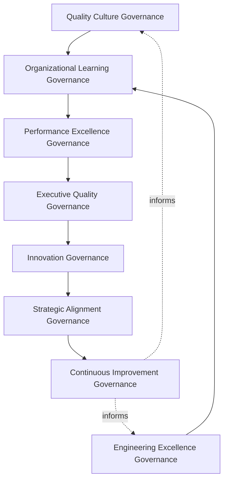
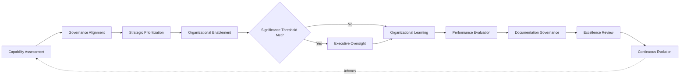
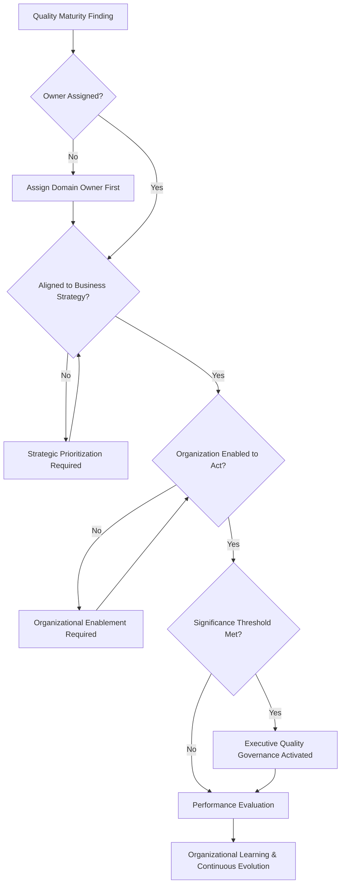
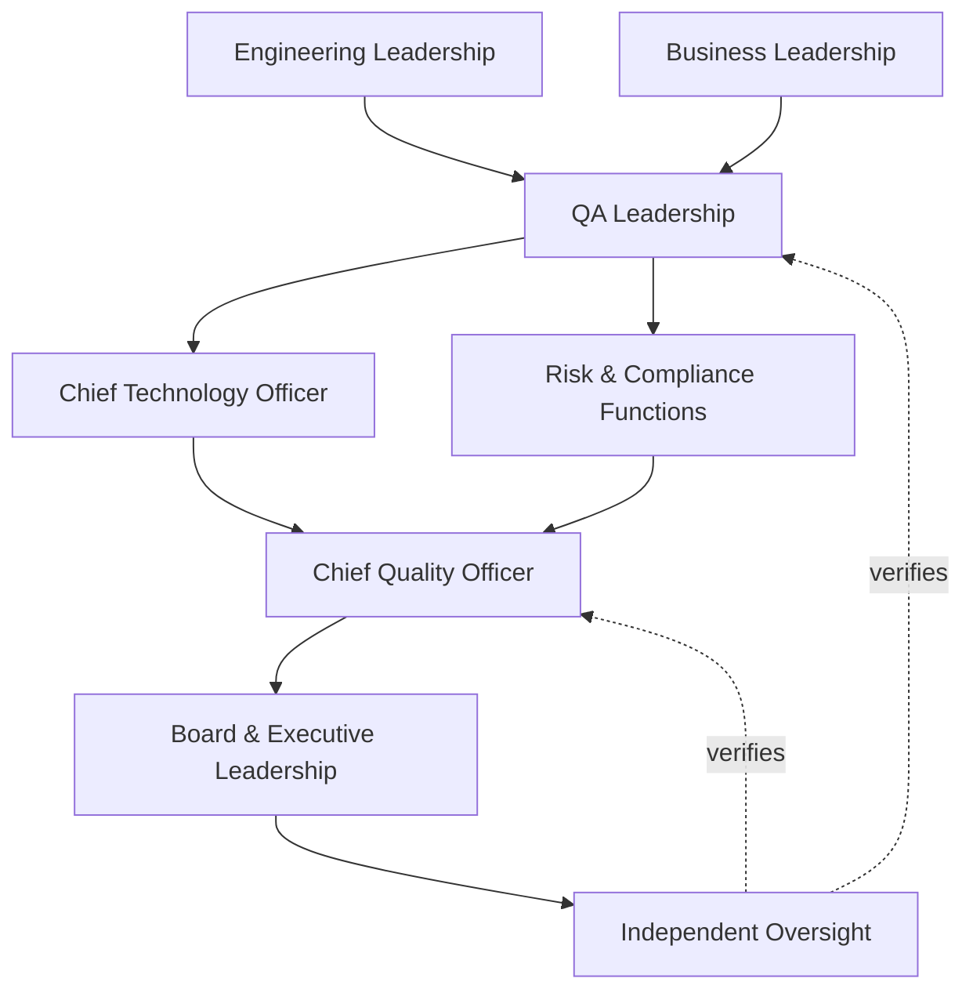
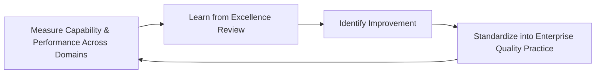
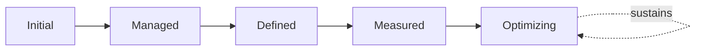

# Enterprise Quality Maturity Framework

## 1. Document Purpose

This document defines the official Enterprise Quality Maturity Framework for **StackLeo Tech Store** — the CQO/CTO-owned executive charter under which quality maturity, engineering excellence, organizational learning, and long-term enterprise quality capability are governed as a deliberate, enterprise-wide discipline. It establishes governance for quality maturity, engineering excellence, organizational learning, executive oversight, continuous quality evolution, and enterprise quality capability across the StackLeo platform, consistent with CMMI-inspired maturity thinking, ISTQB Advanced Level practice, IEEE 29119, ISO 9001, COBIT governance principles, and TOGAF enterprise architecture thinking.

Every governance document in `08_Quality_Assurance` already defines its own maturity model for its own domain: `qa-governance.md` (QA maturity), `testing-governance.md` (testing maturity), `test-automation-governance.md` (automation maturity), `quality-metrics-governance.md` (metrics maturity), `defect-management-governance.md` (defect maturity), and `test-governance-framework.md` (policy governance maturity). Each of those models is correct and remains authoritative within its own domain. This framework does not replace or restate any of them. It is the enterprise-wide capstone that synthesizes those individual domain maturity pictures into one coherent view of StackLeo's overall quality capability, and it is the document that gives Engineering Excellence — referenced today only as a principle within `quality-strategy.md` (Section 2.6) — its own dedicated philosophy, governance model, and executive mandate, exactly as `operational-excellence-framework.md` (`09_Operations`) does for operational excellence.

- **Purpose of Quality Maturity** — to ensure StackLeo understands, deliberately cultivates, and can honestly account for its overall quality capability as a single enterprise picture, rather than as six or more disconnected domain maturity assessments that leadership must reconcile on its own.
- **Relationship with Testing Strategy** — `testing-strategy.md` and `testing-governance.md` elaborate testing maturity in full domain depth; this framework treats that maturity as one genuine input to the enterprise-wide picture, without restating its detail.
- **Relationship with Quality Assurance** — `quality-assurance-framework.md` and `qa-governance.md` govern quality culture and the QA operating model; this framework governs the maturity — the deliberate, measurable evolution over time — of the capability those documents establish.
- **Relationship with Engineering Excellence** — this framework is the dedicated governance treatment of Engineering Excellence (`quality-strategy.md`, Section 2.6), ensuring engineering practice maturity is governed with the same rigor as testing, automation, and defect maturity, not treated as an unmeasured aspiration.
- **Relationship with Enterprise Strategy** — this framework ensures quality maturity remains a deliberate expression of `01_Business/business-model.md` and `01_Business/vision.md`, invested in because it genuinely serves the business, not pursued as an abstract engineering ideal.
- **Relationship with Executive Decision-Making** — this framework exists to give executive leadership one honest, synthesized answer to "how mature is our quality capability, overall" — a question no single domain document can answer alone.
- **Relationship with Continuous Improvement** — this framework treats every domain maturity model in this folder as a genuine input to enterprise-wide continuous evolution, ensuring improvement in one domain is understood in the context of the whole, not pursued in isolation.

This document is implementation-independent and vendor-neutral. It defines quality maturity philosophy, governance model, domains, and lifecycle conceptually — not specific quality tools, audit platforms, assessment software, consulting firms, cloud providers, certification vendors, commercial products, maturity assessment procedures, audit checklists, implementation roadmaps, certification processes, infrastructure configurations, operational QA activities, improvement execution plans, or code.

## 2. Quality Maturity Philosophy

Quality maturity governance at StackLeo rests on eight principles. Each exists to produce a specific business outcome — maturity is governed deliberately because genuine capability compounds only when it is understood, cultivated, and honestly measured as a whole.

### 2.1 Quality as an Organizational Capability

Quality maturity is treated as a genuine, cultivated organizational capability that compounds over time, not a static state achieved once and then assumed.

- **Business Value** — ensures quality capability continues to strengthen as the organization grows, rather than plateauing at its initial level.

### 2.2 Continuous Evolution Over Perfection

Governance pursues genuine, continuous evolution in quality capability rather than treating any fixed maturity level as a final destination.

- **Business Value** — keeps the organization oriented toward genuine, ongoing improvement rather than complacency once a target is reached.

### 2.3 Governance Before Optimization

The accountability structure for enterprise-wide quality maturity is established before specific maturity-improvement activity is undertaken.

- **Business Value** — ensures maturity investment exists because a genuine, governed decision called for it, not as disconnected local initiative.

### 2.4 Customer-Centric Excellence

Quality maturity is pursued because it genuinely improves the customer's experience of the platform, not as an internal engineering ideal disconnected from customer value.

- **Business Value** — protects the trust-centered brand commitment in `01_Business/vision.md` by ensuring maturity investment translates into genuine customer value.

### 2.5 Accountability

Every quality maturity domain traces to a specific, named, responsible owner.

- **Business Value** — ensures no dimension of enterprise quality capability is left to drift without someone genuinely responsible for it.

### 2.6 Transparency

Quality maturity findings, trends, and investment decisions are documented and visible to those who genuinely need them.

- **Business Value** — allows the organization's true quality capability to be honestly scrutinized, not merely asserted.

### 2.7 Organizational Learning

Every maturity finding, across every domain, deepens the organization's genuine collective understanding of its own capability.

- **Business Value** — converts scattered domain-level findings into compounding, enterprise-wide organizational insight.

### 2.8 Business Alignment

Quality maturity investment decisions are made in service of genuine business priority, focusing capability-building where it matters most.

- **Business Value** — ensures limited maturity investment is directed toward what genuinely matters most to the business and its customers.

## 3. Enterprise Quality Maturity Governance Model

Quality maturity governance operates across eight conceptual layers, each holding accountability for a distinct dimension of how StackLeo governs its overall quality capability.

### 3.1 Quality Culture Governance

- **Purpose** — own the coherence of how quality culture, as governed in `quality-assurance-framework.md`, contributes to overall enterprise maturity.
- **Governance Scope** — oversight synthesizing Quality Governance (`quality-assurance-framework.md`, Section 3.1) into the enterprise maturity picture.
- **Business Value** — ensures cultural maturity is understood as a genuine, measurable dimension of capability, not an intangible aspiration.
- **Executive Expectations** — leadership trusts quality culture maturity is honestly assessed, not assumed favorable.

### 3.2 Engineering Excellence Governance

- **Purpose** — own the coherence of how engineering practice maturity is governed as a dedicated dimension of enterprise quality capability.
- **Governance Scope** — oversight of Engineering Excellence (`quality-strategy.md`, Section 2.6), given full governance treatment here for the first time.
- **Business Value** — ensures engineering discipline maturity is measured and cultivated with the same rigor as testing and automation maturity.
- **Executive Expectations** — leadership trusts engineering excellence is genuinely governed, not left as an unmeasured aspiration.

### 3.3 Organizational Learning Governance

- **Purpose** — own the coherence of how maturity findings across every domain in Section 4 are converted into shared organizational learning.
- **Governance Scope** — oversight of Organizational Learning (Section 5.6) across every domain in Section 4.
- **Business Value** — ensures a finding in one domain genuinely informs capability-building in others, not treated in isolation.
- **Executive Expectations** — leadership expects every significant maturity finding to produce a documented, attributable, enterprise-wide lesson.

### 3.4 Performance Excellence Governance

- **Purpose** — own the coherence of how quality maturity translates into genuine, measurable organizational performance.
- **Governance Scope** — oversight of Performance Evaluation (Section 5.7), coordinated with `quality-metrics-governance.md`.
- **Business Value** — ensures maturity investment is verified to produce genuine performance improvement, not assumed to.
- **Executive Expectations** — leadership trusts maturity claims are backed by genuine, measured performance evidence.

### 3.5 Executive Quality Governance

- **Purpose** — own executive-level accountability for the maturity decisions carrying the greatest organizational consequence.
- **Governance Scope** — oversight spanning Sections 3.1–3.4 and 3.6 wherever a maturity matter rises to genuine executive concern.
- **Business Value** — ensures the most consequential capability gaps are visible at the level accountable for the organization as a whole.
- **Executive Expectations** — leadership expects to be informed of, not surprised by, the organization's most significant capability gap.

### 3.6 Innovation Governance

- **Purpose** — own the coherence of how genuinely new approaches to quality capability are identified and deliberately pursued.
- **Governance Scope** — oversight of Strategic Prioritization (Section 5.3) wherever it surfaces a genuinely novel capability opportunity.
- **Business Value** — ensures the organization remains genuinely open to better ways of building quality capability, not anchored to past practice.
- **Executive Expectations** — leadership expects innovation in quality practice to be deliberately cultivated, not left to spontaneous occurrence.

### 3.7 Strategic Alignment Governance

- **Purpose** — own the coherence of how enterprise quality maturity investment remains connected to genuine business strategy.
- **Governance Scope** — oversight of Strategic Prioritization (Section 5.3), coordinated with `01_Business/business-model.md`.
- **Business Value** — prevents maturity investment from becoming a technical exercise disconnected from business intent.
- **Executive Expectations** — leadership expects maturity priorities to remain genuinely aligned with evolving business strategy.

### 3.8 Continuous Improvement Governance

- **Purpose** — govern the mechanism by which every other layer in this model matures over time.
- **Governance Scope** — consolidates findings from excellence review, audits, and organizational learning across every domain in Section 4.
- **Business Value** — prevents this framework itself from becoming the next thing that quietly stagnates as the organization scales.
- **Executive Expectations** — leadership expects the maturity of this framework itself to be assessed periodically, not assumed static once established.

### Enterprise Quality Maturity Governance Matrix

| Layer | Purpose | Business Value | Executive Expectations |
|---|---|---|---|
| Quality Culture Governance | Own coherence of culture's contribution to enterprise maturity | Ensures cultural maturity is measurable, not intangible | Trusts culture maturity is honestly assessed |
| Engineering Excellence Governance | Own coherence of governing engineering practice maturity | Measures and cultivates engineering discipline with genuine rigor | Trusts engineering excellence is genuinely governed |
| Organizational Learning Governance | Own coherence of converting findings into shared learning | Ensures findings in one domain inform others | Expects every significant finding to produce an enterprise-wide lesson |
| Performance Excellence Governance | Own coherence of translating maturity into performance | Verifies maturity investment produces genuine improvement | Trusts maturity claims are backed by measured evidence |
| Executive Quality Governance | Own executive accountability for highest-consequence decisions | Ensures the most consequential gaps are visible to leadership | Expects leadership informed of, not surprised by, top gaps |
| Innovation Governance | Own coherence of pursuing genuinely new approaches | Keeps the organization open to better capability-building | Expects innovation to be deliberately cultivated |
| Strategic Alignment Governance | Own coherence of connecting investment to business strategy | Prevents investment from disconnecting from business intent | Expects priorities to remain aligned with strategy |
| Continuous Improvement Governance | Govern maturation of every other layer | Prevents this framework itself from stagnating | Expects this framework's own maturity to be assessed |

*Diagram 1: Enterprise Quality Maturity Governance Framework — culture and engineering excellence governance converge on organizational learning, feeding performance excellence governance and executive oversight, resolving into innovation and strategic alignment governance that feeds continuous improvement back into the model.*

## 4. Enterprise Quality Maturity Domains

Quality maturity is governed across ten conceptual domains, each requiring a distinct capability emphasis. Domains already elaborated in dedicated documents are synthesized here at the enterprise level, not restated.

### 4.1 Product Quality Maturity

- **Purpose** — govern the maturity of the platform's genuine functional and non-functional quality, synthesizing `quality-strategy.md`.
- **Governance Considerations** — governed under Quality Culture Governance (Section 3.1).
- **Business Importance** — protects the fundamental correctness and reliability customers directly depend on.
- **Executive Expectations** — leadership expects product quality maturity to be understood as a trend, not a single point-in-time snapshot.

### 4.2 Engineering Maturity

- **Purpose** — govern the maturity of engineering discipline and practice.
- **Governance Considerations** — governed under Engineering Excellence Governance (Section 3.2), coordinated with `03_System_Design/architecture-principles.md`.
- **Business Importance** — protects the technical foundation every other quality domain ultimately depends on.
- **Executive Expectations** — leadership expects engineering maturity to be genuinely measured, not assumed from delivery speed alone.

### 4.3 Testing Maturity

- **Purpose** — govern the enterprise synthesis of the testing maturity model already defined in `testing-governance.md` (Section 10).
- **Governance Considerations** — governed under Performance Excellence Governance (Section 3.4), consuming rather than restating `testing-governance.md`.
- **Business Importance** — protects confidence that verification capability is genuinely strengthening over time.
- **Executive Expectations** — leadership expects testing maturity to be visible as one input to the enterprise picture, not evaluated in isolation.

### 4.4 Automation Maturity

- **Purpose** — govern the enterprise synthesis of the automation maturity model already defined in `test-automation-governance.md` (Section 10).
- **Governance Considerations** — governed under Performance Excellence Governance (Section 3.4), consuming rather than restating `test-automation-governance.md`.
- **Business Importance** — protects confidence that sustainable verification capacity is genuinely strengthening over time.
- **Executive Expectations** — leadership expects automation maturity to be understood alongside its genuine sustainability, not coverage volume alone.

### 4.5 Security Quality Maturity

- **Purpose** — govern the maturity of how security is embedded into quality practice.
- **Governance Considerations** — governed jointly with, and never superseding, `06_Security/security-governance.md`, which remains authoritative for security-specific obligations.
- **Business Importance** — protects StackLeo's core trust differentiator through genuinely maturing security-quality integration.
- **Executive Expectations** — leadership expects security quality maturity to be assessed with the rigor defined in `06_Security/security-governance.md`.

### 4.6 Customer Experience Maturity

- **Purpose** — govern the maturity of how genuinely the organization understands and improves the customer's experience of quality.
- **Governance Considerations** — governed under Quality Culture Governance (Section 3.1), grounded in genuine customer feedback.
- **Business Importance** — protects the trust relationship every customer interaction depends on.
- **Executive Expectations** — leadership expects customer experience maturity to be weighted alongside internal technical maturity.

### 4.7 Operational Excellence Maturity

- **Purpose** — govern the enterprise synthesis of operational excellence maturity, coordinated with `09_Operations/operational-excellence-framework.md` (Section 10).
- **Governance Considerations** — governed under Performance Excellence Governance (Section 3.4), consuming rather than restating that framework.
- **Business Importance** — protects the operational reliability customers directly experience once the platform is live.
- **Executive Expectations** — leadership expects operational and quality maturity to be understood as genuinely connected, not separate stories.

### 4.8 Compliance Maturity

- **Purpose** — govern the maturity of how consistently the organization meets its regulatory and contractual obligations.
- **Governance Considerations** — governed under Executive Quality Governance (Section 3.5), coordinated with `06_Security/compliance-governance.md`.
- **Business Importance** — protects the business's standing with regulators and its contractual counterparties.
- **Executive Expectations** — leadership expects compliance maturity to reflect sustained adherence, not point-in-time audit readiness.

### 4.9 Organizational Capability Maturity

- **Purpose** — govern the maturity of the organization's own people, structure, and ways of working in service of quality.
- **Governance Considerations** — governed under Organizational Learning Governance (Section 3.3), coordinated with Business Unit Leaders.
- **Business Importance** — protects the organization's most fundamental capability — its own people's ability to build and sustain quality.
- **Executive Expectations** — leadership expects organizational capability maturity to be genuinely invested in, not assumed to follow automatically from process maturity.

### 4.10 Enterprise Quality Excellence

- **Purpose** — govern the single, synthesized picture of StackLeo's overall quality maturity across every domain in this section.
- **Governance Considerations** — governed exclusively under Executive Quality Governance (Section 3.5) and Strategic Alignment Governance (Section 3.7).
- **Business Importance** — protects leadership's ability to understand overall quality capability as a whole, not domain by domain.
- **Executive Expectations** — leadership expects one coherent enterprise quality maturity picture, not ten disconnected domain assessments.

### Enterprise Quality Maturity Domain Matrix

| Domain | Purpose | Business Importance | Executive Expectations |
|---|---|---|---|
| Product Quality Maturity | Govern maturity of functional and non-functional quality | Protects the fundamental correctness customers depend on | Understood as a trend, not a single snapshot |
| Engineering Maturity | Govern maturity of engineering discipline and practice | Protects the technical foundation every domain depends on | Genuinely measured, not assumed from delivery speed |
| Testing Maturity | Synthesize the testing maturity model into the enterprise picture | Protects confidence verification capability is strengthening | Visible as one input, not evaluated in isolation |
| Automation Maturity | Synthesize the automation maturity model into the enterprise picture | Protects confidence verification capacity is strengthening | Understood alongside genuine sustainability |
| Security Quality Maturity | Govern maturity of security-quality integration | Protects StackLeo's core trust differentiator | Assessed with rigor per `security-governance.md` |
| Customer Experience Maturity | Govern maturity of understanding customer experience | Protects the trust relationship every interaction depends on | Weighted alongside internal technical maturity |
| Operational Excellence Maturity | Synthesize operational excellence maturity into the picture | Protects operational reliability customers experience | Understood as genuinely connected to quality maturity |
| Compliance Maturity | Govern maturity of sustained obligation adherence | Protects standing with regulators and counterparties | Reflects sustained adherence, not point-in-time readiness |
| Organizational Capability Maturity | Govern maturity of people, structure, and ways of working | Protects the organization's most fundamental capability | Genuinely invested in, not assumed automatic |
| Enterprise Quality Excellence | Synthesize one picture of overall quality maturity | Protects leadership's ability to understand capability as a whole | Expects one coherent picture, not ten disconnected assessments |

## 5. Enterprise Quality Maturity Lifecycle

Quality maturity governance operates across ten conceptual lifecycle stages, applicable across every domain in Section 4.

### 5.1 Capability Assessment

- **Purpose** — govern how the organization's current quality capability, across every domain, is honestly understood.
- **Governance Objectives** — apply Transparency (Section 2.6) to ensure assessment is honest, not selectively favorable.
- **Business Value** — ensures maturity investment decisions rest on a genuine understanding of current capability.

### 5.2 Governance Alignment

- **Purpose** — govern how an assessed capability gap is aligned to the appropriate governance layer in Section 3.
- **Governance Objectives** — apply Governance Before Optimization (Section 2.3) consistently across every assessed domain.
- **Business Value** — ensures every capability gap is addressed by the function genuinely accountable for its domain.

### 5.3 Strategic Prioritization

- **Purpose** — govern how capability-building investment is prioritized against genuine business strategy.
- **Governance Objectives** — apply Business Alignment (Section 2.8) and Strategic Alignment Governance (Section 3.7).
- **Business Value** — ensures limited maturity investment is directed toward what genuinely matters most.

### 5.4 Organizational Enablement

- **Purpose** — govern how the organization is genuinely equipped to pursue a prioritized capability-building initiative.
- **Governance Objectives** — apply Organizational Capability Maturity (Section 4.9) considerations before initiatives are undertaken.
- **Business Value** — ensures the organization can genuinely execute a maturity initiative, not merely intend to.

### 5.5 Executive Oversight

- **Purpose** — govern the point at which a maturity matter requires executive-level visibility or decision.
- **Governance Objectives** — apply Executive Quality Governance (Section 3.5) against clearly understood significance thresholds.
- **Business Value** — ensures leadership is engaged exactly when genuinely warranted.

### 5.6 Organizational Learning

- **Purpose** — govern how maturity findings across every domain are converted into shared organizational learning.
- **Governance Objectives** — apply Organizational Learning Governance (Section 3.3), requiring lessons to be documented and attributed.
- **Business Value** — ensures a finding in one domain genuinely strengthens capability in others.

### 5.7 Performance Evaluation

- **Purpose** — govern how maturity investment is confirmed to have produced genuine, measurable improvement.
- **Governance Objectives** — apply Performance Excellence Governance (Section 3.4), coordinated with `quality-metrics-governance.md`.
- **Business Value** — ensures maturity claims rest on genuine evidence, not assumption.

### 5.8 Documentation Governance

- **Purpose** — govern the completeness and integrity of the enterprise maturity record itself.
- **Governance Objectives** — require documentation to remain consistent with every domain maturity model it synthesizes.
- **Business Value** — ensures the organization retains a genuine, trustworthy record of its own capability evolution.

### 5.9 Excellence Review

- **Purpose** — formally reassess the organization's overall quality maturity posture across every domain in Section 4.
- **Governance Objectives** — require review on a periodic, predictable cadence, consistent with Executive Oversight (Section 8).
- **Business Value** — keeps leadership genuinely informed of enterprise quality capability as a whole.

### 5.10 Continuous Evolution

- **Purpose** — apply accumulated lessons and review findings to strengthen future enterprise quality maturity governance.
- **Governance Objectives** — require findings to be genuinely analyzed for recurring patterns, consistent with Section 3.8.
- **Business Value** — turns each cycle of assessment and review into an input that makes future maturity governance genuinely stronger.

### Enterprise Quality Maturity Lifecycle Matrix

| Stage | Purpose | Governance Objective | Business Value |
|---|---|---|---|
| Capability Assessment | Honestly understand current capability across domains | Applies transparency to ensure honest assessment | Ensures decisions rest on genuine understanding |
| Governance Alignment | Align a capability gap to the appropriate layer | Applied consistently across every assessed domain | Ensures gaps addressed by the genuinely accountable function |
| Strategic Prioritization | Prioritize investment against genuine business strategy | Applies business and strategic alignment | Directs limited investment toward what matters most |
| Organizational Enablement | Equip the organization to pursue an initiative | Applies organizational capability considerations | Ensures the organization can genuinely execute |
| Executive Oversight | Elevate matters requiring executive visibility | Applied against clear significance thresholds | Engages leadership exactly when warranted |
| Organizational Learning | Convert findings into shared organizational learning | Documented and attributed to specific implications | Ensures findings in one domain strengthen others |
| Performance Evaluation | Confirm investment produced genuine improvement | Coordinated with quality metrics governance | Ensures maturity claims rest on genuine evidence |
| Documentation Governance | Maintain completeness and integrity of the record | Kept consistent with every synthesized domain model | Retains a genuine, trustworthy record of evolution |
| Excellence Review | Reassess overall posture across every domain | Conducted on a periodic, predictable cadence | Keeps leadership informed of capability as a whole |
| Continuous Evolution | Apply lessons to strengthen future governance | Findings genuinely analyzed for recurring patterns | Makes future maturity governance genuinely stronger |

*Diagram 2: Enterprise Quality Maturity Lifecycle — capability assessment and governance alignment inform strategic prioritization and organizational enablement, escalating to executive oversight only where thresholds are met before organizational learning and performance evaluation, with documentation and excellence review feeding continuous evolution back into the cycle.*

## 6. Quality Maturity Principles

- **Customer Focus** — maturity investment is pursued because it genuinely improves customer experience, consistent with Section 2.4.
- **Accountability** — every maturity domain traces to a specific, named, responsible owner, consistent with Section 2.5.
- **Transparency** — findings, trends, and investment decisions are documented and visible, consistent with Section 2.6.
- **Continuous Learning** — every finding deepens the organization's genuine collective understanding, consistent with Section 2.7.
- **Evidence-Based Decisions** — maturity claims rest on genuine, measured evidence, not assumption.
- **Business Alignment** — investment decisions are made in service of genuine business priority, consistent with Section 2.8.
- **Innovation** — the organization actively seeks genuinely better ways of building quality capability.
- **Continuous Improvement** — governance practice matures over time, informed by real capability findings.

### Quality Maturity Principles Matrix

| Principle | Description | Business Value |
|---|---|---|
| Customer Focus | Investment pursued because it genuinely improves customer experience | Prevents maturity from becoming an internal ideal disconnected from value |
| Accountability | Every domain traces to a specific, named, responsible owner | Ensures no dimension of capability drifts without genuine ownership |
| Transparency | Findings, trends, and decisions documented and visible | Allows true quality capability to be honestly scrutinized |
| Continuous Learning | Every finding deepens genuine collective understanding | Converts scattered findings into compounding organizational insight |
| Evidence-Based Decisions | Maturity claims rest on genuine, measured evidence | Prevents assumed capability from masking genuine gaps |
| Business Alignment | Investment made in service of genuine business priority | Directs limited investment where it matters most |
| Innovation | The organization actively seeks better capability-building approaches | Keeps the organization from anchoring to past practice by default |
| Continuous Improvement | Practice matures from real capability findings | Keeps this framework aligned with organizational growth |

*Diagram 4: Enterprise Quality Maturity Governance Decision Flow — a maturity finding is checked for assigned ownership, strategic alignment, and organizational readiness to act, with executive governance activated upon meeting significance thresholds, resolving into performance evaluation and continuous evolution.*

## 7. Ownership & Accountability

Governance authority for quality maturity is distributed deliberately across eight accountable functions, defined here at the governance-objective level, without prescribing specific operational maturity assessment responsibilities.

### 7.1 Board & Executive Leadership

- **Governance Objective** — the Board and executive leadership hold ultimate accountability for whether the organization genuinely cultivates quality maturity as an enterprise capability.
- **Business Value** — provides a single point of ultimate accountability for whether this framework is genuinely functioning as intended.

### 7.2 Chief Quality Officer

- **Governance Objective** — the Chief Quality Officer owns the coherence and enforcement of this framework across every domain, layer, and stage it defines.
- **Business Value** — provides a single point of specialist accountability for whether enterprise quality maturity is genuinely functioning as intended.

### 7.3 Chief Technology Officer

- **Governance Objective** — the Chief Technology Officer owns Engineering Excellence Governance (Section 3.2), ensuring engineering maturity is genuinely cultivated.
- **Business Value** — ensures technical capability maturity receives dedicated, accountable executive ownership.

### 7.4 Engineering Leadership

- **Governance Objective** — engineering leadership owns Engineering Maturity (Section 4.2) within the practice their teams follow.
- **Business Value** — embeds engineering maturity accountability closest to where practice is actually exercised.

### 7.5 QA Leadership

- **Governance Objective** — QA leadership owns the synthesis of Testing, Automation, and Defect maturity (Sections 4.3–4.4) into the enterprise picture, in coordination with `testing-governance.md`, `test-automation-governance.md`, and `defect-management-governance.md`.
- **Business Value** — provides a single point of specialist accountability for the coherence of QA-domain maturity synthesis.

### 7.6 Business Leadership

- **Governance Objective** — business leadership owns Strategic Alignment Governance (Section 3.7), ensuring maturity investment connects to genuine business priority.
- **Business Value** — keeps maturity investment connected to genuine business strategy, not only technical ambition.

### 7.7 Risk & Compliance Functions

- **Governance Objective** — risk and compliance functions own Compliance Maturity (Section 4.8) in coordination with `06_Security/compliance-governance.md`.
- **Business Value** — ensures compliance maturity remains a genuine response to assessed obligation.

### 7.8 Independent Oversight

- **Governance Objective** — an independent function, separate from those who design and operate this framework, periodically verifies its overall effectiveness.
- **Business Value** — prevents governance from being assumed effective on the word of the same function responsible for running it.

### Ownership & Accountability Matrix

| Role | Governance Objective | Business Value |
|---|---|---|
| Board & Executive Leadership | Hold ultimate accountability for genuinely cultivating quality maturity | Provides a single point of ultimate accountability |
| Chief Quality Officer | Own coherence and enforcement of this framework | Provides a single point of specialist accountability |
| Chief Technology Officer | Own engineering excellence governance | Ensures technical capability maturity has dedicated executive ownership |
| Engineering Leadership | Own engineering maturity within their teams' practice | Embeds maturity accountability closest to where practice is exercised |
| QA Leadership | Own synthesis of testing, automation, and defect maturity | Provides specialist accountability for QA-domain synthesis |
| Business Leadership | Own strategic alignment of maturity investment | Keeps investment connected to genuine business strategy |
| Risk & Compliance Functions | Own compliance maturity | Ensures compliance maturity is a genuine response to obligation |
| Independent Oversight | Independently verify overall governance effectiveness | Prevents self-assessed assumption of effectiveness |

*Diagram 3: Quality Maturity Ownership & Accountability Model — accountability flows from engineering and business leadership through QA leadership, the Chief Technology Officer, and risk and compliance functions into the Chief Quality Officer, converging on Board oversight verified by independent oversight.*

## 8. Executive Oversight

- **Executive Quality Reviews** — the overall coherence of this framework is formally reviewed on a regular cadence, consistent with `qa-governance.md` (Section 8).
- **Enterprise Capability Reporting** — the single, synthesized enterprise quality maturity picture — drawn from every domain maturity model in this folder — is reported to executive leadership and the Board.
- **Governance Reviews** — the governance model, domains, and lifecycle defined in this framework (Sections 3–7) are periodically reassessed for continued fitness.
- **Strategic Alignment Reviews** — enterprise quality maturity priorities are periodically reviewed for continued alignment with `01_Business/business-model.md`.
- **Documentation Governance** — this framework's relationship to every domain maturity model it synthesizes is kept current as those documents evolve.
- **Organizational Readiness** — maturity decisions, evidence, and outcomes are maintained in a state ready for internal or external audit at any time, coordinated with `06_Security/audit-governance.md`.

### Executive Oversight Matrix

| Oversight Mechanism | Purpose | Governance Role |
|---|---|---|
| Executive Quality Reviews | Confirm overall framework coherence | Regular, predictable cadence for the framework as a whole |
| Enterprise Capability Reporting | Provide leadership one synthesized maturity picture | Draws on every domain maturity model in this folder |
| Governance Reviews | Reassess the governance model itself for continued fitness | Applies to Sections 3–7 of this framework |
| Strategic Alignment Reviews | Review priorities for continued alignment with business strategy | Periodic review against `01_Business/business-model.md` |
| Documentation Governance | Keep this framework's subordinate relationships current | Updated as related documents evolve |
| Organizational Readiness | Maintain decisions and evidence ready for independent review | Continuous state, coordinated with audit governance |

### Governance Responsibility Matrix

| Role | Responsibility |
|---|---|
| Board & Executive Leadership | Owns ultimate accountability for genuinely cultivating quality maturity. |
| Chief Quality Officer | Owns coherence and enforcement of this framework, in partnership with the Board. |
| Chief Technology Officer | Owns engineering excellence governance. |
| QA Leadership | Owns synthesis of testing, automation, and defect maturity into the enterprise picture. |
| Engineering Leadership | Owns engineering maturity within their teams' practice. |
| Business Leadership | Owns strategic alignment of maturity investment. |
| Risk & Compliance Functions | Own compliance maturity. |
| Independent Oversight | Independently verifies the overall effectiveness of this framework. |

## 9. Future Readiness

This framework is designed to remain valid as StackLeo evolves in scale, geography, and organizational complexity, without requiring redefinition of its underlying philosophy.

- **AI-Assisted Quality Intelligence** — as capability assessment increasingly incorporates AI-assisted analysis, it remains governed under Capability Assessment (Section 5.1) at the same rigor as any other method.
- **Intelligent Engineering Organizations** — where engineering practice increasingly incorporates intelligent tooling, Engineering Excellence Governance (Section 3.2) extends to govern that practice's genuine maturity, not merely its adoption.
- **Enterprise Scale** — the governance model, domains, and lifecycle defined throughout this framework are defined independently of organizational size, so they remain coherent as StackLeo's operational complexity grows substantially.
- **Global Expansion** — Capability Assessment and Strategic Prioritization (Sections 5.1, 5.3) are structured to be re-applied as StackLeo expands from Bangladesh into South Asia and global markets, each with genuinely distinct maturity considerations.
- **Adaptive Quality Governance** — this framework's governance model is structured to absorb genuinely new quality domains as they emerge, without requiring its underlying philosophy to be rewritten.
- **Autonomous Quality Organizations (conceptual only)** — where automation increasingly performs steps within capability assessment or performance evaluation, that automation remains subject to the same ownership and executive oversight as any human-performed activity.
- **Digital Enterprise Evolution** — this framework's governance discipline is treated as a direct contributor to the digital trust customers, partners, and regulators extend to StackLeo, not merely an internal engineering exercise.
- **Future Engineering Ecosystems** — Continuous Improvement Governance (Section 3.8) is structured to absorb genuinely new engineering organizational models — additional sales channels, multi-vendor operations, distributed teams — without requiring this framework to be rewritten.

## 10. Enterprise Quality Maturity Model

Enterprise quality maturity is described across five conceptual levels, consistent with CMMI-inspired maturity thinking and ISO 9001.

- **Initial** — quality capability, where it exists, is informal and inconsistent; capability varies unpredictably by team, and ownership is unclear.
- **Managed** — basic capability governance exists for individual domains, but consistency across the ten domains in Section 4 varies significantly.
- **Defined** — the governance model, domains, and lifecycle are standardized, documented, and consistently applied across the organization, consistent with the model defined throughout this framework.
- **Measured** — capability, performance, and evolution outcomes are measured systematically across every domain, and decisions are grounded in genuine evidence rather than qualitative impression alone.
- **Optimizing** — enterprise quality maturity is continuously and deliberately improved based on quantitative evidence and organizational learning; improvement itself is a managed, ongoing discipline rather than an occasional initiative.

### Enterprise Quality Maturity Model Matrix

| Level | Characteristics | Primary Focus |
|---|---|---|
| Initial | Informal, inconsistent capability; varies unpredictably by team | Ad hoc, individually-dependent quality practice |
| Managed | Basic governance exists per domain; consistency varies | Domain-level consistency |
| Defined | Standardized governance model, domains, and lifecycle | Organization-wide consistency and clear ownership |
| Measured | Capability, performance, and evolution measured systematically | Evidence-based enterprise maturity decisions |
| Optimizing | Practice continuously and deliberately improved from evidence | Sustained, deliberate improvement as a discipline |

*Diagram 5: Continuous Enterprise Quality Evolution Cycle — capability and performance are measured across domains, learned from, improved upon, and standardized back into enterprise-wide practice, on a continuing basis.*

*Diagram 6: Enterprise Quality Maturity Progression Model — maturity advances from informal, unpredictable quality capability toward standardized, measured, and continuously optimized enterprise quality maturity.*

## 11. Anti-Patterns

The following recurring failure patterns are explicitly recognized and avoided, as each one structurally undermines this framework.

### Anti-Pattern Summary

| Anti-Pattern | Why It's Avoided |
|---|---|
| Improvement Without Strategy | Contradicts Strategic Prioritization (Section 5.3); capability investment disconnected from genuine business strategy wastes limited maturity investment. |
| Quality Without Governance | Contradicts Governance Before Optimization (Section 2.3); maturity pursued without genuine governance produces disconnected effort with no accountable direction. |
| Undefined Organizational Ownership | Contradicts Accountability (Section 2.5); a maturity domain with no accountable owner has no one genuinely responsible for its evolution. |
| Weak Executive Visibility | Contradicts Enterprise Capability Reporting (Section 8); leadership cannot govern maturity it is never shown as one coherent picture. |
| Poor Documentation | Undermines Documentation Governance (Sections 5.8, 8) and Transparency (Section 2.6), leaving maturity decisions unclear or unverifiable after the fact. |
| Siloed Excellence Initiatives | Contradicts the Enterprise Quality Maturity Governance Model (Section 3); domain-by-domain initiatives that never converge leave no coherent, organization-wide picture of maturity. |
| Reactive Organizational Learning | Contradicts Organizational Learning (Section 2.7); capturing lessons only after repeated failure forfeits the chance to compound learning proactively. |
| Missing Continuous Evolution | Contradicts Continuous Evolution Over Perfection (Section 2.2) and Continuous Improvement Governance (Section 3.8); treating any maturity level as a final destination leaves capability to stagnate as the organization and its risk landscape grow. |

## 12. Document Information

| Property | Value |
|----------|-------|
| Document | quality-maturity-framework.md |
| Version | 1.0.0 |
| Status | Active |
| Maintained By | StackLeo |
| Last Updated | 2026-07-24 |

---

© StackLeo. All Rights Reserved.
