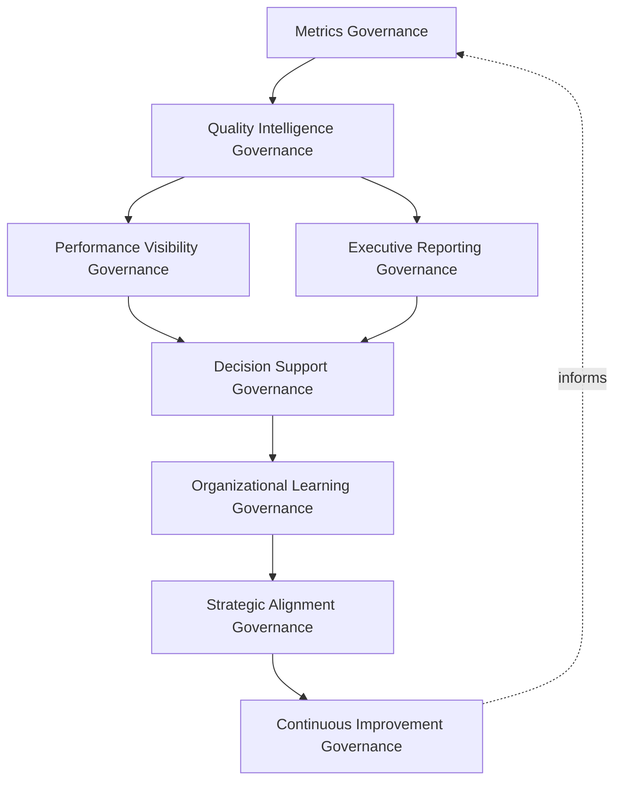
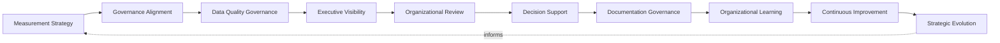
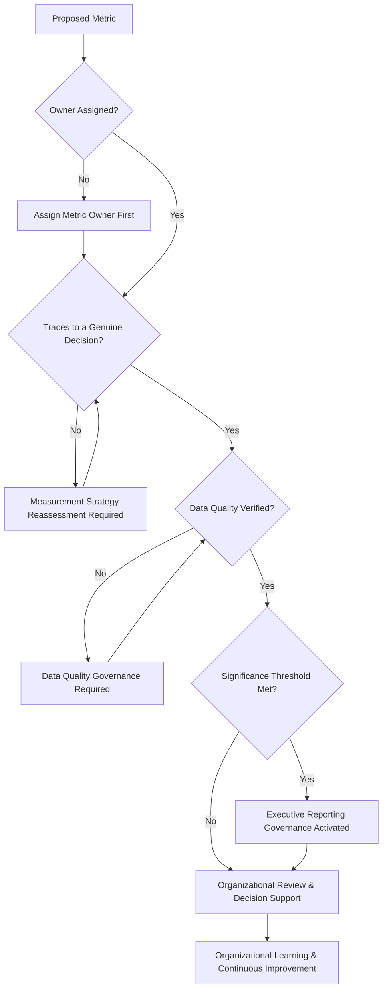
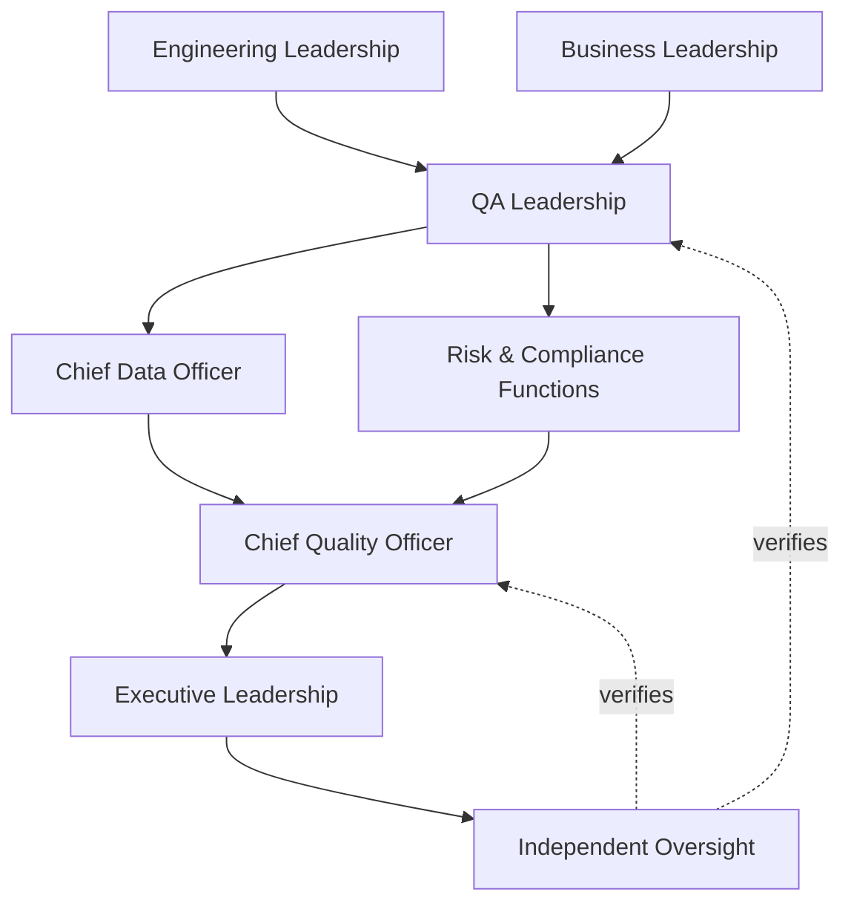
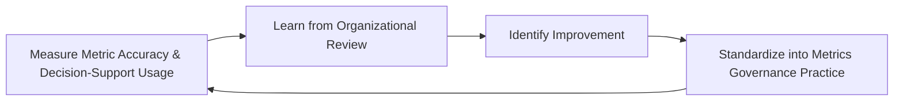
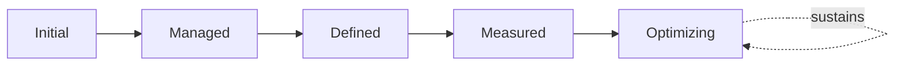

# Enterprise Quality Metrics Governance Framework

## 1. Document Purpose

This document defines the official Enterprise Quality Metrics Governance Framework for **StackLeo Tech Store** — the CQO/CDO-owned executive charter under which quality measurement, quality intelligence, executive reporting, and continuous quality visibility are governed as a deliberate, accountable discipline. It establishes governance for quality metrics, quality intelligence, executive reporting, organizational accountability, continuous quality visibility, and long-term quality performance maturity across the StackLeo platform, consistent with ISTQB Advanced Level practice, IEEE 29119, ISO 9001, COBIT governance principles, and TOGAF enterprise architecture thinking.

`quality-metrics.md` remains the operational governance framework for quality measurement practice in this folder — the document that elaborates in full operational depth StackLeo's measurement philosophy, quality intelligence lifecycle, and metric domains. This document sits above it as the highest-level executive mandate, consistent with the executive-charter relationship `testing-governance.md` holds over `testing-strategy.md` and `test-automation-governance.md` holds over `test-automation-strategy.md`: it does not restate metric definitions or reporting detail, it establishes the philosophy, organizational ownership, and executive expectations that give quality measurement its authority and coherence at the level of the Board and executive leadership.

- **Purpose of Quality Metrics Governance** — to ensure quality measurement at StackLeo genuinely informs decisions, rather than accumulating as disconnected data whose relevance and accountability are never actually established.
- **Relationship with Testing Strategy** — `testing-strategy.md` and `testing-governance.md` produce the execution and defect evidence this framework governs the measurement of; this framework ensures that evidence is converted into genuinely decision-relevant intelligence, not merely recorded.
- **Relationship with Quality Assurance** — this framework is the measurement-specific governance layer supporting `quality-assurance-framework.md` and `qa-governance.md`; it ensures the organization's broader quality culture is grounded in genuine evidence, not impression alone.
- **Relationship with Test Governance** — `test-governance-framework.md` governs test-related policy consistency; this framework ensures the metrics used to evaluate that policy's effectiveness are themselves governed for accuracy, consistency, and genuine business relevance.
- **Relationship with Executive Decision-Making** — this framework exists to give executive leadership an honest, evidence-based view of quality health sufficient to make informed investment, prioritization, and risk-acceptance decisions, never a curated or selectively favorable one.
- **Relationship with Enterprise Performance** — quality metrics are one genuine input to how StackLeo understands its own overall performance, connected to `01_Business/business-model.md` and coordinated with `09_Operations/operations-governance-strategy.md`.
- **Relationship with Continuous Improvement** — this framework treats quality intelligence as the evidentiary foundation every continuous improvement discipline in this repository — `operational-excellence-framework.md`, `problem-management-governance.md`, `test-governance-framework.md` — ultimately depends on to know whether improvement is genuinely occurring.

This document is implementation-independent and vendor-neutral. It defines quality metrics governance philosophy, model, domains, and lifecycle conceptually — not specific BI platforms, analytics tools, dashboard software, monitoring platforms, cloud providers, consulting firms, commercial products, KPI thresholds, metric calculations, reporting schedules, dashboard implementations, infrastructure configurations, implementation roadmaps, or code.

## 2. Quality Metrics Philosophy

Quality metrics governance at StackLeo rests on eight principles. Each exists to produce a specific business outcome — measurement is governed deliberately because the wrong metric, or the right metric ungoverned, misleads decisions rather than informing them.

### 2.1 Measure What Matters

Governance directs measurement toward what genuinely informs a decision, not toward everything that happens to be measurable.

- **Business Value** — ensures measurement effort produces genuine decision value rather than accumulating as unused data.

### 2.2 Governance Before Measurement

The accountability structure — who defines a metric, who owns its accuracy, who acts on it — is established before measurement activity begins.

- **Business Value** — ensures a metric exists because a genuine, governed decision called for it, not because it was convenient to collect.

### 2.3 Business Value Over Metric Volume

A small number of genuinely decision-relevant metrics is preferred over a large number of metrics that collectively obscure rather than clarify.

- **Business Value** — protects leadership attention from being diluted across metrics that do not genuinely inform action.

### 2.4 Accountability

Every metric traces to a specific, named, responsible owner accountable for its accuracy and continued relevance.

- **Business Value** — ensures no metric is left to silently drift out of accuracy or relevance without someone genuinely responsible.

### 2.5 Transparency

Metric definitions, data sources, and reporting are documented and visible to those who genuinely need them.

- **Business Value** — allows reported quality health to be scrutinized and defended, not merely trusted on faith.

### 2.6 Evidence-Based Decisions

Quality-related decisions are grounded in genuine, governed measurement, not solely in subjective impression.

- **Business Value** — reduces the risk of decisions being driven by whoever argues most persuasively rather than by genuine evidence.

### 2.7 Business Alignment

Metrics governance decisions are made in service of genuine business priority, focusing measurement where it matters most to the business.

- **Business Value** — ensures limited measurement investment is directed toward what genuinely matters most to the business and its customers.

### 2.8 Continuous Improvement

Quality metrics governance practice matures over time, informed by real reporting outcomes and the organization's growth in scale and complexity.

- **Business Value** — keeps metrics governance aligned with StackLeo's growth in scale, market reach, and operational complexity.

## 3. Enterprise Quality Metrics Governance Model

Quality metrics governance operates across eight conceptual layers, each holding accountability for a distinct dimension of how StackLeo governs quality measurement. Every layer here is elaborated in full operational depth in `quality-metrics.md`.

### 3.1 Metrics Governance

- **Purpose** — own the overall coherence of how the organization decides what is measured and why.
- **Governance Scope** — oversight of Metric Definition (`quality-metrics.md`, Section 3.1) across every domain in Section 4.
- **Business Value** — ensures every metric traces to a deliberate, defensible reason for its existence.
- **Executive Expectations** — leadership trusts every reported metric genuinely earns its place.

### 3.2 Quality Intelligence Governance

- **Purpose** — own the coherence of how raw measurement is converted into genuinely decision-relevant intelligence.
- **Governance Scope** — oversight of Trend Analysis (`quality-metrics.md`, Section 3.4), ensuring intelligence reflects genuine pattern, not noise.
- **Business Value** — ensures the organization understands quality trends, not merely isolated data points.
- **Executive Expectations** — leadership trusts quality intelligence genuinely distinguishes signal from noise.

### 3.3 Executive Reporting Governance

- **Purpose** — own the coherence of how quality intelligence is presented to executive leadership and the Board.
- **Governance Scope** — oversight of Executive Reporting (`quality-metrics.md`, Section 3.5).
- **Business Value** — ensures leadership receives an honest, evidence-based view, never a selectively favorable one.
- **Executive Expectations** — leadership trusts reporting reflects genuine quality health, including unfavorable findings.

### 3.4 Performance Visibility Governance

- **Purpose** — own the coherence of how quality performance is made continuously visible across the organization, not only at reporting intervals.
- **Governance Scope** — oversight of Continuous Visibility (`quality-metrics.md`, Section 2.4) across every domain in Section 4.
- **Business Value** — ensures quality issues are visible while they can still be addressed proactively.
- **Executive Expectations** — leadership trusts visibility is sustained continuously, not manufactured only before a scheduled review.

### 3.5 Decision Support Governance

- **Purpose** — own the coherence of how quality intelligence genuinely informs operational and strategic decisions.
- **Governance Scope** — oversight of Operational Decision Support (`quality-metrics.md`, Section 3.6).
- **Business Value** — ensures measurement investment translates into genuinely better decisions, not just better-looking reports.
- **Executive Expectations** — leadership expects metrics to be connected to real decisions, not produced and left unused.

### 3.6 Organizational Learning Governance

- **Purpose** — own the coherence of how the organization converts measurement outcomes into durable, shared organizational learning.
- **Governance Scope** — oversight of Quality Improvement Planning (`quality-metrics.md`, Section 3.7).
- **Business Value** — ensures a significant measurement finding strengthens the organization's broader quality capability.
- **Executive Expectations** — leadership expects every significant finding to produce a documented, attributable lesson.

### 3.7 Strategic Alignment Governance

- **Purpose** — own the coherence of how quality metrics remain connected to genuine business strategy over time.
- **Governance Scope** — oversight of Strategic Evolution (Section 5.10), coordinated with `01_Business/business-model.md`.
- **Business Value** — prevents quality metrics from becoming a technical exercise disconnected from what the business is actually trying to achieve.
- **Executive Expectations** — leadership expects measured priorities to remain genuinely aligned with evolving business strategy.

### 3.8 Continuous Improvement Governance

- **Purpose** — govern the mechanism by which every other layer in this model matures over time.
- **Governance Scope** — consolidates findings from governance review, audits, and organizational learning across every domain in Section 4.
- **Business Value** — prevents metrics governance itself from becoming the next thing that quietly stagnates as the organization scales.
- **Executive Expectations** — leadership expects metrics governance maturity to be assessed periodically, not assumed static once established.

### Enterprise Quality Metrics Governance Matrix

| Layer | Purpose | Business Value | Executive Expectations |
|---|---|---|---|
| Metrics Governance | Own coherence of deciding what is measured and why | Ensures every metric traces to a deliberate, defensible reason | Trusts every reported metric genuinely earns its place |
| Quality Intelligence Governance | Own coherence of converting measurement into intelligence | Ensures understanding of genuine trends, not isolated data | Trusts intelligence genuinely distinguishes signal from noise |
| Executive Reporting Governance | Own coherence of presenting intelligence to leadership | Ensures an honest, evidence-based view for leadership | Trusts reporting reflects genuine health, including bad news |
| Performance Visibility Governance | Own coherence of continuous, sustained quality visibility | Ensures issues are visible while still addressable proactively | Trusts visibility is sustained, not manufactured for reviews |
| Decision Support Governance | Own coherence of intelligence genuinely informing decisions | Ensures investment translates into genuinely better decisions | Expects metrics connected to real decisions, not left unused |
| Organizational Learning Governance | Own coherence of converting outcomes into shared learning | Strengthens the organization's broader quality capability | Expects every significant finding to produce a documented lesson |
| Strategic Alignment Governance | Own coherence of connecting metrics to business strategy | Prevents metrics from becoming disconnected from business intent | Expects measured priorities to remain aligned with strategy |
| Continuous Improvement Governance | Govern maturation of every other layer | Prevents metrics governance itself from stagnating | Expects maturity to be assessed periodically |

*Diagram 1: Enterprise Quality Metrics Governance Framework — metrics governance feeds quality intelligence governance, branching into visibility and executive reporting governance, converging on decision support, resolving into organizational learning and strategic alignment that feeds continuous improvement back into the model.*

## 4. Enterprise Quality Metrics Domains

Quality metrics governance is exercised across ten conceptual domains, each requiring a distinct governance emphasis. Every domain here is elaborated in full operational depth in `quality-metrics.md`.

### 4.1 Product Quality Metrics

- **Purpose** — govern measurement of the platform's functional and non-functional correctness.
- **Governance Considerations** — governed under Metrics Governance (Section 3.1), coordinated with `quality-strategy.md`.
- **Business Importance** — protects the fundamental correctness and reliability customers directly depend on.
- **Executive Expectations** — leadership expects product quality metrics to be reported with the same rigor regardless of favorability.

### 4.2 Engineering Quality Metrics

- **Purpose** — govern measurement of the health and discipline of engineering practice itself.
- **Governance Considerations** — governed under Quality Intelligence Governance (Section 3.2), treated as a mirror for improvement, not individual judgment.
- **Business Importance** — protects the technical foundation every other quality domain ultimately depends on.
- **Executive Expectations** — leadership expects engineering metrics to inform genuine improvement, never individual performance judgment.

### 4.3 Testing Effectiveness Metrics

- **Purpose** — govern measurement of how effectively testing practice discovers genuine defects before customers do.
- **Governance Considerations** — governed under Metrics Governance (Section 3.1), coordinated with `testing-governance.md`.
- **Business Importance** — protects confidence that testing investment is genuinely producing verification value.
- **Executive Expectations** — leadership expects testing effectiveness to be measured honestly, not only reported as coverage volume.

### 4.4 Release Quality Metrics

- **Purpose** — govern measurement of the health and outcomes of the platform's release practice.
- **Governance Considerations** — governed under Decision Support Governance (Section 3.5), coordinated with `release-quality-gates.md`.
- **Business Importance** — protects confidence that release decisions are grounded in genuine, trend-aware evidence.
- **Executive Expectations** — leadership expects release metrics to directly inform the release decision, not merely describe it afterward.

### 4.5 Customer Experience Metrics

- **Purpose** — govern measurement of the genuine customer experience of platform quality.
- **Governance Considerations** — governed under Performance Visibility Governance (Section 3.4), grounded in genuine customer feedback.
- **Business Importance** — protects the trust relationship every customer interaction depends on.
- **Executive Expectations** — leadership expects customer experience metrics to be weighted alongside internal technical metrics, not subordinated to them.

### 4.6 Security Quality Metrics

- **Purpose** — govern measurement of the platform's protection of customer and business data.
- **Governance Considerations** — governed jointly with, and never superseding, `06_Security/security-governance.md`, which remains authoritative for security-specific obligations.
- **Business Importance** — protects StackLeo's core trust differentiator through genuine, ongoing measurement.
- **Executive Expectations** — leadership expects security quality metrics to be reported with mandatory, non-negotiable rigor.

### 4.7 Operational Quality Metrics

- **Purpose** — govern measurement of platform quality once live and operating.
- **Governance Considerations** — governed under Performance Visibility Governance (Section 3.4), coordinated with `09_Operations/operational-excellence-framework.md`.
- **Business Importance** — protects the operational reliability customers directly experience day to day.
- **Executive Expectations** — leadership expects operational quality metrics to be sustained continuously, not only reviewed post-incident.

### 4.8 Compliance Quality Metrics

- **Purpose** — govern measurement of the platform's sustained adherence to regulatory and contractual obligations.
- **Governance Considerations** — governed under Executive Reporting Governance (Section 3.3), coordinated with `06_Security/compliance-governance.md`.
- **Business Importance** — protects the business's standing with regulators and its contractual counterparties.
- **Executive Expectations** — leadership expects compliance quality metrics to demonstrate continuous adherence, not only point-in-time audit readiness.

### 4.9 Business Performance Quality Metrics

- **Purpose** — govern measurement of quality's genuine effect on business outcomes.
- **Governance Considerations** — governed under Strategic Alignment Governance (Section 3.7), coordinated with `01_Business/business-model.md`.
- **Business Importance** — connects quality investment directly to genuine business consequence, not treated as a purely technical concern.
- **Executive Expectations** — leadership expects a clear, traceable connection between quality metrics and business performance.

### 4.10 Enterprise Quality Intelligence

- **Purpose** — govern the platform-wide synthesis of quality metrics into a single, coherent picture of overall quality health.
- **Governance Considerations** — governed exclusively under Executive Reporting Governance (Section 3.3) and Strategic Alignment Governance (Section 3.7).
- **Business Importance** — protects leadership's ability to understand overall quality health as a whole, not only domain by domain.
- **Executive Expectations** — leadership expects one coherent enterprise quality picture, not ten disconnected domain reports.

### Enterprise Quality Metrics Domain Matrix

| Domain | Purpose | Business Importance | Executive Expectations |
|---|---|---|---|
| Product Quality Metrics | Govern measurement of functional and non-functional correctness | Protects the fundamental correctness customers depend on | Reported with the same rigor regardless of favorability |
| Engineering Quality Metrics | Govern measurement of engineering practice health | Protects the technical foundation every domain depends on | Informs improvement, never individual performance judgment |
| Testing Effectiveness Metrics | Govern measurement of testing's genuine defect-finding power | Protects confidence testing investment produces verification value | Measured honestly, not only as coverage volume |
| Release Quality Metrics | Govern measurement of release practice health and outcomes | Protects confidence release decisions rest on genuine evidence | Directly informs the release decision, not just describes it |
| Customer Experience Metrics | Govern measurement of genuine customer experience of quality | Protects the trust relationship every interaction depends on | Weighted alongside internal metrics, not subordinated |
| Security Quality Metrics | Govern measurement of data protection | Protects StackLeo's core trust differentiator | Reported with mandatory, non-negotiable rigor |
| Operational Quality Metrics | Govern measurement of quality once live | Protects operational reliability customers experience daily | Sustained continuously, not only reviewed post-incident |
| Compliance Quality Metrics | Govern measurement of sustained obligation adherence | Protects standing with regulators and counterparties | Demonstrates continuous adherence, not only audit readiness |
| Business Performance Quality Metrics | Govern measurement of quality's effect on business outcomes | Connects quality investment to genuine business consequence | Expects a clear, traceable connection to business performance |
| Enterprise Quality Intelligence | Govern platform-wide synthesis into one coherent picture | Protects leadership's ability to understand overall quality health | Expects one coherent picture, not ten disconnected reports |

## 5. Enterprise Quality Metrics Lifecycle

Quality metrics governance operates across ten conceptual lifecycle stages, applicable across every domain in Section 4.

### 5.1 Measurement Strategy

- **Purpose** — govern how the organization decides what genuinely warrants measurement.
- **Governance Objectives** — apply Measure What Matters (Section 2.1) before any metric is formally adopted.
- **Business Value** — ensures measurement effort is deliberately directed, not assembled reactively.

### 5.2 Governance Alignment

- **Purpose** — govern how a proposed metric is assigned to the appropriate governance layer in Section 3.
- **Governance Objectives** — apply Governance Before Measurement (Section 2.2) consistently across every proposed metric.
- **Business Value** — ensures every metric is reviewed by the function genuinely accountable for its domain.

### 5.3 Data Quality Governance

- **Purpose** — govern how the accuracy and integrity of the data underlying a metric is confirmed.
- **Governance Objectives** — apply Accountability (Section 2.4) to ensure data quality is someone's genuine responsibility.
- **Business Value** — ensures decisions are never made on data whose accuracy was never actually verified.

### 5.4 Executive Visibility

- **Purpose** — govern how validated metrics are made visible to executive leadership.
- **Governance Objectives** — apply Executive Reporting Governance (Section 3.3), ensuring reporting is honest and complete.
- **Business Value** — ensures leadership genuinely sees quality health, not a curated subset of it.

### 5.5 Organizational Review

- **Purpose** — govern the formal, periodic review of quality intelligence across the organization.
- **Governance Objectives** — apply Performance Visibility Governance (Section 3.4) on a predictable, recurring basis.
- **Business Value** — ensures quality intelligence is genuinely discussed, not merely produced and archived.

### 5.6 Decision Support

- **Purpose** — govern how quality intelligence is connected to specific operational and strategic decisions.
- **Governance Objectives** — apply Decision Support Governance (Section 3.5), ensuring metrics genuinely inform action.
- **Business Value** — ensures measurement investment translates into genuinely better decisions.

### 5.7 Documentation Governance

- **Purpose** — govern the completeness and integrity of the quality metrics record itself.
- **Governance Objectives** — require documentation to remain consistent with `quality-metrics.md` as it evolves.
- **Business Value** — ensures the organization retains a genuine, trustworthy record of what was measured and why.

### 5.8 Organizational Learning

- **Purpose** — formally capture what measurement outcomes reveal about quality metrics governance itself.
- **Governance Objectives** — apply Organizational Learning Governance (Section 3.6), requiring lessons to be documented and attributed.
- **Business Value** — ensures the organization genuinely learns from experience rather than repeating the same measurement gaps.

### 5.9 Continuous Improvement

- **Purpose** — apply accumulated lessons to strengthen future quality metrics governance.
- **Governance Objectives** — require findings to be genuinely analyzed for recurring patterns, consistent with Section 3.8.
- **Business Value** — turns each measurement cycle into an input that makes future metrics governance genuinely stronger.

### 5.10 Strategic Evolution

- **Purpose** — periodically reassess whether measured priorities remain aligned with evolving business strategy.
- **Governance Objectives** — apply Strategic Alignment Governance (Section 3.7) on a periodic, predictable basis.
- **Business Value** — keeps quality metrics genuinely connected to what the business is trying to achieve, not fixed to past assumptions.

### Enterprise Quality Metrics Lifecycle Matrix

| Stage | Purpose | Governance Objective | Business Value |
|---|---|---|---|
| Measurement Strategy | Decide what genuinely warrants measurement | Applied before any metric is formally adopted | Ensures measurement effort is deliberately directed |
| Governance Alignment | Assign a proposed metric to the appropriate layer | Applied consistently across every proposed metric | Ensures review by the genuinely accountable function |
| Data Quality Governance | Confirm accuracy and integrity of underlying data | Applied to ensure data quality is someone's genuine responsibility | Ensures decisions never rest on unverified data |
| Executive Visibility | Make validated metrics visible to leadership | Applies honest, complete executive reporting governance | Ensures leadership genuinely sees quality health |
| Organizational Review | Formally and periodically review quality intelligence | Applied on a predictable, recurring basis | Ensures intelligence is genuinely discussed, not archived |
| Decision Support | Connect intelligence to specific decisions | Applies decision support governance | Ensures investment translates into genuinely better decisions |
| Documentation Governance | Maintain completeness and integrity of the record | Kept consistent with subordinate documentation | Retains a genuine, trustworthy record |
| Organizational Learning | Capture governance implications from outcomes | Documented and attributed to specific implications | Ensures genuine learning rather than repeated gaps |
| Continuous Improvement | Apply lessons to strengthen future governance | Findings genuinely analyzed for recurring patterns | Makes future metrics governance genuinely stronger |
| Strategic Evolution | Reassess alignment with evolving business strategy | Applied on a periodic, predictable basis | Keeps metrics genuinely connected to business intent |

*Diagram 2: Enterprise Quality Metrics Lifecycle — measurement strategy and governance alignment inform data quality governance and executive visibility, feeding organizational review and decision support, with documentation, organizational learning, and continuous improvement feeding strategic evolution back into the cycle.*

## 6. Quality Metrics Principles

- **Accuracy** — every metric genuinely reflects what it claims to measure.
- **Consistency** — a metric is defined and measured the same way across every report that references it.
- **Transparency** — metric definitions, data sources, and reporting are documented and visible, consistent with Section 2.5.
- **Traceability** — every metric traces to the specific decision or business question it exists to inform.
- **Business Relevance** — every metric connects to genuine business priority, consistent with Section 2.7.
- **Accountability** — every metric has a specific, named, responsible owner, consistent with Section 2.4.
- **Evidence-Based Decision Making** — quality-related decisions are grounded in genuine measurement, consistent with Section 2.6.
- **Continuous Improvement** — governance practice matures over time, informed by real reporting outcomes.

### Quality Metrics Principles Matrix

| Principle | Description | Business Value |
|---|---|---|
| Accuracy | Every metric genuinely reflects what it claims to measure | Protects the credibility of every decision the metric informs |
| Consistency | A metric is defined and measured the same way everywhere | Prevents contradictory readings of the same underlying reality |
| Transparency | Definitions, sources, and reporting documented and visible | Allows reported quality health to be scrutinized and defended |
| Traceability | Every metric traces to the decision it exists to inform | Prevents accumulation of metrics without genuine purpose |
| Business Relevance | Every metric connects to genuine business priority | Directs limited measurement investment where it matters most |
| Accountability | Every metric has a specific, named, responsible owner | Ensures no metric drifts out of accuracy without genuine ownership |
| Evidence-Based Decision Making | Decisions grounded in genuine measurement | Reduces risk of decisions driven by persuasion over evidence |
| Continuous Improvement | Practice matures from real reporting outcomes | Keeps governance aligned with organizational growth |

*Diagram 4: Enterprise Quality Metrics Governance Decision Flow — a proposed metric is checked for assigned ownership, genuine decision relevance, and verified data quality, with executive reporting governance activated upon meeting significance thresholds, resolving into organizational review, decision support, and continuous improvement.*

## 7. Ownership & Accountability

Governance authority for quality metrics is distributed deliberately across eight accountable functions, defined here at the governance-objective level, without prescribing specific operational reporting responsibilities.

### 7.1 Executive Leadership

- **Governance Objective** — the Board and executive leadership hold ultimate accountability for whether quality intelligence genuinely informs organizational decisions.
- **Business Value** — provides a single point of ultimate accountability for whether this framework is genuinely functioning as intended.

### 7.2 Chief Quality Officer

- **Governance Objective** — the Chief Quality Officer owns the coherence and enforcement of this framework across every domain, layer, and stage it defines.
- **Business Value** — provides a single point of specialist accountability for whether quality metrics governance is genuinely functioning as intended.

### 7.3 Chief Data Officer

- **Governance Objective** — the Chief Data Officer owns Data Quality Governance (Section 5.3), ensuring the data underlying quality metrics is accurate and trustworthy.
- **Business Value** — ensures quality intelligence rests on a genuinely reliable data foundation.

### 7.4 Engineering Leadership

- **Governance Objective** — engineering leadership owns Engineering Quality Metrics (Section 4.2) as a mirror for improvement within their own practice.
- **Business Value** — ensures engineering metrics genuinely support improvement, not merely judgment.

### 7.5 QA Leadership

- **Governance Objective** — QA leadership owns Testing Effectiveness and Release Quality Metrics (Sections 4.3–4.4) in coordination with `testing-governance.md`.
- **Business Value** — provides a single point of specialist accountability for testing-related measurement.

### 7.6 Business Leadership

- **Governance Objective** — business leadership owns Business Performance Quality Metrics (Section 4.9), ensuring quality measurement connects to genuine business outcomes.
- **Business Value** — keeps quality metrics connected to genuine business priority, not only technical convenience.

### 7.7 Risk & Compliance Functions

- **Governance Objective** — risk and compliance functions own Compliance Quality Metrics (Section 4.8) in coordination with `06_Security/compliance-governance.md`.
- **Business Value** — ensures compliance measurement remains a genuine response to assessed obligation, not a disconnected exercise.

### 7.8 Independent Oversight

- **Governance Objective** — an independent function, separate from those who design and operate this framework, periodically verifies its overall effectiveness.
- **Business Value** — prevents governance from being assumed effective on the word of the same function responsible for running it.

### Ownership & Accountability Matrix

| Role | Governance Objective | Business Value |
|---|---|---|
| Executive Leadership | Hold ultimate accountability for whether intelligence informs decisions | Provides a single point of ultimate accountability |
| Chief Quality Officer | Own coherence and enforcement of this framework | Provides a single point of specialist accountability |
| Chief Data Officer | Own data quality governance for the metrics underlying data | Ensures intelligence rests on a genuinely reliable data foundation |
| Engineering Leadership | Own engineering quality metrics as a mirror for improvement | Ensures engineering metrics genuinely support improvement |
| QA Leadership | Own testing effectiveness and release quality metrics | Provides specialist accountability for testing-related measurement |
| Business Leadership | Own business performance quality metrics | Keeps metrics connected to genuine business priority |
| Risk & Compliance Functions | Own compliance quality metrics | Ensures compliance measurement is a genuine response to obligation |
| Independent Oversight | Independently verify overall governance effectiveness | Prevents self-assessed assumption of effectiveness |

*Diagram 3: Quality Metrics Ownership & Accountability Model — accountability flows from engineering and business leadership through QA leadership, the Chief Data Officer, and risk and compliance functions into the Chief Quality Officer, converging on executive leadership verified by independent oversight.*

## 8. Executive Oversight

- **Executive Quality Reporting** — leadership receives a formally governed, honest report of quality health on a regular cadence, consistent with `qa-governance.md` (Section 8).
- **Enterprise Performance Reviews** — quality metrics are reviewed jointly with broader enterprise performance, coordinated with `01_Business/business-model.md`.
- **Governance Reviews** — the governance model, domains, and lifecycle defined in this framework (Sections 3–7) are periodically reassessed for continued fitness.
- **Strategic Decision Support** — the organization's use of quality intelligence in genuine strategic decisions is reviewed directly with executive leadership.
- **Documentation Governance** — this framework's relationship to `quality-metrics.md`, `testing-governance.md`, and `test-governance-framework.md` is kept current as those documents evolve.
- **Organizational Readiness** — metrics decisions, evidence, and outcomes are maintained in a state ready for internal or external audit at any time, coordinated with `06_Security/audit-governance.md`.

### Executive Oversight Matrix

| Oversight Mechanism | Purpose | Governance Role |
|---|---|---|
| Executive Quality Reporting | Provide leadership a formally governed, honest quality report | Regular, predictable cadence for the framework as a whole |
| Enterprise Performance Reviews | Review quality metrics jointly with broader performance | Coordinated with enterprise business performance review |
| Governance Reviews | Reassess the governance model itself for continued fitness | Applies to Sections 3–7 of this framework |
| Strategic Decision Support | Review the organization's use of intelligence in decisions | Direct executive-level review of decision support effectiveness |
| Documentation Governance | Keep this framework's subordinate relationships current | Updated as related documents evolve |
| Organizational Readiness | Maintain decisions and evidence ready for independent review | Continuous state, coordinated with audit governance |

### Governance Responsibility Matrix

| Role | Responsibility |
|---|---|
| Executive Leadership | Owns ultimate accountability for whether intelligence genuinely informs decisions. |
| Chief Quality Officer | Owns coherence and enforcement of this framework, in partnership with executive leadership. |
| Chief Data Officer | Owns data quality governance underlying every quality metric. |
| Quality Metrics Governance Lead | Owns the operational measurement model within `quality-metrics.md`. |
| QA Leadership | Owns testing effectiveness and release quality metrics. |
| Business Leadership | Owns business performance quality metrics. |
| Risk & Compliance Functions | Own compliance quality metrics. |
| Independent Oversight | Independently verifies the overall effectiveness of this framework. |

## 9. Future Readiness

This framework is designed to remain valid as StackLeo evolves in scale, geography, and organizational complexity, without requiring redefinition of its underlying philosophy.

- **AI-Assisted Quality Intelligence** — as trend analysis and reporting increasingly incorporate AI-assisted methods, they remain governed under Quality Intelligence Governance (Section 3.2) at the same rigor as any other method.
- **Predictive Quality Analytics** — where the organization develops the capability to anticipate a quality issue before it fully materializes, that capability is governed as an extension of Decision Support Governance (Section 3.5), not a separate discipline.
- **Enterprise Scale** — the governance model, domains, and lifecycle defined throughout this framework are defined independently of organizational size, so they remain coherent as StackLeo's operational complexity grows substantially.
- **Global Expansion** — Measurement Strategy and Governance Alignment (Sections 5.1–5.2) are structured to be re-applied as StackLeo expands from Bangladesh into South Asia and global markets, each with genuinely distinct measurement considerations.
- **Intelligent Decision Support** — where decision support increasingly draws on intelligent pattern analysis across domains, that analysis remains subject to the same Decision Support Governance (Section 3.5) as any other evaluation method.
- **Autonomous Quality Insights (conceptual only)** — where automation increasingly performs steps within trend analysis or reporting, that automation remains subject to the same ownership and executive oversight as any human-performed activity.
- **Digital Governance Platforms** — this framework's governance discipline is treated as a direct contributor to the digital trust customers, partners, and regulators extend to StackLeo, not merely an internal reporting exercise.
- **Future Data-Driven Organizations** — Continuous Improvement Governance (Section 3.8) is structured to absorb genuinely new measurement models — additional sales channels, multi-vendor operations, distributed teams — without requiring this framework to be rewritten.

## 10. Quality Metrics Maturity Model

Quality metrics governance maturity is described across five conceptual levels, consistent with ISO 9001 and established process maturity thinking.

- **Initial** — measurement, where it exists, is informal and inconsistent; metrics are collected ad hoc, and ownership is unclear.
- **Managed** — basic metrics governance exists for individual domains, but consistency across the ten domains in Section 4 varies significantly.
- **Defined** — the governance model, domains, and lifecycle are standardized, documented, and consistently applied across the organization, consistent with the model defined throughout this framework.
- **Measured** — metric accuracy, decision-support usage, and reporting outcomes are measured systematically, and decisions about the metrics program itself are grounded in genuine evidence.
- **Optimizing** — quality metrics governance is continuously and deliberately improved based on quantitative evidence and organizational learning; improvement itself is a managed, ongoing discipline rather than an occasional initiative.

### Quality Metrics Maturity Model Matrix

| Level | Characteristics | Primary Focus |
|---|---|---|
| Initial | Informal, inconsistent measurement; metrics collected ad hoc | Ad hoc, individually-dependent measurement practice |
| Managed | Basic governance exists per domain; consistency varies | Domain-level consistency |
| Defined | Standardized governance model, domains, and lifecycle | Organization-wide consistency and clear ownership |
| Measured | Accuracy, usage, and reporting outcomes measured systematically | Evidence-based metrics governance decisions |
| Optimizing | Practice continuously and deliberately improved from evidence | Sustained, deliberate improvement as a discipline |

*Diagram 5: Continuous Quality Intelligence Improvement Cycle — measurement accuracy and decision-support usage are measured, learned from, improved upon, and standardized back into governed practice, on a continuing basis.*

*Diagram 6: Quality Metrics Maturity Progression Model — maturity advances from informal, ad hoc measurement practice toward standardized, measured, and continuously optimized quality metrics governance.*

## 11. Anti-Patterns

The following recurring failure patterns are explicitly recognized and avoided, as each one structurally undermines this framework.

### Anti-Pattern Summary

| Anti-Pattern | Why It's Avoided |
|---|---|
| Measuring Everything | Contradicts Measure What Matters (Section 2.1); measuring everything measurable dilutes attention and obscures the metrics that genuinely matter. |
| Metrics Without Governance | Contradicts Governance Before Measurement (Section 2.2); metrics adopted without governance accumulate without accountable ownership or defined purpose. |
| Vanity Metrics | Contradicts Business Value Over Metric Volume (Section 2.3); metrics that look impressive but do not inform genuine decisions waste attention and mislead confidence. |
| Weak Executive Visibility | Contradicts Executive Quality Reporting (Section 8); leadership cannot govern quality it is never honestly shown. |
| Poor Documentation | Undermines Documentation Governance (Sections 5.7, 8) and Transparency (Section 2.5), leaving metric definitions and reasoning unclear or unverifiable. |
| Data Without Decisions | Contradicts Decision Support Governance (Section 3.5); metrics produced but never connected to a genuine decision waste the investment made to collect them. |
| Siloed Reporting | Contradicts Enterprise Quality Intelligence (Section 4.10); ten disconnected domain reports leave no coherent, organization-wide picture of quality health. |
| Missing Continuous Improvement | Contradicts Continuous Improvement (Sections 2.8, 3.8); without deliberate improvement, metrics governance stagnates as the organization and its measurement needs grow. |

## 12. Document Information

| Property | Value |
|----------|-------|
| Document | quality-metrics-governance.md |
| Version | 1.0.0 |
| Status | Active |
| Maintained By | StackLeo |
| Last Updated | 2026-07-24 |

---

© StackLeo. All Rights Reserved.
