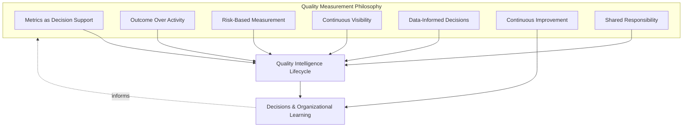
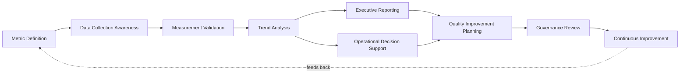
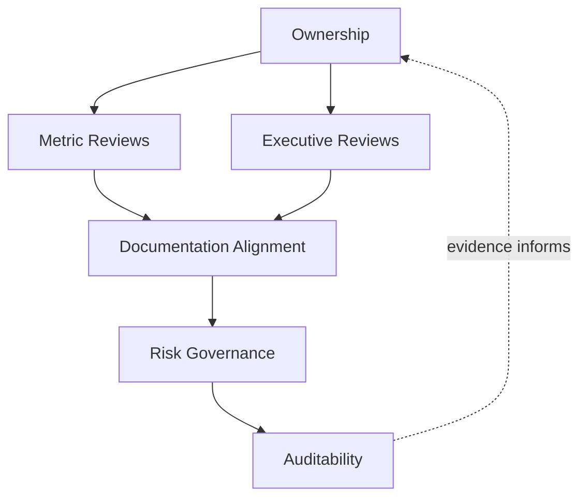
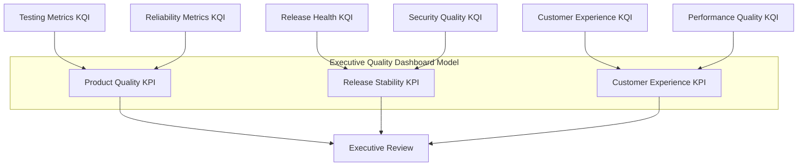
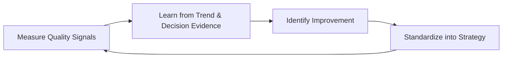
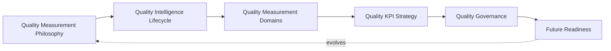

# Enterprise Quality Metrics, KPIs & Continuous Quality Intelligence Strategy

## 1. Document Purpose

This document defines the official Enterprise Quality Metrics, KPIs & Continuous Quality Intelligence Strategy for **StackLeo Tech Store**. It establishes how quality is measured, reported, and used to inform decisions across the platform — independent of any specific dashboard, analytics platform, or reporting tool.

- **Purpose of Quality Measurement** — measurement exists to replace subjective impression with objective evidence, converting the quality lifecycle stages defined in `quality-strategy.md` (Section 3) — especially Quality Assessment (Section 3.8) — into concrete, comparable, and actionable signals that inform real decisions.
- **Relationship with Quality Strategy** — this document is the measurement-specific elaboration of `quality-strategy.md`; where that document defines what quality means across ten domains, this document defines how progress against each domain is observed, quantified, and reported over time.
- **Relationship with Testing Strategy** — this document consumes evidence produced by `testing-strategy.md` (execution outcomes, defect data), `performance-testing.md`, `accessibility-testing.md`, and `compatibility-testing.md`, converting their raw verification evidence into trend-visible, decision-relevant metrics.
- **Relationship with Engineering Excellence** — quality metrics give engineering an honest mirror of its own practice, consistent with Engineering Excellence in `quality-strategy.md` (Section 2.6); measurement exists to support improvement, not to judge individuals.
- **Relationship with Release Management** — release health indicators (Section 4.9) are a direct input to the release decision governed by `07_DevOps/release-management.md`, ensuring that decision is grounded in current, trend-aware evidence rather than a single point-in-time impression.
- **Relationship with Executive Decision-Making** — executive reporting (Section 3.5) exists to give leadership an honest, evidence-based view of quality health sufficient to make informed investment, prioritization, and risk-acceptance decisions, consistent with the DORA-aware measurement discipline referenced in `07_DevOps/devops-overview.md`.

This document is implementation-independent and vendor-neutral. It defines measurement philosophy, lifecycle, domains, and governance — not specific BI tools, dashboard software, analytics platforms, monitoring vendors, reporting products, or metric thresholds.

## 2. Quality Measurement Philosophy

Quality measurement at StackLeo is governed by seven principles. Each exists to produce a specific business outcome — measurement is pursued because of the decisions it improves, not as an exercise in data collection for its own sake.

### 2.1 Metrics as Decision Support

Every metric collected exists to inform a specific decision — whether to release, where to invest engineering effort, or where quality risk is concentrating — rather than being collected because it is easy to capture.

- **Business Value** — ensures measurement effort produces genuine decision value, avoiding the cost of maintaining metrics nobody actually uses.

### 2.2 Outcome Over Activity

Measurement favors outcomes (defects escaping to production, customer-impacting incidents, genuine reliability) over activity counts (number of tests written, number of reviews performed) that do not, by themselves, indicate genuine quality.

- **Business Value** — protects against the illusion of progress created by high activity that does not translate into better customer or business outcomes.

### 2.3 Risk-Based Measurement

Measurement depth and attention are proportionate to business risk, consistent with `quality-strategy.md` (Section 5.2) — critical-path commerce capability warrants closer, more frequent measurement than low-risk, peripheral capability.

- **Business Value** — directs finite measurement and analysis effort toward what matters most to the business, rather than spreading attention evenly regardless of consequence.

### 2.4 Continuous Visibility

Quality signals are visible on an ongoing basis to those who need them, rather than surfaced only during periodic, scheduled reviews.

- **Business Value** — allows issues to be noticed and addressed while they are still small and inexpensive, rather than discovered only at the next scheduled checkpoint.

### 2.5 Data-Informed Decisions

Decisions about quality investment, release readiness, and risk acceptance are grounded in observed evidence, complementing — not replacing — informed engineering and business judgment.

- **Business Value** — reduces the influence of anecdote, recency bias, and individual assumption on decisions that materially affect customers and revenue.

### 2.6 Continuous Improvement

Measurement practice itself matures over time — which metrics are collected, how they are interpreted, and what decisions they inform evolve as the platform and business grow.

- **Business Value** — keeps quality intelligence relevant as StackLeo's business model and scale evolve, rather than measuring what once mattered but no longer does.

### 2.7 Shared Responsibility

Quality measurement is owned jointly by Engineering, QA, Product, and Leadership; no single function collects metrics on behalf of everyone else without their engagement in what those metrics mean.

- **Business Value** — prevents the anti-pattern in Section 9.5, where metrics exist but fail to genuinely inform the decisions of the people who most need them.

*Diagram 1: Quality Measurement Philosophy Overview — the seven principles shape the quality intelligence lifecycle, and the decisions and learning it produces feed back into the philosophy itself.*

## 3. Quality Intelligence Lifecycle

Quality measurement is governed across nine conceptual stages, spanning from initial metric definition through governance review and continuous improvement.

### 3.1 Metric Definition

- **Purpose** — determine what will be measured, why, and what decision it is intended to support.
- **Business Value** — ensures every metric has a clear purpose before collection effort begins, consistent with Metrics as Decision Support (Section 2.1).
- **Governance Objectives** — require every proposed metric to state the decision it informs before being approved for collection.

### 3.2 Data Collection Awareness

- **Purpose** — understand what data is genuinely available, how reliably it is captured, and what its limitations are.
- **Business Value** — prevents decisions from being built on data that appears authoritative but is actually incomplete or unreliable.
- **Governance Objectives** — ensure data sources and known limitations are documented alongside every metric they support.

### 3.3 Measurement Validation

- **Purpose** — confirm a defined metric genuinely measures what it claims to measure, and behaves sensibly across realistic scenarios.
- **Business Value** — protects against metrics that are technically collected but conceptually misleading.
- **Governance Objectives** — require validation before a new metric is promoted into regular reporting.

### 3.4 Trend Analysis

- **Purpose** — analyze how metrics change over time, rather than evaluating any single measurement in isolation.
- **Business Value** — surfaces gradual quality drift long before it would otherwise become an acute, customer-visible problem.
- **Governance Objectives** — ensure trend analysis, not point-in-time snapshots alone, informs Section 3.6 decision support.

### 3.5 Executive Reporting

- **Purpose** — synthesize quality metrics into a form leadership can use to understand platform quality health and make informed decisions.
- **Business Value** — gives executive stakeholders an honest, evidence-based view of quality without requiring them to interpret raw operational data themselves.
- **Governance Objectives** — ensure executive reporting is produced on a predictable, regular cadence and reflects genuine underlying evidence.

### 3.6 Operational Decision Support

- **Purpose** — make relevant quality metrics available to the engineering and operational decisions they are meant to inform, at the time those decisions are made.
- **Business Value** — connects measurement directly to action, rather than allowing metrics to exist as a separate, disconnected reporting exercise.
- **Governance Objectives** — ensure metrics feeding release readiness and prioritization decisions are current and traceable to their source evidence.

### 3.7 Quality Improvement Planning

- **Purpose** — use metric trends and findings to identify specific, prioritized quality improvement actions.
- **Business Value** — ensures measurement translates into deliberate action, not merely observation.
- **Governance Objectives** — require improvement actions arising from metrics to be documented and tracked to completion.

### 3.8 Governance Review

- **Purpose** — periodically evaluate whether the metrics collected remain relevant, well-defined, and genuinely used.
- **Business Value** — prevents the accumulation of stale, unused, or misleading metrics that dilute attention from what matters.
- **Governance Objectives** — ensure metric review is conducted on a regular, predictable cadence and reported to accountable ownership (Section 6.1).

### 3.9 Continuous Improvement

- **Purpose** — act on governance review findings to deliberately improve what is measured and how it is used.
- **Business Value** — ensures quality intelligence practice compounds in value over time rather than remaining fixed as the platform and business evolve.
- **Governance Objectives** — ensure improvement actions arising from measurement retrospectives are tracked to completion.

### Quality Intelligence Lifecycle Matrix

| Stage | Purpose | Business Value | Governance Objective |
|---|---|---|---|
| Metric Definition | Determine what is measured, why, and for what decision | Ensures every metric has clear purpose before collection | Metrics state the decision they inform before approval |
| Data Collection Awareness | Understand data availability, reliability, and limitations | Prevents decisions built on incomplete or unreliable data | Sources and limitations documented alongside each metric |
| Measurement Validation | Confirm a metric measures what it claims to | Protects against technically-collected, conceptually-misleading metrics | Validation required before promotion to regular reporting |
| Trend Analysis | Analyze change over time, not isolated snapshots | Surfaces gradual drift before it becomes acute | Trend analysis, not snapshots alone, informs decisions |
| Executive Reporting | Synthesize metrics for leadership decision-making | Gives leadership an honest, evidence-based quality view | Produced on a predictable, regular cadence |
| Operational Decision Support | Make metrics available at the point of decision | Connects measurement directly to action | Metrics feeding decisions are current and traceable |
| Quality Improvement Planning | Identify prioritized improvement actions from trends | Ensures measurement translates into deliberate action | Improvement actions documented and tracked to completion |
| Governance Review | Evaluate whether metrics remain relevant and used | Prevents accumulation of stale or misleading metrics | Regular cadence, reported to accountable ownership |
| Continuous Improvement | Act on governance review findings | Quality intelligence compounds in value over time | Improvement actions tracked to completion |

*Diagram 2: Enterprise Quality Intelligence Lifecycle — a continuous cycle in which governance review and improvement planning directly inform the next iteration of metric definition.*

## 4. Quality Measurement Domains

Quality measurement is organized across ten conceptual domains, each corresponding to a distinct area of platform and organizational health.

### 4.1 Product Quality Metrics

- **Purpose** — measure the functional correctness and fitness for purpose of delivered capability.
- **Scope** — defect rates, escaped defects, and customer-reported issues, traced to Functional Quality in `quality-strategy.md` (Section 4.1).
- **Governance Expectations** — reviewed alongside `testing-strategy.md` execution evidence, not derived from testing activity volume alone.
- **Business Importance** — the most direct indicator of whether the platform genuinely serves its customers.

### 4.2 Process Quality Metrics

- **Purpose** — measure the health and discipline of the engineering and quality processes producing the platform.
- **Scope** — adherence to defined lifecycle stages (`quality-strategy.md`, Section 3; `testing-strategy.md`, Section 3), review completion, and process consistency.
- **Governance Expectations** — used to identify systemic process gaps, not to evaluate individual performance.
- **Business Importance** — a leading indicator; weak process health typically precedes weak product outcomes.

### 4.3 Testing Metrics

- **Purpose** — measure the coverage, effectiveness, and outcome of testing activity defined in `testing-strategy.md`.
- **Scope** — coverage relative to risk, defect detection effectiveness, and test execution outcomes across levels and types.
- **Governance Expectations** — interpreted relative to risk-based coverage intent (`testing-strategy.md`, Section 2.3), not as an undifferentiated percentage.
- **Business Importance** — indicates whether verification effort is genuinely proportionate to business risk.

### 4.4 Reliability Metrics

- **Purpose** — measure the platform's consistency of correct behavior over time and under real operating conditions.
- **Scope** — informed by `07_DevOps/sre-strategy.md` and `07_DevOps/observability-strategy.md`; incident frequency, recovery behavior, and consistency of critical transactions.
- **Governance Expectations** — reviewed jointly with SRE practice to ensure pre-production and production reliability signals remain consistent.
- **Business Importance** — underpins customer confidence that the platform will behave as expected every time.

### 4.5 Security Quality Metrics

- **Purpose** — measure the platform's security posture and the effectiveness of security verification.
- **Scope** — informed by `06_Security` and `07_DevOps/devsecops-strategy.md`; findings severity trends, remediation timeliness, and security validation coverage.
- **Governance Expectations** — reviewed jointly with security governance, never treated as a purely engineering-internal metric.
- **Business Importance** — protects StackLeo's core trust differentiator; security metric trends are an early warning system for brand-level risk.

### 4.6 Performance Quality Metrics

- **Purpose** — measure the platform's responsiveness, scalability, and capacity relative to defined expectations.
- **Scope** — informed by `performance-testing.md`; responsiveness trends, capacity headroom, and scalability validation outcomes.
- **Governance Expectations** — interpreted in the context of genuine workload models (`performance-testing.md`, Section 3.2), not in isolation.
- **Business Importance** — directly connects to conversion and customer trust, both highly sensitive to responsiveness.

### 4.7 Customer Experience Metrics

- **Purpose** — measure how customers actually experience the platform's quality, complementing internal technical measures.
- **Scope** — customer-reported issues, satisfaction signals, and completion rates for key journeys, per `02_Product/user-journeys.md`.
- **Governance Expectations** — reviewed alongside product and process metrics, since a technically healthy platform can still fail customers in ways internal metrics alone would miss.
- **Business Importance** — the ultimate validation that internal quality effort is translating into genuine customer value.

### 4.8 Engineering Productivity Metrics

- **Purpose** — measure the health and efficiency of the engineering delivery process, consistent with DORA-aware measurement principles referenced in `07_DevOps/devops-overview.md`.
- **Scope** — delivery flow characteristics such as lead time and delivery frequency, interpreted alongside quality outcomes rather than in competition with them.
- **Governance Expectations** — always reviewed jointly with quality and reliability metrics, so delivery speed is never optimized at quality's expense.
- **Business Importance** — reflects the organization's capacity to deliver business value sustainably, not merely quickly.

### 4.9 Release Health Metrics

- **Purpose** — measure the quality and stability of individual releases and the release process overall.
- **Scope** — release-related incident rates, rollback frequency, and readiness gate outcomes, consistent with `07_DevOps/release-management.md`.
- **Governance Expectations** — treated as a direct, mandatory input to release readiness decisions, not an after-the-fact report.
- **Business Importance** — gives the business direct visibility into whether its release practice is genuinely safe and controlled.

### 4.10 Operational Quality Metrics

- **Purpose** — measure the platform's health and behavior once live, complementing pre-release verification evidence.
- **Scope** — informed by `07_DevOps/observability-strategy.md`; production defect trends, operational incident patterns, and customer-facing availability.
- **Governance Expectations** — reviewed as a continuous, ongoing signal, not only during scheduled retrospectives.
- **Business Importance** — closes the loop between what was verified before release and what customers actually experience afterward.

### Quality Measurement Domain Matrix

| Domain | Purpose | Governance Expectations | Business Importance |
|---|---|---|---|
| Product Quality Metrics | Measure functional correctness and fitness for purpose | Reviewed alongside testing execution evidence | Most direct indicator of genuine customer service |
| Process Quality Metrics | Measure health and discipline of engineering/quality process | Used to identify systemic gaps, not judge individuals | Leading indicator that precedes product outcomes |
| Testing Metrics | Measure coverage, effectiveness, and outcome of testing | Interpreted relative to risk-based coverage intent | Indicates verification effort proportionate to risk |
| Reliability Metrics | Measure consistency of correct behavior over time | Reviewed jointly with SRE practice | Underpins confidence the platform behaves as expected |
| Security Quality Metrics | Measure security posture and verification effectiveness | Reviewed jointly with security governance | Early warning system for brand-level trust risk |
| Performance Quality Metrics | Measure responsiveness, scalability, and capacity | Interpreted in context of genuine workload models | Directly connects to conversion and customer trust |
| Customer Experience Metrics | Measure how customers actually experience quality | Reviewed alongside product and process metrics | Ultimate validation of genuine customer value |
| Engineering Productivity Metrics | Measure health and efficiency of delivery process | Always reviewed jointly with quality/reliability metrics | Reflects sustainable, not merely fast, delivery capacity |
| Release Health Metrics | Measure quality and stability of releases | Mandatory input to release readiness decisions | Visibility into whether release practice is genuinely safe |
| Operational Quality Metrics | Measure live platform health and behavior | Reviewed as a continuous, ongoing signal | Closes the loop between pre-release and lived experience |

## 5. Quality KPI Strategy

- **Key Performance Indicators (KPIs)** — a small, deliberately chosen set of business-level indicators that summarize whether the platform's overall quality outcome is trending in the right direction, reviewed by leadership.
- **Key Quality Indicators (KQIs)** — domain-specific indicators (Section 4) that provide the diagnostic detail behind a KPI, used by engineering and QA to understand and act on specific quality concerns.
- **Leading Indicators** — measures (e.g., Process Quality, Testing Metrics) that predict future quality outcomes, allowing action before a problem becomes customer-visible.
- **Lagging Indicators** — measures (e.g., escaped defects, customer-reported incidents) that confirm what quality outcome actually occurred, providing the ground truth leading indicators are validated against.
- **Balanced Scorecards** — KPIs and KQIs are presented together as a balanced view spanning product, process, customer, and engineering health, preventing any single dimension from being optimized at the expense of the others.
- **Trend Analysis** — every KPI and KQI is interpreted through its trend over time (Section 3.4), not as an isolated data point, consistent with Continuous Visibility (Section 2.4).
- **Continuous Measurement** — KPIs and KQIs are measured on an ongoing, ideally continuous basis, rather than reconstructed only ahead of a scheduled review.

### KPI & KQI Matrix

| Indicator Type | Example Focus Area | Leading or Lagging | Primary Audience |
|---|---|---|---|
| KPI | Overall product quality health | Lagging (confirms outcome) | Executive Leadership |
| KPI | Release stability and safety | Lagging (confirms outcome) | Executive Leadership, Release Management |
| KQI | Testing coverage relative to risk | Leading (predicts outcome) | Engineering, QA |
| KQI | Process adherence across lifecycle stages | Leading (predicts outcome) | Engineering, QA Leadership |
| KQI | Security finding remediation timeliness | Leading (predicts outcome) | Security, Engineering |
| KQI | Performance and capacity headroom | Leading (predicts outcome) | Engineering, Architecture |
| KQI | Customer-reported issue trends | Lagging (confirms outcome) | Product, Customer Support, Leadership |
| KQI | Engineering delivery flow health | Both (contextual) | Engineering Leadership |

## 6. Quality Governance

### 6.1 Ownership

Every quality measurement domain (Section 4) has a single accountable owner; overall quality measurement governance is owned jointly by QA, Engineering, and Executive leadership, consistent with Shared Responsibility (Section 2.7).

### 6.2 Metric Reviews

Individual metrics and KQIs are formally reviewed for continued relevance, validity, and use (Section 3.3, Section 3.8), ensuring the measurement set stays lean and genuinely useful.

### 6.3 Executive Reviews

KPIs and executive reporting (Section 3.5) are reviewed with leadership on a regular, predictable cadence, ensuring quality intelligence genuinely informs business-level decisions.

### 6.4 Documentation Alignment

Quality measurement documentation is kept consistent with `quality-strategy.md`, `testing-strategy.md`, `performance-testing.md`, `accessibility-testing.md`, `compatibility-testing.md`, and `07_DevOps`; a metric that no longer reflects the practice it claims to measure is treated as a governance gap.

### 6.5 Risk Governance

Measurement-related risk — blind spots in coverage, over-reliance on a single metric, stale or misleading indicators — is tracked, prioritized, and escalated consistently, ensuring accepted risk is always a deliberate, accountable decision.

### 6.6 Auditability

Metric definitions, data sources, executive reports, and governance review outcomes are retained in a form that can be independently reviewed after the fact, supporting internal governance and the compliance posture referenced in `06_Security/compliance.md`.

### Quality Governance Matrix

| Governance Area | Objective |
|---|---|
| Ownership | Every measurement domain has one accountable owner |
| Metric Reviews | Metrics reviewed for continued relevance, validity, and use |
| Executive Reviews | KPIs and reporting reviewed with leadership on a regular cadence |
| Documentation Alignment | Measurement documentation stays consistent with quality and testing strategy |
| Risk Governance | Accepted measurement risk is always a deliberate, accountable decision |
| Auditability | Definitions, sources, and reports retained for independent review |

### Governance Responsibility Matrix

| Role | Responsibility |
|---|---|
| Head of Quality / QA Leadership | Owns coherence and enforcement of this quality measurement strategy, in partnership with Engineering and Executive leadership. |
| Quality Intelligence Lead / Analyst | Owns metric definition, validation, and trend analysis (Sections 3.1–3.4) across domains. |
| Engineering Leads | Ensure Process Quality and Engineering Productivity Metrics (Sections 4.2, 4.8) reflect genuine team practice. |
| Product Manager | Ensures Customer Experience Metrics (Section 4.7) reflect genuine customer journeys and outcomes. |
| Security Lead | Ensures Security Quality Metrics (Section 4.5) reflect current security governance and findings. |
| Release Manager | Ensures Release Health Metrics (Section 4.9) genuinely inform release readiness decisions. |
| Executive Leadership | Consumes executive reporting (Section 3.5) and makes informed investment and risk-acceptance decisions. |
| Internal Audit / Review Function | Independently verifies that measurement governance records reflect actual practice. |

*Diagram 3 (Part A): Quality Metrics Governance Framework — ownership anchors review activity, which feeds documentation alignment, risk governance, and ultimately auditable evidence.*

*Diagram 3 (Part B): Executive Quality Dashboard Model — domain-level KQIs roll up into a small set of business-level KPIs presented to leadership as a balanced scorecard.*

## 7. Future Readiness

This strategy is designed to remain valid as StackLeo evolves in scale and architectural complexity, without requiring redefinition of its underlying philosophy.

- **Cloud-Native Platforms** — measurement domains (Section 4) are defined independently of any specific runtime or deployment model, so they apply unchanged as infrastructure evolves.
- **AI Systems** — as AI-assisted capability is introduced, Product Quality and Reliability Metrics (Sections 4.1, 4.4) extend to cover behavioral consistency and drift, without prescribing any specific AI model or technique.
- **Marketplace Platform** — the multi-vendor marketplace model extends Product Quality and Customer Experience Metrics (Sections 4.1, 4.7) to cover seller-supplied content and listings, applying the same measurement rigor used for StackLeo's own catalog today.
- **Multi-Tenant Architecture** — where future architecture introduces tenant isolation, Reliability and Security Quality Metrics (Sections 4.4–4.5) extend to explicitly cover cross-tenant measurement.
- **Engineering Analytics** — as engineering scale grows, Process Quality and Engineering Productivity Metrics (Sections 4.2, 4.8) mature into richer, more granular analytics, remaining subject to Outcome Over Activity (Section 2.2) regardless of how sophisticated the underlying analysis becomes.
- **Predictive Quality Intelligence** — as historical measurement data accumulates, trend analysis (Section 3.4) may evolve toward predictive quality intelligence — anticipating likely quality risk before it manifests — governed by the same Data-Informed Decisions principle (Section 2.5) and never adopted as an unreviewed replacement for human judgment.
- **Multi-Region Operations** — as StackLeo expands from Bangladesh into South Asia and beyond, measurement domains extend to capture region-specific quality and customer experience signals without requiring a new governance model.
- **Global Engineering Teams** — the lifecycle, domains, and governance defined in Sections 3–6 are defined independently of team size, location, or organizational structure, so they remain coherent as engineering scales beyond a single, co-located team.

## 8. Governance

- **Ownership** — the Head of Quality (or equivalent accountable executive function) owns this strategy and is accountable for its consistent application across the platform, in partnership with Engineering and Executive leadership.
- **Review Process** — this strategy is formally reviewed whenever a material change occurs in business model (`01_Business/business-model.md`), architecture (`03_System_Design`), or delivery practice (`07_DevOps`), and on a regular recurring cadence independent of specific change events.
- **Quality Measurement Policies** — subordinate, practice-specific measurement documents (metric catalogs, reporting cadence standards, and further documents within `08_Quality_Assurance`) must remain consistent with the philosophy, lifecycle, and domains defined here.
- **Audit Readiness** — this strategy and the evidence it requires (Section 6.6) are maintained in a state ready for internal or external audit at any time, without requiring advance preparation.
- **Continuous Improvement** — this strategy itself is subject to Continuous Improvement (Section 2.6, Section 3.9); its effectiveness is periodically assessed and revised based on genuine organizational and decision-making evidence.

*Diagram 4: Continuous Quality Measurement Cycle — quality signals are measured, learned from, improved upon, and standardized back into this strategy, on a continuing basis.*

*Diagram 5: Quality Intelligence Operating Model — how philosophy, lifecycle, domains, KPI strategy, and governance operate together as a single, self-reinforcing system that continues to evolve as the platform grows.*

## 9. Anti-Patterns

The following recurring failure patterns are explicitly recognized and avoided, as each one structurally undermines this strategy.

| Anti-Pattern | Why It's Avoided |
|---|---|
| Measuring Everything | Contradicts Metrics as Decision Support (Section 2.1); collecting data without a clear decision it informs dilutes attention and wastes measurement effort. |
| Vanity Metrics | Contradicts Outcome Over Activity (Section 2.2); metrics that look impressive but do not reflect genuine customer or business outcomes create false confidence. |
| Ignoring Trends | Contradicts Trend Analysis (Section 3.4); evaluating a single data point in isolation misses the gradual drift that trend analysis exists to reveal. |
| Metrics Without Context | Undermines Data Collection Awareness (Section 3.2); a number presented without its risk context, data limitations, or workload basis invites misinterpretation. |
| Weak Executive Visibility | Undermines Executive Reporting (Section 3.5); without genuine visibility, leadership cannot make informed investment or risk-acceptance decisions. |
| Reactive Reporting | Contradicts Continuous Visibility (Section 2.4); producing reports only after a problem has already surfaced defeats the purpose of ongoing measurement. |
| Poor Documentation | Undermines Documentation Alignment (Section 6.4) and Auditability (Section 6.6), leaving metric definitions and evidence unclear or unverifiable after the fact. |
| Missing Continuous Reviews | Contradicts Section 2.6 and Section 3.8–3.9; without regular review, the measurement set accumulates stale or irrelevant metrics indefinitely. |

## 10. Document Information

| Property | Value |
|----------|-------|
| Document | quality-metrics.md |
| Version | 1.0.0 |
| Status | Active |
| Maintained By | StackLeo |
| Last Updated | 2026-07-24 |

---

© StackLeo. All Rights Reserved.
