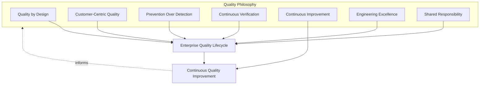
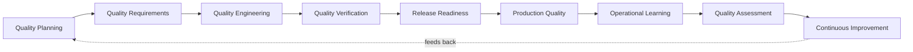
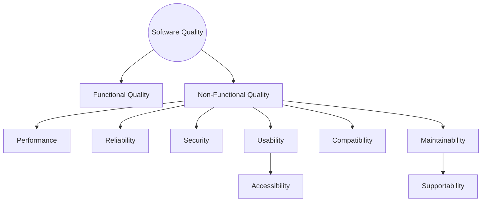
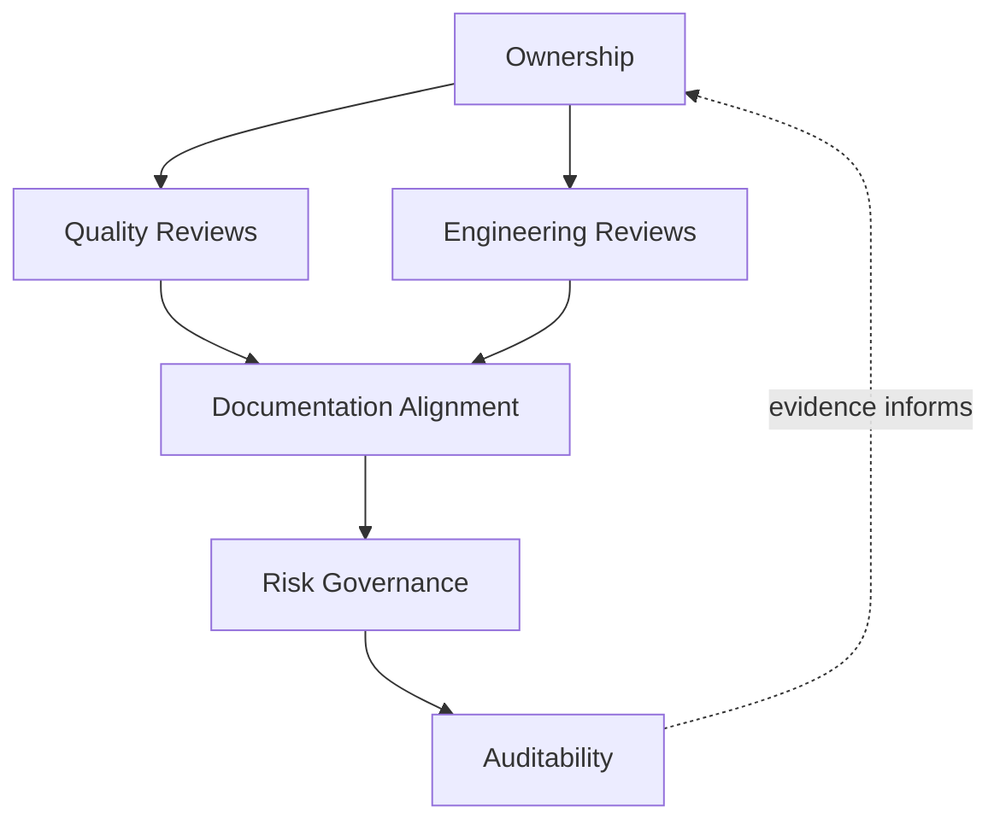
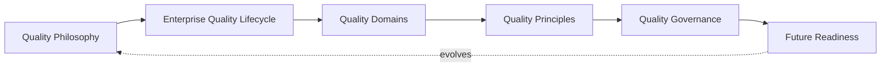
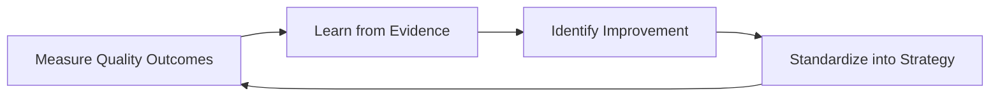

# Enterprise Software Quality Strategy

## 1. Document Purpose

This document defines the official Enterprise Software Quality Strategy for **StackLeo Tech Store**. It establishes the quality philosophy, quality lifecycle, quality domains, quality principles, and quality governance that apply across the entire platform — independent of any specific team, technology, or delivery method — and it is the authoritative parent document for all future documentation within `08_Quality_Assurance`.

- **Purpose of Enterprise Software Quality** — to ensure that "working software" and "quality software" are treated as the same requirement, not two separate ambitions; quality is the structural guarantee that what StackLeo ships is fit for the customer's purpose, the business's risk tolerance, and the platform's long-term evolution.
- **Relationship with Software Engineering** — quality is a property engineering builds in through design, construction, and verification discipline; this strategy governs *what quality means and how it is assured*, while `03_System_Design/architecture-principles.md` and `03_System_Design/quality-attributes.md` govern *how the architecture structurally delivers it*.
- **Relationship with QA** — Quality Assurance is the function most directly accountable for verification and governance of this strategy, but QA is never quality's sole owner (Section 2.7); QA-specific practice (test strategy, test levels, defect management) is elaborated in dedicated documents that will follow within `08_Quality_Assurance`.
- **Relationship with DevOps** — this strategy assumes the delivery cadence and automation-first culture defined in `07_DevOps/devops-principles.md`; quality gates described here are conceptually anchored to the pipeline stages in `07_DevOps/ci-cd-strategy.md`, without prescribing specific tooling.
- **Relationship with DevSecOps** — security quality (Section 4.5) is governed jointly with `07_DevOps/devsecops-strategy.md`; this document treats security as one of several first-class quality domains rather than a parallel concern evaluated separately from the rest of quality.
- **Relationship with Customer Experience** — quality is ultimately measured by whether customers can trust, use, and rely on the platform, consistent with the trust-centered brand vision in `01_Business/vision.md`; every quality domain in Section 4 traces back to a customer-observable outcome.
- **Relationship with Business Risk** — quality investment is proportionate to business risk and impact (Section 5.2); this strategy exists so that quality decisions are made deliberately against known risk, not reactively after a failure has already reached a customer.

This document is implementation-independent and vendor-neutral. It defines quality philosophy, lifecycle, domains, principles, and governance — not specific testing tools, QA platforms, automation frameworks, programming languages, infrastructure configuration, or code.

## 2. Quality Philosophy

Quality at StackLeo is governed by seven principles. Each principle exists to produce a specific, tangible business outcome — quality is pursued because of what it protects and enables, not as an abstract engineering virtue.

### 2.1 Quality by Design

Quality characteristics are designed into a capability from the moment it is conceived, not inspected into it afterward.

- **Business Value** — a defect prevented at design time costs a fraction of one discovered in production; designing for quality protects delivery velocity and customer trust simultaneously, rather than trading one for the other.

### 2.2 Customer-Centric Quality

Quality is defined by whether the customer's real need is met, not by whether internal specifications were technically satisfied.

- **Business Value** — anchors every quality decision to `01_Business/vision.md` and `02_Product/user-personas.md`; prevents the common failure of shipping software that passes internal checks but does not serve the customer it was built for.

### 2.3 Prevention Over Detection

Effort is weighted toward preventing defects (clear requirements, sound design, disciplined engineering) rather than relying primarily on finding them after the fact.

- **Business Value** — detection alone is a cost center that grows with the platform; prevention is an investment that compounds, reducing the volume of issues verification must ever catch.

### 2.4 Continuous Verification

Quality is verified continuously and incrementally across the lifecycle, not confirmed once at the end before release.

- **Business Value** — surfaces defects at the earliest, cheapest point they can be found, and keeps release readiness (Section 3.5) a routine confirmation rather than a high-risk event.

### 2.5 Continuous Improvement

Quality practice itself is expected to mature over time, informed by real operational and customer evidence rather than fixed at a single point in the platform's history.

- **Business Value** — ensures quality strategy keeps pace with StackLeo's growth from single-seller B2C retailer toward marketplace, corporate sales, and regional expansion, rather than becoming outdated as the business model evolves.

### 2.6 Engineering Excellence

Quality depends on strong fundamentals — clear design, disciplined construction, rigorous review, and honest technical judgment — applied consistently, not only under scrutiny.

- **Business Value** — reduces reliance on late-stage verification to compensate for weak fundamentals, and directly supports the maintainability and extensibility goals of `03_System_Design/quality-attributes.md` (Sections 8–9).

### 2.7 Shared Responsibility

Quality is owned jointly by Product, Engineering, QA, Design, Security, and Operations; no single function is accountable for quality on behalf of everyone else.

- **Business Value** — prevents the anti-pattern in Section 9.2, where quality degrades because everyone assumes another function is responsible for it.

*Diagram 1: Quality Philosophy Overview — the seven principles collectively shape the lifecycle, and operational learning feeds back into the philosophy itself.*

## 3. Enterprise Quality Lifecycle

Quality is governed across nine conceptual stages, spanning from initial planning through production learning and back into continuous improvement. Each stage exists independently of any specific tool or delivery method.

### 3.1 Quality Planning

- **Purpose** — establish the quality expectations, risk tolerance, and quality objectives for a capability before design begins.
- **Business Value** — ensures quality is budgeted for as deliberately as scope and schedule, rather than assumed to happen for free.
- **Governance Objectives** — confirm every significant capability has an explicit, documented quality expectation before commitment.

### 3.2 Quality Requirements

- **Purpose** — translate business and customer expectations into explicit, verifiable quality requirements, spanning both functional and non-functional dimensions.
- **Business Value** — removes ambiguity about what "acceptable" means for a capability, consistent with the traceability model in `02_Product/acceptance-criteria.md`.
- **Governance Objectives** — ensure quality requirements trace to a business or customer need, and that no capability proceeds to engineering without them.

### 3.3 Quality Engineering

- **Purpose** — build quality into the capability through disciplined design, construction, and internal review practice.
- **Business Value** — treats quality as a property of *how* software is built, not solely a property confirmed afterward.
- **Governance Objectives** — ensure engineering practice consistently reflects Prevention Over Detection (Section 2.3) rather than depending on downstream verification to compensate for weak construction.

### 3.4 Quality Verification

- **Purpose** — confirm that the built capability satisfies its quality requirements before it is considered complete.
- **Business Value** — provides objective, evidence-based confirmation of readiness, replacing subjective confidence with verifiable proof.
- **Governance Objectives** — ensure verification coverage is proportionate to risk (Section 5.2) and that verification evidence is retained for auditability (Section 6.6).

### 3.5 Release Readiness

- **Purpose** — confirm that a verified capability, and the platform as a whole, is genuinely ready to be exposed to customers.
- **Business Value** — converts release from a high-anxiety event into a routine, evidence-based decision, reducing both delivery risk and delivery hesitation.
- **Governance Objectives** — define clear, consistently applied readiness criteria that are never bypassed under schedule pressure without an explicit, accountable risk decision.

### 3.6 Production Quality

- **Purpose** — sustain and monitor quality once a capability is live and in active use by customers.
- **Business Value** — recognizes that quality is not "finished" at release; real-world usage, scale, and conditions are the ultimate test of fitness for purpose.
- **Governance Objectives** — ensure production quality signals are actively observed, not only reacted to after a customer-visible failure.

### 3.7 Operational Learning

- **Purpose** — systematically capture what production behavior, incidents, and customer feedback reveal about actual quality outcomes.
- **Business Value** — converts real operational experience into a durable input for future quality decisions, rather than letting hard-won lessons dissipate.
- **Governance Objectives** — ensure significant production learnings are documented and routed back into planning (Section 3.1) and engineering (Section 3.3).

### 3.8 Quality Assessment

- **Purpose** — periodically evaluate the overall health and maturity of quality practice across the platform, not just the outcome of a single capability.
- **Business Value** — gives leadership an honest, evidence-based view of quality maturity, supporting informed investment decisions.
- **Governance Objectives** — ensure assessment is conducted on a regular, predictable cadence and reported to accountable ownership (Section 6.1).

### 3.9 Continuous Improvement

- **Purpose** — act on the findings of operational learning and quality assessment to deliberately improve quality practice.
- **Business Value** — ensures quality strategy compounds in effectiveness over time rather than remaining static as the business and platform evolve.
- **Governance Objectives** — ensure improvement actions are tracked to completion, not merely identified and forgotten.

### Enterprise Quality Lifecycle Matrix

| Stage | Purpose | Business Value | Governance Objective |
|---|---|---|---|
| Quality Planning | Establish quality expectations before design begins | Quality is budgeted for deliberately | Every significant capability has a documented quality expectation |
| Quality Requirements | Translate expectations into verifiable requirements | Removes ambiguity about "acceptable" | Requirements trace to a business or customer need |
| Quality Engineering | Build quality in through design and construction discipline | Quality becomes a property of how software is built | Practice reflects Prevention Over Detection |
| Quality Verification | Confirm requirements are satisfied before completion | Objective, evidence-based confidence | Verification coverage proportionate to risk |
| Release Readiness | Confirm genuine readiness to reach customers | Release becomes routine, not high-risk | Readiness criteria applied consistently, never silently bypassed |
| Production Quality | Sustain and monitor live quality | Recognizes real usage as the ultimate test | Quality signals actively observed, not only reacted to |
| Operational Learning | Capture what production reveals about quality | Converts experience into durable input | Learnings documented and routed back to planning/engineering |
| Quality Assessment | Evaluate overall quality maturity periodically | Informs leadership investment decisions | Regular cadence, reported to accountable ownership |
| Continuous Improvement | Act on learning and assessment findings | Quality strategy compounds over time | Improvement actions tracked to completion |

*Diagram 2: Enterprise Quality Lifecycle — a continuous cycle in which production and assessment evidence directly informs the next iteration of planning.*

## 4. Quality Domains

Quality is governed across ten domains, aligned with the ISO/IEC 25010 software quality model. Each domain is evaluated independently but contributes to the platform's overall fitness for purpose.

### 4.1 Functional Quality

- **Purpose** — confirm the platform does what it is specified and expected to do.
- **Scope** — correctness of business behavior across catalog, cart, checkout, payments, orders, and every capability defined in `02_Product/functional-requirements.md`.
- **Governance Expectations** — every functional capability is verifiable against explicit acceptance criteria, per `02_Product/acceptance-criteria.md`.
- **Business Importance** — functional failure is the most directly customer-visible and revenue-affecting form of quality failure.

### 4.2 Non-Functional Quality

- **Purpose** — confirm the platform meets the quality expectations that shape *how well* it performs its function, as defined in `02_Product/non-functional-requirements.md`.
- **Scope** — cross-cutting expectations spanning performance, reliability, security, usability, and the other domains in this section.
- **Governance Expectations** — non-functional requirements are treated as first-class, verifiable requirements, not optional aspirations.
- **Business Importance** — determines whether a functionally correct platform is actually viable at real-world scale, risk, and customer expectation.

### 4.3 Performance Quality

- **Purpose** — confirm the platform responds predictably and within acceptable bounds under expected and peak conditions.
- **Scope** — responsiveness of customer-facing journeys (browse, search, checkout) and backend processing, consistent with `03_System_Design/quality-attributes.md` (Section 3).
- **Governance Expectations** — performance expectations are defined quantitatively and verified before capabilities affecting the critical path are released.
- **Business Importance** — directly affects conversion and customer trust; slow experiences are a leading cause of abandoned purchases.

### 4.4 Reliability Quality

- **Purpose** — confirm the platform behaves consistently and predictably over time and under adverse conditions.
- **Scope** — fault tolerance, recovery behavior, and consistency of critical transactions, consistent with `03_System_Design/quality-attributes.md` (Section 6).
- **Governance Expectations** — every critical capability has an explicit, verified answer to how it behaves under failure.
- **Business Importance** — underpins customer confidence that an order, once placed, will be honored correctly.

### 4.5 Security Quality

- **Purpose** — confirm the platform protects the confidentiality, integrity, and availability of customer and business data.
- **Scope** — governed jointly with `06_Security/security-principles.md` and `07_DevOps/devsecops-strategy.md`; covers identity, application, data, and operational security as quality concerns, not a separate track.
- **Governance Expectations** — security requirements are verified with the same rigor and mandatory gating as functional requirements.
- **Business Importance** — security is StackLeo's core brand differentiator per `01_Business/vision.md`; a security failure is simultaneously a quality failure and a trust failure.

### 4.6 Usability Quality

- **Purpose** — confirm the platform is understandable, learnable, and efficient to use for its intended customers.
- **Scope** — customer-facing journeys evaluated against `02_Product/user-personas.md` and `02_Product/user-journeys.md`, across the full range of customer technical familiarity.
- **Governance Expectations** — usability is verified with real customer-representative scenarios, not solely internal engineering judgment.
- **Business Importance** — directly determines task completion and purchase completion rates, especially for less technical personas.

### 4.7 Accessibility Quality

- **Purpose** — confirm the platform is usable by customers regardless of ability, consistent with the WCAG-aligned commitment in `02_Product/non-functional-requirements.md`.
- **Scope** — all customer-facing experiences across current and future sales channels (Section 7).
- **Governance Expectations** — accessibility is verified as a release-blocking quality requirement, not a discretionary enhancement.
- **Business Importance** — expands StackLeo's addressable market and reflects the inclusive service standard implied by the brand vision.

### 4.8 Compatibility Quality

- **Purpose** — confirm the platform functions correctly across the range of devices, browsers, and channels customers actually use.
- **Scope** — current web channel and future mobile app, physical store, and POS channels defined in the company's sales channel strategy.
- **Governance Expectations** — compatibility coverage decisions are made deliberately against real customer device and channel data, not assumed.
- **Business Importance** — Bangladesh's diverse device and network landscape makes compatibility a direct determinant of reachable market size.

### 4.9 Maintainability Quality

- **Purpose** — confirm the platform can be understood, modified, and extended safely and efficiently over time.
- **Scope** — codebase and architectural structure, governed jointly with `03_System_Design/quality-attributes.md` (Section 8).
- **Governance Expectations** — maintainability is assessed as a recurring quality signal (e.g., through Engineering Reviews, Section 6.3), not only noticed when it has already degraded.
- **Business Importance** — determines the true cost and speed of every future feature, directly affecting long-term delivery velocity.

### 4.10 Supportability Quality

- **Purpose** — confirm the platform can be effectively diagnosed, operated, and supported once live.
- **Scope** — observability, diagnosability, and operational documentation, consistent with `07_DevOps/observability-strategy.md` and `07_DevOps/incident-management.md`.
- **Governance Expectations** — every production capability meets a baseline expectation for diagnosability before release.
- **Business Importance** — determines how quickly the business can restore trust after an incident, directly shaping customer-perceived reliability.

### Quality Domain Matrix

| Domain | Purpose | Governance Expectations | Business Importance |
|---|---|---|---|
| Functional Quality | Confirm the platform does what is specified | Verifiable against explicit acceptance criteria | Most directly customer-visible and revenue-affecting |
| Non-Functional Quality | Confirm quality of *how* the platform performs its function | Treated as first-class, verifiable requirements | Determines real-world viability at scale and risk |
| Performance Quality | Confirm predictable, timely response | Defined quantitatively, verified pre-release | Directly affects conversion and customer trust |
| Reliability Quality | Confirm consistent, predictable behavior | Explicit, verified failure behavior per capability | Underpins confidence that orders are honored |
| Security Quality | Protect confidentiality, integrity, availability | Verified with functional-level rigor and gating | Core brand differentiator; failure is a trust failure |
| Usability Quality | Confirm understandable, efficient use | Verified with customer-representative scenarios | Determines task and purchase completion rates |
| Accessibility Quality | Confirm usability regardless of ability | Release-blocking, not discretionary | Expands addressable market; reflects brand values |
| Compatibility Quality | Confirm correct function across devices/channels | Coverage decided against real usage data | Direct determinant of reachable market size |
| Maintainability Quality | Confirm safe, efficient long-term change | Assessed as a recurring signal | Determines true cost and speed of future delivery |
| Supportability Quality | Confirm diagnosability and operability | Baseline diagnosability expected pre-release | Determines speed of trust restoration after incidents |

*Diagram 3: Software Quality Model — Functional Quality and Non-Functional Quality as the two top-level branches, aligned with the ISO/IEC 25010 characteristic groupings elaborated in `03_System_Design/quality-attributes.md`.*

## 5. Quality Principles

### 5.1 Fitness for Purpose

A capability is judged against whether it genuinely serves its intended customer and business purpose, not merely whether it matches a written specification.

### 5.2 Risk-Based Quality

Quality investment and verification rigor are proportionate to the genuine business, customer, and financial risk a capability carries — critical-path commerce capability (checkout, payments, orders) warrants materially more rigor than low-risk, peripheral capability.

### 5.3 Shift-Left Quality

Quality consideration begins as early in the lifecycle as possible — at planning and design — so defects are prevented or caught before they become expensive to fix.

### 5.4 Shift-Right Learning

Quality understanding continues to grow after release, through disciplined observation of real production behavior and customer feedback, feeding back into future design decisions.

### 5.5 Continuous Validation

Quality assumptions are re-validated on an ongoing basis rather than confirmed once and assumed to remain true indefinitely as the platform, customer base, and conditions change.

### 5.6 Measurable Quality

Quality is expressed wherever possible as an objective, observable measure rather than a subjective impression, enabling honest comparison over time.

### 5.7 Continuous Feedback

Feedback — from customers, engineering, operations, and business stakeholders — flows continuously into quality decision-making, rather than being collected only at fixed, infrequent intervals.

### Quality Principle Matrix

| Principle | Description | Business Value |
|---|---|---|
| Fitness for Purpose | Judge against genuine purpose, not just specification | Prevents "correct but useless" outcomes |
| Risk-Based Quality | Rigor proportionate to genuine risk | Focuses finite quality effort where it matters most |
| Shift-Left Quality | Consider quality as early as possible | Defects prevented or caught while cheapest to fix |
| Shift-Right Learning | Keep learning from real production behavior | Converts live operation into a quality input, not just a quality test |
| Continuous Validation | Re-validate assumptions on an ongoing basis | Keeps quality confidence honest as conditions change |
| Measurable Quality | Prefer objective, observable measures | Enables honest comparison and trend analysis over time |
| Continuous Feedback | Feedback flows in continuously | Keeps quality decisions current, not based on stale input |

## 6. Quality Governance

### 6.1 Ownership

Every quality domain (Section 4) and lifecycle stage (Section 3) has a single accountable owner; quality governance itself is owned collectively by Engineering, Product, and QA leadership, consistent with Shared Responsibility (Section 2.7).

### 6.2 Quality Reviews

Capabilities are formally reviewed against their quality requirements at defined lifecycle checkpoints (Section 3.4–3.5), ensuring quality confirmation is a deliberate governance act, not an informal assumption.

### 6.3 Engineering Reviews

Engineering practice itself — design, construction, and internal review discipline (Section 3.3) — is periodically reviewed for adherence to the principles in Section 2 and Section 5, independent of any single capability's outcome.

### 6.4 Documentation Alignment

Quality documentation is kept consistent with the architecture (`03_System_Design`), product requirements (`02_Product`), security (`06_Security`), and delivery (`07_DevOps`) documentation it depends on; a quality claim that contradicts current architectural or requirements documentation is treated as a governance gap.

### 6.5 Risk Governance

Quality-related risk is tracked, prioritized, and escalated consistently with the risk-based approach in Section 5.2, ensuring accepted risk is always a deliberate, accountable decision rather than an unexamined default.

### 6.6 Auditability

Quality decisions, verification evidence, and release readiness confirmations are retained in a form that can be independently reviewed after the fact, supporting both internal governance and the broader compliance posture referenced in `06_Security/compliance.md`.

### Quality Governance Matrix

| Governance Area | Objective |
|---|---|
| Ownership | Every domain and lifecycle stage has one accountable owner |
| Quality Reviews | Quality confirmation is a deliberate, checkpointed governance act |
| Engineering Reviews | Engineering fundamentals are periodically assessed independent of any single feature |
| Documentation Alignment | Quality documentation stays consistent with architecture, product, security, and delivery documentation |
| Risk Governance | Accepted quality risk is always a deliberate, accountable decision |
| Auditability | Quality decisions and evidence are retained for independent review |

*Diagram 4: Quality Governance Framework — ownership anchors review activity, which feeds documentation alignment, risk governance, and ultimately auditable evidence.*

*Diagram 5: Enterprise Quality Operating Model — how philosophy, lifecycle, domains, principles, and governance operate together as a single, self-reinforcing system that continues to evolve as the platform grows.*

## 7. Future Readiness

This strategy is designed to remain valid as StackLeo evolves in scale and architectural complexity, without requiring redefinition of its underlying philosophy.

- **Cloud-Native Platforms** — quality domains (Section 4) and lifecycle stages (Section 3) are defined independently of any specific runtime or deployment model, so they apply unchanged as infrastructure evolves, consistent with `03_System_Design/deployment-architecture.md`.
- **AI Systems** — as AI-assisted capability (recommendations, search relevance, fraud detection) is introduced per `03_System_Design/quality-attributes.md` (Section 9), it is governed under the same Functional and Non-Functional Quality domains, with additional attention to explainability and behavioral drift as an extension of Reliability Quality (Section 4.4).
- **Marketplace Platform** — the multi-vendor marketplace model extends existing quality domains to cover seller-supplied content and listings, requiring the same fitness-for-purpose rigor (Section 5.1) applied to StackLeo's own catalog today.
- **Multi-Tenant Architecture** — where future architecture introduces tenant isolation (e.g., for marketplace sellers or B2B customers), Reliability and Security Quality (Sections 4.4–4.5) extend to explicitly cover cross-tenant isolation as a verifiable requirement.
- **Microservices** — as the platform decomposes into further bounded services per `03_System_Design/service-architecture.md`, quality governance (Section 6) extends naturally to service-level ownership without requiring a new governance model.
- **Multi-Region Operations** — as StackLeo expands from Bangladesh into South Asia and beyond, Compatibility and Performance Quality (Sections 4.3, 4.8) extend to cover regional network conditions, localization, and data residency expectations.
- **Global Engineering Teams** — the principles and governance in Sections 2, 5, and 6 are defined independently of team size, location, or organizational structure, so they remain coherent as engineering scales beyond a single, co-located team.

## 8. Governance

- **Ownership** — the Head of Quality (or equivalent accountable executive function) owns this strategy and is accountable for its consistent application across the platform, in partnership with Engineering and Product leadership.
- **Review Process** — this strategy is formally reviewed whenever a material change occurs in business model (`01_Business/business-model.md`), architecture (`03_System_Design`), or delivery practice (`07_DevOps`), and on a regular recurring cadence independent of specific change events.
- **Quality Policies** — subordinate, domain-specific quality policy and practice documents (test strategy, defect management, quality metrics, and further documents within `08_Quality_Assurance`) must remain consistent with the philosophy, lifecycle, and principles defined here.
- **Audit Readiness** — this strategy and the evidence it requires (Section 6.6) are maintained in a state ready for internal or external audit at any time, without requiring advance preparation.
- **Continuous Improvement** — this strategy itself is subject to Continuous Improvement (Section 3.9); its effectiveness is periodically assessed (Section 3.8) and revised based on genuine operational and organizational evidence.

*Diagram 6: Continuous Quality Improvement Cycle — quality outcomes are measured, learned from, improved upon, and standardized back into this strategy, on a continuing basis.*

## 9. Anti-Patterns

The following recurring failure patterns are explicitly recognized and avoided, as each one structurally undermines this strategy.

| Anti-Pattern | Why It's Avoided |
|---|---|
| Testing at the End Only | Contradicts Shift-Left Quality (Section 5.3) and Prevention Over Detection (Section 2.3); defects found late are the most expensive to fix and the most likely to delay release. |
| Quality as QA's Responsibility Alone | Contradicts Shared Responsibility (Section 2.7); quality degrades when Engineering, Product, and Operations assume QA alone will catch every issue. |
| Weak Documentation | Undermines Documentation Alignment (Section 6.4) and traceability to `02_Product/acceptance-criteria.md`, leaving quality expectations ambiguous or unverifiable. |
| Missing Acceptance Criteria | Removes the objective basis for Quality Verification (Section 3.4), making "done" a subjective judgment rather than a verifiable outcome. |
| Reactive Quality | Contradicts Continuous Verification (Section 2.4); waiting for problems to surface in production is the costliest and least controlled way to discover a quality failure. |
| Weak Engineering Reviews | Undermines Engineering Excellence (Section 2.6) and Section 6.3, allowing fundamental quality issues to compound silently over time. |
| Ignoring Customer Feedback | Contradicts Customer-Centric Quality (Section 2.2) and Shift-Right Learning (Section 5.4), severing the platform's most direct signal of genuine fitness for purpose. |
| No Continuous Improvement | Contradicts Section 2.5 and Section 3.9; without deliberate improvement, quality practice stagnates while the business and platform continue to grow in complexity. |

## 10. Document Information

| Property | Value |
|----------|-------|
| Document | quality-strategy.md |
| Version | 1.0.0 |
| Status | Active |
| Maintained By | StackLeo |
| Last Updated | 2026-07-24 |

---

© StackLeo. All Rights Reserved.
