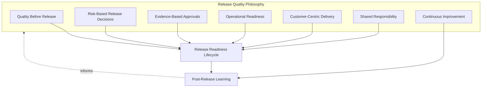
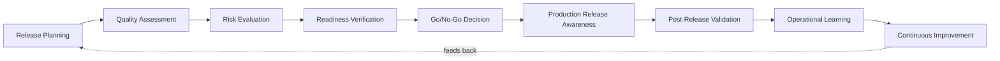
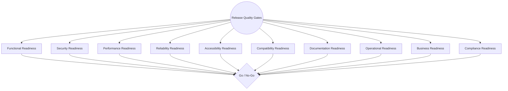
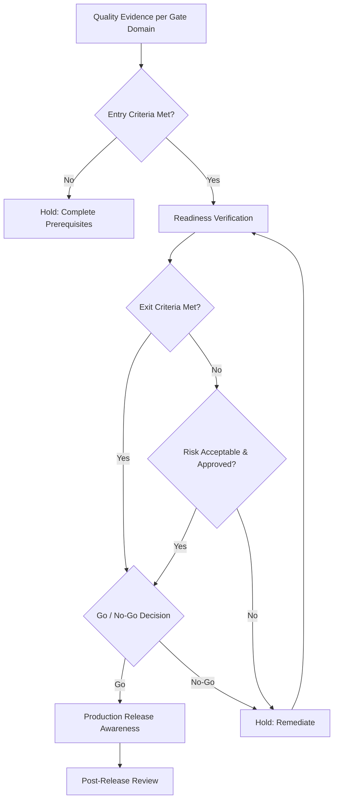
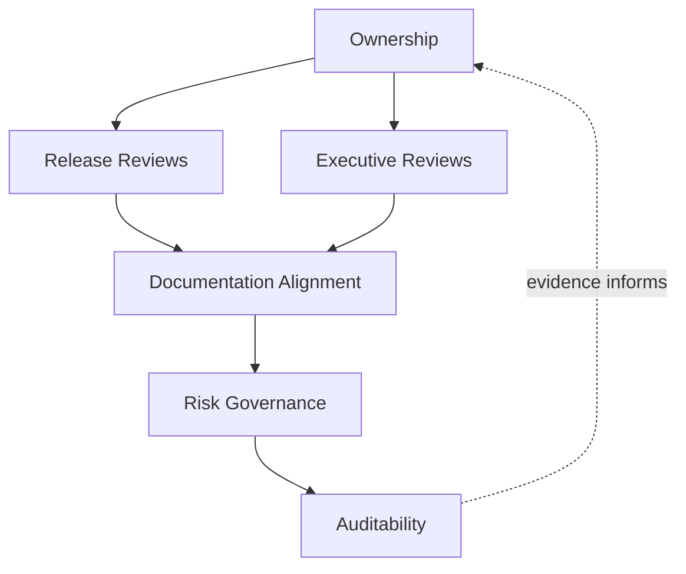
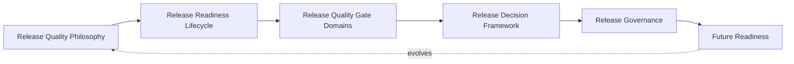
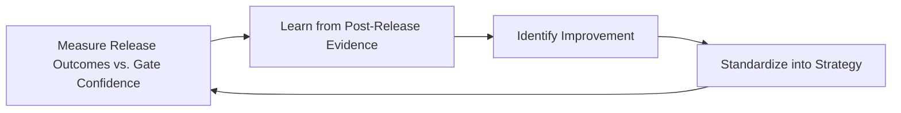

# Enterprise Release Quality Gates & Release Readiness Strategy

## 1. Document Purpose

This document defines the official Enterprise Release Quality Gates & Release Readiness Strategy for **StackLeo Tech Store**. It establishes how accumulated quality evidence is converted into a deliberate, defensible release decision — independent of any specific CI/CD platform, deployment tool, or release orchestration technology.

- **Purpose of Release Quality Gates** — release quality gates exist to ensure that the decision to expose customers to change is always evidence-based and deliberate, converting the quality and testing evidence produced elsewhere in `08_Quality_Assurance` into a single, coherent readiness judgment at the moment it matters most.
- **Relationship with Quality Strategy** — this document is the release-specific elaboration of Release Readiness in `quality-strategy.md` (Section 3.5); every quality domain defined there (Section 4) contributes evidence that this strategy formally gathers, weighs, and acts on.
- **Relationship with Testing Strategy** — this document consumes the accumulated evidence produced by `testing-strategy.md` (Section 3.8, Release Readiness), `test-planning.md` (Section 5, Exit Criteria and Quality Gates), `performance-testing.md`, `accessibility-testing.md`, `compatibility-testing.md`, and `defect-management.md`, converting distributed verification outcomes into a single go/no-go judgment.
- **Relationship with Release Management** — this document defines the quality gating that must be satisfied before a release proceeds; `07_DevOps/release-management.md` governs the broader business decision, timing, and coordination of the release itself, keeping the two connected but distinct.
- **Relationship with DevOps** — this strategy assumes the delivery cadence of `07_DevOps/devops-principles.md` and is conceptually anchored to the pipeline gates in `07_DevOps/ci-cd-strategy.md`, without prescribing specific pipeline tooling or deployment workflows.
- **Relationship with Business Continuity** — a release proceeding without genuine readiness is one of the most common, self-inflicted sources of business disruption; this strategy is a direct, proactive protection of the continuity commitments in `06_Security/business-continuity.md`.

This document is implementation-independent and vendor-neutral. It defines release quality philosophy, lifecycle, gate domains, and governance — not specific CI/CD platforms, deployment tools, release orchestration software, deployment workflows, or infrastructure configuration.

## 2. Release Quality Philosophy

Release quality governance at StackLeo is governed by seven principles. Each exists to produce a specific business outcome — release decisions are governed deliberately because of what is at stake for customers and the business, not as a procedural formality.

### 2.1 Quality Before Release

A release proceeds only once it has genuinely satisfied its defined quality expectations, never on the basis of schedule pressure or convenience alone, consistent with Release Readiness in `quality-strategy.md` (Section 3.5).

- **Business Value** — protects customers and revenue from avoidable defects, and protects the organization from the far higher cost of remediating a problem already in production.

### 2.2 Risk-Based Release Decisions

The rigor applied to a release decision is proportionate to the risk of what is being released, consistent with Risk-Based Testing (`testing-strategy.md`, Section 2.3) — a change to checkout or payment warrants materially more scrutiny than a low-risk, peripheral change.

- **Business Value** — directs finite governance attention toward the releases whose failure would cause the greatest business harm, rather than treating every release identically.

### 2.3 Evidence-Based Approvals

Every release decision is grounded in retained, traceable quality evidence, not informal confidence or individual assurance.

- **Business Value** — makes release decisions defensible after the fact and removes reliance on any single person's memory or impression of readiness.

### 2.4 Operational Readiness

A release is not considered ready until the organization is prepared to operate, support, and recover it once live, not only prepared to deploy it, consistent with Operational Readiness Testing (`testing-strategy.md`, Section 4.7).

- **Business Value** — prevents the common failure mode where a technically correct release becomes an operational crisis because the organization was not prepared to sustain it.

### 2.5 Customer-Centric Delivery

Release timing and scope decisions are made with explicit awareness of genuine customer impact, not purely internal engineering or business convenience.

- **Business Value** — protects the trust-centered brand commitment in `01_Business/vision.md` by ensuring customers experience release change as an improvement, not a disruption.

### 2.6 Shared Responsibility

Release readiness is owned jointly by Engineering, QA, Product, Security, and Operations; no single function unilaterally decides a release is ready on behalf of everyone else.

- **Business Value** — prevents the anti-pattern in Section 9.3, where a weak or narrowly-informed go/no-go decision is made without genuine cross-functional confidence.

### 2.7 Continuous Improvement

Release quality gate practice matures over time, informed by real release outcomes and post-release validation findings.

- **Business Value** — ensures release governance becomes more effective and efficient over time rather than remaining fixed as the platform and delivery cadence evolve.

*Diagram 1: Release Quality Philosophy Overview — the seven principles shape the release readiness lifecycle, and post-release learning feeds back into the philosophy itself.*

## 3. Enterprise Release Readiness Lifecycle

Release readiness is governed across nine conceptual stages, spanning from initial planning through post-release learning and continuous improvement.

### 3.1 Release Planning

- **Purpose** — establish the intended scope, timing, and business context for a release, coordinated with `07_DevOps/release-management.md`.
- **Business Value** — ensures release quality expectations are established before evidence-gathering begins, not improvised at the point of decision.
- **Governance Objectives** — confirm every planned release has a documented scope against which readiness will later be assessed.

### 3.2 Quality Assessment

- **Purpose** — gather and evaluate the accumulated quality evidence relevant to the planned release scope, across the gate domains in Section 4.
- **Business Value** — provides the substantive basis for confidence, replacing assumption with aggregated, genuine evidence.
- **Governance Objectives** — ensure assessment draws on evidence from `testing-strategy.md`, `defect-management.md`, and the domain-specific strategies (performance, accessibility, compatibility), not a narrow subset of it.

### 3.3 Risk Evaluation

- **Purpose** — identify and weigh the residual risk associated with the release, including any known, unresolved issues.
- **Business Value** — ensures known risk is explicitly considered rather than silently carried forward unexamined.
- **Governance Objectives** — require every identified residual risk to be explicitly documented before proceeding to readiness verification.

### 3.4 Readiness Verification

- **Purpose** — confirm each applicable release quality gate domain (Section 4) has genuinely satisfied its defined entry and exit criteria (Section 5).
- **Business Value** — converts abstract confidence into a concrete, checkable confirmation across every relevant quality dimension.
- **Governance Objectives** — ensure verification is performed consistently across gate domains, with no domain silently skipped.

### 3.5 Go/No-Go Decision

- **Purpose** — render a deliberate, accountable decision on whether the release proceeds, is held, or proceeds with explicitly accepted risk.
- **Business Value** — converts release into a governed decision point rather than a default outcome of the calendar or schedule.
- **Governance Objectives** — require the decision and its rationale to be recorded, consistent with Go/No-Go Governance (Section 5.5).

### 3.6 Production Release Awareness

- **Purpose** — ensure relevant stakeholders — Engineering, Support, Operations — are aware a release is occurring and prepared for its immediate aftermath.
- **Business Value** — reduces the risk of a release-related issue going unnoticed or unattended in its most sensitive initial period.
- **Governance Objectives** — require documented communication of release occurrence to all stakeholders with an operational or support role.

### 3.7 Post-Release Validation

- **Purpose** — confirm, using real production signals, that the release behaves as intended once live.
- **Business Value** — closes the loop between pre-release confidence and genuine, observed outcome, catching issues that pre-release evidence could not fully anticipate.
- **Governance Objectives** — require a defined, time-bound period of heightened post-release observation for every release.

### 3.8 Operational Learning

- **Purpose** — capture what the release's actual outcome reveals about the accuracy of pre-release readiness assessment.
- **Business Value** — converts real release experience into a durable input for improving future readiness judgment.
- **Governance Objectives** — ensure significant release learnings are documented and routed back into Section 3.1 and Section 3.2.

### 3.9 Continuous Improvement

- **Purpose** — act on operational learning to deliberately improve release quality gate practice.
- **Business Value** — ensures release governance effectiveness compounds over time as delivery cadence and platform complexity grow.
- **Governance Objectives** — ensure improvement actions arising from release retrospectives are tracked to completion.

### Release Readiness Lifecycle Matrix

| Stage | Purpose | Business Value | Governance Objective |
|---|---|---|---|
| Release Planning | Establish intended scope, timing, and context | Quality expectations set before evidence-gathering | Every release has documented scope for later assessment |
| Quality Assessment | Gather and evaluate accumulated quality evidence | Provides substantive, genuine basis for confidence | Draws on evidence across all relevant strategies |
| Risk Evaluation | Identify and weigh residual release risk | Ensures known risk is explicit, not silently carried | Every residual risk documented before verification |
| Readiness Verification | Confirm each gate domain satisfies its criteria | Converts confidence into concrete, checkable confirmation | Verification consistent across domains, none skipped |
| Go/No-Go Decision | Render a deliberate, accountable release decision | Converts release into a governed decision point | Decision and rationale recorded |
| Production Release Awareness | Ensure stakeholders are aware and prepared | Reduces risk of unnoticed post-release issues | Documented communication to operational/support roles |
| Post-Release Validation | Confirm real behavior once live | Closes the loop between confidence and observed outcome | Defined, time-bound heightened observation period |
| Operational Learning | Capture what outcome reveals about readiness accuracy | Converts real experience into durable input | Learnings documented and routed back to planning |
| Continuous Improvement | Act on learning to improve gate practice | Governance effectiveness compounds over time | Improvement actions tracked to completion |

*Diagram 2: Enterprise Release Readiness Lifecycle — a continuous cycle in which post-release evidence directly informs the next iteration of release planning.*

## 4. Release Quality Gate Domains

Release readiness is verified across ten conceptual gate domains, each drawing on the dedicated strategy that governs it in detail.

### 4.1 Functional Readiness

- **Purpose** — confirm the release's business logic behaves as specified.
- **Scope** — outcomes of Functional Testing (`testing-strategy.md`, Section 5.1) against `02_Product/acceptance-criteria.md`.
- **Governance Expectations** — no unresolved high-impact functional defect (`defect-management.md`, Section 4.1) proceeds without an explicit, accountable risk-acceptance decision.
- **Business Importance** — protects the most directly customer-visible and revenue-affecting dimension of quality.

### 4.2 Security Readiness

- **Purpose** — confirm the release does not introduce or leave unresolved a meaningful security weakness.
- **Scope** — outcomes of Security Testing (`testing-strategy.md`, Section 5.6) and `06_Security/vulnerability-management.md`.
- **Governance Expectations** — treated as non-negotiable; security gate failures are never overridden on schedule grounds alone.
- **Business Importance** — protects StackLeo's core trust differentiator, where failure carries consequences beyond the immediate release.

### 4.3 Performance Readiness

- **Purpose** — confirm the release meets its defined responsiveness, scalability, and capacity expectations.
- **Scope** — outcomes of `performance-testing.md`, particularly Performance Validation and Capacity Assessment (Sections 3.4–3.5 there).
- **Governance Expectations** — required for any release affecting the critical customer path or expected to face significant load.
- **Business Importance** — protects conversion and customer trust, both highly sensitive to responsiveness.

### 4.4 Reliability Readiness

- **Purpose** — confirm the release behaves consistently and recovers predictably under adverse conditions.
- **Scope** — outcomes of Reliability Testing (`testing-strategy.md`, Section 5.9) and Resilience Testing (`performance-testing.md`, Section 4.8).
- **Governance Expectations** — required for every capability on the critical commerce path (browse, cart, checkout, payment, order).
- **Business Importance** — underpins customer confidence that transactions, once initiated, will be honored correctly.

### 4.5 Accessibility Readiness

- **Purpose** — confirm the release does not introduce or leave unresolved an accessibility barrier.
- **Scope** — outcomes of `accessibility-testing.md`, particularly Accessibility Validation and Defect Assessment (Sections 3.4–3.5 there).
- **Governance Expectations** — release-blocking for customer-facing capability, consistent with `accessibility-testing.md` (Section 3.6).
- **Business Importance** — protects equal access and the addressable market accessibility conformance enables.

### 4.6 Compatibility Readiness

- **Purpose** — confirm the release functions correctly across the environments and integrations customers and partners actually use.
- **Scope** — outcomes of `compatibility-testing.md`, particularly Compatibility Validation (Section 3.4 there).
- **Governance Expectations** — coverage confirmed against current Platform Analysis (`compatibility-testing.md`, Section 3.2), not assumed from a prior release.
- **Business Importance** — protects reachable market size across StackLeo's diverse browser, device, and network landscape.

### 4.7 Documentation Readiness

- **Purpose** — confirm documentation affected by the release (requirements, API, operational runbooks) is accurate and current.
- **Scope** — alignment between released behavior and its corresponding documentation across the repository.
- **Governance Expectations** — documentation gaps are treated as a genuine readiness concern, consistent with Documentation Defects (`defect-management.md`, Section 4.9).
- **Business Importance** — protects the reliability of the documentation that support, operations, and future engineering decisions depend on.

### 4.8 Operational Readiness

- **Purpose** — confirm the organization is prepared to operate, support, and recover the release once live.
- **Scope** — outcomes of Operational Readiness Testing (`testing-strategy.md`, Section 4.7) and alignment with `07_DevOps/operational-readiness.md`.
- **Governance Expectations** — required as a gating condition regardless of how strong functional evidence is, consistent with Operational Readiness (Section 2.4).
- **Business Importance** — determines whether the business can actually sustain the release once real customers depend on it.

### 4.9 Business Readiness

- **Purpose** — confirm the business itself — support teams, marketing, operations — is prepared for the release's customer-facing impact.
- **Scope** — coordination with `01_Business` and `02_Product` stakeholders on communication, support preparedness, and business process alignment.
- **Governance Expectations** — required for releases with material customer-facing or operational process impact.
- **Business Importance** — prevents technically successful releases from creating confusion or disruption for customers or internal teams unprepared for the change.

### 4.10 Compliance Readiness

- **Purpose** — confirm the release satisfies applicable regulatory and policy obligations.
- **Scope** — alignment with `06_Security/compliance.md` and applicable business rules in `01_Business/business-rules.md`.
- **Governance Expectations** — required for any release touching regulated data, payment handling, or market-specific compliance obligations.
- **Business Importance** — protects StackLeo's license to operate in its current and future markets.

### Release Quality Gate Matrix

| Domain | Purpose | Governance Expectations | Business Importance |
|---|---|---|---|
| Functional Readiness | Confirm business logic behaves as specified | No unresolved high-impact defect without accepted risk | Most customer-visible, revenue-affecting quality dimension |
| Security Readiness | Confirm no meaningful unresolved security weakness | Non-negotiable, never overridden on schedule grounds | Protects the core trust differentiator |
| Performance Readiness | Confirm responsiveness, scalability, capacity expectations met | Required for critical-path or high-load releases | Protects conversion and customer trust |
| Reliability Readiness | Confirm consistent behavior and predictable recovery | Required for every critical commerce-path capability | Underpins confidence transactions are honored |
| Accessibility Readiness | Confirm no unresolved accessibility barrier | Release-blocking for customer-facing capability | Protects equal access and addressable market |
| Compatibility Readiness | Confirm correct function across environments/partners | Coverage confirmed against current platform analysis | Protects reachable market size |
| Documentation Readiness | Confirm affected documentation is accurate and current | Gaps treated as a genuine readiness concern | Protects support, ops, and future engineering decisions |
| Operational Readiness | Confirm organization can operate, support, recover release | Required regardless of functional evidence strength | Determines sustainability once customers depend on it |
| Business Readiness | Confirm business is prepared for customer-facing impact | Required for material customer/process impact releases | Prevents confusion or disruption from a successful release |
| Compliance Readiness | Confirm regulatory and policy obligations are satisfied | Required for regulated data, payment, or market obligations | Protects StackLeo's license to operate |

*Diagram 3 (Part A): Release Quality Gate Framework — ten independently governed domains, each contributing evidence to a single, consolidated release decision.*

## 5. Release Decision Framework

- **Entry Criteria** — the documented conditions that must be satisfied before Readiness Verification (Section 3.4) may begin for a given gate domain (e.g., relevant testing complete, evidence available); entry criteria prevent verification from starting on an incomplete evidence base.
- **Exit Criteria** — the documented conditions that must be satisfied for a gate domain to be considered passed, consistent with Exit Criteria in `test-planning.md` (Section 5); applied consistently and never adjusted retroactively to justify a predetermined outcome.
- **Quality Evidence** — the retained, traceable record (test results, defect status, sign-offs) that substantiates each gate domain's outcome, consistent with Evidence-Based Approvals (Section 2.3).
- **Risk Acceptance** — where a gate domain has not fully passed, an explicit, accountable decision to proceed despite known residual risk, distinct from and never a substitute for genuinely passing the gate.
- **Go/No-Go Governance** — the decision to release, hold, or proceed under accepted risk is made by accountable stakeholders against documented criteria, and is itself recorded as part of the traceable record.
- **Exception Management** — where a release must deviate from standard gate expectations, the deviation is explicitly requested, reviewed, and approved by accountable stakeholders, never assumed or silently applied.
- **Post-Release Review** — the go/no-go decision and its outcome are reviewed against what actually occurred post-release (Section 3.7–3.8), closing the loop on whether the decision was well-founded.

### Release Decision Framework Matrix

| Element | Purpose | Governance Role |
|---|---|---|
| Entry Criteria | Confirm a stable evidence base before verification begins | Prevents verification from starting on incomplete evidence |
| Exit Criteria | Confirm a gate domain is genuinely passed | Applied consistently; never adjusted retroactively |
| Quality Evidence | Substantiate each gate domain's outcome | Forms the traceable record supporting the decision |
| Risk Acceptance | Document a deliberate decision to proceed despite known risk | Distinct from, and never a substitute for, passing the gate |
| Go/No-Go Governance | Govern the release/hold/proceed-with-risk decision | Made by accountable stakeholders against documented criteria |
| Exception Management | Govern deviations from standard gate expectations | Explicitly requested, reviewed, and approved, never assumed |
| Post-Release Review | Review the decision against actual post-release outcome | Closes the loop on decision quality over time |

*Diagram 3 (Part B): Go/No-Go Decision Workflow — evidence flows through entry and exit criteria, with an explicit, accountable path for risk-accepted exceptions, into a recorded release decision and subsequent post-release review.*

## 6. Release Governance

### 6.1 Ownership

Every release quality gate domain (Section 4) has a single accountable owner; overall release governance is owned jointly by Engineering, QA, and Release Management leadership, consistent with Shared Responsibility (Section 2.6).

### 6.2 Release Reviews

Release readiness is formally reviewed at defined lifecycle checkpoints (Section 3.2–3.5), ensuring the go/no-go decision is a deliberate governance act, never an informal assumption.

### 6.3 Executive Reviews

For releases of significant business risk or scope, readiness evidence and the go/no-go decision are reviewed with executive stakeholders, consistent with Executive Reporting in `quality-metrics.md` (Section 3.5).

### 6.4 Documentation Alignment

Release quality gate documentation is kept consistent with `quality-strategy.md`, `testing-strategy.md`, `defect-management.md`, and `07_DevOps/release-management.md`; a readiness claim that contradicts current evidence is treated as a governance gap.

### 6.5 Risk Governance

Release-related risk — accepted exceptions, deferred gate failures, known residual defects — is tracked, prioritized, and escalated consistently, ensuring accepted risk is always a deliberate, accountable decision.

### 6.6 Auditability

Gate evidence, go/no-go decisions, exception approvals, and post-release review outcomes are retained in a form that can be independently reviewed after the fact, supporting internal governance and the compliance posture referenced in `06_Security/compliance.md`.

### Release Governance Matrix

| Governance Area | Objective |
|---|---|
| Ownership | Every gate domain has one accountable owner |
| Release Reviews | Go/no-go decision is a deliberate, checkpointed governance act |
| Executive Reviews | Significant releases reviewed with executive stakeholders |
| Documentation Alignment | Release documentation stays consistent with quality and testing evidence |
| Risk Governance | Accepted release risk is always a deliberate, accountable decision |
| Auditability | Evidence, decisions, and reviews retained for independent review |

### Governance Responsibility Matrix

| Role | Responsibility |
|---|---|
| Head of Quality / QA Leadership | Owns coherence and enforcement of this release quality gate strategy, in partnership with Engineering and Release Management. |
| Release Manager | Owns Go/No-Go Governance (Section 3.5) coordination and Production Release Awareness (Section 3.6). |
| Engineering Leads | Own Functional, Performance, and Reliability Readiness (Sections 4.1, 4.3–4.4) within their domain. |
| Security Lead | Owns Security Readiness (Section 4.2) sign-off, with non-negotiable authority to hold a release. |
| Product Manager | Owns Business Readiness (Section 4.9) and confirms customer-facing impact is genuinely prepared for. |
| Operations / SRE Lead | Owns Operational Readiness (Section 4.8) and Post-Release Validation (Section 3.7). |
| Compliance / Legal | Owns Compliance Readiness (Section 4.10) sign-off for regulated releases. |
| Internal Audit / Review Function | Independently verifies that release governance records reflect actual practice. |

*Diagram 4 (Part A): Release Governance Operating Model — ownership anchors review activity, which feeds documentation alignment, risk governance, and ultimately auditable evidence.*

*Diagram 4 (Part B): Release Governance Operating Model — how philosophy, lifecycle, gate domains, decision framework, and governance operate together as a single, self-reinforcing system that continues to evolve as the platform grows.*

## 7. Future Readiness

This strategy is designed to remain valid as StackLeo evolves in scale and architectural complexity, without requiring redefinition of its underlying philosophy.

- **Cloud-Native Platforms** — release quality gate domains (Section 4) are defined independently of any specific runtime or deployment model, so they apply unchanged as infrastructure evolves, consistent with `03_System_Design/deployment-architecture.md`.
- **Continuous Delivery** — as delivery cadence accelerates per `07_DevOps/ci-cd-strategy.md`, the same gate domains and decision framework (Sections 4–5) apply at a faster cadence per change, becoming lighter-weight and more automated in evidence-gathering without reducing rigor.
- **Microservices** — as the platform decomposes into further bounded services per `03_System_Design/service-architecture.md`, gate ownership (Section 6.1) extends naturally to service-level release decisions without requiring a new governance model.
- **AI Systems** — as AI-assisted capability is introduced, Functional and Reliability Readiness (Sections 4.1, 4.4) extend to cover behavioral consistency and drift as an explicit gate consideration.
- **Marketplace Platform** — the multi-vendor marketplace model extends Functional and Compliance Readiness (Sections 4.1, 4.10) to cover seller-supplied content and listings, applying the same gating rigor used for StackLeo's own catalog today.
- **Multi-Tenant Architecture** — where future architecture introduces tenant isolation, Reliability and Security Readiness (Sections 4.4, 4.2) extend to explicitly gate cross-tenant impact before release.
- **Multi-Region Operations** — as StackLeo expands from Bangladesh into South Asia and beyond, Compatibility and Compliance Readiness (Sections 4.6, 4.10) extend to cover region-specific environment and regulatory gating.
- **Global Engineering Teams** — the lifecycle, gate domains, and governance defined in Sections 3–6 are defined independently of team size, location, or organizational structure, so they remain coherent as engineering scales beyond a single, co-located team.

## 8. Governance

- **Ownership** — the Head of Quality (or equivalent accountable executive function) owns this strategy and is accountable for its consistent application across the platform, in partnership with Engineering and Release Management leadership.
- **Review Process** — this strategy is formally reviewed whenever a material change occurs in business model (`01_Business/business-model.md`), architecture (`03_System_Design`), or delivery practice (`07_DevOps`), and on a regular recurring cadence independent of specific change events.
- **Release Quality Policies** — subordinate, practice-specific release documents (exception approval standards, post-release review templates, and further documents within `08_Quality_Assurance`) must remain consistent with the philosophy, lifecycle, and gate domains defined here.
- **Audit Readiness** — this strategy and the evidence it requires (Section 6.6) are maintained in a state ready for internal or external audit at any time, without requiring advance preparation.
- **Continuous Improvement** — this strategy itself is subject to Continuous Improvement (Section 2.7, Section 3.9); its effectiveness is periodically assessed and revised based on genuine release outcomes and organizational evidence.

*Diagram 5: Continuous Release Quality Improvement Cycle — release outcomes are measured against prior gate confidence, learned from, improved upon, and standardized back into this strategy, on a continuing basis.*

## 9. Anti-Patterns

The following recurring failure patterns are explicitly recognized and avoided, as each one structurally undermines this strategy.

| Anti-Pattern | Why It's Avoided |
|---|---|
| Releasing Without Evidence | Contradicts Evidence-Based Approvals (Section 2.3); a release decision made on impression rather than genuine evidence cannot be defended or learned from afterward. |
| Skipping Quality Gates | Contradicts Quality Before Release (Section 2.1); bypassing a gate domain (Section 4) leaves that dimension of risk entirely unverified rather than deliberately accepted. |
| Weak Go/No-Go Decisions | Undermines Go/No-Go Governance (Section 5.5); a decision made without genuine cross-functional confidence is not a real gate, only its appearance. |
| Ignoring Operational Readiness | Contradicts Operational Readiness (Section 2.4); a functionally sound release the organization cannot support becomes an operational crisis regardless of its technical quality. |
| Reactive Releases | Contradicts Risk-Based Release Decisions (Section 2.2); releasing without deliberate risk evaluation (Section 3.3) leaves the organization discovering risk only after it has already materialized. |
| Poor Documentation | Undermines Documentation Alignment (Section 6.4) and Auditability (Section 6.6), leaving gate evidence and decisions unclear or unverifiable after the fact. |
| Weak Ownership | Undermines Section 6.1; without a clear accountable owner per gate domain, readiness confirmation becomes diffuse and unaccountable. |
| Missing Post-Release Reviews | Contradicts Post-Release Review (Section 5.7) and Operational Learning (Section 3.8); without reviewing decisions against actual outcomes, release governance cannot improve its own judgment over time. |

## 10. Document Information

| Property | Value |
|----------|-------|
| Document | release-quality-gates.md |
| Version | 1.0.0 |
| Status | Active |
| Maintained By | StackLeo |
| Last Updated | 2026-07-24 |

---

© StackLeo. All Rights Reserved.
