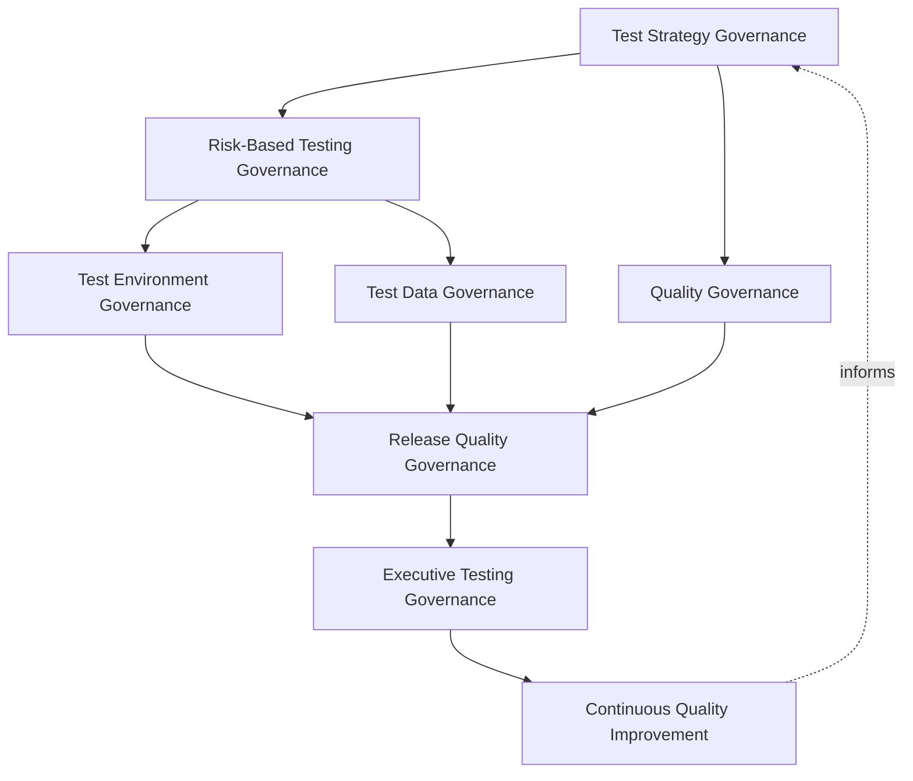
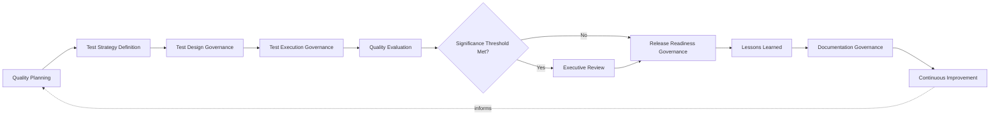
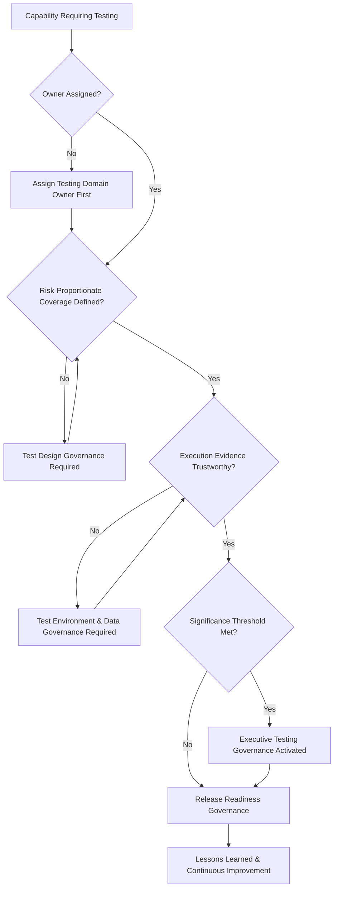
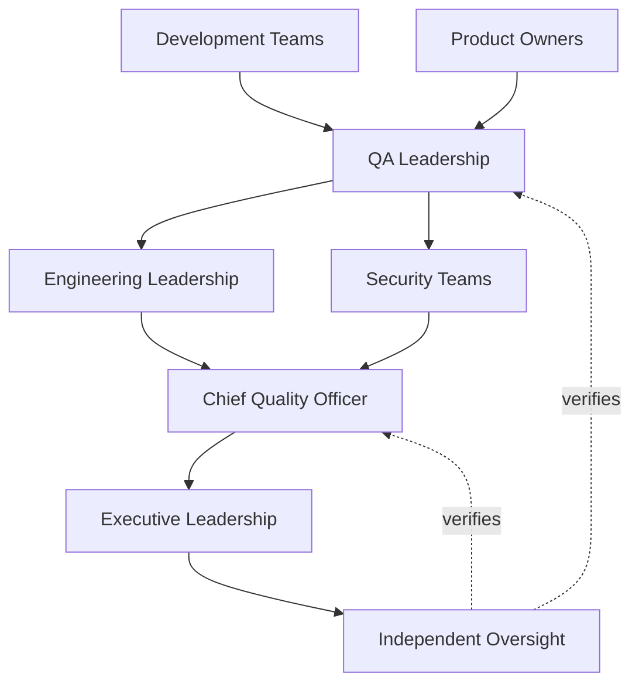
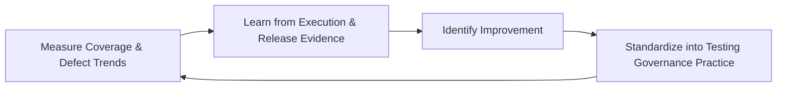
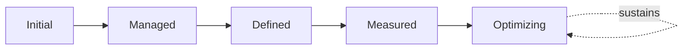

# Enterprise Testing Governance Strategy

## 1. Document Purpose

This document defines the official Enterprise Testing Governance Strategy for **StackLeo Tech Store** — the CQO/VP-of-Engineering-owned executive charter under which software testing, quality engineering, and testing excellence are governed as a deliberate, accountable discipline. It establishes governance for test strategy, quality governance, risk-based testing, test environment and data governance, release quality governance, organizational accountability, executive oversight, and long-term quality maturity across the StackLeo platform, consistent with ISTQB Advanced Level practice, IEEE 29119, ISO 9001, COBIT governance principles, and TOGAF enterprise architecture thinking.

`testing-strategy.md` remains the operational testing framework for this folder — the document that elaborates in full operational depth StackLeo's testing philosophy, lifecycle, levels, types, and verification and validation practice. This document sits above it as the highest-level executive mandate, consistent with the executive-charter relationship `incident-management-governance.md`, `problem-management-governance.md`, `change-management-governance.md`, and `service-level-governance.md` hold over their respective operational documents in `09_Operations`: it does not restate testing execution detail, it establishes the philosophy, organizational ownership, and executive expectations that give testing practice its authority and coherence at the level of the Board and executive leadership. This document elaborates Testing Governance (`qa-governance.md`, Section 4.2) in full executive depth, and remains coordinated with, not a replacement for, `qa-governance.md`, which continues to govern the coherence of the entire `08_Quality_Assurance` folder.

- **Purpose of Enterprise Testing Strategy** — to ensure testing across the StackLeo platform is a deliberately governed source of objective, evidence-based confidence, owned by accountable people, rather than an activity whose rigor depends on the discretion of whoever happens to be delivering a given capability.
- **Relationship with Software Quality** — this strategy is the testing-specific governance layer above `quality-strategy.md` and `qa-governance.md`; those documents define what quality means and how QA is governed broadly, while this strategy governs specifically how testing is authorized, resourced, and held accountable as the mechanism that verifies it.
- **Relationship with SDLC** — testing governance is exercised across the full software development lifecycle defined in `03_System_Design`, consistent with Shift-Left Testing (`testing-strategy.md`, Section 2.1); this strategy ensures that shift-left commitment is genuinely governed, not merely aspirational.
- **Relationship with Risk Management** — this strategy applies the risk-based discipline established in `06_Security/enterprise-risk-management-strategy.md` specifically to the decision of how much testing rigor a given capability genuinely warrants, consistent with Risk-Based Testing Governance (Section 3.3).
- **Relationship with Security** — Security Testing, elaborated in `testing-strategy.md` (Section 5.6), is governed jointly with, and never supersedes, `06_Security/security-governance.md`, which remains authoritative for security-specific verification obligations.
- **Relationship with DevOps** — this strategy assumes the delivery cadence and automation-first culture of `07_DevOps/devops-principles.md`; Test Environment Governance (Section 3.4) and Release Quality Governance (Section 3.6) are coordinated with, and never duplicate, the pipeline gate discipline in `07_DevOps/ci-cd-strategy.md`.
- **Relationship with Executive Decision-Making** — this strategy exists to give executive leadership genuine confidence that release decisions rest on deliberately governed evidence, a confidence every customer trust and delivery-speed decision implicitly depends on.

This document is implementation-independent and vendor-neutral. It defines testing governance philosophy, model, domains, and lifecycle conceptually — not specific testing tools, automation frameworks, cloud testing services, CI/CD platforms, consulting firms, commercial products, test cases, testing procedures, automation implementation, infrastructure configurations, deployment pipelines, operational QA workflows, implementation roadmaps, or code.

## 2. Testing Philosophy

Testing governance at StackLeo rests on eight principles. Each exists to produce a specific business outcome — testing is governed deliberately because the confidence it produces is the foundation every release decision depends on.

### 2.1 Quality Built In, Not Inspected In

Governance treats quality as a property deliberately designed and built into a capability from the outset, not a defect-catching activity applied only after the fact.

- **Business Value** — prevents the far higher cost and risk of discovering fundamental quality problems only once a capability is already complete.

### 2.2 Risk-Based Testing

The rigor and depth of testing governance are proportionate to genuine business, customer, and financial risk, not applied uniformly regardless of consequence.

- **Business Value** — directs finite testing effort where a defect would cause the greatest genuine harm, rather than spreading effort evenly.

### 2.3 Shift-Left Quality Thinking

Testing consideration is governed to begin as early in the lifecycle as possible, during requirements and design, rather than deferred until a capability is fully built.

- **Business Value** — a defect caught during design costs a fraction of one caught after release, protecting both delivery speed and release confidence together.

### 2.4 Customer-Centric Quality

Testing governance decisions are made with explicit awareness of genuine customer expectation and experience, not only internal technical correctness.

- **Business Value** — protects the trust-centered brand commitment in `01_Business/vision.md` by ensuring testing never loses sight of genuine customer impact.

### 2.5 Accountability

Every testing domain and governance layer traces to a specific, named, responsible owner.

- **Business Value** — ensures no dimension of testing is left to drift without someone genuinely responsible for its rigor.

### 2.6 Transparency

Testing evidence, coverage decisions, and quality outcomes are documented and visible to those who genuinely need them.

- **Business Value** — allows testing rigor and release readiness to be scrutinized and defended, not merely asserted.

### 2.7 Continuous Improvement

Testing governance practice matures over time, informed by real defect trends, execution outcomes, and the organization's growth in scale and complexity.

- **Business Value** — keeps testing governance aligned with StackLeo's growth in scale, market reach, and operational complexity.

### 2.8 Business Alignment

Testing governance decisions are made in service of genuine business priority, focusing rigor where quality matters most to the business.

- **Business Value** — ensures limited testing capacity is directed toward what genuinely matters most to the business and its customers.

## 3. Enterprise Testing Governance Model

Testing governance operates across eight conceptual layers, each holding accountability for a distinct dimension of how StackLeo governs testing. Every layer here is elaborated in full operational depth in `testing-strategy.md`.

### 3.1 Test Strategy Governance

- **Purpose** — own the overall coherence of how the organization defines its approach to testing across the platform.
- **Governance Scope** — oversight of the philosophy, lifecycle, levels, and types defined in `testing-strategy.md`.
- **Business Value** — ensures testing strategy operates as a single coherent discipline, not disconnected local practice.
- **Executive Expectations** — leadership trusts no capability is delivered outside this strategy's visibility.

### 3.2 Quality Governance

- **Purpose** — own the coherence of how testing evidence is interpreted in the context of overall platform quality.
- **Governance Scope** — oversight of Quality Assessment (`testing-strategy.md`, Section 3.7), coordinated with `quality-strategy.md`.
- **Business Value** — ensures testing outcomes genuinely inform platform-wide quality understanding, not only individual capability decisions.
- **Executive Expectations** — leadership trusts quality assessment is honest, not selectively favorable.

### 3.3 Risk-Based Testing Governance

- **Purpose** — own the coherence of how testing depth and priority are proportioned to genuine risk.
- **Governance Scope** — oversight of Risk-Based Testing (Section 2.2) across every domain in Section 4.
- **Business Value** — ensures the rigor a capability receives genuinely reflects its potential consequence if it fails.
- **Executive Expectations** — leadership trusts high-risk capability is never under-tested relative to its consequence.

### 3.4 Test Environment Governance

- **Purpose** — own the coherence of how the organization ensures test conditions genuinely support reliable, trustworthy testing outcomes.
- **Governance Scope** — oversight of Test Preparation (`testing-strategy.md`, Section 3.4), coordinated with `07_DevOps/ci-cd-strategy.md`.
- **Business Value** — ensures testing evidence is genuinely trustworthy, not undermined by inadequate conditions.
- **Executive Expectations** — leadership trusts testing conditions are verified adequate before results are relied upon.

### 3.5 Test Data Governance

- **Purpose** — own the coherence of how data used in testing is governed for adequacy, integrity, and appropriate protection.
- **Governance Scope** — oversight of test data practice, coordinated with `06_Security/data-protection.md`.
- **Business Value** — ensures testing evidence is representative and trustworthy while customer and business data remains protected.
- **Executive Expectations** — leadership trusts test data practice never compromises the protection standards applied elsewhere.

### 3.6 Release Quality Governance

- **Purpose** — own the coherence of how accumulated testing evidence supports the decision that a capability is genuinely ready for release.
- **Governance Scope** — oversight of Release Readiness (`testing-strategy.md`, Section 3.8), coordinated with `release-quality-gates.md`.
- **Business Value** — ensures release decisions rest on genuine, accumulated evidence, not last-minute assumption.
- **Executive Expectations** — leadership trusts release readiness criteria are never silently bypassed under schedule pressure.

### 3.7 Executive Testing Governance

- **Purpose** — own executive-level accountability for the testing decisions carrying the greatest organizational consequence.
- **Governance Scope** — oversight spanning Sections 3.1–3.6 and 3.8 wherever a testing matter rises to genuine executive concern.
- **Business Value** — ensures the most consequential quality risk is visible at the level accountable for the organization as a whole.
- **Executive Expectations** — leadership expects to be informed of, not surprised by, the organization's most significant accepted quality risk.

### 3.8 Continuous Quality Improvement

- **Purpose** — govern the mechanism by which every other layer in this model matures over time.
- **Governance Scope** — consolidates findings from defect trends, execution outcomes, and audits across every domain in Section 4.
- **Business Value** — prevents testing governance itself from becoming the next thing that quietly stagnates as the organization scales.
- **Executive Expectations** — leadership expects testing maturity to be assessed periodically, not assumed static once established.

### Enterprise Testing Governance Matrix

| Layer | Purpose | Business Value | Executive Expectations |
|---|---|---|---|
| Test Strategy Governance | Own overall coherence of the organization's approach to testing | Ensures testing operates as a single coherent discipline | Trusts no capability is delivered outside this strategy's visibility |
| Quality Governance | Own coherence of interpreting testing evidence in context | Ensures outcomes genuinely inform platform-wide quality | Trusts quality assessment is honest, not selectively favorable |
| Risk-Based Testing Governance | Own coherence of proportioning depth to genuine risk | Ensures rigor genuinely reflects potential consequence | Trusts high-risk capability is never under-tested |
| Test Environment Governance | Own coherence of ensuring trustworthy test conditions | Ensures testing evidence is genuinely trustworthy | Trusts conditions are verified adequate before reliance |
| Test Data Governance | Own coherence of governing test data adequacy and protection | Ensures representative evidence without compromising protection | Trusts data practice never compromises protection standards |
| Release Quality Governance | Own coherence of using evidence to support release decisions | Ensures release decisions rest on genuine, accumulated evidence | Trusts readiness criteria are never silently bypassed |
| Executive Testing Governance | Own executive accountability for highest-consequence decisions | Ensures the most consequential quality risk is visible to leadership | Expects leadership informed of, not surprised by, accepted risk |
| Continuous Quality Improvement | Govern maturation of every other layer | Prevents governance itself from stagnating | Expects maturity to be assessed periodically |

*Diagram 1: Enterprise Testing Governance Framework — test strategy and risk-based governance branch into environment and data governance, converging with quality governance on release quality governance, resolving into executive oversight and continuous quality improvement that feeds back into the model.*

## 4. Enterprise Testing Domains

Testing governance is exercised across ten conceptual domains, each requiring a distinct governance emphasis. Every domain here is elaborated in full operational depth in `testing-strategy.md`.

### 4.1 Functional Testing

- **Purpose** — govern verification that the platform behaves according to its specified business logic and functional requirements.
- **Governance Considerations** — governed under Test Strategy Governance (Section 3.1), required without exception for every functional requirement.
- **Business Importance** — protects the most directly customer-visible and revenue-affecting form of correctness.
- **Executive Expectations** — leadership expects functional coverage to be complete for every capability reaching customers.

### 4.2 Integration Testing

- **Purpose** — govern verification that components interact correctly across internal and external interface boundaries.
- **Governance Considerations** — governed under Risk-Based Testing Governance (Section 3.3), required at every bounded-context or external integration boundary.
- **Business Importance** — protects against the class of defect that isolated component verification structurally cannot catch.
- **Executive Expectations** — leadership expects integration coverage to be deliberate at every genuine boundary, not assumed.

### 4.3 System Testing

- **Purpose** — govern verification that the platform behaves correctly as a complete, integrated whole.
- **Governance Considerations** — governed under Quality Governance (Section 3.2), required before a release candidate proceeds to acceptance-level testing.
- **Business Importance** — the first governance checkpoint at which the platform is verified as customers will genuinely experience it.
- **Executive Expectations** — leadership expects system-level verification before any broader business sign-off is sought.

### 4.4 Regression Testing

- **Purpose** — govern re-verification that previously confirmed behavior remains correct after change elsewhere in the platform.
- **Governance Considerations** — governed under Risk-Based Testing Governance (Section 3.3), scoped by genuine change impact.
- **Business Importance** — protects existing customer trust and revenue-generating capability from silent breakage.
- **Executive Expectations** — leadership expects regression scope to be a deliberate governance decision, not an afterthought.

### 4.5 Performance Testing

- **Purpose** — govern verification that the platform responds predictably within acceptable bounds under expected and peak conditions.
- **Governance Considerations** — governed under Release Quality Governance (Section 3.6), required for any capability affecting the critical path.
- **Business Importance** — protects conversion and customer trust, both highly sensitive to responsiveness.
- **Executive Expectations** — leadership expects performance verification before release for any capability facing significant load.

### 4.6 Security Testing

- **Purpose** — govern verification that the platform correctly protects the confidentiality, integrity, and availability of customer and business data.
- **Governance Considerations** — governed jointly with, and never superseding, `06_Security/security-governance.md`, which remains authoritative for security-specific obligations.
- **Business Importance** — protects StackLeo's core brand differentiator — trust — per `01_Business/vision.md`.
- **Executive Expectations** — leadership expects security testing to be verified with mandatory, non-negotiable rigor, never treated as optional.

### 4.7 Usability Testing

- **Purpose** — govern verification that the platform is genuinely intuitive and satisfying for customers to use.
- **Governance Considerations** — governed under Quality Governance (Section 3.2), grounded in genuine customer behavior and expectation.
- **Business Importance** — protects the customer experience that directly influences conversion and repeat use.
- **Executive Expectations** — leadership expects usability findings to be weighed alongside functional correctness, not subordinated to it.

### 4.8 Accessibility Testing

- **Purpose** — govern verification that the platform is usable by customers regardless of ability.
- **Governance Considerations** — governed under Test Strategy Governance (Section 3.1), release-blocking for customer-facing capability.
- **Business Importance** — expands StackLeo's addressable market and reflects the inclusive service standard implied by the brand vision.
- **Executive Expectations** — leadership expects accessibility to be treated as release-blocking, not a discretionary enhancement.

### 4.9 Compatibility Testing

- **Purpose** — govern verification that the platform functions correctly across the range of devices, browsers, and channels customers actually use.
- **Governance Considerations** — governed under Risk-Based Testing Governance (Section 3.3), extending across current and future sales channels.
- **Business Importance** — Bangladesh's diverse device and network landscape makes compatibility a direct determinant of reachable market size.
- **Executive Expectations** — leadership expects coverage decisions to be made deliberately against real customer usage data.

### 4.10 Operational Readiness Testing

- **Purpose** — govern verification that the platform is genuinely ready to be operated, supported, and monitored once live.
- **Governance Considerations** — governed under Release Quality Governance (Section 3.6), required as a gating condition for production operational impact.
- **Business Importance** — determines whether the business can actually sustain and recover a capability once customers depend on it.
- **Executive Expectations** — leadership expects operational readiness to be verified, never assumed, before customer exposure.

### Enterprise Testing Domain Matrix

| Domain | Purpose | Business Importance | Executive Expectations |
|---|---|---|---|
| Functional Testing | Govern verification of specified business logic | Protects the most customer-visible correctness | Expects complete coverage for every customer-facing capability |
| Integration Testing | Govern verification of interface interaction | Catches boundary-assumption defects other testing cannot | Expects deliberate coverage at every genuine boundary |
| System Testing | Govern verification of the complete integrated platform | First checkpoint verifying the platform as customers experience it | Expects verification before broader business sign-off |
| Regression Testing | Govern re-verification of previously confirmed behavior | Protects existing capability from silent breakage | Expects scope to be a deliberate governance decision |
| Performance Testing | Govern verification of predictable response under load | Protects conversion and customer trust | Expects verification before release for high-load capability |
| Security Testing | Govern verification of data confidentiality, integrity, availability | Protects StackLeo's core trust differentiator | Expects mandatory, non-negotiable rigor |
| Usability Testing | Govern verification of genuine customer usability | Protects the experience driving conversion and repeat use | Expects usability weighed alongside functional correctness |
| Accessibility Testing | Govern verification of usability regardless of ability | Expands addressable market, reflects brand values | Expects treatment as release-blocking |
| Compatibility Testing | Govern verification across devices, browsers, channels | Direct determinant of reachable market size | Expects coverage decided against real usage data |
| Operational Readiness Testing | Govern verification of readiness to operate and support | Determines sustainability once customers depend on it | Expects verification, never assumption, before exposure |

## 5. Enterprise Testing Lifecycle

Testing governance operates across ten conceptual lifecycle stages, applicable across every domain in Section 4.

### 5.1 Quality Planning

- **Purpose** — govern how the testing approach and quality expectations for a capability are determined before analysis begins.
- **Governance Objectives** — apply Quality Built In, Not Inspected In (Section 2.1) from the earliest planning point.
- **Business Value** — ensures testing effort is deliberately planned and resourced, not assembled reactively.

### 5.2 Test Strategy Definition

- **Purpose** — govern how the specific testing approach for a capability is defined against this framework's model.
- **Governance Objectives** — apply Test Strategy Governance (Section 3.1) consistently across every proposed capability.
- **Business Value** — ensures every capability's testing approach is reviewed by the function genuinely accountable for it.

### 5.3 Test Design Governance

- **Purpose** — govern how analyzed conditions are translated into structured, risk-proportionate test coverage.
- **Governance Objectives** — apply Risk-Based Testing Governance (Section 3.3) before coverage decisions are finalized.
- **Business Value** — ensures coverage decisions are deliberate, not incidental to convenience.

### 5.4 Test Execution Governance

- **Purpose** — govern how designed tests are carried out and their results recorded reliably.
- **Governance Objectives** — apply Test Environment and Test Data Governance (Sections 3.4–3.5) to ensure trustworthy execution conditions.
- **Business Value** — ensures execution evidence is genuinely trustworthy, not undermined by inadequate conditions.

### 5.5 Quality Evaluation

- **Purpose** — govern how execution outcomes are evaluated against defined quality expectations.
- **Governance Objectives** — apply Quality Governance (Section 3.2), interpreting evidence in the context of overall platform quality.
- **Business Value** — gives leadership an honest, evidence-based view of whether a capability is genuinely ready to proceed.

### 5.6 Executive Review

- **Purpose** — govern the point at which testing outcomes require executive-level visibility or decision.
- **Governance Objectives** — apply Executive Testing Governance (Section 3.7) against clearly understood significance thresholds.
- **Business Value** — ensures leadership is engaged exactly when genuinely warranted.

### 5.7 Release Readiness Governance

- **Purpose** — govern the decision of whether accumulated testing evidence genuinely supports release.
- **Governance Objectives** — apply Release Quality Governance (Section 3.6), never silently bypassed under schedule pressure.
- **Business Value** — converts release into a routine, evidence-based decision rather than a high-anxiety event.

### 5.8 Lessons Learned

- **Purpose** — formally capture what testing outcomes reveal about testing governance itself.
- **Governance Objectives** — require lessons to be documented and attributed to specific governance implications.
- **Business Value** — ensures the organization genuinely learns from experience rather than repeating the same gaps.

### 5.9 Documentation Governance

- **Purpose** — govern the completeness and integrity of the testing evidence record itself.
- **Governance Objectives** — require documentation to remain consistent with `testing-strategy.md` and `02_Product/acceptance-criteria.md` as they evolve.
- **Business Value** — ensures the organization retains a genuine, trustworthy record of what was tested and with what result.

### 5.10 Continuous Improvement

- **Purpose** — apply accumulated lessons to strengthen future testing governance.
- **Governance Objectives** — require findings to be genuinely analyzed for recurring patterns, consistent with Section 3.8.
- **Business Value** — turns each testing cycle into an input that makes future testing governance genuinely stronger.

### Enterprise Testing Lifecycle Matrix

| Stage | Purpose | Governance Objective | Business Value |
|---|---|---|---|
| Quality Planning | Determine testing approach and expectations before analysis | Applies quality-built-in thinking from the earliest point | Ensures testing effort is deliberately planned, not reactive |
| Test Strategy Definition | Define the specific testing approach for a capability | Applied consistently across every proposed capability | Ensures review by the genuinely accountable function |
| Test Design Governance | Translate conditions into risk-proportionate coverage | Applied before coverage decisions are finalized | Ensures coverage decisions are deliberate, not incidental |
| Test Execution Governance | Carry out tests under trustworthy conditions | Applies environment and data governance | Ensures execution evidence is genuinely trustworthy |
| Quality Evaluation | Evaluate outcomes against defined expectations | Interprets evidence in context of overall quality | Gives leadership an honest, evidence-based view |
| Executive Review | Elevate outcomes requiring executive visibility | Applied against clear significance thresholds | Engages leadership exactly when warranted |
| Release Readiness Governance | Decide whether evidence genuinely supports release | Never silently bypassed under schedule pressure | Converts release into a routine, evidence-based decision |
| Lessons Learned | Capture governance implications from outcomes | Documented and attributed to specific implications | Ensures genuine learning rather than repeated gaps |
| Documentation Governance | Maintain completeness and integrity of the record | Kept consistent with subordinate documentation | Retains a genuine, trustworthy record |
| Continuous Improvement | Apply lessons to strengthen future governance | Findings genuinely analyzed for recurring patterns | Makes future testing governance genuinely stronger |

*Diagram 2: Enterprise Testing Lifecycle — quality planning and test strategy definition inform test design and execution governance, escalating to executive review only where thresholds are met before release readiness governance, with lessons learned and documentation governance feeding continuous improvement back into the cycle.*

## 6. Testing Principles

- **Independence** — testing evidence is produced with sufficient independence from those who built the capability to remain genuinely objective.
- **Traceability** — every test traces to a specific requirement or acceptance criterion, and every result is traceable back to it.
- **Risk Awareness** — testing rigor is proportionate to genuine business, customer, and financial risk, consistent with Section 2.2.
- **Customer Focus** — test scenarios are grounded in genuine customer behavior and expectation, consistent with Section 2.4.
- **Quality Ownership** — every testing domain has a specific, named, responsible owner, consistent with Section 2.5.
- **Transparency** — testing evidence and coverage decisions are documented and visible, consistent with Section 2.6.
- **Repeatability** — testing outcomes can be consistently reproduced and independently verified.
- **Continuous Improvement** — governance practice matures over time, informed by real testing outcomes.

### Testing Principles Matrix

| Principle | Description | Business Value |
|---|---|---|
| Independence | Evidence produced with genuine objectivity from builders | Protects the credibility of testing evidence |
| Traceability | Every test traces to a requirement and its result | Supports accountability, audit, and impact analysis |
| Risk Awareness | Rigor proportionate to genuine business, customer, financial risk | Directs finite testing effort where it matters most |
| Customer Focus | Scenarios grounded in genuine customer behavior | Reduces risk of passing internal tests while failing real customers |
| Quality Ownership | Every domain has a specific, named, responsible owner | Ensures no testing domain drifts without genuine ownership |
| Transparency | Evidence and coverage decisions documented and visible | Allows testing rigor to be scrutinized and defended |
| Repeatability | Outcomes can be consistently reproduced and verified | Protects the reliability of testing as a decision input |
| Continuous Improvement | Practice matures from real testing outcomes | Keeps governance aligned with organizational growth |

*Diagram 4: Enterprise Testing Governance Decision Flow — a capability requiring testing is checked for assigned ownership, risk-proportionate coverage, and trustworthy execution evidence, with executive governance activated upon meeting significance thresholds, resolving into release readiness governance and continuous improvement.*

## 7. Ownership & Accountability

Governance authority for testing is distributed deliberately across eight accountable functions, defined here at the governance-objective level, without prescribing specific operational testing responsibilities.

### 7.1 Executive Leadership

- **Governance Objective** — the Board and executive leadership hold ultimate accountability for how the organization governs testing rigor and quality confidence.
- **Business Value** — provides a single point of ultimate accountability for whether testing governance is genuinely functioning as intended.

### 7.2 Chief Quality Officer

- **Governance Objective** — the Chief Quality Officer owns the coherence and enforcement of this strategy across every domain, layer, and stage it defines.
- **Business Value** — provides a single point of specialist accountability for whether testing governance is genuinely functioning as intended.

### 7.3 Engineering Leadership

- **Governance Objective** — engineering leadership owns Quality Built In, Not Inspected In (Section 2.1) within the capability their teams build.
- **Business Value** — ensures testability and quality are genuinely designed in, not imposed as an afterthought.

### 7.4 QA Leadership

- **Governance Objective** — QA leadership owns Test Strategy and Quality Governance (Sections 3.1–3.2) in coordination with `qa-governance.md`.
- **Business Value** — provides a single point of specialist accountability for the testing framework's coherence.

### 7.5 Product Owners

- **Governance Objective** — product owners own acceptance criteria completeness and accountable sign-off for customer-facing quality expectations.
- **Business Value** — ensures "technically correct" and "genuinely fit for business purpose" are confirmed to be the same thing.

### 7.6 Development Teams

- **Governance Objective** — development teams own Functional, Integration, and Regression Testing (Sections 4.1–4.2, 4.4) within their assigned capability.
- **Business Value** — embeds testing accountability closest to where a capability is actually built.

### 7.7 Security Teams

- **Governance Objective** — security teams own Security Testing (Section 4.6) jointly with `06_Security/security-governance.md`, which remains authoritative for security-specific obligations.
- **Business Value** — ensures security-relevant testing remains integrated with, not separate from, broader testing governance.

### 7.8 Independent Oversight

- **Governance Objective** — an independent function, separate from those who design and operate testing governance, periodically verifies its overall effectiveness.
- **Business Value** — prevents governance from being assumed effective on the word of the same function responsible for running it.

### Ownership & Accountability Matrix

| Role | Governance Objective | Business Value |
|---|---|---|
| Executive Leadership | Hold ultimate accountability for testing rigor and quality confidence | Provides a single point of ultimate accountability |
| Chief Quality Officer | Own coherence and enforcement of this strategy | Provides a single point of specialist accountability |
| Engineering Leadership | Own quality built in within the capability their teams build | Ensures testability and quality are genuinely designed in |
| QA Leadership | Own test strategy and quality governance | Provides specialist accountability for the framework's coherence |
| Product Owners | Own acceptance criteria completeness and sign-off | Confirms technical correctness and business fitness are the same thing |
| Development Teams | Own functional, integration, and regression testing | Embeds testing accountability closest to where capability is built |
| Security Teams | Own security testing jointly with `security-governance.md` | Keeps security testing integrated with broader governance |
| Independent Oversight | Independently verify overall governance effectiveness | Prevents self-assessed assumption of effectiveness |

*Diagram 3: Testing Ownership & Accountability Model — accountability flows from development teams and product owners through QA leadership, engineering leadership, and security teams into the Chief Quality Officer, converging on executive leadership verified by independent oversight.*

## 8. Executive Oversight

- **Executive Quality Reviews** — the overall coherence of testing governance is formally reviewed on a regular cadence, consistent with `qa-governance.md` (Section 8).
- **Release Readiness Reviews** — the organization's readiness to activate Release Quality Governance (Section 3.6) is reviewed directly with executive leadership.
- **Testing Governance Reviews** — the governance model, domains, and lifecycle defined in this strategy (Sections 3–7) are periodically reassessed for continued fitness.
- **Enterprise Quality Reporting** — aggregated testing health — coverage, defect trends, release readiness outcomes — is reported to executive leadership and the Board.
- **Documentation Governance** — this strategy's relationship to `testing-strategy.md`, `qa-governance.md`, and `quality-strategy.md` is kept current as those documents evolve.
- **Organizational Readiness** — testing decisions, evidence, and outcomes are maintained in a state ready for internal or external audit at any time, coordinated with `06_Security/audit-governance.md`.

### Executive Oversight Matrix

| Oversight Mechanism | Purpose | Governance Role |
|---|---|---|
| Executive Quality Reviews | Confirm overall testing governance coherence | Regular, predictable cadence for the strategy as a whole |
| Release Readiness Reviews | Review readiness to activate release quality governance | Direct executive-level review of release decision rigor |
| Testing Governance Reviews | Reassess the governance model itself for continued fitness | Applies to Sections 3–7 of this strategy |
| Enterprise Quality Reporting | Provide leadership a single, coherent quality picture | Reports coverage, defect trends, release readiness outcomes |
| Documentation Governance | Keep this strategy's subordinate relationships current | Updated as related documents evolve |
| Organizational Readiness | Maintain decisions and evidence ready for independent review | Continuous state, coordinated with audit governance |

### Governance Responsibility Matrix

| Role | Responsibility |
|---|---|
| Executive Leadership | Owns ultimate accountability for governing testing rigor and quality confidence. |
| Chief Quality Officer | Owns coherence and enforcement of this strategy, in partnership with executive leadership. |
| Testing Strategy Lead | Owns the operational testing model within `testing-strategy.md`. |
| QA Leadership | Owns test strategy and quality governance in coordination with `qa-governance.md`. |
| Engineering Leadership | Owns quality built in within the capability their teams build. |
| Product Owners | Own acceptance criteria completeness and sign-off. |
| Security Teams | Own security testing jointly with `06_Security/security-governance.md`. |
| Independent Oversight | Independently verifies the overall effectiveness of testing governance. |

## 9. Future Readiness

This strategy is designed to remain valid as StackLeo evolves in scale, geography, and organizational complexity, without requiring redefinition of its underlying philosophy.

- **AI-Assisted Testing** — as test design, execution analysis, and defect triage increasingly incorporate AI-assisted methods, they remain governed under Test Design and Quality Evaluation (Sections 5.3, 5.5) at the same rigor as any other method.
- **Intelligent Quality Engineering** — where quality evaluation increasingly draws on intelligent pattern analysis across testing evidence, that analysis remains subject to the same Quality Governance (Section 3.2) as any other evaluation method.
- **Enterprise Scale** — the governance model, domains, and lifecycle defined throughout this strategy are defined independently of organizational size, so they remain coherent as StackLeo's operational complexity grows substantially.
- **Global Expansion** — Test Strategy Definition and Test Design Governance (Sections 5.2–5.3) are structured to be re-applied as StackLeo expands from Bangladesh into South Asia and global markets, each with genuinely distinct testing considerations.
- **Continuous Testing** — Test Execution Governance (Section 5.4) is structured to extend coherently as testing activity becomes increasingly continuous and integrated across the delivery lifecycle.
- **Autonomous Quality (conceptual only)** — where automation increasingly performs steps within Test Execution or Quality Evaluation (Sections 5.4–5.5), that automation remains subject to the same ownership and executive oversight as any human-performed activity.
- **Digital Quality Platforms** — this strategy's governance discipline is treated as a direct contributor to the digital trust customers, partners, and regulators extend to StackLeo, not merely an internal engineering exercise.
- **Future Engineering Organizations** — Continuous Quality Improvement (Section 3.8) is structured to absorb genuinely new engineering organizational models — additional sales channels, multi-vendor operations, distributed teams — without requiring this strategy to be rewritten.

## 10. Testing Maturity Model

Testing governance maturity is described across five conceptual levels, consistent with ISO 9001 and established process maturity thinking.

- **Initial** — testing governance, where it exists, is informal and inconsistent; testing depth depends on individual discretion, and ownership is unclear.
- **Managed** — basic testing governance exists for individual domains, but consistency across the ten domains in Section 4 varies significantly.
- **Defined** — the governance model, domains, and lifecycle are standardized, documented, and consistently applied across the organization, consistent with the model defined throughout this strategy.
- **Measured** — coverage, defect trends, and release readiness outcomes are measured systematically, and decisions are grounded in genuine evidence rather than qualitative impression alone.
- **Optimizing** — testing governance is continuously and deliberately improved based on quantitative evidence and organizational learning; improvement itself is a managed, ongoing discipline rather than an occasional initiative.

### Testing Maturity Model Matrix

| Level | Characteristics | Primary Focus |
|---|---|---|
| Initial | Informal, inconsistent governance; depth depends on individual discretion | Ad hoc, individually-dependent testing practice |
| Managed | Basic governance exists per domain; consistency varies | Domain-level consistency |
| Defined | Standardized governance model, domains, and lifecycle | Organization-wide consistency and clear ownership |
| Measured | Coverage, defect trends, and outcomes measured systematically | Evidence-based testing governance decisions |
| Optimizing | Practice continuously and deliberately improved from evidence | Sustained, deliberate improvement as a discipline |

*Diagram 5: Continuous Quality Improvement Cycle — testing outcomes are measured, learned from, improved upon, and standardized back into governed practice, on a continuing basis.*

*Diagram 6: Testing Maturity Progression Model — maturity advances from informal, discretion-dependent testing practice toward standardized, measured, and continuously optimized testing governance.*

## 11. Anti-Patterns

The following recurring failure patterns are explicitly recognized and avoided, as each one structurally undermines this strategy.

### Anti-Pattern Summary

| Anti-Pattern | Why It's Avoided |
|---|---|
| Testing at the End Only | Contradicts Shift-Left Quality Thinking (Section 2.3); defects found immediately before release are the most expensive and highest-risk to fix. |
| Quality Without Ownership | Contradicts Accountability (Section 2.5); a testing domain with no accountable owner has no one genuinely responsible for its rigor. |
| Undefined Test Governance | Contradicts Test Strategy Governance (Section 3.1); testing pursued without a governed approach produces inconsistent, unaccountable coverage. |
| Weak Executive Visibility | Contradicts Enterprise Quality Reporting (Section 8); leadership cannot govern quality risk it is never shown. |
| Poor Documentation | Undermines Documentation Governance (Sections 5.9, 8) and Transparency (Section 2.6), leaving testing evidence unclear or unverifiable after the fact. |
| Siloed QA | Contradicts the Enterprise Testing Governance Model (Section 3); testing confined to a single function without engineering, product, and security participation leaves quality genuinely incomplete. |
| Manual Dependency Everywhere | Contradicts Risk-Based Testing (Section 2.2); relying on manual effort regardless of risk or repetition wastes finite testing capacity that should be directed by genuine risk. |
| Missing Continuous Improvement | Contradicts Continuous Improvement (Sections 2.7, 3.8); without deliberate improvement, testing governance stagnates as the organization and its risk landscape grow. |

## 12. Document Information

| Property | Value |
|----------|-------|
| Document | testing-governance.md |
| Version | 1.0.0 |
| Status | Active |
| Maintained By | StackLeo |
| Last Updated | 2026-07-24 |

---

© StackLeo. All Rights Reserved.
