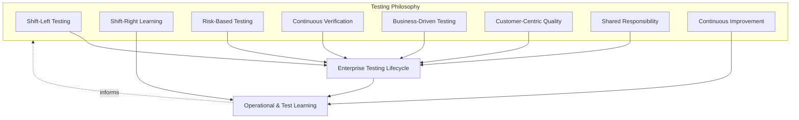
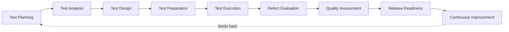
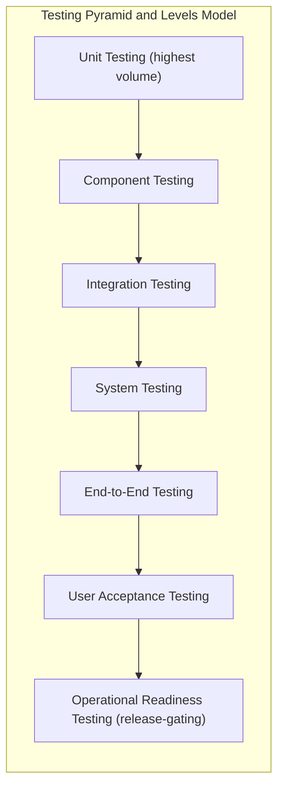
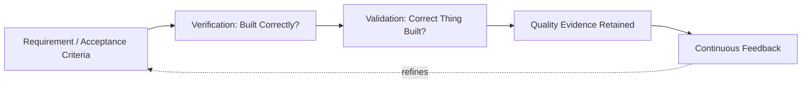
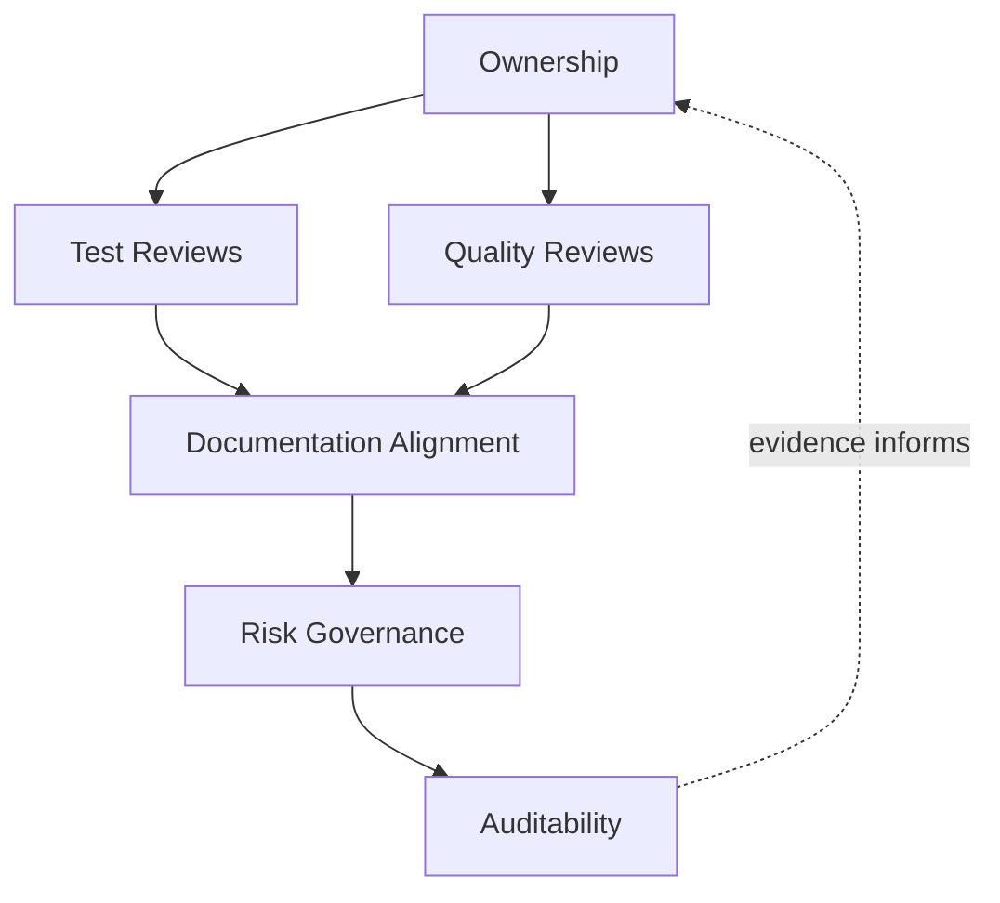
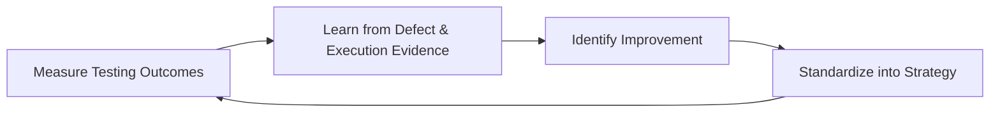

# Enterprise Testing Strategy

## 1. Document Purpose

This document defines the official Enterprise Testing Strategy for **StackLeo Tech Store**. It establishes testing philosophy, the testing lifecycle, testing levels, testing types, verification and validation practice, and testing governance that apply across the entire platform — independent of any specific team, tool, or delivery method.

- **Purpose of Enterprise Testing** — testing exists to produce objective, evidence-based confidence that the platform is fit for its customers, its business risk, and its long-term evolution; it is the primary mechanism by which the quality expectations defined in this folder are actually verified, rather than assumed.
- **Relationship with Quality Strategy** — this document is the testing-specific elaboration of `quality-strategy.md`; where that document defines *what quality means* across nine lifecycle stages and ten domains, this document defines *how testing verifies it* in practice. Every testing level (Section 4) and type (Section 5) exists to serve one or more quality domains defined in `quality-strategy.md` (Section 4).
- **Relationship with Software Engineering** — testing is inseparable from how software is designed and built; this strategy assumes the engineering discipline defined in `03_System_Design/architecture-principles.md` and treats testability as a structural property engineering is responsible for enabling, not a constraint imposed on it afterward.
- **Relationship with DevOps** — this strategy assumes the delivery cadence and automation-first culture of `07_DevOps/devops-principles.md`; testing stages described here are conceptually anchored to the pipeline gates in `07_DevOps/ci-cd-strategy.md`, without prescribing specific automation tooling.
- **Relationship with DevSecOps** — Security Testing (Section 5.6) is governed jointly with `07_DevOps/devsecops-strategy.md`; this strategy treats security verification as an integral testing type, embedded across the lifecycle, rather than a separate track run in isolation.
- **Relationship with Business Risk Management** — testing effort and depth are allocated in proportion to genuine business risk (Section 2.3), connecting engineering-level test decisions directly to the risk-based approach defined in `quality-strategy.md` (Section 5.2) and `06_Security/security-principles.md`.

This document is implementation-independent and vendor-neutral. It defines testing philosophy, lifecycle, levels, types, and governance — not specific testing tools, automation frameworks, browsers, cloud testing providers, programming languages, infrastructure configuration, or code.

## 2. Testing Philosophy

Testing at StackLeo is governed by eight principles. Each exists to produce a specific business outcome — testing is pursued because of the confidence and risk reduction it delivers, not as a procedural formality.

### 2.1 Shift-Left Testing

Testing consideration begins as early in the lifecycle as possible — during requirements and design — rather than being deferred until a capability is fully built.

- **Business Value** — a defect caught during test design or code review costs a fraction of one caught after release; shifting left protects both delivery speed and release confidence at the same time.

### 2.2 Shift-Right Learning

Testing understanding continues to grow after release, through disciplined observation of real production behavior, feeding insights back into future test design.

- **Business Value** — recognizes that some conditions (real traffic patterns, real customer behavior, real device diversity) can only be observed in production, and captures that evidence deliberately rather than losing it.

### 2.3 Risk-Based Testing

Testing depth and priority are proportionate to genuine business, customer, and financial risk — critical-path commerce capability (checkout, payments, orders) warrants materially deeper testing than low-risk, peripheral capability.

- **Business Value** — directs finite testing effort where a defect would cause the greatest harm, rather than spreading effort evenly regardless of consequence.

### 2.4 Continuous Verification

Testing happens continuously and incrementally across the lifecycle, not solely as a single, high-stakes activity immediately before release.

- **Business Value** — keeps Release Readiness (Section 3.8) a routine confirmation backed by accumulated evidence, rather than a last-minute discovery process.

### 2.5 Business-Driven Testing

Test priorities and coverage decisions trace directly to business objectives and customer value, defined in `01_Business` and `02_Product`, rather than to what is simplest or most convenient to test.

- **Business Value** — ensures testing effort protects what the business actually depends on, not merely what happens to be easiest to verify.

### 2.6 Customer-Centric Quality

Test scenarios are grounded in genuine customer behavior and expectation, consistent with `02_Product/user-personas.md` and `02_Product/user-journeys.md`, not only in internal technical assumptions.

- **Business Value** — reduces the risk of a capability passing every internal test while still failing the real customer it was built for.

### 2.7 Shared Responsibility

Testing is a responsibility shared across Engineering, QA, Product, Design, Security, and Operations; no single function is solely accountable for catching every defect.

- **Business Value** — prevents the anti-pattern in Section 10.2, where quality erodes because every other function assumes testing is someone else's job.

### 2.8 Continuous Improvement

Testing practice itself is expected to mature over time, informed by real defect trends, production evidence, and retrospective learning.

- **Business Value** — keeps testing effectiveness compounding as the platform grows in scale and complexity, rather than remaining fixed at its initial level of maturity.

*Diagram 1: Testing Philosophy Overview — the eight principles shape the lifecycle, and learning from execution and production feeds back into the philosophy itself.*

## 3. Enterprise Testing Lifecycle

Testing is governed across nine conceptual stages, spanning from initial planning through release and continuous improvement. Each stage exists independently of any specific tool or delivery method.

### 3.1 Test Planning

- **Purpose** — determine the testing approach, scope, and priorities for a capability before analysis begins, in proportion to its risk (Section 2.3).
- **Business Value** — ensures testing effort is deliberately planned and resourced, rather than assembled ad hoc once development is already underway.
- **Governance Objectives** — confirm every significant capability has an explicit, documented test approach before test analysis begins.

### 3.2 Test Analysis

- **Purpose** — examine requirements, acceptance criteria, and design to identify what must be tested and the conditions under which it must be verified.
- **Business Value** — surfaces ambiguous or untestable requirements early, before they become expensive misunderstandings later in delivery.
- **Governance Objectives** — ensure every testable condition traces to a requirement in `02_Product/functional-requirements.md`, `02_Product/non-functional-requirements.md`, or `02_Product/acceptance-criteria.md`.

### 3.3 Test Design

- **Purpose** — translate analyzed conditions into structured test scenarios and expected outcomes.
- **Business Value** — converts abstract requirements into concrete, repeatable verification logic that can be consistently and objectively executed.
- **Governance Objectives** — ensure test design coverage is reviewed against risk priority (Section 2.3) before proceeding to preparation.

### 3.4 Test Preparation

- **Purpose** — assemble the conditions, data, and environment context necessary for designed tests to be executed reliably.
- **Business Value** — reduces false results caused by inadequate preparation, protecting the credibility of subsequent execution.
- **Governance Objectives** — ensure preparation is verified complete before execution begins, so execution capacity is not consumed by preparation failures.

### 3.5 Test Execution

- **Purpose** — carry out designed tests and record their actual outcomes against expected outcomes.
- **Business Value** — produces the direct evidence that a capability does, or does not, meet its defined requirements.
- **Governance Objectives** — ensure execution results are recorded consistently and are traceable back to the requirement and risk they verify.

### 3.6 Defect Evaluation

- **Purpose** — assess discovered defects for severity, business impact, and priority, and determine appropriate resolution action.
- **Business Value** — ensures defect response is proportionate to actual business risk, rather than uniform regardless of consequence.
- **Governance Objectives** — ensure every defect is triaged against consistent, documented criteria and tracked to resolution or an explicit, accountable risk decision.

### 3.7 Quality Assessment

- **Purpose** — evaluate the overall testing coverage and outcome for a capability against its defined quality expectations.
- **Business Value** — gives Product and Engineering leadership an honest, evidence-based view of whether a capability is genuinely ready to proceed.
- **Governance Objectives** — ensure assessment findings are documented and connected to `quality-strategy.md` (Section 3.8) for platform-wide quality visibility.

### 3.8 Release Readiness

- **Purpose** — confirm, using accumulated testing evidence, that a capability is genuinely ready to be exposed to customers.
- **Business Value** — converts release into a routine, evidence-based decision rather than a high-anxiety event, consistent with `quality-strategy.md` (Section 3.5).
- **Governance Objectives** — ensure readiness criteria are applied consistently and are never silently bypassed under schedule pressure.

### 3.9 Continuous Improvement

- **Purpose** — act on defect trends, execution outcomes, and production learning to deliberately improve testing practice.
- **Business Value** — ensures testing effectiveness compounds over time rather than remaining static as the platform and business evolve.
- **Governance Objectives** — ensure improvement actions arising from testing retrospectives are tracked to completion, not only identified.

### Enterprise Testing Lifecycle Matrix

| Stage | Purpose | Business Value | Governance Objective |
|---|---|---|---|
| Test Planning | Determine approach, scope, and priority before analysis | Testing effort is deliberately planned, not ad hoc | Every significant capability has a documented test approach |
| Test Analysis | Identify what must be tested and under what conditions | Surfaces ambiguous requirements early | Every testable condition traces to a documented requirement |
| Test Design | Translate conditions into structured scenarios | Converts requirements into repeatable verification logic | Coverage reviewed against risk priority before preparation |
| Test Preparation | Assemble conditions, data, and context for execution | Reduces false results from inadequate preparation | Preparation verified complete before execution begins |
| Test Execution | Carry out tests and record actual vs. expected outcomes | Produces direct evidence of requirement conformance | Results recorded consistently and traceable to requirement/risk |
| Defect Evaluation | Assess severity, impact, and priority of defects | Defect response proportionate to actual business risk | Every defect triaged against consistent criteria and tracked to closure |
| Quality Assessment | Evaluate overall coverage and outcome against expectations | Honest, evidence-based readiness visibility | Findings connected to platform-wide quality assessment |
| Release Readiness | Confirm genuine readiness using accumulated evidence | Release becomes routine, not high-risk | Readiness criteria applied consistently, never silently bypassed |
| Continuous Improvement | Act on trends and learning to improve testing practice | Testing effectiveness compounds over time | Improvement actions tracked to completion |

*Diagram 2: Enterprise Testing Lifecycle — a continuous cycle in which release and improvement evidence directly informs the next iteration of planning.*

## 4. Testing Levels

Testing is organized across seven conceptual levels, each verifying a distinct scope of the platform. Together they form a layered model in which lower levels verify smaller, more numerous units and higher levels verify broader, more customer-representative behavior.

### 4.1 Unit Testing

- **Purpose** — verify the smallest independently testable piece of logic behaves correctly in isolation.
- **Scope** — a single function, method, or logic unit, isolated from its dependencies.
- **Governance Expectations** — treated as a baseline engineering responsibility integral to Test Engineering practice, not an optional or deferred activity.
- **Business Importance** — catches defects at their cheapest possible point of discovery, before they can propagate into larger, harder-to-diagnose failures.

### 4.2 Component Testing

- **Purpose** — verify a cohesive unit of functionality behaves correctly as a whole, including its internal collaboration between units.
- **Scope** — a bounded module or capability (e.g., a pricing calculation component), still isolated from external systems.
- **Governance Expectations** — expected for every component with non-trivial internal logic or business rule complexity.
- **Business Importance** — confirms business rules are correctly implemented before they are exposed to broader integration.

### 4.3 Integration Testing

- **Purpose** — verify that components interact correctly across their defined interfaces.
- **Scope** — interactions between internal bounded contexts (per `03_System_Design/bounded-contexts.md`) and between the platform and external integrations (payment, courier, communication providers).
- **Governance Expectations** — required for every interface crossing a bounded context or external integration boundary.
- **Business Importance** — protects against the class of defect that unit and component testing structurally cannot catch — incorrect assumptions at a boundary.

### 4.4 System Testing

- **Purpose** — verify the platform behaves correctly as a complete, integrated whole.
- **Scope** — end-to-end platform behavior across all integrated components, evaluated against `02_Product/functional-requirements.md` and `02_Product/non-functional-requirements.md`.
- **Governance Expectations** — required before a release candidate proceeds to acceptance-level testing.
- **Business Importance** — the first level at which the platform is verified as customers will actually experience it.

### 4.5 End-to-End Testing

- **Purpose** — verify complete business workflows spanning multiple capabilities, from a customer or business actor's perspective.
- **Scope** — full journeys such as browse → cart → checkout → payment → order → fulfillment, per `02_Product/business-workflows.md`.
- **Governance Expectations** — prioritized by business criticality (Section 2.3); the full purchase journey receives the highest priority.
- **Business Importance** — verifies the workflows that most directly generate revenue and define the customer's experience of the brand.

### 4.6 User Acceptance Testing (UAT)

- **Purpose** — confirm, from the perspective of business and customer stakeholders, that delivered capability genuinely satisfies its intended purpose.
- **Scope** — business-representative scenarios evaluated against the acceptance criteria defined in `02_Product/acceptance-criteria.md` (Section 7).
- **Governance Expectations** — required sign-off from accountable business stakeholders before a capability is considered Done, per the Definition of Done in `02_Product/acceptance-criteria.md` (Section 6).
- **Business Importance** — the level at which "technically correct" and "genuinely fit for business purpose" are confirmed to be the same thing.

### 4.7 Operational Readiness Testing

- **Purpose** — confirm the platform is genuinely ready to be operated, supported, and monitored once live.
- **Scope** — operational concerns such as diagnosability, alerting, recovery procedures, and support handoff, consistent with `07_DevOps/operational-readiness.md`.
- **Governance Expectations** — required as a gating condition of Release Readiness (Section 3.8) for any capability with production operational impact.
- **Business Importance** — determines whether the business can actually sustain and recover the capability once real customers depend on it.

### Testing Level Matrix

| Level | Purpose | Governance Expectations | Business Importance |
|---|---|---|---|
| Unit Testing | Verify smallest logic unit in isolation | Baseline engineering responsibility | Cheapest possible point of defect discovery |
| Component Testing | Verify a cohesive functionality unit as a whole | Expected for non-trivial business logic | Confirms business rules before broader integration |
| Integration Testing | Verify correct interaction across interfaces | Required at every bounded-context/external boundary | Catches boundary-assumption defects other levels cannot |
| System Testing | Verify the platform as a complete integrated whole | Required before acceptance-level testing | First level verifying the platform as customers experience it |
| End-to-End Testing | Verify complete cross-capability business workflows | Prioritized by business criticality | Verifies the workflows that most directly generate revenue |
| User Acceptance Testing | Confirm genuine fitness for business purpose | Requires accountable business stakeholder sign-off | Confirms "correct" and "fit for purpose" are the same thing |
| Operational Readiness Testing | Confirm readiness to operate, support, and monitor | Gating condition of Release Readiness | Determines sustainability once customers depend on it |

*Diagram 3: Testing Pyramid & Levels Model — volume and execution frequency decrease from Unit Testing upward, while customer and business representativeness increase, culminating in Operational Readiness Testing as a release gate.*

## 5. Testing Types

Testing types are conceptually distinct from testing levels (Section 4): a type describes *what quality concern* is being verified, while a level describes *at what scope*. Any given type may be applied at multiple levels, in proportion to risk.

### 5.1 Functional Testing

- **Purpose** — verify the platform behaves according to its specified business logic and functional requirements.
- **Scope** — applied across all testing levels, tracing to `02_Product/functional-requirements.md`.
- **Business Value** — protects the most directly customer-visible and revenue-affecting form of correctness.
- **Governance Expectations** — required for every functional requirement without exception.

### 5.2 Regression Testing

- **Purpose** — confirm that previously verified behavior remains correct after a change elsewhere in the platform.
- **Scope** — re-verification of prior functionality affected, directly or indirectly, by new changes.
- **Business Value** — protects existing customer trust and revenue-generating capability from being silently broken by unrelated work.
- **Governance Expectations** — scoped by change impact and risk (Section 2.3), not applied uniformly regardless of what changed.

### 5.3 Smoke Testing

- **Purpose** — confirm that the platform's most critical functions are minimally operational after a build or deployment.
- **Scope** — a narrow set of the highest-criticality workflows (e.g., can a customer reach the homepage and complete a basic checkout).
- **Business Value** — provides the fastest possible signal that a build is fundamentally unsafe to proceed with further testing.
- **Governance Expectations** — required as the first gate immediately following any build or deployment event.

### 5.4 Sanity Testing

- **Purpose** — confirm that a specific, narrow change or fix behaves as intended before committing to broader verification.
- **Scope** — the specific area directly affected by a recent change.
- **Business Value** — avoids investing broader testing effort in a change that has an obvious, immediate defect.
- **Governance Expectations** — applied following targeted fixes, prior to full regression scope.

### 5.5 Performance Testing

- **Purpose** — verify the platform responds predictably and within acceptable bounds under expected and peak conditions.
- **Scope** — critical-path customer journeys and backend processing, consistent with `03_System_Design/quality-attributes.md` (Section 3) and `quality-strategy.md` (Section 4.3).
- **Business Value** — protects conversion and customer trust, both of which are highly sensitive to responsiveness.
- **Governance Expectations** — required before release for any capability affecting the critical path or expected to face significant load.

### 5.6 Security Testing

- **Purpose** — verify the platform correctly protects the confidentiality, integrity, and availability of customer and business data.
- **Scope** — governed jointly with `06_Security/security-principles.md` and `07_DevOps/devsecops-strategy.md`; applied across identity, application, data, and operational security concerns.
- **Business Value** — protects StackLeo's core brand differentiator — trust — per `01_Business/vision.md`.
- **Governance Expectations** — verified with the same mandatory, non-negotiable rigor as functional correctness, never treated as optional or best-effort.

### 5.7 Accessibility Testing

- **Purpose** — verify the platform is usable by customers regardless of ability.
- **Scope** — all customer-facing experiences, evaluated against the WCAG-aligned expectation in `02_Product/non-functional-requirements.md`.
- **Business Value** — expands StackLeo's addressable market and reflects the inclusive service standard implied by the brand vision.
- **Governance Expectations** — release-blocking for customer-facing capability, not a discretionary enhancement.

### 5.8 Compatibility Testing

- **Purpose** — verify the platform functions correctly across the range of devices, browsers, and channels customers actually use.
- **Scope** — current web channel and future mobile app, physical store, and POS channels.
- **Business Value** — Bangladesh's diverse device and network landscape makes compatibility a direct determinant of reachable market size.
- **Governance Expectations** — coverage decisions made deliberately against real customer device and channel data, not assumed.

### 5.9 Reliability Testing

- **Purpose** — verify the platform behaves consistently and correctly over sustained use and realistic operating conditions.
- **Scope** — long-running behavior, data consistency, and consistent outcome across repeated execution of critical transactions.
- **Business Value** — underpins customer confidence that an order, once placed, will be honored correctly every time.
- **Governance Expectations** — required for every capability classified as critical-path per risk-based prioritization (Section 2.3).

### 5.10 Recovery Testing

- **Purpose** — verify the platform recovers correctly and predictably after a failure or disruption.
- **Scope** — failure and restoration behavior of critical-path capability, consistent with `07_DevOps/disaster-recovery.md`.
- **Business Value** — determines how quickly the business can restore customer trust after an adverse event.
- **Governance Expectations** — required for every capability with a defined recovery expectation in `02_Product/non-functional-requirements.md`.

### Testing Type Matrix

| Type | Purpose | Business Value | Governance Expectations |
|---|---|---|---|
| Functional Testing | Verify specified business logic behaves correctly | Protects the most customer-visible correctness | Required for every functional requirement |
| Regression Testing | Confirm prior behavior still holds after change | Protects existing capability from silent breakage | Scoped by change impact and risk |
| Smoke Testing | Confirm critical functions are minimally operational | Fastest signal a build is unsafe to proceed with | First gate after any build or deployment |
| Sanity Testing | Confirm a narrow fix behaves as intended | Avoids wasted broader effort on an obviously broken fix | Applied before full regression scope |
| Performance Testing | Verify predictable response under load | Protects conversion and customer trust | Required for critical-path or high-load capability |
| Security Testing | Verify protection of confidentiality, integrity, availability | Protects StackLeo's core trust differentiator | Mandatory, non-negotiable rigor |
| Accessibility Testing | Verify usability regardless of ability | Expands addressable market, reflects brand values | Release-blocking for customer-facing capability |
| Compatibility Testing | Verify correct function across devices/channels | Direct determinant of reachable market size | Coverage decided against real usage data |
| Reliability Testing | Verify consistent behavior over sustained use | Underpins confidence orders are honored every time | Required for critical-path capability |
| Recovery Testing | Verify correct recovery after failure | Determines speed of trust restoration post-incident | Required wherever a recovery expectation is defined |

## 6. Verification & Validation Strategy

- **Verification Principles** — verification asks "was the capability built correctly against its specification?" It is evidence-based, objective, and conducted throughout the lifecycle (Section 3), not only at its end.
- **Validation Principles** — validation asks "was the correct capability built for the customer's real need?" It is grounded in genuine business and customer context (Section 2.6), and is not satisfied merely because verification passed.
- **Acceptance Criteria Awareness** — verification and validation both depend on unambiguous, testable acceptance criteria; where `02_Product/acceptance-criteria.md` is incomplete or unclear for a capability, testing must escalate the gap rather than infer intent.
- **Risk-Based Coverage** — the depth of both verification and validation is proportionate to business risk (Section 2.3); critical-path capability warrants both rigorous verification and deliberate validation with real business stakeholders.
- **Quality Evidence** — every verification and validation activity produces retained, traceable evidence, supporting the auditability expectation in Section 7.6.
- **Continuous Feedback** — verification and validation outcomes flow continuously back into Test Planning (Section 3.1) and Quality Assessment (Section 3.7), rather than being treated as terminal, one-time judgments.

### Verification vs Validation Matrix

| Aspect | Verification | Validation |
|---|---|---|
| Guiding Question | "Was it built correctly?" | "Was the correct thing built?" |
| Reference Point | Specification, design, requirement | Genuine customer and business need |
| Primary Levels | Unit, Component, Integration, System (Sections 4.1–4.4) | End-to-End, UAT (Sections 4.5–4.6) |
| Evidence Produced | Conformance to defined requirement | Confirmation of real-world fitness for purpose |
| Owning Perspective | Engineering and QA | Product, Business, and Customer stakeholders |
| Failure Mode if Skipped | Defects reach later stages undetected | Technically correct capability fails to serve its purpose |

*Diagram 4: Verification vs Validation Flow — verification and validation are sequential but distinct checks, both producing evidence that feeds continuously back into requirements refinement.*

## 7. Testing Governance

### 7.1 Ownership

Every testing level (Section 4) and testing type (Section 5) has a single accountable owner; testing governance overall is owned jointly by Engineering and QA leadership, consistent with Shared Responsibility (Section 2.7).

### 7.2 Test Reviews

Test plans, test designs, and test coverage are formally reviewed against risk priority (Section 2.3) before execution begins, ensuring coverage decisions are deliberate rather than incidental.

### 7.3 Quality Reviews

Testing outcomes are reviewed against the quality domains and expectations defined in `quality-strategy.md` (Section 4), ensuring testing evidence is interpreted in the context of overall platform quality, not in isolation.

### 7.4 Documentation Alignment

Testing documentation is kept consistent with `02_Product/acceptance-criteria.md`, `03_System_Design`, `06_Security`, and `07_DevOps`; a test that contradicts current requirements or architecture documentation is treated as a governance gap, not a valid result.

### 7.5 Risk Governance

Testing-related risk — untested paths, accepted defects, deferred coverage — is tracked, prioritized, and escalated consistently, ensuring accepted risk is always a deliberate, accountable decision rather than an unexamined gap.

### 7.6 Auditability

Test plans, execution results, defect evaluations, and release readiness confirmations are retained in a form that can be independently reviewed after the fact, supporting both internal governance and the compliance posture referenced in `06_Security/compliance.md`.

### Testing Governance Matrix

| Governance Area | Objective |
|---|---|
| Ownership | Every level and type has one accountable owner |
| Test Reviews | Coverage decisions are deliberate, reviewed against risk |
| Quality Reviews | Testing evidence interpreted in context of overall platform quality |
| Documentation Alignment | Testing stays consistent with requirements, architecture, and security documentation |
| Risk Governance | Accepted testing risk is always a deliberate, accountable decision |
| Auditability | Testing evidence retained for independent review |

### Governance Responsibility Matrix

| Role | Responsibility |
|---|---|
| Head of Quality / QA Leadership | Owns coherence and enforcement of this testing strategy, in partnership with Engineering leadership. |
| Engineering Leads | Ensure unit, component, and integration testing (Sections 4.1–4.3) are applied consistently within their domain. |
| QA / Test Architects | Own test analysis, design, and execution governance (Sections 3.2–3.5) across system and end-to-end levels. |
| Product Owners | Ensure acceptance criteria are complete and accountable for UAT sign-off (Section 4.6). |
| Security Lead | Ensures Security Testing (Section 5.6) reflects `06_Security/security-principles.md` and `07_DevOps/devsecops-strategy.md`. |
| Operations Lead | Ensures Operational Readiness Testing (Section 4.7) genuinely reflects production support capability. |
| Internal Audit / Review Function | Independently verifies that testing evidence and governance records reflect actual practice. |

*Diagram 5: Enterprise Testing Governance Framework — ownership anchors review activity, which feeds documentation alignment, risk governance, and ultimately auditable evidence.*

## 8. Future Readiness

This strategy is designed to remain valid as StackLeo evolves in scale and architectural complexity, without requiring redefinition of its underlying philosophy.

- **Cloud-Native Platforms** — testing levels (Section 4) and types (Section 5) are defined independently of any specific runtime or deployment model, so they apply unchanged as infrastructure evolves, consistent with `03_System_Design/deployment-architecture.md`.
- **Microservices** — as the platform decomposes into further bounded services per `03_System_Design/service-architecture.md`, Integration Testing (Section 4.3) grows in relative importance, and testing governance (Section 7) extends naturally to service-level ownership without requiring a new governance model.
- **AI Systems** — as AI-assisted capability (recommendations, search relevance, fraud detection) is introduced, Functional and Reliability Testing (Sections 5.1, 5.9) extend to cover behavioral consistency and drift, consistent with `quality-strategy.md` (Section 7).
- **Marketplace Platform** — the multi-vendor marketplace model extends existing testing levels and types to cover seller-supplied content and listings, requiring the same acceptance rigor (Section 4.6) applied to StackLeo's own catalog today.
- **Multi-Tenant Architecture** — where future architecture introduces tenant isolation (e.g., for marketplace sellers or B2B customers), Integration and Security Testing (Sections 4.3, 5.6) extend to explicitly verify cross-tenant isolation.
- **Multi-Region Operations** — as StackLeo expands from Bangladesh into South Asia and beyond, Compatibility and Performance Testing (Sections 5.8, 5.5) extend to cover regional network conditions, localization, and data residency expectations.
- **Global Engineering Teams** — the lifecycle, levels, types, and governance defined in Sections 3–7 are defined independently of team size, location, or organizational structure, so they remain coherent as engineering scales beyond a single, co-located team.

## 9. Governance

- **Ownership** — the Head of Quality (or equivalent accountable executive function) owns this strategy and is accountable for its consistent application across the platform, in partnership with Engineering and Product leadership.
- **Review Process** — this strategy is formally reviewed whenever a material change occurs in business model (`01_Business/business-model.md`), architecture (`03_System_Design`), or delivery practice (`07_DevOps`), and on a regular recurring cadence independent of specific change events.
- **Testing Policies** — subordinate, practice-specific testing documents (test case standards, defect management, test metrics, and further documents within `08_Quality_Assurance`) must remain consistent with the philosophy, lifecycle, levels, and types defined here.
- **Audit Readiness** — this strategy and the evidence it requires (Section 7.6) are maintained in a state ready for internal or external audit at any time, without requiring advance preparation.
- **Continuous Improvement** — this strategy itself is subject to Continuous Improvement (Section 3.9); its effectiveness is periodically assessed and revised based on genuine defect trends, execution outcomes, and organizational evidence.

*Diagram 6: Continuous Testing Improvement Cycle — testing outcomes are measured, learned from, improved upon, and standardized back into this strategy, on a continuing basis.*

## 10. Anti-Patterns

The following recurring failure patterns are explicitly recognized and avoided, as each one structurally undermines this strategy.

| Anti-Pattern | Why It's Avoided |
|---|---|
| Testing Only Before Release | Contradicts Shift-Left Testing (Section 2.1) and Continuous Verification (Section 2.4); defects found immediately before release are the most expensive and highest-risk to fix. |
| Weak Test Planning | Undermines Test Planning (Section 3.1); without deliberate planning, testing effort is assembled reactively and inconsistently applied across similar-risk capability. |
| Poor Risk Prioritization | Contradicts Risk-Based Testing (Section 2.3); effort spread evenly regardless of risk leaves critical-path capability under-tested while low-risk capability is over-tested. |
| Inadequate Test Coverage | Leaves genuine defects undiscovered until production, undermining the evidence-based confidence this strategy exists to provide. |
| Weak Acceptance Criteria | Undermines Acceptance Criteria Awareness (Section 6); without clear, testable criteria, "done" becomes a subjective judgment rather than a verifiable outcome. |
| Reactive Testing | Contradicts Continuous Verification (Section 2.4); waiting for problems to surface in production is the costliest and least controlled way to discover a defect. |
| Poor Documentation | Undermines Documentation Alignment (Section 7.4) and Auditability (Section 7.6), leaving testing evidence unclear or unverifiable after the fact. |
| No Continuous Improvement | Contradicts Section 2.8 and Section 3.9; without deliberate improvement, testing practice stagnates while the business and platform continue to grow in complexity. |

## 11. Document Information

| Property | Value |
|----------|-------|
| Document | testing-strategy.md |
| Version | 1.0.0 |
| Status | Active |
| Maintained By | StackLeo |
| Last Updated | 2026-07-24 |

---

© StackLeo. All Rights Reserved.
