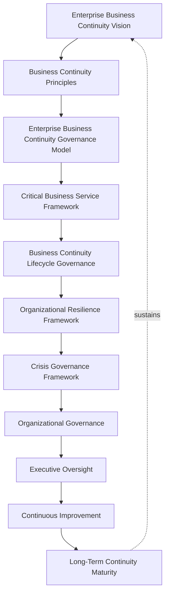
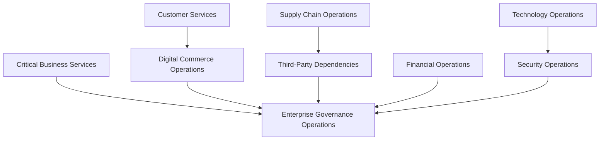
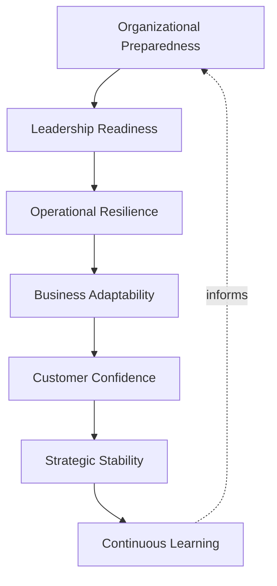
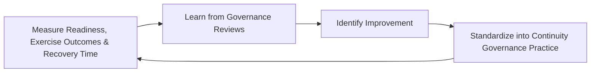
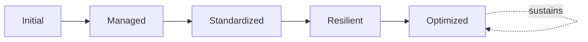

# Enterprise Business Continuity Framework

## 1. Executive Summary

**Purpose** — This document defines the official Enterprise Business Continuity Framework for **StackLeo Tech Store**. It establishes business continuity governance, operational resilience, critical business service governance, crisis management principles, organizational accountability, executive oversight, continuous improvement, and long-term continuity maturity as a single, consolidated governance reference. `business-continuity-governance.md` remains the CRO/COO/CISO-owned executive charter for business continuity at StackLeo, and `business-continuity.md` remains the operational governance framework elaborating continuity lifecycle, domains, and crisis governance in full depth. This framework does not compete with either for authority. It is the consolidated governance reference that synthesizes critical service identification, organizational resilience, crisis governance, and executive oversight across the whole continuity discipline into one coherent document.

**Scope** — This framework applies to every category of continuity risk at StackLeo — critical business services, customer services, digital commerce operations, supply chain, financial, technology, and security operations, and third-party dependencies — coordinated with `business-continuity-governance.md`, `business-continuity.md`, `operations-strategy.md`, `incident-management-framework.md`, and `service-management-framework.md`.

**Strategic Objectives** — To ensure StackLeo can genuinely continue serving customers and operating the business through disruption, and recover deliberately and completely afterward; that every critical business service is identified and its dependencies genuinely understood; that a crisis is led with genuine executive accountability, not improvised leadership; and that executive leadership and the Board have continuous, honest confidence in the organization's ability to withstand disruption.

**Business Value** — A consolidated business continuity framework protects the organization from the risk of resilience gaps hiding in the seams between separately-maintained continuity documents, protects customer trust through the organization's demonstrable ability to keep serving them through disruption, and gives executive leadership the confidence to pursue growth without unknowingly accepting unmanaged continuity risk.

**Intended Audience** — The Board of Directors, executive leadership, the Chief Technology Officer, operations leadership, business continuity leadership, engineering leadership, security leadership, customer support leadership, and business stakeholders.

## 2. Enterprise Business Continuity Vision

- **Business Continuity as Strategic Capability** — continuity is governed as a genuine strategic capability, never merely a defensive, background contingency.
- **Organizational Resilience** — continuity protects the organization's genuine capacity to withstand and adapt to disruption.
- **Customer Trust Protection** — continuity protects the trust customers place in StackLeo to remain available when they need it.
- **Sustainable Business Operations** — continuity protects the organization's ability to sustain genuine business operation over the long term.
- **Critical Service Reliability** — continuity is anchored in the genuine reliability of the services the business most depends on.
- **Business Stability** — continuity protects the organization's overall stability through periods of genuine disruption.
- **Long-Term Operational Excellence** — continuity is pursued as a durable discipline of genuine excellence, never a one-time planning exercise.

*Diagram 1: Enterprise Business Continuity Framework — the continuity vision establishes principles and the governance model, flowing through critical service identification, lifecycle governance, organizational resilience, and crisis governance into organizational governance and executive oversight, with continuous improvement driving long-term maturity that reinforces the vision itself.*

### Enterprise Business Continuity Vision Matrix

| Vision Element | Focus | Business Value |
|---|---|---|
| Business Continuity as Strategic Capability | A genuine strategic capability, not background contingency | Prevents continuity from being treated as a low-priority afterthought |
| Organizational Resilience | Genuine capacity to withstand and adapt to disruption | Protects the organization's ability to operate through adversity |
| Customer Trust Protection | Trust that StackLeo remains available when needed | Protects the trust relationship every interaction depends on |
| Sustainable Business Operations | The ability to sustain operation over the long term | Protects revenue and commitments tied to continuous service |
| Critical Service Reliability | Anchored in the genuine reliability of critical services | Directs continuity investment toward what genuinely matters most |
| Business Stability | Protects overall stability through genuine disruption | Sustains confidence among customers, partners, and investors |
| Long-Term Operational Excellence | A durable discipline, not a one-time planning exercise | Protects continuity investment from eroding over time |

## 3. Business Continuity Principles

Business continuity governance at StackLeo rests on nine principles, each producing a specific business outcome.

- **Business-First Decision Making** — continuity decisions are weighed first against their genuine effect on the business's ability to continue operating. *Business Value:* keeps continuity governance connected to the organization's most fundamental obligation.
- **Critical Service Protection** — the organization's most critical services receive proportionately elevated continuity investment. *Business Value:* directs limited continuity resource toward what genuinely matters most.
- **Organizational Resilience** — continuity assumes some disruption will occur and invests in the organization's capacity to absorb and recover from it. *Business Value:* accepts that perfect prevention is unrealistic and prepares for genuine recovery instead.
- **Accountability** — every continuity domain traces to a specific, named, responsible owner. *Business Value:* ensures no domain drifts without someone genuinely responsible for it.
- **Preparedness Culture** — the organization genuinely rehearses and internalizes its continuity practice, not merely documents it. *Business Value:* ensures continuity plans function when genuinely needed, not only on paper.
- **Risk Awareness** — continuity decisions are made with genuine, explicit awareness of the disruption risk they address. *Business Value:* prevents continuity investment from being spent without connection to genuine exposure.
- **Continuous Improvement** — continuity practice matures over time, informed by real disruption and exercise outcomes. *Business Value:* keeps continuity aligned with the organization's growing scale and complexity.
- **Executive Leadership** — continuity's most consequential decisions are made or ratified at the executive level. *Business Value:* ensures the organization's most consequential continuity decisions carry commensurate scrutiny.
- **Stakeholder Confidence** — continuity practice is governed to give customers, partners, and regulators genuine confidence in StackLeo's resilience. *Business Value:* protects the organization's standing with every stakeholder who depends on its continued operation.

### Business Continuity Principles Matrix

| Principle | Description | Business Value |
|---|---|---|
| Business-First Decision Making | Weighed first against effect on continued operation | Keeps governance connected to the fundamental obligation |
| Critical Service Protection | Elevated investment for the most critical services | Directs limited resource toward what genuinely matters most |
| Organizational Resilience | Invests in capacity to absorb and recover from disruption | Accepts imperfect prevention and prepares for genuine recovery |
| Accountability | Every domain traces to a specific, responsible owner | Ensures no domain drifts without genuine responsibility |
| Preparedness Culture | Genuinely rehearsed and internalized, not just documented | Ensures plans function when genuinely needed |
| Risk Awareness | Decisions made with explicit awareness of disruption risk | Prevents investment spent without connection to genuine exposure |
| Continuous Improvement | Practice matures from real disruption and exercise outcomes | Keeps continuity aligned with growing scale and complexity |
| Executive Leadership | Most consequential decisions made or ratified at the top | Ensures commensurate scrutiny for consequential decisions |
| Stakeholder Confidence | Governed to give genuine confidence in resilience | Protects standing with every stakeholder who depends on operation |

## 4. Enterprise Business Continuity Governance Model

Business continuity governance operates across nine conceptual domains, each holding accountability for a distinct category of continuity risk.

### Critical Business Services

- **Purpose** — govern continuity for the services whose disruption would carry the most severe genuine business consequence.
- **Governance Scope** — coordinated with the Critical Business Service Framework (Section 5).
- **Business Value** — protects the services the business's continued operation most directly depends on.
- **Executive Expectations** — leadership expects critical business services to be governed with the highest rigor in this model.

### Customer Services

- **Purpose** — govern continuity for services customers directly interact with and depend upon.
- **Governance Scope** — coordinated with `service-management-framework.md` (Customer Services).
- **Business Value** — protects the most direct point of customer encounter with StackLeo.
- **Executive Expectations** — leadership expects customer service continuity to be held to elevated rigor.

### Digital Commerce Operations

- **Purpose** — govern continuity for the platform's core commerce capability — catalog, cart, checkout, payment.
- **Governance Scope** — coordinated with `01_Business/business-model.md`.
- **Business Value** — protects the operations that directly generate StackLeo's revenue.
- **Executive Expectations** — leadership expects digital commerce continuity to be treated as the organization's highest commercial priority.

### Supply Chain Operations

- **Purpose** — govern continuity for the operations connecting StackLeo to inventory, fulfillment, and delivery.
- **Governance Scope** — coordinated with Third-Party Dependencies (below).
- **Business Value** — protects the physical fulfillment of the commitments customers rely on.
- **Executive Expectations** — leadership expects supply chain continuity to account for genuine external dependency.

### Financial Operations

- **Purpose** — govern continuity for the operations sustaining StackLeo's financial function.
- **Governance Scope** — coordinated with finance function accountability.
- **Business Value** — protects the organization's ability to sustain genuine financial operation through disruption.
- **Executive Expectations** — leadership expects financial operations continuity to be unimpeachably rigorous.

### Technology Operations

- **Purpose** — govern continuity for the technical platform underlying every other domain.
- **Governance Scope** — coordinated with `07_DevOps/reliability-engineering-framework.md` and `disaster-recovery.md`.
- **Business Value** — protects the technical foundation every other continuity domain ultimately depends on.
- **Executive Expectations** — leadership expects technology continuity to be governed with consistent rigor regardless of scale.

### Security Operations

- **Purpose** — govern continuity for security capability through a genuine disruption, jointly with, and never superseding, `security-strategy.md`.
- **Governance Scope** — oversight ensuring security operations continuity meets the rigor `06_Security/security-governance.md` requires.
- **Business Value** — protects StackLeo's core trust differentiator even through disruption.
- **Executive Expectations** — leadership expects security operations continuity to be treated as mandatory, non-negotiable.

### Third-Party Dependencies

- **Purpose** — govern continuity risk introduced through a dependency on a vendor or integration partner StackLeo does not directly control.
- **Governance Scope** — coordinated with `06_Security/third-party-risk-governance.md`.
- **Business Value** — protects the business from disruption it does not directly cause but remains responsible for managing.
- **Executive Expectations** — leadership expects third-party dependency continuity to be evaluated before onboarding, not only after a problem occurs.

### Enterprise Governance Operations

- **Purpose** — govern the synthesized, executive-relevant picture of continuity posture across every domain above.
- **Governance Scope** — oversight exclusively accountable for converging every domain into one coherent enterprise picture.
- **Business Value** — protects leadership's ability to understand overall continuity posture as a whole, not domain by domain.
- **Executive Expectations** — leadership expects one coherent continuity picture, not nine disconnected domain views.

### Business Continuity Governance Matrix

| Domain | Purpose | Business Value | Executive Expectations |
|---|---|---|---|
| Critical Business Services | Govern continuity for the most consequential services | Protects services operation most directly depends on | Expects the highest rigor in this model |
| Customer Services | Govern continuity for customer-facing services | Protects the most direct point of customer encounter | Expects elevated rigor |
| Digital Commerce Operations | Govern continuity for core commerce capability | Protects the operations directly generating revenue | Expects treatment as the highest commercial priority |
| Supply Chain Operations | Govern continuity for fulfillment and delivery | Protects the physical fulfillment of customer commitments | Expects accounting for genuine external dependency |
| Financial Operations | Govern continuity for the financial function | Protects the ability to sustain financial operation | Expects unimpeachable rigor |
| Technology Operations | Govern continuity for the technical platform | Protects the foundation every other domain depends on | Expects consistent rigor regardless of scale |
| Security Operations | Govern continuity for security capability | Protects StackLeo's core trust differentiator | Expects treatment as mandatory, non-negotiable |
| Third-Party Dependencies | Govern continuity risk from external dependencies | Protects against disruption StackLeo does not directly cause | Expects evaluation before onboarding |
| Enterprise Governance Operations | Synthesize the enterprise continuity picture | Protects leadership's ability to understand posture as a whole | Expects one coherent picture, not disconnected views |

*Diagram 2: Business Continuity Governance Model — critical business services, customer and digital commerce operations, supply chain and third-party dependencies, financial operations, and technology and security operations all converge on enterprise governance operations, which synthesizes every domain into one coherent enterprise picture.*

## 5. Critical Business Service Framework

- **Service Identification** — governs how a genuinely critical business service is recognized before it is formally designated.
- **Criticality Assessment** — governs how a service's genuine criticality is assessed against its business consequence if disrupted.
- **Business Prioritization** — governs how continuity investment is prioritized across identified critical services.
- **Service Ownership** — governs how every critical service traces to a specific, named, accountable owner.
- **Dependency Governance** — governs how a critical service's genuine dependencies — technical, operational, third-party — are identified and managed.
- **Executive Visibility** — governs how critical service status and posture are made visible to executive leadership.
- **Continuous Review** — governs the periodic, formal review of critical service designation and posture.

### Critical Business Service Matrix

| Discipline | Governance Objective | Business Value |
|---|---|---|
| Service Identification | Recognize a genuinely critical service before designation | Ensures designation reflects genuine business consequence |
| Criticality Assessment | Assess genuine consequence if a service is disrupted | Directs investment toward what genuinely matters most |
| Business Prioritization | Prioritize investment across identified critical services | Ensures limited continuity resource is spent deliberately |
| Service Ownership | Every critical service traces to a responsible owner | Ensures no critical service drifts without genuine responsibility |
| Dependency Governance | Identify and manage genuine technical and external dependencies | Prevents an unmapped dependency from becoming a blind spot |
| Executive Visibility | Make status and posture visible to leadership | Protects leadership's ability to understand critical exposure |
| Continuous Review | Periodically review designation and posture | Prevents a stale critical service list from misdirecting investment |

## 6. Business Continuity Lifecycle Governance

Business continuity governance operates across eight conceptual lifecycle stages.

- **Continuity Strategy** — govern how the organization determines its overall approach and priority toward continuity investment.
- **Business Impact Awareness** — govern how the genuine business consequence of a potential disruption is understood.
- **Continuity Planning** — govern how a deliberate plan to sustain or recover operation is developed for each critical domain.
- **Organizational Readiness** — govern the organization's genuine preparedness to execute continuity plans before disruption occurs.
- **Governance Reviews** — govern the periodic, formal review of continuity posture for genuine insight.
- **Capability Improvement** — govern how a genuine continuity gap is planned for deliberate remediation.
- **Executive Oversight** — govern the point at which continuity posture and decisions require executive-level visibility.
- **Continuous Evolution** — govern the periodic reassessment of whether continuity priorities remain aligned with evolving business need.

### Business Continuity Lifecycle Matrix

| Stage | Governance Objective | Business Value |
|---|---|---|
| Continuity Strategy | Determine overall approach and priority toward investment | Ensures continuity investment is deliberately directed |
| Business Impact Awareness | Understand genuine consequence of potential disruption | Ensures planning reflects real business stakes |
| Continuity Planning | Develop a deliberate plan for each critical domain | Converts understanding into concrete, actionable readiness |
| Organizational Readiness | Confirm genuine preparedness before disruption occurs | Prevents readiness gaps from being discovered during a crisis |
| Governance Reviews | Periodically review posture for genuine insight | Confirms continuity investment is genuinely working |
| Capability Improvement | Plan deliberate remediation of a genuine gap | Ensures gaps are addressed deliberately, not left to accumulate |
| Executive Oversight | Elevate posture and decisions requiring visibility | Engages leadership exactly when genuinely warranted |
| Continuous Evolution | Reassess alignment with evolving business need | Keeps continuity genuinely connected to business intent |

*Diagram 3: Business Continuity Lifecycle — continuity strategy and business impact awareness inform continuity planning and organizational readiness, feeding governance review and capability improvement, with executive oversight and continuous evolution feeding lessons back into the cycle.*

## 7. Organizational Resilience Framework

- **Operational Resilience** — governs the organization's genuine ability to withstand and continue operating through disruption.
- **Organizational Preparedness** — governs whether the organization has genuinely rehearsed its response before disruption occurs.
- **Leadership Readiness** — governs whether leadership is genuinely prepared to lead through a disruption, not merely aware of a plan.
- **Business Adaptability** — governs the organization's genuine capacity to adapt its operation under disrupted conditions.
- **Customer Confidence** — governs whether customers genuinely retain confidence in StackLeo through and after a disruption.
- **Continuous Learning** — governs how understanding gained from a real disruption deepens the organization's genuine collective capability.
- **Strategic Stability** — governs how organizational resilience protects the stability every strategic decision depends upon.

### Organizational Resilience Matrix

| Resilience Area | Focus | Governance Coordination |
|---|---|---|
| Operational Resilience | Genuine ability to withstand and continue operating | Business Continuity Lifecycle Governance (Section 6) |
| Organizational Preparedness | Genuinely rehearsed response before disruption occurs | Preparedness Culture (Section 3) |
| Leadership Readiness | Leadership genuinely prepared to lead through disruption | Crisis Governance Framework (Section 8) |
| Business Adaptability | Genuine capacity to adapt operation under disruption | Continuity Planning (Section 6) |
| Customer Confidence | Customers genuinely retaining confidence through disruption | Customer Trust Protection (Section 2) |
| Continuous Learning | Real disruption deepening genuine collective capability | Continuous Improvement (Section 3) |
| Strategic Stability | Resilience protecting the stability strategy depends on | Enterprise Governance Operations (Section 4) |

*Diagram 4: Organizational Resilience Structure — organizational preparedness and leadership readiness establish operational resilience and business adaptability, sustaining customer confidence and strategic stability, with continuous learning feeding lessons back into preparedness.*

## 8. Crisis Governance Framework

- **Crisis Leadership** — governs who genuinely leads the organization's response once disruption rises to a genuine crisis.
- **Decision Authority** — governs who genuinely holds the authority to make a consequential decision during a crisis.
- **Stakeholder Communication Governance** — governs how customers, partners, employees, and regulators are genuinely informed during a crisis.
- **Executive Accountability** — governs executive leadership's genuine accountability for the organization's crisis response.
- **Business Prioritization** — governs how business priorities are deliberately weighed and re-ordered during a crisis.
- **Strategic Coordination** — governs how the organization's response remains genuinely coordinated across every affected domain.
- **Organizational Learning** — governs how understanding gained from a genuine crisis is captured as durable organizational knowledge.

### Crisis Governance Matrix

| Governance Area | Focus | Governance Coordination |
|---|---|---|
| Crisis Leadership | Who genuinely leads the response to a crisis | Executive Leadership (Section 3) |
| Decision Authority | Who holds authority for a consequential crisis decision | Organizational Governance (Section 9) |
| Stakeholder Communication Governance | How stakeholders are genuinely informed during a crisis | Stakeholder Confidence (Section 3) |
| Executive Accountability | Leadership's genuine accountability for crisis response | Executive Oversight (Section 11) |
| Business Prioritization | Deliberate weighing and re-ordering of priorities | Business-First Decision Making (Section 3) |
| Strategic Coordination | Response remaining coordinated across affected domains | Enterprise Governance Operations (Section 4) |
| Organizational Learning | Crisis understanding captured as durable knowledge | Continuous Learning (Section 7) |

## 9. Organizational Governance

Governance accountability is distributed deliberately across nine organizational roles.

- **Board of Directors** — holds ultimate accountability for StackLeo's overall continuity posture and its alignment with organizational values.
- **Executive Leadership** — holds accountability for whether continuity genuinely protects the business, in partnership with the Board.
- **Chief Technology Officer** — owns the coherence of this framework's synthesis across `business-continuity-governance.md` and `business-continuity.md`.
- **Operations Leadership** — owns the operational governance defined in `business-continuity.md` and `operations-strategy.md`.
- **Business Continuity Leadership** — owns the day-to-day execution of the Business Continuity Lifecycle (Section 6) and Critical Business Service Framework (Section 5).
- **Engineering Leadership** — own Technology Operations continuity (Section 4) within their accountable teams.
- **Security Leadership** — own Security Operations continuity (Section 4) jointly with `security-strategy.md`.
- **Customer Support Leadership** — own Customer Services continuity (Section 4) and stakeholder communication to customers.
- **Business Stakeholders** — own Digital Commerce and Supply Chain Operations continuity (Section 4) alignment with genuine business priority.

### Organizational Responsibility Matrix

| Role | Governance Objective | Business Value |
|---|---|---|
| Board of Directors | Hold ultimate accountability for overall continuity posture | Provides the highest point of ultimate accountability |
| Executive Leadership | Hold accountability for continuity protecting the business | Provides a single point of executive-level accountability |
| Chief Technology Officer | Own coherence of this framework's synthesis | Connects the consolidated view to authoritative sources |
| Operations Leadership | Own operational governance and its family of strategies | Applies governance to day-to-day continuity practice |
| Business Continuity Leadership | Own day-to-day execution of lifecycle and critical service governance | Ensures governance is genuinely, continuously executed |
| Engineering Leadership | Own technology operations continuity | Embeds accountability closest to the technical platform |
| Security Leadership | Own security operations continuity jointly with security strategy | Ensures continuity genuinely supports security posture |
| Customer Support Leadership | Own customer services continuity and communication | Ensures accountability extends into genuine customer trust |
| Business Stakeholders | Own digital commerce and supply chain continuity alignment | Connects continuity to genuine business relevance |

## 10. Business Continuity Risk Governance

Business continuity-related risk is governed across eight conceptual categories.

- **Critical Service Disruption Risks** — the risk that a genuinely critical service becomes unavailable to those who depend on it.
- **Operational Risks** — the risk that the organization cannot adequately execute its continuity plans when genuinely needed.
- **Supply Chain Risks** — the risk that disruption to inventory, fulfillment, or delivery affects the organization's ability to serve customers.
- **Technology Risks** — the risk that the technical platform's disruption undermines every other continuity domain.
- **Security Risks** — the risk that a security event escalates into a genuine continuity crisis.
- **Third-Party Risks** — the risk introduced through a dependency on a vendor or integration partner StackLeo does not directly control.
- **Reputation Risks** — the risk that a poorly managed disruption damages StackLeo's standing with customers, partners, or the market.
- **Strategic Business Risks** — the risk that a continuity failure undermines the organization's broader strategic direction.

### Business Continuity Risk Matrix

| Risk Category | Focus | Governance Coordination |
|---|---|---|
| Critical Service Disruption Risks | A genuinely critical service becomes unavailable | Coordinated with Critical Business Service Framework (Section 5) |
| Operational Risks | Inadequate ability to execute plans when needed | Coordinated with Organizational Readiness (Section 6) |
| Supply Chain Risks | Disruption to inventory, fulfillment, or delivery | Coordinated with Supply Chain Operations (Section 4) |
| Technology Risks | Technical platform disruption undermining other domains | Coordinated with `disaster-recovery.md` |
| Security Risks | A security event escalating into a continuity crisis | Coordinated with `06_Security/incident-response.md` |
| Third-Party Risks | Risk from a vendor or integration partner | Coordinated with `06_Security/third-party-risk-governance.md` |
| Reputation Risks | Damage to standing from poorly managed disruption | Coordinated with Executive Oversight (Section 11) |
| Strategic Business Risks | A continuity failure undermining strategic direction | Coordinated with `06_Security/enterprise-risk-management-strategy.md` |

## 11. Executive Oversight

- **Business Continuity Reviews** — the overall coherence of this consolidated framework is formally reviewed on a regular cadence.
- **Organizational Resilience Reviews** — the organization's genuine resilience posture is reviewed directly with executive leadership.
- **Critical Service Reviews** — the status of every designated critical business service is reviewed with executive leadership.
- **Business Impact Reviews** — the genuine business impact of recent continuity exercises or disruptions is reviewed as a distinct, ongoing concern.
- **Executive Readiness Reviews** — leadership's own genuine readiness to lead through a crisis is periodically reviewed.
- **Continuous Improvement Reviews** — the organization's follow-through on captured continuity governance lessons is reviewed directly with executive leadership.

### Executive Oversight Matrix

| Oversight Mechanism | Purpose | Governance Role |
|---|---|---|
| Business Continuity Reviews | Confirm overall consolidated framework coherence | Regular, predictable cadence for the framework as a whole |
| Organizational Resilience Reviews | Review genuine organizational resilience posture | Direct executive-level resilience review |
| Critical Service Reviews | Review status of every designated critical service | Direct executive-level review of the highest-priority domain |
| Business Impact Reviews | Review genuine impact of exercises or disruptions | Treats business impact as ongoing, not assumed |
| Executive Readiness Reviews | Review leadership's own genuine crisis readiness | Ensures leadership readiness is verified, not merely assumed |
| Continuous Improvement Reviews | Review follow-through on captured lessons | Direct executive-level review of improvement completion |

## 12. Future Readiness

This framework is designed to remain valid as StackLeo evolves in scale, geography, and organizational complexity.

- **AI-Assisted Business Continuity** — as business impact awareness increasingly incorporates AI-assisted methods, coordinated with `04_Database/ai-governance.md`, they remain governed under Business Impact Awareness (Section 6) at the same rigor as any other method.
- **Predictive Business Resilience** — where the organization develops the capability to anticipate a disruption before it fully materializes, that capability is governed as an extension of Continuity Planning (Section 6).
- **Intelligent Continuity Governance** — where continuity review increasingly draws on intelligent pattern analysis, that analysis remains subject to the same Governance Reviews (Section 6) as any other method.
- **Autonomous Operational Resilience (Conceptual)** — where automation increasingly performs steps within readiness verification or capability improvement, that automation remains subject to the same ownership and executive oversight as any human-performed activity.
- **Enterprise Scale Operations** — the governance model, domains, and lifecycle defined throughout this framework are defined independently of organizational size.
- **Global Business Continuity Evolution** — Continuity Planning and Organizational Readiness (Section 6) are structured to be re-applied as StackLeo expands from Bangladesh into South Asia and global markets, each with genuinely distinct disruption and regulatory conditions.

## 13. Business Continuity Maturity Model

Business continuity governance maturity is described across five conceptual levels.

- **Initial** — continuity, where it exists, is informal and inconsistent; disruption is addressed reactively, and ownership is unclear.
- **Managed** — basic continuity governance exists for individual domains, but consistency across the nine domains in Section 4 varies significantly.
- **Standardized** — the governance model, domains, and lifecycle are standardized, documented, and consistently applied across the organization.
- **Resilient** — the organization genuinely and routinely withstands and recovers from disruption, verified through real exercises and outcomes.
- **Optimized** — business continuity governance is continuously and deliberately improved based on quantitative evidence and organizational learning; improvement itself is a managed, ongoing discipline.

### Business Continuity Maturity Matrix

| Level | Characteristics | Primary Focus |
|---|---|---|
| Initial | Informal, inconsistent continuity; disruption addressed reactively | Ad hoc, individually-dependent continuity practice |
| Managed | Basic governance exists per domain; consistency varies | Domain-level consistency |
| Standardized | Standardized governance model, domains, and lifecycle | Organization-wide consistency and clear ownership |
| Resilient | Genuinely and routinely withstands and recovers from disruption | Verified resilience through real exercises and outcomes |
| Optimized | Practice continuously and deliberately improved from evidence | Sustained, deliberate improvement as a discipline |

*Diagram 5: Continuous Business Continuity Improvement Cycle — readiness, exercise outcomes, and recovery time are measured, learned from, improved upon, and standardized back into governed practice, on a continuing basis.*

*Diagram 6: Business Continuity Maturity Progression — maturity advances from informal, reactively-addressed continuity practice toward standardized, genuinely resilient, and continuously optimized business continuity governance.*

## 14. Business Continuity Anti-Patterns

- **No Continuity Ownership** — a domain with no accountable owner has no one genuinely responsible for its continuity posture.
- **Reactive Planning** — developing continuity plans only after a disruption has already occurred forfeits the chance to prevent its worst consequence.
- **Weak Executive Involvement** — leadership disengaged from continuity oversight undermines the accountability this framework depends on.
- **Ignoring Critical Services** — failing to genuinely identify and prioritize critical services leaves continuity investment misdirected.
- **Lack of Organizational Preparedness** — a continuity plan that exists only on paper, never genuinely rehearsed, fails when actually needed.
- **Poor Governance** — pursuing continuity without genuine translation into `business-continuity-governance.md`'s accountable structure leaves practice unenforced.
- **Dependency Blindness** — failing to genuinely map a critical service's dependencies leaves the organization unaware of its true exposure.
- **No Continuous Improvement** — treating current continuity practice as permanently finished guarantees it falls behind the organization's growing scale and complexity.

### Anti-Pattern Summary

| Anti-Pattern | Organizational & Business Impact |
|---|---|
| No Continuity Ownership | Leaves no one genuinely responsible for a domain's posture |
| Reactive Planning | Forfeits the chance to prevent the worst consequence of disruption |
| Weak Executive Involvement | Undermines the accountability this entire framework depends on |
| Ignoring Critical Services | Leaves continuity investment misdirected |
| Lack of Organizational Preparedness | Causes plans to fail when actually needed |
| Poor Governance | Leaves practice unenforced and ungoverned |
| Dependency Blindness | Leaves the organization unaware of its true exposure |
| No Continuous Improvement | Guarantees practice falls behind growing scale and complexity |

## Related Documents

| Document | Relationship |
|---|---|
| `business-continuity-governance.md` | The CRO/COO/CISO-owned executive charter this framework consolidates a governance-level view of, without restating its philosophy. |
| `business-continuity.md` | The operational governance framework this document's domains and lifecycle synthesize a consolidated reference from. |
| `operations-strategy.md` | Provides the enterprise operations context this framework's Business Continuity vision (Section 2) elaborates. |
| `incident-management-framework.md` | Elaborates how an incident escalates into the continuity discipline governed here. |
| `service-management-framework.md` | Elaborates the service categories this framework's Critical Business Service Framework (Section 5) prioritizes among. |
| `disaster-recovery.md` | Elaborates the technical recovery capability this framework's Technology Operations continuity (Section 4) depends on. |
| `disaster-recovery-framework.md` | Consolidates recovery prioritization and critical systems governance this framework's Technology Operations continuity (Section 4) depends on. |
| `monitoring-observability.md` | Elaborates the visibility practice this framework's Governance Reviews (Section 6) depend on. |
| `monitoring-observability-governance.md` | Consolidates monitoring and KPI governance this framework's Governance Reviews (Section 6) depend on. |
| `operational-excellence-framework.md` | Elaborates the excellence discipline this framework's Business Continuity Maturity Model (Section 13) extends into continuity-specific practice. |
| `operations-maturity-framework.md` | Consolidates this framework's Business Continuity Maturity Model (Section 13) into the enterprise-wide operations maturity picture. |
| `06_Security/security-risk-management.md` | Elaborates the operational risk management practice this framework's Business Continuity Risk Governance (Section 10) coordinates with. |

## Document Information

| Property | Value |
|----------|-------|
| Document | business-continuity-framework.md |
| Version | 1.0.0 |
| Status | Active |
| Maintained By | StackLeo |
| Last Updated | 2026-07-29 |

---

© StackLeo. All Rights Reserved.
