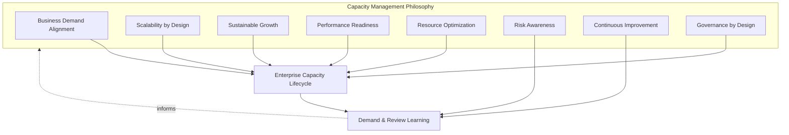
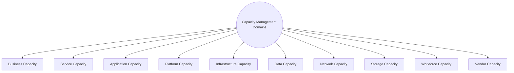
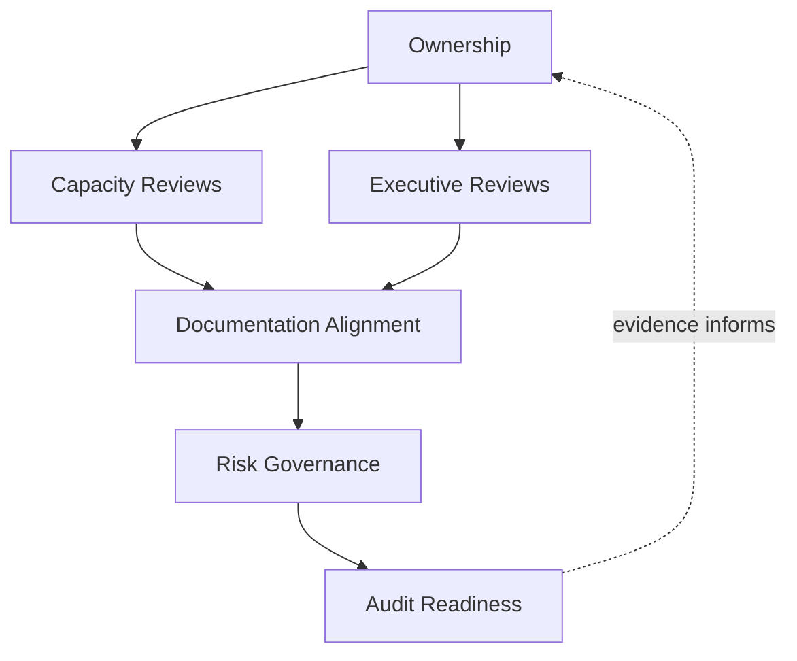
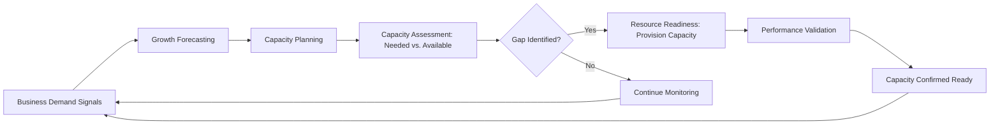
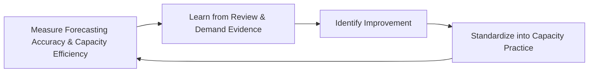
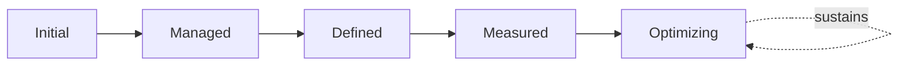

# Enterprise Capacity Management & Scalability Strategy

## 1. Document Purpose

This document defines the official Enterprise Capacity Management & Scalability Strategy for **StackLeo Tech Store**. It establishes how the organization plans, allocates, and optimizes capacity — technical and organizational — to sustain genuine business demand, independent of any specific capacity planning tool, monitoring platform, or infrastructure vendor.

This document governs capacity as a business and operational planning discipline: what capacity is needed, why, and how it is proactively planned across every dimension of the platform and organization. It is distinct from, and depends on, two related documents: `03_System_Design/scalability-strategy.md`, which defines the architectural strategy for how the platform scales structurally, and `08_Quality_Assurance/performance-testing.md`, which defines how capacity limits are technically validated through Capacity and Scalability Testing (Sections 4.5–4.6 there). This document is the operational governance layer that connects genuine business demand to those architectural and testing disciplines, and extends capacity planning beyond technical systems into workforce and vendor capacity.

- **Purpose of Capacity Management** — to ensure the organization understands, plans for, and provisions the capacity it genuinely needs — proactively and deliberately — rather than discovering capacity gaps only once demand has already exceeded them.
- **Relationship with Performance Management** — this document determines how much capacity is needed and when; `08_Quality_Assurance/performance-testing.md` determines whether that capacity, once provisioned, actually performs as expected under real conditions.
- **Relationship with Service Level Management** — Capacity Expectations in `service-level-management.md` (Section 4.6) are the business-facing commitments this document's planning exists to fulfill; capacity planning is how those commitments are kept proactively rather than discovered to be at risk only under strain.
- **Relationship with Monitoring & Observability** — capacity planning depends on genuine, current demand data; this document draws directly on Service Health Monitoring and Business Process Monitoring in `monitoring-observability.md` (Sections 4.1, 4.4) as its evidentiary foundation.
- **Relationship with Reliability Engineering** — insufficient capacity is one of the most common causes of reliability erosion under load; this document is a direct, proactive complement to the reliability objectives engineered in `07_DevOps/sre-strategy.md`.
- **Relationship with Business Growth** — capacity management exists in direct service of StackLeo's stated growth path — from single-market B2C retailer toward marketplace, corporate sales, wholesale, and regional expansion — ensuring capacity is never the limiting factor at the moment growth is most valuable.
- **Relationship with Enterprise Governance** — capacity investment decisions carry real cost and risk trade-offs; this document ensures those decisions are made deliberately, by accountable roles, against genuine evidence rather than reactive assumption.

This document is implementation-independent and vendor-neutral. It defines capacity management philosophy, lifecycle, domains, and governance conceptually — not specific capacity planning tools, monitoring platforms, cloud providers, infrastructure vendors, capacity thresholds, utilization percentages, forecasting algorithms, or infrastructure configuration.

## 2. Capacity Management Philosophy

Capacity management at StackLeo is governed by eight principles. Each exists to produce a specific business outcome — capacity is planned deliberately because of the growth and stability it enables, not as a purely technical exercise.

### 2.1 Business Demand Alignment

Capacity decisions are grounded in genuine, current business demand and credible growth projection, not in convenient technical assumption.

- **Business Value** — ensures capacity investment tracks what the business actually needs, avoiding both wasteful excess and risky shortfall.

### 2.2 Scalability by Design

Capacity is architected to grow by adding resources within an existing structure, consistent with `03_System_Design/scalability-strategy.md`, rather than requiring redesign each time demand grows.

- **Business Value** — allows the business to pursue growth with confidence that the architecture will not become the limiting factor at the moment growth is most valuable.

### 2.3 Sustainable Growth

Capacity is planned to support growth in a manner the business can sustain financially and operationally, not growth pursued at any cost.

- **Business Value** — balances the risk of insufficient capacity against the cost of excessive, underutilized capacity, protecting both customer experience and financial discipline.

### 2.4 Performance Readiness

Capacity planning is coordinated with `08_Quality_Assurance/performance-testing.md` to confirm that planned capacity, once provisioned, is validated to genuinely perform as intended.

- **Business Value** — ensures capacity investment translates into genuine, verified readiness, not merely a provisioned but unproven resource.

### 2.5 Resource Optimization

Capacity is allocated efficiently, avoiding both wasteful over-provisioning and risky under-provisioning across every domain in Section 4.

- **Business Value** — protects the business from both forms of cost: the direct cost of unused excess capacity and the indirect cost of degraded experience from insufficient capacity.

### 2.6 Risk Awareness

Capacity decisions are made with explicit awareness of the business risk that insufficient or excessive capacity represents.

- **Business Value** — enables deliberate, informed trade-offs rather than defaulting to either extreme out of uncertainty.

### 2.7 Continuous Improvement

Capacity management practice matures over time, informed by real demand patterns, forecasting accuracy, and evolving business scale.

- **Business Value** — keeps capacity planning increasingly accurate and efficient as StackLeo's business model and platform continue to evolve.

### 2.8 Governance by Design

Capacity governance structures are established deliberately as services and infrastructure are designed, not retrofitted once a capacity shortfall has already affected customers.

- **Business Value** — prevents the costly, high-visibility discovery of capacity gaps during a peak demand event rather than during calm, deliberate planning.

*Diagram 1: Capacity Management Philosophy Overview — the eight principles shape the enterprise capacity lifecycle, and demand and review learning feed back into the philosophy itself.*

## 3. Enterprise Capacity Lifecycle

Capacity management is governed across nine conceptual stages, spanning from initial demand awareness through continuous improvement.

### 3.1 Business Demand Awareness

- **Purpose** — understand genuine current and near-term business demand across services and channels.
- **Business Value** — grounds subsequent planning in real business reality rather than convenient assumption.
- **Governance Objectives** — require demand awareness to draw on genuine evidence from `monitoring-observability.md` and business reporting, not informal impression.

### 3.2 Capacity Planning

- **Purpose** — determine the capacity required to meet current and projected demand across every domain in Section 4.
- **Business Value** — converts demand awareness into a concrete, actionable capacity plan.
- **Governance Objectives** — require capacity plans to trace explicitly to the demand evidence from Section 3.1.

### 3.3 Capacity Assessment

- **Purpose** — determine current available capacity and compare it against planned requirements, coordinated with Capacity Assessment in `08_Quality_Assurance/performance-testing.md` (Section 3.5).
- **Business Value** — identifies genuine gaps between what is needed and what currently exists.
- **Governance Objectives** — require assessment to be conducted on a recurring basis, not only when strain is already being observed.

### 3.4 Growth Forecasting

- **Purpose** — project future capacity needs based on credible business growth trajectories.
- **Business Value** — allows capacity investment to be planned proactively and cost-effectively ahead of need.
- **Governance Objectives** — require forecasts to be grounded in genuine business projections, reviewed and revised as actual growth data becomes available.

### 3.5 Resource Readiness

- **Purpose** — confirm that planned capacity is genuinely available and provisioned ahead of when it will be needed.
- **Business Value** — prevents the common failure mode where capacity planning exists on paper but provisioning lags behind actual need.
- **Governance Objectives** — require resource readiness to be confirmed as a distinct milestone, not assumed automatically from planning alone.

### 3.6 Performance Validation

- **Purpose** — confirm that provisioned capacity genuinely performs as intended under real or realistic conditions, coordinated with `08_Quality_Assurance/performance-testing.md`.
- **Business Value** — ensures capacity investment translates into verified readiness, not merely theoretical sufficiency.
- **Governance Objectives** — require validation evidence to be available before capacity is considered genuinely ready for anticipated demand.

### 3.7 Operational Review

- **Purpose** — periodically evaluate how well actual capacity has matched actual demand.
- **Business Value** — gives leadership an honest, evidence-based view of forecasting accuracy and capacity efficiency.
- **Governance Objectives** — require review to occur on a regular, predictable cadence, connected to Executive Reviews (Section 6.3).

### 3.8 Capacity Optimization

- **Purpose** — act on operational review findings to improve the efficiency and accuracy of capacity allocation.
- **Business Value** — ensures capacity investment continually improves in efficiency rather than remaining fixed at initial estimates.
- **Governance Objectives** — require optimization actions arising from review to be documented and tracked to completion.

### 3.9 Continuous Improvement

- **Purpose** — act on accumulated forecasting, planning, and optimization experience to deliberately improve capacity management practice itself.
- **Business Value** — ensures capacity management effectiveness compounds over time as the business and platform scale.
- **Governance Objectives** — require improvement actions arising from this broader reflection to be tracked to completion, distinct from individual optimization actions.

### Enterprise Capacity Lifecycle Matrix

| Stage | Purpose | Business Value | Governance Objective |
|---|---|---|---|
| Business Demand Awareness | Understand genuine current and near-term demand | Grounds planning in real business reality | Draws on genuine evidence, not informal impression |
| Capacity Planning | Determine capacity required across all domains | Converts demand awareness into an actionable plan | Plans trace explicitly to demand evidence |
| Capacity Assessment | Compare available capacity against requirements | Identifies genuine gaps between need and reality | Conducted recurringly, not only under observed strain |
| Growth Forecasting | Project future needs from credible growth trajectories | Enables proactive, cost-effective investment | Grounded in genuine projections, revised with actual data |
| Resource Readiness | Confirm planned capacity is genuinely provisioned | Prevents provisioning lagging behind planning | Confirmed as a distinct milestone, not assumed |
| Performance Validation | Confirm provisioned capacity genuinely performs | Ensures verified, not merely theoretical, readiness | Validation evidence required before considered ready |
| Operational Review | Evaluate how well capacity matched actual demand | Honest view of forecasting accuracy and efficiency | Regular cadence, connected to executive review |
| Capacity Optimization | Act on review findings to improve allocation efficiency | Investment continually improves in efficiency | Optimization actions documented and tracked |
| Continuous Improvement | Improve capacity management practice itself | Effectiveness compounds over time | Improvement actions tracked, distinct from optimization |

*Diagram 2: Enterprise Capacity Lifecycle — a continuous cycle in which operational review and optimization directly inform the next iteration of business demand awareness.*

## 4. Capacity Management Domains

Capacity management spans ten conceptual domains, extending from business-level demand through technical infrastructure to workforce and vendor capacity.

### 4.1 Business Capacity

- **Purpose** — represent the business's overall ability to process demand — orders, transactions, customer interactions — across all channels.
- **Scope** — the top-level, business-facing view of capacity, informed by `01_Business/business-model.md` growth expectations.
- **Governance Expectations** — reviewed jointly with Business and Product stakeholders, not treated as a purely technical concern.
- **Business Importance** — provides the business-level context every other capacity domain ultimately serves.

### 4.2 Service Capacity

- **Purpose** — represent the capacity of each individual service defined in `service-catalog.md` to handle its expected demand.
- **Scope** — service-level throughput and concurrency capacity, connected to Service Criticality (`service-catalog.md`, Section 4.8).
- **Governance Expectations** — capacity planning rigor is proportionate to each service's criticality classification.
- **Business Importance** — connects business-level demand to the specific services that must absorb it.

### 4.3 Application Capacity

- **Purpose** — represent the processing capacity of application-level logic and components.
- **Scope** — informed by Application Configuration Items in `configuration-management.md` (Section 4.3).
- **Governance Expectations** — assessed jointly with engineering teams owning the relevant application logic.
- **Business Importance** — application-level constraints can limit capacity even when infrastructure is otherwise sufficient.

### 4.4 Platform Capacity

- **Purpose** — represent the capacity of shared platform capability that multiple services depend on.
- **Scope** — informed by Platform Configuration Items in `configuration-management.md` (Section 4.4).
- **Governance Expectations** — planned with explicit awareness of every dependent service, given multiplied impact if constrained.
- **Business Importance** — a platform-level capacity constraint can simultaneously limit multiple services at once.

### 4.5 Infrastructure Capacity

- **Purpose** — represent the capacity of the underlying technical environment.
- **Scope** — coordinated with `03_System_Design/scalability-strategy.md` and `07_DevOps/infrastructure-as-code.md`, at a conceptual planning level.
- **Governance Expectations** — infrastructure capacity is planned ahead of projected demand, consistent with Elastic Capacity thinking in `03_System_Design/scalability-strategy.md`.
- **Business Importance** — provides the foundational capacity every other technical domain in this section ultimately depends on.

### 4.6 Data Capacity

- **Purpose** — represent the capacity to store and process growing volumes of business and customer data.
- **Scope** — informed by Volume Testing in `08_Quality_Assurance/performance-testing.md` (Section 4.7) and `04_Database/database-strategy.md`.
- **Governance Expectations** — planned with explicit attention to catalog and order history growth over time, not only current volume.
- **Business Importance** — protects against degradation that emerges from data scale alone, distinct from concurrent user load.

### 4.7 Network Capacity

- **Purpose** — represent the capacity of connectivity paths customers and internal systems depend on.
- **Scope** — conceptual network throughput planning, coordinated with Infrastructure Capacity (Section 4.5).
- **Governance Expectations** — planned with explicit attention to the variable network conditions common in StackLeo's primary market.
- **Business Importance** — even ample compute and storage capacity provides no value if network capacity cannot deliver it to customers.

### 4.8 Storage Capacity

- **Purpose** — represent the capacity to retain data, media, and operational artifacts as the platform grows.
- **Scope** — distinct from Data Capacity (processing) in its focus on retention and durability.
- **Governance Expectations** — planned with awareness of data retention obligations in `04_Database/data-retention.md`.
- **Business Importance** — protects the platform's ability to retain the historical and product information the business depends on.

### 4.9 Workforce Capacity

- **Purpose** — represent the organization's ability to staff operations, support, and engineering functions sufficient to sustain the business.
- **Scope** — connects to Workforce Continuity in `business-continuity.md` (Section 4.4) and Capacity Management in `operations-overview.md` (Section 5.8).
- **Governance Expectations** — planned proactively against growth projections, not only reactively once teams are visibly overextended.
- **Business Importance** — even a fully scaled technical platform cannot be operated, supported, or improved without sufficient people.

### 4.10 Vendor Capacity

- **Purpose** — represent the capacity of external partners — couriers, payment providers, future marketplace and B2B partners — to absorb StackLeo's growing volume.
- **Scope** — informed by External Dependency Configuration Items in `configuration-management.md` (Section 4.8).
- **Governance Expectations** — planned jointly with partner relationship owners, since StackLeo cannot unilaterally provision a partner's capacity.
- **Business Importance** — protects the business from a growth scenario where technical capacity scales successfully but a partner cannot keep pace.

### Capacity Management Domain Matrix

| Domain | Purpose | Governance Expectations | Business Importance |
|---|---|---|---|
| Business Capacity | Represent overall ability to process demand | Reviewed jointly with Business and Product stakeholders | Provides business-level context for every other domain |
| Service Capacity | Represent each service's ability to handle demand | Rigor proportionate to service criticality | Connects business-level demand to specific services |
| Application Capacity | Represent application-level processing capacity | Assessed jointly with owning engineering teams | Application constraints can limit capacity independently |
| Platform Capacity | Represent shared platform capacity | Planned with awareness of every dependent service | A constraint can simultaneously limit multiple services |
| Infrastructure Capacity | Represent underlying technical environment capacity | Planned ahead of projected demand | Foundational capacity every technical domain depends on |
| Data Capacity | Represent capacity to store/process growing data | Attention to catalog/order history growth, not just current volume | Protects against data-scale degradation distinct from user load |
| Network Capacity | Represent connectivity path capacity | Attention to variable regional network conditions | Ample compute/storage is useless without delivery capacity |
| Storage Capacity | Represent capacity to retain data and artifacts | Aware of data retention obligations | Protects ability to retain historical/product information |
| Workforce Capacity | Represent ability to staff sufficient operations/support | Planned proactively against growth, not reactively | A scaled platform still needs sufficient people to run it |
| Vendor Capacity | Represent external partner capacity to absorb growth | Planned jointly with partner relationship owners | Protects against a partner becoming the growth bottleneck |

*Diagram 5 (Part A): Enterprise Scalability Readiness Model — ten domains spanning business, technical, and organizational capacity, together forming the platform's complete growth readiness posture.*

## 5. Capacity Governance Principles

- **Executive Ownership** — capacity investment decisions of significant scale are reviewed at the executive level, given their direct cost and growth implications.
- **Demand Forecasting** — capacity decisions are grounded in credible, evidence-based forecasts, consistent with Growth Forecasting (Section 3.4), not optimistic or arbitrary assumption.
- **Resource Visibility** — current capacity and utilization are visible to the stakeholders who plan and govern it, consistent with Monitoring & Observability practice.
- **Scalability Readiness** — capacity plans are validated against the architecture's actual scaling strategy in `03_System_Design/scalability-strategy.md`, not assumed to scale without structural verification.
- **Performance Awareness** — capacity decisions are made with awareness of their performance implications, coordinated with `08_Quality_Assurance/performance-testing.md`.
- **Auditability** — capacity plans, forecasts, and review outcomes can be independently reviewed after the fact.
- **Risk Awareness** — capacity governance decisions are made with explicit awareness of the risk both under- and over-provisioning represent.
- **Continuous Improvement** — capacity governance itself matures over time, informed by real forecasting accuracy and operational review findings.

### Capacity Governance Principle Matrix

| Principle | Description | Business Value |
|---|---|---|
| Executive Ownership | Significant capacity investment reviewed at executive level | Reflects genuine cost and growth significance |
| Demand Forecasting | Decisions grounded in credible, evidence-based forecasts | Prevents capacity planning built on optimistic assumption |
| Resource Visibility | Current capacity and utilization visible to stakeholders | Enables informed planning and governance decisions |
| Scalability Readiness | Plans validated against actual architectural scaling strategy | Prevents assuming scalability without structural verification |
| Performance Awareness | Decisions made with awareness of performance implications | Connects capacity planning to genuine performance outcomes |
| Auditability | Plans, forecasts, and reviews independently reviewable | Supports accountability and confidence for partners and regulators |
| Risk Awareness | Decisions made with awareness of under/over-provisioning risk | Enables deliberate, informed trade-offs |
| Continuous Improvement | Governance matures from real forecasting and review evidence | Keeps capacity planning aligned with organizational growth |

## 6. Capacity Governance

### 6.1 Ownership

Every capacity domain (Section 4) has a designated accountable owner; overall capacity governance is owned jointly by Operations and Engineering leadership, with significant investment decisions escalating to executive review.

### 6.2 Capacity Reviews

Capacity plans and assessments are formally reviewed against Business Demand Awareness (Section 3.1) on a recurring basis, ensuring planning remains grounded in genuine, current evidence.

### 6.3 Executive Reviews

Significant capacity investment decisions and overall Operational Review findings (Section 3.7) are reviewed with executive stakeholders on a regular cadence, consistent with Executive Ownership (Section 5.1).

### 6.4 Documentation Alignment

Capacity management documentation is kept consistent with `service-catalog.md`, `service-level-management.md`, `03_System_Design/scalability-strategy.md`, and `08_Quality_Assurance/performance-testing.md`; a capacity claim that contradicts current architecture or performance documentation is treated as a governance gap.

### 6.5 Risk Governance

Capacity-related risk — unvalidated growth assumptions, single points of constraint, unaddressed vendor capacity limits — is tracked, prioritized, and escalated consistently, ensuring accepted risk is always a deliberate, accountable decision.

### 6.6 Audit Readiness

Capacity plans, forecasts, assessments, and review outcomes are retained in a form that can be independently reviewed after the fact, supporting internal governance and partner or regulatory review where relevant.

### Capacity Governance Matrix

| Governance Area | Objective |
|---|---|
| Ownership | Every capacity domain has a designated accountable owner |
| Capacity Reviews | Plans reviewed recurringly against genuine, current demand evidence |
| Executive Reviews | Significant investment decisions reviewed with executive stakeholders |
| Documentation Alignment | Capacity documentation stays consistent with catalog, SLM, and architecture practice |
| Risk Governance | Accepted capacity risk is always a deliberate, accountable decision |
| Audit Readiness | Plans, forecasts, and reviews retained for independent review |

*Diagram 2b: Capacity Governance Framework — ownership anchors review activity, which feeds documentation alignment, risk governance, and ultimately auditable evidence.*

*Diagram 3: Demand Forecasting & Capacity Planning Model — business demand signals drive forecasting and planning, converging on a deliberate gap assessment that either triggers provisioning and validation or continues monitoring.*

### Governance Responsibility Matrix

| Role | Responsibility |
|---|---|
| COO / Operations Lead | Owns coherence and enforcement of this capacity management strategy, in partnership with Engineering leadership. |
| Capacity Planning Lead | Owns Business Demand Awareness and Growth Forecasting (Sections 3.1, 3.4) across domains. |
| Solution Architect | Ensures Infrastructure and Platform Capacity (Sections 4.4–4.5) align with `03_System_Design/scalability-strategy.md`. |
| Service Owners | Own Service Capacity (Section 4.2) planning for their respective services. |
| Performance Engineering Lead | Ensures Performance Validation (Section 3.6) is coordinated with `08_Quality_Assurance/performance-testing.md`. |
| HR / People Lead | Owns Workforce Capacity (Section 4.9) planning jointly with Operations. |
| Partner / Vendor Manager | Owns Vendor Capacity (Section 4.10) planning and partner coordination. |
| Executive Leadership | Reviews and approves significant capacity investment decisions. |
| Internal Audit / Review Function | Independently verifies that capacity governance records reflect actual practice. |

## 7. Future Readiness

This strategy is designed to remain valid as StackLeo evolves in scale and architectural complexity, without requiring redefinition of its underlying philosophy.

- **Cloud-Native Platforms** — capacity domains (Section 4) are defined independently of any specific runtime or deployment model, so they apply unchanged as infrastructure evolves.
- **AI-Enabled Services** — as AI-assisted capability is introduced, Application and Platform Capacity (Sections 4.3–4.4) extend to account for its distinct computational demand profile, without prescribing any specific AI infrastructure.
- **Marketplace Platform** — the multi-vendor marketplace model extends Business and Data Capacity (Sections 4.1, 4.6) to cover seller-driven catalog and traffic growth, consistent with the Enterprise Stage in `03_System_Design/scalability-strategy.md` (Section 3).
- **Multi-Tenant Architecture** — where future architecture introduces tenant isolation, Service and Platform Capacity (Sections 4.2, 4.4) extend to explicitly plan for per-tenant capacity allocation.
- **Multi-Region Operations** — as StackLeo expands from Bangladesh into South Asia and beyond, Network and Infrastructure Capacity (Sections 4.7, 4.5) extend to cover region-specific demand and connectivity planning.
- **Global Business Expansion** — Workforce and Vendor Capacity (Sections 4.9–4.10) extend to address distributed teams and an expanding partner ecosystem as the business grows beyond its current footprint.
- **Enterprise Scale** — the capacity lifecycle, domains, and governance defined in Sections 3–6 are defined independently of organizational size or structure, so they remain coherent as the business grows substantially.
- **Evolving Demand Patterns** — Growth Forecasting (Section 3.4) is structured to be revisited as new demand patterns emerge — new channels, new business models — ensuring the strategy adapts to genuinely new growth rather than only historical trends.

## 8. Governance

- **Ownership** — the COO (or equivalent accountable executive function) owns this strategy and is accountable for its consistent application across the platform, in partnership with Engineering leadership.
- **Review Process** — this strategy is formally reviewed whenever a material change occurs in business model (`01_Business/business-model.md`), the service catalog (`service-catalog.md`), or architecture (`03_System_Design/scalability-strategy.md`), and on a regular recurring cadence independent of specific change events.
- **Capacity Management Policies** — subordinate, practice-specific capacity documents (domain-specific forecasts, review templates) must remain consistent with the philosophy, lifecycle, and domains defined here.
- **Audit Readiness** — this strategy and the evidence it requires (Section 6.6) are maintained in a state ready for internal or external audit at any time, without requiring advance preparation.
- **Continuous Improvement** — this strategy itself is subject to Continuous Improvement (Section 2.7, Section 3.9); its effectiveness is periodically assessed and revised based on genuine forecasting accuracy and organizational evidence.

*Diagram 4: Capacity Review & Optimization Cycle — forecasting accuracy and efficiency are measured, learned from, improved upon, and standardized back into practice, on a continuing basis.*

## 9. Capacity Management Maturity Model

Capacity management maturity is described across five conceptual levels, adapted from established process maturity thinking. Progression reflects increasing consistency, measurement, and deliberate improvement — not merely increasing provisioning volume.

- **Initial** — capacity decisions, where they occur at all, are reactive and informal; capacity is added only after strain has already been observed, often under pressure.
- **Managed** — basic capacity planning exists for individual significant services, but consistency and forecasting rigor across domains (Section 4) vary significantly.
- **Defined** — capacity planning, forecasting, and governance are standardized, documented, and consistently applied across the organization, consistent with the lifecycle and domains defined throughout this document; ownership is clear organization-wide.
- **Measured** — capacity efficiency and forecasting accuracy are measured systematically, and decisions are grounded in genuine performance data rather than qualitative impression alone.
- **Optimizing** — capacity management practice is continuously and deliberately improved based on quantitative evidence and organizational learning; improvement itself is a managed, ongoing discipline rather than an occasional initiative.

### Capacity Management Maturity Model Matrix

| Level | Characteristics | Primary Focus |
|---|---|---|
| Initial | Reactive, informal decisions; capacity added only after strain | Ad hoc, reactive provisioning |
| Managed | Basic planning exists per significant service; rigor varies | Service-level consistency |
| Defined | Standardized, documented planning and governance applied organization-wide | Organization-wide consistency and clear ownership |
| Measured | Efficiency and forecasting accuracy measured systematically | Evidence-based capacity decisions |
| Optimizing | Practice continuously and deliberately improved from evidence | Sustained, deliberate improvement as a discipline |

*Diagram 6: Capacity Management Maturity Progression Model — maturity advances from reactive, informal provisioning toward standardized, measured, and continuously optimized capacity management practice.*

## 10. Anti-Patterns

The following recurring failure patterns are explicitly recognized and avoided, as each one structurally undermines this strategy.

| Anti-Pattern | Why It's Avoided |
|---|---|
| Reactive Capacity Planning | Contradicts Business Demand Alignment (Section 2.1) and Governance by Design (Section 2.8); adding capacity only after strain has already affected customers forfeits the far cheaper option of planning proactively. |
| Over-Provisioning | Contradicts Resource Optimization (Section 2.5) and Sustainable Growth (Section 2.3); excess capacity carries real, ongoing cost without corresponding business benefit. |
| Under-Provisioning | Contradicts Performance Readiness (Section 2.4); insufficient capacity directly degrades customer experience and risks breaching commitments in `service-level-management.md`. |
| Weak Forecasting | Contradicts Demand Forecasting (Section 5.2); decisions built on optimistic or arbitrary projections produce capacity plans disconnected from genuine business reality. |
| Poor Visibility | Contradicts Resource Visibility (Section 5.3); without genuine visibility into current capacity and utilization, planning decisions are made blind. |
| Weak Documentation | Undermines Documentation Alignment (Section 6.4), leaving capacity plans disconnected from current architecture and service level documentation. |
| Weak Governance | Undermines Section 6.1; without clear ownership and review, capacity planning drifts into inconsistency as the business and platform scale. |
| Missing Continuous Improvement | Contradicts Continuous Improvement (Section 2.7, Section 3.9); without deliberate improvement, forecasting accuracy and capacity efficiency stagnate as the business grows in complexity. |

## 11. Document Information

| Property | Value |
|----------|-------|
| Document | capacity-management.md |
| Version | 1.0.0 |
| Status | Active |
| Maintained By | StackLeo |
| Last Updated | 2026-07-24 |

---

© StackLeo. All Rights Reserved.
