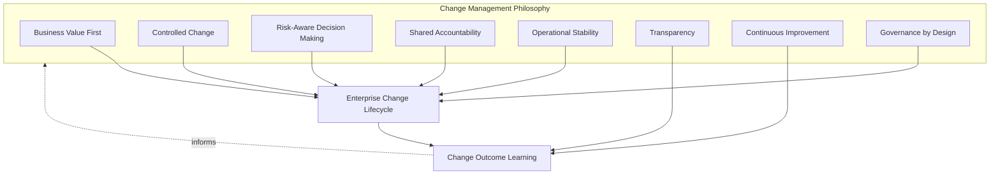
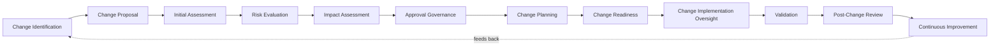
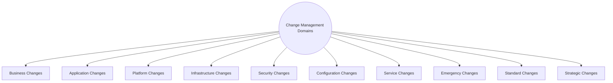
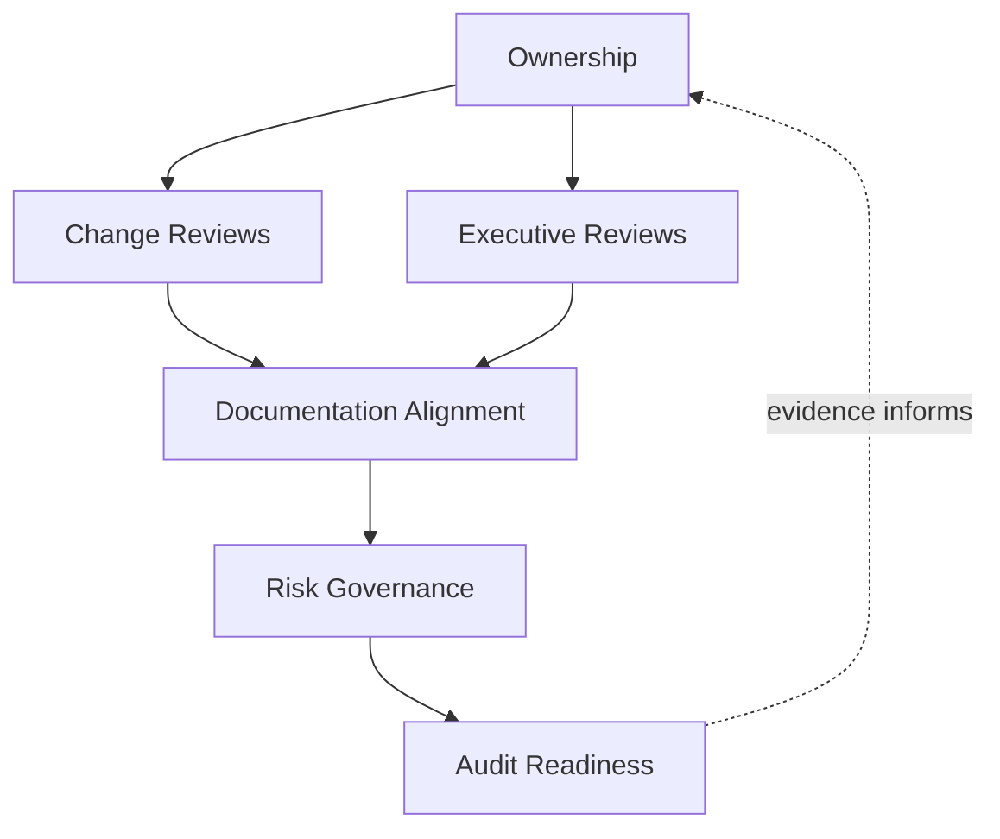
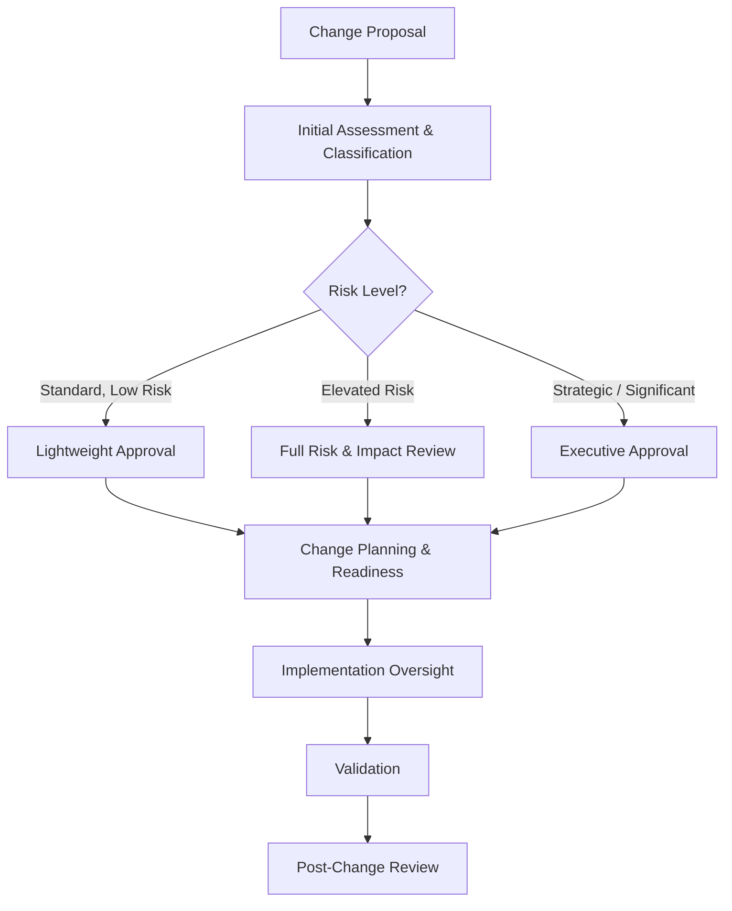
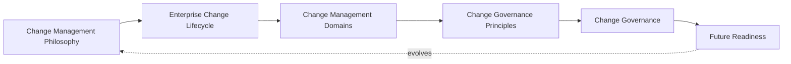
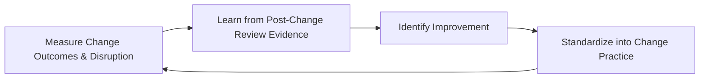
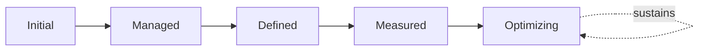

# Enterprise Change Management & Change Governance Strategy

## 1. Document Purpose

This document defines the official Enterprise Change Management & Change Governance Strategy for **StackLeo Tech Store**. It establishes how operational and business-facing change to live services is reviewed, approved, and coordinated — independent of any specific ITSM platform, change management tool, or deployment platform.

This document governs change at the operational and service level — whether a modification to a live service is safe, coordinated, and ready to proceed. It is distinct from, and sits alongside, the source-level change discipline in `07_DevOps/git-strategy.md` (how code changes are proposed and integrated) and the release decision governed by `07_DevOps/release-management.md` (when and how a release becomes an actual customer-facing event). A single business change may involve all three: source-level review, a release decision, and this document's operational change coordination.

- **Purpose of Change Management** — to ensure that change to live services is a controlled, well-informed decision, made deliberately and communicated clearly, rather than an unmanaged event that happens to services and the people who depend on them.
- **Relationship with Operations** — this document is the change-specific elaboration of Change Management in `operations-overview.md` (Section 5.5); it defines how operational change coordination is actually practiced across the service portfolio.
- **Relationship with Incident Management** — poorly managed change is one of the most common causes of incidents; this document exists in part to prevent the class of incident that `incident-management.md` would otherwise have to respond to.
- **Relationship with Problem Management** — where `problem-management.md` identifies a systemic weakness, the corrective and preventive actions it produces are themselves changes that must proceed through this document's governance before they reach live services.
- **Relationship with Release Management** — `07_DevOps/release-management.md` governs the business decision of when and how validated, deployment-ready change becomes an actual release; this document governs the operational review and coordination of that change's impact on live services and their consumers, keeping the two connected but distinct.
- **Relationship with Service Management** — every change reviewed under this strategy affects one or more services defined in `service-catalog.md`; change impact assessment (Section 3.5) draws directly on each service's documented dependencies and criticality.
- **Relationship with Risk Management** — this strategy applies ISO 31000-aligned risk thinking specifically to the decision of whether, when, and how a given change should proceed, connecting operational change decisions to the same risk-based discipline used throughout this repository.

This document is implementation-independent and vendor-neutral. It defines change management philosophy, lifecycle, domains, and governance conceptually — not specific ITSM platforms, change management tools, deployment platforms, change workflows, CAB meeting structures, approval timelines, or infrastructure configuration.

## 2. Change Management Philosophy

Change management at StackLeo is governed by eight principles. Each exists to produce a specific business outcome — change is governed deliberately because of the disruption risk it carries, not as bureaucratic friction on legitimate progress.

### 2.1 Business Value First

Every change is evaluated by the value it delivers to customers and the business, consistent with Business Value First in `service-management.md` (Section 2.1), not treated as valuable merely because it is technically ready.

- **Business Value** — keeps change governance focused on protecting genuine business outcomes, not on process for its own sake.

### 2.2 Controlled Change

What changes, and when, is a deliberate decision, not an accumulation of whatever happens to be ready at an arbitrary moment.

- **Business Value** — reduces the risk of uncoordinated change interacting unpredictably and causing avoidable disruption.

### 2.3 Risk-Aware Decision Making

Change decisions weigh business impact and likelihood of disruption, consistent with ISO 31000 risk management thinking, rather than applying uniform rigor regardless of consequence.

- **Business Value** — directs governance attention toward the changes that carry genuine risk, while allowing routine, low-risk change to proceed efficiently.

### 2.4 Shared Accountability

Change is reviewed and approved jointly by the functions affected by it — Engineering, Operations, Product, Security, and Support — not by any single function acting alone on behalf of everyone else.

- **Business Value** — surfaces impact and risk that any single function, viewing the change from only its own perspective, might otherwise miss.

### 2.5 Operational Stability

Change management exists to protect the stability of live services, consistent with Service Reliability in `service-management.md` (Section 2.3), treating stability as a first-class concern equal to the change's intended benefit.

- **Business Value** — prevents the pursuit of new value from silently eroding the reliability customers already depend on.

### 2.6 Transparency

Change decisions, their rationale, and their status are visible to stakeholders who depend on them, not held privately within the team proposing the change.

- **Business Value** — allows affected teams and stakeholders to prepare for and respond to change, rather than being surprised by it.

### 2.7 Continuous Improvement

Change management practice matures over time, informed by real change outcomes and post-change review findings.

- **Business Value** — keeps change governance aligned with StackLeo's growth in delivery cadence, architectural complexity, and business scale.

### 2.8 Governance by Design

Change governance structures are established deliberately as services and processes are designed, consistent with Governance by Design in `service-management.md` (Section 2.7), not retrofitted once an uncontrolled change has already caused harm.

- **Business Value** — prevents the costly rework of introducing change discipline only after disruption has already demonstrated its absence.

*Diagram 1: Change Management Philosophy Overview — the eight principles shape the enterprise change lifecycle, and change outcome learning feeds back into the philosophy itself.*

## 3. Enterprise Change Lifecycle

Change management is governed across twelve conceptual stages, spanning from initial identification through continuous improvement.

### 3.1 Change Identification

- **Purpose** — recognize that a modification to a live service, process, or configuration is needed or proposed.
- **Business Value** — ensures change is deliberately recognized as change, rather than introduced informally without anyone accounting for its impact.
- **Governance Objectives** — ensure identification can originate from any legitimate source — engineering, business, security, or problem resolution — without artificial barriers.

### 3.2 Change Proposal

- **Purpose** — formally describe the intended change, its purpose, and its expected benefit.
- **Business Value** — ensures change intent is captured clearly enough to be evaluated on its merits, consistent with Business Value First (Section 2.1).
- **Governance Objectives** — require every proposal to state the change's purpose, scope, and intended benefit before assessment begins.

### 3.3 Initial Assessment

- **Purpose** — perform a first-pass evaluation of the proposed change's nature and which domain (Section 4) it belongs to.
- **Business Value** — orients subsequent review efficiently, ensuring low-risk change is not subjected to unnecessary scrutiny while significant change receives full attention.
- **Governance Objectives** — require every proposal to be classified against the domains in Section 4 before deeper evaluation proceeds.

### 3.4 Risk Evaluation

- **Purpose** — assess the risk the proposed change carries, consistent with Risk-Aware Decision Making (Section 2.3).
- **Business Value** — ensures governance rigor is proportionate to genuine risk, not applied uniformly regardless of consequence.
- **Governance Objectives** — require risk evaluation to be documented and to directly inform Approval Governance (Section 3.6).

### 3.5 Impact Assessment

- **Purpose** — determine what services, dependencies, and stakeholders the change would affect, drawing on Service Dependencies in `service-catalog.md` (Section 4.6).
- **Business Value** — surfaces indirect or non-obvious consequences of a change before it is approved, not after it has already caused disruption.
- **Governance Objectives** — require impact assessment to explicitly consider both the proposing team's own service and every dependent service.

### 3.6 Approval Governance

- **Purpose** — render a deliberate, accountable decision on whether the change is authorized to proceed.
- **Business Value** — converts change authorization into a governed decision point rather than a default outcome of the change simply having been proposed.
- **Governance Objectives** — require approval authority to be proportionate to the change's assessed risk (Section 3.4), consistent with Change Ownership (Section 5.1).

### 3.7 Change Planning

- **Purpose** — determine how, when, and by whom the approved change will be implemented.
- **Business Value** — reduces the risk of implementation proceeding without adequate preparation or coordination.
- **Governance Objectives** — require a documented implementation plan, including rollback considerations, before Change Readiness (Section 3.8) is assessed.

### 3.8 Change Readiness

- **Purpose** — confirm that all prerequisites for safely implementing the change are genuinely in place.
- **Business Value** — prevents implementation from beginning on an incomplete or unstable foundation.
- **Governance Objectives** — require explicit, documented confirmation of readiness before implementation is authorized to begin.

### 3.9 Change Implementation Oversight

- **Purpose** — maintain active, accountable oversight while the change is being implemented.
- **Business Value** — allows deviation from plan to be noticed and addressed while the change is still in progress, rather than only discovered afterward.
- **Governance Objectives** — require a designated accountable role to maintain oversight throughout implementation for changes above a defined significance threshold.

### 3.10 Validation

- **Purpose** — confirm the implemented change achieves its intended purpose without introducing unacceptable new risk.
- **Business Value** — prevents the costly failure mode of a change being considered complete while its actual effect remains unverified.
- **Governance Objectives** — require validation to be performed independently of the implementation effort itself, consistent with Verification practice in `08_Quality_Assurance/testing-strategy.md` (Section 6).

### 3.11 Post-Change Review

- **Purpose** — formally evaluate the change's outcome, including whether it delivered its intended value and whether any unintended impact occurred.
- **Business Value** — gives stakeholders an honest, evidence-based view of whether the change process itself is working well.
- **Governance Objectives** — require review for every change meeting a defined significance threshold, connected to Post-Incident Review in `incident-management.md` (Section 3.9) where relevant.

### 3.12 Continuous Improvement

- **Purpose** — act on post-change review findings to deliberately improve change management practice.
- **Business Value** — ensures change management effectiveness compounds over time rather than remaining static as delivery cadence and platform complexity grow.
- **Governance Objectives** — require improvement actions arising from post-change review to be documented and tracked to completion.

### Enterprise Change Lifecycle Matrix

| Stage | Purpose | Business Value | Governance Objective |
|---|---|---|---|
| Change Identification | Recognize a needed or proposed modification | Ensures change is deliberately accounted for | Open to any legitimate source, no artificial barriers |
| Change Proposal | Formally describe intent and expected benefit | Captures intent clearly enough to be evaluated on merit | Proposal states purpose, scope, and intended benefit |
| Initial Assessment | First-pass evaluation and domain classification | Orients review efficiently by genuine risk | Every proposal classified before deeper evaluation |
| Risk Evaluation | Assess the risk the change carries | Governance rigor proportionate to genuine risk | Documented and directly informs approval governance |
| Impact Assessment | Determine affected services, dependencies, stakeholders | Surfaces indirect consequences before approval | Considers both the proposing service and dependents |
| Approval Governance | Render a deliberate, accountable decision | Converts authorization into a governed decision point | Authority proportionate to assessed risk |
| Change Planning | Determine how, when, and by whom to implement | Reduces risk of inadequately prepared implementation | Documented plan, including rollback, required |
| Change Readiness | Confirm prerequisites are genuinely in place | Prevents implementation on an unstable foundation | Explicit, documented readiness confirmation required |
| Change Implementation Oversight | Maintain active oversight during implementation | Allows deviation to be caught while still in progress | Designated accountable role for significant changes |
| Validation | Confirm the change achieves its purpose safely | Prevents considering a change complete when unverified | Performed independently of implementation effort |
| Post-Change Review | Formally evaluate outcome and unintended impact | Honest, evidence-based view of process effectiveness | Required for changes meeting a significance threshold |
| Continuous Improvement | Act on review findings to improve practice | Effectiveness compounds over time | Improvement actions tracked to completion |

*Diagram 2: Enterprise Change Lifecycle — a continuous cycle in which post-change review and improvement directly inform the next iteration of change identification.*

## 4. Change Management Domains

Change management spans ten conceptual domains, each carrying a different risk profile and requiring a proportionate level of governance rigor.

### 4.1 Business Changes

- **Purpose** — capture changes to business rules, policies, or processes that affect how the platform operates, consistent with `01_Business/business-rules.md`.
- **Scope** — changes originating from business decisions rather than technical necessity.
- **Governance Expectations** — reviewed jointly with Business and Product stakeholders, given their direct business rationale and impact.
- **Business Importance** — ensures business-driven change is coordinated with the same discipline as technical change, since its impact on customers can be equally significant.

### 4.2 Application Changes

- **Purpose** — capture changes to application-level logic and behavior.
- **Scope** — changes to business logic and processing, coordinated with source-level review in `07_DevOps/git-strategy.md`.
- **Governance Expectations** — impact assessment considers the full set of dependent services per `service-catalog.md` (Section 4.6).
- **Business Importance** — the most frequent category of change, given continuous feature and capability delivery.

### 4.3 Platform Changes

- **Purpose** — capture changes to shared platform capability that multiple services depend on, per Platform Services in `service-catalog.md` (Section 3.5).
- **Scope** — changes to capability with multiplied impact across the portfolio.
- **Governance Expectations** — reviewed with explicit awareness of every service depending on the affected platform capability.
- **Business Importance** — carries disproportionate risk relative to its apparent scope, given its multiplied dependency impact.

### 4.4 Infrastructure Changes

- **Purpose** — capture changes to the underlying technical environment.
- **Scope** — informed by `03_System_Design/deployment-architecture.md`, covering the governance of infrastructure change rather than its technical execution.
- **Governance Expectations** — coordinated with Infrastructure Health Awareness in `monitoring-observability.md` (Section 4.2) to confirm change does not silently affect monitored baselines.
- **Business Importance** — can affect multiple services simultaneously, making careful impact assessment especially important.

### 4.5 Security Changes

- **Purpose** — capture changes to identity, access, or protection capability.
- **Scope** — governed jointly with, and never superseding, `06_Security` policy and review requirements.
- **Governance Expectations** — reviewed with Security leadership involvement regardless of the change's apparent size.
- **Business Importance** — protects StackLeo's core trust differentiator; even a small security-relevant change can carry disproportionate consequence.

### 4.6 Configuration Changes

- **Purpose** — capture changes to environment- or application-level configuration, per `07_DevOps/configuration-management.md`.
- **Scope** — changes that alter behavior without altering underlying code or infrastructure structure.
- **Governance Expectations** — configuration changes are never assumed low-risk purely because they involve no code change; impact assessment applies regardless.
- **Business Importance** — a common and often underestimated source of unexpected disruption when changed without adequate review.

### 4.7 Service Changes

- **Purpose** — capture changes to a service's defined scope, service levels, or catalog entry, per `service-catalog.md` and `service-level-management.md`.
- **Scope** — changes to what a service is or promises, distinct from changes to its internal implementation.
- **Governance Expectations** — reviewed jointly with Service Owners and affected consumers, per Stakeholder Alignment in `service-level-management.md` (Section 3.3).
- **Business Importance** — directly affects customer and business expectations, requiring the same rigor as the original service definition.

### 4.8 Emergency Changes

- **Purpose** — capture changes required urgently to resolve or prevent significant, active harm, typically arising from incident response.
- **Scope** — changes where the normal lifecycle pace (Section 3) would itself cause unacceptable delay in addressing active disruption.
- **Governance Expectations** — emergency changes still require accountable authorization and are formally reviewed after the fact with the same rigor as any other change, never exempted from Post-Change Review (Section 3.11).
- **Business Importance** — allows the organization to respond quickly to genuine urgency without abandoning change discipline altogether.

### 4.9 Standard Changes

- **Purpose** — capture well-understood, low-risk, frequently repeated changes with an established, previously reviewed pattern.
- **Scope** — changes that have been assessed as consistently low-risk through prior experience.
- **Governance Expectations** — standard changes proceed with proportionately lighter governance, consistent with Risk-Aware Decision Making (Section 2.3), while remaining subject to periodic reconfirmation that they remain genuinely low-risk.
- **Business Importance** — allows routine, well-understood change to proceed efficiently without diluting governance attention better spent on genuinely risky change.

### 4.10 Strategic Changes

- **Purpose** — capture large-scale changes tied directly to significant business strategy shifts, such as the introduction of the multi-vendor marketplace or corporate sales capability.
- **Scope** — changes of a scale and consequence that extend well beyond routine operational change.
- **Governance Expectations** — reviewed with executive-level involvement, consistent with Executive Reviews (Section 6.3).
- **Business Importance** — represents the change category with the greatest potential business consequence, warranting the highest level of deliberate governance.

### Change Management Domain Matrix

| Domain | Purpose | Governance Expectations | Business Importance |
|---|---|---|---|
| Business Changes | Capture changes to business rules, policies, processes | Reviewed jointly with Business and Product stakeholders | Coordinates business-driven change with equal discipline |
| Application Changes | Capture changes to application-level logic | Impact assessment considers full dependent service set | Most frequent category given continuous delivery |
| Platform Changes | Capture changes to shared platform capability | Reviewed with awareness of every dependent service | Disproportionate risk relative to apparent scope |
| Infrastructure Changes | Capture changes to the technical environment | Coordinated with infrastructure health monitoring | Can affect multiple services simultaneously |
| Security Changes | Capture changes to identity, access, protection | Reviewed with Security leadership involvement always | Protects the core trust differentiator |
| Configuration Changes | Capture changes to environment/application configuration | Never assumed low-risk absent code change | Common, often underestimated source of disruption |
| Service Changes | Capture changes to a service's scope or commitments | Reviewed jointly with Service Owners and consumers | Directly affects customer and business expectations |
| Emergency Changes | Capture urgent changes resolving active harm | Still requires authorization and after-the-fact review | Allows rapid response without abandoning discipline |
| Standard Changes | Capture well-understood, low-risk, repeated changes | Lighter governance, periodically reconfirmed as low-risk | Allows routine change to proceed efficiently |
| Strategic Changes | Capture large-scale, business-strategy-tied changes | Reviewed with executive-level involvement | Greatest potential business consequence |

*Diagram 3 (Part A): Change Management Domain Map — ten domains, each carrying a distinct risk profile requiring proportionate governance rigor.*

## 5. Change Governance Principles

- **Change Ownership** — every proposed change has a single, named accountable owner responsible for seeing it through the lifecycle (Section 3).
- **Risk Awareness** — every change decision is made with explicit awareness of the risk it carries, consistent with Risk Evaluation (Section 3.4).
- **Stakeholder Communication** — affected stakeholders are informed of significant change proportionate to its impact, consistent with Transparency (Section 2.6).
- **Decision Transparency** — approval decisions and their rationale are visible and recorded, not made informally or invisibly.
- **Operational Readiness** — a change is not authorized to proceed until Change Readiness (Section 3.8) genuinely confirms the organization is prepared, not merely that the change is technically built.
- **Validation** — every change is confirmed to achieve its intended purpose without unacceptable new risk, consistent with Section 3.10.
- **Auditability** — change proposals, approvals, and outcomes are retained in a form that can be independently reviewed after the fact.
- **Continuous Improvement** — change governance itself matures over time, informed by real change outcomes.

### Change Governance Principle Matrix

| Principle | Description | Business Value |
|---|---|---|
| Change Ownership | Every change has a single, named accountable owner | Ensures a change is genuinely seen through, not abandoned mid-lifecycle |
| Risk Awareness | Decisions made with explicit awareness of carried risk | Enables deliberate, informed risk-taking rather than blind exposure |
| Stakeholder Communication | Affected stakeholders informed proportionate to impact | Prevents surprise disruption to teams and customers who depend on stability |
| Decision Transparency | Approval decisions and rationale are visible and recorded | Builds trust in the governance process itself |
| Operational Readiness | Change proceeds only once the organization is genuinely prepared | Prevents technically ready change from causing operational crisis |
| Validation | Every change confirmed to achieve its purpose safely | Prevents considering a change complete when its effect is unverified |
| Auditability | Proposals, approvals, and outcomes retained for review | Supports accountability and confidence for partners and regulators |
| Continuous Improvement | Governance matures from real change outcomes | Keeps governance aligned with organizational and platform growth |

## 6. Change Governance

### 6.1 Ownership

Every change management domain (Section 4) has a designated accountable review authority; overall change governance is owned jointly by Operations and Engineering leadership, consistent with Shared Accountability (Section 2.4).

### 6.2 Change Reviews

Proposed changes are formally reviewed against Risk Evaluation and Impact Assessment (Sections 3.4–3.5) before Approval Governance (Section 3.6) is exercised, ensuring approval is grounded in genuine assessment.

### 6.3 Executive Reviews

Strategic Changes (Section 4.10) and any change assessed as carrying significant risk are reviewed with executive stakeholders, consistent with Executive Service Reviews in `service-level-management.md` (Section 6.3).

### 6.4 Documentation Alignment

Change management documentation is kept consistent with `service-catalog.md`, `service-level-management.md`, and `07_DevOps/release-management.md`; a change record that contradicts current service or release documentation is treated as a governance gap.

### 6.5 Risk Governance

Change-related risk — unassessed dependencies, inadequately planned rollback, deferred post-change review — is tracked, prioritized, and escalated consistently, ensuring accepted risk is always a deliberate, accountable decision.

### 6.6 Audit Readiness

Change proposals, risk and impact assessments, approvals, and post-change review outcomes are retained in a form that can be independently reviewed after the fact, supporting internal governance and partner or regulatory review where relevant.

### Change Governance Matrix

| Governance Area | Objective |
|---|---|
| Ownership | Every change domain has a designated accountable review authority |
| Change Reviews | Approval is grounded in genuine risk and impact assessment |
| Executive Reviews | Strategic and significant-risk changes receive executive-level review |
| Documentation Alignment | Change records stay consistent with service and release documentation |
| Risk Governance | Accepted change-related risk is always a deliberate, accountable decision |
| Audit Readiness | Proposals, approvals, and outcomes retained for independent review |

*Diagram 4 (Part A): Change Governance Framework — ownership anchors review activity, which feeds documentation alignment, risk governance, and ultimately auditable evidence.*

*Diagram 4 (Part B): Change Approval & Oversight Model — approval rigor scales with assessed risk level, converging into common planning, oversight, validation, and review stages regardless of the path taken.*

### Governance Responsibility Matrix

| Role | Responsibility |
|---|---|
| COO / Operations Lead | Owns coherence and enforcement of this change management strategy, in partnership with Engineering leadership. |
| Change Owner | Owns an individual proposed change through its full lifecycle (Section 3). |
| Service Owners | Provide Impact Assessment input (Section 3.5) for changes affecting their services. |
| Security Lead | Owns approval authority for Security Changes (Section 4.5) regardless of apparent size. |
| SRE Lead | Ensures Infrastructure and Platform Changes (Sections 4.3–4.4) are assessed against reliability objectives in `07_DevOps/sre-strategy.md`. |
| Product Manager | Provides Business Change (Section 4.1) rationale and impact context. |
| Executive Leadership | Reviews and approves Strategic Changes (Section 4.10) and significant-risk changes. |
| Internal Audit / Review Function | Independently verifies that change governance records reflect actual practice. |

*Diagram: Enterprise Change Operating Model — how philosophy, lifecycle, domains, principles, and governance operate together as a single, self-reinforcing system that continues to evolve as the platform grows.*

## 7. Future Readiness

This strategy is designed to remain valid as StackLeo evolves in scale and architectural complexity, without requiring redefinition of its underlying philosophy.

- **Cloud-Native Platforms** — change domains (Section 4) are defined independently of any specific runtime or deployment model, so they apply unchanged as infrastructure evolves.
- **AI-Assisted Operations** — where AI-assisted techniques support change risk assessment or impact analysis, they operate within the same Risk Awareness and Decision Transparency principles (Section 5) as any other change practice, never bypassing accountable human approval for significant change.
- **Marketplace Platform** — the multi-vendor marketplace model extends Service and Business Changes (Sections 4.7, 4.1) to cover seller-facing service definitions and marketplace-specific business rules.
- **Multi-Tenant Architecture** — where future architecture introduces tenant isolation, Impact Assessment (Section 3.5) extends to explicitly evaluate cross-tenant consequences of a proposed change.
- **Continuous Delivery** — as delivery cadence accelerates per `07_DevOps/ci-cd-strategy.md`, the proportion of change classified as Standard (Section 4.9) is expected to grow, with lightweight governance applied consistently rather than discipline being abandoned for speed.
- **Microservices** — as the platform decomposes into further bounded services per `03_System_Design/service-architecture.md`, Platform Changes (Section 4.3) grow in relative importance, and Impact Assessment extends naturally to a larger dependency graph.
- **Multi-Region Operations** — as StackLeo expands from Bangladesh into South Asia and beyond, Impact Assessment (Section 3.5) extends to consider region-specific service and regulatory dependencies.
- **Enterprise Scale** — the change lifecycle, domains, and governance defined in Sections 3–6 are defined independently of team size or organizational structure, so they remain coherent as change volume and organizational complexity grow substantially.

## 8. Governance

- **Ownership** — the Operations lead (or equivalent COO-accountable function) owns this strategy and is accountable for its consistent application across the platform, in partnership with Engineering leadership.
- **Review Process** — this strategy is formally reviewed whenever a material change occurs in business model (`01_Business/business-model.md`), the service catalog (`service-catalog.md`), or delivery practice (`07_DevOps`), and on a regular recurring cadence independent of specific change events.
- **Change Management Policies** — subordinate, practice-specific change documents (domain-specific review criteria, Standard Change catalogs) must remain consistent with the philosophy, lifecycle, and domains defined here.
- **Audit Readiness** — this strategy and the evidence it requires (Section 6.6) are maintained in a state ready for internal or external audit at any time, without requiring advance preparation.
- **Continuous Improvement** — this strategy itself is subject to Continuous Improvement (Section 2.7, Section 3.12); its effectiveness is periodically assessed and revised based on genuine change outcomes and organizational evidence.

*Diagram 5: Continuous Change Improvement Cycle — change outcomes are measured, learned from, improved upon, and standardized back into practice, on a continuing basis.*

## 9. Change Management Maturity Model

Change management maturity is described across five conceptual levels, adapted from established process maturity thinking. Progression reflects increasing consistency, measurement, and deliberate improvement — not merely increasing approval paperwork.

- **Initial** — change is largely uncontrolled and informal; what changes and when depends heavily on individual initiative, and impact is often discovered only after disruption occurs.
- **Managed** — basic change review exists and is followed for individual significant changes, but consistency across domains (Section 4) varies significantly.
- **Defined** — change management processes are standardized, documented, and consistently applied across the organization, consistent with the lifecycle and domains defined throughout this document; ownership is clear organization-wide.
- **Measured** — change outcomes are measured systematically — change-related incident rate, time to approval — and decisions are grounded in genuine performance data rather than qualitative impression alone.
- **Optimizing** — change management practice is continuously and deliberately improved based on quantitative evidence and organizational learning; improvement itself is a managed, ongoing discipline rather than an occasional initiative.

### Change Management Maturity Model Matrix

| Level | Characteristics | Primary Focus |
|---|---|---|
| Initial | Largely uncontrolled; impact discovered only after disruption | Ad hoc, individually-dependent change |
| Managed | Basic review exists per significant change; consistency varies | Change-level consistency |
| Defined | Standardized, documented processes applied across the organization | Organization-wide consistency and clear ownership |
| Measured | Outcomes measured systematically against defined expectations | Evidence-based change management decisions |
| Optimizing | Practice continuously and deliberately improved from evidence | Sustained, deliberate improvement as a discipline |

*Diagram 6: Change Management Maturity Progression Model — maturity advances from uncontrolled, individually-dependent change toward standardized, measured, and continuously optimized change management practice.*

## 10. Anti-Patterns

The following recurring failure patterns are explicitly recognized and avoided, as each one structurally undermines this strategy.

| Anti-Pattern | Why It's Avoided |
|---|---|
| Uncontrolled Changes | Contradicts Controlled Change (Section 2.2); change introduced without deliberate review risks unpredictable interaction with other live change and services. |
| Weak Risk Assessment | Contradicts Risk-Aware Decision Making (Section 2.3); without genuine risk evaluation, governance rigor cannot be proportionate to actual consequence. |
| Poor Stakeholder Communication | Undermines Transparency (Section 2.6) and Stakeholder Communication (Section 5.3); affected teams and customers surprised by change lose trust independent of the change's technical success. |
| Missing Validation | Contradicts Validation (Section 3.10, Section 5.6); a change never confirmed to work as intended may be silently failing its purpose or causing unnoticed harm. |
| Weak Rollback Readiness | Undermines Change Planning (Section 3.7); a change implemented without a considered path to reverse it leaves the organization exposed if the change proves harmful. |
| Poor Documentation | Undermines Documentation Alignment (Section 6.4) and Audit Readiness (Section 6.6), leaving change records unclear or unverifiable after the fact. |
| Weak Governance | Undermines Section 6.1; without clear ownership and review, change discipline drifts into inconsistency as delivery cadence and organizational scale grow. |
| Missing Continuous Improvement | Contradicts Continuous Improvement (Section 2.7, Section 3.12); without deliberate improvement, change management effectiveness stagnates as the business and platform grow in complexity. |

## 11. Document Information

| Property | Value |
|----------|-------|
| Document | change-management.md |
| Version | 1.0.0 |
| Status | Active |
| Maintained By | StackLeo |
| Last Updated | 2026-07-24 |

---

© StackLeo. All Rights Reserved.
