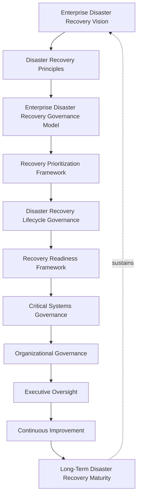
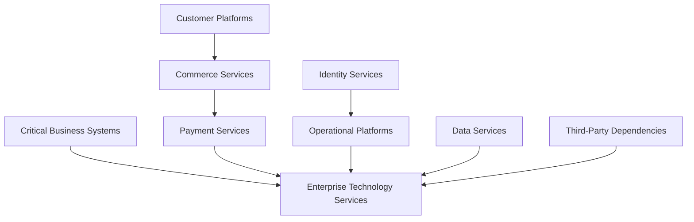
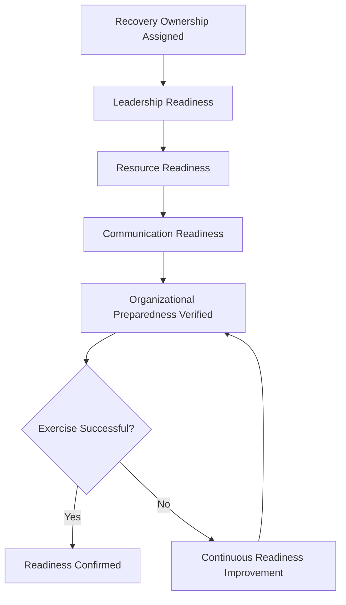
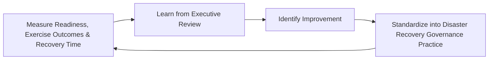

# Enterprise Disaster Recovery Framework

## 1. Executive Summary

**Purpose** — This document defines the official Enterprise Disaster Recovery Framework for **StackLeo Tech Store**. It establishes disaster recovery governance, recovery strategy, recovery prioritization, organizational readiness, critical systems governance, executive oversight, continuous improvement, and long-term disaster recovery maturity as a single, consolidated governance reference. Three companion documents already govern adjacent aspects of disaster recovery: `06_Security/disaster-recovery.md` remains authoritative for DR philosophy and business-impact-driven recovery strategy, `07_DevOps/disaster-recovery.md` governs the engineering and platform execution that delivers against that strategy technically, and `09_Operations/disaster-recovery.md` is the COO-owned operational governance layer coordinating declaration, cross-organizational recovery, and validation across both. This framework does not compete with any of them for authority. It is the consolidated governance reference that synthesizes recovery prioritization, critical systems governance, readiness, and executive oversight across all three into one coherent document.

**Scope** — This framework applies to every category of recoverable system at StackLeo — critical business systems, customer platforms, commerce services, payment services, identity services, operational platforms, data services, third-party dependencies, and enterprise technology services — coordinated with `06_Security/disaster-recovery.md`, `07_DevOps/disaster-recovery.md`, `09_Operations/disaster-recovery.md`, `business-continuity-framework.md`, and `incident-management-framework.md`.

**Strategic Objectives** — To ensure StackLeo has a clear, practiced, and governed path back to critical operation when disruption exceeds routine resilience, never an improvised one assembled under crisis pressure; that recovery priority is set by genuine business criticality; that the organization is genuinely, not merely nominally, prepared to execute recovery; and that executive leadership has one coherent, consolidated view of the organization's disaster recovery posture.

**Business Value** — A consolidated disaster recovery framework protects the organization from the risk of recovery gaps hiding in the seams between separately-maintained philosophy, engineering, and operational documents, protects the business from the disproportionate cost of an unpracticed or poorly prioritized recovery, and gives executive leadership confidence that StackLeo's most severe disruptions have a genuinely governed path back to operation.

**Intended Audience** — The Board of Directors, executive leadership, the Chief Technology Officer, operations leadership, disaster recovery leadership, engineering leadership, security leadership, infrastructure leadership, and business stakeholders.

## 2. Enterprise Disaster Recovery Vision

- **Disaster Recovery as Business Resilience** — disaster recovery is governed as a genuine business resilience capability, never merely a technical restoration procedure.
- **Protection of Critical Business Functions** — recovery capability is anchored first in protecting the functions the business most depends on.
- **Customer Trust Preservation** — recovery capability protects customers' confidence that StackLeo can genuinely return from even severe disruption.
- **Organizational Recovery Capability** — recovery is governed as a genuine organizational capability, spanning far beyond engineering execution alone.
- **Sustainable Operations** — recovery capability protects the organization's ability to sustain genuine operation over the long term.
- **Strategic Preparedness** — recovery readiness is pursued deliberately, as a strategic investment, never assumed adequate by default.
- **Continuous Operational Stability** — recovery capability protects the organization's overall stability even through its most severe disruptions.

*Diagram 1: Enterprise Disaster Recovery Framework — the recovery vision establishes principles and the governance model, flowing through recovery prioritization, lifecycle governance, readiness, and critical systems governance into organizational governance and executive oversight, with continuous improvement driving long-term maturity that reinforces the vision itself.*

### Enterprise Disaster Recovery Vision Matrix

| Vision Element | Focus | Business Value |
|---|---|---|
| Disaster Recovery as Business Resilience | A genuine business resilience capability | Prevents recovery from being treated as purely technical restoration |
| Protection of Critical Business Functions | Anchored in protecting what the business most depends on | Directs recovery investment toward what genuinely matters most |
| Customer Trust Preservation | Confidence StackLeo can genuinely return from disruption | Protects the trust relationship even severe disruption tests |
| Organizational Recovery Capability | A genuine organizational capability, beyond engineering alone | Ensures recovery is coordinated across the whole business |
| Sustainable Operations | Protects the ability to sustain operation long term | Protects revenue and commitments tied to continuous service |
| Strategic Preparedness | Pursued deliberately, never assumed adequate | Removes the false comfort of unverified recovery readiness |
| Continuous Operational Stability | Protects overall stability through severe disruption | Sustains confidence among customers, partners, and investors |

## 3. Disaster Recovery Principles

Disaster recovery governance at StackLeo rests on nine principles, each producing a specific business outcome.

- **Recovery Readiness** — the organization maintains a genuine, verified ability to execute recovery before it is needed. *Business Value:* removes the false comfort of a recovery plan that has never been tested.
- **Critical System Protection** — the organization's most critical systems receive proportionately elevated recovery investment. *Business Value:* directs limited recovery resource toward what genuinely matters most.
- **Business Priority Alignment** — recovery priority is set by genuine business consequence, coordinated with `01_Business/business-model.md`. *Business Value:* ensures recovery effort is spent on what genuinely matters to the business.
- **Accountability** — every recovery domain traces to a specific, named, responsible owner. *Business Value:* ensures no domain drifts without someone genuinely responsible for it.
- **Organizational Preparedness** — the organization genuinely rehearses recovery, not merely documents it. *Business Value:* ensures recovery plans function when genuinely needed.
- **Risk Awareness** — recovery decisions are made with genuine, explicit awareness of the risk they address. *Business Value:* prevents recovery investment from being spent without connection to genuine exposure.
- **Continuous Improvement** — recovery practice matures over time, informed by real disruption and exercise outcomes. *Business Value:* keeps recovery capability aligned with the organization's growing scale and complexity.
- **Executive Leadership** — the most consequential recovery decisions, including a disaster declaration, are made or ratified at the executive level. *Business Value:* ensures the organization's most consequential recovery decisions carry commensurate scrutiny.
- **Resilience by Design** — recovery capability is considered from the outset of a system's design, never retrofitted after the fact. *Business Value:* prevents the disproportionate cost of adding recoverability to a system already built without it.

### Disaster Recovery Principles Matrix

| Principle | Description | Business Value |
|---|---|---|
| Recovery Readiness | Genuine, verified ability to execute recovery | Removes the false comfort of an untested recovery plan |
| Critical System Protection | Elevated investment for the most critical systems | Directs limited resource toward what genuinely matters most |
| Business Priority Alignment | Priority set by genuine business consequence | Ensures recovery effort is spent on what genuinely matters |
| Accountability | Every domain traces to a specific, responsible owner | Ensures no domain drifts without genuine responsibility |
| Organizational Preparedness | Genuinely rehearsed, not just documented | Ensures plans function when genuinely needed |
| Risk Awareness | Decisions made with explicit awareness of addressed risk | Prevents investment spent without connection to genuine exposure |
| Continuous Improvement | Practice matures from real disruption and exercise outcomes | Keeps capability aligned with growing scale and complexity |
| Executive Leadership | Most consequential decisions made or ratified at the top | Ensures commensurate scrutiny for consequential decisions |
| Resilience by Design | Considered from the outset, never retrofitted | Prevents the disproportionate cost of after-the-fact recoverability |

## 4. Enterprise Disaster Recovery Governance Model

Disaster recovery governance operates across nine conceptual domains, each holding accountability for a distinct category of recoverable capability.

### Critical Business Systems

- **Purpose** — govern recovery for the systems whose failure would carry the most severe genuine business consequence.
- **Governance Scope** — coordinated with Critical Systems Governance (Section 8).
- **Business Value** — protects the systems the business's continued operation most directly depends on.
- **Executive Expectations** — leadership expects critical business systems to be governed with the highest rigor in this model.

### Customer Platforms

- **Purpose** — govern recovery for the platforms customers directly interact with and depend upon.
- **Governance Scope** — coordinated with `service-management-framework.md` (Customer Services).
- **Business Value** — protects the most direct point of customer encounter with StackLeo.
- **Executive Expectations** — leadership expects customer platform recovery to be held to elevated rigor.

### Commerce Services

- **Purpose** — govern recovery for the platform's core commerce capability — catalog, cart, checkout.
- **Governance Scope** — coordinated with `01_Business/business-model.md`.
- **Business Value** — protects the services that directly generate StackLeo's revenue.
- **Executive Expectations** — leadership expects commerce service recovery to be treated as the highest commercial priority.

### Payment Services

- **Purpose** — govern recovery for the platform's payment processing capability.
- **Governance Scope** — coordinated with `06_Security/data-protection.md` given the elevated sensitivity of payment data.
- **Business Value** — protects the trustworthiness of the organization's most consequential transactions.
- **Executive Expectations** — leadership expects payment service recovery to be unimpeachably rigorous.

### Identity Services

- **Purpose** — govern recovery for the platform's identity and access capability.
- **Governance Scope** — coordinated with `identity-access-governance.md`.
- **Business Value** — protects the platform's durable security perimeter even through disruption.
- **Executive Expectations** — leadership expects identity service recovery to precede recovery of dependent services.

### Operational Platforms

- **Purpose** — govern recovery for the platforms supporting genuine day-to-day operation.
- **Governance Scope** — coordinated with `operations-strategy.md`.
- **Business Value** — protects the organization's ability to genuinely operate once technical recovery is complete.
- **Executive Expectations** — leadership expects operational platform recovery to extend genuinely beyond technical restoration.

### Data Services

- **Purpose** — govern recovery for the platform's data storage and processing capability.
- **Governance Scope** — coordinated with `04_Database/data-governance.md`.
- **Business Value** — protects the trustworthiness and completeness of the data every business decision depends on.
- **Executive Expectations** — leadership expects data service recovery to confirm genuine data integrity, not only availability.

### Third-Party Dependencies

- **Purpose** — govern recovery risk introduced through a dependency on a vendor or integration partner StackLeo does not directly control.
- **Governance Scope** — coordinated with `06_Security/third-party-risk-governance.md`.
- **Business Value** — protects the business from disruption it does not directly cause but remains responsible for managing.
- **Executive Expectations** — leadership expects third-party dependency recovery risk to be evaluated before onboarding.

### Enterprise Technology Services

- **Purpose** — govern the synthesized, executive-relevant picture of recovery posture across every technology domain above.
- **Governance Scope** — oversight exclusively accountable for converging every domain into one coherent enterprise picture.
- **Business Value** — protects leadership's ability to understand overall recovery posture as a whole, not domain by domain.
- **Executive Expectations** — leadership expects one coherent recovery picture, not nine disconnected domain views.

### Disaster Recovery Governance Matrix

| Domain | Purpose | Business Value | Executive Expectations |
|---|---|---|---|
| Critical Business Systems | Govern recovery for the most consequential systems | Protects systems operation most directly depends on | Expects the highest rigor in this model |
| Customer Platforms | Govern recovery for customer-facing platforms | Protects the most direct point of customer encounter | Expects elevated rigor |
| Commerce Services | Govern recovery for core commerce capability | Protects the services directly generating revenue | Expects treatment as the highest commercial priority |
| Payment Services | Govern recovery for payment processing capability | Protects trustworthiness of the most consequential transactions | Expects unimpeachable rigor |
| Identity Services | Govern recovery for identity and access capability | Protects the durable security perimeter even through disruption | Expects recovery preceding dependent services |
| Operational Platforms | Govern recovery for day-to-day operational platforms | Protects the ability to genuinely operate post-recovery | Expects extension genuinely beyond technical restoration |
| Data Services | Govern recovery for data storage and processing | Protects trustworthiness and completeness of business data | Expects confirmation of genuine integrity, not only availability |
| Third-Party Dependencies | Govern recovery risk from external dependencies | Protects against disruption StackLeo does not directly cause | Expects evaluation before onboarding |
| Enterprise Technology Services | Synthesize the enterprise recovery picture | Protects leadership's ability to understand posture as a whole | Expects one coherent picture, not disconnected views |

*Diagram 2: Disaster Recovery Governance Model — critical business systems, customer platforms and commerce and payment services, identity and operational platforms, data services, and third-party dependencies all converge on enterprise technology services, which synthesizes every domain into one coherent enterprise picture.*

## 5. Recovery Prioritization Framework

Recoverable systems are governed across five conceptual tiers, each carrying a distinct governance objective. Remaining implementation independent, this framework prioritizes recovery by genuine business criticality — never by technical convenience or recovery-time formula.

### Mission-Critical Services

- **Business Criticality** — failure genuinely threatens the organization's ability to operate at all.
- **Recovery Governance** — recovered first, with the most rigorous, elevated governance in this model.
- **Executive Visibility** — direct, real-time executive and Board engagement.
- **Organizational Expectations** — the entire organization mobilizes to support recovery.

### High-Priority Services

- **Business Criticality** — failure carries significant, genuine consequence to revenue or customer trust.
- **Recovery Governance** — recovered with elevated urgency immediately following mission-critical services.
- **Executive Visibility** — direct visibility to Operations Leadership and the CTO.
- **Organizational Expectations** — cross-functional coordination is expected without delay.

### Important Business Services

- **Business Criticality** — failure carries genuine but contained consequence to a limited function.
- **Recovery Governance** — recovered within a defined, bounded window following higher-priority tiers.
- **Executive Visibility** — summary visibility through routine reporting.
- **Organizational Expectations** — addressed through coordinated, but not emergency, response.

### Standard Services

- **Business Criticality** — failure carries limited, genuine consequence to routine operation.
- **Recovery Governance** — recovered through standard, non-urgent process.
- **Executive Visibility** — none required, available on request.
- **Organizational Expectations** — addressed at the team level.

### Supporting Services

- **Business Criticality** — failure carries negligible genuine consequence.
- **Recovery Governance** — recovered as capacity allows, without dedicated priority.
- **Executive Visibility** — none required.
- **Organizational Expectations** — handled individually, without formal escalation.

### Recovery Prioritization Matrix

| Tier | Business Criticality | Recovery Governance | Executive Visibility | Organizational Expectations |
|---|---|---|---|---|
| Mission-Critical Services | Threatens the ability to operate at all | Recovered first, most rigorous governance | Direct, real-time executive and Board engagement | Entire organization mobilizes |
| High-Priority Services | Significant consequence to revenue or trust | Elevated urgency, immediately following mission-critical | Direct visibility to Operations Leadership and CTO | Cross-functional coordination without delay |
| Important Business Services | Genuine but contained consequence | Recovered within a defined, bounded window | Summary visibility through routine reporting | Coordinated, non-emergency response |
| Standard Services | Limited consequence to routine operation | Recovered through standard, non-urgent process | None required, available on request | Addressed at the team level |
| Supporting Services | Negligible genuine consequence | Recovered as capacity allows | None required | Handled individually, without escalation |

## 6. Disaster Recovery Lifecycle Governance

Disaster recovery governance operates across eight conceptual lifecycle stages.

- **Recovery Strategy** — govern how the organization determines its overall approach and priority toward recovery investment.
- **Recovery Readiness** — govern the organization's genuine preparedness to execute recovery before a disaster occurs.
- **Disaster Assessment** — govern how a genuine disaster is recognized and formally assessed against declaration criteria.
- **Recovery Prioritization** — govern how affected systems are prioritized for recovery per Section 5.
- **Organizational Coordination** — govern how recovery is coordinated across the whole organization, not only engineering.
- **Recovery Validation** — govern how a recovered system is confirmed genuinely restored, not merely appearing available.
- **Executive Review** — govern the point at which recovery status and decisions require executive-level visibility.
- **Continuous Improvement** — govern how recovery practice is deliberately strengthened based on real exercise and disaster outcomes.

### Disaster Recovery Lifecycle Matrix

| Stage | Governance Objective | Business Value |
|---|---|---|
| Recovery Strategy | Determine overall approach and priority toward investment | Ensures recovery investment is deliberately directed |
| Recovery Readiness | Confirm genuine preparedness before a disaster occurs | Removes the false comfort of an untested plan |
| Disaster Assessment | Recognize and formally assess against declaration criteria | Ensures declaration reflects genuine, assessed severity |
| Recovery Prioritization | Prioritize affected systems per the tiered framework | Directs recovery effort toward what genuinely matters most |
| Organizational Coordination | Coordinate recovery across the whole organization | Prevents recovery from being an engineering-only effort |
| Recovery Validation | Confirm genuine, not merely apparent, restoration | Prevents declaring recovery complete prematurely |
| Executive Review | Elevate status and decisions requiring visibility | Engages leadership exactly when genuinely warranted |
| Continuous Improvement | Strengthen practice from real exercise and disaster outcomes | Keeps recovery capability compounding over time |

*Diagram 3: Disaster Recovery Lifecycle — recovery strategy and readiness inform disaster assessment and prioritization, feeding organizational coordination and recovery validation, with executive review and continuous improvement feeding lessons back into the cycle.*

## 7. Recovery Readiness Framework

- **Organizational Preparedness** — governs whether the organization has genuinely rehearsed recovery before a disaster occurs.
- **Recovery Ownership** — governs every recovery domain's traceability to a specific, named, accountable owner.
- **Leadership Readiness** — governs whether leadership is genuinely prepared to lead through a disaster, not merely aware of a plan.
- **Resource Readiness** — governs whether the organization genuinely retains the resources recovery execution depends on.
- **Communication Readiness** — governs whether the organization is genuinely prepared to communicate through a disaster, coordinated with Communication Governance (`incident-management-framework.md`, Section 7).
- **Business Alignment** — governs whether readiness investment is genuinely aligned with business priority, coordinated with `01_Business/business-model.md`.
- **Continuous Readiness Improvement** — governs how readiness practice is deliberately strengthened based on real exercise outcomes.

### Recovery Readiness Matrix

| Readiness Area | Focus | Governance Coordination |
|---|---|---|
| Organizational Preparedness | Genuinely rehearsed before a disaster occurs | Organizational Preparedness (Section 3) |
| Recovery Ownership | Traceability to a specific, named, accountable owner | Accountability (Section 3) |
| Leadership Readiness | Genuinely prepared to lead through a disaster | Executive Leadership (Section 3) |
| Resource Readiness | Resources recovery execution genuinely depends on | Recovery Prioritization Framework (Section 5) |
| Communication Readiness | Genuinely prepared to communicate through disaster | `incident-management-framework.md` (Section 7) |
| Business Alignment | Readiness investment aligned with business priority | `01_Business/business-model.md` |
| Continuous Readiness Improvement | Practice strengthened from real exercise outcomes | Continuous Improvement (Section 3) |

*Diagram 4: Recovery Readiness Structure — recovery ownership establishes leadership, resource, and communication readiness, verified through organizational preparedness and genuine exercise, with continuous readiness improvement closing any gap before readiness is confirmed.*

## 8. Critical Systems Governance

- **Business-Critical Systems** — governs systems whose failure carries the most severe genuine consequence to business operation.
- **Customer-Critical Systems** — governs systems whose failure most directly and severely affects the customer.
- **Technology-Critical Systems** — governs systems whose failure undermines the technical foundation every other system depends on.
- **Dependency Governance** — governs how a critical system's genuine dependencies are identified and managed.
- **Recovery Accountability** — governs every critical system's traceability to a specific, named, accountable recovery owner.
- **Executive Decision Authority** — governs who genuinely holds the authority to make a consequential recovery decision for a critical system.
- **Organizational Transparency** — governs how critical system status is genuinely visible to those who need it during recovery.

### Critical Systems Governance Matrix

| Governance Area | Focus | Coordination |
|---|---|---|
| Business-Critical Systems | Most severe consequence to business operation | Critical Business Systems (Section 4) |
| Customer-Critical Systems | Most direct and severe effect on the customer | Customer Platforms (Section 4) |
| Technology-Critical Systems | Undermining the foundation other systems depend on | Enterprise Technology Services (Section 4) |
| Dependency Governance | Identifying and managing genuine dependencies | Third-Party Dependencies (Section 4) |
| Recovery Accountability | Traceability to a specific, accountable owner | Recovery Ownership (Section 7) |
| Executive Decision Authority | Authority for a consequential recovery decision | Organizational Governance (Section 9) |
| Organizational Transparency | Status genuinely visible during recovery | Executive Oversight (Section 11) |

## 9. Organizational Governance

Governance accountability is distributed deliberately across nine organizational roles.

- **Board of Directors** — holds ultimate accountability for StackLeo's overall disaster recovery posture.
- **Executive Leadership** — holds accountability for whether recovery capability genuinely protects the business, in partnership with the Board.
- **Chief Technology Officer** — owns the coherence of this framework's synthesis across the three companion disaster recovery documents.
- **Operations Leadership** — owns the operational governance defined in `09_Operations/disaster-recovery.md`.
- **Disaster Recovery Leadership** — owns the day-to-day execution of the Disaster Recovery Lifecycle (Section 6) and Recovery Prioritization Framework (Section 5).
- **Engineering Leadership** — own the technical execution capability defined in `07_DevOps/disaster-recovery.md`.
- **Security Leadership** — own the DR philosophy and business-impact strategy defined in `06_Security/disaster-recovery.md`.
- **Infrastructure Leadership** — own Technology-Critical Systems recovery (Section 8) within their accountable domain.
- **Business Stakeholders** — own Commerce and Payment Services recovery (Section 4) alignment with genuine business priority.

### Organizational Responsibility Matrix

| Role | Governance Objective | Business Value |
|---|---|---|
| Board of Directors | Hold ultimate accountability for overall recovery posture | Provides the highest point of ultimate accountability |
| Executive Leadership | Hold accountability for recovery protecting the business | Provides a single point of executive-level accountability |
| Chief Technology Officer | Own coherence of this framework's synthesis | Connects the consolidated view to authoritative sources |
| Operations Leadership | Own operational governance defined in `09_Operations/disaster-recovery.md` | Applies governance to day-to-day recovery coordination |
| Disaster Recovery Leadership | Own day-to-day execution of lifecycle and prioritization | Ensures governance is genuinely, continuously executed |
| Engineering Leadership | Own technical execution capability | Embeds accountability closest to where recovery is executed |
| Security Leadership | Own DR philosophy and business-impact strategy | Ensures recovery genuinely reflects business-impact priority |
| Infrastructure Leadership | Own technology-critical systems recovery | Embeds accountability closest to the technical foundation |
| Business Stakeholders | Own commerce and payment services recovery alignment | Connects recovery to genuine business relevance |

## 10. Disaster Recovery Risk Governance

Disaster recovery-related risk is governed across eight conceptual categories.

- **Critical System Failure Risks** — the risk that a genuinely critical system fails without a verified recovery path.
- **Business Disruption Risks** — the risk that recovery capability proves inadequate to genuinely restore business operation.
- **Technology Risks** — the risk that the platform's technical recovery mechanism itself fails when genuinely needed.
- **Third-Party Dependency Risks** — the risk that recovery is blocked or delayed by an external dependency StackLeo does not directly control.
- **Security Risks** — the risk that a recovery process itself introduces a genuine security weakness.
- **Operational Risks** — the risk that the organization cannot adequately coordinate recovery across every affected function.
- **Reputation Risks** — the risk that a poorly executed recovery damages StackLeo's standing with customers, partners, or the market.
- **Strategic Risks** — the risk that inadequate recovery capability undermines the organization's broader strategic direction.

### Disaster Recovery Risk Matrix

| Risk Category | Focus | Governance Coordination |
|---|---|---|
| Critical System Failure Risks | A critical system fails without a verified recovery path | Coordinated with Critical Systems Governance (Section 8) |
| Business Disruption Risks | Recovery capability proving inadequate to restore operation | Coordinated with `business-continuity-framework.md` |
| Technology Risks | The technical recovery mechanism itself failing | Coordinated with `07_DevOps/disaster-recovery.md` |
| Third-Party Dependency Risks | Recovery blocked or delayed by an external dependency | Coordinated with `06_Security/third-party-risk-governance.md` |
| Security Risks | A recovery process introducing a genuine weakness | Coordinated with `06_Security/security-governance.md` |
| Operational Risks | Inadequate coordination across every affected function | Coordinated with Organizational Coordination (Section 6) |
| Reputation Risks | Damage to standing from a poorly executed recovery | Coordinated with Executive Oversight (Section 11) |
| Strategic Risks | Inadequate capability undermining strategic direction | Coordinated with `06_Security/enterprise-risk-management-strategy.md` |

## 11. Executive Oversight

- **Disaster Recovery Reviews** — the overall coherence of this consolidated framework is formally reviewed on a regular cadence.
- **Recovery Readiness Reviews** — the organization's genuine recovery readiness is reviewed directly with executive leadership.
- **Critical Systems Reviews** — the status of every designated critical system is reviewed with executive leadership.
- **Business Impact Reviews** — the genuine business impact of recent recovery exercises or disasters is reviewed as a distinct, ongoing concern.
- **Executive Governance Reviews** — the framework's own governance model, domains, and lifecycle are periodically reassessed for continued fitness.
- **Continuous Improvement Reviews** — the organization's follow-through on captured disaster recovery lessons is reviewed directly with executive leadership.

### Executive Oversight Matrix

| Oversight Mechanism | Purpose | Governance Role |
|---|---|---|
| Disaster Recovery Reviews | Confirm overall consolidated framework coherence | Regular, predictable cadence for the framework as a whole |
| Recovery Readiness Reviews | Review genuine organizational recovery readiness | Direct executive-level readiness review |
| Critical Systems Reviews | Review status of every designated critical system | Direct executive-level review of the highest-priority domain |
| Business Impact Reviews | Review genuine impact of exercises or disasters | Treats business impact as ongoing, not assumed |
| Executive Governance Reviews | Reassess the governance model itself for continued fitness | Applies to Sections 4–9 of this framework |
| Continuous Improvement Reviews | Review follow-through on captured lessons | Direct executive-level review of improvement completion |

## 12. Future Readiness

This framework is designed to remain valid as StackLeo evolves in scale, geography, and organizational complexity.

- **AI-Assisted Recovery Intelligence** — as disaster assessment increasingly incorporates AI-assisted methods, coordinated with `04_Database/ai-governance.md`, it remains governed under Disaster Assessment (Section 6) at the same rigor as any other method.
- **Predictive Recovery Readiness** — where the organization develops the capability to anticipate a readiness gap before it is exposed by a real disaster, that capability is governed as an extension of Recovery Readiness (Section 6).
- **Intelligent Recovery Governance** — where recovery prioritization increasingly draws on intelligent pattern analysis, that analysis remains subject to the same Recovery Prioritization Framework (Section 5) as any other method.
- **Autonomous Recovery Coordination (Conceptual)** — where automation increasingly performs steps within organizational coordination or recovery validation, that automation remains subject to the same ownership and executive oversight as any human-performed activity.
- **Enterprise Recovery at Scale** — the governance model, domains, and lifecycle defined throughout this framework are defined independently of organizational size.
- **Global Operational Resilience** — Recovery Strategy and Recovery Prioritization (Sections 6 and 5) are structured to be re-applied as StackLeo expands from Bangladesh into South Asia and global markets, each with genuinely distinct disruption conditions.

## 13. Disaster Recovery Maturity Model

Disaster recovery governance maturity is described across five conceptual levels.

- **Initial** — recovery, where it exists, is informal and inconsistent; capability is assumed rather than verified, and ownership is unclear.
- **Managed** — basic recovery governance exists for individual domains, but consistency across the nine domains in Section 4 varies significantly.
- **Standardized** — the governance model, domains, and lifecycle are standardized, documented, and consistently applied across the organization.
- **Resilient** — the organization genuinely and routinely verifies its recovery capability through real exercises, not merely documented plans.
- **Optimized** — disaster recovery governance is continuously and deliberately improved based on quantitative evidence and organizational learning; improvement itself is a managed, ongoing discipline.

### Disaster Recovery Maturity Matrix

| Level | Characteristics | Primary Focus |
|---|---|---|
| Initial | Informal, inconsistent recovery; capability assumed, not verified | Ad hoc, individually-dependent recovery practice |
| Managed | Basic governance exists per domain; consistency varies | Domain-level consistency |
| Standardized | Standardized governance model, domains, and lifecycle | Organization-wide consistency and clear ownership |
| Resilient | Recovery capability genuinely and routinely verified | Verified resilience through real exercises |
| Optimized | Practice continuously and deliberately improved from evidence | Sustained, deliberate improvement as a discipline |

*Diagram 5: Continuous Disaster Recovery Improvement Cycle — readiness, exercise outcomes, and recovery time are measured, learned from, improved upon, and standardized back into governed practice, on a continuing basis.*

*Diagram 6: Disaster Recovery Maturity Progression — maturity advances from informal, unverified recovery practice toward standardized, genuinely resilient, and continuously optimized disaster recovery governance.*

## 14. Disaster Recovery Anti-Patterns

- **No Recovery Ownership** — a domain with no accountable owner has no one genuinely responsible for its recovery posture.
- **Reactive Recovery Planning** — developing recovery plans only after a disaster has already occurred forfeits the chance to prevent its worst consequence.
- **Ignoring Critical Systems** — failing to genuinely identify and prioritize critical systems leaves recovery investment misdirected.
- **Weak Executive Visibility** — leadership disengaged from recovery oversight undermines the accountability this framework depends on.
- **Poor Organizational Readiness** — a recovery plan that exists only on paper, never genuinely rehearsed, fails when actually needed.
- **Dependency Blindness** — failing to genuinely map a critical system's dependencies leaves the organization unaware of its true recovery exposure.
- **Recovery Without Governance** — pursuing recovery capability without genuine translation into the companion governance documents leaves practice unenforced.
- **No Continuous Improvement** — treating current recovery practice as permanently finished guarantees it falls behind the organization's growing scale and complexity.

### Anti-Pattern Summary

| Anti-Pattern | Organizational & Business Impact |
|---|---|
| No Recovery Ownership | Leaves no one genuinely responsible for a domain's posture |
| Reactive Recovery Planning | Forfeits the chance to prevent the worst consequence of a disaster |
| Ignoring Critical Systems | Leaves recovery investment misdirected |
| Weak Executive Visibility | Undermines the accountability this entire framework depends on |
| Poor Organizational Readiness | Causes plans to fail when actually needed |
| Dependency Blindness | Leaves the organization unaware of its true recovery exposure |
| Recovery Without Governance | Leaves practice unenforced and ungoverned |
| No Continuous Improvement | Guarantees practice falls behind growing scale and complexity |

## Related Documents

| Document | Relationship |
|---|---|
| `06_Security/disaster-recovery.md` | Remains authoritative for DR philosophy and business-impact-driven recovery strategy this framework consolidates a governance-level view of. |
| `07_DevOps/disaster-recovery.md` | Governs the engineering and platform execution this framework's Technology-Critical Systems (Section 8) coordinate with. |
| `09_Operations/disaster-recovery.md` | The COO-owned operational governance layer this document's domains and lifecycle synthesize a consolidated reference from. |
| `operations-strategy.md` | Provides the enterprise operations context this framework's Organizational Coordination (Section 6) elaborates. |
| `incident-management-framework.md` | Elaborates how a Major Incident escalates into the formal disaster declaration governed here. |
| `service-management-framework.md` | Elaborates the service categories this framework's Customer Platforms and Commerce Services (Section 4) prioritize among. |
| `business-continuity-framework.md` | Governs the broader continuity discipline this framework's technical and organizational recovery is one input to. |
| `monitoring-observability.md` | Elaborates the visibility practice this framework's Disaster Assessment (Section 6) depends on. |
| `monitoring-observability-governance.md` | Consolidates monitoring and KPI governance this framework's Disaster Assessment (Section 6) depends on. |
| `operational-excellence-framework.md` | Elaborates the excellence discipline this framework's Disaster Recovery Maturity Model (Section 13) extends into recovery-specific practice. |
| `operations-maturity-framework.md` | Consolidates this framework's Disaster Recovery Maturity Model (Section 13) into the enterprise-wide operations maturity picture. |
| `06_Security/security-risk-management.md` | Elaborates the operational risk management practice this framework's Disaster Recovery Risk Governance (Section 10) coordinates with. |

## Document Information

| Property | Value |
|----------|-------|
| Document | disaster-recovery-framework.md |
| Version | 1.0.0 |
| Status | Active |
| Maintained By | StackLeo |
| Last Updated | 2026-07-29 |

---

© StackLeo. All Rights Reserved.
