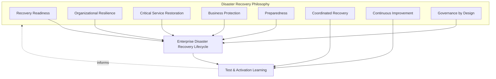
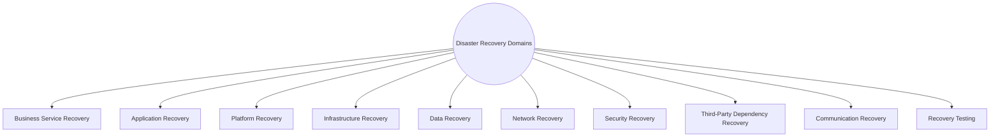
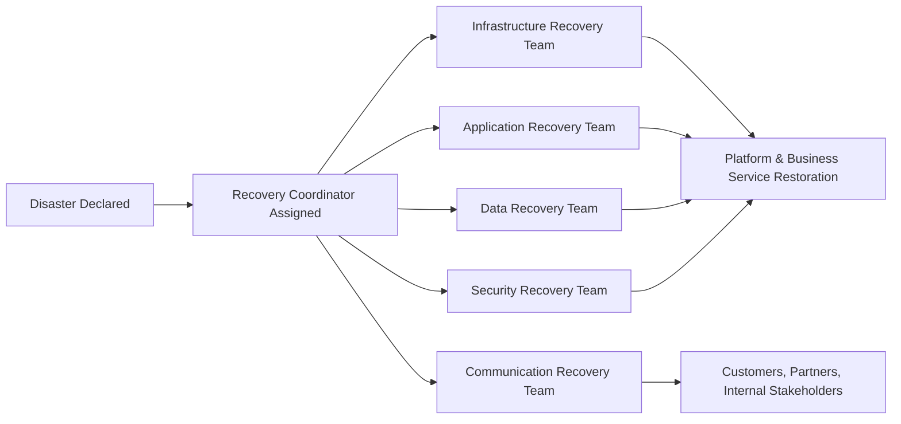
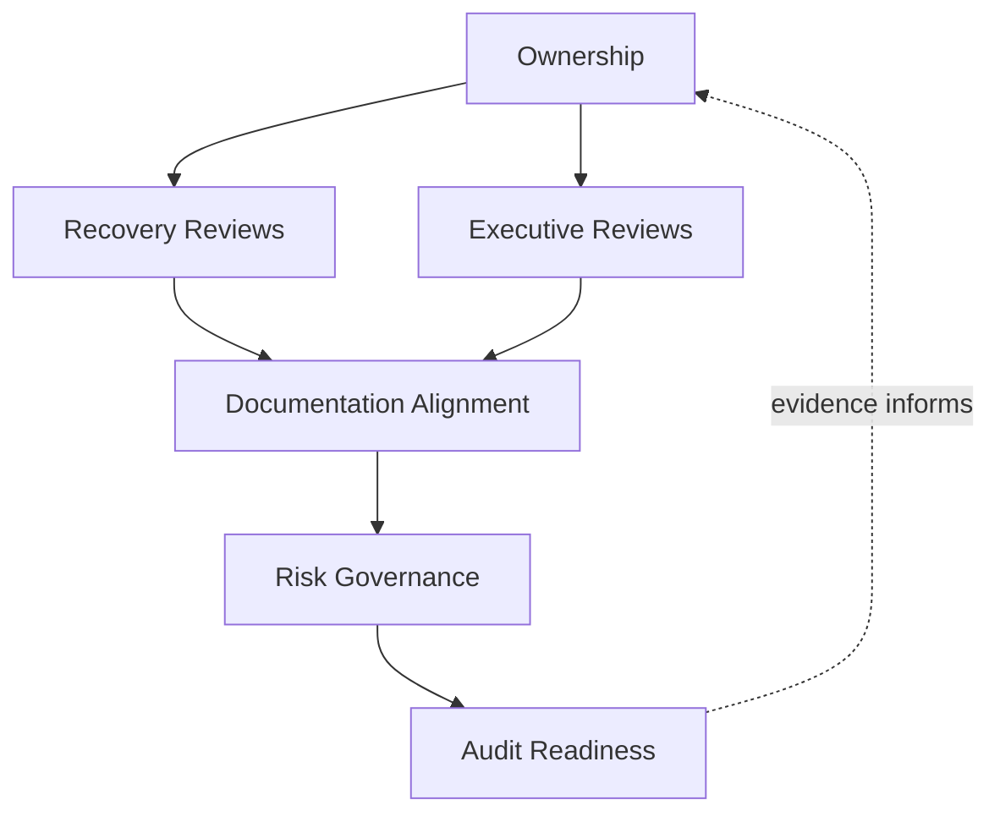
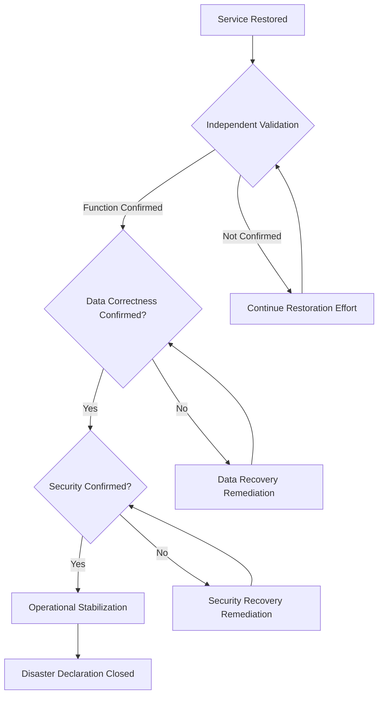
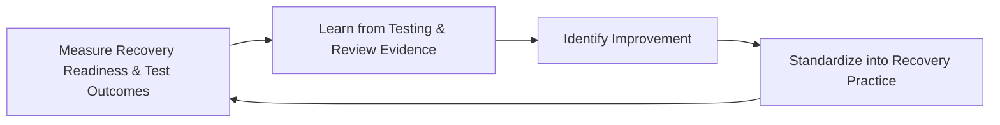

# Enterprise Disaster Recovery & Recovery Governance Strategy

## 1. Document Purpose

This document defines the official Enterprise Disaster Recovery (DR) & Recovery Governance Strategy for **StackLeo Tech Store**, from the perspective of enterprise operations. It establishes how the organization declares, coordinates, validates, and governs recovery from a severe disruption — independent of any specific disaster recovery software, backup solution, or recovery tool.

Two companion documents already govern adjacent aspects of disaster recovery: `06_Security/disaster-recovery.md` remains authoritative for DR philosophy and business-impact-driven recovery strategy, and `07_DevOps/disaster-recovery.md` governs the engineering and platform execution that delivers against that strategy technically. This document is the operational governance layer that sits across both: it defines how a disaster is formally declared, how recovery is coordinated across the whole organization (not only engineering), how recovery is validated and tested as an ongoing discipline, and how the organization reviews and matures its recovery capability over time, as a COO-owned operational responsibility.

- **Purpose of Disaster Recovery** — to ensure that when disruption exceeds what routine operational resilience can absorb, the organization has a clear, practiced, and governed path back to critical operation, rather than an improvised one assembled under the pressure of an active crisis.
- **Relationship with Business Continuity** — this document is the recovery-specific counterpart to `business-continuity.md`; continuity answers how the business keeps functioning through disruption, while this document answers how systems and services are formally recovered and validated as restored.
- **Relationship with Incident Management** — a Major Incident, per `incident-management.md` (Section 4.8), may escalate into a formal Disaster Declaration (Section 3.4) when its scope exceeds routine incident response capacity.
- **Relationship with Operations** — this document elaborates Disaster Recovery as introduced in `operations-overview.md` (Section 5.10), defining the operational governance of recovery capability day to day and through activation.
- **Relationship with Reliability Engineering** — recovery capability is the extreme end of the resilience spectrum engineered in `07_DevOps/sre-strategy.md`; this document governs how that engineered capability is declared, activated, and validated in practice.
- **Relationship with Operational Risk Management** — recovery investment and priority are set in proportion to genuine business risk, consistent with ISO 31000 thinking, directly informing Critical Asset Awareness (Section 3.2).
- **Relationship with Enterprise Governance** — a disaster declaration is among the most consequential operational decisions the organization can make; this document ensures that decision, and the recovery it triggers, is governed with executive accountability commensurate with its significance.

This document is implementation-independent and vendor-neutral. It defines disaster recovery philosophy, lifecycle, domains, and governance conceptually — not specific disaster recovery software, backup solutions, cloud providers, storage vendors, recovery tools, RTO/RPO values, recovery timelines, or infrastructure configuration.

## 2. Disaster Recovery Philosophy

Disaster recovery at StackLeo is governed by eight principles. Each exists to produce a specific business outcome — recovery is governed deliberately because of what is at stake when routine resilience is exceeded, not as a rare, forgettable contingency.

### 2.1 Recovery Readiness

The organization maintains a clear, practiced, current understanding of how it will recover before a disaster occurs, mirroring Preparedness in `business-continuity.md` (Section 2.5).

- **Business Value** — ensures the organization is genuinely ready when severe disruption occurs, rather than discovering gaps in the moment they matter most.

### 2.2 Organizational Resilience

Recovery capability spans the whole organization, not only technical systems, consistent with Organizational Resilience Framework thinking established in `business-continuity.md` (Section 4).

- **Business Value** — ensures recovery restores genuine business capability, not merely technically functioning systems that the business still cannot fully operate.

### 2.3 Critical Service Restoration

Recovery prioritizes the services identified as most essential to customers and the business, per Critical Capability Identification in `business-continuity.md` (Section 3.2).

- **Business Value** — ensures finite recovery effort restores what matters most first, rather than being applied evenly regardless of consequence.

### 2.4 Business Protection

Recovery decisions are made in service of protecting the business and its customers, not merely restoring technical systems for their own sake.

- **Business Value** — keeps recovery effort anchored to genuine business outcome throughout an event, not only technical completeness.

### 2.5 Preparedness

Recovery capability is validated in advance through testing, consistent with Recovery Testing (Section 4.10), never assumed adequate from documentation alone.

- **Business Value** — a recovery plan never tested may fail precisely when it is needed most, since documented intent does not guarantee real-world adequacy.

### 2.6 Coordinated Recovery

Recovery proceeds through a known, practiced organizational structure, consistent with Recovery Coordination (Section 3.5), rather than being improvised uniquely each time.

- **Business Value** — reduces confusion and wasted effort during exactly the moments when clarity and speed matter most.

### 2.7 Continuous Improvement

Recovery practice matures over time, informed by real tests, activations, and evolving business scale.

- **Business Value** — keeps recovery capability aligned with StackLeo's growth in scale, architectural complexity, and business model.

### 2.8 Governance by Design

Recovery governance structures are established deliberately as capability is built, not retrofitted once a gap has already caused harm during an actual disaster.

- **Business Value** — prevents the costly, high-stakes discovery of governance gaps during a live disaster rather than during calm, deliberate planning.

*Diagram 1: Disaster Recovery Philosophy Overview — the eight principles shape the enterprise disaster recovery lifecycle, and test and activation learning feed back into the philosophy itself.*

## 3. Enterprise Disaster Recovery Lifecycle

Disaster recovery is governed across ten conceptual stages, spanning from initial planning through continuous improvement.

### 3.1 Recovery Planning

- **Purpose** — determine how each critical capability will be recovered following a severe disruption.
- **Business Value** — converts abstract recovery intent into a concrete, actionable plan.
- **Governance Objectives** — require every critical business service (`service-catalog.md`, Section 4.8) to have a documented recovery plan.

### 3.2 Critical Asset Awareness

- **Purpose** — maintain a current understanding of which technical and organizational assets a recovery plan depends on.
- **Business Value** — ensures recovery planning is grounded in genuine, current dependency knowledge rather than assumption.
- **Governance Objectives** — draw directly on Configuration Relationships in `configuration-management.md` (Section 4.9) and Critical Business Services in `business-continuity.md` (Section 4.1).

### 3.3 Disaster Preparedness

- **Purpose** — establish the concrete readiness — trained people, validated procedures, confirmed alternatives — that recovery plans depend on.
- **Business Value** — ensures a plan on paper translates into genuine organizational capability under real conditions.
- **Governance Objectives** — require preparedness to be confirmed through Recovery Testing (Section 4.10), not assumed from the plan's existence alone.

### 3.4 Disaster Declaration

- **Purpose** — formally recognize that a disruption exceeds routine incident response capacity and requires activation of the disaster recovery lifecycle.
- **Business Value** — converts recovery activation into a deliberate, accountable decision rather than an ambiguous, gradual drift into crisis mode.
- **Governance Objectives** — require declaration authority to rest with a designated accountable executive role, per Recovery Governance (Section 6.1).

### 3.5 Recovery Coordination

- **Purpose** — organize the people, decisions, and communication required to execute recovery once declared.
- **Business Value** — ensures a coordinated, practiced response rather than an improvised one during the organization's most consequential technical moments.
- **Governance Objectives** — require a clear recovery coordination structure to be established and known in advance.

### 3.6 Service Restoration

- **Purpose** — restore affected services to acceptable operation, prioritized by criticality per Critical Service Restoration (Section 2.3).
- **Business Value** — directly limits the duration and depth of customer and business impact from the disaster.
- **Governance Objectives** — require restoration actions to be recorded as they are taken, supporting Recovery Review (Section 3.9).

### 3.7 Recovery Validation

- **Purpose** — confirm that restored services genuinely behave correctly, not merely appear to have recovered.
- **Business Value** — prevents the costly failure mode of declaring recovery complete while customers remain affected.
- **Governance Objectives** — require validation to be performed independently of the recovery execution effort itself.

### 3.8 Operational Stabilization

- **Purpose** — confirm that recovered operations are genuinely stable and sustainable, not merely temporarily functioning.
- **Business Value** — prevents a premature declaration of "recovered" that leaves the business exposed to renewed disruption.
- **Governance Objectives** — require explicit confirmation of stabilization before formally closing a disaster declaration.

### 3.9 Recovery Review

- **Purpose** — formally evaluate the disaster's cause, the recovery response, and its overall effectiveness once resolved.
- **Business Value** — converts the disaster into a structured opportunity for learning, consistent with Continuous Improvement (Section 2.7).
- **Governance Objectives** — require review for every formal disaster declaration, conducted with the same blameless discipline as Post-Incident Review in `incident-management.md` (Section 3.9).

### 3.10 Continuous Improvement

- **Purpose** — act on recovery review and testing findings to deliberately improve disaster recovery practice.
- **Business Value** — ensures recovery effectiveness compounds over time rather than remaining static as the platform and business grow.
- **Governance Objectives** — require improvement actions arising from recovery review to be documented and tracked to completion.

### Enterprise Disaster Recovery Lifecycle Matrix

| Stage | Purpose | Business Value | Governance Objective |
|---|---|---|---|
| Recovery Planning | Determine how critical capabilities will be recovered | Converts abstract intent into an actionable plan | Every critical service has a documented recovery plan |
| Critical Asset Awareness | Maintain current understanding of dependent assets | Grounds planning in genuine, current dependency knowledge | Draws on configuration relationships and critical service data |
| Disaster Preparedness | Establish concrete readiness plans depend on | Ensures plans translate into genuine capability | Confirmed through testing, not assumed |
| Disaster Declaration | Formally recognize disruption exceeds routine capacity | Converts activation into a deliberate, accountable decision | Declaration authority rests with a designated executive role |
| Recovery Coordination | Organize people, decisions, communication for recovery | Ensures coordinated, practiced response | Clear structure established and known in advance |
| Service Restoration | Restore affected services prioritized by criticality | Directly limits duration and depth of impact | Restoration actions recorded as they are taken |
| Recovery Validation | Confirm restored services genuinely behave correctly | Prevents declaring recovery complete while unverified | Performed independently of recovery execution effort |
| Operational Stabilization | Confirm recovered operations are genuinely stable | Prevents premature declaration of "recovered" | Explicit confirmation required before closing declaration |
| Recovery Review | Formally evaluate cause, response, and effectiveness | Converts the disaster into structured learning | Required for every formal disaster declaration |
| Continuous Improvement | Act on findings to improve recovery practice | Effectiveness compounds over time | Improvement actions tracked to completion |

*Diagram 2: Enterprise Disaster Recovery Lifecycle — a continuous cycle in which recovery review and improvement directly inform the next iteration of recovery planning.*

## 4. Disaster Recovery Domains

Disaster recovery spans ten conceptual domains, each addressing a distinct dimension of what must be recovered following a severe disruption.

### 4.1 Business Service Recovery

- **Purpose** — restore the business-facing services defined in `service-catalog.md` to acceptable operation.
- **Scope** — the service-level entry point into the broader recovery effort, prioritized by criticality.
- **Governance Expectations** — recovery priority order is pre-established, not decided improvisationally during the event.
- **Business Importance** — represents the ultimate purpose of recovery; all other domains serve this one.

### 4.2 Application Recovery

- **Purpose** — restore application-level components and logic to correct function.
- **Scope** — informed by Application Configuration Items in `configuration-management.md` (Section 4.3).
- **Governance Expectations** — coordinated with `07_DevOps/disaster-recovery.md` engineering execution.
- **Business Importance** — restores the business logic customers and operations directly depend on.

### 4.3 Platform Recovery

- **Purpose** — restore shared platform capability that multiple services depend on.
- **Scope** — informed by Platform Configuration Items in `configuration-management.md` (Section 4.4).
- **Governance Expectations** — prioritized highly given its multiplied impact across the service portfolio.
- **Business Importance** — recovering shared capability restores multiple dependent services simultaneously.

### 4.4 Infrastructure Recovery

- **Purpose** — restore the underlying technical environment services run on.
- **Scope** — coordinated with `07_DevOps/disaster-recovery.md` and `07_DevOps/infrastructure-as-code.md` execution.
- **Governance Expectations** — infrastructure recovery is sequenced explicitly relative to application and platform recovery, since dependencies typically flow in that direction.
- **Business Importance** — provides the foundation every other technical recovery domain depends on.

### 4.5 Data Recovery

- **Purpose** — restore data to a correct, consistent, and trustworthy state following disruption.
- **Scope** — coordinated with `04_Database/backup-recovery.md`, focused here on the operational governance of data recovery execution.
- **Governance Expectations** — data recovery validation explicitly confirms both availability and correctness, not availability alone.
- **Business Importance** — protects the integrity of the information the business and its customers depend on for financial and operational decisions.

### 4.6 Network Recovery

- **Purpose** — restore the connectivity paths customers, partners, and internal systems depend on.
- **Scope** — conceptual network path restoration, coordinated with infrastructure recovery.
- **Governance Expectations** — network recovery is validated as a distinct step, since restored compute and storage remain unreachable without it.
- **Business Importance** — even fully restored systems provide no value if customers and partners cannot reach them.

### 4.7 Security Recovery

- **Purpose** — confirm that recovered systems and data are genuinely secure, not merely functionally restored.
- **Scope** — governed jointly with `06_Security/incident-response.md` and `06_Security/disaster-recovery.md`, particularly where the disaster originated from or coincided with a security event.
- **Governance Expectations** — security validation is required before recovered services are considered fully restored, never bypassed for speed.
- **Business Importance** — prevents a recovery from inadvertently restoring or reintroducing a security weakness.

### 4.8 Third-Party Dependency Recovery

- **Purpose** — coordinate recovery with external dependencies — payment providers, couriers, future marketplace partners — affected by or contributing to the disaster.
- **Scope** — informed by External Dependency Configuration Items in `configuration-management.md` (Section 4.8) and Vendor & Partner Continuity in `business-continuity.md` (Section 4.6).
- **Governance Expectations** — recovery coordination includes explicit communication with affected partners, not only internal recovery effort.
- **Business Importance** — protects customers from disruption whose full resolution depends on parties StackLeo does not directly control.

### 4.9 Communication Recovery

- **Purpose** — restore and maintain the organization's ability to communicate throughout the recovery effort.
- **Scope** — coordinated with Communication Continuity in `business-continuity.md` (Section 4.7).
- **Governance Expectations** — communication capability is itself treated as a recovery priority, not assumed to remain unaffected.
- **Business Importance** — a well-communicated recovery preserves substantially more trust than a technically well-executed but poorly communicated one.

### 4.10 Recovery Testing

- **Purpose** — validate disaster recovery plans and capability through deliberate, periodic exercises, distinct from real activation.
- **Scope** — cross-cutting; tests every other domain in this section under controlled, non-crisis conditions.
- **Governance Expectations** — testing is conducted on a regular, predictable cadence, connected to Recovery Reviews in Section 6.
- **Business Importance** — is the only way to genuinely confirm recovery capability works before it is needed for real.

### Disaster Recovery Domain Matrix

| Domain | Purpose | Governance Expectations | Business Importance |
|---|---|---|---|
| Business Service Recovery | Restore business-facing services to operation | Recovery priority order pre-established | Represents the ultimate purpose of recovery |
| Application Recovery | Restore application-level components and logic | Coordinated with engineering execution practice | Restores business logic customers and operations depend on |
| Platform Recovery | Restore shared platform capability | Prioritized given multiplied portfolio impact | Recovers multiple dependent services simultaneously |
| Infrastructure Recovery | Restore the underlying technical environment | Sequenced explicitly relative to application/platform recovery | Provides the foundation other technical recovery depends on |
| Data Recovery | Restore data to correct, consistent, trustworthy state | Validation confirms correctness, not just availability | Protects integrity of business- and customer-critical information |
| Network Recovery | Restore connectivity paths for all dependents | Validated as a distinct step from compute/storage recovery | Restored systems provide no value if unreachable |
| Security Recovery | Confirm recovered systems/data are genuinely secure | Required before services considered fully restored | Prevents recovery from reintroducing a security weakness |
| Third-Party Dependency Recovery | Coordinate recovery with external dependencies | Includes explicit partner communication | Protects customers from disruption outside direct control |
| Communication Recovery | Restore and maintain communication throughout recovery | Communication itself treated as a recovery priority | Preserves trust through well-communicated recovery |
| Recovery Testing | Validate plans and capability through periodic exercise | Conducted on a regular, predictable cadence | Only way to genuinely confirm capability before real need |

*Diagram 3 (Part A): Recovery Coordination Operating Model — ten domains, each requiring coordinated recovery effort, together forming the organization's complete restoration posture.*

*Diagram 3 (Part B): Recovery Coordination Operating Model — a designated recovery coordinator engages domain-specific teams in parallel, converging on restored business services while communication reaches all stakeholders.*

## 5. Disaster Recovery Governance Principles

- **Executive Ownership** — disaster recovery is owned at the executive level, consistent with Governance by Design (Section 2.8), reflecting the significance of a formal disaster declaration.
- **Accountability** — every recovery domain (Section 4) has a specific, named accountable owner, never left to diffuse, shared-by-default responsibility.
- **Recovery Preparedness** — recovery capability is validated in advance through Recovery Testing (Section 4.10), not assumed adequate from documentation alone.
- **Validation** — every recovery is confirmed to genuinely restore correct function, consistent with Recovery Validation (Section 3.7), never assumed from restoration activity alone.
- **Communication** — recovery governance ensures communication capability itself is protected and prioritized, consistent with Communication Recovery (Section 4.9).
- **Auditability** — recovery plans, test outcomes, and declaration records can be independently reviewed after the fact.
- **Risk Awareness** — recovery governance decisions are made with explicit awareness of business risk, consistent with ISO 31000 thinking.
- **Continuous Improvement** — recovery governance itself matures over time, informed by real tests and activations.

### Disaster Recovery Governance Principle Matrix

| Principle | Description | Business Value |
|---|---|---|
| Executive Ownership | Recovery owned at the executive level | Reflects significance commensurate with a formal declaration |
| Accountability | Every domain has a specific, named accountable owner | Prevents diffuse responsibility from becoming no responsibility |
| Recovery Preparedness | Capability validated through testing, not assumed | Ensures genuine readiness, not merely documented intent |
| Validation | Every recovery confirmed to genuinely restore function | Prevents declaring recovery complete while unverified |
| Communication | Communication capability itself is protected and prioritized | Preserves coordination and trust throughout recovery |
| Auditability | Plans, tests, and declarations independently reviewable | Supports accountability and confidence for partners and regulators |
| Risk Awareness | Decisions made with explicit awareness of business risk | Enables deliberate, informed risk-based prioritization |
| Continuous Improvement | Governance matures from real tests and activations | Keeps recovery capability aligned with organizational growth |

## 6. Recovery Governance

### 6.1 Ownership

Every disaster recovery domain (Section 4) has a designated accountable owner; overall recovery governance is owned jointly by Operations and SRE leadership, with Disaster Declaration authority (Section 3.4) resting with executive leadership.

### 6.2 Recovery Reviews

Recovery plans and Recovery Testing outcomes (Section 4.10) are formally reviewed on a recurring basis, ensuring Preparedness (Section 2.5) is a deliberate governance act, not an informal assumption.

### 6.3 Executive Reviews

Every formal Disaster Declaration and its subsequent Recovery Review (Section 3.9) is reviewed with executive stakeholders, consistent with Executive Reviews in `business-continuity.md` (Section 6).

### 6.4 Documentation Alignment

Disaster recovery documentation is kept consistent with `06_Security/disaster-recovery.md`, `07_DevOps/disaster-recovery.md`, `business-continuity.md`, and `configuration-management.md`; a recovery plan that contradicts current configuration or continuity documentation is treated as a governance gap.

### 6.5 Risk Governance

Recovery-related risk — untested plans, single points of failure in recovery capability, deferred recovery testing — is tracked, prioritized, and escalated consistently, ensuring accepted risk is always a deliberate, accountable decision.

### 6.6 Audit Readiness

Recovery plans, test records, declaration decisions, and recovery review outcomes are retained in a form that can be independently reviewed after the fact, supporting internal governance and partner or regulatory review where relevant.

### Recovery Governance Matrix

| Governance Area | Objective |
|---|---|
| Ownership | Every recovery domain has a designated accountable owner; declaration authority rests with executives |
| Recovery Reviews | Testing outcomes reviewed recurringly, preparedness is deliberate |
| Executive Reviews | Every formal declaration reviewed with executive stakeholders |
| Documentation Alignment | Recovery documentation stays consistent with configuration and continuity practice |
| Risk Governance | Accepted recovery risk is always a deliberate, accountable decision |
| Audit Readiness | Plans, tests, declarations, and reviews retained for independent review |

*Diagram 2b: Disaster Recovery Governance Framework — ownership anchors review activity, which feeds documentation alignment, risk governance, and ultimately auditable evidence.*

*Diagram 4: Disaster Recovery Validation Flow — restored services proceed through independent functional, data correctness, and security validation before stabilization and formal closure of the disaster declaration.*

### Governance Responsibility Matrix

| Role | Responsibility |
|---|---|
| COO / Executive Leadership | Owns coherence and enforcement of this disaster recovery strategy, and holds Disaster Declaration authority (Section 3.4). |
| Recovery Coordinator | Owns Recovery Coordination (Section 3.5) during an active declaration. |
| SRE Lead | Owns technical recovery execution jointly with `07_DevOps/disaster-recovery.md`. |
| Service Owners | Own Business Service Recovery plans (Section 4.1) for their respective services. |
| Security Lead | Owns Security Recovery validation (Section 4.7) jointly with `06_Security/disaster-recovery.md`. |
| Database / Data Lead | Owns Data Recovery validation (Section 4.5) jointly with `04_Database/backup-recovery.md`. |
| Communications Lead | Owns Communication Recovery (Section 4.9) practice during an activation. |
| Internal Audit / Review Function | Independently verifies that recovery governance records reflect actual practice. |

## 7. Future Readiness

This strategy is designed to remain valid as StackLeo evolves in scale and architectural complexity, without requiring redefinition of its underlying philosophy.

- **Cloud-Native Platforms** — recovery domains (Section 4) are defined independently of any specific runtime or deployment model, so they apply unchanged as infrastructure evolves.
- **AI-Enabled Operations** — where AI-assisted techniques support recovery coordination or impact assessment during an event, they operate within the same Validation and Risk Awareness principles (Section 5) as any other recovery practice, never replacing accountable executive decision-making during a declaration.
- **Marketplace Platform** — the multi-vendor marketplace model extends Business Service and Third-Party Dependency Recovery (Sections 4.1, 4.8) to cover seller-facing services and seller-side dependencies.
- **Multi-Tenant Architecture** — where future architecture introduces tenant isolation, Application and Platform Recovery (Sections 4.2–4.3) extend to explicitly address cross-tenant recovery sequencing.
- **Multi-Region Operations** — as StackLeo expands from Bangladesh into South Asia and beyond, Network and Infrastructure Recovery (Sections 4.6, 4.4) extend to cover region-specific recovery topology.
- **Global Business Expansion** — Recovery Coordination (Section 3.5) extends to address distributed teams and multi-region recovery execution as the business grows beyond its current footprint.
- **Enterprise Scale** — the recovery lifecycle, domains, and governance defined in Sections 3–6 are defined independently of organizational size or structure, so they remain coherent as the business grows substantially.
- **Evolving Disaster Risks** — Critical Asset Awareness and Recovery Planning (Sections 3.1–3.2) are structured to be revisited as new categories of disruption emerge, ensuring the strategy adapts to genuinely new risks rather than only historical ones.

## 8. Governance

- **Ownership** — the COO (or equivalent accountable executive function) owns this strategy and is accountable for its consistent application across the platform, in partnership with SRE and Security leadership.
- **Review Process** — this strategy is formally reviewed whenever a material change occurs in architecture (`03_System_Design`), the service catalog (`service-catalog.md`), or security recovery philosophy (`06_Security/disaster-recovery.md`), and on a regular recurring cadence independent of specific change events.
- **Disaster Recovery Policies** — subordinate, practice-specific recovery documents (domain-specific plans, test schedules) must remain consistent with the philosophy, lifecycle, and domains defined here.
- **Audit Readiness** — this strategy and the evidence it requires (Section 6.6) are maintained in a state ready for internal or external audit at any time, without requiring advance preparation.
- **Continuous Improvement** — this strategy itself is subject to Continuous Improvement (Section 2.7, Section 3.10); its effectiveness is periodically assessed and revised based on genuine test, activation, and organizational evidence.

*Diagram 5: Continuous Disaster Recovery Improvement Cycle — readiness and test outcomes are measured, learned from, improved upon, and standardized back into practice, on a continuing basis.*

## 9. Disaster Recovery Maturity Model

Disaster recovery maturity is described across five conceptual levels, adapted from established process maturity thinking. Progression reflects increasing consistency, measurement, and deliberate improvement — not merely increasing plan documentation volume.

- **Initial** — recovery planning, where it exists, is informal and untested; critical assets are not clearly identified, and recovery depends heavily on individual improvisation during an actual event.
- **Managed** — basic recovery plans exist for individual critical services, but consistency and testing across domains (Section 4) vary significantly.
- **Defined** — recovery planning, testing, and governance are standardized, documented, and consistently applied across the organization, consistent with the lifecycle and domains defined throughout this document; ownership is clear organization-wide.
- **Measured** — recovery readiness is measured systematically through test outcomes and coverage assessment, and decisions are grounded in genuine evidence rather than qualitative impression alone.
- **Optimizing** — recovery practice is continuously and deliberately improved based on quantitative evidence and organizational learning; improvement itself is a managed, ongoing discipline rather than an occasional initiative.

### Disaster Recovery Maturity Model Matrix

| Level | Characteristics | Primary Focus |
|---|---|---|
| Initial | Informal, untested planning; critical assets not clearly identified | Ad hoc, individually-dependent recovery |
| Managed | Basic plans exist per critical service; consistency and testing vary | Service-level consistency |
| Defined | Standardized, documented planning and governance applied organization-wide | Organization-wide consistency and clear ownership |
| Measured | Readiness measured systematically through testing and coverage assessment | Evidence-based recovery decisions |
| Optimizing | Practice continuously and deliberately improved from evidence | Sustained, deliberate improvement as a discipline |

*Diagram 6: Disaster Recovery Maturity Progression Model — maturity advances from informal, untested planning toward standardized, measured, and continuously optimized recovery practice.*

## 10. Anti-Patterns

The following recurring failure patterns are explicitly recognized and avoided, as each one structurally undermines this strategy.

| Anti-Pattern | Why It's Avoided |
|---|---|
| Recovery Without Planning | Contradicts Recovery Planning (Section 3.1); improvising a recovery approach during an actual disaster wastes precious time and increases the risk of a poor outcome. |
| Untested Recovery Procedures | Contradicts Recovery Testing (Section 4.10) and Preparedness (Section 2.5); a plan never validated may fail precisely when it is needed most. |
| Weak Recovery Ownership | Contradicts Accountability (Section 5.2); without a named owner per domain, recovery readiness has no one specifically responsible for sustaining it. |
| Poor Communication | Undermines Communication Recovery (Section 4.9); a poorly communicated recovery erodes trust independent of how well the underlying restoration is actually executed. |
| Missing Validation | Contradicts Recovery Validation (Section 3.7); declaring recovery complete without independent confirmation risks customers remaining affected unnoticed. |
| Weak Documentation | Undermines Documentation Alignment (Section 6.4), leaving recovery plans disconnected from current configuration and continuity practice. |
| Weak Governance | Undermines Section 6.1; without clear ownership and review, recovery capability drifts into inconsistency and neglect as the platform and organization grow. |
| Missing Continuous Improvement | Contradicts Continuous Improvement (Section 2.7, Section 3.10); without deliberate improvement, recovery capability stagnates as the business and platform grow in complexity. |

## 11. Document Information

| Property | Value |
|----------|-------|
| Document | disaster-recovery.md |
| Version | 1.0.0 |
| Status | Active |
| Maintained By | StackLeo |
| Last Updated | 2026-07-24 |

---

© StackLeo. All Rights Reserved.
