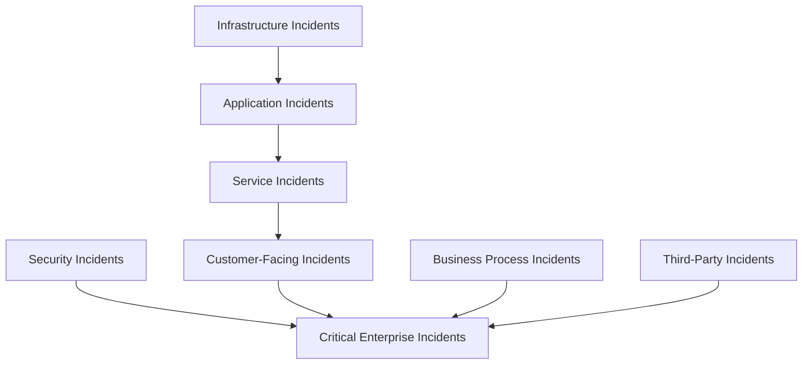
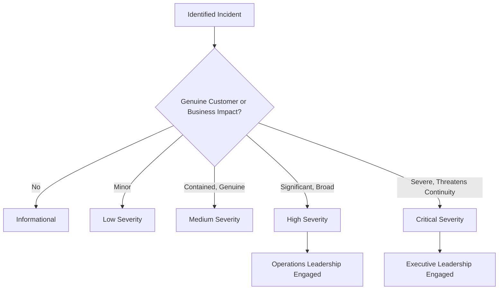
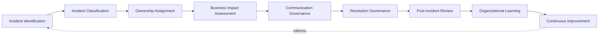
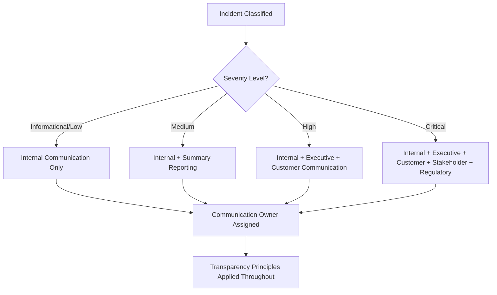
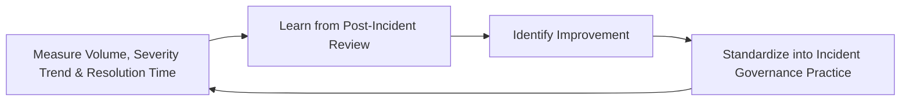
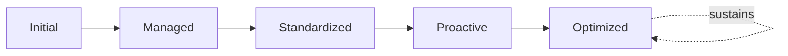

# Enterprise Incident Management Framework

## 1. Executive Summary

**Purpose** — This document defines the official Enterprise Incident Management Framework for **StackLeo Tech Store**. It establishes incident governance, severity classification, ownership, communication governance, business impact management, organizational learning, executive oversight, and long-term incident management maturity as a single, consolidated governance reference. `incident-management-governance.md` remains the COO/CIO-owned executive charter for incident management at StackLeo, and `incident-management.md` remains the operational governance framework elaborating incident domains, lifecycle, and cross-functional coordination in full depth. This framework does not compete with either for authority. It is the consolidated governance reference that synthesizes severity classification, communication, risk, and executive oversight across every category of incident into one coherent document.

**Scope** — This framework applies to every category of incident at StackLeo — service, application, security, infrastructure, customer-facing, business process, third-party, and critical enterprise incidents — coordinated with `incident-management-governance.md`, `incident-management.md`, and `operations-strategy.md`.

**Strategic Objectives** — To ensure every incident is governed by clear ownership and deliberate escalation, never left to whoever happens to notice first; that incident severity is classified consistently and proportionate response follows; that stakeholders are communicated with honestly and promptly; and that executive leadership has one coherent, consolidated view of the organization's incident management posture and learning.

**Business Value** — A consolidated incident management framework protects the organization from the risk of response gaps hiding in the seams between separately-maintained domain documents, protects customer trust through how deliberately and transparently StackLeo handles disruption, and gives executive leadership confidence that incidents are genuinely and coherently governed end to end.

**Intended Audience** — The Board of Directors, executive leadership, the Chief Technology Officer, operations leadership, the Incident Management Team, engineering leadership, security leadership, customer support leadership, and business stakeholders.

## 2. Enterprise Incident Management Vision

- **Incident Management as Business Resilience** — incident management is governed as a genuine business resilience capability, never merely a technical response function.
- **Customer Trust Protection** — how deliberately and transparently StackLeo responds to an incident is as consequential to customer trust as the incident itself.
- **Operational Stability** — incident management protects the organization's ability to return quickly to genuine operational stability.
- **Business Continuity** — incident management protects the organization's ability to keep operating through genuine disruption, coordinated with `business-continuity-governance.md`.
- **Rapid Organizational Recovery** — incident management prioritizes genuine, timely restoration of acceptable service.
- **Continuous Learning** — every incident is governed to deepen the organization's genuine collective understanding of how the platform actually behaves.
- **Sustainable Service Excellence** — incident management is pursued as a durable discipline, never a reactive scramble repeated each time.

### Enterprise Incident Management Vision Matrix

| Vision Element | Focus | Business Value |
|---|---|---|
| Incident Management as Business Resilience | A genuine business resilience capability | Prevents incident management from being treated as purely technical |
| Customer Trust Protection | Deliberate, transparent handling as consequential as the incident | Protects the trust relationship every disruption tests |
| Operational Stability | Protects the ability to return quickly to genuine stability | Minimizes the duration of customer and business impact |
| Business Continuity | Protects the ability to keep operating through disruption | Protects revenue and commitments tied to continuous service |
| Rapid Organizational Recovery | Prioritizes genuine, timely restoration | Reduces the largest single cost component of any incident |
| Continuous Learning | Deepens genuine collective understanding | Converts disruption cost into a lasting organizational asset |
| Sustainable Service Excellence | A durable discipline, not a reactive scramble | Protects response quality from eroding under repeated pressure |

## 3. Incident Governance Principles

Incident governance at StackLeo rests on nine principles, each producing a specific business outcome.

- **Customer Impact First** — every incident decision is weighed first against its genuine effect on customers. *Business Value:* keeps incident response connected to the organization's most fundamental obligation.
- **Clear Ownership** — every incident traces to a specific, named, accountable owner from the moment it is identified. *Business Value:* ensures no incident is left unaddressed because no one was genuinely responsible for it.
- **Accountability** — every incident decision traces to the accountable person who made it. *Business Value:* ensures response decisions can be genuinely defended, not merely assumed reasonable.
- **Timely Communication** — stakeholders are informed of a genuine incident without avoidable delay. *Business Value:* prevents decision-makers and customers from being surprised by disruption they were never told about.
- **Transparency** — incident status, cause, and resolution are documented and visible to those who genuinely need them. *Business Value:* protects trust in how StackLeo handles disruption, not merely whether it occurs.
- **Risk Awareness** — incident response decisions are made with genuine, explicit awareness of the risk they carry. *Business Value:* prevents a hasty response decision from introducing a second, avoidable failure.
- **Root Cause Learning** — every incident is investigated for its genuine underlying cause, not merely its immediate symptom. *Business Value:* converts a resolved incident into genuine prevention of its recurrence.
- **Continuous Improvement** — incident management practice matures over time, informed by real response outcomes. *Business Value:* keeps incident management aligned with the organization's growing scale and complexity.
- **Business Alignment** — incident severity and priority are set by genuine business consequence, coordinated with `01_Business/business-model.md`. *Business Value:* ensures response effort is spent on what genuinely matters to the business.

### Incident Governance Principles Matrix

| Principle | Description | Business Value |
|---|---|---|
| Customer Impact First | Every decision weighed first against customer effect | Keeps response connected to the fundamental customer obligation |
| Clear Ownership | Every incident traces to a specific, accountable owner | Ensures no incident is left unaddressed |
| Accountability | Every decision traces to the accountable person | Ensures decisions can be genuinely defended |
| Timely Communication | Stakeholders informed without avoidable delay | Prevents decision-makers being surprised by disruption |
| Transparency | Status, cause, and resolution documented and visible | Protects trust in how disruption is handled |
| Risk Awareness | Decisions made with explicit awareness of carried risk | Prevents a hasty decision introducing a second failure |
| Root Cause Learning | Investigated for genuine underlying cause, not just symptom | Converts resolution into genuine prevention of recurrence |
| Continuous Improvement | Practice matures from real response outcomes | Keeps management aligned with growing scale and complexity |
| Business Alignment | Severity and priority set by genuine business consequence | Ensures response effort is spent on what genuinely matters |

## 4. Enterprise Incident Governance Model

Incident governance operates across eight conceptual domains, each holding accountability for a distinct category of incident.

### Service Incidents

- **Purpose** — govern incidents affecting a defined business service and its committed level.
- **Governance Scope** — coordinated with `service-management.md` and Service Operations (`operations-strategy.md`, Section 4).
- **Business Value** — protects the commitments StackLeo makes to customers and business partners.
- **Executive Expectations** — leadership expects service incidents to be resolved against genuine committed level, not assumed acceptable.

### Application Incidents

- **Purpose** — govern incidents originating in application-level behavior and business logic.
- **Governance Scope** — coordinated with `07_DevOps/incident-observability.md`.
- **Business Value** — protects confidence that application disruption can be genuinely understood and resolved.
- **Executive Expectations** — leadership expects application incidents to support investigation without excessive, unmanaged volume.

### Security Incidents

- **Purpose** — govern incidents arising from a genuine security event, jointly with, and never superseding, `06_Security/incident-response.md`.
- **Governance Scope** — oversight ensuring security incidents meet the rigor `security-strategy.md` requires.
- **Business Value** — protects StackLeo's core trust differentiator through genuine security incident response.
- **Executive Expectations** — leadership expects security incidents to be treated as mandatory, non-negotiable escalation.

### Infrastructure Incidents

- **Purpose** — govern incidents originating in the platform's underlying technical foundation.
- **Governance Scope** — coordinated with `07_DevOps/infrastructure-as-code.md` and Infrastructure Operations coordination.
- **Business Value** — protects the technical foundation every other incident domain ultimately depends on.
- **Executive Expectations** — leadership expects infrastructure incidents to be governed with consistent rigor regardless of scale.

### Customer-Facing Incidents

- **Purpose** — govern incidents genuinely visible to, or experienced by, a customer.
- **Governance Scope** — coordinated with Customer Operations (`operations-strategy.md`, Section 4), with heightened communication sensitivity.
- **Business Value** — protects the trust relationship every customer interaction depends on.
- **Executive Expectations** — leadership expects customer-facing incidents to receive the most deliberate, transparent communication.

### Business Process Incidents

- **Purpose** — govern incidents disrupting a genuine business process, technical or non-technical.
- **Governance Scope** — coordinated with `01_Business/business-model.md` and Business Operations (`operations-strategy.md`, Section 4).
- **Business Value** — connects incident response directly to genuine business consequence.
- **Executive Expectations** — leadership expects business process incidents to answer genuine business questions, not only technical ones.

### Third-Party Incidents

- **Purpose** — govern incidents originating in a vendor or integration partner StackLeo does not directly control.
- **Governance Scope** — coordinated with `06_Security/third-party-risk-governance.md`.
- **Business Value** — protects the ability to investigate and attribute failure originating in an external dependency.
- **Executive Expectations** — leadership expects third-party incidents to be governed with elevated scrutiny given reduced direct oversight.

### Critical Enterprise Incidents

- **Purpose** — govern the synthesized, executive-relevant response to the organization's most consequential incidents.
- **Governance Scope** — oversight exclusively accountable for converging every domain above into a single enterprise-level response.
- **Business Value** — protects leadership's ability to respond to the organization's most significant disruption as one coordinated effort.
- **Executive Expectations** — leadership expects to be engaged directly, not merely informed, for critical enterprise incidents.

### Incident Governance Matrix

| Domain | Purpose | Business Value | Executive Expectations |
|---|---|---|---|
| Service Incidents | Govern incidents affecting a defined business service | Protects commitments made to customers and partners | Expects resolution against genuine committed level |
| Application Incidents | Govern incidents in application behavior and logic | Protects confidence disruption can be understood and resolved | Expects support for investigation without excessive volume |
| Security Incidents | Govern incidents arising from a genuine security event | Protects StackLeo's core trust differentiator | Expects treatment as mandatory, non-negotiable escalation |
| Infrastructure Incidents | Govern incidents in the technical foundation | Protects the foundation every other domain depends on | Expects consistent rigor regardless of scale |
| Customer-Facing Incidents | Govern incidents visible to or experienced by a customer | Protects the trust relationship every interaction depends on | Expects the most deliberate, transparent communication |
| Business Process Incidents | Govern incidents disrupting a genuine business process | Connects response to genuine business consequence | Expects answers to genuine business questions |
| Third-Party Incidents | Govern incidents from external dependencies | Protects ability to investigate and attribute external failure | Expects elevated scrutiny given reduced direct oversight |
| Critical Enterprise Incidents | Synthesize response to the most consequential incidents | Protects leadership's ability to respond as one coordinated effort | Expects direct engagement, not merely information |

*Diagram 1: Enterprise Incident Governance Framework — infrastructure and application incidents feed service incidents, which converge with security, business process, and third-party incidents on critical enterprise incidents requiring the highest coordinated response.*

## 5. Incident Severity Governance

Incident severity is governed across five conceptual levels, each carrying a distinct governance objective. Remaining implementation independent, this framework classifies severity by genuine business impact — never by technical detail or tool-specific scoring.

### Informational

- **Business Impact** — no genuine customer or business impact; awareness only.
- **Governance Expectations** — logged for context, no formal response required.
- **Executive Visibility** — none required.
- **Decision Authority** — held at the individual responder level.

### Low Severity

- **Business Impact** — minor, negligible impact on customers or business operation.
- **Governance Expectations** — addressed through routine process, without urgent escalation.
- **Executive Visibility** — none required, available on request.
- **Decision Authority** — held at the team level.

### Medium Severity

- **Business Impact** — genuine but contained impact affecting a limited set of customers or a non-critical process.
- **Governance Expectations** — addressed promptly within a defined, bounded window.
- **Executive Visibility** — summary visibility through routine reporting.
- **Decision Authority** — held at the Incident Management Team level.

### High Severity

- **Business Impact** — significant impact genuinely affecting a broad set of customers or a critical business process.
- **Governance Expectations** — addressed with elevated urgency and cross-functional coordination.
- **Executive Visibility** — direct visibility to Operations Leadership and the CTO.
- **Decision Authority** — held at Operations Leadership level, escalating as needed.

### Critical Severity

- **Business Impact** — severe, genuine threat to platform availability, customer trust, or business continuity.
- **Governance Expectations** — immediate, enterprise-wide response coordinated as a Critical Enterprise Incident (Section 4).
- **Executive Visibility** — direct, real-time engagement of executive leadership and, where warranted, the Board.
- **Decision Authority** — held at Executive Leadership level.

### Incident Severity Matrix

| Severity | Business Impact | Governance Expectations | Executive Visibility | Decision Authority |
|---|---|---|---|---|
| Informational | No genuine customer or business impact | Logged for context, no formal response | None required | Individual responder |
| Low Severity | Minor, negligible impact | Addressed through routine process | None required, available on request | Team level |
| Medium Severity | Genuine but contained impact | Addressed promptly within a bounded window | Summary visibility through routine reporting | Incident Management Team |
| High Severity | Significant impact on a broad set of customers | Elevated urgency and cross-functional coordination | Direct visibility to Operations Leadership and CTO | Operations Leadership |
| Critical Severity | Severe threat to availability, trust, or continuity | Immediate, enterprise-wide coordinated response | Direct, real-time executive and Board engagement | Executive Leadership |

*Diagram 3: Incident Severity Decision Flow — an identified incident is classified by genuine customer or business impact into one of five severity levels, with high severity engaging Operations Leadership and critical severity engaging executive leadership directly.*

## 6. Incident Lifecycle Governance

Incident governance operates across nine conceptual lifecycle stages.

- **Incident Identification** — govern how a genuine incident is recognized and formally opened.
- **Incident Classification** — govern how an identified incident is assigned to the appropriate domain (Section 4) and severity (Section 5).
- **Ownership Assignment** — govern how a classified incident is assigned to a specific, accountable owner.
- **Business Impact Assessment** — govern how an incident's genuine business consequence is assessed.
- **Communication Governance** — govern how stakeholders are informed throughout the incident, coordinated with Section 7.
- **Resolution Governance** — govern how an incident is confirmed genuinely resolved, not merely appearing stable.
- **Post-Incident Review** — govern the formal, structured review of a resolved incident for genuine root cause and learning.
- **Organizational Learning** — govern how understanding gained from an incident is captured as durable organizational knowledge.
- **Continuous Improvement** — govern how incident management practice is deliberately strengthened based on real response outcomes.

### Incident Lifecycle Matrix

| Stage | Governance Objective | Business Value |
|---|---|---|
| Incident Identification | Recognize and formally open a genuine incident | Ensures response begins from genuine, timely awareness |
| Incident Classification | Assign to the appropriate domain and severity | Ensures consistent, proportionate treatment |
| Ownership Assignment | Assign to a specific, accountable owner | Ensures no incident is left unaddressed |
| Business Impact Assessment | Assess genuine business consequence | Ensures response urgency reflects genuine stakes |
| Communication Governance | Inform stakeholders throughout the incident | Prevents stakeholders from being surprised by disruption |
| Resolution Governance | Confirm genuine, not merely apparent, resolution | Prevents a prematurely closed incident from recurring |
| Post-Incident Review | Formally review for genuine root cause and learning | Converts resolution into genuine prevention |
| Organizational Learning | Capture understanding as durable organizational knowledge | Converts incident cost into a lasting organizational asset |
| Continuous Improvement | Strengthen practice from real response outcomes | Keeps management practice compounding in capability |

*Diagram 2: Incident Lifecycle Governance Model — identification and classification inform ownership assignment and business impact assessment, feeding communication and resolution governance, with post-incident review, organizational learning, and continuous improvement feeding lessons back into the cycle.*

## 7. Communication Governance

- **Executive Communication** — governs how and when executive leadership is genuinely informed of an incident, proportionate to its severity.
- **Internal Communication** — governs how internal teams remain genuinely coordinated and informed throughout an incident.
- **Customer Communication** — governs how customers are genuinely and honestly informed of an incident affecting them.
- **Stakeholder Communication** — governs how business partners and other stakeholders are informed proportionate to genuine relevance.
- **Regulatory Communication** — governs how regulators are informed where a genuine regulatory obligation requires it, coordinated with `06_Security/compliance-governance.md`.
- **Transparency Principles** — governs the organization's commitment to honest, non-minimizing communication about a genuine incident.
- **Communication Accountability** — governs every communication's traceability to a specific, accountable owner.

### Communication Governance Matrix

| Communication Area | Focus | Governance Coordination |
|---|---|---|
| Executive Communication | Leadership informed proportionate to severity | Incident Severity Governance (Section 5) |
| Internal Communication | Teams remaining genuinely coordinated | Incident Lifecycle Governance (Section 6) |
| Customer Communication | Customers genuinely and honestly informed | Customer-Facing Incidents (Section 4) |
| Stakeholder Communication | Partners informed proportionate to relevance | Third-Party Incidents (Section 4) |
| Regulatory Communication | Regulators informed where obligation requires | `06_Security/compliance-governance.md` |
| Transparency Principles | Honest, non-minimizing communication commitment | Transparency (Section 3) |
| Communication Accountability | Traceability to a specific, accountable owner | Communication Accountability coordinated with Section 8 |

*Diagram 4: Incident Communication Structure — severity determines the breadth of communication required, from internal-only for informational and low severity through enterprise-wide, regulator-inclusive communication for critical incidents, with an accountable owner and transparency principles applied throughout.*

## 8. Organizational Governance

Governance accountability is distributed deliberately across nine organizational roles.

- **Board of Directors** — holds ultimate accountability for StackLeo's response to the organization's most consequential incidents.
- **Executive Leadership** — holds accountability for whether incident management genuinely protects the business, in partnership with the Board.
- **Chief Technology Officer** — owns the coherence of this framework's synthesis across `incident-management-governance.md` and `incident-management.md`.
- **Operations Leadership** — owns the operational governance defined in `incident-management.md` and `operations-strategy.md`.
- **Incident Management Team** — owns the day-to-day execution of Incident Lifecycle Governance (Section 6).
- **Engineering Leadership** — own Application and Infrastructure Incidents (Section 4) within their accountable teams.
- **Security Leadership** — own Security Incidents (Section 4) jointly with `06_Security/incident-response.md`, which remains authoritative for security-specific response.
- **Customer Support Leadership** — own Customer-Facing Incidents (Section 4) and Customer Communication (Section 7).
- **Business Stakeholders** — own Business Process Incidents (Section 4) alignment with genuine business priority.

### Organizational Responsibility Matrix

| Role | Governance Objective | Business Value |
|---|---|---|
| Board of Directors | Hold ultimate accountability for the most consequential incidents | Provides the highest point of ultimate accountability |
| Executive Leadership | Hold accountability for incident management protecting the business | Provides a single point of executive-level accountability |
| Chief Technology Officer | Own coherence of this framework's synthesis | Connects the consolidated view to authoritative sources |
| Operations Leadership | Own operational governance and its family of strategies | Applies governance to day-to-day incident practice |
| Incident Management Team | Own day-to-day execution of lifecycle governance | Ensures governance is genuinely, continuously executed |
| Engineering Leadership | Own application and infrastructure incidents | Embeds accountability closest to where incidents originate |
| Security Leadership | Own security incidents jointly with incident response | Ensures incidents genuinely support security investigation |
| Customer Support Leadership | Own customer-facing incidents and communication | Ensures accountability extends into genuine customer trust |
| Business Stakeholders | Own business process incidents alignment | Connects incident response to genuine business relevance |

## 9. Incident Risk Governance

Incident-related risk is governed across eight conceptual categories.

- **Service Availability Risks** — the risk that a genuinely important service becomes inaccessible to those who depend on it.
- **Customer Trust Risks** — the risk that an incident, or its handling, damages the trust customers place in StackLeo.
- **Operational Risks** — the risk that the organization cannot adequately identify, respond to, or resolve an incident.
- **Security Risks** — the risk that an incident is, or escalates into, a genuine security compromise.
- **Compliance Risks** — the risk that incident response fails to meet a genuine regulatory or contractual obligation.
- **Third-Party Risks** — the risk introduced through an incident originating in a vendor or integration partner.
- **Reputation Risks** — the risk that an incident damages StackLeo's standing with customers, partners, or the market.
- **Strategic Risks** — the risk that a pattern of recurring incidents signals a genuine, deeper organizational or architectural weakness.

### Incident Risk Matrix

| Risk Category | Focus | Governance Coordination |
|---|---|---|
| Service Availability Risks | A genuinely important service becomes inaccessible | Coordinated with Service Incidents (Section 4) |
| Customer Trust Risks | An incident, or its handling, damaging genuine trust | Coordinated with Customer Communication (Section 7) |
| Operational Risks | Inadequate ability to identify, respond, or resolve | Coordinated with Incident Lifecycle Governance (Section 6) |
| Security Risks | An incident escalating into a security compromise | Coordinated with `06_Security/incident-response.md` |
| Compliance Risks | Response failing regulatory or contractual obligation | Coordinated with `06_Security/compliance-governance.md` |
| Third-Party Risks | Risk from a vendor or integration partner | Coordinated with `06_Security/third-party-risk-governance.md` |
| Reputation Risks | Damage to standing with customers, partners, market | Coordinated with Executive Oversight (Section 10) |
| Strategic Risks | Recurring incidents signaling a deeper weakness | Coordinated with Root Cause Learning (Section 3) |

## 10. Executive Oversight

- **Major Incident Reviews** — high and critical severity incidents are formally reviewed directly with executive leadership.
- **Business Impact Reviews** — the genuine business impact of recent incidents is reviewed as a distinct, ongoing concern.
- **Executive Incident Reporting** — aggregated incident health — volume, severity trend, resolution time — is reported to executive leadership and the Board.
- **Root Cause Governance Reviews** — the quality and completeness of root cause investigation is periodically reviewed with executive leadership.
- **Improvement Reviews** — the organization's follow-through on captured incident lessons is reviewed directly with executive leadership.
- **Organizational Learning Reviews** — the genuine organizational learning produced by incident management is reviewed as a distinct, ongoing concern.

### Executive Oversight Matrix

| Oversight Mechanism | Purpose | Governance Role |
|---|---|---|
| Major Incident Reviews | Review high and critical severity incidents | Direct executive-level review of the most consequential incidents |
| Business Impact Reviews | Review genuine business impact of recent incidents | Treats business impact as ongoing, not assumed |
| Executive Incident Reporting | Provide leadership a single, coherent incident picture | Reports volume, severity trend, resolution time |
| Root Cause Governance Reviews | Review quality and completeness of investigation | Periodic executive-level root cause review |
| Improvement Reviews | Review follow-through on captured lessons | Direct executive-level review of improvement completion |
| Organizational Learning Reviews | Review genuine organizational learning produced | Treats learning quality as ongoing, not assumed |

## 11. Future Readiness

This framework is designed to remain valid as StackLeo evolves in scale, geography, and organizational complexity.

- **AI-Assisted Incident Intelligence** — as incident classification and impact assessment increasingly incorporate AI-assisted methods, coordinated with `04_Database/ai-governance.md`, they remain governed under Incident Classification (Section 6) at the same rigor as any other method.
- **Predictive Incident Detection (Conceptual)** — where the organization develops the capability to anticipate an incident before it fully materializes, that capability is governed as an extension of Incident Identification (Section 6).
- **Autonomous Incident Coordination (Conceptual)** — where automation increasingly performs steps within communication or resolution governance, that automation remains subject to the same ownership and executive oversight as any human-performed activity.
- **Enterprise Operational Resilience** — this framework's governance discipline is treated as a direct contributor to the operational resilience governed in `operations-strategy.md`.
- **Global Incident Governance** — Incident Classification and Communication Governance (Sections 6 and 7) are structured to be re-applied as StackLeo expands from Bangladesh into South Asia and global markets, each with genuinely distinct communication and regulatory expectations.
- **Continuous Digital Trust** — this framework's governance discipline is treated as a direct, durable contributor to the digital trust customers, partners, and regulators extend to StackLeo.

## 12. Incident Management Maturity Model

Incident management governance maturity is described across five conceptual levels.

- **Initial** — incident management, where it exists, is informal and inconsistent; incidents are addressed reactively, and ownership is unclear.
- **Managed** — basic incident governance exists for individual domains, but consistency across the eight domains in Section 4 varies significantly.
- **Standardized** — the governance model, domains, and lifecycle are standardized, documented, and consistently applied across the organization.
- **Proactive** — the organization anticipates and prevents a recurring incident pattern before it materializes, grounded in genuine root cause learning.
- **Optimized** — incident management governance is continuously and deliberately improved based on quantitative evidence and organizational learning; improvement itself is a managed, ongoing discipline.

### Incident Maturity Matrix

| Level | Characteristics | Primary Focus |
|---|---|---|
| Initial | Informal, inconsistent management; incidents addressed reactively | Ad hoc, individually-dependent incident practice |
| Managed | Basic governance exists per domain; consistency varies | Domain-level consistency |
| Standardized | Standardized governance model, domains, and lifecycle | Organization-wide consistency and clear ownership |
| Proactive | Recurring patterns anticipated and prevented before they materialize | Proactive, root-cause-informed prevention |
| Optimized | Practice continuously and deliberately improved from evidence | Sustained, deliberate improvement as a discipline |

*Diagram 5: Continuous Incident Improvement Cycle — incident volume, severity trend, and resolution time are measured, learned from, improved upon, and standardized back into governed practice, on a continuing basis.*

*Diagram 6: Incident Management Maturity Progression — maturity advances from informal, reactively-addressed incident practice toward standardized, genuinely proactive, and continuously optimized incident management governance.*

## 13. Incident Management Anti-Patterns

- **No Incident Ownership** — an incident with no accountable owner has no one genuinely responsible for its resolution.
- **Blame Culture** — treating an incident as an occasion to assign blame rather than to learn discourages honest, complete root cause investigation.
- **Poor Communication** — stakeholders left uninformed or misinformed during an incident forfeits the trust transparent handling could have preserved.
- **Ignoring Root Causes** — resolving an incident's symptom without investigating its genuine underlying cause guarantees its recurrence.
- **Repeated Incidents** — the same underlying cause producing multiple incidents signals a genuine failure of organizational learning.
- **Reactive Operations** — addressing incident management only once a pattern has already caused repeated harm forfeits the chance to prevent it.
- **Weak Executive Visibility** — leadership disengaged from significant incidents undermines the accountability this framework depends on.
- **No Organizational Learning** — resolving an incident without capturing genuine understanding forfeits the chance to prevent its recurrence.

### Anti-Pattern Summary

| Anti-Pattern | Organizational & Business Impact |
|---|---|
| No Incident Ownership | Leaves no one genuinely responsible for resolution |
| Blame Culture | Discourages honest, complete root cause investigation |
| Poor Communication | Forfeits the trust transparent handling could have preserved |
| Ignoring Root Causes | Guarantees the incident's recurrence |
| Repeated Incidents | Signals a genuine failure of organizational learning |
| Reactive Operations | Forfeits the chance to prevent a pattern before repeated harm |
| Weak Executive Visibility | Undermines the accountability this entire framework depends on |
| No Organizational Learning | Forfeits the chance to prevent an incident's recurrence |

## Related Documents

| Document | Relationship |
|---|---|
| `incident-management-governance.md` | The COO/CIO-owned executive charter this framework consolidates a governance-level view of, without restating its philosophy. |
| `incident-management.md` | The operational governance framework this document's domains and lifecycle synthesize a consolidated reference from. |
| `operations-strategy.md` | Provides the enterprise operations context this framework's Issue Management coordinates with as a specific instantiation. |
| `service-management.md` | Elaborates service-specific management practice this framework's Service Incidents (Section 4) coordinate with. |
| `business-continuity-governance.md` | Elaborates the continuity discipline this framework's Business Continuity vision (Section 2) connects to. |
| `business-continuity-framework.md` | Consolidates critical service, resilience, and crisis governance this framework's incidents escalate into when severity warrants. |
| `disaster-recovery.md` | Elaborates the technical recovery capability this framework's Resolution Governance (Section 6) depends on for the most severe incidents. |
| `disaster-recovery-framework.md` | Consolidates recovery prioritization and critical systems governance for the most severe incidents this framework escalates. |
| `monitoring-observability.md` | Elaborates the visibility practice this framework's Incident Identification (Section 6) depends on. |
| `monitoring-observability-governance.md` | Consolidates monitoring and KPI governance this framework's Incident Identification (Section 6) depends on. |
| `operational-excellence-framework.md` | Elaborates the excellence discipline this framework's Incident Management Maturity Model (Section 12) extends into incident-specific practice. |
| `operations-maturity-framework.md` | Consolidates this framework's Incident Management Maturity Model (Section 12) into the enterprise-wide operations maturity picture. |
| `06_Security/security-risk-management.md` | Elaborates the operational risk management practice this framework's Incident Risk Governance (Section 9) coordinates with. |

## Document Information

| Property | Value |
|----------|-------|
| Document | incident-management-framework.md |
| Version | 1.0.0 |
| Status | Active |
| Maintained By | StackLeo |
| Last Updated | 2026-07-29 |

---

© StackLeo. All Rights Reserved.
