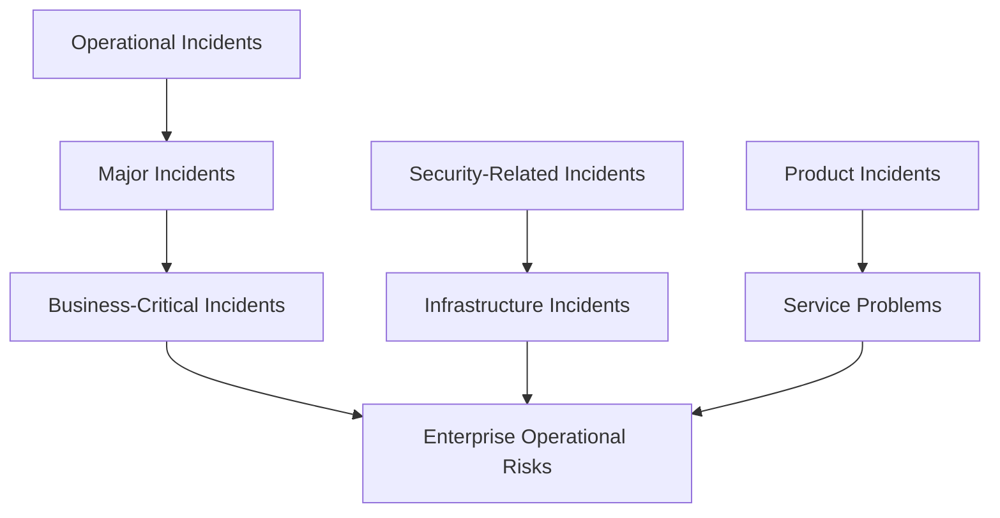
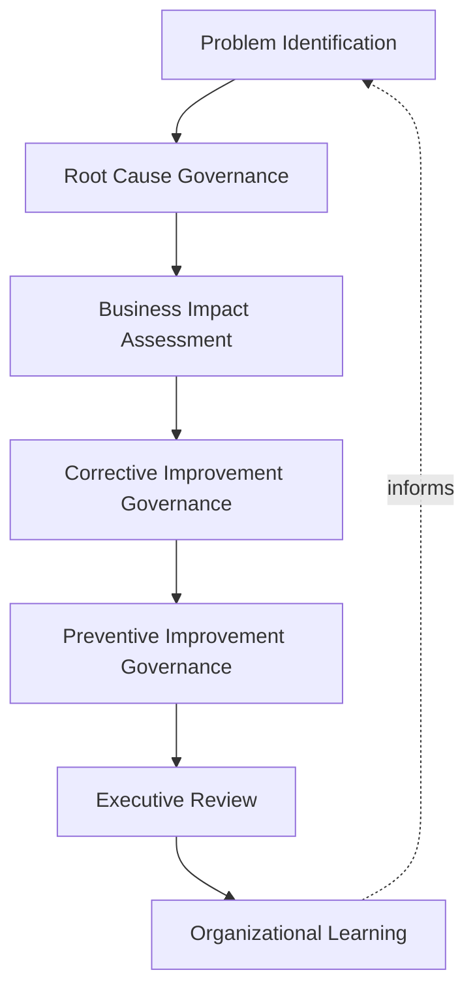
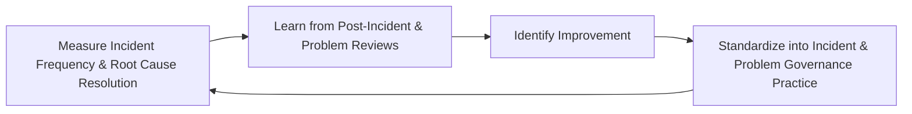
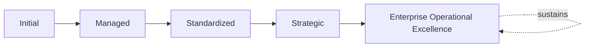

# Enterprise Incident & Problem Governance Framework

## 1. Executive Summary

**Purpose** — This document defines the official Enterprise Incident & Problem Governance Framework for **StackLeo Tech Store**. It establishes incident governance, problem governance, major incident governance, root cause governance, executive oversight, organizational accountability, operational resilience, continuous improvement, and long-term incident management maturity as a deliberate, accountable enterprise discipline. `09_Operations/incident-management-framework.md` and `09_Operations/problem-management-governance.md` each govern their respective concerns individually. This framework does not restate either. It provides the unified, implementation-independent treatment of how incidents and problems are governed together — including the dedicated major incident crisis governance and root cause governance neither existing document treats as its own focus.

**Scope** — This framework applies to every category of operational incident and problem at StackLeo — operational, major, business-critical, security-related, infrastructure, product, service problems, and enterprise operational risk — coordinated with `09_Operations/service-lifecycle-framework.md`, `09_Operations/service-level-governance.md`, `09_Operations/business-continuity-framework.md`, and `09_Operations/operations-governance.md`.

**Strategic Objectives** — To ensure an incident is governed from the moment it is identified through its full resolution, never left to informal habit; that a problem's genuine root cause is deliberately understood, never merely worked around; that a major incident receives genuinely commensurate crisis governance; and that the organization genuinely learns from every incident and problem it experiences.

**Business Value** — A governed incident and problem framework protects StackLeo from the disproportionate cost of the same incident recurring for want of genuine root cause resolution, protects customer trust from being eroded by poorly governed incident response, and gives leadership the confidence that operational disruption is met with genuinely disciplined governance.

**Intended Audience** — The Board of Directors, executive leadership, the Chief Operating Officer, the Chief Technology Officer, the Service Governance Board, operations leadership, engineering leadership, security leadership, customer success leadership, and business stakeholders.

## 2. Enterprise Incident & Problem Governance Vision

- **Operational Resilience** — the organization is governed to genuinely withstand and recover from operational disruption.
- **Service Stability** — incident and problem governance exists to protect the genuine stability of every StackLeo service.
- **Customer Trust Protection** — incident and problem governance exists foremost to protect the genuine trust customers place in StackLeo.
- **Business Continuity** — incidents and problems are governed to protect StackLeo's continued ability to operate, coordinated with `09_Operations/business-continuity-framework.md`.
- **Learning Organization** — every incident and problem genuinely deepens the organization's operational understanding.
- **Predictable Operations** — incident and problem response is governed to be genuinely predictable in its discipline, even where the underlying disruption is not.
- **Sustainable Service Excellence** — incident and problem governance is pursued as a durable discipline supporting genuine, sustained service excellence.

### Enterprise Incident & Problem Governance Vision Matrix

| Vision Element | Focus | Business Value |
|---|---|---|
| Operational Resilience | Genuinely withstanding and recovering from disruption | Protects continuity of value even when disruption occurs |
| Service Stability | Governance existing to protect genuine service stability | Anchors governance to its most direct operational purpose |
| Customer Trust Protection | Governance existing foremost to protect customer trust | Anchors governance to its most important stakeholder |
| Business Continuity | Protecting StackLeo's continued ability to operate | Connects incident governance to enterprise continuity |
| Learning Organization | Every incident and problem deepening understanding | Compounds the value of accumulated operational experience |
| Predictable Operations | Genuinely predictable discipline regardless of disruption | Builds organizational confidence in operational response |
| Sustainable Service Excellence | A durable discipline supporting sustained excellence | Converts incident governance into lasting operational advantage |

## 3. Incident & Problem Governance Principles

Incident and problem governance at StackLeo rests on nine principles, each producing a specific business outcome.

- **Customer Impact First** — every incident and problem decision genuinely weighs its effect on customers as a primary consideration. *Business Value:* prevents response that quietly deprioritizes customer interest.
- **Rapid Governance Visibility** — an incident's genuine status is made visible to relevant governance as quickly as possible. *Business Value:* prevents delayed visibility from compounding operational cost.
- **Accountability** — incident and problem ownership is genuinely clear at every stage, never left ambiguous. *Business Value:* prevents disruption from being deprioritized for lack of an owner.
- **Evidence-Based Decision Making** — an incident or problem decision is grounded in genuine, documented evidence, not assumption. *Business Value:* protects the credibility and defensibility of response decisions.
- **Root Cause Thinking** — a recurring issue is genuinely traced to its root cause, never merely treated at the symptom level. *Business Value:* protects against the disproportionate cost of repeated incidents.
- **Transparency** — incident and problem status and governance are documented and visible to those who genuinely need them. *Business Value:* allows response to be scrutinized and defended, not merely trusted on faith.
- **Continuous Learning** — understanding gained from every incident and problem genuinely informs future governance. *Business Value:* compounds the value of the organization's accumulated operational experience.
- **Continuous Improvement** — incident and problem governance practice matures over time, informed by real outcomes. *Business Value:* keeps governance aligned with the organization's growing scale and complexity.
- **Executive Oversight** — the organization's most consequential incidents and problems are genuinely visible at the executive level. *Business Value:* ensures the organization's most significant disruptions receive commensurate attention.

### Incident Governance Matrix

| Principle | Description | Business Value |
|---|---|---|
| Customer Impact First | Every decision genuinely weighs effect on customers | Prevents response that quietly deprioritizes customer interest |
| Rapid Governance Visibility | Status made visible to governance as quickly as possible | Prevents delayed visibility from compounding operational cost |
| Accountability | Ownership genuinely clear at every stage | Prevents disruption deprioritized for lack of an owner |
| Evidence-Based Decision Making | Grounded in genuine, documented evidence | Protects credibility and defensibility of decisions |
| Root Cause Thinking | Recurring issues genuinely traced to root cause | Protects against the disproportionate cost of repeated incidents |
| Transparency | Status and governance documented and visible | Allows response to be scrutinized and defended |
| Continuous Learning | Understanding genuinely informing future governance | Compounds the value of accumulated operational experience |
| Continuous Improvement | Practice matures from real outcomes | Keeps governance aligned with growing scale and complexity |
| Executive Oversight | Most consequential incidents genuinely visible at the top | Ensures significant disruptions receive commensurate attention |

## 4. Enterprise Incident & Problem Governance Model

Incident and problem governance operates across eight conceptual categories, each holding accountability for a distinct source of operational disruption.

### Operational Incidents

- **Purpose** — govern the routine, day-to-day disruption that occurs across StackLeo's operations.
- **Governance Scope** — coordinated with `09_Operations/incident-management-framework.md`.
- **Business Value** — protects the organization from routine disruption accumulating unmanaged.
- **Executive Expectations** — leadership expects operational incidents to be governed consistently, not selectively.

### Major Incidents

- **Purpose** — govern disruption significant enough to require genuine crisis-level governance.
- **Governance Scope** — coordinated with Major Incident Governance (Section 7).
- **Business Value** — protects the organization from a significant disruption being handled with only routine rigor.
- **Executive Expectations** — leadership expects major incidents to trigger genuinely elevated governance without delay.

### Business-Critical Incidents

- **Purpose** — govern disruption to the specific services or functions on which StackLeo's business most directly depends.
- **Governance Scope** — coordinated with Business Impact Evaluation (Section 5).
- **Business Value** — protects the organization's most consequential operational dependencies.
- **Executive Expectations** — leadership expects business-critical incidents to be identified explicitly, not left implicit.

### Security-Related Incidents

- **Purpose** — govern incidents with a genuine security dimension, coordinated with, and never superseding, `06_Security/security-strategy.md`.
- **Governance Scope** — oversight ensuring security-related incidents meet the rigor that framework requires.
- **Business Value** — protects StackLeo's core trust differentiator from incident-related compromise.
- **Executive Expectations** — leadership expects security-related incidents to receive elevated, deliberate scrutiny.

### Infrastructure Incidents

- **Purpose** — govern disruption originating in the technical infrastructure underlying StackLeo's services.
- **Governance Scope** — coordinated with `03_System_Design/technology-governance.md`.
- **Business Value** — protects the technical foundation every service ultimately depends on.
- **Executive Expectations** — leadership expects infrastructure incidents to be assessed jointly with engineering leadership.

### Product Incidents

- **Purpose** — govern disruption originating in a specific product's behavior, coordinated with `02_Product/product-risk-governance.md`.
- **Governance Scope** — oversight ensuring product-related incidents connect to product risk governance.
- **Business Value** — protects the genuine value proposition underlying every affected product.
- **Executive Expectations** — leadership expects product incidents to be routed to accountable product ownership.

### Service Problems

- **Purpose** — govern the underlying, recurring issues surfaced through Problem Governance (Section 6).
- **Governance Scope** — coordinated with Root Cause Governance (Section 6).
- **Business Value** — protects against the same disruption recurring for want of genuine resolution.
- **Executive Expectations** — leadership expects service problems to be genuinely distinguished from individual incidents.

### Enterprise Operational Risks

- **Purpose** — govern the synthesized, executive-relevant picture of StackLeo's overall operational risk exposure across every category above.
- **Governance Scope** — oversight exclusively accountable for converging every category into one coherent enterprise picture.
- **Business Value** — protects leadership's ability to understand overall operational risk as a whole.
- **Executive Expectations** — leadership expects one coherent operational risk picture, not eight disconnected category views.

### Incident Governance Matrix (Domains)

| Domain | Purpose | Business Value | Executive Expectations |
|---|---|---|---|
| Operational Incidents | Govern routine, day-to-day disruption | Protects against routine disruption accumulating unmanaged | Expects consistent, not selective, governance |
| Major Incidents | Govern disruption requiring crisis-level governance | Protects against significant disruption handled with only routine rigor | Expects genuinely elevated governance without delay |
| Business-Critical Incidents | Govern disruption to the most direct dependencies | Protects the organization's most consequential dependencies | Expects explicit, not implicit, identification |
| Security-Related Incidents | Govern incidents with a genuine security dimension | Protects StackLeo's core trust differentiator | Expects elevated, deliberate scrutiny |
| Infrastructure Incidents | Govern disruption in underlying technical infrastructure | Protects the technical foundation services depend on | Expects joint assessment with engineering leadership |
| Product Incidents | Govern disruption originating in product behavior | Protects the value proposition of affected products | Expects routing to accountable product ownership |
| Service Problems | Govern underlying, recurring issues | Protects against recurrence for want of genuine resolution | Expects genuine distinction from individual incidents |
| Enterprise Operational Risks | Synthesize overall operational risk exposure | Protects leadership's ability to understand risk as a whole | Expects one coherent picture, not disconnected views |

*Diagram 1: Enterprise Incident & Problem Governance Framework — operational and major incidents feed business-critical incidents, security and infrastructure incidents connect, product incidents feed service problems, all resolving into one enterprise operational risk picture.*

## 5. Incident Lifecycle Governance Framework

The incident lifecycle is governed across nine conceptual stages, remaining implementation independent throughout.

### Incident Identification

- **Governance Objectives** — confirm an incident is genuinely surfaced as early as possible.
- **Decision Authority** — Operations Leadership, coordinated with Engineering Leadership.
- **Required Evidence** — a documented incident identification record.
- **Expected Outcomes** — a genuinely early, accurate incident record.

### Initial Assessment

- **Governance Objectives** — confirm an identified incident's genuine nature and severity are assessed.
- **Decision Authority** — Operations Leadership.
- **Required Evidence** — a documented initial assessment.
- **Expected Outcomes** — a genuinely informed basis for subsequent governance.

### Business Impact Evaluation

- **Governance Objectives** — confirm an incident's genuine impact on the business and customers is evaluated.
- **Decision Authority** — the Service Governance Board, coordinated with affected Business Stakeholders.
- **Required Evidence** — a documented business impact evaluation.
- **Expected Outcomes** — a genuinely evidenced understanding of consequence.

### Governance Escalation

- **Governance Objectives** — confirm an incident genuinely exceeding defined tolerance reaches the appropriate governance level.
- **Decision Authority** — the Chief Operating Officer, escalating to executive leadership per Major Incident Governance (Section 7).
- **Required Evidence** — a documented escalation record.
- **Expected Outcomes** — no significant incident withheld from appropriate governance.

### Incident Coordination

- **Governance Objectives** — confirm a genuinely coordinated response across every function an incident affects.
- **Decision Authority** — the accountable Incident Owner, coordinated with the Service Governance Board.
- **Required Evidence** — a documented coordination record.
- **Expected Outcomes** — a genuinely unified, non-fragmented response.

### Executive Communication

- **Governance Objectives** — confirm executive leadership genuinely receives timely, accurate incident communication.
- **Decision Authority** — the Chief Operating Officer.
- **Required Evidence** — a documented executive communication record.
- **Expected Outcomes** — executive leadership genuinely informed throughout.

### Recovery Validation

- **Governance Objectives** — confirm an incident's genuine resolution is validated before closure.
- **Decision Authority** — Operations Leadership, coordinated with the Service Governance Board.
- **Required Evidence** — documented recovery validation evidence.
- **Expected Outcomes** — confirmed, genuine service restoration.

### Root Cause Review

- **Governance Objectives** — confirm a validated incident's genuine root cause is reviewed, coordinated with Problem Governance (Section 6).
- **Decision Authority** — the Service Governance Board.
- **Required Evidence** — a documented root cause review.
- **Expected Outcomes** — a genuine understanding of underlying cause, not merely symptom.

### Organizational Learning

- **Governance Objectives** — confirm understanding gained from an incident genuinely informs future governance.
- **Decision Authority** — the Service Governance Board.
- **Required Evidence** — documented lessons-learned findings.
- **Expected Outcomes** — deepened organizational operational understanding.

### Incident Lifecycle Matrix

| Stage | Governance Objectives | Decision Authority | Required Evidence | Expected Outcomes |
|---|---|---|---|---|
| Incident Identification | Confirm genuinely early surfacing | Operations Leadership with Engineering Leadership | Documented identification record | A genuinely early, accurate incident record |
| Initial Assessment | Confirm genuine nature and severity assessed | Operations Leadership | Documented initial assessment | A genuinely informed basis for governance |
| Business Impact Evaluation | Confirm genuine business and customer impact evaluated | Service Governance Board with Business Stakeholders | Documented business impact evaluation | A genuinely evidenced understanding of consequence |
| Governance Escalation | Confirm incident exceeding tolerance reaches appropriate level | Chief Operating Officer, executive leadership | Documented escalation record | No significant incident withheld from governance |
| Incident Coordination | Confirm genuinely coordinated cross-functional response | Incident Owner with Service Governance Board | Documented coordination record | A genuinely unified, non-fragmented response |
| Executive Communication | Confirm timely, accurate executive communication | Chief Operating Officer | Documented executive communication record | Executive leadership genuinely informed throughout |
| Recovery Validation | Confirm genuine resolution validated before closure | Operations Leadership with Service Governance Board | Documented recovery validation evidence | Confirmed, genuine service restoration |
| Root Cause Review | Confirm genuine root cause reviewed | Service Governance Board | Documented root cause review | Genuine understanding of underlying cause |
| Organizational Learning | Confirm understanding genuinely informs future governance | Service Governance Board | Documented lessons-learned findings | Deepened organizational operational understanding |

```mermaid
flowchart LR
    Identification2[Incident Identification] --> InitialAssess[Initial Assessment]
    InitialAssess --> ImpactEval[Business Impact Evaluation]
    ImpactEval --> GovEscalation[Governance Escalation]
    GovEscalation --> IncCoordination[Incident Coordination]
    IncCoordination --> ExecComm2[Executive Communication]
    ExecComm2 --> RecoveryValidation[Recovery Validation]
    RecoveryValidation --> RootCauseReview[Root Cause Review]
    RootCauseReview --> OrgLearning3[Organizational Learning]
    OrgLearning3 -.informs.-> Identification2
```

*Diagram 2: Incident Lifecycle Governance Model — identification and assessment inform impact evaluation and escalation, resolving through coordination and executive communication into recovery validation, root cause review, and organizational learning feeding back into future identification.*

## 6. Problem Governance Framework

- **Problem Identification** — governs how a recurring or systemic issue is genuinely distinguished from an individual incident.
- **Root Cause Governance** — governs how a problem's genuine underlying cause is deliberately investigated and confirmed.
- **Business Impact Assessment** — governs how a problem's genuine cumulative business impact is deliberately assessed.
- **Corrective Improvement Governance** — governs how a confirmed root cause is deliberately corrected.
- **Preventive Improvement Governance** — governs how a genuine risk of recurrence is deliberately prevented, even before a root cause fully materializes elsewhere.
- **Executive Review** — governs how problem governance findings are deliberately brought to executive leadership.
- **Organizational Learning** — governs how understanding gained from problem governance deepens future incident and problem governance.

### Problem Governance Matrix

| Governance Area | Focus | Coordination |
|---|---|---|
| Problem Identification | Recurring or systemic issue genuinely distinguished | Service Problems (Section 4) |
| Root Cause Governance | Genuine underlying cause deliberately investigated | Root Cause Thinking (Section 3) |
| Business Impact Assessment | Genuine cumulative business impact assessed | Business Impact Evaluation (Section 5) |
| Corrective Improvement Governance | Confirmed root cause deliberately corrected | Continuous Improvement (Section 3) |
| Preventive Improvement Governance | Genuine risk of recurrence deliberately prevented | Enterprise Operational Risks (Section 4) |
| Executive Review | Findings deliberately brought to leadership | Problem Governance Reviews (Section 10) |
| Organizational Learning | Understanding deepening future governance | Organizational Learning (Section 5) |

*Diagram 4: Root Cause Governance Framework — problem identification and root cause governance inform business impact assessment, resolving through corrective and preventive improvement into executive review, with organizational learning feeding lessons back into future problem identification.*

## 7. Major Incident Governance

- **Executive Escalation** — governs the point at which an incident's genuine severity requires immediate executive escalation.
- **Crisis Coordination** — governs how a genuinely coordinated, cross-functional crisis response is deliberately organized.
- **Business Continuity Alignment** — governs how major incident response deliberately aligns with `09_Operations/business-continuity-framework.md`.
- **Customer Communication Governance** — governs how genuine, transparent communication reaches affected customers.
- **Leadership Accountability** — governs which executive genuinely holds accountability for a major incident's response.
- **Recovery Governance** — governs how a major incident's genuine recovery is deliberately validated before stand-down.
- **Post-Incident Review** — governs how a major incident's genuine handling is deliberately reviewed after recovery.

### Major Incident Governance Matrix

| Governance Area | Focus | Coordination |
|---|---|---|
| Executive Escalation | Point requiring immediate executive escalation | Governance Escalation (Section 5) |
| Crisis Coordination | Genuinely coordinated, cross-functional response | Incident Coordination (Section 5) |
| Business Continuity Alignment | Deliberate alignment with continuity governance | `09_Operations/business-continuity-framework.md` |
| Customer Communication Governance | Genuine, transparent customer communication | Incident Communication Governance (Section 8) |
| Leadership Accountability | Executive genuinely accountable for response | Organizational Governance (Section 9) |
| Recovery Governance | Genuine recovery validated before stand-down | Recovery Validation (Section 5) |
| Post-Incident Review | Genuine handling reviewed after recovery | Executive Oversight (Section 10) |

*Diagram 3: Major Incident Escalation Governance — executive escalation triggers crisis coordination aligned with business continuity, resolving through customer communication and leadership accountability into recovery governance and post-incident review.*

## 8. Incident Communication Governance

- **Executive Communication** — governs how genuine, timely communication reaches executive leadership.
- **Internal Stakeholder Communication** — governs how genuine communication reaches affected internal stakeholders.
- **Customer Communication** — governs how genuine, transparent communication reaches affected customers.
- **Regulatory Communication** — governs how genuine communication reaches applicable regulators, coordinated with `06_Security/compliance-governance.md`.
- **Public Communication** — governs how genuine, deliberate communication reaches the public where warranted.
- **Decision Transparency** — governs how the reasoning behind incident-related decisions is genuinely documented and available.
- **Lessons Learned Communication** — governs how understanding gained from an incident is genuinely shared across the organization.

### Communication Governance Matrix

| Governance Area | Focus | Coordination |
|---|---|---|
| Executive Communication | Genuine, timely communication to leadership | Executive Communication (Section 5) |
| Internal Stakeholder Communication | Genuine communication to affected internal stakeholders | `00_Project_Overview/stakeholder-engagement-framework.md` |
| Customer Communication | Genuine, transparent communication to customers | Customer Impact First (Section 3) |
| Regulatory Communication | Genuine communication to applicable regulators | `06_Security/compliance-governance.md` |
| Public Communication | Genuine, deliberate communication where warranted | Major Incident Governance (Section 7) |
| Decision Transparency | Reasoning genuinely documented and available | Transparency (Section 3) |
| Lessons Learned Communication | Understanding genuinely shared organization-wide | Organizational Learning (Section 5) |

## 9. Organizational Governance

Governance accountability is distributed deliberately across ten organizational roles.

- **Board of Directors** — holds ultimate accountability for whether StackLeo's incident and problem governance genuinely protects the business's long-term direction.
- **Executive Leadership** — holds accountability for major incident decisions and business continuity alignment, in partnership with the Board.
- **Chief Operating Officer** — owns the coherence and enforcement of this framework across every incident and problem domain.
- **Chief Technology Officer** — owns coordination of Infrastructure Incidents (Section 4) with `03_System_Design/technology-governance.md`.
- **Service Governance Board** — owns the operational execution of the Incident Lifecycle Governance Framework (Section 5) and Problem Governance Framework (Section 6).
- **Operations Leadership** — own day-to-day Incident Identification and Coordination (Section 5) within their accountable services.
- **Engineering Leadership** — own Infrastructure Incidents and root cause investigation (Section 6) within their accountable systems.
- **Security Leadership** — own Security-Related Incidents (Section 4) in coordination with `06_Security/security-strategy.md`.
- **Customer Success Leadership** — own Customer Communication Governance (Section 8).
- **Business Stakeholders** — own business-context input into Business Impact Evaluation (Section 5) for incidents affecting their domain.

### Organizational Responsibility Matrix

| Role | Governance Objective | Business Value |
|---|---|---|
| Board of Directors | Hold ultimate accountability for governance protecting direction | Provides the highest point of ultimate accountability |
| Executive Leadership | Hold accountability for major incident decisions and continuity alignment | Provides a single point of executive-level accountability |
| Chief Operating Officer | Own coherence and enforcement across every domain | Provides a single point of specialist accountability |
| Chief Technology Officer | Own coordination of infrastructure incidents | Ensures incident governance connects to architecture governance |
| Service Governance Board | Own operational execution of lifecycle and problem governance | Provides a dedicated, cross-functional governance body |
| Operations Leadership | Own day-to-day identification and coordination | Embeds accountability closest to where incidents occur |
| Engineering Leadership | Own infrastructure incidents and root cause investigation | Embeds accountability closest to where systems are built |
| Security Leadership | Own security-related incidents | Ensures incident governance meets enterprise security rigor |
| Customer Success Leadership | Own customer communication governance | Ensures communication reflects genuine customer priority |
| Business Stakeholders | Own business-context input into impact evaluation | Connects incident governance to genuine business relevance |

## 10. Executive Oversight

- **Major Incident Reviews** — every major incident's genuine handling is formally reviewed with executive leadership.
- **Problem Governance Reviews** — the overall coherence of problem governance is formally reviewed on a regular cadence.
- **Service Stability Reviews** — genuine overall service stability is reviewed as a distinct, ongoing concern.
- **Root Cause Reviews** — genuine root cause findings are reviewed directly with executive leadership.
- **Business Continuity Reviews** — the organization's incident-related continuity posture is reviewed directly with executive leadership.
- **Continuous Improvement Reviews** — the organization's follow-through on captured incident and problem lessons is reviewed directly with executive leadership.

### Executive Oversight Matrix

| Oversight Mechanism | Purpose | Governance Role |
|---|---|---|
| Major Incident Reviews | Confirm genuine handling of every major incident | Direct executive-level major incident review |
| Problem Governance Reviews | Confirm overall problem governance coherence | Regular, predictable cadence for the framework as a whole |
| Service Stability Reviews | Review genuine overall service stability | Treats stability as ongoing, not assumed |
| Root Cause Reviews | Review genuine root cause findings | Direct executive-level root cause review |
| Business Continuity Reviews | Review incident-related continuity posture | Direct executive-level continuity review |
| Continuous Improvement Reviews | Review follow-through on captured lessons | Direct executive-level review of improvement completion |

## 11. Future Readiness

This framework is designed to remain valid as StackLeo evolves in scale, geography, and organizational complexity.

- **AI-Assisted Incident Intelligence** — as incident identification and assessment increasingly incorporate AI-assisted methods, coordinated with `04_Database/ai-governance.md`, they remain governed under Incident Identification and Initial Assessment (Section 5) at the same rigor as any other method.
- **Predictive Operational Risk Detection** — where the organization develops the capability to anticipate an incident before it fully materializes, that capability is governed as an extension of Enterprise Operational Risks (Section 4).
- **Intelligent Root Cause Analysis** — where root cause investigation increasingly draws on intelligent pattern analysis, that analysis remains subject to the same Root Cause Governance (Section 6) as any other method.
- **Adaptive Incident Governance** — where incident response increasingly adapts to genuinely changing operational conditions, that evolution remains governed under Continuous Improvement (Section 3) at the same rigor as any other method.
- **Autonomous Operational Insights (Conceptual)** — where operational insight is conceptually assisted by autonomous methods in the future, such assistance remains subject to the same executive oversight and accountability structures this framework defines, never a substitute for them.
- **Sustainable Service Resilience** — Incident Identification and Governance Escalation (Section 5) are structured to be re-applied as StackLeo expands from Bangladesh into South Asia and global markets.

## 12. Incident & Problem Maturity Model

Incident and problem governance maturity is described across five conceptual levels.

- **Initial** — incident and problem governance, where it exists, is informal and inconsistent; incidents are handled reactively, and root cause is rarely pursued.
- **Managed** — basic incident and problem governance exists for individual domains, but consistency across the eight domains in Section 4 varies significantly.
- **Standardized** — the governance model, lifecycle, and problem governance framework are standardized, documented, and consistently applied across the organization.
- **Strategic** — incident and problem decisions are genuinely and routinely made in deliberate service of business strategy, not convenience.
- **Enterprise Operational Excellence** — incident and problem governance is continuously and deliberately improved based on quantitative evidence and organizational learning; operational resilience functions as a genuine, sustained source of enterprise excellence.

### Incident & Problem Maturity Matrix

| Level | Characteristics | Primary Focus |
|---|---|---|
| Initial | Informal, inconsistent governance; incidents handled reactively | Ad hoc, individually-dependent incident practice |
| Managed | Basic governance exists per domain; consistency varies | Domain-level consistency |
| Standardized | Standardized governance model, lifecycle, and problem framework | Organization-wide consistency and clear ownership |
| Strategic | Decisions genuinely and routinely made in service of strategy | Business-strategy-driven incident decision-making |
| Enterprise Operational Excellence | Practice continuously improved; resilience as competitive advantage | Sustained, deliberate, enterprise-wide operational excellence |

*Diagram 5: Continual Incident Improvement Cycle — incident frequency and root cause resolution are measured, learned from through post-incident and problem reviews, improved upon, and standardized back into governed practice, on a continuing basis.*

*Diagram 6: Incident & Problem Maturity Progression — maturity advances from informal, reactively-handled incident practice toward standardized, genuinely strategy-driven, and continuously excellent enterprise incident and problem governance.*

## 13. Incident & Problem Anti-Patterns

- **Repeating the Same Incidents** — allowing an incident to recur without genuine root cause resolution wastes the organization's clearest opportunity to prevent recurrence.
- **No Root Cause Governance** — treating every incident only at the symptom level guarantees recurring, unmanaged disruption.
- **Weak Executive Visibility** — allowing a significant incident to go unseen by executive leadership prevents genuinely informed strategic response.
- **Reactive Operations** — operating without deliberate incident and problem governance wastes the value proactive discipline would provide.
- **Poor Customer Communication** — allowing customers to be left uninformed during disruption erodes the trust every interaction should protect.
- **Blame-Oriented Culture** — governing incidents around blame rather than genuine learning suppresses the honest reporting root cause analysis depends on.
- **Siloed Incident Decisions** — managing an incident within a single function without genuine cross-functional coordination prevents a unified response.
- **No Organizational Learning** — treating current incident and problem practice as permanently finished guarantees it falls behind the organization's growing scale and complexity.

### Anti-Pattern Summary

| Anti-Pattern | Organizational & Business Impact |
|---|---|
| Repeating the Same Incidents | Wastes the clearest opportunity to prevent recurrence |
| No Root Cause Governance | Guarantees recurring, unmanaged disruption |
| Weak Executive Visibility | Prevents genuinely informed strategic response |
| Reactive Operations | Wastes the value proactive discipline would provide |
| Poor Customer Communication | Erodes the trust every interaction should protect |
| Blame-Oriented Culture | Suppresses honest reporting root cause analysis depends on |
| Siloed Incident Decisions | Prevents a unified, cross-functional response |
| No Organizational Learning | Guarantees practice falls behind growing scale and complexity |

## Related Documents

| Document | Relationship |
|---|---|
| `09_Operations/service-management-framework.md` | Establishes the broader enterprise service governance model this framework's incident and problem domains support. |
| `09_Operations/service-lifecycle-framework.md` | Establishes the stage-gate discipline within which Service Operations produces the incidents this framework governs. |
| `09_Operations/service-level-governance.md` | Establishes the performance commitments an incident's business impact is ultimately measured against. |
| `09_Operations/knowledge-management-framework.md` | Governs how incident and problem knowledge is captured and reused. |
| `09_Operations/service-risk-governance.md` | Provides a deeper elaboration of risk this framework's Enterprise Operational Risks (Section 4) connects to. |
| `09_Operations/service-maturity-framework.md` | Consolidates the maturity model this framework defines in Section 12 into the enterprise-wide service maturity picture. |
| `09_Operations/business-continuity-framework.md` | Establishes the continuity discipline this framework's Major Incident Governance (Section 7) aligns with. |
| `09_Operations/operations-governance.md` | Establishes the broader operations governance discipline this framework's incident-specific governance specializes. |

## Document Information

| Property | Value |
|----------|-------|
| Document | incident-problem-governance.md |
| Version | 1.0.0 |
| Status | Active |
| Maintained By | StackLeo |
| Last Updated | 2026-07-29 |

---

© StackLeo. All Rights Reserved.
