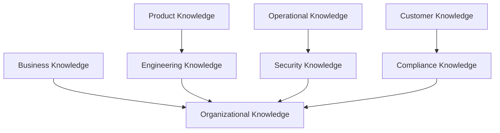
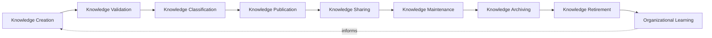
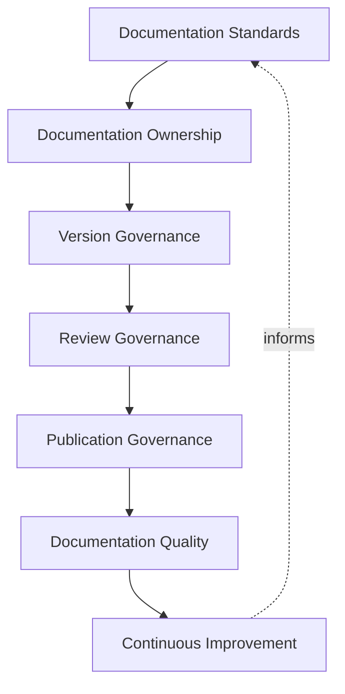
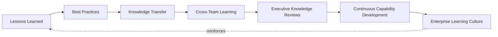
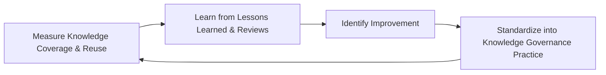
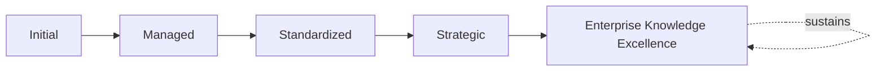

# Enterprise Knowledge Management Framework

## 1. Executive Summary

**Purpose** — This document defines the official Enterprise Knowledge Management Framework for **StackLeo Tech Store**. It establishes knowledge governance, the knowledge lifecycle, organizational learning, documentation governance, knowledge retention, executive oversight, organizational accountability, continuous improvement, and long-term knowledge excellence as a deliberate, accountable enterprise discipline. `09_Operations/service-lifecycle-framework.md` and `09_Operations/incident-problem-governance.md` each anticipated this framework directly as the dedicated governance treatment of how lifecycle and incident knowledge is captured and reused. This framework does not restate either. It governs knowledge as an enterprise-wide asset spanning every domain of StackLeo's business, not only operational knowledge.

**Scope** — This framework applies to every category of knowledge across StackLeo — business, product, engineering, operational, security, customer, compliance, and organizational knowledge — coordinated with `09_Operations/service-lifecycle-framework.md`, `09_Operations/incident-problem-governance.md`, `09_Operations/service-level-governance.md`, and `09_Operations/operations-governance.md`.

**Strategic Objectives** — To ensure StackLeo's accumulated knowledge is genuinely captured, never left to reside only in individual memory; that knowledge is genuinely accessible to those who need it, never siloed by function or habit; that lessons learned genuinely inform future decisions; and that critical knowledge survives genuine organizational change, never lost to attrition.

**Business Value** — A governed knowledge management framework protects StackLeo from the disproportionate cost of relearning what the organization already once knew, protects the organization from critical knowledge walking out the door with a single departure, and gives leadership the confidence that decisions are informed by the organization's genuine, accumulated experience.

**Intended Audience** — The Board of Directors, executive leadership, the Chief Knowledge Officer (or equivalent), the Service Governance Board, engineering leadership, product leadership, operations leadership, security leadership, documentation owners, and business stakeholders.

## 2. Enterprise Knowledge Management Vision

- **Knowledge as a Strategic Enterprise Asset** — StackLeo's accumulated knowledge is governed as a genuine strategic asset, never treated as an incidental byproduct of work.
- **Organizational Learning** — the organization is governed to genuinely learn from its own experience, never repeat the same lesson unlearned.
- **Knowledge-Driven Decision Making** — decisions across StackLeo are governed to genuinely draw on accumulated knowledge, never made in avoidable ignorance of it.
- **Sustainable Knowledge Preservation** — knowledge is governed to be genuinely preserved over time, never allowed to quietly decay or disappear.
- **Cross-Functional Collaboration** — knowledge is governed to genuinely flow across functional boundaries, never trapped within a single team.
- **Innovation Through Shared Knowledge** — genuine innovation is governed to draw on knowledge shared broadly, not held narrowly.
- **Long-Term Organizational Excellence** — knowledge management is pursued as a durable discipline supporting genuine, sustained organizational excellence.

### Enterprise Knowledge Management Vision Matrix

| Vision Element | Focus | Business Value |
|---|---|---|
| Knowledge as a Strategic Enterprise Asset | A genuine strategic asset, not an incidental byproduct | Elevates knowledge to genuine enterprise priority |
| Organizational Learning | Genuinely learning from experience, not repeating lessons | Prevents the same lesson from being relearned repeatedly |
| Knowledge-Driven Decision Making | Decisions genuinely drawing on accumulated knowledge | Prevents decisions made in avoidable ignorance |
| Sustainable Knowledge Preservation | Genuinely preserved, never allowed to quietly decay | Protects the organization's accumulated investment in learning |
| Cross-Functional Collaboration | Genuinely flowing across functional boundaries | Prevents knowledge trapped within a single team |
| Innovation Through Shared Knowledge | Innovation genuinely drawing on broadly shared knowledge | Compounds the organization's collective capability |
| Long-Term Organizational Excellence | A durable discipline supporting sustained excellence | Converts knowledge management into lasting advantage |

## 3. Knowledge Governance Principles

Knowledge governance at StackLeo rests on nine principles, each producing a specific business outcome.

- **Knowledge Ownership** — every category of knowledge has a genuine, accountable owner. *Business Value:* prevents knowledge from being deprioritized for lack of an owner.
- **Knowledge Accessibility** — knowledge is genuinely accessible to those who legitimately need it. *Business Value:* prevents decisions being made without available, relevant knowledge.
- **Accuracy & Quality** — captured knowledge is genuinely accurate and maintained to a consistent quality standard. *Business Value:* protects the credibility of decisions built upon it.
- **Transparency** — knowledge governance itself is documented and visible to those who genuinely need it. *Business Value:* allows knowledge practice to be scrutinized and defended, not merely trusted on faith.
- **Continuous Learning** — the organization genuinely, continuously captures new understanding as it is gained. *Business Value:* keeps the organization's knowledge current, not frozen at a past point in time.
- **Business Alignment** — knowledge governance remains genuinely connected to business strategy. *Business Value:* ensures knowledge investment reflects genuine business priority.
- **Reusability** — captured knowledge is governed to be genuinely reusable, not captured once and forgotten. *Business Value:* compounds the return on the effort invested in capturing knowledge.
- **Continuous Improvement** — knowledge governance practice matures over time, informed by real outcomes. *Business Value:* keeps governance aligned with the organization's growing scale and complexity.
- **Long-Term Knowledge Preservation** — knowledge is governed to survive genuine organizational change, not merely the tenure of a single individual. *Business Value:* protects the organization from losing critical knowledge to attrition.

### Enterprise Knowledge Governance Matrix

| Principle | Description | Business Value |
|---|---|---|
| Knowledge Ownership | Every category has a genuine, accountable owner | Prevents knowledge deprioritized for lack of an owner |
| Knowledge Accessibility | Genuinely accessible to those who legitimately need it | Prevents decisions made without available knowledge |
| Accuracy & Quality | Genuinely accurate, consistent quality standard | Protects the credibility of decisions built upon it |
| Transparency | Governance itself documented and visible | Allows practice to be scrutinized and defended |
| Continuous Learning | Genuinely, continuously capturing new understanding | Keeps knowledge current, not frozen in the past |
| Business Alignment | Governance remaining genuinely connected to strategy | Ensures investment reflects genuine business priority |
| Reusability | Governed to be genuinely reusable, not forgotten | Compounds the return on capture effort |
| Continuous Improvement | Practice matures from real outcomes | Keeps governance aligned with growing scale and complexity |
| Long-Term Knowledge Preservation | Governed to survive genuine organizational change | Protects against loss of critical knowledge to attrition |

## 4. Enterprise Knowledge Governance Model

Knowledge governance operates across eight conceptual categories, each holding accountability for a distinct domain of enterprise knowledge.

### Business Knowledge

- **Purpose** — govern the genuine capture and preservation of StackLeo's business strategy, model, and market understanding.
- **Governance Scope** — coordinated with `01_Business/business-model.md`.
- **Business Value** — protects the organization's accumulated understanding of its own business.
- **Executive Expectations** — leadership expects business knowledge to survive individual departure without loss.

### Product Knowledge

- **Purpose** — govern the genuine capture of product decisions, rationale, and evolution.
- **Governance Scope** — coordinated with `02_Product/product-governance-strategy.md`.
- **Business Value** — protects the organization from relearning past product decisions and their reasoning.
- **Executive Expectations** — leadership expects product knowledge to be genuinely traceable over time.

### Engineering Knowledge

- **Purpose** — govern the genuine capture of technical decisions, architecture rationale, and system understanding.
- **Governance Scope** — coordinated with `03_System_Design/architecture-decision-records.md`.
- **Business Value** — protects the organization's technical foundation from becoming genuinely unmaintainable.
- **Executive Expectations** — leadership expects engineering knowledge to outlast any individual contributor's tenure.

### Operational Knowledge

- **Purpose** — govern the genuine capture of operational practice, incident history, and service understanding.
- **Governance Scope** — coordinated with `09_Operations/incident-problem-governance.md`.
- **Business Value** — protects against operational lessons being relearned through repeated disruption.
- **Executive Expectations** — leadership expects operational knowledge to genuinely inform future incident response.

### Security Knowledge

- **Purpose** — govern the genuine capture of security posture, decisions, and incident history, coordinated with, and never superseding, `06_Security/security-strategy.md`.
- **Governance Scope** — oversight ensuring security knowledge capture meets the rigor that framework requires.
- **Business Value** — protects StackLeo's core trust differentiator by preserving security understanding.
- **Executive Expectations** — leadership expects security knowledge to receive elevated, deliberate protection.

### Customer Knowledge

- **Purpose** — govern the genuine capture of customer understanding, feedback, and relationship history, coordinated with `02_Product/customer-value-governance.md`.
- **Governance Scope** — oversight ensuring customer knowledge capture connects to voice-of-customer governance.
- **Business Value** — protects the organization's accumulated understanding of genuine customer need.
- **Executive Expectations** — leadership expects customer knowledge to remain current and genuinely accessible.

### Compliance Knowledge

- **Purpose** — govern the genuine capture of regulatory and compliance understanding, coordinated with `06_Security/compliance-governance.md`.
- **Governance Scope** — oversight ensuring compliance knowledge capture meets that framework's rigor.
- **Business Value** — protects the organization from repeating past compliance gaps.
- **Executive Expectations** — leadership expects compliance knowledge to be genuinely current with applicable obligation.

### Organizational Knowledge

- **Purpose** — govern the synthesized, executive-relevant picture of StackLeo's overall knowledge health across every category above.
- **Governance Scope** — oversight exclusively accountable for converging every category into one coherent enterprise picture.
- **Business Value** — protects leadership's ability to understand organizational knowledge health as a whole.
- **Executive Expectations** — leadership expects one coherent knowledge picture, not eight disconnected category views.

### Enterprise Knowledge Governance Matrix (Domains)

| Domain | Purpose | Business Value | Executive Expectations |
|---|---|---|---|
| Business Knowledge | Capture and preserve strategy, model, and market understanding | Protects accumulated understanding of the business itself | Expects survival of business knowledge past individual departure |
| Product Knowledge | Capture product decisions, rationale, and evolution | Protects against relearning past product decisions | Expects product knowledge to be genuinely traceable over time |
| Engineering Knowledge | Capture technical decisions and system understanding | Protects the technical foundation from becoming unmaintainable | Expects engineering knowledge to outlast individual tenure |
| Operational Knowledge | Capture operational practice and incident history | Protects against relearning lessons through repeated disruption | Expects operational knowledge to genuinely inform future response |
| Security Knowledge | Capture security posture, decisions, and incident history | Protects StackLeo's core trust differentiator | Expects elevated, deliberate protection |
| Customer Knowledge | Capture customer understanding and relationship history | Protects accumulated understanding of genuine customer need | Expects customer knowledge to remain current and accessible |
| Compliance Knowledge | Capture regulatory and compliance understanding | Protects against repeating past compliance gaps | Expects compliance knowledge genuinely current with obligation |
| Organizational Knowledge | Synthesize overall knowledge health picture | Protects leadership's ability to understand health as a whole | Expects one coherent picture, not disconnected views |

*Diagram 1: Enterprise Knowledge Management Framework — business, product, and engineering knowledge connect, operational and security knowledge feed forward, and customer and compliance knowledge converge, all resolving into one organizational knowledge picture.*

## 5. Knowledge Lifecycle Governance Framework

The knowledge lifecycle is governed across nine conceptual stages, remaining implementation independent throughout.

### Knowledge Creation

- **Governance Objectives** — confirm genuine new understanding is captured as it is gained.
- **Decision Authority** — the individual or team originating the knowledge, coordinated with Documentation Owners.
- **Required Evidence** — a documented knowledge creation record.
- **Expected Outcomes** — genuine understanding captured at the point of origin.

### Knowledge Validation

- **Governance Objectives** — confirm captured knowledge is genuinely accurate before it is relied upon.
- **Decision Authority** — the accountable subject-matter owner.
- **Required Evidence** — a documented validation record.
- **Expected Outcomes** — genuinely trustworthy captured knowledge.

### Knowledge Classification

- **Governance Objectives** — confirm validated knowledge is genuinely categorized against the domains in Section 4.
- **Decision Authority** — Documentation Owners.
- **Required Evidence** — a documented classification record.
- **Expected Outcomes** — knowledge genuinely discoverable by those who need it.

### Knowledge Publication

- **Governance Objectives** — confirm classified knowledge is genuinely made available to its intended audience.
- **Decision Authority** — Documentation Owners, coordinated with the accountable domain owner.
- **Required Evidence** — a documented publication record.
- **Expected Outcomes** — knowledge genuinely accessible where it is needed.

### Knowledge Sharing

- **Governance Objectives** — confirm published knowledge genuinely reaches those who would benefit from it.
- **Decision Authority** — the accountable domain owner.
- **Required Evidence** — a documented sharing or communication record.
- **Expected Outcomes** — genuine cross-functional awareness of relevant knowledge.

### Knowledge Maintenance

- **Governance Objectives** — confirm published knowledge genuinely remains accurate over time.
- **Decision Authority** — the accountable subject-matter owner.
- **Required Evidence** — a documented maintenance review record.
- **Expected Outcomes** — knowledge that genuinely remains current, not stale.

### Knowledge Archiving

- **Governance Objectives** — confirm knowledge no longer current is genuinely, deliberately archived rather than left to mislead.
- **Decision Authority** — Documentation Owners.
- **Required Evidence** — a documented archiving record.
- **Expected Outcomes** — a genuinely clean, trustworthy active knowledge base.

### Knowledge Retirement

- **Governance Objectives** — confirm knowledge with no genuine remaining value is formally retired.
- **Decision Authority** — the Service Governance Board.
- **Required Evidence** — a documented retirement record.
- **Expected Outcomes** — a genuinely current, uncluttered knowledge base.

### Organizational Learning

- **Governance Objectives** — confirm understanding gained across the knowledge lifecycle genuinely informs future governance.
- **Decision Authority** — the Service Governance Board.
- **Required Evidence** — documented lessons-learned findings.
- **Expected Outcomes** — deepened organizational knowledge governance practice.

### Knowledge Lifecycle Matrix

| Stage | Governance Objectives | Decision Authority | Required Evidence | Expected Outcomes |
|---|---|---|---|---|
| Knowledge Creation | Confirm genuine new understanding captured | Originating individual or team with Documentation Owners | Documented creation record | Genuine understanding captured at the point of origin |
| Knowledge Validation | Confirm captured knowledge genuinely accurate | Accountable subject-matter owner | Documented validation record | Genuinely trustworthy captured knowledge |
| Knowledge Classification | Confirm genuine categorization against domains | Documentation Owners | Documented classification record | Knowledge genuinely discoverable |
| Knowledge Publication | Confirm knowledge genuinely made available | Documentation Owners with domain owner | Documented publication record | Knowledge genuinely accessible where needed |
| Knowledge Sharing | Confirm knowledge genuinely reaches beneficiaries | Accountable domain owner | Documented sharing record | Genuine cross-functional awareness |
| Knowledge Maintenance | Confirm knowledge genuinely remains accurate | Accountable subject-matter owner | Documented maintenance review record | Knowledge that genuinely remains current |
| Knowledge Archiving | Confirm outdated knowledge genuinely, deliberately archived | Documentation Owners | Documented archiving record | A genuinely clean, trustworthy active knowledge base |
| Knowledge Retirement | Confirm knowledge with no value formally retired | Service Governance Board | Documented retirement record | A genuinely current, uncluttered knowledge base |
| Organizational Learning | Confirm understanding genuinely informs future governance | Service Governance Board | Documented lessons-learned findings | Deepened organizational knowledge governance practice |

*Diagram 2: Knowledge Lifecycle Governance Model — creation and validation lead into classification and publication, resolving through sharing and maintenance into archiving and retirement, with organizational learning feeding lessons back into future knowledge creation.*

## 6. Documentation Governance

- **Documentation Standards** — governs the genuine, consistent standard StackLeo's documentation is held to.
- **Documentation Ownership** — governs whether every piece of documentation has a genuine, accountable owner.
- **Version Governance** — governs how a document's genuine currency over time is deliberately tracked.
- **Review Governance** — governs how documentation is deliberately, periodically reviewed for continued accuracy.
- **Publication Governance** — governs how documentation is deliberately made available to its intended audience.
- **Documentation Quality** — governs whether documentation genuinely meets the organization's quality expectation.
- **Continuous Improvement** — governs how documentation governance practice deliberately matures from real outcomes.

### Documentation Governance Matrix

| Governance Area | Focus | Coordination |
|---|---|---|
| Documentation Standards | Genuine, consistent standard for documentation | Accuracy & Quality (Section 3) |
| Documentation Ownership | Every document has a genuine, accountable owner | Knowledge Ownership (Section 3) |
| Version Governance | Genuine currency deliberately tracked over time | Knowledge Maintenance (Section 5) |
| Review Governance | Documentation deliberately, periodically reviewed | Knowledge Validation (Section 5) |
| Publication Governance | Documentation deliberately made available | Knowledge Publication (Section 5) |
| Documentation Quality | Genuinely meeting organizational quality expectation | Accuracy & Quality (Section 3) |
| Continuous Improvement | Practice deliberately maturing from real outcomes | Continuous Improvement (Section 3) |

*Diagram 3: Documentation Governance Flow — standards and ownership inform version and review governance, feeding publication governance and quality, with continuous improvement feeding lessons back into standards.*

## 7. Organizational Learning Framework

- **Lessons Learned** — governs how genuine understanding gained from experience is deliberately captured.
- **Best Practices** — governs how genuinely effective practice is deliberately identified and shared.
- **Knowledge Transfer** — governs how knowledge genuinely moves from one individual or team to another.
- **Cross-Team Learning** — governs how learning genuinely flows across StackLeo's organizational boundaries.
- **Executive Knowledge Reviews** — governs how organizational learning is deliberately brought to executive leadership.
- **Continuous Capability Development** — governs how organizational learning deliberately builds genuine capability over time.
- **Enterprise Learning Culture** — governs how the organization genuinely cultivates a culture that values learning.

### Organizational Learning Matrix

| Governance Area | Focus | Coordination |
|---|---|---|
| Lessons Learned | Genuine understanding deliberately captured | Continuous Learning (Section 3) |
| Best Practices | Effective practice deliberately identified and shared | Reusability (Section 3) |
| Knowledge Transfer | Knowledge genuinely moving between individuals or teams | Knowledge Sharing (Section 5) |
| Cross-Team Learning | Learning genuinely flowing across boundaries | Cross-Functional Collaboration (Section 2) |
| Executive Knowledge Reviews | Learning deliberately brought to leadership | Knowledge Governance Reviews (Section 10) |
| Continuous Capability Development | Learning deliberately building genuine capability | Long-Term Organizational Excellence (Section 2) |
| Enterprise Learning Culture | Organization genuinely cultivating a learning culture | Organizational Learning (Section 5) |

*Diagram 4: Organizational Learning Framework — lessons learned and best practices inform knowledge transfer and cross-team learning, resolving through executive review into capability development, with a reinforced learning culture feeding back into future lessons learned.*

## 8. Knowledge Retention Governance

- **Critical Knowledge Protection** — governs how the organization's genuinely most critical knowledge receives deliberate, elevated protection.
- **Expert Knowledge Capture** — governs how genuine specialist understanding held by individual experts is deliberately captured.
- **Business Continuity Support** — governs how knowledge retention deliberately supports `09_Operations/business-continuity-framework.md`.
- **Knowledge Succession** — governs how genuine knowledge transfer occurs deliberately ahead of an anticipated organizational transition.
- **Organizational Memory** — governs how StackLeo's genuine collective memory is deliberately preserved over time.
- **Knowledge Preservation** — governs how preserved knowledge remains genuinely accessible even as systems and teams change.
- **Continuous Evolution** — governs how knowledge retention practice deliberately matures from real organizational experience.

### Knowledge Retention Matrix

| Governance Area | Focus | Coordination |
|---|---|---|
| Critical Knowledge Protection | Most critical knowledge receiving deliberate, elevated protection | Long-Term Knowledge Preservation (Section 3) |
| Expert Knowledge Capture | Genuine specialist understanding deliberately captured | Knowledge Creation (Section 5) |
| Business Continuity Support | Retention deliberately supporting continuity | `09_Operations/business-continuity-framework.md` |
| Knowledge Succession | Genuine transfer ahead of anticipated transition | Knowledge Transfer (Section 7) |
| Organizational Memory | Genuine collective memory deliberately preserved | Sustainable Knowledge Preservation (Section 2) |
| Knowledge Preservation | Remaining genuinely accessible as systems and teams change | Knowledge Archiving (Section 5) |
| Continuous Evolution | Practice deliberately maturing from real experience | Continuous Improvement (Section 3) |

## 9. Organizational Governance

Governance accountability is distributed deliberately across ten organizational roles.

- **Board of Directors** — holds ultimate accountability for whether StackLeo's knowledge management genuinely protects the organization's long-term capability.
- **Executive Leadership** — holds accountability for whether knowledge governance decisions genuinely align with business strategy, in partnership with the Board.
- **Chief Knowledge Officer (or equivalent)** — owns the coherence and enforcement of this framework across every knowledge domain.
- **Service Governance Board** — owns the operational execution of the Knowledge Lifecycle Governance Framework (Section 5).
- **Engineering Leadership** — own Engineering Knowledge (Section 4) within their accountable systems.
- **Product Leadership** — own Product Knowledge (Section 4) within their accountable products.
- **Operations Leadership** — own Operational Knowledge (Section 4) in coordination with `09_Operations/incident-problem-governance.md`.
- **Security Leadership** — own Security Knowledge (Section 4) in coordination with `06_Security/security-strategy.md`.
- **Documentation Owners** — own day-to-day Documentation Governance (Section 6) for their accountable content.
- **Business Stakeholders** — own Business Knowledge (Section 4) input for their domain.

### Organizational Responsibility Matrix

| Role | Governance Objective | Business Value |
|---|---|---|
| Board of Directors | Hold ultimate accountability for management protecting capability | Provides the highest point of ultimate accountability |
| Executive Leadership | Hold accountability for decisions aligning with business strategy | Provides a single point of executive-level accountability |
| Chief Knowledge Officer | Own coherence and enforcement across every knowledge domain | Provides a single point of specialist accountability |
| Service Governance Board | Own operational execution of the knowledge lifecycle | Provides a dedicated, cross-functional governance body |
| Engineering Leadership | Own engineering knowledge within accountable systems | Embeds accountability closest to where technology is built |
| Product Leadership | Own product knowledge within accountable products | Embeds accountability closest to where products are shaped |
| Operations Leadership | Own operational knowledge | Ensures operational lessons are genuinely retained |
| Security Leadership | Own security knowledge | Ensures knowledge management meets enterprise security rigor |
| Documentation Owners | Own day-to-day documentation governance | Embeds accountability closest to where content is maintained |
| Business Stakeholders | Own business knowledge input for their domain | Connects knowledge governance to genuine business relevance |

## 10. Executive Oversight

- **Knowledge Governance Reviews** — the overall coherence of knowledge governance is formally reviewed on a regular cadence.
- **Documentation Quality Reviews** — genuine documentation quality is reviewed directly with executive leadership.
- **Organizational Learning Reviews** — genuine organizational learning progress is reviewed as a distinct, ongoing concern.
- **Knowledge Retention Reviews** — the organization's genuine knowledge retention posture is reviewed with executive leadership.
- **Strategic Alignment Reviews** — knowledge governance's genuine connection to business strategy is reviewed with executive leadership.
- **Continuous Improvement Reviews** — the organization's follow-through on captured knowledge governance lessons is reviewed directly with executive leadership.

### Executive Oversight Matrix

| Oversight Mechanism | Purpose | Governance Role |
|---|---|---|
| Knowledge Governance Reviews | Confirm overall knowledge governance coherence | Regular, predictable cadence for the framework as a whole |
| Documentation Quality Reviews | Review genuine documentation quality | Direct executive-level documentation review |
| Organizational Learning Reviews | Review genuine organizational learning progress | Treats learning as ongoing, not assumed |
| Knowledge Retention Reviews | Review genuine knowledge retention posture | Direct executive-level retention review |
| Strategic Alignment Reviews | Review genuine connection to business strategy | Direct executive-level strategic alignment review |
| Continuous Improvement Reviews | Review follow-through on captured lessons | Direct executive-level review of improvement completion |

## 11. Future Readiness

This framework is designed to remain valid as StackLeo evolves in scale, geography, and organizational complexity.

- **AI-Assisted Knowledge Governance** — as knowledge classification and validation increasingly incorporate AI-assisted methods, coordinated with `04_Database/ai-governance.md`, they remain governed under Knowledge Classification and Knowledge Validation (Section 5) at the same rigor as any other method.
- **Intelligent Knowledge Discovery** — where knowledge discovery increasingly draws on intelligent search and pattern analysis, that analysis remains subject to the same Knowledge Accessibility principle (Section 3) as any other method.
- **Predictive Knowledge Gaps** — where the organization develops the capability to anticipate a knowledge gap before it fully materializes, that capability is governed as an extension of Organizational Learning (Section 5).
- **Adaptive Organizational Learning** — where learning practice increasingly adapts to genuinely changing organizational need, that evolution remains governed under Continuous Improvement (Section 3) at the same rigor as any other method.
- **Enterprise Knowledge Intelligence** — new knowledge intelligence approaches are adopted only in a manner consistent with Accuracy & Quality (Section 3), never at its expense.
- **Sustainable Knowledge Evolution** — Knowledge Creation and Knowledge Classification (Section 5) are structured to be re-applied as StackLeo expands from Bangladesh into South Asia and global markets.

## 12. Knowledge Management Maturity Model

Knowledge management maturity is described across five conceptual levels.

- **Initial** — knowledge management, where it exists, is informal and inconsistent; knowledge resides primarily in individual memory, and ownership is unclear.
- **Managed** — basic knowledge governance exists for individual domains, but consistency across the eight domains in Section 4 varies significantly.
- **Standardized** — the governance model, lifecycle, and documentation governance are standardized, documented, and consistently applied across the organization.
- **Strategic** — knowledge management decisions are genuinely and routinely made in deliberate service of business strategy, not convenience.
- **Enterprise Knowledge Excellence** — knowledge management is continuously and deliberately improved based on quantitative evidence and organizational learning; knowledge capability functions as a genuine, sustained source of enterprise excellence.

### Knowledge Management Maturity Matrix

| Level | Characteristics | Primary Focus |
|---|---|---|
| Initial | Informal, inconsistent management; knowledge resides in individual memory | Ad hoc, individually-dependent knowledge practice |
| Managed | Basic governance exists per domain; consistency varies | Domain-level consistency |
| Standardized | Standardized governance model, lifecycle, and documentation governance | Organization-wide consistency and clear ownership |
| Strategic | Decisions genuinely and routinely made in service of strategy | Business-strategy-driven knowledge decision-making |
| Enterprise Knowledge Excellence | Practice continuously improved; knowledge as competitive advantage | Sustained, deliberate, enterprise-wide knowledge excellence |

*Diagram 5: Continuous Knowledge Improvement Cycle — knowledge coverage and reuse are measured, learned from through lessons learned and executive reviews, improved upon, and standardized back into governed practice, on a continuing basis.*

*Diagram 6: Knowledge Management Maturity Progression — maturity advances from informal, individually-dependent knowledge practice toward standardized, genuinely strategy-driven, and continuously excellent enterprise knowledge management.*

## 13. Knowledge Management Anti-Patterns

- **Tribal Knowledge** — allowing critical understanding to reside only in individual memory guarantees its loss when that individual leaves.
- **Documentation Without Ownership** — allowing documentation to exist without a genuine, accountable owner guarantees it decays unnoticed.
- **Outdated Documentation** — allowing documentation to persist without genuine review erodes trust in every document, not only the outdated ones.
- **Knowledge Silos** — allowing knowledge to remain trapped within a single team prevents genuine cross-functional benefit.
- **Poor Knowledge Transfer** — allowing knowledge transfer to happen informally or incompletely wastes the organization's accumulated understanding.
- **Weak Documentation Governance** — allowing documentation standards to go unenforced produces a knowledge base too inconsistent to trust.
- **Ignoring Lessons Learned** — capturing lessons learned without genuinely acting on them wastes the value of the learning itself.
- **No Continuous Improvement** — treating current knowledge management practice as permanently finished guarantees it falls behind the organization's growing scale and complexity.

### Anti-Pattern Summary

| Anti-Pattern | Organizational & Business Impact |
|---|---|
| Tribal Knowledge | Guarantees loss of critical understanding when an individual leaves |
| Documentation Without Ownership | Guarantees documentation decays unnoticed |
| Outdated Documentation | Erodes trust in every document, not only the outdated ones |
| Knowledge Silos | Prevents genuine cross-functional benefit |
| Poor Knowledge Transfer | Wastes the organization's accumulated understanding |
| Weak Documentation Governance | Produces a knowledge base too inconsistent to trust |
| Ignoring Lessons Learned | Wastes the value of the learning itself |
| No Continuous Improvement | Guarantees practice falls behind growing scale and complexity |

## Related Documents

| Document | Relationship |
|---|---|
| `09_Operations/service-management-framework.md` | Establishes the broader enterprise service governance model this framework's Operational Knowledge domain (Section 4) supports. |
| `09_Operations/service-lifecycle-framework.md` | Anticipated this framework by name; consumes this framework's Knowledge Lifecycle (Section 5) for lifecycle-stage knowledge capture. |
| `09_Operations/incident-problem-governance.md` | Anticipated this framework by name; consumes this framework's Organizational Learning Framework (Section 7) for incident and problem lessons. |
| `09_Operations/service-level-governance.md` | Establishes the performance governance this framework's Operational Knowledge domain (Section 4) helps preserve understanding of. |
| `09_Operations/service-risk-governance.md` | Provides a deeper elaboration of knowledge-related risk within the service governance family. |
| `09_Operations/service-maturity-framework.md` | Consolidates the maturity model this framework defines in Section 12 into the enterprise-wide service maturity picture. |
| Documentation Standards (conceptual future companion) | An anticipated deeper elaboration of the documentation standards this framework defines in Section 6. |
| Organizational Governance (conceptual future companion) | An anticipated deeper elaboration of the accountability structure this framework defines in Section 9. |

## Document Information

| Property | Value |
|----------|-------|
| Document | knowledge-management-framework.md |
| Version | 1.0.0 |
| Status | Active |
| Maintained By | StackLeo |
| Last Updated | 2026-07-29 |

---

© StackLeo. All Rights Reserved.
