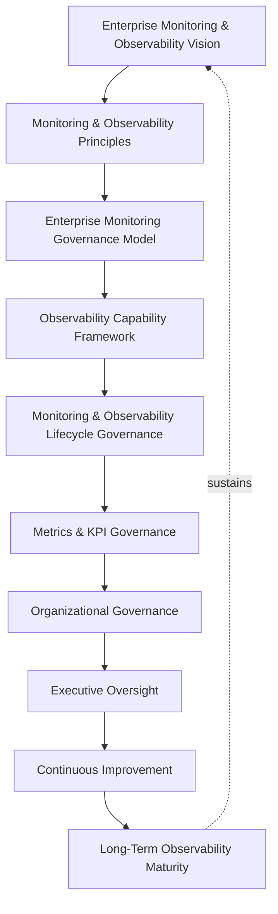
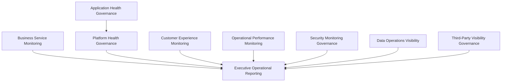
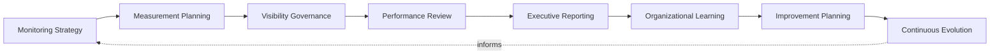
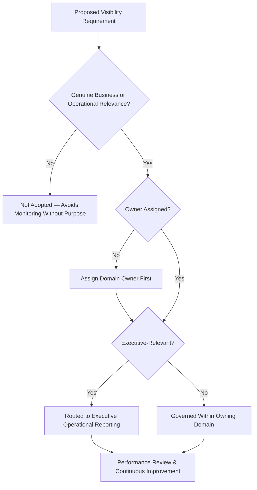
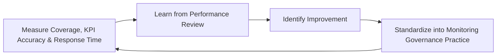
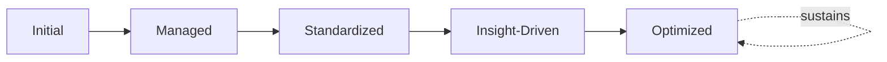

# Enterprise Monitoring & Observability Governance Framework

## 1. Executive Summary

**Purpose** — This document defines the official Enterprise Monitoring & Observability Governance Framework for **StackLeo Tech Store**. It establishes operational visibility, service health governance, metrics governance, organizational accountability, executive oversight, continuous improvement, and long-term observability maturity as a single, consolidated governance reference for the operations organization. `07_DevOps/monitoring-strategy.md` remains authoritative for the detailed domain-by-domain governance of monitoring — application, infrastructure, platform, security, business, customer experience, reliability, operational, and executive monitoring — built atop the telemetry foundation in `07_DevOps/observability-strategy.md`. `09_Operations/monitoring-observability.md` remains the operational strategy for how that visibility is used day to day. This framework does not restate either. It is the operations-organization consolidated reference that connects operational visibility directly to service health, KPI governance, and executive oversight across the whole `09_Operations` family — `operations-strategy.md`, `incident-management-framework.md`, `service-management-framework.md`, `business-continuity-framework.md`, and `disaster-recovery-framework.md`.

**Scope** — This framework applies to every category of operational visibility relevant to service health and business decision-making at StackLeo — business service, application, customer experience, operational performance, security, data operations, platform, executive, and third-party visibility — coordinated with `07_DevOps/monitoring-strategy.md`, `09_Operations/monitoring-observability.md`, and `metrics-governance.md`.

**Strategic Objectives** — To ensure the organization always knows how its services are genuinely performing, never left to guesswork; that visibility is organized around genuine business and operational relevance, not merely technical convenience; that key performance indicators are governed consistently and rolled up honestly to leadership; and that executive leadership has continuous, honest confidence in the platform's true operating state.

**Business Value** — A consolidated monitoring and observability governance framework protects the organization's ability to detect and respond to disruption before it compounds, protects leadership from decisions made on stale or fragmented visibility, and gives the Board confidence that StackLeo's operational state is always genuinely knowable.

**Intended Audience** — The Board of Directors, executive leadership, the Chief Technology Officer, operations leadership, engineering leadership, product leadership, security leadership, data leadership, and business stakeholders.

## 2. Enterprise Monitoring & Observability Vision

- **Operational Visibility as Business Capability** — visibility is governed as a genuine business capability, never merely a technical convenience for engineers.
- **Service Health Transparency** — the genuine health of every service is honestly, continuously knowable to those who need to know it.
- **Business Confidence** — visibility gives business leadership confidence that operational reality matches what is reported.
- **Customer Experience Protection** — visibility protects the organization's ability to notice a genuine threat to customer experience before the customer has to report it.
- **Data-Informed Operations** — operational decisions are genuinely grounded in observed reality, not assumption.
- **Continuous Operational Awareness** — the organization sustains genuine, ongoing awareness of its operating state, never confirmed once and assumed to persist.
- **Sustainable Service Excellence** — visibility is pursued as a durable discipline supporting genuine service excellence, never a one-time instrumentation project.

*Diagram 1: Enterprise Monitoring & Observability Framework — the visibility vision establishes principles and the governance model, flowing through capability, lifecycle, and metrics governance into organizational governance and executive oversight, with continuous improvement driving long-term maturity that reinforces the vision itself.*

### Enterprise Monitoring & Observability Vision Matrix

| Vision Element | Focus | Business Value |
|---|---|---|
| Operational Visibility as Business Capability | A genuine business capability, not a technical convenience | Prevents visibility from being treated as engineering-only concern |
| Service Health Transparency | Genuine health honestly and continuously knowable | Removes the cost of guessing at true operational state |
| Business Confidence | Confidence operational reality matches what is reported | Protects the credibility of every operationally-informed decision |
| Customer Experience Protection | Notices threats before the customer has to report them | Protects the trust relationship every interaction depends on |
| Data-Informed Operations | Decisions genuinely grounded in observed reality | Reduces the risk of decisions driven by assumption |
| Continuous Operational Awareness | Genuine, ongoing awareness, never assumed to persist | Keeps understanding current as the platform evolves |
| Sustainable Service Excellence | A durable discipline, not a one-time instrumentation project | Protects visibility investment from eroding over time |

## 3. Monitoring & Observability Principles

Monitoring and observability governance at StackLeo rests on nine principles, each producing a specific business outcome.

- **Visibility by Design** — visibility is considered from the outset of a service's design, never retrofitted after launch. *Business Value:* prevents the disproportionate cost of adding visibility to a service already running blind.
- **Business-Centric Monitoring** — visibility is organized around genuine business and operational relevance, not merely technical convenience. *Business Value:* ensures monitoring answers real business questions, not only technical ones.
- **Accountability** — every visibility domain traces to a specific, named, responsible owner. *Business Value:* ensures no domain drifts without someone genuinely responsible for it.
- **Transparency** — service health and operational status are documented and visible to those who genuinely need them. *Business Value:* allows operational posture to be scrutinized and defended, not merely trusted on faith.
- **Continuous Measurement** — key indicators are measured genuinely and continuously, never sampled once and assumed representative. *Business Value:* protects confidence that reported state reflects genuine current reality.
- **Proactive Awareness** — visibility exists to surface a genuine issue before it compounds, never merely to confirm one already obvious. *Business Value:* protects the window in which an issue can still be addressed cheaply.
- **Operational Learning** — understanding gained from observed operational reality deepens the organization's genuine collective capability. *Business Value:* converts operational experience into durable organizational capability.
- **Continuous Improvement** — monitoring and observability practice matures over time, informed by real operational outcomes. *Business Value:* keeps visibility aligned with the organization's growing scale and complexity.
- **Executive Visibility** — the organization's true operating state is genuinely, honestly visible to executive leadership. *Business Value:* protects leadership from decisions made on stale or fragmented visibility.

### Monitoring & Observability Principles Matrix

| Principle | Description | Business Value |
|---|---|---|
| Visibility by Design | Considered from the outset, never retrofitted | Prevents the cost of adding visibility to a service running blind |
| Business-Centric Monitoring | Organized around genuine business and operational relevance | Ensures monitoring answers real business questions |
| Accountability | Every domain traces to a specific, responsible owner | Ensures no domain drifts without genuine responsibility |
| Transparency | Health and status documented and visible to those who need it | Allows posture to be scrutinized and defended |
| Continuous Measurement | Genuine and continuous, never sampled once | Protects confidence reported state reflects current reality |
| Proactive Awareness | Surfaces issues before they compound, not merely confirms them | Protects the window in which an issue can still be addressed |
| Operational Learning | Observed reality deepening genuine collective capability | Converts operational experience into durable capability |
| Continuous Improvement | Practice matures from real operational outcomes | Keeps visibility aligned with growing scale and complexity |
| Executive Visibility | True operating state genuinely, honestly visible to leadership | Protects leadership from decisions made on stale visibility |

## 4. Enterprise Monitoring Governance Model

Monitoring governance operates across nine conceptual domains. Detailed, domain-specific governance for the seven domains shared with `07_DevOps/monitoring-strategy.md` remains authoritative there; this model adds the two domains — Data Operations Visibility and Third-Party Visibility Governance — specific to the operations organization's consolidated view, and connects every domain to executive operational reporting.

### Business Service Monitoring

- **Purpose** — govern visibility into genuine business service health and performance.
- **Governance Scope** — detailed governance held in Business Monitoring (`07_DevOps/monitoring-strategy.md`, Section 4).
- **Business Value** — connects visibility directly to genuine business consequence.
- **Executive Expectations** — leadership expects business service monitoring to answer genuine business questions.

### Application Health Governance

- **Purpose** — govern visibility into genuine application-level health and behavior.
- **Governance Scope** — detailed governance held in Application Monitoring (`07_DevOps/monitoring-strategy.md`, Section 4).
- **Business Value** — protects confidence application behavior can be genuinely understood.
- **Executive Expectations** — leadership expects application health to be visible without excessive, unmanaged volume.

### Customer Experience Monitoring

- **Purpose** — govern visibility into the customer's genuine experience of the platform.
- **Governance Scope** — detailed governance held in Customer Experience Monitoring (`07_DevOps/monitoring-strategy.md`, Section 4).
- **Business Value** — protects the trust relationship every customer interaction depends on.
- **Executive Expectations** — leadership expects customer experience visibility to be weighted alongside internal technical metrics.

### Operational Performance Monitoring

- **Purpose** — govern visibility into genuine day-to-day operational performance.
- **Governance Scope** — detailed governance held in Operational Monitoring (`07_DevOps/monitoring-strategy.md`, Section 4).
- **Business Value** — protects the organization's ability to genuinely operate what it has built.
- **Executive Expectations** — leadership expects operational performance visibility to extend beyond deployment.

### Security Monitoring Governance

- **Purpose** — govern visibility into security-relevant operational conditions, jointly with, and never superseding, `06_Security/security-monitoring.md`.
- **Governance Scope** — detailed governance held in Security Monitoring (`07_DevOps/monitoring-strategy.md`, Section 4).
- **Business Value** — protects StackLeo's core trust differentiator through genuine security visibility.
- **Executive Expectations** — leadership expects security visibility to be treated as mandatory, non-negotiable.

### Data Operations Visibility

- **Purpose** — govern visibility into the genuine health and operation of the platform's data services.
- **Governance Scope** — coordinated with `04_Database/data-governance.md` and `04_Database/data-quality-framework.md`.
- **Business Value** — protects the trustworthiness of the data every business decision depends on.
- **Executive Expectations** — leadership expects data operations visibility to be governed proportionate to data sensitivity.

### Platform Health Governance

- **Purpose** — govern visibility into shared platform capability consumed across multiple services.
- **Governance Scope** — detailed governance held in Platform Monitoring (`07_DevOps/monitoring-strategy.md`, Section 4).
- **Business Value** — ensures a platform-level visibility gap is never treated as a single team's isolated concern.
- **Executive Expectations** — leadership expects platform health visibility with awareness of broad dependency footprint.

### Executive Operational Reporting

- **Purpose** — govern the synthesized, executive-relevant picture of operational visibility across every domain above.
- **Governance Scope** — detailed governance held in Executive Monitoring (`07_DevOps/monitoring-strategy.md`, Section 4), consolidated here into the operations organization's executive reporting cadence.
- **Business Value** — protects leadership's ability to understand overall visibility as a whole, not domain by domain.
- **Executive Expectations** — leadership expects one coherent visibility picture, not nine disconnected domain feeds.

### Third-Party Visibility Governance

- **Purpose** — govern visibility into the genuine operational health of vendor and integration partner dependencies.
- **Governance Scope** — coordinated with `06_Security/third-party-risk-governance.md`.
- **Business Value** — protects the ability to investigate and attribute failure originating in an external dependency.
- **Executive Expectations** — leadership expects third-party visibility to be sufficient to attribute failure to the correct party.

### Monitoring Governance Matrix

| Domain | Purpose | Business Value | Executive Expectations |
|---|---|---|---|
| Business Service Monitoring | Govern visibility into business service health | Connects visibility to genuine business consequence | Expects visibility to answer genuine business questions |
| Application Health Governance | Govern visibility into application-level health | Protects confidence behavior can be genuinely understood | Expects visibility without excessive volume |
| Customer Experience Monitoring | Govern visibility into genuine customer experience | Protects the trust relationship every interaction depends on | Expects weighting alongside internal technical metrics |
| Operational Performance Monitoring | Govern visibility into day-to-day performance | Protects the ability to genuinely operate what is built | Expects visibility extending beyond deployment |
| Security Monitoring Governance | Govern visibility into security-relevant conditions | Protects StackLeo's core trust differentiator | Expects treatment as mandatory, non-negotiable |
| Data Operations Visibility | Govern visibility into data service health | Protects the trustworthiness of data decisions depend on | Expects visibility proportionate to data sensitivity |
| Platform Health Governance | Govern visibility into shared platform capability | Ensures a gap is never one team's isolated concern | Expects awareness of broad dependency footprint |
| Executive Operational Reporting | Synthesize the enterprise visibility picture | Protects leadership's ability to understand posture as a whole | Expects one coherent picture, not disconnected feeds |
| Third-Party Visibility Governance | Govern visibility into vendor and partner dependencies | Protects ability to investigate and attribute external failure | Expects sufficient detail for accurate attribution |

*Diagram 2: Monitoring Governance Model — business service, application health, customer experience, operational performance, security, data operations, and third-party visibility all converge on executive operational reporting, which synthesizes every domain into one coherent enterprise picture.*

## 5. Observability Capability Framework

Observability capability is governed across eight conceptual domains, each requiring a distinct governance emphasis. Remaining implementation independent, these domains describe capability — never a specific tool, platform, or telemetry technology, which remain governed in `07_DevOps/observability-strategy.md`.

- **Operational Visibility** — governs whether genuinely relevant operational conditions are captured and available when needed.
- **Service Health** — governs whether a service's genuine health can be confidently assessed at any moment.
- **Business Metrics Governance** — governs how business-relevant measurement is coordinated with `metrics-governance.md`.
- **Operational Intelligence** — governs how visibility supports genuine understanding of operational health and behavior.
- **Performance Visibility** — governs whether genuine performance against expectation is continuously knowable.
- **Customer Experience Visibility** — governs whether the customer's genuine experience is continuously knowable.
- **Executive Reporting** — governs how visibility converges into a form genuinely usable by executive leadership.
- **Continuous Improvement** — governs how observability capability deliberately matures from real operational outcomes.

### Observability Capability Matrix

| Capability | Governance Focus | Coordination |
|---|---|---|
| Operational Visibility | Genuinely relevant conditions captured and available | Business Service and Operational Performance Monitoring (Section 4) |
| Service Health | Genuine health confidently assessable at any moment | Application and Platform Health Governance (Section 4) |
| Business Metrics Governance | Business-relevant measurement coordination | `metrics-governance.md` |
| Operational Intelligence | Genuine understanding of operational health and behavior | `07_DevOps/monitoring-strategy.md` |
| Performance Visibility | Genuine performance against expectation, continuously knowable | Service Level Governance coordinated with `service-management-framework.md` |
| Customer Experience Visibility | Genuine customer experience, continuously knowable | Customer Experience Monitoring (Section 4) |
| Executive Reporting | Visibility converged into a genuinely usable form | Executive Operational Reporting (Section 4) |
| Continuous Improvement | Capability deliberately maturing from real outcomes | Continuous Improvement (Section 3) |

## 6. Monitoring & Observability Lifecycle Governance

Monitoring and observability governance operates across eight conceptual lifecycle stages.

- **Monitoring Strategy** — govern how the organization decides its overall approach and priority toward visibility investment.
- **Measurement Planning** — govern how specific measurement requirements are defined before instrumentation begins.
- **Visibility Governance** — govern how planned measurement is reviewed against the appropriate domain in Section 4.
- **Performance Review** — govern the periodic, formal review of measured performance for genuine insight.
- **Executive Reporting** — govern how reviewed performance is presented to executive leadership.
- **Organizational Learning** — govern how understanding gained from observed operational reality is captured as durable knowledge.
- **Improvement Planning** — govern how a genuine visibility gap is planned for deliberate remediation.
- **Continuous Evolution** — govern the periodic reassessment of whether visibility priorities remain aligned with evolving business need.

### Monitoring Lifecycle Matrix

| Stage | Governance Objective | Business Value |
|---|---|---|
| Monitoring Strategy | Decide overall approach and priority toward investment | Ensures visibility effort is deliberately directed |
| Measurement Planning | Define specific requirements before instrumentation | Ensures measurement is deliberate, not incidental |
| Visibility Governance | Review planned measurement against the appropriate domain | Ensures review by the genuinely accountable function |
| Performance Review | Periodically review measured performance for genuine insight | Confirms visibility investment is genuinely working |
| Executive Reporting | Present reviewed performance to executive leadership | Ensures leadership sees only genuinely trustworthy visibility |
| Organizational Learning | Capture understanding as durable organizational knowledge | Converts observed reality into lasting organizational insight |
| Improvement Planning | Plan deliberate remediation of a genuine gap | Ensures gaps are addressed deliberately, not left to accumulate |
| Continuous Evolution | Reassess alignment with evolving business need | Keeps visibility genuinely connected to business intent |

*Diagram 3: Monitoring & Observability Lifecycle — monitoring strategy and measurement planning inform visibility governance and performance review, feeding executive reporting and organizational learning, with improvement planning and continuous evolution feeding lessons back into the cycle.*

## 7. Metrics & KPI Governance

Metric and KPI governance detail is elaborated in full in `metrics-governance.md`; this section governs how metrics specifically feed operational visibility and executive reporting for the operations organization.

- **Business KPIs** — govern which business-relevant indicators are reported through operational visibility.
- **Operational KPIs** — govern which day-to-day operational indicators are tracked and reported.
- **Service Health Indicators** — govern the specific indicators used to assess genuine service health.
- **Customer Experience Indicators** — govern the specific indicators used to assess genuine customer experience.
- **Reliability Indicators** — govern the specific indicators coordinated with `07_DevOps/reliability-engineering-framework.md`.
- **Executive Performance Metrics** — govern which metrics are synthesized into the executive operational reporting picture.
- **Continuous Measurement** — govern the ongoing, genuine measurement discipline every KPI depends on.

### Metrics & KPI Governance Matrix

| KPI Area | Focus | Governance Coordination |
|---|---|---|
| Business KPIs | Business-relevant indicators reported through visibility | `metrics-governance.md` (Business Metrics) |
| Operational KPIs | Day-to-day operational indicators tracked and reported | Operational Performance Monitoring (Section 4) |
| Service Health Indicators | Indicators used to assess genuine service health | `service-management-framework.md` (Service Quality Governance) |
| Customer Experience Indicators | Indicators used to assess genuine customer experience | Customer Experience Monitoring (Section 4) |
| Reliability Indicators | Indicators coordinated with the reliability discipline | `07_DevOps/reliability-engineering-framework.md` |
| Executive Performance Metrics | Metrics synthesized into executive reporting | Executive Operational Reporting (Section 4) |
| Continuous Measurement | Ongoing, genuine measurement discipline | Continuous Measurement (Section 3) |

## 8. Organizational Governance

Governance accountability is distributed deliberately across nine organizational roles.

- **Board of Directors** — holds ultimate accountability for whether StackLeo's operational state is genuinely knowable to leadership.
- **Executive Leadership** — holds accountability for whether visibility genuinely informs decisions, in partnership with the Board.
- **Chief Technology Officer** — owns the coherence of this framework's synthesis across `07_DevOps/monitoring-strategy.md` and `09_Operations/monitoring-observability.md`.
- **Operations Leadership** — owns the operational governance defined in `monitoring-observability.md` and `operations-strategy.md`.
- **Engineering Leadership** — own Application Health and Platform Health Governance (Section 4) within their accountable teams.
- **Product Leadership** — own Customer Experience Monitoring (Section 4) alignment with genuine product priority.
- **Security Leadership** — own Security Monitoring Governance (Section 4) jointly with `06_Security/security-monitoring.md`.
- **Data Leadership** — own Data Operations Visibility (Section 4) jointly with `04_Database/data-governance.md`.
- **Business Stakeholders** — own Business Service Monitoring (Section 4) alignment with genuine business priority.

### Organizational Responsibility Matrix

| Role | Governance Objective | Business Value |
|---|---|---|
| Board of Directors | Hold ultimate accountability for genuine operational knowability | Provides the highest point of ultimate accountability |
| Executive Leadership | Hold accountability for visibility genuinely informing decisions | Provides a single point of executive-level accountability |
| Chief Technology Officer | Own coherence of this framework's synthesis | Connects the consolidated view to authoritative sources |
| Operations Leadership | Own operational governance and its family of strategies | Applies governance to day-to-day visibility practice |
| Engineering Leadership | Own application and platform health governance | Embeds accountability closest to where services run |
| Product Leadership | Own customer experience monitoring alignment | Ensures visibility reflects genuine product priority |
| Security Leadership | Own security monitoring governance jointly with security | Ensures visibility genuinely supports security posture |
| Data Leadership | Own data operations visibility jointly with data governance | Ensures visibility genuinely supports data trustworthiness |
| Business Stakeholders | Own business service monitoring alignment | Connects visibility to genuine business relevance |

*Diagram 4: Operational Visibility Structure — a proposed visibility requirement is checked for genuine relevance and assigned ownership, routed to executive operational reporting where genuinely relevant, resolving into ongoing performance review and continuous improvement.*

## 9. Monitoring & Observability Risk Governance

Monitoring and observability-related risk is governed across eight conceptual categories.

- **Blind Spots** — the risk that a genuinely important operational condition remains unobserved.
- **Missing Visibility** — the risk that visibility exists but fails to reach the person who genuinely needs it.
- **Poor Decision-Making** — the risk that a decision is made on incomplete or stale visibility.
- **Customer Experience Risks** — the risk that a genuine threat to customer experience goes unnoticed until the customer reports it.
- **Operational Risks** — the risk that weak visibility itself degrades the organization's ability to operate.
- **Business Continuity Risks** — the risk that a lack of visibility delays recognition of a genuine continuity threat.
- **Reputation Risks** — the risk that a visibility failure damages StackLeo's standing with customers, partners, or the market.
- **Strategic Risks** — the risk that leadership makes a consequential strategic decision without genuine operational visibility.

### Monitoring Risk Matrix

| Risk Category | Focus | Governance Coordination |
|---|---|---|
| Blind Spots | A genuinely important condition remains unobserved | Coordinated with Operational Visibility (Section 5) |
| Missing Visibility | Visibility exists but fails to reach who needs it | Coordinated with Transparency (Section 3) |
| Poor Decision-Making | A decision made on incomplete or stale visibility | Coordinated with Executive Reporting (Section 6) |
| Customer Experience Risks | A threat to experience unnoticed until reported | Coordinated with Customer Experience Monitoring (Section 4) |
| Operational Risks | Weak visibility degrading the ability to operate | Coordinated with `operations-strategy.md` |
| Business Continuity Risks | Delayed recognition of a continuity threat | Coordinated with `business-continuity-framework.md` |
| Reputation Risks | Damage to standing from a visibility failure | Coordinated with Executive Oversight (Section 10) |
| Strategic Risks | A consequential decision made without genuine visibility | Coordinated with Executive Operational Reporting (Section 4) |

## 10. Executive Oversight

- **Operational Health Reviews** — the overall operational health picture is formally reviewed directly with executive leadership on a regular cadence.
- **Business KPI Reviews** — business-relevant indicators are reviewed directly with executive leadership.
- **Service Health Reviews** — the genuine health of every critical service is reviewed as a distinct, ongoing concern.
- **Executive Performance Reviews** — synthesized executive operational reporting is reviewed for genuine accuracy and completeness.
- **Strategic Visibility Reviews** — the alignment of visibility investment with evolving business direction is reviewed directly with executive leadership.
- **Continuous Improvement Reviews** — the organization's follow-through on captured visibility governance lessons is reviewed directly with executive leadership.

### Executive Oversight Matrix

| Oversight Mechanism | Purpose | Governance Role |
|---|---|---|
| Operational Health Reviews | Review the overall operational health picture | Regular, predictable cadence for the framework as a whole |
| Business KPI Reviews | Review business-relevant indicators | Direct executive-level KPI review |
| Service Health Reviews | Review genuine health of every critical service | Direct executive-level review of the highest-priority services |
| Executive Performance Reviews | Review synthesized reporting for accuracy | Ensures leadership sees genuinely trustworthy visibility |
| Strategic Visibility Reviews | Review alignment with evolving business direction | Direct executive-level strategic alignment review |
| Continuous Improvement Reviews | Review follow-through on captured lessons | Direct executive-level review of improvement completion |

## 11. Future Readiness

This framework is designed to remain valid as StackLeo evolves in scale, geography, and organizational complexity.

- **AI-Assisted Operational Intelligence** — as performance review increasingly incorporates AI-assisted methods, coordinated with `04_Database/ai-governance.md`, they remain governed under Performance Review (Section 6) at the same rigor as any other method.
- **Predictive Observability** — where the organization develops the capability to anticipate an operational issue before it fully materializes, that capability is governed as an extension of Operational Intelligence (Section 5).
- **Intelligent Operational Analytics** — where visibility increasingly draws on intelligent pattern analysis, that analysis remains subject to the same Visibility Governance (Section 6) as any other method.
- **Autonomous Monitoring Governance (Conceptual)** — where automation increasingly performs steps within performance review or improvement planning, that automation remains subject to the same ownership and executive oversight as any human-performed activity.
- **Enterprise-Scale Visibility** — the governance model, domains, and lifecycle defined throughout this framework are defined independently of organizational size.
- **Digital Operations Intelligence** — this framework's governance discipline is treated as a direct, durable contributor to the digital trust customers, partners, and regulators extend to StackLeo.

## 12. Monitoring & Observability Maturity Model

Monitoring and observability governance maturity is described across five conceptual levels.

- **Initial** — visibility, where it exists, is informal and inconsistent; conditions are noticed reactively, and ownership is unclear.
- **Managed** — basic visibility governance exists for individual domains, but consistency across the nine domains in Section 4 varies significantly.
- **Standardized** — the governance model, domains, and lifecycle are standardized, documented, and consistently applied across the organization.
- **Insight-Driven** — decisions across the organization are genuinely and routinely grounded in governed visibility rather than impression.
- **Optimized** — monitoring and observability governance is continuously and deliberately improved based on quantitative evidence and organizational learning; improvement itself is a managed, ongoing discipline.

### Monitoring Maturity Matrix

| Level | Characteristics | Primary Focus |
|---|---|---|
| Initial | Informal, inconsistent visibility; conditions noticed reactively | Ad hoc, individually-dependent visibility practice |
| Managed | Basic governance exists per domain; consistency varies | Domain-level consistency |
| Standardized | Standardized governance model, domains, and lifecycle | Organization-wide consistency and clear ownership |
| Insight-Driven | Decisions genuinely and routinely grounded in visibility | Evidence-based decision-making as the organizational norm |
| Optimized | Practice continuously and deliberately improved from evidence | Sustained, deliberate improvement as a discipline |

*Diagram 5: Continuous Observability Improvement Cycle — visibility coverage, KPI accuracy, and response time are measured, learned from, improved upon, and standardized back into governed practice, on a continuing basis.*

*Diagram 6: Monitoring & Observability Maturity Progression — maturity advances from informal, reactively-noticed visibility practice toward standardized, genuinely insight-driven, and continuously optimized monitoring and observability governance.*

## 13. Monitoring & Observability Anti-Patterns

- **Monitoring Without Purpose** — capturing conditions without a genuine, governed reason produces volume without direction.
- **Too Many Metrics** — tracking more indicators than leadership can genuinely absorb obscures the insight visibility was meant to convey.
- **Missing Business KPIs** — visibility that captures only technical detail without business-relevant indicators fails to inform real decisions.
- **Weak Executive Visibility** — leadership lacking genuine, honest operational visibility undermines the accountability this framework depends on.
- **Reactive Monitoring** — noticing a condition only once it has already caused disruption forfeits the chance to detect it proactively.
- **Lack of Ownership** — a visibility domain with no accountable owner has no one genuinely responsible for its coverage or quality.
- **Ignoring Continuous Improvement** — treating current visibility practice as permanently finished guarantees it falls behind the organization's growing scale and complexity.
- **Data Without Decisions** — accumulating visibility that never genuinely informs a decision wastes the investment it represents.

### Anti-Pattern Summary

| Anti-Pattern | Organizational & Business Impact |
|---|---|
| Monitoring Without Purpose | Produces volume without direction, wasting investment |
| Too Many Metrics | Obscures the insight visibility was meant to convey |
| Missing Business KPIs | Fails to inform real business decisions |
| Weak Executive Visibility | Undermines the accountability this entire framework depends on |
| Reactive Monitoring | Forfeits the chance to detect an issue proactively |
| Lack of Ownership | Leaves no one genuinely responsible for coverage or quality |
| Ignoring Continuous Improvement | Guarantees practice falls behind growing scale and complexity |
| Data Without Decisions | Wastes the investment visibility represents |

## Related Documents

| Document | Relationship |
|---|---|
| `07_DevOps/monitoring-strategy.md` | Remains authoritative for the detailed, domain-by-domain monitoring governance this framework consolidates a governance-level view of. |
| `07_DevOps/observability-strategy.md` | Provides the technical and philosophical telemetry foundation this framework's Observability Capability Framework (Section 5) draws upon. |
| `09_Operations/monitoring-observability.md` | The operational strategy this framework's domains and lifecycle synthesize a consolidated reference from. |
| `metrics-governance.md` | Elaborates the metric-specific governance this framework's Metrics & KPI Governance (Section 7) coordinates with. |
| `operations-strategy.md` | Provides the enterprise operations context this framework's Operational Performance Monitoring (Section 4) elaborates. |
| `incident-management-framework.md` | Consumes this framework's Operational Visibility (Section 5) as the precondition for Incident Identification. |
| `service-management-framework.md` | Consumes this framework's Service Health capability (Section 5) as an input to Service Quality Governance. |
| `business-continuity-framework.md` | Consumes this framework's visibility as an input to Business Impact Awareness. |
| `disaster-recovery-framework.md` | Consumes this framework's visibility as an input to Disaster Assessment. |
| `operational-excellence-framework.md` | Elaborates the excellence discipline this framework's Monitoring Maturity Model (Section 12) extends into visibility-specific practice. |
| `operations-maturity-framework.md` | Consolidates this framework's Monitoring Maturity Model (Section 12) into the enterprise-wide operations maturity picture. |
| `06_Security/security-risk-management.md` | Elaborates the operational risk management practice this framework's Monitoring Risk Governance (Section 9) coordinates with. |

## Document Information

| Property | Value |
|----------|-------|
| Document | monitoring-observability-governance.md |
| Version | 1.0.0 |
| Status | Active |
| Maintained By | StackLeo |
| Last Updated | 2026-07-29 |

---

© StackLeo. All Rights Reserved.
