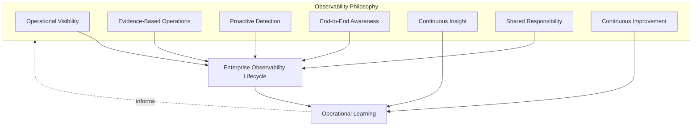
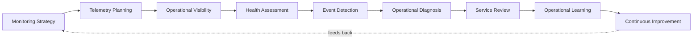
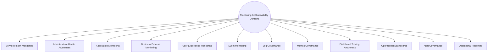
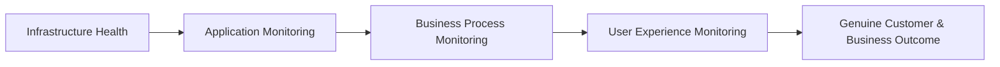
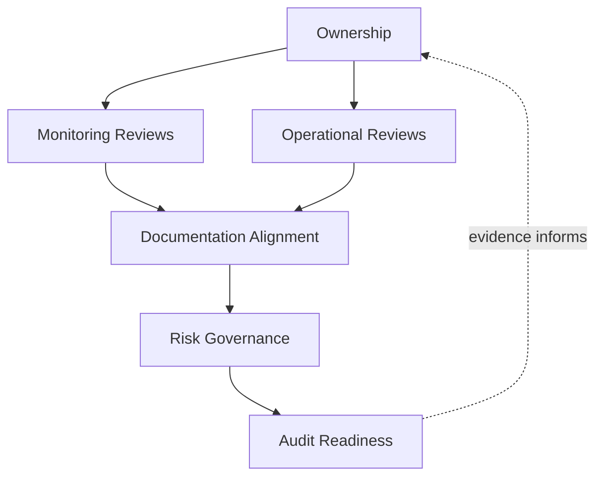
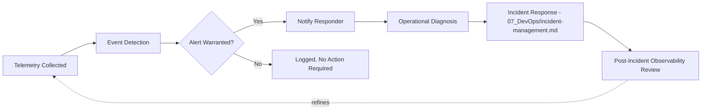
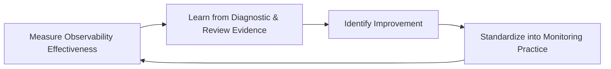
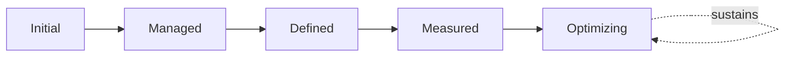

# Enterprise Monitoring, Observability & Operational Visibility Strategy

## 1. Document Purpose

This document defines the official Enterprise Monitoring, Observability & Operational Visibility Strategy for **StackLeo Tech Store**. It establishes how the platform's true operating state is made continuously knowable to the people who must act on it — independent of any specific monitoring tool, logging platform, tracing system, or APM solution.

- **Purpose of Monitoring & Observability** — this strategy exists to ensure the organization always knows how the platform is genuinely behaving, so that questions about that behavior can be answered without guesswork and problems can be understood quickly, elaborating Monitoring & Observability as introduced in `operations-overview.md` (Section 5.2).
- **Relationship with Operations** — this document is the monitoring-specific elaboration of `operations-overview.md`; where that document establishes the operating model and lifecycle for operations broadly, this document defines specifically how continuous situational awareness is achieved and sustained.
- **Relationship with Reliability Engineering** — this strategy operates on the observability foundation architected in `07_DevOps/observability-strategy.md`; it defines how that architected capability is actually used, day to day, by the people responsible for keeping the platform healthy, directly enabling the reliability objectives of `07_DevOps/sre-strategy.md`.
- **Relationship with Incident Management** — monitoring and observability are the precondition for effective incident response; this strategy defines how disruption is detected and understood before `07_DevOps/incident-management.md` response practice engages, and how diagnostic capability supports that response once it begins.
- **Relationship with Service Level Management** — Service Level Indicators (`service-level-management.md`, Section 4.3) are only meaningful if grounded in trustworthy, comprehensive telemetry; this strategy is the evidentiary foundation service level tracking depends on.
- **Relationship with Business Continuity** — the speed at which the organization detects and understands a disruption directly determines its business impact; this strategy is a direct, proactive investment in limiting that impact, consistent with `06_Security/business-continuity.md`.

This document is implementation-independent and vendor-neutral. It defines observability philosophy, lifecycle, domains, and governance — not specific monitoring tools, logging platforms, tracing systems, APM solutions, telemetry implementation technologies, or infrastructure configuration.

## 2. Observability Philosophy

Monitoring and observability at StackLeo are governed by seven principles. Each exists to produce a specific business outcome — visibility is pursued deliberately because of the confidence and speed it enables, not as passive data collection.

### 2.1 Operational Visibility

The platform's true operating state is knowable at any moment, not only discoverable after something has already gone wrong.

- **Business Value** — allows problems to be noticed and addressed while still small, rather than discovered only once they have become customer-visible.

### 2.2 Evidence-Based Operations

Operational decisions are grounded in observed telemetry, consistent with Evidence-Based Decisions in `operations-overview.md` (Section 6), rather than assumption or anecdote.

- **Business Value** — reduces the influence of guesswork and recency bias on decisions that materially affect customers and revenue.

### 2.3 Proactive Detection

Deviation from expected behavior is identified as early as possible, ideally before it meaningfully affects customers.

- **Business Value** — reduces both the frequency and severity of customer-visible disruption by catching problems upstream of their consequences.

### 2.4 End-to-End Awareness

Visibility spans the complete customer and business journey — from infrastructure through application to business outcome — not only isolated technical components.

- **Business Value** — prevents the common failure mode where every individual component appears healthy while the customer's actual experience is not.

### 2.5 Continuous Insight

Telemetry is treated as an ongoing source of understanding, not merely a record consulted after a problem is already suspected.

- **Business Value** — surfaces gradual drift and emerging risk long before it would otherwise become an acute, customer-visible failure.

### 2.6 Shared Responsibility

Monitoring and observability are owned jointly by Engineering, SRE, Operations, and Security; no single function alone determines whether the platform's behavior is genuinely visible.

- **Business Value** — prevents the anti-pattern in Section 10.7, where visibility gaps persist because ownership of "who watches this" was never made explicit.

### 2.7 Continuous Improvement

Monitoring and observability practice matures over time, informed by what operational experience reveals about where visibility was insufficient.

- **Business Value** — keeps observability capability aligned with StackLeo's growth in scale, architectural complexity, and business model.

*Diagram 1: Observability Philosophy Overview — the seven principles shape the enterprise observability lifecycle, and operational learning feeds back into the philosophy itself.*

## 3. Enterprise Observability Lifecycle

Observability is governed across nine conceptual stages, spanning from initial strategy through operational learning and continuous improvement.

### 3.1 Monitoring Strategy

- **Purpose** — determine what needs to be observable across the platform and why, before any specific telemetry is planned.
- **Business Value** — ensures monitoring effort is deliberate and value-driven, not an accumulation of whatever happens to be easy to collect.
- **Governance Objectives** — require every significant service (`service-catalog.md`) to have a documented monitoring intent before Telemetry Planning (Section 3.2) begins.

### 3.2 Telemetry Planning

- **Purpose** — determine which specific signals will be captured to fulfill the monitoring strategy.
- **Business Value** — ensures telemetry effort is targeted at genuinely useful signals, consistent with Meaningful Telemetry (Section 5.1).
- **Governance Objectives** — require telemetry plans to trace to a specific monitoring intent from Section 3.1.

### 3.3 Operational Visibility

- **Purpose** — establish and sustain the ongoing, continuous view of platform and service health that planned telemetry makes possible.
- **Business Value** — converts collected telemetry into genuine, usable situational awareness for the people who need it.
- **Governance Objectives** — ensure visibility is continuously available to accountable roles, not assembled only on demand.

### 3.4 Health Assessment

- **Purpose** — continuously evaluate whether observed platform and service behavior is within expected bounds.
- **Business Value** — provides the ongoing judgment that distinguishes normal variation from genuine concern.
- **Governance Objectives** — require health assessment criteria to be documented and applied consistently, not left to informal impression.

### 3.5 Event Detection

- **Purpose** — identify when observed behavior deviates from expected bounds in a way that warrants attention.
- **Business Value** — is the mechanism through which Proactive Detection (Section 2.3) becomes concrete and actionable.
- **Governance Objectives** — ensure detected events are routed consistently to accountable responders, consistent with Alert Governance (Section 4.11).

### 3.6 Operational Diagnosis

- **Purpose** — investigate a detected event to understand its nature, scope, and likely cause sufficiently to inform response.
- **Business Value** — reduces the time between detection and effective action, directly limiting business and customer impact.
- **Governance Objectives** — ensure diagnostic capability (logs, metrics, traces) is available and correlated across the full journey implicated by an event.

### 3.7 Service Review

- **Purpose** — periodically evaluate observability coverage and effectiveness for a given service against its criticality and monitoring intent.
- **Business Value** — gives service owners an honest view of whether their visibility is genuinely adequate, not merely assumed to be.
- **Governance Objectives** — connect service-level observability review to the Service Review Matrix in `service-level-management.md` (Section 5).

### 3.8 Operational Learning

- **Purpose** — capture what monitoring and diagnostic experience reveals about gaps or strengths in current observability practice.
- **Business Value** — converts real operational experience into a durable input for improving future monitoring strategy.
- **Governance Objectives** — ensure significant observability learnings are documented and routed back into Section 3.1 and Section 3.2.

### 3.9 Continuous Improvement

- **Purpose** — act on operational learning to deliberately improve monitoring and observability practice.
- **Business Value** — ensures observability effectiveness compounds over time rather than remaining static as the platform grows.
- **Governance Objectives** — ensure improvement actions arising from observability review are tracked to completion.

### Enterprise Observability Lifecycle Matrix

| Stage | Purpose | Business Value | Governance Objective |
|---|---|---|---|
| Monitoring Strategy | Determine what needs to be observable and why | Ensures effort is deliberate, not accumulated by convenience | Every significant service has documented monitoring intent |
| Telemetry Planning | Determine which specific signals to capture | Targets genuinely useful signals | Telemetry plans trace to a documented monitoring intent |
| Operational Visibility | Establish and sustain the continuous health view | Converts telemetry into usable situational awareness | Visibility continuously available to accountable roles |
| Health Assessment | Continuously evaluate behavior against expected bounds | Distinguishes normal variation from genuine concern | Assessment criteria documented and applied consistently |
| Event Detection | Identify deviations warranting attention | Makes proactive detection concrete and actionable | Detected events routed consistently to accountable responders |
| Operational Diagnosis | Investigate an event's nature, scope, and cause | Reduces time between detection and effective action | Diagnostic capability available and correlated end-to-end |
| Service Review | Periodically evaluate observability coverage adequacy | Gives owners an honest view of genuine adequacy | Connected to the service-level review cadence |
| Operational Learning | Capture what experience reveals about observability gaps | Converts real experience into durable input | Learnings documented and routed back to strategy |
| Continuous Improvement | Act on learning to improve observability practice | Effectiveness compounds over time | Improvement actions tracked to completion |

*Diagram 2: Enterprise Observability Lifecycle — a continuous cycle in which operational learning and improvement directly inform the next iteration of monitoring strategy.*

## 4. Monitoring & Observability Domains

Monitoring and observability span twelve conceptual domains, each providing a distinct dimension of visibility into the platform.

### 4.1 Service Health Monitoring

- **Purpose** — continuously assess whether each cataloged service (`service-catalog.md`) is behaving within its expected bounds.
- **Scope** — service-level health signals mapped to each entry in the Service Catalog.
- **Governance Expectations** — every service classified as significant in `service-catalog.md` (Section 4.8, Service Criticality) has active health monitoring.
- **Business Importance** — provides the primary, business-aligned view of whether the platform is genuinely serving its purpose.

### 4.2 Infrastructure Health Awareness

- **Purpose** — maintain awareness of the health of the underlying technical environment services run on.
- **Scope** — informed by `03_System_Design/deployment-architecture.md`, covering compute, network, and storage health conceptually.
- **Governance Expectations** — infrastructure signals are distinguished from service-level signals, so root cause is never confused with symptom.
- **Business Importance** — allows infrastructure-caused degradation to be identified and addressed at its true source.

### 4.3 Application Monitoring

- **Purpose** — observe the behavior of application-level logic and processing.
- **Scope** — application-level correctness and performance signals, consistent with Application Security awareness in `06_Security` where relevant.
- **Governance Expectations** — application monitoring is scoped to reflect genuine business logic risk, per Risk-Based Prioritization used throughout this repository.
- **Business Importance** — catches defects and degradation specific to business logic that infrastructure-level monitoring alone would miss.

### 4.4 Business Process Monitoring

- **Purpose** — observe whether key business processes (order placement, payment processing, fulfillment coordination) are completing successfully.
- **Scope** — business outcome signals, distinct from and complementary to technical health signals.
- **Governance Expectations** — business process monitoring is reviewed jointly with Product and Business stakeholders, not treated as a purely technical concern.
- **Business Importance** — directly reflects whether the platform is delivering genuine business value, which technical health alone cannot fully confirm.

### 4.5 User Experience Monitoring

- **Purpose** — observe the platform's behavior as customers actually experience it.
- **Scope** — customer-facing responsiveness and correctness, informed by `08_Quality_Assurance/performance-testing.md` and `02_Product/user-journeys.md`.
- **Governance Expectations** — user experience signals are prioritized for the critical customer journey (browse, cart, checkout, payment, order).
- **Business Importance** — is the closest available proxy for genuine customer-perceived quality, complementing internal technical measures.

### 4.6 Event Monitoring

- **Purpose** — continuously observe discrete, significant occurrences across the platform.
- **Scope** — significant business and operational events, distinct from continuous metric signals.
- **Governance Expectations** — event monitoring criteria are defined deliberately, avoiding both excessive noise and dangerous under-capture.
- **Business Importance** — provides the specific, discrete signals that most directly trigger Event Detection (Section 3.5).

### 4.7 Log Governance

- **Purpose** — govern how diagnostic and audit-relevant event data is captured, structured, and retained.
- **Scope** — informed by `07_DevOps/observability-strategy.md`, covering the governance of log data rather than its specific technical implementation.
- **Governance Expectations** — log governance balances diagnostic usefulness against data protection expectations in `06_Security/data-protection.md`.
- **Business Importance** — provides the detailed evidentiary basis Operational Diagnosis (Section 3.6) depends on.

### 4.8 Metrics Governance

- **Purpose** — govern how quantitative operational and business signals are defined and interpreted.
- **Scope** — informed by `08_Quality_Assurance/quality-metrics.md`, extended here to operational and reliability measures.
- **Governance Expectations** — metrics are defined with clear purpose, consistent with Metrics as Decision Support (`08_Quality_Assurance/quality-metrics.md`, Section 2.1).
- **Business Importance** — provides the aggregate, trend-visible basis for Health Assessment (Section 3.4) and Service Review (Section 3.7).

### 4.9 Distributed Tracing Awareness

- **Purpose** — maintain the conceptual capability to follow a single transaction's path across multiple components and services.
- **Scope** — cross-component transaction visibility, particularly relevant as the architecture evolves toward the microservices posture discussed in Section 7.
- **Governance Expectations** — tracing coverage is prioritized for cross-domain transactions (e.g., checkout through order through shipping) with the highest business criticality.
- **Business Importance** — enables efficient root-cause analysis for issues that span multiple components, which isolated component-level monitoring cannot resolve alone.

### 4.10 Operational Dashboards

- **Purpose** — present observed telemetry in a form that supports rapid, accurate human understanding.
- **Scope** — conceptual presentation of health and performance signals to operational and business audiences.
- **Governance Expectations** — dashboard content is reviewed for genuine usefulness to its intended audience, not accumulated indiscriminately.
- **Business Importance** — determines whether collected telemetry actually translates into human understanding, or remains inert data.

### 4.11 Alert Governance

- **Purpose** — govern how abnormal conditions are surfaced to responders with appropriate urgency.
- **Scope** — the rules and discipline determining when a detected event becomes an alert requiring human attention.
- **Governance Expectations** — alert criteria are deliberately tuned to avoid both Excessive Alerting and dangerous under-alerting (Section 10.2).
- **Business Importance** — determines whether responders can trust and act promptly on alerts, or become desensitized to them.

### 4.12 Operational Reporting

- **Purpose** — communicate observability and operational health findings to stakeholders who depend on them for decisions.
- **Scope** — informed by Service Reporting in `service-management.md` (Section 4.9), extended to operational and reliability-specific reporting.
- **Governance Expectations** — reporting reflects genuine underlying telemetry and is produced on a predictable, regular cadence.
- **Business Importance** — gives leadership and stakeholders an honest basis for informed operational and investment decisions.

### Monitoring & Observability Domain Matrix

| Domain | Purpose | Governance Expectations | Business Importance |
|---|---|---|---|
| Service Health Monitoring | Assess whether each service behaves within bounds | Active monitoring for every significant service | Primary, business-aligned view of platform purpose |
| Infrastructure Health Awareness | Maintain awareness of underlying environment health | Distinguished from service-level signals | Identifies infrastructure-caused degradation at true source |
| Application Monitoring | Observe application-level logic behavior | Scoped to genuine business logic risk | Catches defects infrastructure monitoring alone would miss |
| Business Process Monitoring | Observe whether key business processes complete | Reviewed jointly with Product and Business | Directly reflects genuine business value delivery |
| User Experience Monitoring | Observe behavior as customers actually experience it | Prioritized for the critical customer journey | Closest available proxy for customer-perceived quality |
| Event Monitoring | Observe discrete, significant occurrences | Criteria avoid both noise and under-capture | Provides the signals most directly triggering detection |
| Log Governance | Govern capture, structure, and retention of event data | Balances diagnostic usefulness against data protection | Provides the evidentiary basis for diagnosis |
| Metrics Governance | Govern definition and interpretation of quantitative signals | Metrics defined with clear decision-support purpose | Provides the trend-visible basis for health assessment |
| Distributed Tracing Awareness | Maintain cross-component transaction visibility | Prioritized for high-criticality cross-domain transactions | Enables root-cause analysis spanning multiple components |
| Operational Dashboards | Present telemetry for rapid human understanding | Reviewed for genuine usefulness to intended audience | Determines whether telemetry translates into understanding |
| Alert Governance | Govern how conditions are surfaced with urgency | Tuned to avoid both excessive and insufficient alerting | Determines whether responders trust and act on alerts |
| Operational Reporting | Communicate findings to dependent stakeholders | Reflects genuine evidence, predictable cadence | Honest basis for operational and investment decisions |

*Diagram 3 (Part A): Monitoring & Observability Domain Map — twelve domains, each providing a distinct dimension of platform visibility.*

*Diagram 3 (Part B): Operational Visibility Model — end-to-end awareness spans from infrastructure through application and business process to the customer's genuine experience.*

## 5. Observability Governance Principles

- **Meaningful Telemetry** — every signal collected exists to answer a specific operational question, consistent with Monitoring Strategy (Section 3.1), rather than being collected because it is easy to capture.
- **Actionable Visibility** — visibility exists to inform a decision or response, consistent with Metrics as Decision Support thinking; visibility that informs no action is a cost without a corresponding benefit.
- **Signal Quality** — telemetry is trustworthy and genuinely reflects underlying reality, consistent with Evidence-Based Operations (Section 2.2), rather than being noisy, delayed, or misleading.
- **Operational Transparency** — operational health and posture are visible to the stakeholders who depend on them, not held privately within any single function.
- **Diagnostic Readiness** — the organization maintains a continuously ready diagnostic capability (Section 3.6), rather than assembling it only once a significant event has already begun.
- **Auditability** — monitoring configuration decisions and significant events are retained in a form that can be independently reviewed after the fact.
- **Continuous Improvement** — observability governance itself matures over time, informed by what is learned from real operational experience.

### Observability Governance Principle Matrix

| Principle | Description | Business Value |
|---|---|---|
| Meaningful Telemetry | Every signal exists to answer a specific operational question | Prevents wasted effort collecting data nobody uses |
| Actionable Visibility | Visibility exists to inform a decision or response | Ensures visibility investment translates into genuine benefit |
| Signal Quality | Telemetry is trustworthy and genuinely reflects reality | Prevents decisions grounded in noisy or misleading data |
| Operational Transparency | Health and posture visible to dependent stakeholders | Builds cross-functional confidence and informed decisions |
| Diagnostic Readiness | Diagnostic capability continuously ready, not assembled reactively | Reduces time to understand and resolve significant events |
| Auditability | Configuration and events retained for independent review | Supports accountability and confidence for partners and regulators |
| Continuous Improvement | Governance matures from real operational experience | Keeps observability aligned with organizational and platform growth |

## 6. Governance

### 6.1 Ownership

Every monitoring and observability domain (Section 4) has a single accountable owner; overall observability governance is owned jointly by SRE and Operations leadership, consistent with Shared Responsibility (Section 2.6).

### 6.2 Monitoring Reviews

Individual monitoring configurations are formally reviewed against Monitoring Strategy and Telemetry Planning (Sections 3.1–3.2) on a recurring basis, ensuring telemetry decisions remain deliberate over time.

### 6.3 Operational Reviews

Observability effectiveness is reviewed jointly with Operational Review in `operations-overview.md` (Section 4.6), ensuring monitoring-specific and platform-level review remain connected rather than conducted in isolation.

### 6.4 Documentation Alignment

Monitoring and observability documentation is kept consistent with `operations-overview.md`, `07_DevOps/observability-strategy.md`, and `service-level-management.md`; a monitoring claim that contradicts current architecture or service level documentation is treated as a governance gap.

### 6.5 Risk Governance

Observability-related risk — blind operational areas, unreliable telemetry, unmanaged alert fatigue — is tracked, prioritized, and escalated consistently, ensuring accepted risk is always a deliberate, accountable decision.

### 6.6 Audit Readiness

Monitoring configuration decisions, significant detected events, and review outcomes are retained in a form that can be independently reviewed after the fact, supporting internal governance and partner or regulatory review where relevant.

### Monitoring Review Matrix

| Review Type | Purpose | Typical Audience | Cadence Nature |
|---|---|---|---|
| Telemetry Coverage Review | Confirm monitoring strategy and telemetry planning remain adequate | SRE, Engineering, Service Owners | Regular, predictable cadence |
| Alert Effectiveness Review | Evaluate whether alerts remain meaningful and appropriately tuned | SRE, Operations | Regular, predictable cadence |
| Dashboard Relevance Review | Confirm dashboards remain genuinely useful to their audience | Operations, Service Owners | Periodic, tied to service or organizational change |
| Post-Incident Observability Review | Evaluate whether monitoring and diagnosis performed adequately during a significant incident | SRE, Operations, Engineering | Triggered by significant incidents, per `07_DevOps/incident-management.md` |
| Executive Observability Review | Provide leadership visibility into overall observability health and maturity | Executive Leadership, COO / Operations Lead | Regular, less frequent than operational review |

*Diagram 4 (Part A): Monitoring & Observability Governance Framework — ownership anchors review activity, which feeds documentation alignment, risk governance, and ultimately auditable evidence.*

*Diagram 4 (Part B): Monitoring-to-Incident Awareness Flow — telemetry flows through detection and alerting into diagnosis, handing off to incident response, with post-incident review refining future telemetry.*

### Governance Responsibility Matrix

| Role | Responsibility |
|---|---|
| COO / Operations Lead | Owns coherence and enforcement of this observability strategy, in partnership with SRE and Engineering leadership. |
| SRE Lead | Owns Monitoring Strategy and Telemetry Planning (Sections 3.1–3.2), consistent with `07_DevOps/sre-strategy.md`. |
| Service Owners | Own Service Health Monitoring (Section 4.1) for their respective services in `service-catalog.md`. |
| Engineering Leads | Own Application Monitoring and Distributed Tracing coverage (Sections 4.3, 4.9) within their domain. |
| Security Lead | Ensures Log Governance (Section 4.7) reflects `06_Security/data-protection.md` expectations. |
| Product Manager | Ensures Business Process Monitoring (Section 4.4) reflects genuine business priorities. |
| Internal Audit / Review Function | Independently verifies that observability governance records reflect actual practice. |

## 7. Future Readiness

This strategy is designed to remain valid as StackLeo evolves in scale and architectural complexity, without requiring redefinition of its underlying philosophy.

- **Cloud-Native Platforms** — monitoring domains (Section 4) are defined independently of any specific runtime or deployment model, so they apply unchanged as infrastructure evolves.
- **AI-Assisted Operations** — as AI-assisted techniques are introduced to support monitoring activity (e.g., anomaly detection assistance), they are governed under the same Signal Quality and Meaningful Telemetry principles (Section 5) as any other monitoring practice, never adopted as an unreviewed shortcut around governance.
- **Marketplace Platform** — the multi-vendor marketplace model extends Business Process and User Experience Monitoring (Sections 4.4–4.5) to cover seller-facing processes and experiences, applying the same rigor used for StackLeo's own services today.
- **Multi-Tenant Architecture** — where future architecture introduces tenant isolation, Service Health Monitoring and Distributed Tracing Awareness (Sections 4.1, 4.9) extend to explicitly distinguish per-tenant behavior.
- **Microservices** — as the platform decomposes into further bounded services per `03_System_Design/service-architecture.md`, Distributed Tracing Awareness (Section 4.9) grows in relative importance, and monitoring ownership extends naturally to service-level teams.
- **Multi-Region Operations** — as StackLeo expands from Bangladesh into South Asia and beyond, Infrastructure Health Awareness and User Experience Monitoring (Sections 4.2, 4.5) extend to cover region-specific conditions.
- **Global Engineering Teams** — the lifecycle, domains, and governance defined in Sections 3–6 are defined independently of team size, location, or organizational structure, so they remain coherent as engineering scales beyond a single, co-located team.
- **Enterprise Scale** — the Monitoring Review Matrix (Section 6) is structured to extend to additional review types and stakeholder groups as the organization grows, without requiring the underlying lifecycle to be redesigned.

## 8. Operational Governance

- **Ownership** — the Operations lead (or equivalent COO-accountable function) owns this strategy and is accountable for its consistent application across the platform, in partnership with SRE and Engineering leadership.
- **Review Process** — this strategy is formally reviewed whenever a material change occurs in architecture (`03_System_Design`), the service catalog (`service-catalog.md`), or reliability practice (`07_DevOps/sre-strategy.md`), and on a regular recurring cadence independent of specific change events.
- **Monitoring Policies** — subordinate, practice-specific monitoring documents (telemetry standards, alert tuning guidance) must remain consistent with the philosophy, lifecycle, and domains defined here.
- **Operational Visibility Standards** — a consistent baseline of visibility is expected for every service in `service-catalog.md`, proportionate to its criticality, never left to individual team discretion alone.
- **Continuous Evaluation** — monitoring coverage and effectiveness are continuously evaluated against genuine operational need, consistent with Continuous Improvement (Section 2.7), not fixed indefinitely at initial configuration.
- **Audit Readiness** — this strategy and the evidence it requires (Section 6.6) are maintained in a state ready for internal or external audit at any time, without requiring advance preparation.

*Diagram 5: Continuous Observability Improvement Cycle — observability effectiveness is measured, learned from, improved upon, and standardized back into practice, on a continuing basis.*

## 9. Observability Maturity Model

Observability maturity is described across five conceptual levels, adapted from established process maturity thinking. Progression reflects increasing consistency, measurement, and deliberate improvement — not merely increasing telemetry volume.

- **Initial** — monitoring, where it exists, is informal and inconsistent; visibility depends heavily on individual familiarity with a given service, and problems are often first discovered through customer reports.
- **Managed** — basic monitoring exists for individual services, but coverage and rigor vary significantly across the portfolio.
- **Defined** — monitoring strategy and telemetry planning are standardized, documented, and consistently applied across the portfolio, consistent with the lifecycle and domains defined throughout this document; ownership is clear organization-wide.
- **Measured** — observability effectiveness itself is measured — time to detect, time to diagnose — and decisions are grounded in genuine performance data rather than qualitative impression alone.
- **Optimizing** — observability practice is continuously and deliberately improved based on quantitative evidence and organizational learning; improvement itself is a managed, ongoing discipline rather than an occasional initiative.

### Observability Maturity Model Matrix

| Level | Characteristics | Primary Focus |
|---|---|---|
| Initial | Informal monitoring dependent on individual familiarity | Ad hoc visibility, often reactive to customer reports |
| Managed | Basic monitoring exists per service; coverage varies | Service-level consistency |
| Defined | Standardized, documented monitoring applied across the portfolio | Organization-wide consistency and clear ownership |
| Measured | Observability effectiveness itself measured against defined expectations | Evidence-based observability decisions |
| Optimizing | Practice continuously and deliberately improved from evidence | Sustained, deliberate improvement as a discipline |

*Diagram 6: Observability Maturity Progression Model — maturity advances from informal, individually-dependent visibility toward standardized, measured, and continuously optimized observability practice.*

## 10. Anti-Patterns

The following recurring failure patterns are explicitly recognized and avoided, as each one structurally undermines this strategy.

| Anti-Pattern | Why It's Avoided |
|---|---|
| Monitoring Without Context | Contradicts Meaningful Telemetry (Section 5.1); a signal presented without its purpose or expected range invites misinterpretation and wasted investigative effort. |
| Excessive Alerting | Contradicts Alert Governance (Section 4.11); alerts that fire too frequently or without genuine significance desensitize responders, causing genuine issues to be missed among the noise. |
| Blind Operational Areas | Contradicts End-to-End Awareness (Section 2.4); gaps in coverage allow a healthy-looking platform to still be failing customers in ways nobody is watching for. |
| Weak Telemetry Governance | Undermines Log and Metrics Governance (Sections 4.7–4.8); inconsistent or undefined telemetry practice produces data that cannot be trusted or compared over time. |
| Reactive Monitoring | Contradicts Proactive Detection (Section 2.3); monitoring assembled only after a problem has already caused customer impact forfeits the far cheaper option of catching it earlier. |
| Poor Documentation | Undermines Documentation Alignment (Section 6.4), leaving monitoring intent and coverage unclear or unverifiable after the fact. |
| Weak Ownership | Undermines Section 6.1; without a clear accountable owner per domain, visibility gaps persist because no one is specifically responsible for closing them. |
| Missing Continuous Improvement | Contradicts Continuous Improvement (Section 2.7) and Section 3.9; without deliberate improvement, observability capability stagnates as the platform grows in scale and complexity. |

## 11. Document Information

| Property | Value |
|----------|-------|
| Document | monitoring-observability.md |
| Version | 1.0.0 |
| Status | Active |
| Maintained By | StackLeo |
| Last Updated | 2026-07-24 |

---

© StackLeo. All Rights Reserved.
