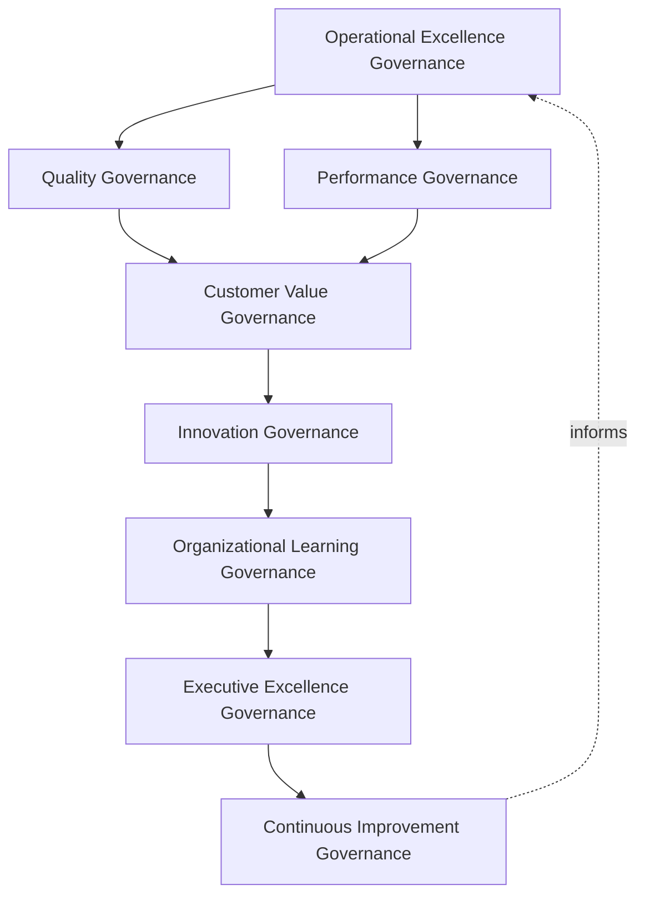
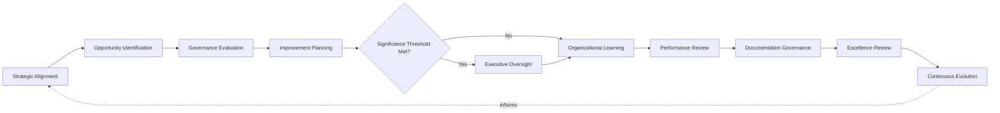
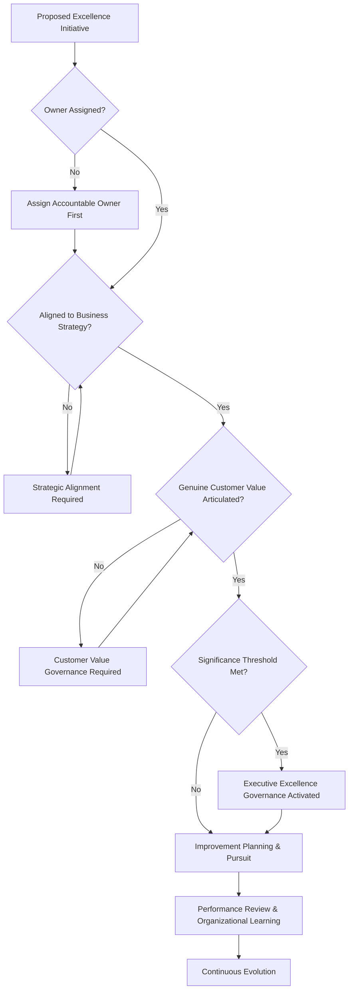
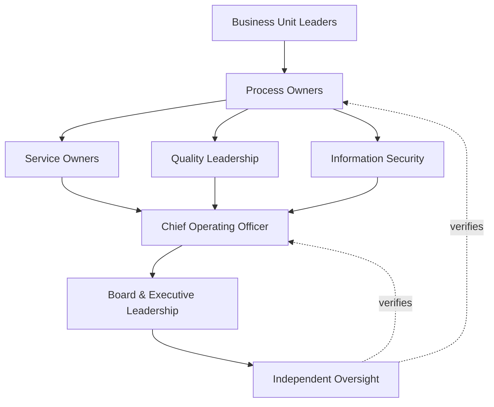
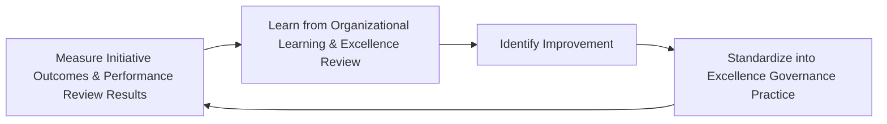
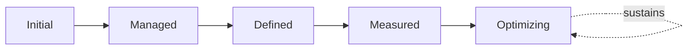

# Enterprise Operational Excellence Framework

## 1. Document Purpose

This document defines the official Enterprise Operational Excellence Framework for **StackLeo Tech Store** — the COO/CQO-owned executive charter under which operational excellence, quality culture, organizational performance, and continuous improvement are governed as a deliberate, accountable discipline. It establishes governance for operational excellence, quality culture, organizational performance, continuous improvement, organizational accountability, executive oversight, operational resilience, and long-term operational maturity across the StackLeo platform, consistent with ITIL 4, ISO 9001, ISO/IEC 20000, COBIT governance principles, TOGAF enterprise architecture thinking, and Lean and Six Sigma inspired improvement discipline.

Operational excellence is referenced throughout this repository as a foundational commitment — as Operational Excellence as a Strategic Capability in `operations-governance-strategy.md` (Section 2.1), as Operational Excellence in `operations-overview.md` (Section 2.1) and `service-management.md` (Section 2.4) — but has not, until this document, had its own dedicated philosophy, governance model, and executive mandate. This framework is that dedicated mandate: the enterprise-wide capstone that gives operational excellence a coherent identity of its own, drawing together the excellence dimension already present in `incident-management-governance.md`, `problem-management-governance.md`, `change-management-governance.md`, and `service-level-governance.md` into a single, unified discipline, while remaining distinct from — and not a replacement for — any of them.

- **Purpose of Operational Excellence** — to ensure StackLeo pursues genuine, sustained excellence in how it operates as a deliberate organizational capability, cultivated over time through disciplined practice, rather than as an incidental byproduct of individually well-run functions.
- **Relationship with Operations Governance** — `operations-governance-strategy.md` establishes the broader executive mandate for how StackLeo's daily operation is governed; this framework is the specific elaboration of that mandate's excellence dimension, giving Operational Excellence as a Strategic Capability (Section 2.1 there) its own full governance treatment.
- **Relationship with Service Management** — `service-management.md` and `service-level-governance.md` govern the services StackLeo delivers and the expectations attached to them; this framework governs the broader organizational capability that allows those services to be delivered with genuine, sustained excellence over time.
- **Relationship with Quality Management** — this framework coordinates directly with `08_Quality_Assurance/qa-governance.md` and `08_Quality_Assurance/quality-strategy.md`; those documents govern the quality of what is built and released, while this framework governs the quality of how the organization operates and continuously improves.
- **Relationship with Enterprise Strategy** — this framework ensures operational excellence remains a deliberate expression of `01_Business/business-model.md` and `01_Business/vision.md`, never an activity pursued for its own sake, disconnected from genuine business intent.
- **Relationship with Risk Management** — this framework treats operational underperformance and stagnation as a genuine category of organizational risk, connected to `06_Security/enterprise-risk-management-strategy.md` (Section 3.2, Operational Risk Governance).
- **Relationship with Executive Decision-Making** — this framework exists to give executive leadership genuine confidence that operational excellence is being deliberately cultivated, a confidence every growth, investment, and competitive decision implicitly depends on.

This document is implementation-independent and vendor-neutral. It defines operational excellence philosophy, model, domains, and lifecycle conceptually — not specific Lean software, Six Sigma software, workflow tools, monitoring platforms, cloud providers, consulting firms, analytics products, operational products, Lean implementation steps, Six Sigma methodologies, Kaizen events, process optimization procedures, KPI implementations, operational SOPs, deployment architectures, implementation roadmaps, or code.

## 2. Operational Excellence Philosophy

Operational excellence at StackLeo rests on eight principles. Each exists to produce a specific business outcome — excellence is pursued deliberately because it is the compounding foundation every other business ambition ultimately depends on.

### 2.1 Excellence as an Organizational Capability

Operational excellence is treated as a genuine, cultivated organizational capability, not an occasional achievement or the byproduct of individual heroics.

- **Business Value** — ensures excellence persists and compounds over time, rather than depending on specific individuals or fortunate circumstances.

### 2.2 Governance Before Optimization

The accountability structure — who owns excellence, who evaluates improvement opportunity, who approves investment in it — is established before specific optimization activity is undertaken.

- **Business Value** — ensures improvement effort exists because a genuine, governed decision called for it, not as disconnected local initiative.

### 2.3 Customer Value First

Every excellence initiative is evaluated first by the genuine value it delivers to the customer, not solely by its internal efficiency gain.

- **Business Value** — protects the trust-centered brand commitment in `01_Business/vision.md` by ensuring excellence never drifts toward efficiency for its own sake.

### 2.4 Accountability

Every domain of operational excellence traces to a specific, named, responsible owner.

- **Business Value** — ensures no dimension of operational performance is left to drift without someone genuinely responsible for its excellence.

### 2.5 Quality Culture

Excellence is pursued as a shared organizational habit, embedded in how work is done every day, not confined to a specialist quality function.

- **Business Value** — sustains excellence as a durable cultural trait rather than a periodic, isolated initiative.

### 2.6 Continuous Learning

The organization treats every operating experience — successful or otherwise — as an opportunity to deepen its genuine understanding of how to operate better.

- **Business Value** — converts ordinary operating experience into a compounding source of organizational capability.

### 2.7 Business Alignment

Operational excellence initiatives are pursued in service of genuine business priority, focusing improvement where it matters most.

- **Business Value** — ensures limited improvement capacity is directed toward what genuinely matters most to the business.

### 2.8 Continuous Improvement

Operational excellence governance practice matures over time, informed by real operating experience and the organization's growth in scale and complexity.

- **Business Value** — keeps this framework aligned with StackLeo's growth in scale, market reach, and operational complexity.

## 3. Enterprise Operational Excellence Model

Operational excellence governance operates across eight conceptual layers, each holding accountability for a distinct dimension of how StackLeo cultivates excellence.

### 3.1 Operational Excellence Governance

- **Purpose** — own the overall coherence of how the organization pursues operational excellence as a deliberate capability.
- **Governance Scope** — oversight spanning every layer in this model and every domain in Section 4.
- **Business Value** — ensures excellence is pursued as a single coherent discipline, not a collection of disconnected local efforts.
- **Executive Expectations** — leadership trusts no operational domain exists outside this framework's visibility.

### 3.2 Quality Governance

- **Purpose** — own the coherence of how quality culture is cultivated across daily operation, coordinated with `08_Quality_Assurance/qa-governance.md`.
- **Governance Scope** — oversight of Quality Culture (Section 2.5) across every domain in Section 4.
- **Business Value** — ensures quality is embedded in how work is done, not inspected in only after the fact.
- **Executive Expectations** — leadership trusts quality culture is genuinely lived, not merely stated as an aspiration.

### 3.3 Performance Governance

- **Purpose** — own the coherence of how organizational operating performance is understood and governed over time.
- **Governance Scope** — oversight of Performance Review (Section 5.7) across every domain in Section 4.
- **Business Value** — ensures performance is genuinely understood, enabling deliberate rather than assumed improvement.
- **Executive Expectations** — leadership trusts performance is assessed honestly, not selectively.

### 3.4 Customer Value Governance

- **Purpose** — own the coherence of how excellence initiatives are evaluated against genuine customer value.
- **Governance Scope** — oversight applying Customer Value First (Section 2.3) across every domain in Section 4.
- **Business Value** — ensures improvement effort translates into value customers genuinely experience, not only internal metrics.
- **Executive Expectations** — leadership expects every significant initiative to articulate its genuine customer value.

### 3.5 Organizational Learning Governance

- **Purpose** — own the coherence of how the organization converts operating experience into durable, shared learning.
- **Governance Scope** — oversight of Organizational Learning (Section 5.6) across every domain in Section 4.
- **Business Value** — ensures the organization's collective capability compounds rather than resetting with each new challenge.
- **Executive Expectations** — leadership expects every significant excellence initiative to produce a documented, attributable lesson.

### 3.6 Innovation Governance

- **Purpose** — own the coherence of how genuinely new approaches to operating are identified, evaluated, and deliberately pursued.
- **Governance Scope** — oversight of Opportunity Identification (Section 5.2) across every domain in Section 4.
- **Business Value** — ensures the organization remains genuinely open to better ways of operating, not anchored to existing practice by default.
- **Executive Expectations** — leadership expects innovation to be deliberately cultivated, not left to spontaneous occurrence alone.

### 3.7 Executive Excellence Governance

- **Purpose** — own executive-level accountability for the excellence initiatives carrying the greatest organizational consequence.
- **Governance Scope** — oversight spanning Sections 3.1–3.6 and 3.8 wherever an initiative rises to genuine executive concern.
- **Business Value** — ensures the most consequential excellence decisions are visible at the level accountable for the organization as a whole.
- **Executive Expectations** — leadership expects to be informed of, not surprised by, the organization's most significant excellence gaps or opportunities.

### 3.8 Continuous Improvement Governance

- **Purpose** — govern the mechanism by which every other layer in this model matures over time.
- **Governance Scope** — consolidates findings from performance review, organizational learning, and audits across every domain in Section 4.
- **Business Value** — prevents this framework itself from becoming the next thing that quietly stagnates as the organization scales.
- **Executive Expectations** — leadership expects operational excellence maturity to be assessed periodically, not assumed static once established.

### Enterprise Operational Excellence Governance Matrix

| Layer | Purpose | Business Value | Executive Expectations |
|---|---|---|---|
| Operational Excellence Governance | Own overall coherence of pursuing excellence as a deliberate capability | Ensures excellence is a single coherent discipline | Trusts no domain exists outside this framework's visibility |
| Quality Governance | Own coherence of cultivating quality culture | Ensures quality is embedded in daily work, not inspected in after | Trusts quality culture is genuinely lived |
| Performance Governance | Own coherence of understanding operating performance | Enables deliberate, evidence-based improvement | Trusts performance is assessed honestly |
| Customer Value Governance | Own coherence of evaluating initiatives against customer value | Ensures effort translates into value customers experience | Expects every initiative to articulate genuine customer value |
| Organizational Learning Governance | Own coherence of converting experience into shared learning | Ensures collective capability compounds over time | Expects every significant initiative to produce a documented lesson |
| Innovation Governance | Own coherence of identifying genuinely new approaches | Keeps the organization open to better ways of operating | Expects innovation to be deliberately cultivated |
| Executive Excellence Governance | Own executive accountability for highest-consequence initiatives | Ensures the most consequential decisions are visible to leadership | Expects leadership informed of, not surprised by, top gaps |
| Continuous Improvement Governance | Govern maturation of every other layer | Prevents this framework itself from stagnating | Expects maturity to be assessed periodically |

*Diagram 1: Enterprise Operational Excellence Framework — overall governance branches into quality and performance governance, converging on customer value governance ahead of innovation and organizational learning, resolving into executive oversight and continuous improvement that feeds back into the model.*

## 4. Enterprise Operational Excellence Domains

Operational excellence is governed across ten conceptual domains, each requiring a distinct excellence emphasis.

### 4.1 Customer Experience Excellence

- **Purpose** — govern the organization's pursuit of genuinely excellent customer experience across every interaction.
- **Governance Considerations** — governed under Customer Value Governance (Section 3.4), given its direct effect on customer trust.
- **Business Importance** — protects the trust relationship every customer interaction depends on.
- **Executive Expectations** — leadership expects customer experience excellence to be prioritized above internally-focused efficiency.

### 4.2 Marketplace Excellence

- **Purpose** — govern the organization's pursuit of excellence in sales and, eventually, multi-vendor marketplace operation.
- **Governance Considerations** — governed under Performance Governance (Section 3.3), structured ahead of the marketplace model's launch.
- **Business Importance** — protects the durability and growth of the platform's core revenue-generating function.
- **Executive Expectations** — leadership expects marketplace excellence to receive the highest business-criticality priority.

### 4.3 Technology Excellence

- **Purpose** — govern the organization's pursuit of excellence in platform technology and technical delivery.
- **Governance Considerations** — governed under Performance Governance (Section 3.3), coordinated with `07_DevOps/sre-strategy.md`.
- **Business Importance** — protects the technical foundation every other excellence domain ultimately depends on.
- **Executive Expectations** — leadership expects technology excellence to be pursued with consistent rigor across the stack.

### 4.4 Supply Chain Excellence

- **Purpose** — govern the organization's pursuit of excellence in the sourcing relationships that supply the products StackLeo sells.
- **Governance Considerations** — governed under Innovation Governance (Section 3.6), anticipating growth in wholesale sourcing.
- **Business Importance** — protects the business's ability to reliably and competitively source the products it depends on.
- **Executive Expectations** — leadership expects supply chain excellence to be reviewed as sourcing relationships evolve.

### 4.5 Financial Operations Excellence

- **Purpose** — govern the organization's pursuit of excellence in payment processing, reconciliation, and financial reporting.
- **Governance Considerations** — governed under Performance Governance (Section 3.3), given its financial and regulatory sensitivity.
- **Business Importance** — protects revenue integrity and the business's standing with payment partners and regulators.
- **Executive Expectations** — leadership expects financial operations excellence to meet the strictest governance rigor in this model.

### 4.6 Vendor Excellence

- **Purpose** — govern the organization's pursuit of excellence in how it selects and works with vendors and external partners.
- **Governance Considerations** — governed under Performance Governance (Section 3.3), coordinated with `06_Security/third-party-risk-governance.md`.
- **Business Importance** — protects the business from operational risk introduced through dependencies it does not directly control.
- **Executive Expectations** — leadership expects vendor excellence to be reviewed with the same rigor as internal operating excellence.

### 4.7 Workforce Excellence

- **Purpose** — govern the organization's pursuit of excellence in how its people are equipped, developed, and enabled to operate well.
- **Governance Considerations** — governed under Organizational Learning Governance (Section 3.5), coordinated with Business Unit Leaders (Section 7.3).
- **Business Importance** — protects the organization's most fundamental operating capability — its own people.
- **Executive Expectations** — leadership expects workforce excellence to be genuinely invested in, not treated as a cost to be minimized.

### 4.8 Information Security Excellence

- **Purpose** — govern the organization's pursuit of excellence in how security is embedded into daily operation.
- **Governance Considerations** — governed jointly with, and never superseding, `06_Security/security-governance.md`, which remains authoritative for security-specific obligations.
- **Business Importance** — protects customer data, platform integrity, and the trust foundation every other domain depends on.
- **Executive Expectations** — leadership expects security excellence to be pursued with the rigor defined in `06_Security/security-governance.md`.

### 4.9 Compliance Excellence

- **Purpose** — govern the organization's pursuit of excellence in meeting its regulatory and contractual obligations.
- **Governance Considerations** — governed under Executive Excellence Governance (Section 3.7), coordinated with `06_Security/compliance-governance.md`.
- **Business Importance** — protects the business's standing with regulators and its contractual counterparties.
- **Executive Expectations** — leadership expects compliance excellence to be sustained continuously, not demonstrated only at audit time.

### 4.10 Executive Excellence

- **Purpose** — govern the organization's pursuit of excellence in how it is led, directed, and governed at the highest level.
- **Governance Considerations** — governed exclusively under Executive Excellence Governance (Section 3.7).
- **Business Importance** — protects the organization's most consequential capability — its own leadership and decision-making.
- **Executive Expectations** — leadership expects to hold itself to the same excellence standard this framework applies elsewhere.

### Operational Excellence Domain Matrix

| Domain | Purpose | Business Importance | Executive Expectations |
|---|---|---|---|
| Customer Experience Excellence | Govern pursuit of excellent customer experience | Protects the trust relationship every interaction depends on | Prioritized above internally-focused efficiency |
| Marketplace Excellence | Govern pursuit of excellence in sales and marketplace operation | Protects durability and growth of the core revenue function | Receives the highest business-criticality priority |
| Technology Excellence | Govern pursuit of excellence in platform technology | Protects the technical foundation every domain depends on | Pursued with consistent rigor across the stack |
| Supply Chain Excellence | Govern pursuit of excellence in sourcing relationships | Protects reliable, competitive sourcing of dependent products | Reviewed as sourcing relationships evolve |
| Financial Operations Excellence | Govern pursuit of excellence in payment and reporting | Protects revenue integrity and partner/regulator standing | Meets the strictest governance rigor in this model |
| Vendor Excellence | Govern pursuit of excellence in vendor relationships | Protects against risk from dependencies not directly controlled | Reviewed with the same rigor as internal excellence |
| Workforce Excellence | Govern pursuit of excellence in equipping and enabling people | Protects the organization's most fundamental capability | Genuinely invested in, not treated as a cost to minimize |
| Information Security Excellence | Govern pursuit of excellence embedding security into operation | Protects data, integrity, and the trust foundation every domain depends on | Pursued with rigor per `security-governance.md` |
| Compliance Excellence | Govern pursuit of excellence in meeting obligations | Protects standing with regulators and counterparties | Sustained continuously, not demonstrated only at audit time |
| Executive Excellence | Govern pursuit of excellence in leadership and governance | Protects the organization's leadership and decision-making capability | Leadership holds itself to the same standard |

## 5. Enterprise Operational Excellence Lifecycle

Operational excellence governance operates across ten conceptual lifecycle stages, applicable across every domain in Section 4.

### 5.1 Strategic Alignment

- **Purpose** — govern how an excellence initiative is connected to genuine business strategy before it is pursued.
- **Governance Objectives** — require alignment to `01_Business/business-model.md`, consistent with Business Alignment (Section 2.7).
- **Business Value** — ensures excellence effort is directed toward what genuinely advances the business.

### 5.2 Opportunity Identification

- **Purpose** — govern how a genuine opportunity for operational improvement is recognized.
- **Governance Objectives** — apply Innovation Governance (Section 3.6) to surface opportunity deliberately, not only reactively.
- **Business Value** — ensures the organization actively seeks improvement rather than waiting for it to be forced by circumstance.

### 5.3 Governance Evaluation

- **Purpose** — govern how an identified opportunity is assessed against the appropriate governance layer in Section 3.
- **Governance Objectives** — apply Governance Before Optimization (Section 2.2) consistently across every proposed initiative.
- **Business Value** — ensures every initiative is evaluated by the function genuinely accountable for its domain.

### 5.4 Improvement Planning

- **Purpose** — govern how an evaluated opportunity is deliberately planned before it is pursued.
- **Governance Objectives** — require planning to articulate genuine customer value, consistent with Customer Value Governance (Section 3.4).
- **Business Value** — ensures improvement effort is deliberate and well-considered, not improvised.

### 5.5 Executive Oversight

- **Purpose** — govern the point at which an initiative's scope or consequence requires executive-level visibility.
- **Governance Objectives** — apply Executive Excellence Governance (Section 3.7) against clearly understood significance thresholds.
- **Business Value** — ensures leadership is engaged exactly when genuinely warranted.

### 5.6 Organizational Learning

- **Purpose** — govern how what is learned through pursuing an initiative is captured for broader organizational benefit.
- **Governance Objectives** — apply Organizational Learning Governance (Section 3.5), consistent with Continuous Learning (Section 2.6).
- **Business Value** — ensures the organization's collective capability compounds with every initiative pursued.

### 5.7 Performance Review

- **Purpose** — govern the formal assessment of whether a pursued initiative achieved genuine improvement.
- **Governance Objectives** — apply Performance Governance (Section 3.3) honestly, regardless of whether the outcome is favorable.
- **Business Value** — ensures the organization knows whether its excellence investment is genuinely working.

### 5.8 Documentation Governance

- **Purpose** — govern the completeness and integrity of the operational excellence record itself.
- **Governance Objectives** — require documentation to remain consistent with related operations and quality documentation as it evolves.
- **Business Value** — ensures the organization retains a genuine, trustworthy record of what was pursued and with what result.

### 5.9 Excellence Review

- **Purpose** — formally reassess the organization's overall excellence posture across every domain in Section 4.
- **Governance Objectives** — require review on a periodic, predictable cadence, consistent with Executive Oversight (Section 8).
- **Business Value** — keeps leadership genuinely informed of the organization's excellence posture as a whole, not domain by domain.

### 5.10 Continuous Evolution

- **Purpose** — apply accumulated lessons and review findings to strengthen future operational excellence governance.
- **Governance Objectives** — require findings to be genuinely analyzed for recurring patterns, consistent with Section 3.8.
- **Business Value** — turns each cycle of pursuit and review into an input that makes future excellence governance genuinely stronger.

### Operational Excellence Lifecycle Matrix

| Stage | Purpose | Governance Objective | Business Value |
|---|---|---|---|
| Strategic Alignment | Connect an initiative to genuine business strategy | Aligned to the business model before pursuit | Directs effort toward what genuinely advances the business |
| Opportunity Identification | Recognize a genuine improvement opportunity | Surfaced deliberately, not only reactively | Ensures the organization actively seeks improvement |
| Governance Evaluation | Assess an opportunity against the appropriate layer | Applied consistently across every proposed initiative | Ensures evaluation by the genuinely accountable function |
| Improvement Planning | Deliberately plan an evaluated opportunity | Articulates genuine customer value | Ensures effort is deliberate, not improvised |
| Executive Oversight | Elevate initiatives requiring executive visibility | Applied against clear significance thresholds | Engages leadership exactly when warranted |
| Organizational Learning | Capture what is learned for broader benefit | Applied consistent with continuous learning | Compounds collective capability with every initiative |
| Performance Review | Formally assess whether genuine improvement occurred | Applied honestly regardless of outcome | Confirms whether excellence investment genuinely works |
| Documentation Governance | Maintain completeness and integrity of the record | Kept consistent with related documentation | Retains a genuine, trustworthy record |
| Excellence Review | Reassess overall excellence posture across domains | Conducted on a periodic, predictable cadence | Keeps leadership informed of posture as a whole |
| Continuous Evolution | Apply lessons to strengthen future governance | Findings genuinely analyzed for recurring patterns | Makes future excellence governance genuinely stronger |

*Diagram 2: Operational Excellence Lifecycle — strategic alignment and opportunity identification inform governance evaluation and improvement planning, escalating to executive oversight only where thresholds are met before organizational learning and performance review, with documentation and excellence review feeding continuous evolution back into the cycle.*

## 6. Operational Excellence Principles

- **Customer Focus** — every excellence initiative is evaluated first by genuine customer value, consistent with Section 2.3.
- **Accountability** — every domain of excellence traces to a specific, named, responsible owner, consistent with Section 2.4.
- **Transparency** — excellence initiatives, performance, and outcomes are documented and visible to those who need them.
- **Quality Orientation** — excellence is pursued as a shared organizational habit, consistent with Section 2.5.
- **Innovation** — the organization actively seeks genuinely better ways of operating, consistent with Section 3.6.
- **Business Alignment** — initiatives are pursued in service of genuine business priority, consistent with Section 2.7.
- **Organizational Learning** — every operating experience deepens genuine organizational understanding, consistent with Section 2.6.
- **Continuous Improvement** — governance practice matures over time, informed by real operating experience.

### Operational Excellence Principles Matrix

| Principle | Description | Business Value |
|---|---|---|
| Customer Focus | Every initiative evaluated first by genuine customer value | Prevents excellence from drifting toward efficiency for its own sake |
| Accountability | Every domain traces to a specific, named, responsible owner | Ensures no dimension of excellence drifts without genuine ownership |
| Transparency | Initiatives, performance, and outcomes documented and visible | Allows excellence posture to be scrutinized and defended |
| Quality Orientation | Excellence pursued as a shared organizational habit | Sustains excellence as a durable cultural trait |
| Innovation | The organization actively seeks better ways of operating | Keeps the organization from anchoring to existing practice by default |
| Business Alignment | Initiatives pursued in service of genuine business priority | Directs limited improvement capacity where it matters most |
| Organizational Learning | Every operating experience deepens genuine understanding | Converts ordinary experience into compounding capability |
| Continuous Improvement | Practice matures from real operating experience | Keeps this framework aligned with organizational growth |

*Diagram 4: Enterprise Operational Excellence Decision Flow — a proposed initiative is checked for assigned ownership, strategic alignment, and articulated customer value, with executive governance activated upon meeting significance thresholds, resolving into pursuit, performance review, and continuous evolution.*

## 7. Ownership & Accountability

Governance authority for operational excellence is distributed deliberately across eight accountable functions, defined here at the governance-objective level, without prescribing specific operational responsibilities.

### 7.1 Board & Executive Leadership

- **Governance Objective** — the Board and executive leadership hold ultimate accountability for whether the organization genuinely cultivates operational excellence.
- **Business Value** — provides a single point of ultimate accountability for whether this framework is genuinely functioning as intended.

### 7.2 Chief Operating Officer

- **Governance Objective** — the Chief Operating Officer owns the coherence and enforcement of this framework across every domain, layer, and stage it defines.
- **Business Value** — provides a single point of specialist accountability for whether operational excellence is genuinely functioning as intended.

### 7.3 Business Unit Leaders

- **Governance Objective** — business unit leaders own excellence pursuit within their own function, consistent with Workforce Excellence (Section 4.7).
- **Business Value** — ensures excellence is genuinely embedded within the functions closest to daily operation.

### 7.4 Quality Leadership

- **Governance Objective** — quality leadership owns Quality Governance (Section 3.2) in coordination with `08_Quality_Assurance/qa-governance.md`.
- **Business Value** — ensures operational excellence and quality assurance practice remain genuinely coordinated, not parallel disciplines.

### 7.5 Service Owners

- **Governance Objective** — each service defined in `service-catalog.md` has a specific, named owner accountable for that service's contribution to operational excellence.
- **Business Value** — ensures no service persists without someone genuinely responsible for its excellence.

### 7.6 Process Owners

- **Governance Objective** — each significant business or operational process has a specific, named owner accountable for its excellence and continuous improvement.
- **Business Value** — ensures no process persists without someone genuinely responsible for improving it over time.

### 7.7 Information Security

- **Governance Objective** — information security owns Information Security Excellence (Section 4.8) jointly with `06_Security/security-governance.md`, which remains authoritative for security-specific obligations.
- **Business Value** — ensures security excellence remains integrated with, not separate from, broader operational excellence.

### 7.8 Independent Oversight

- **Governance Objective** — an independent function, separate from those who design and operate this framework, periodically verifies its overall effectiveness.
- **Business Value** — prevents governance from being assumed effective on the word of the same function responsible for running it.

### Ownership & Accountability Matrix

| Role | Governance Objective | Business Value |
|---|---|---|
| Board & Executive Leadership | Hold ultimate accountability for genuinely cultivating excellence | Provides a single point of ultimate accountability |
| Chief Operating Officer | Own coherence and enforcement of this framework | Provides a single point of specialist accountability |
| Business Unit Leaders | Own excellence pursuit within their own function | Embeds excellence closest to daily operation |
| Quality Leadership | Own quality governance in coordination with QA governance | Keeps excellence and quality assurance genuinely coordinated |
| Service Owners | Own a specific service's contribution to operational excellence | Ensures no service persists without genuine excellence accountability |
| Process Owners | Own a specific process's excellence and continuous improvement | Ensures no process persists without genuine improvement accountability |
| Information Security | Own security excellence jointly with `security-governance.md` | Keeps security excellence integrated with broader excellence |
| Independent Oversight | Independently verify overall governance effectiveness | Prevents self-assessed assumption of effectiveness |

*Diagram 3: Operational Excellence Ownership & Accountability Model — accountability flows from business unit and process ownership through service ownership, quality leadership, and security into the Chief Operating Officer, converging on Board oversight verified by independent oversight.*

## 8. Executive Oversight

- **Executive Excellence Reviews** — the overall coherence of this framework is formally reviewed on a regular cadence, consistent with `operations-governance-strategy.md` (Section 8).
- **Organizational Performance Reporting** — aggregated excellence health — initiative pursuit, performance review outcomes, organizational learning — is reported to executive leadership and the Board.
- **Governance Reviews** — the governance model, domains, and lifecycle defined in this framework (Sections 3–7) are periodically reassessed for continued fitness.
- **Strategic Alignment Reviews** — the organization's excellence initiatives are periodically reviewed for continued alignment with `01_Business/business-model.md`.
- **Documentation Governance** — this framework's relationship to `operations-governance-strategy.md`, `08_Quality_Assurance/qa-governance.md`, and `06_Security/enterprise-risk-management-strategy.md` is kept current as those documents evolve.
- **Organizational Readiness** — excellence decisions, evidence, and outcomes are maintained in a state ready for internal or external audit at any time, coordinated with `06_Security/audit-governance.md`.

### Executive Oversight Matrix

| Oversight Mechanism | Purpose | Governance Role |
|---|---|---|
| Executive Excellence Reviews | Confirm overall framework coherence | Regular, predictable cadence for the framework as a whole |
| Organizational Performance Reporting | Provide leadership a single, coherent excellence picture | Reports initiative pursuit, performance outcomes, learning |
| Governance Reviews | Reassess the governance model itself for continued fitness | Applies to Sections 3–7 of this framework |
| Strategic Alignment Reviews | Review initiatives for continued alignment with business strategy | Periodic review against `01_Business/business-model.md` |
| Documentation Governance | Keep this framework's subordinate relationships current | Updated as related documents evolve |
| Organizational Readiness | Maintain decisions and evidence ready for independent review | Continuous state, coordinated with audit governance |

### Governance Responsibility Matrix

| Role | Responsibility |
|---|---|
| Board & Executive Leadership | Owns ultimate accountability for genuinely cultivating operational excellence. |
| Chief Operating Officer | Owns coherence and enforcement of this framework, in partnership with the Board. |
| Quality Leadership | Owns quality governance in coordination with `08_Quality_Assurance/qa-governance.md`. |
| Service Owners | Own their assigned service's contribution to operational excellence. |
| Process Owners | Own their assigned process's excellence and continuous improvement. |
| Information Security | Owns Information Security Excellence jointly with `06_Security/security-governance.md`. |
| Business Unit Leaders | Own excellence pursuit within their own function. |
| Independent Oversight | Independently verifies the overall effectiveness of this framework. |

## 9. Future Readiness

This framework is designed to remain valid as StackLeo evolves in scale, geography, and organizational complexity, without requiring redefinition of its underlying philosophy.

- **AI-Assisted Operational Excellence** — as opportunity identification and performance review increasingly incorporate AI-assisted analysis, they remain governed under Innovation and Performance Governance (Sections 3.6, 3.3) at the same rigor as any other method.
- **Intelligent Enterprise Operations** — where operating decisions increasingly draw on intelligent analysis across domains, that analysis remains subject to the same governance evaluation as any other proposed initiative.
- **Enterprise Scale** — the governance model, domains, and lifecycle defined throughout this framework are defined independently of organizational size, so they remain coherent as StackLeo's operational complexity grows substantially.
- **Global Expansion** — Strategic Alignment and Opportunity Identification (Sections 5.1–5.2) are structured to be re-applied as StackLeo expands from Bangladesh into South Asia and global markets, each with genuinely distinct excellence considerations.
- **Digital Operating Models** — this framework's governance discipline is treated as a direct contributor to the digital trust customers, partners, and regulators extend to StackLeo, not merely an internal aspiration.
- **Autonomous Operations (conceptual only)** — where automation increasingly performs steps within the excellence lifecycle, that automation remains subject to the same ownership and executive oversight as any human-performed activity.
- **Continuous Innovation** — Innovation Governance (Section 3.6) is structured to sustain deliberate innovation as an ongoing discipline, not a periodic campaign.
- **Future Enterprise Ecosystems** — Continuous Improvement Governance (Section 3.8) is structured to absorb genuinely new operating models — additional sales channels, multi-vendor operations, corporate and wholesale sales — without requiring this framework to be rewritten.

## 10. Operational Excellence Maturity Model

Operational excellence maturity is described across five conceptual levels, consistent with ISO 9001 and established process maturity thinking.

- **Initial** — excellence, where pursued, is informal and inconsistent; improvement is reactive, and ownership is unclear.
- **Managed** — basic excellence governance exists for individual domains, but consistency across the ten domains in Section 4 varies significantly.
- **Defined** — the governance model, domains, and lifecycle are standardized, documented, and consistently applied across the organization, consistent with the model defined throughout this framework.
- **Measured** — initiative outcomes, performance review results, and organizational learning are measured systematically, and decisions are grounded in genuine evidence rather than qualitative impression alone.
- **Optimizing** — operational excellence governance is continuously and deliberately improved based on quantitative evidence and organizational learning; improvement itself is a managed, ongoing discipline rather than an occasional initiative.

### Operational Excellence Maturity Model Matrix

| Level | Characteristics | Primary Focus |
|---|---|---|
| Initial | Informal, inconsistent pursuit; improvement is reactive | Ad hoc, individually-dependent excellence practice |
| Managed | Basic governance exists per domain; consistency varies | Domain-level consistency |
| Defined | Standardized governance model, domains, and lifecycle | Organization-wide consistency and clear ownership |
| Measured | Initiative outcomes and learning measured systematically | Evidence-based excellence governance decisions |
| Optimizing | Practice continuously and deliberately improved from evidence | Sustained, deliberate improvement as a discipline |

*Diagram 5: Continuous Operational Excellence Improvement Cycle — initiative outcomes are measured, learned from, improved upon, and standardized back into governed practice, on a continuing basis.*

*Diagram 6: Operational Excellence Maturity Progression Model — maturity advances from informal, reactively-pursued excellence practice toward standardized, measured, and continuously optimized operational excellence governance.*

## 11. Anti-Patterns

The following recurring failure patterns are explicitly recognized and avoided, as each one structurally undermines this framework.

### Anti-Pattern Summary

| Anti-Pattern | Why It's Avoided |
|---|---|
| Excellence Without Governance | Contradicts Governance Before Optimization (Section 2.2); pursuing excellence without genuine governance produces disconnected effort with no accountable direction. |
| Optimization Without Strategy | Contradicts Strategic Alignment (Section 5.1); optimizing an activity disconnected from genuine business priority wastes limited improvement capacity. |
| Undefined Ownership | Contradicts Accountability (Section 2.4); a domain with no accountable owner has no one genuinely responsible for its excellence. |
| Weak Executive Visibility | Contradicts Organizational Performance Reporting (Section 8); leadership cannot govern excellence it is never shown. |
| Poor Documentation | Undermines Documentation Governance (Sections 5.8, 8) and Transparency (Section 6), leaving excellence decisions unclear or unverifiable after the fact. |
| Quality Without Accountability | Contradicts Quality Governance (Section 3.2) and Accountability (Section 2.4); quality aspiration with no named owner produces no one genuinely responsible for delivering it. |
| Siloed Improvement Initiatives | Contradicts the Enterprise Operational Excellence Model (Section 3); domain-by-domain initiatives that never converge leave no coherent, organization-wide picture of excellence. |
| Missing Continuous Improvement | Contradicts Continuous Improvement (Sections 2.8, 3.8); without deliberate improvement, this framework itself stagnates as the organization and its operating environment grow. |

## 12. Document Information

| Property | Value |
|----------|-------|
| Document | operational-excellence-framework.md |
| Version | 1.0.0 |
| Status | Active |
| Maintained By | StackLeo |
| Last Updated | 2026-07-24 |

---

© StackLeo. All Rights Reserved.
