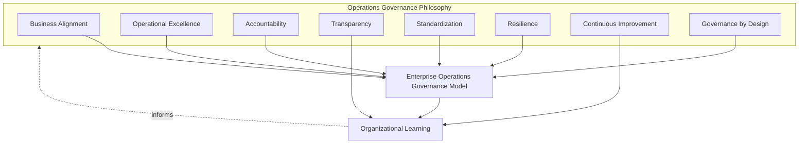
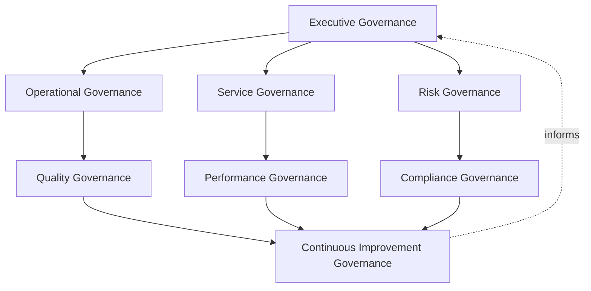
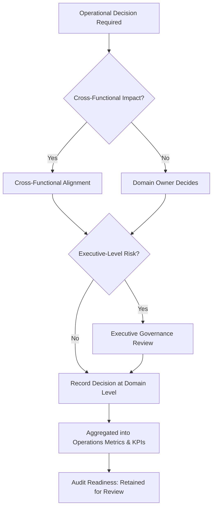
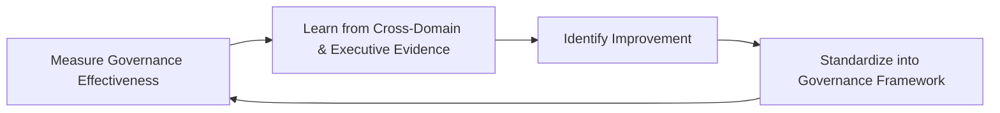
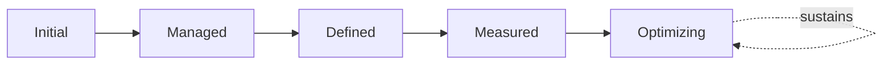

# Enterprise Operations Governance & Operational Excellence Strategy

## 1. Document Purpose

This document defines the official Enterprise Operations Governance & Operational Excellence Strategy for **StackLeo Tech Store**. It is the master governance framework for the entire `09_Operations` folder — the document that holds every other operations strategy together as a coherent, accountable whole, without redefining what any of them individually establish.

- **Purpose of Operations Governance** — to ensure operational decisions across the platform — what is prioritized, who is accountable, what risk is acceptable — are made deliberately, by accountable people, against a consistent set of principles, never left to accumulate as ad hoc, undocumented judgment calls.
- **Relationship with Enterprise Governance** — operations governance is not a separate, parallel structure to how StackLeo governs the rest of the business; it is the operational-specific application of the same executive accountability and decision discipline that governs architecture (`03_System_Design/architecture-decisions.md`), quality (`08_Quality_Assurance/qa-governance.md`), and security (`06_Security/security-governance.md`).
- **Relationship with Business Strategy** — operations governance ensures the day-to-day running of the platform remains a deliberate expression of `01_Business/business-model.md` and `01_Business/vision.md`, not an activity that has drifted apart from genuine business intent over time.
- **Relationship with Risk Management** — this document operationalizes accountability for the operational risk surfaced across every subordinate strategy — `change-management.md`, `configuration-management.md`, `business-continuity.md`, `disaster-recovery.md` — consistent with ISO 31000 thinking, ensuring risk decisions have a clear, traceable owner.
- **Relationship with Enterprise Architecture** — operational governance depends on, and is kept consistent with, the architecture defined in `03_System_Design`; this document ensures operational practice never silently diverges from the architecture it is meant to run.
- **Relationship with Technology Governance** — this document coordinates with, but does not replace, the technology-specific governance already established in `07_DevOps` (delivery and reliability engineering) and `06_Security` (protection principles); it is the governance layer specifically accountable for day-to-day operational execution.
- **Relationship with Continuous Improvement** — Continuous Improvement Governance (Section 3.8) treats operational maturity as a standing discipline, ensuring this framework itself, and everything beneath it, keeps pace with StackLeo's growth.

This document is implementation-independent and vendor-neutral. It defines governance philosophy, structure, and lifecycle — not specific operational tools, cloud providers, monitoring platforms, ITSM systems, workflows, approval timelines, organizational structures, or code.

### Operations Documents Covered

This governance framework sits above every subordinate operations strategy, coordinating their relationships without repeating their implementation detail:

| Document | Governance Relationship |
|---|---|
| `service-management.md` | Establishes the overarching ITSM framework this governance model operates within. |
| `service-catalog.md` | Provides the portfolio structure that Service Governance (Section 3.3) oversees. |
| `service-level-management.md` | Provides the business-facing commitments that Performance Governance (Section 3.6) holds accountable. |
| `monitoring-observability.md` | Provides the evidentiary foundation every governance layer in Section 3 depends on for evidence-based decisions. |
| `incident-management.md` | Provides the response coordination that Operational Governance (Section 3.2) oversees during disruption. |
| `problem-management.md` | Provides the root-cause elimination discipline Continuous Improvement Governance (Section 3.8) depends on. |
| `change-management.md` | Provides the change decision framework Risk Governance (Section 3.4) applies to operational and business-facing change. |
| `configuration-management.md` | Provides the Configuration Item model every governance decision's impact assessment depends on. |
| `release-management.md` | Provides the ITSM release coordination layer Operational Governance (Section 3.2) oversees. |
| `operational-runbooks.md` | Provides the executable procedures Operational Governance (Section 3.2) expects to be current and validated. |
| `business-continuity.md` | Provides the organizational continuity capability Risk Governance (Section 3.4) and Compliance Governance (Section 3.7) depend on. |
| `disaster-recovery.md` | Provides the recovery declaration and coordination discipline Risk Governance (Section 3.4) oversees. |
| `capacity-management.md` | Provides the proactive resource planning Performance Governance (Section 3.6) depends on. |
| `availability-management.md` | Provides the service availability planning Performance Governance (Section 3.6) holds accountable. |
| `performance-management.md` | Provides the continuous performance discipline Performance Governance (Section 3.6) oversees. |
| `operations-metrics-kpis.md` | Provides the enterprise measurement aggregation every governance layer in Section 3 uses for executive reporting. |

## 2. Operations Governance Philosophy

Operations governance at StackLeo is built on eight principles. Each exists to produce a specific business outcome — governance is pursued because of the consistency and accountability it creates at scale, not as bureaucratic overhead.

### 2.1 Business Alignment

Operational decisions are evaluated by the value they protect or deliver for customers and the business, consistent with Business Value First used throughout `09_Operations`, not by technical convenience alone.

- **Business Value** — keeps operational effort anchored to genuine business outcome, preventing drift toward what is easiest to operate rather than what the business actually needs.

### 2.2 Operational Excellence

Operations is run with deliberate discipline and consistent practice across every subordinate domain, consistent with Operational Excellence in `operations-overview.md` (Section 2.1).

- **Business Value** — produces predictable outcomes at scale, where informal or team-specific practice eventually fails to keep pace with growth.

### 2.3 Accountability

Every operational domain and decision traces to a specific, named accountable role, never left ambiguous or diffused across "the team" generally.

- **Business Value** — prevents the anti-pattern in Section 10.2, where operational weakness persists because responsibility was never clearly assigned.

### 2.4 Transparency

Operational posture, decisions, and their rationale are visible to those who need to understand them, not held privately within any single function.

- **Business Value** — builds cross-functional confidence and enables informed decision-making across teams that depend on, but do not directly perform, operational work.

### 2.5 Standardization

Governance practice is applied consistently across every operational domain in Section 4, regardless of which team owns it.

- **Business Value** — makes governance genuinely predictable and scalable, rather than a different experience depending on which part of operations is involved.

### 2.6 Resilience

Operations governance assumes disruption is eventually inevitable and is structured to sustain the business through it, consistent with `business-continuity.md` and `disaster-recovery.md`.

- **Business Value** — protects revenue and customer trust precisely when they are most at risk, not only during calm, ordinary operation.

### 2.7 Continuous Improvement

Operations governance itself matures over time, informed by real operational experience across every subordinate domain.

- **Business Value** — keeps governance genuinely useful as StackLeo scales from single-market B2C retailer toward marketplace, corporate sales, and regional expansion.

### 2.8 Governance by Design

Governance structures are established deliberately as operational capability is built, not retrofitted once a gap has already caused customer or business harm.

- **Business Value** — prevents the costly, high-visibility discovery of governance gaps during an actual operational event rather than during calm, deliberate planning.

*Diagram 1: Operations Governance Philosophy Overview — the eight principles shape the enterprise governance model, and organizational learning feeds back into the philosophy itself.*

## 3. Enterprise Operations Governance Model

Operations governance operates across eight conceptual layers, each holding accountability for a distinct dimension of operational practice.

### 3.1 Executive Governance

- **Purpose** — provide visible, accountable executive sponsorship for operational excellence and make or ratify decisions of significant business risk.
- **Business Value** — signals that operations is a genuine business priority and secures the resourcing operational excellence requires.
- **Governance Objectives** — ensure Executive Leadership is informed of and accountable for significant operational risk decisions, consistent with Executive Reviews across every subordinate strategy.

### 3.2 Operational Governance

- **Purpose** — own the coherence of day-to-day operational practice — service operation, incident response, release coordination — across the portfolio.
- **Business Value** — ensures operational practice is consistent and deliberate, rather than independently reinvented by each team.
- **Governance Objectives** — ensure `incident-management.md`, `release-management.md`, and `operational-runbooks.md` remain coherent with one another.

### 3.3 Service Governance

- **Purpose** — own the coherence of the service portfolio and its lifecycle, per `service-catalog.md` and `service-management.md`.
- **Business Value** — keeps operational attention organized around what the business and customers actually depend on.
- **Governance Objectives** — ensure every service has a defined owner and expected service level, consistent with `service-level-management.md`.

### 3.4 Risk Governance

- **Purpose** — track, prioritize, and escalate operational risk consistently across every subordinate domain.
- **Business Value** — ensures accepted operational risk is always a deliberate, accountable decision, never a silent default.
- **Governance Objectives** — consolidate risk visibility from `change-management.md`, `configuration-management.md`, `business-continuity.md`, and `disaster-recovery.md`.

### 3.5 Quality Governance

- **Purpose** — ensure operational practice remains coherent with the quality expectations established in `08_Quality_Assurance/qa-governance.md`.
- **Business Value** — prevents operations and quality assurance from drifting into two disconnected views of platform health.
- **Governance Objectives** — ensure Operational Handover in `release-management.md` (Section 3.9) genuinely reflects passed release quality gates.

### 3.6 Performance Governance

- **Purpose** — own the coherence of performance, capacity, and availability practice across the platform.
- **Business Value** — ensures responsiveness and reliability commitments are sustained deliberately, not left to individual team diligence alone.
- **Governance Objectives** — consolidate oversight of `performance-management.md`, `capacity-management.md`, and `availability-management.md`.

### 3.7 Compliance Governance

- **Purpose** — ensure operational practice satisfies applicable regulatory and policy obligations, jointly with `06_Security/compliance.md`.
- **Business Value** — protects StackLeo's license to operate in its current and future markets.
- **Governance Objectives** — ensure continuity and recovery practice in `business-continuity.md` and `disaster-recovery.md` addresses obligations that continue during disruption.

### 3.8 Continuous Improvement Governance

- **Purpose** — govern the mechanism by which every other layer in this model matures over time.
- **Business Value** — prevents governance itself from becoming the next thing that quietly stagnates as the organization scales.
- **Governance Objectives** — ensure improvement actions from `problem-management.md`, `operations-metrics-kpis.md`, and post-incident/post-release reviews are tracked to completion with equal discipline.

### Enterprise Operations Governance Matrix

| Layer | Purpose | Business Value | Governance Objective |
|---|---|---|---|
| Executive Governance | Provide accountable executive sponsorship | Signals genuine business priority, secures resourcing | Executive Leadership accountable for significant risk decisions |
| Operational Governance | Own coherence of day-to-day operational practice | Consistent, deliberate practice across teams | Incident, release, and runbook practice remain coherent |
| Service Governance | Own coherence of the service portfolio and lifecycle | Aligns operations with genuine business dependency | Every service has a defined owner and expected level |
| Risk Governance | Track and escalate operational risk consistently | Accepted risk is always a deliberate decision | Consolidates risk visibility across subordinate domains |
| Quality Governance | Ensure operational coherence with quality expectations | Prevents disconnected views of platform health | Handover genuinely reflects passed quality gates |
| Performance Governance | Own coherence of performance, capacity, availability practice | Sustains commitments deliberately, not by individual diligence | Consolidates oversight of the three related strategies |
| Compliance Governance | Ensure operational practice satisfies regulatory obligations | Protects license to operate in current and future markets | Continuity/recovery practice addresses ongoing obligations |
| Continuous Improvement Governance | Govern maturation of every other governance layer | Prevents governance itself from stagnating | Improvement actions tracked with equal discipline |

*Diagram 2: Operations Governance Operating Model — eight layers spanning executive sponsorship through continuous improvement, forming a closed organizational loop.*

## 4. Enterprise Operations Domains

This section discusses governance responsibility for the operational domains that the subordinate strategies in `09_Operations` implement in full detail.

### 4.1 Service Management

- **Purpose** — organize operational attention around defined, business-facing services.
- **Governance Scope** — oversight of `service-management.md`, `service-catalog.md`, and `service-level-management.md` as a coherent set.
- **Executive Expectations** — leadership understands the current service portfolio and its overall health without requiring domain-specific technical translation.
- **Business Importance** — keeps operations aligned with what the business and customers actually depend on.

### 4.2 Reliability

- **Purpose** — sustain the platform's engineered reliability in daily operation.
- **Governance Scope** — oversight of the reliability dimension across `availability-management.md` and coordination with `07_DevOps/sre-strategy.md`.
- **Executive Expectations** — leadership receives honest visibility into whether reliability commitments are genuinely being met.
- **Business Importance** — underpins customer confidence that the platform behaves as expected every time.

### 4.3 Incident

- **Purpose** — respond to disruption in a coordinated, timely, learning-oriented way.
- **Governance Scope** — oversight of `incident-management.md`, including Major Incident Governance escalation paths.
- **Executive Expectations** — leadership is informed of significant incidents promptly and reviews major incidents formally.
- **Business Importance** — determines how much business and customer impact a disruption ultimately causes.

### 4.4 Problem

- **Purpose** — eliminate the recurring root causes behind multiple incidents.
- **Governance Scope** — oversight of `problem-management.md`, including Known Error visibility and preventive action tracking.
- **Executive Expectations** — leadership sees evidence that recurring issues are genuinely being eliminated, not merely repeatedly resolved.
- **Business Importance** — offers the highest-leverage reduction in future incident volume of any operational domain.

### 4.5 Change

- **Purpose** — review and coordinate operational and business-facing change to live services.
- **Governance Scope** — oversight of `change-management.md`, including risk-proportionate approval authority.
- **Executive Expectations** — leadership is confident that change proceeds deliberately, never uncontrolled.
- **Business Importance** — prevents uncoordinated change from becoming an avoidable source of disruption.

### 4.6 Configuration

- **Purpose** — maintain accurate knowledge of what exists and how it relates.
- **Governance Scope** — oversight of `configuration-management.md`, including Configuration Item accuracy and relationship completeness.
- **Executive Expectations** — leadership trusts that impact assessment and diagnosis are grounded in genuine, current knowledge.
- **Business Importance** — provides the factual foundation every other governance decision in this framework depends on.

### 4.7 Release

- **Purpose** — coordinate release as a deliberate, cross-functional service management event.
- **Governance Scope** — oversight of `release-management.md`, including stakeholder alignment and operational handover.
- **Executive Expectations** — leadership is confident releases are genuinely ready, communicated, and supportable before reaching customers.
- **Business Importance** — protects the moment of greatest customer-facing change and risk in the delivery lifecycle.

### 4.8 Performance

- **Purpose** — sustain and continuously improve responsiveness as customers actually experience it.
- **Governance Scope** — oversight of `performance-management.md`, coordinated with `capacity-management.md`.
- **Executive Expectations** — leadership understands whether performance commitments are being sustained, not only whether they were validated once.
- **Business Importance** — directly connects to conversion and customer trust.

### 4.9 Capacity

- **Purpose** — proactively plan the resources — technical and organizational — the business genuinely needs.
- **Governance Scope** — oversight of `capacity-management.md`, including workforce and vendor capacity.
- **Executive Expectations** — leadership reviews significant capacity investment decisions deliberately, grounded in evidence.
- **Business Importance** — ensures capacity is never the limiting factor at the moment growth is most valuable.

### 4.10 Availability

- **Purpose** — plan and sustain the accessibility of services customers and the business depend on.
- **Governance Scope** — oversight of `availability-management.md`, including dependency transparency.
- **Executive Expectations** — leadership understands both current availability performance and the dependencies it rests on.
- **Business Importance** — protects the most directly customer-perceptible dimension of operational health.

### 4.11 Monitoring

- **Purpose** — maintain continuous situational awareness of platform and service health.
- **Governance Scope** — oversight of `monitoring-observability.md`, ensuring coverage is proportionate to service criticality.
- **Executive Expectations** — leadership trusts that significant issues would genuinely be detected before becoming customer-visible.
- **Business Importance** — is the evidentiary foundation every other operational domain in this section depends on.

### 4.12 Business Continuity

- **Purpose** — sustain the business's ability to continue operating through disruption of any scale.
- **Governance Scope** — oversight of `business-continuity.md`, including critical capability identification and crisis coordination.
- **Executive Expectations** — leadership holds ultimate accountability for continuity activation decisions.
- **Business Importance** — protects the business precisely when it matters most.

### 4.13 Disaster Recovery

- **Purpose** — declare, coordinate, and validate recovery from severe disruption.
- **Governance Scope** — oversight of `disaster-recovery.md`, including declaration authority and recovery testing cadence.
- **Executive Expectations** — leadership confirms recovery capability is genuinely tested, not merely documented.
- **Business Importance** — determines how quickly normal operation and customer trust can be restored after a significant event.

### 4.14 Operational Knowledge

- **Purpose** — capture and sustain the operational execution knowledge the organization depends on.
- **Governance Scope** — oversight of `operational-runbooks.md` and Knowledge Management across `service-management.md` and `problem-management.md`.
- **Executive Expectations** — leadership trusts that critical operational knowledge is not concentrated in any single individual.
- **Business Importance** — reduces dependence on individual memory and protects continuity of operational competence.

### 4.15 Operational Reporting

- **Purpose** — communicate operational health to the stakeholders who depend on it for decisions.
- **Governance Scope** — oversight of `operations-metrics-kpis.md`, ensuring the enterprise KPI set remains genuinely meaningful.
- **Executive Expectations** — leadership receives an honest, evidence-based operational picture on a predictable cadence.
- **Business Importance** — is the mechanism through which every other domain's health becomes visible enough to govern.

### Operations Domain Governance Matrix

| Domain | Purpose | Executive Expectations | Business Importance |
|---|---|---|---|
| Service Management | Organize attention around defined, business-facing services | Understands portfolio and health without technical translation | Aligns operations with genuine business dependency |
| Reliability | Sustain engineered reliability in daily operation | Honest visibility into commitment fulfillment | Underpins confidence the platform behaves as expected |
| Incident | Respond to disruption in a coordinated, learning-oriented way | Informed promptly, reviews major incidents formally | Determines the ultimate business/customer impact of disruption |
| Problem | Eliminate recurring root causes behind incidents | Sees evidence issues are genuinely eliminated | Highest-leverage reduction in future incident volume |
| Change | Review and coordinate operational and business change | Confident change proceeds deliberately, never uncontrolled | Prevents uncoordinated change causing avoidable disruption |
| Configuration | Maintain accurate knowledge of what exists and relates | Trusts assessment/diagnosis is grounded in genuine knowledge | Provides the factual foundation every governance decision needs |
| Release | Coordinate release as a deliberate cross-functional event | Confident releases are ready, communicated, supportable | Protects the moment of greatest customer-facing risk |
| Performance | Sustain and improve responsiveness continuously | Understands whether commitments are sustained, not just validated once | Directly connects to conversion and customer trust |
| Capacity | Proactively plan technical and organizational resources | Reviews significant investment deliberately, grounded in evidence | Ensures capacity is never the growth-limiting factor |
| Availability | Plan and sustain accessibility of dependent services | Understands performance and the dependencies it rests on | Protects the most customer-perceptible operational dimension |
| Monitoring | Maintain continuous situational awareness | Trusts significant issues would be detected before customer impact | Evidentiary foundation every other domain depends on |
| Business Continuity | Sustain ability to operate through disruption | Holds ultimate accountability for activation decisions | Protects the business precisely when it matters most |
| Disaster Recovery | Declare, coordinate, and validate severe-disruption recovery | Confirms recovery capability is genuinely tested | Determines speed of restoring operation and trust |
| Operational Knowledge | Capture and sustain execution knowledge | Trusts knowledge isn't concentrated in any single individual | Protects continuity of operational competence |
| Operational Reporting | Communicate health to dependent stakeholders | Receives an honest, evidence-based picture predictably | Makes every other domain's health visible enough to govern |

*Diagram 3: Cross-Domain Governance Relationship Model — the fifteen operational domains form a connected chain, from continuous observation through response, change, and continuity, into reporting that informs the next cycle of observation.*

## 5. Governance Principles

- **Executive Ownership** — significant operational decisions are made or ratified at the executive level, proportionate to their business consequence.
- **Clear Accountability** — every operational domain has a specific, named accountable role, never left ambiguous.
- **Decision Transparency** — governance decisions and their rationale are visible and recorded, not made informally or invisibly.
- **Risk Awareness** — governance decisions are made with explicit awareness of the operational risk involved, consistent with ISO 31000 thinking.
- **Auditability** — governance decisions and their outcomes can be independently reviewed after the fact.
- **Documentation Integrity** — this framework and its subordinate strategies are kept mutually consistent, never allowed to silently diverge.
- **Cross-Functional Collaboration** — governance decisions engage every function with a genuine stake, consistent with Shared Responsibility used throughout `09_Operations`.
- **Continuous Improvement** — governance practice itself matures over time, informed by real operational experience.

### Governance Principle Matrix

| Principle | Description | Business Value |
|---|---|---|
| Executive Ownership | Significant decisions made or ratified at the executive level | Reflects genuine business consequence |
| Clear Accountability | Every domain has a specific, named accountable role | Prevents gaps from persisting due to unclear responsibility |
| Decision Transparency | Decisions and rationale visible and recorded | Builds trust in the governance process itself |
| Risk Awareness | Decisions made with explicit awareness of operational risk | Enables deliberate, informed risk-taking rather than blind exposure |
| Auditability | Decisions and outcomes independently reviewable | Supports accountability and confidence for partners and regulators |
| Documentation Integrity | Framework and subordinate strategies kept mutually consistent | Prevents governance decisions being made against stale information |
| Cross-Functional Collaboration | Decisions engage every function with a genuine stake | Surfaces impact no single function could see alone |
| Continuous Improvement | Governance matures from real operational experience | Keeps governance aligned with organizational and platform growth |

## 6. Executive Oversight

- **Governance Reviews** — this framework and its subordinate strategies are formally reviewed on a regular, predictable cadence, ensuring the overall governance model remains coherent as `09_Operations` grows.
- **Operational Reviews** — individual domain performance (Section 4) is reviewed against the cadence established in each subordinate strategy's own governance section.
- **Executive Reporting** — aggregated operational health is reported to executive leadership through `operations-metrics-kpis.md`, giving leadership a single, coherent picture rather than fifteen fragmented ones.
- **Cross-Functional Alignment** — significant operational decisions are confirmed to have genuine input from every affected function before being finalized.
- **Governance Documentation** — this framework's relationship to every subordinate strategy (see Operations Documents Covered, Section 1) is kept current as new documents are added or existing ones evolve.
- **Audit Readiness** — governance decisions, reviews, and their outcomes are maintained in a state ready for internal or external audit at any time.

### Executive Oversight Matrix

| Oversight Mechanism | Purpose | Governance Role |
|---|---|---|
| Governance Reviews | Confirm the overall governance model remains coherent | Regular, predictable cadence for this framework itself |
| Operational Reviews | Confirm individual domain performance against expectations | Cadence set within each subordinate strategy |
| Executive Reporting | Provide leadership a single, coherent operational picture | Draws on `operations-metrics-kpis.md` aggregation |
| Cross-Functional Alignment | Confirm genuine multi-function input before finalizing decisions | Prevents decisions made from a single, narrow perspective |
| Governance Documentation | Keep this framework's relationships to subordinate strategies current | Updated as `09_Operations` documents are added or evolve |
| Audit Readiness | Maintain decisions and reviews ready for independent review | Continuous state, not preparation-triggered |

*Diagram 4: Executive Oversight & Decision Governance Flow — decisions route to the appropriate accountable level based on scope and risk, converging on recorded, reported, and auditable outcomes.*

### Governance Responsibility Matrix

| Role | Responsibility |
|---|---|
| COO | Owns coherence and enforcement of this operations governance framework, and chairs Executive Governance (Section 3.1). |
| Operations Leadership | Owns Operational Governance (Section 3.2) across incident, release, and runbook practice. |
| Service Management Lead | Owns Service Governance (Section 3.3) across the service portfolio. |
| Risk Manager | Owns Risk Governance (Section 3.4) aggregation across change, configuration, continuity, and recovery. |
| QA Leadership | Coordinates Quality Governance (Section 3.5) alignment with `08_Quality_Assurance/qa-governance.md`. |
| SRE / Performance Lead | Owns Performance Governance (Section 3.6) across performance, capacity, and availability practice. |
| Compliance / Legal | Owns Compliance Governance (Section 3.7) alignment with `06_Security/compliance.md`. |
| Operations Intelligence Lead | Owns Continuous Improvement Governance (Section 3.8) and `operations-metrics-kpis.md`. |
| Internal Audit / Review Function | Independently verifies that this governance framework and its subordinate strategies reflect actual practice. |

## 7. Future Readiness

This framework is designed to remain valid as StackLeo evolves in scale and organizational complexity, without requiring redefinition of its underlying philosophy.

- **Cloud-Native Platforms** — governance layers (Section 3) are defined independently of any specific runtime or deployment model, so they apply unchanged as infrastructure evolves.
- **AI-Assisted Operations** — where AI-assisted techniques support any subordinate domain, they operate within the same Risk Awareness and Decision Transparency principles (Section 5) as any other operational practice, never bypassing accountable human governance for significant decisions.
- **Marketplace Platform** — the multi-vendor marketplace model extends Service and Risk Governance (Sections 3.3–3.4) to cover seller-facing services and seller-side risk, consistent with the extension already described in each subordinate strategy's own Future Readiness section.
- **Multi-Tenant Architecture** — where future architecture introduces tenant isolation, Risk and Compliance Governance (Sections 3.4, 3.7) extend to explicitly govern cross-tenant operational decisions.
- **Multi-Region Operations** — as StackLeo expands from Bangladesh into South Asia and beyond, this framework's layers extend to coordinate operations across geographies without requiring a new governance structure.
- **Global Engineering Organizations** — the governance model, domains, and oversight defined in Sections 3–6 are defined independently of team size, location, or organizational structure, so they remain coherent as operations scale across geographies.
- **Enterprise Scale** — the governance responsibility model (Section 6) is structured to extend to additional roles and functions as the organization grows, preserving Clear Accountability (Section 5) at any scale.
- **Evolving Operational Risks** — Risk Governance (Section 3.4) is structured to absorb genuinely new categories of operational risk as they emerge, without requiring the broader governance model to be redesigned.

## 8. Governance Framework

- **Ownership** — the COO owns this framework and is accountable for the coherence of every subordinate strategy within `09_Operations`, in partnership with Executive, Engineering, and Product leadership.
- **Governance Review Process** — this framework is formally reviewed whenever a material change occurs in business model (`01_Business/business-model.md`), organizational structure, or any subordinate operations strategy, and on a regular recurring cadence independent of specific change events.
- **Policy Alignment** — every document within `09_Operations` operates as a policy subordinate to this governance framework; a subordinate document that conflicts with the principles defined here is treated as a governance gap requiring resolution.
- **Documentation Governance** — the Operations Documents Covered table (Section 1) is kept current as new operational strategies are authored, ensuring this framework's coordinating role remains accurate.
- **Audit Readiness** — this framework and the evidence it requires are maintained in a state ready for internal or external audit at any time, without requiring advance preparation.
- **Continuous Improvement** — this framework itself is subject to Continuous Improvement Governance (Section 3.8); its effectiveness is periodically assessed and revised based on genuine organizational evidence.

*Diagram 5: Continuous Operational Excellence Cycle — governance effectiveness is measured, learned from, improved upon, and standardized back into this framework, on a continuing basis.*

## 9. Operations Governance Maturity Model

Operations governance maturity is described across five conceptual levels, adapted from established process maturity thinking. Progression reflects increasing consistency, measurement, and deliberate improvement — not merely increasing documentation volume.

- **Initial** — operational governance, where it exists, is informal and inconsistent; domains are governed independently by whichever team owns them, with no coherent enterprise view.
- **Managed** — basic governance exists for individual operational domains, but consistency across the fifteen domains in Section 4 varies significantly.
- **Defined** — governance layers, domains, and oversight are standardized, documented, and consistently applied across the organization, consistent with the model defined throughout this document; ownership is clear organization-wide.
- **Measured** — operational governance effectiveness is measured systematically through `operations-metrics-kpis.md`, and decisions are grounded in genuine trend data rather than qualitative impression alone.
- **Optimizing** — operations governance is continuously and deliberately improved based on quantitative evidence and organizational learning; improvement itself is a managed, ongoing discipline rather than an occasional initiative.

### Operations Governance Maturity Model Matrix

| Level | Characteristics | Primary Focus |
|---|---|---|
| Initial | Informal, domain-independent governance; no coherent enterprise view | Fragmented, team-specific governance |
| Managed | Basic governance exists per domain; consistency varies | Domain-level consistency |
| Defined | Standardized, documented governance layers applied organization-wide | Organization-wide consistency and clear ownership |
| Measured | Effectiveness measured systematically via enterprise KPIs | Evidence-based governance decisions |
| Optimizing | Practice continuously and deliberately improved from evidence | Sustained, deliberate improvement as a discipline |

*Diagram 6: Operations Governance Maturity Progression Model — maturity advances from fragmented, domain-independent governance toward standardized, measured, and continuously optimized operations governance.*

## 10. Anti-Patterns

The following recurring failure patterns are explicitly recognized and avoided, as each one structurally undermines this framework.

| Anti-Pattern | Why It's Avoided |
|---|---|
| Siloed Operations | Contradicts Cross-Functional Collaboration (Section 5); domains governed in isolation from one another miss the interdependencies the Cross-Domain Governance Relationship Model (Diagram 3) depends on. |
| Weak Accountability | Contradicts Clear Accountability (Section 5); when responsibility is diffused across "the team," operational gaps persist because no specific role is answerable for them. |
| Poor Executive Visibility | Undermines Executive Reporting (Section 6); without genuine visibility, leadership cannot make informed investment or risk-acceptance decisions. |
| Inconsistent Governance | Contradicts Standardization (Section 2.5); governance rigor that varies arbitrarily by domain produces unpredictable outcomes and erodes trust in the framework itself. |
| Weak Documentation | Undermines Documentation Integrity (Section 5) and Governance Documentation (Section 8), leaving this framework's coordinating role unclear or inaccurate. |
| Reactive Decision Making | Contradicts Governance by Design (Section 2.8); governance assembled only after a failure has already occurred forfeits the far cheaper option of preventing it. |
| Weak Risk Awareness | Contradicts Risk Awareness (Section 5) and ISO 31000 thinking; decisions made without genuine risk understanding cannot be deliberately, proportionately governed. |
| Missing Continuous Improvement | Contradicts Continuous Improvement (Section 2.7) and Continuous Improvement Governance (Section 3.8); without deliberate improvement, this framework itself becomes the next thing that silently stagnates as the organization scales. |

## 11. Document Information

| Property | Value |
|----------|-------|
| Document | operations-governance.md |
| Version | 1.0.0 |
| Status | Active |
| Maintained By | StackLeo |
| Last Updated | 2026-07-24 |

---

© StackLeo. All Rights Reserved.
