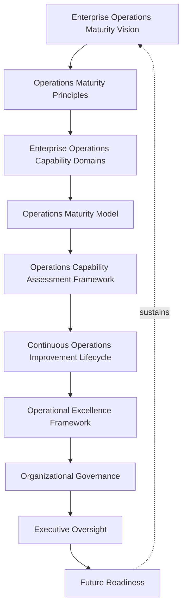
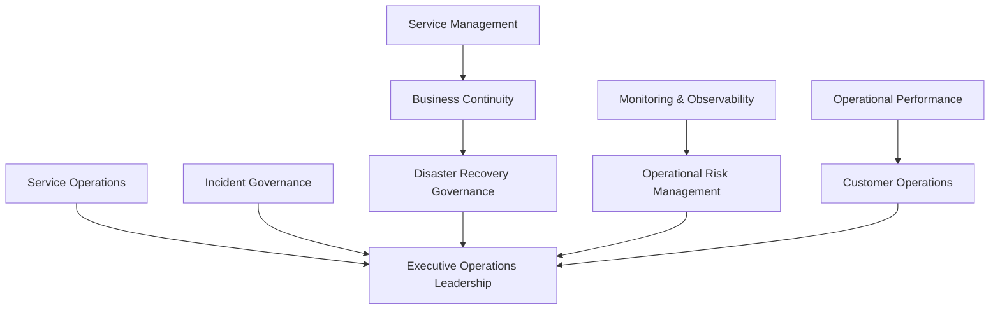
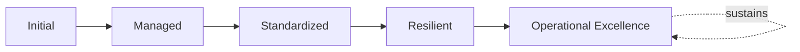
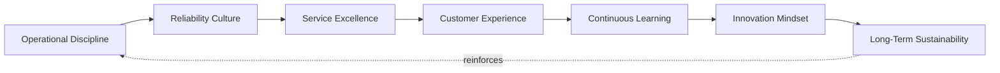
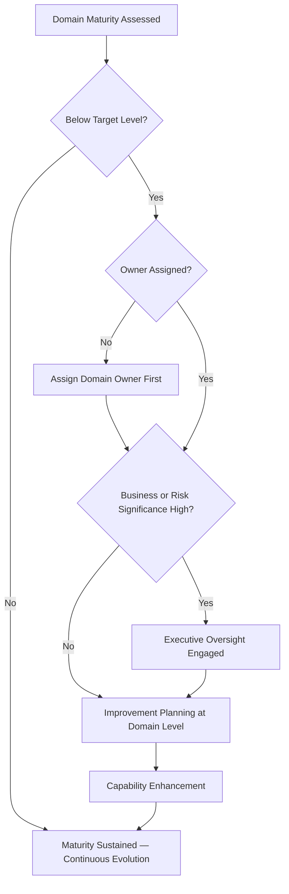

# Enterprise Operations Maturity Framework

## 1. Executive Summary

**Purpose** — This document defines the official Enterprise Operations Maturity Framework for **StackLeo Tech Store**. It establishes operational capability evolution, governance maturity, service excellence, organizational resilience, operational performance, executive oversight, continuous improvement, and long-term operations excellence as a single, consolidated maturity lens spanning every domain governed across `09_Operations`. `operational-excellence-framework.md` remains the COO/CQO-owned executive charter for operational excellence as a philosophy and culture; this framework describes the same territory through a distinct, complementary lens — capability maturity — consolidating the individual maturity models already defined within `operations-strategy.md`, `incident-management-framework.md`, `service-management-framework.md`, `business-continuity-framework.md`, `disaster-recovery-framework.md`, and `monitoring-observability-governance.md` into one coherent, cross-domain picture. It does not restate any domain's operational governance — it is the synthesis that lets leadership ask "how mature is our overall operational capability?" and receive one coherent answer.

**Scope** — This framework applies to every capability domain governed across `09_Operations` — service operations, incident governance, service management, business continuity, disaster recovery governance, monitoring and observability, operational risk management, operational performance, customer operations, and executive operations leadership — coordinated with every domain-specific governance document referenced throughout.

**Strategic Objectives** — To ensure operational capability matures deliberately, not accidentally; that maturity is measured consistently across every domain rather than assessed unevenly; that improvement is prioritized by genuine business alignment and risk; and that executive leadership has one coherent, consolidated view of the organization's overall operational maturity.

**Business Value** — A consolidated operations maturity framework protects operational investment from being spent unevenly — heavily matured in one domain while another remains dangerously informal — protects leadership's ability to make proportionate investment decisions across the whole operations portfolio, and gives the Board confidence that StackLeo's operational capability is evolving deliberately alongside the business.

**Intended Audience** — The Board of Directors, executive leadership, the Chief Technology Officer, operations leadership, engineering leadership, service management leadership, security leadership, business continuity leadership, product leadership, and business stakeholders.

## 2. Enterprise Operations Maturity Vision

- **Operations as Strategic Capability** — operational maturity is governed as a genuine strategic capability, never a static, one-time achievement.
- **Operational Excellence** — operational capability is expected to genuinely evolve toward excellence, coordinated with `operational-excellence-framework.md`.
- **Business Resilience** — a maturing operational posture protects the organization's ability to withstand and recover from disruption.
- **Customer Trust** — operational maturity is the organization's demonstrable evidence that customers can genuinely rely on the platform.
- **Sustainable Service Delivery** — operational excellence is pursued as a durable, ongoing discipline, never a one-time improvement initiative.
- **Continuous Organizational Learning** — real operational outcomes are genuinely converted into improved practice across the whole organization.
- **Long-Term Operational Success** — operational maturity is governed to compound over time into genuine, sustained organizational success.

*Diagram 1: Enterprise Operations Maturity Framework — the maturity vision establishes principles and capability domains, flowing through the maturity model, assessment, and improvement lifecycle into the operational excellence framework, organizational governance, and executive oversight, with future readiness reinforcing the vision itself.*

### Enterprise Operations Maturity Vision Matrix

| Vision Element | Focus | Business Value |
|---|---|---|
| Operations as Strategic Capability | A genuine capability, not a one-time achievement | Prevents maturity from being treated as a completed project |
| Operational Excellence | Capability evolving toward genuine excellence | Connects maturity progression to the excellence discipline |
| Business Resilience | Protects the ability to withstand and recover from disruption | Sustains reliability through active, ongoing operation |
| Customer Trust | Demonstrable evidence customers can genuinely rely on the platform | Protects the trust relationship every interaction depends on |
| Sustainable Service Delivery | A durable, ongoing discipline, not a one-time initiative | Protects maturity investment from eroding over time |
| Continuous Organizational Learning | Real outcomes genuinely converted into improved practice | Converts operational experience into durable capability |
| Long-Term Operational Success | Maturity compounding into sustained organizational success | Protects the long-term return on operational investment |

## 3. Operations Maturity Principles

Operations maturity governance at StackLeo rests on nine principles, each producing a specific business outcome.

- **Continuous Improvement** — operational capability is expected to genuinely mature over time, never assumed static once initially established. *Business Value:* keeps capability aligned with the organization's growing scale and complexity.
- **Customer-Centric Operations** — maturity is judged first by genuine customer experience, not internal technical measures alone. *Business Value:* keeps operational investment connected to what customers actually value.
- **Operational Accountability** — every capability domain traces to a specific, named, responsible owner accountable for its maturity. *Business Value:* ensures no domain drifts without someone genuinely responsible for its evolution.
- **Business Alignment** — maturity evolution is paced to genuinely match the business's own growth, coordinated with `operations-strategy.md`. *Business Value:* prevents operations from either lagging behind or over-investing ahead of genuine business need.
- **Data-Informed Decisions** — maturity investment decisions are genuinely grounded in observed operational reality, coordinated with `monitoring-observability-governance.md`. *Business Value:* reduces the risk of investment decisions driven by assumption.
- **Organizational Learning** — real operational outcomes are genuinely converted into improved practice. *Business Value:* converts the cost of an operational event into durable organizational capability.
- **Proactive Operations** — maturity evolution anticipates a genuine future need, rather than reacting only once a gap has already caused harm. *Business Value:* protects the organization from the disproportionate cost of reactive maturation.
- **Service Excellence** — operations are matured toward a genuine standard of excellence, not merely functional adequacy. *Business Value:* distinguishes StackLeo's operational capability as a genuine competitive advantage.
- **Executive Leadership** — the organization's most consequential maturity investment decisions are made or ratified at the executive level. *Business Value:* ensures the organization's most consequential maturity decisions carry commensurate scrutiny.

### Operations Maturity Principles Matrix

| Principle | Description | Business Value |
|---|---|---|
| Continuous Improvement | Capability expected to genuinely mature over time | Keeps capability aligned with growing scale and complexity |
| Customer-Centric Operations | Judged first by genuine customer experience | Keeps investment connected to what customers actually value |
| Operational Accountability | Every domain traces to a specific, responsible owner | Ensures no domain drifts without genuine responsibility |
| Business Alignment | Evolution paced to genuinely match business growth | Prevents lagging behind or over-investing ahead of need |
| Data-Informed Decisions | Investment genuinely grounded in observed reality | Reduces the risk of decisions driven by assumption |
| Organizational Learning | Real outcomes genuinely converted into improved practice | Converts operational experience into durable capability |
| Proactive Operations | Anticipates genuine future need, not only reacting | Protects against the disproportionate cost of reactive maturation |
| Service Excellence | Matured toward genuine excellence, not mere adequacy | Distinguishes capability as a genuine competitive advantage |
| Executive Leadership | Most consequential decisions made or ratified at the top | Ensures commensurate scrutiny for consequential decisions |

## 4. Enterprise Operations Capability Domains

Operations maturity is governed across ten conceptual capability domains, each consolidating the maturity model already defined within its authoritative governance document.

### Service Operations

- **Purpose** — assess the maturity of day-to-day service delivery.
- **Maturity Expectations** — evaluated against the maturity model defined in `operations-strategy.md` (Section 12).
- **Business Value** — protects the organization's ability to genuinely deliver committed service levels.
- **Executive Expectations** — leadership expects service operations maturity to be the foundation every other domain builds upon.

### Incident Governance

- **Purpose** — assess the maturity of incident management governance.
- **Maturity Expectations** — evaluated against the maturity model defined in `incident-management-framework.md` (Section 12).
- **Business Value** — protects the organization's ability to respond to and learn from disruption.
- **Executive Expectations** — leadership expects incident governance maturity to demonstrate genuine root cause learning.

### Service Management

- **Purpose** — assess the maturity of the service portfolio and its governance.
- **Maturity Expectations** — evaluated against the maturity model defined in `service-management-framework.md` (Section 12).
- **Business Value** — protects the organization's ability to genuinely manage services as valuable business capabilities.
- **Executive Expectations** — leadership expects service management maturity to reflect genuine, evidenced value.

### Business Continuity

- **Purpose** — assess the maturity of business continuity governance.
- **Maturity Expectations** — evaluated against the maturity model defined in `business-continuity-framework.md` (Section 13).
- **Business Value** — protects the organization's ability to keep operating through genuine disruption.
- **Executive Expectations** — leadership expects continuity maturity to be verified through genuine exercises.

### Disaster Recovery Governance

- **Purpose** — assess the maturity of disaster recovery governance.
- **Maturity Expectations** — evaluated against the maturity model defined in `disaster-recovery-framework.md` (Section 13).
- **Business Value** — protects the organization's genuinely verified path back to critical operation.
- **Executive Expectations** — leadership expects recovery maturity to be demonstrated, never merely assumed.

### Monitoring & Observability

- **Purpose** — assess the maturity of operational visibility governance.
- **Maturity Expectations** — evaluated against the maturity model defined in `monitoring-observability-governance.md` (Section 12).
- **Business Value** — protects the organization's ability to genuinely know its own operating state.
- **Executive Expectations** — leadership expects visibility maturity to support genuinely proactive operations.

### Operational Risk Management

- **Purpose** — assess the maturity of operational risk identification and treatment.
- **Maturity Expectations** — evaluated jointly with `06_Security/enterprise-risk-management-strategy.md` (Section 3.2, Operational Risk Governance).
- **Business Value** — protects the organization's ability to genuinely understand its own operational exposure.
- **Executive Expectations** — leadership expects operational risk maturity to inform genuine investment decisions.

### Operational Performance

- **Purpose** — assess the maturity of operational performance measurement and management.
- **Maturity Expectations** — evaluated jointly with `operations-metrics-kpis.md` and `performance-management.md`.
- **Business Value** — protects the organization's ability to genuinely understand how it performs.
- **Executive Expectations** — leadership expects performance maturity to be grounded in genuine, consistent measurement.

### Customer Operations

- **Purpose** — assess the maturity of operations that directly shape genuine customer experience.
- **Maturity Expectations** — evaluated jointly with Customer Operations (`operations-strategy.md`, Section 4).
- **Business Value** — protects the organization's ability to genuinely deliver a superior customer experience.
- **Executive Expectations** — leadership expects customer operations maturity to be weighted alongside internal technical priority.

### Executive Operations Leadership

- **Purpose** — assess the maturity of executive and Board-level engagement with operations.
- **Maturity Expectations** — evaluated against Executive Oversight (Section 10).
- **Business Value** — protects the organization's most consequential operational decisions with genuine leadership attention.
- **Executive Expectations** — leadership expects its own engagement to be measured with the same rigor as any operational domain.

### Operations Capability Maturity Matrix

| Domain | Purpose | Business Value | Executive Expectations |
|---|---|---|---|
| Service Operations | Assess day-to-day service delivery maturity | Protects the ability to genuinely deliver committed levels | Expects maturity as the foundation for other domains |
| Incident Governance | Assess incident management governance maturity | Protects the ability to respond to and learn from disruption | Expects demonstrated genuine root cause learning |
| Service Management | Assess service portfolio governance maturity | Protects the ability to manage services as business capabilities | Expects maturity reflecting genuine, evidenced value |
| Business Continuity | Assess continuity governance maturity | Protects the ability to keep operating through disruption | Expects maturity verified through genuine exercises |
| Disaster Recovery Governance | Assess recovery governance maturity | Protects the genuinely verified path back to operation | Expects maturity demonstrated, never merely assumed |
| Monitoring & Observability | Assess operational visibility governance maturity | Protects the ability to genuinely know operating state | Expects maturity supporting genuinely proactive operations |
| Operational Risk Management | Assess risk identification and treatment maturity | Protects the ability to genuinely understand exposure | Expects maturity informing genuine investment decisions |
| Operational Performance | Assess performance measurement maturity | Protects the ability to genuinely understand performance | Expects maturity grounded in genuine, consistent measurement |
| Customer Operations | Assess maturity of customer-facing operations | Protects the ability to deliver a superior customer experience | Expects weighting alongside internal technical priority |
| Executive Operations Leadership | Assess executive and Board engagement maturity | Protects the most consequential decisions with leadership attention | Expects engagement measured with the same rigor as any domain |

*Diagram 2: Operations Capability Evolution Model — service operations and incident governance, service management and continuity and recovery governance, monitoring and risk management, and performance and customer operations all consolidate into executive operations leadership's overall maturity picture.*

## 5. Operations Maturity Model

Operations maturity is described across five conceptual levels, consistent with the maturity models already defined across every domain-specific governance document in `09_Operations`.

### Level 1: Initial

Operations, where they exist, are informal and inconsistent across domains. Practice is addressed reactively, ownership is unclear, and no consistent maturity picture exists across the organization.

### Level 2: Managed

Basic governance exists for individual domains, but consistency across the ten domains in Section 4 varies significantly. Some domains may be well-governed while others remain informal.

### Level 3: Standardized

The governance model, domains, and lifecycle are standardized, documented, and consistently applied across the organization. Every domain in Section 4 has a defined, comparable maturity baseline.

### Level 4: Resilient

The organization genuinely and routinely withstands and recovers from operational disruption across every domain, verified through real exercises and outcomes, not merely documented plans.

### Level 5: Operational Excellence

Operational capability is continuously and deliberately improved based on quantitative evidence and organizational learning across every domain, coordinated with `operational-excellence-framework.md`. Improvement itself is a managed, ongoing, enterprise-wide discipline, and StackLeo's operational capability functions as a genuine, sustained competitive advantage.

### Operations Maturity Level Matrix

| Level | Characteristics | Primary Focus |
|---|---|---|
| Initial | Informal, inconsistent practice; addressed reactively | Ad hoc, individually-dependent operational practice |
| Managed | Basic governance exists per domain; consistency varies | Domain-level consistency |
| Standardized | Standardized governance model, domains, and lifecycle | Organization-wide consistency and clear ownership |
| Resilient | Genuinely and routinely withstands and recovers from disruption | Verified resilience through real exercises |
| Operational Excellence | Practice continuously improved; capability as competitive advantage | Sustained, deliberate, enterprise-wide excellence |

*Diagram 6: Operations Maturity Progression — maturity advances from informal, reactively-addressed practice toward standardized, genuinely resilient, and ultimately continuously excellent enterprise-wide operational capability.*

## 6. Operations Capability Assessment Framework

- **Capability Evaluation** — governs how a domain's current maturity is genuinely evaluated against Section 5's levels.
- **Operational Readiness** — governs whether a domain is genuinely prepared to perform at its assessed maturity level under real conditions.
- **Performance Assessment** — governs the periodic, formal assessment of maturity across every domain in Section 4.
- **Business Alignment** — governs how maturity investment is weighed against genuine business priority.
- **Risk Awareness** — governs how improvement effort is prioritized by genuine operational risk consequence.
- **Executive Review** — governs the point at which assessed maturity is reviewed with executive leadership.
- **Improvement Planning** — governs how an identified maturity gap is planned for deliberate advancement.

### Operations Evolution Roadmap Matrix

| Assessment Area | Focus | Governance Coordination |
|---|---|---|
| Capability Evaluation | Evaluating current maturity against defined levels | Operations Maturity Model (Section 5) |
| Operational Readiness | Genuine preparedness to perform under real conditions | Recovery Readiness coordinated with `disaster-recovery-framework.md` |
| Performance Assessment | Periodic, formal assessment across every domain | Enterprise Operations Capability Domains (Section 4) |
| Business Alignment | Weighing investment against genuine business priority | Business Alignment (Section 3) |
| Risk Awareness | Prioritizing effort by genuine operational risk | Operational Risk Management (Section 4) |
| Executive Review | Reviewing assessed maturity with leadership | Executive Oversight (Section 10) |
| Improvement Planning | Planning deliberate advancement of a gap | Continuous Operations Improvement Lifecycle (Section 7) |

## 7. Continuous Operations Improvement Lifecycle

Operations maturity improvement operates across seven conceptual stages.

- **Current State Assessment** — govern how a domain's genuine current maturity level is established.
- **Gap Analysis** — govern how the genuine distance between current and target maturity is identified.
- **Improvement Planning** — govern how a deliberate plan to close an identified gap is developed.
- **Capability Enhancement** — govern the oversight applied while a capability is genuinely being strengthened.
- **Performance Validation** — govern how an enhanced capability is confirmed to genuinely deliver its intended maturity improvement.
- **Executive Governance Review** — govern the periodic, formal review of maturity progress with executive leadership.
- **Continuous Evolution** — govern the periodic reassessment of whether target maturity itself remains aligned with evolving business need.

### Continuous Improvement Lifecycle Matrix

| Stage | Governance Objective | Business Value |
|---|---|---|
| Current State Assessment | Establish a domain's genuine current maturity | Ensures improvement begins from an accurate baseline |
| Gap Analysis | Identify the genuine distance to target maturity | Directs improvement effort toward what genuinely matters |
| Improvement Planning | Develop a deliberate plan to close the gap | Converts assessed gap into concrete, actionable steps |
| Capability Enhancement | Apply oversight while a capability is strengthened | Ensures enhancement remains within governed boundaries |
| Performance Validation | Confirm the enhancement delivers genuine improvement | Protects against declaring maturity progress prematurely |
| Executive Governance Review | Periodically review progress with executive leadership | Confirms improvement investment is genuinely working |
| Continuous Evolution | Reassess whether target maturity remains aligned | Keeps maturity goals genuinely connected to business intent |

*Diagram 3: Continuous Operations Improvement Lifecycle — current state assessment and gap analysis inform improvement planning and capability enhancement, feeding performance validation and executive governance review, with continuous evolution feeding lessons back into the cycle.*

## 8. Operational Excellence Framework

Detailed excellence philosophy, culture, and executive mandate are governed in full by `operational-excellence-framework.md`; this section connects that discipline to the maturity levels defined in Section 5.

- **Service Excellence** — governs whether services are delivered to a genuine standard of excellence, coordinated with `operational-excellence-framework.md`.
- **Customer Experience** — governs whether operational excellence is genuinely reflected in the customer's actual experience.
- **Reliability Culture** — governs whether reliability is genuinely internalized as a cultural value, not only an engineering metric.
- **Operational Discipline** — governs whether operational practice is genuinely and consistently disciplined, not merely well-intentioned.
- **Continuous Learning** — governs how real operational experience deepens the organization's genuine collective capability.
- **Innovation Mindset** — governs whether operational improvement genuinely embraces new approaches, not only incremental refinement.
- **Long-Term Sustainability** — governs whether operational excellence is pursued as a genuinely sustainable, ongoing discipline.

### Operational Excellence Matrix

| Excellence Area | Focus | Governance Coordination |
|---|---|---|
| Service Excellence | Genuine standard of excellence in delivery | `operational-excellence-framework.md` |
| Customer Experience | Excellence genuinely reflected in customer experience | Customer Operations (Section 4) |
| Reliability Culture | Reliability internalized as a cultural value | `07_DevOps/reliability-engineering-framework.md` |
| Operational Discipline | Genuinely and consistently disciplined practice | Operational Accountability (Section 3) |
| Continuous Learning | Real experience deepening genuine collective capability | Organizational Learning (Section 3) |
| Innovation Mindset | Genuine embrace of new approaches | Future Readiness (Section 11) |
| Long-Term Sustainability | Excellence pursued as a genuinely sustainable discipline | Long-Term Operational Success (Section 2) |

*Diagram 5: Operational Excellence Cycle — operational discipline and reliability culture establish service excellence and customer experience, feeding continuous learning and an innovation mindset, with long-term sustainability reinforcing operational discipline.*

## 9. Organizational Governance

Governance accountability is distributed deliberately across ten organizational roles.

- **Board of Directors** — holds ultimate accountability for StackLeo's overall operational maturity trajectory.
- **Executive Leadership** — holds accountability for whether operational maturity genuinely keeps pace with business growth, in partnership with the Board.
- **Chief Technology Officer** — owns the coherence of this framework's consolidation across every domain-specific maturity model.
- **Operations Leadership** — owns the operational maturity assessment and improvement practice across `09_Operations`.
- **Engineering Leadership** — own Service Operations and Monitoring & Observability maturity (Section 4) within their accountable teams.
- **Service Management Leadership** — own Service Management maturity (Section 4) jointly with `service-management-framework.md`.
- **Security Leadership** — own Operational Risk Management maturity (Section 4) jointly with `06_Security/enterprise-risk-management-strategy.md`.
- **Business Continuity Leadership** — own Business Continuity and Disaster Recovery Governance maturity (Section 4).
- **Product Leadership** — own Customer Operations maturity (Section 4) alignment with genuine product priority.
- **Business Stakeholders** — own Business Alignment (Section 6) between maturity investment and genuine business priority.

### Organizational Responsibility Matrix

| Role | Governance Objective | Business Value |
|---|---|---|
| Board of Directors | Hold ultimate accountability for overall maturity trajectory | Provides the highest point of ultimate accountability |
| Executive Leadership | Hold accountability for maturity keeping pace with growth | Provides a single point of executive-level accountability |
| Chief Technology Officer | Own coherence of this framework's cross-domain consolidation | Connects the consolidated view to authoritative sources |
| Operations Leadership | Own operational maturity assessment and improvement practice | Applies the framework to day-to-day maturity practice |
| Engineering Leadership | Own service operations and monitoring maturity | Embeds accountability closest to where these domains are built |
| Service Management Leadership | Own service management maturity | Ensures the service portfolio maturity reflects genuine value |
| Security Leadership | Own operational risk management maturity | Ensures risk maturity is genuinely identified and weighed |
| Business Continuity Leadership | Own continuity and recovery governance maturity | Ensures resilience maturity is genuinely verified |
| Product Leadership | Own customer operations maturity | Ensures maturity reflects genuine customer priority |
| Business Stakeholders | Own business alignment of maturity investment | Connects maturity investment to genuine business priority |

*Diagram 4: Operations Governance Maturity Structure — a domain's assessed maturity is checked against target level, escalating to executive oversight for high business or risk significance, resolving into improvement planning, capability enhancement, and sustained continuous evolution.*

## 10. Executive Oversight

- **Operations Maturity Reviews** — the overall maturity picture across every domain in Section 4 is formally reviewed with executive leadership on a regular cadence.
- **Service Performance Reviews** — service performance, informed by maturity assessment, is reviewed directly with executive leadership.
- **Business Resilience Reviews** — the organization's overall resilience, as reflected in aggregate maturity, is reviewed with executive leadership.
- **Operational Risk Reviews** — the organization's genuine operational risk posture, informed by maturity assessment, is reviewed directly with executive leadership.
- **Strategic Operations Planning** — maturity investment priorities are reviewed directly with executive leadership against genuine business direction.
- **Continuous Improvement Reviews** — the organization's follow-through on captured maturity improvement lessons is reviewed directly with executive leadership.

### Executive Oversight Matrix

| Oversight Mechanism | Purpose | Governance Role |
|---|---|---|
| Operations Maturity Reviews | Review overall maturity picture across every domain | Regular, predictable cadence for the framework as a whole |
| Service Performance Reviews | Review service performance informed by maturity | Direct executive-level performance review |
| Business Resilience Reviews | Review overall resilience reflected in aggregate maturity | Direct executive-level resilience review |
| Operational Risk Reviews | Review genuine operational risk posture | Direct executive-level review of risk exposure |
| Strategic Operations Planning | Review investment priorities against business direction | Direct executive-level strategic alignment review |
| Continuous Improvement Reviews | Review follow-through on captured lessons | Direct executive-level review of improvement completion |

## 11. Future Readiness

This framework is designed to remain valid as StackLeo evolves in scale, geography, and organizational complexity.

- **AI-Assisted Operations Governance** — as capability assessment increasingly incorporates AI-assisted methods, coordinated with `04_Database/ai-governance.md`, it remains governed under Performance Assessment (Section 6) at the same rigor as any other method.
- **Intelligent Operational Decision Support** — where maturity investment decisions increasingly draw on intelligent pattern analysis, that analysis remains subject to the same Business Alignment discipline (Section 6) as any other method.
- **Predictive Operational Excellence** — where the organization develops the capability to anticipate a maturity gap before it is exposed by a real operational event, that capability is governed as an extension of Gap Analysis (Section 7).
- **Autonomous Enterprise Operations (Conceptual)** — where automation increasingly performs steps within capability assessment or improvement planning, that automation remains subject to the same ownership and executive oversight as any human-performed activity.
- **Global Digital Operations** — Capability Evaluation and Business Alignment (Section 6) are structured to be re-applied as StackLeo expands from Bangladesh into South Asia and global markets, each with genuinely distinct operating conditions.
- **Continuous Enterprise Evolution** — this framework's maturity discipline is treated as a direct, durable contributor to the digital trust customers, partners, and regulators extend to StackLeo.

## 12. Operations Maturity Anti-Patterns

- **Operations Without Strategy** — pursuing operational maturity without genuine connection to `operations-strategy.md`'s direction produces effort without coherent purpose.
- **Reactive Operations Culture** — allowing maturity to advance only in response to a failure forfeits the chance to build it deliberately.
- **Weak Service Ownership** — a capability domain with no accountable owner has no one genuinely responsible for its maturity trajectory.
- **Lack of Business Alignment** — pursuing maturity disconnected from genuine business direction wastes investment on what does not genuinely matter.
- **Ignoring Customer Experience** — evaluating maturity purely by internal technical measures, without genuine customer awareness, misjudges its true value.
- **Siloed Operational Teams** — governing maturity independently by team, without genuine cross-domain coordination, prevents one coherent enterprise picture.
- **No Continuous Improvement** — treating current maturity as permanently finished guarantees it falls behind the organization's growing scale and complexity.
- **Missing Executive Engagement** — leadership disengaged from maturity oversight undermines the accountability this entire framework depends on.

### Anti-Pattern Summary

| Anti-Pattern | Organizational & Business Impact |
|---|---|
| Operations Without Strategy | Produces maturity effort without coherent, strategic purpose |
| Reactive Operations Culture | Forfeits the chance to build maturity deliberately before failure |
| Weak Service Ownership | Leaves no one genuinely responsible for a domain's trajectory |
| Lack of Business Alignment | Wastes investment on what does not genuinely matter |
| Ignoring Customer Experience | Misjudges a domain's true value by internal measures alone |
| Siloed Operational Teams | Prevents one coherent, organization-wide maturity picture |
| No Continuous Improvement | Guarantees practice falls behind growing scale and complexity |
| Missing Executive Engagement | Undermines the accountability this entire framework depends on |

## Related Documents

| Document | Relationship |
|---|---|
| `operations-strategy.md` | Provides the domain-specific maturity model (Section 12) this framework's Service Operations (Section 4) consolidates. |
| `incident-management-framework.md` | Provides the domain-specific maturity model (Section 12) this framework's Incident Governance (Section 4) consolidates. |
| `service-management-framework.md` | Provides the domain-specific maturity model (Section 12) this framework's Service Management (Section 4) consolidates. |
| `business-continuity-framework.md` | Provides the domain-specific maturity model (Section 13) this framework's Business Continuity (Section 4) consolidates. |
| `disaster-recovery-framework.md` | Provides the domain-specific maturity model (Section 13) this framework's Disaster Recovery Governance (Section 4) consolidates. |
| `monitoring-observability-governance.md` | Provides the domain-specific maturity model (Section 12) this framework's Monitoring & Observability (Section 4) consolidates. |
| `operational-excellence-framework.md` | The COO/CQO-owned executive charter for excellence philosophy and culture this framework's maturity-level lens complements. |
| `06_Security/security-maturity-framework.md` | The analogous consolidated maturity framework for the security domain, following the same governance pattern. |

## Document Information

| Property | Value |
|----------|-------|
| Document | operations-maturity-framework.md |
| Version | 1.0.0 |
| Status | Active |
| Maintained By | StackLeo |
| Last Updated | 2026-07-29 |

---

© StackLeo. All Rights Reserved.
