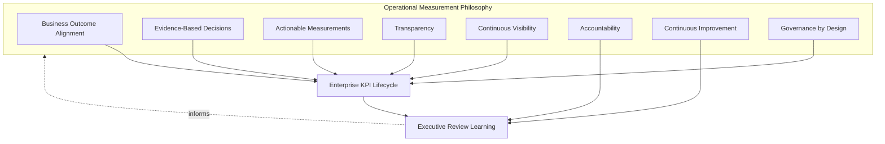
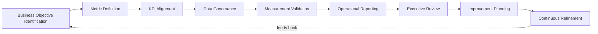
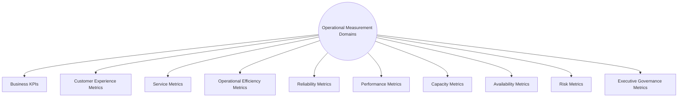
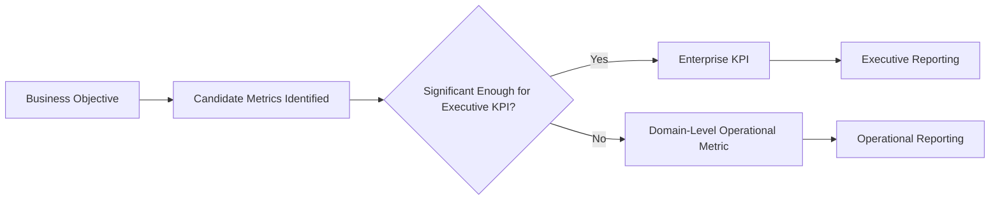
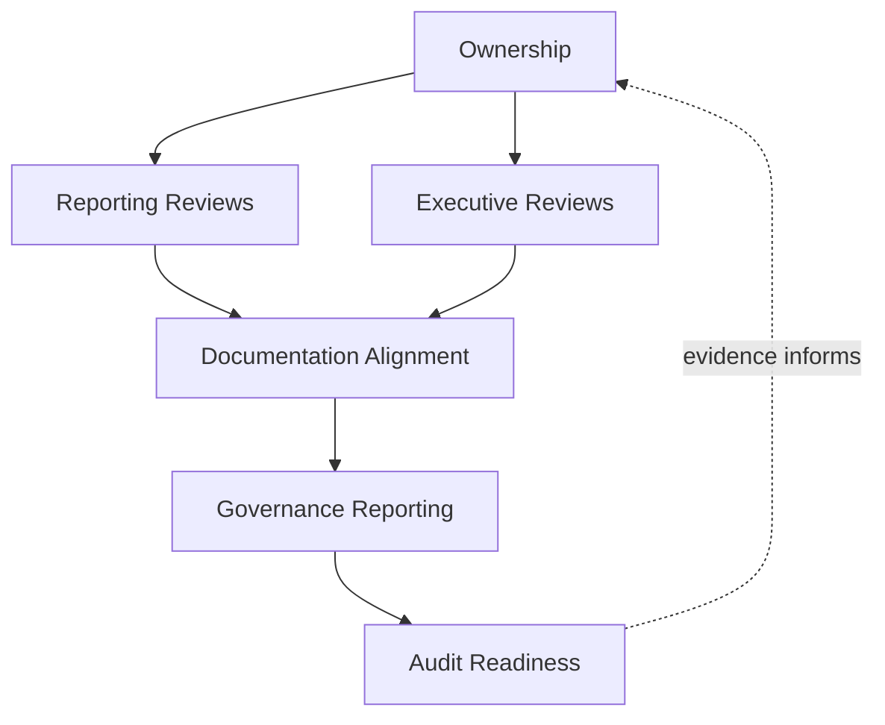
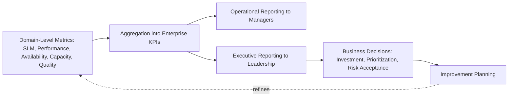
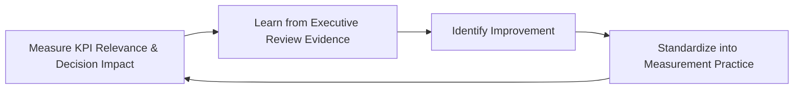
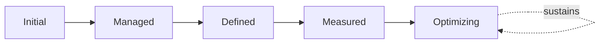

# Enterprise Operations Metrics, KPIs & Operational Measurement Strategy

## 1. Document Purpose

This document defines the official Enterprise Operations Metrics, KPIs & Operational Measurement Strategy for **StackLeo Tech Store**. It establishes how operational performance across the entire platform is measured, aggregated, and reported to leadership — independent of any specific BI platform, dashboard tool, or analytics software.

This document is the COO-owned, enterprise-wide measurement layer for operations. It does not redefine the domain-specific measurement already established elsewhere — `08_Quality_Assurance/quality-metrics.md` governs quality-specific metrics (testing, defects, release health), `service-level-management.md` governs individual service commitments, and `monitoring-observability.md`, `performance-management.md`, `availability-management.md`, and `capacity-management.md` each produce their own domain telemetry. This document governs how those distributed measurement streams are aggregated into a coherent set of business-facing KPIs and reported to executive leadership as a single, honest operational picture.

- **Purpose of Operational Metrics & KPIs** — to ensure operational health across the entire platform is visible to leadership as a small, meaningful set of business-facing indicators, replacing fragmented, domain-specific data with a coherent enterprise view sufficient to inform real decisions.
- **Relationship with Performance Management** — this document consumes Performance Reporting from `performance-management.md` (Section 4.10) as one input among several, elevating domain-level performance data into business-facing operational KPIs.
- **Relationship with Service Level Management** — Executive Service Reviews in `service-level-management.md` (Section 6.3) are one of the reporting channels this document's operational metrics feed into, alongside broader operational health beyond any single service.
- **Relationship with Monitoring & Observability** — this document depends entirely on the telemetry foundation in `monitoring-observability.md`; enterprise KPIs are only as trustworthy as the underlying observation they aggregate.
- **Relationship with Executive Governance** — this document is the primary mechanism by which executive leadership maintains an honest, evidence-based understanding of operational health, sufficient to make investment, prioritization, and risk-acceptance decisions.
- **Relationship with Business Strategy** — operational KPIs are chosen and interpreted in direct service of `01_Business/business-model.md` and `01_Business/vision.md`, ensuring measurement reflects genuine business priority rather than technical convenience.
- **Relationship with Continuous Improvement** — this document treats measurement itself as a discipline that matures over time, consistent with Continuous Refinement (Section 3.9), rather than a fixed set of metrics defined once and never revisited.

This document is implementation-independent and vendor-neutral. It defines measurement philosophy, KPI lifecycle, domains, and governance conceptually — not specific BI platforms, dashboard tools, analytics software, monitoring products, KPI thresholds, target values, formulas, or infrastructure configuration.

## 2. Operational Measurement Philosophy

Operational measurement at StackLeo is governed by eight principles. Each exists to produce a specific business outcome — measurement is pursued because of the decisions it improves, not as an exercise in data collection for its own sake.

### 2.1 Business Outcome Alignment

Every operational metric traces to a genuine business outcome it exists to inform, consistent with Business Value Alignment used throughout this repository, rather than being collected because it is easy to capture.

- **Business Value** — keeps measurement effort anchored to genuine decision value, avoiding the cost of maintaining metrics nobody actually uses.

### 2.2 Evidence-Based Decisions

Operational decisions about investment, prioritization, and risk acceptance are grounded in observed evidence, consistent with Evidence-Based Operations in `operations-overview.md` (Section 6).

- **Business Value** — reduces the influence of anecdote and recency bias on decisions that materially affect customers and the business.

### 2.3 Actionable Measurements

Every metric exists to inform a specific decision or action, consistent with Metrics as Decision Support in `08_Quality_Assurance/quality-metrics.md` (Section 2.1).

- **Business Value** — prevents measurement effort from producing data that is collected but never actually used.

### 2.4 Transparency

Operational metrics and their meaning are visible to the stakeholders who depend on them, not held privately within any single function.

- **Business Value** — builds cross-functional confidence and enables informed decision-making across teams that did not produce the underlying data themselves.

### 2.5 Continuous Visibility

Operational health is visible on an ongoing basis, not only during periodic, scheduled reviews.

- **Business Value** — allows emerging issues to be noticed and addressed while still small, rather than discovered only at the next scheduled checkpoint.

### 2.6 Accountability

Every metric and KPI has a specific, named accountable owner responsible for its accuracy and continued relevance.

- **Business Value** — prevents the anti-pattern in Section 10.5, where metrics decay in quality because no one is specifically responsible for sustaining them.

### 2.7 Continuous Improvement

Measurement practice itself matures over time — which metrics are tracked, how they are interpreted, and what decisions they inform evolve as the platform and business grow.

- **Business Value** — keeps operational intelligence relevant as StackLeo's business model and scale evolve, rather than measuring what once mattered but no longer does.

### 2.8 Governance by Design

Measurement governance structures are established deliberately as metrics are defined, not retrofitted once a misleading or stale metric has already informed a poor decision.

- **Business Value** — prevents the costly discovery of measurement governance gaps only after they have already contributed to a flawed business decision.

*Diagram 1: Operational Measurement Philosophy Overview — the eight principles shape the enterprise KPI lifecycle, and executive review learning feeds back into the philosophy itself.*

## 3. Enterprise KPI Lifecycle

The enterprise KPI lifecycle spans nine conceptual stages, from initial business objective identification through continuous refinement.

### 3.1 Business Objective Identification

- **Purpose** — determine which genuine business objectives operational measurement should inform.
- **Business Value** — ensures measurement begins with genuine business priority, not an inventory of available data.
- **Governance Objectives** — require objectives to trace to `01_Business/business-model.md` or `01_Business/vision.md` before metric definition proceeds.

### 3.2 Metric Definition

- **Purpose** — determine what will be measured, why, and what decision or objective it supports.
- **Business Value** — ensures every metric has a clear purpose before collection and reporting effort begins.
- **Governance Objectives** — require every proposed metric to state the objective it informs, consistent with Metric Definition in `08_Quality_Assurance/quality-metrics.md` (Section 3.1).

### 3.3 KPI Alignment

- **Purpose** — determine which defined metrics are significant enough to be elevated to enterprise-level KPIs reported to executive leadership.
- **Business Value** — ensures the small set of metrics leadership actually reviews is genuinely the most important, not an arbitrary or convenient subset.
- **Governance Objectives** — require KPI selection to be reviewed and approved, not defaulted from whichever metrics happen to be easiest to report.

### 3.4 Data Governance

- **Purpose** — confirm the data underlying each KPI is reliable, complete, and traceable to its source.
- **Business Value** — protects the credibility of every downstream decision the KPI informs.
- **Governance Objectives** — require data sources and known limitations to be documented alongside every KPI.

### 3.5 Measurement Validation

- **Purpose** — confirm a defined KPI genuinely measures what it claims to, and behaves sensibly across realistic scenarios.
- **Business Value** — protects against KPIs that are technically calculated but conceptually misleading.
- **Governance Objectives** — require validation before a new KPI is promoted into regular executive reporting.

### 3.6 Operational Reporting

- **Purpose** — communicate current KPI status to operational and management stakeholders on a regular basis.
- **Business Value** — keeps operational teams and their managers informed without requiring them to interpret raw underlying data themselves.
- **Governance Objectives** — require reporting to occur on a predictable, regular cadence, connected to the Operational Reporting Governance in Section 6.

### 3.7 Executive Review

- **Purpose** — present aggregated KPIs to executive leadership for business-level decision-making.
- **Business Value** — gives leadership an honest, evidence-based view of operational health sufficient to make informed investment and prioritization decisions.
- **Governance Objectives** — require executive review to occur on a predictable, regular cadence and reflect genuine underlying evidence.

### 3.8 Improvement Planning

- **Purpose** — identify and plan specific actions in response to what KPI trends reveal about operational health.
- **Business Value** — ensures measurement translates into deliberate action, not merely observation.
- **Governance Objectives** — require improvement actions arising from executive review to be documented and tracked to completion.

### 3.9 Continuous Refinement

- **Purpose** — periodically reassess whether the current KPI set remains relevant, accurate, and genuinely used.
- **Business Value** — prevents the accumulation of stale, unused, or misleading KPIs that dilute attention from what matters.
- **Governance Objectives** — require refinement to be conducted on a regular, predictable cadence, not only when a KPI has already proven misleading.

### Enterprise KPI Lifecycle Matrix

| Stage | Purpose | Business Value | Governance Objective |
|---|---|---|---|
| Business Objective Identification | Determine which objectives measurement should inform | Ensures measurement begins with genuine business priority | Objectives trace to business model or vision documentation |
| Metric Definition | Determine what is measured, why, and for what purpose | Ensures every metric has clear purpose before collection | Metrics state the objective they inform |
| KPI Alignment | Determine which metrics are elevated to executive KPIs | Ensures leadership reviews genuinely the most important set | Selection reviewed and approved, not defaulted by convenience |
| Data Governance | Confirm underlying data is reliable, complete, traceable | Protects credibility of every downstream decision | Sources and limitations documented alongside each KPI |
| Measurement Validation | Confirm a KPI measures what it claims to | Protects against technically-calculated, misleading KPIs | Validation required before promotion to executive reporting |
| Operational Reporting | Communicate KPI status to operational stakeholders | Keeps teams informed without requiring raw data interpretation | Regular, predictable cadence |
| Executive Review | Present aggregated KPIs for business-level decisions | Honest, evidence-based view for informed decisions | Regular cadence, reflects genuine underlying evidence |
| Improvement Planning | Identify and plan action from KPI trends | Ensures measurement translates into deliberate action | Improvement actions documented and tracked to completion |
| Continuous Refinement | Reassess whether the KPI set remains relevant | Prevents accumulation of stale or misleading KPIs | Regular cadence, not only after a KPI proves misleading |

*Diagram 2: Enterprise KPI Lifecycle — a continuous cycle in which improvement planning and refinement directly inform the next iteration of business objective identification.*

## 4. Operational Measurement Domains

Operational measurement spans ten conceptual domains, each aggregating metrics from a distinct area of the platform and organization.

### 4.1 Business KPIs

- **Purpose** — represent the top-level indicators of overall business health that operations directly influences.
- **Scope** — informed by `01_Business/business-model.md`, expressed in business terms leadership uses without translation.
- **Governance Expectations** — reviewed jointly with Business and Product stakeholders as the highest-level indicator set.
- **Business Importance** — provides the ultimate context every other measurement domain in this section serves.

### 4.2 Customer Experience Metrics

- **Purpose** — represent how customers actually experience the platform, complementing internal technical measures.
- **Scope** — informed by Customer Experience Performance in `performance-management.md` (Section 4.2) and Customer Experience Metrics in `08_Quality_Assurance/quality-metrics.md` (Section 4.7).
- **Governance Expectations** — reviewed alongside operational metrics, since a technically healthy platform can still fail customers in ways internal metrics alone would miss.
- **Business Importance** — the ultimate validation that operational effort is translating into genuine customer value.

### 4.3 Service Metrics

- **Purpose** — represent the aggregate health of the service portfolio defined in `service-catalog.md`.
- **Scope** — informed by Service Level Management performance across the portfolio, not any single service in isolation.
- **Governance Expectations** — aggregated in a way that surfaces both portfolio-wide trends and individually significant outliers.
- **Business Importance** — connects individual service commitments to a coherent, portfolio-wide operational picture.

### 4.4 Operational Efficiency Metrics

- **Purpose** — represent how efficiently the organization operates the platform — incident resolution time, change success rate.
- **Scope** — informed by Operational Performance in `performance-management.md` (Section 4.9) and Engineering Productivity Metrics in `08_Quality_Assurance/quality-metrics.md` (Section 4.8).
- **Governance Expectations** — always reviewed jointly with customer-facing metrics, so internal efficiency is never optimized at the expense of customer experience.
- **Business Importance** — reflects the organization's capacity to operate the platform sustainably, not merely whether it currently functions.

### 4.5 Reliability Metrics

- **Purpose** — represent the platform's consistency of correct behavior over time.
- **Scope** — informed by Reliability Metrics in `08_Quality_Assurance/quality-metrics.md` (Section 4.4) and `07_DevOps/sre-strategy.md`.
- **Governance Expectations** — reviewed jointly with SRE leadership to ensure consistency with engineered reliability objectives.
- **Business Importance** — underpins customer confidence that the platform behaves as expected every time.

### 4.6 Performance Metrics

- **Purpose** — represent the platform's responsiveness as aggregated from `performance-management.md`.
- **Scope** — enterprise-level rollup of domain-specific performance data across the service portfolio.
- **Governance Expectations** — interpreted in the context of genuine workload and business context, not in isolation.
- **Business Importance** — directly connects to conversion and customer trust, both highly sensitive to responsiveness.

### 4.7 Capacity Metrics

- **Purpose** — represent how well actual capacity has matched genuine business demand, informed by `capacity-management.md`.
- **Scope** — aggregate forecasting accuracy and capacity efficiency across business, technical, and workforce domains.
- **Governance Expectations** — reviewed to inform proactive capacity investment decisions, not only after strain is observed.
- **Business Importance** — gives leadership visibility into whether capacity investment is proportionate to genuine growth.

### 4.8 Availability Metrics

- **Purpose** — represent the platform's accessibility and functionality as aggregated from `availability-management.md`.
- **Scope** — enterprise-level rollup of service availability performance across the portfolio.
- **Governance Expectations** — reviewed alongside Reliability Metrics (Section 4.5), given their close conceptual relationship.
- **Business Importance** — protects the most directly customer-perceptible dimension of operational health.

### 4.9 Risk Metrics

- **Purpose** — represent the organization's accumulated operational risk exposure across domains.
- **Scope** — aggregated from Risk Governance sections across `change-management.md`, `configuration-management.md`, `business-continuity.md`, and `disaster-recovery.md`.
- **Governance Expectations** — reviewed with explicit attention to whether accepted risk remains proportionate to genuine business tolerance.
- **Business Importance** — ensures leadership consciously understands, rather than unconsciously inherits, the organization's risk exposure.

### 4.10 Executive Governance Metrics

- **Purpose** — represent the health of governance practice itself — review completion rates, audit readiness, policy currency.
- **Scope** — cross-cutting; reflects adherence to the governance structures established across every document in `09_Operations`.
- **Governance Expectations** — reviewed by executive leadership as a direct indicator of organizational governance discipline.
- **Business Importance** — ensures governance itself remains a living practice, not a set of policies that exist only on paper.

### Operational Measurement Domain Matrix

| Domain | Purpose | Governance Expectations | Business Importance |
|---|---|---|---|
| Business KPIs | Represent top-level overall business health indicators | Reviewed jointly with Business and Product stakeholders | Provides ultimate context every other domain serves |
| Customer Experience Metrics | Represent how customers actually experience the platform | Reviewed alongside operational metrics | Ultimate validation of genuine customer value |
| Service Metrics | Represent aggregate health of the service portfolio | Surfaces both portfolio trends and significant outliers | Connects individual commitments to a coherent picture |
| Operational Efficiency Metrics | Represent how efficiently the platform is operated | Always reviewed jointly with customer-facing metrics | Reflects capacity to operate sustainably, not just functionally |
| Reliability Metrics | Represent consistency of correct behavior over time | Reviewed jointly with SRE leadership | Underpins confidence the platform behaves as expected |
| Performance Metrics | Represent platform responsiveness, enterprise-aggregated | Interpreted in context of genuine workload and business context | Connects directly to conversion and customer trust |
| Capacity Metrics | Represent how well capacity matched genuine demand | Informs proactive, not only reactive, investment decisions | Visibility into whether investment is proportionate to growth |
| Availability Metrics | Represent platform accessibility and functionality | Reviewed alongside reliability metrics | Protects the most directly customer-perceptible health dimension |
| Risk Metrics | Represent accumulated operational risk exposure | Reviewed against genuine business risk tolerance | Ensures conscious, not unconscious, risk exposure |
| Executive Governance Metrics | Represent health of governance practice itself | Reviewed by executive leadership directly | Ensures governance remains living practice, not paper policy |

*Diagram 3 (Part A): Business Objective → KPI Alignment Model — ten domains, each aggregating distributed operational measurement into a coherent, business-facing picture.*

*Diagram 3 (Part B): Business Objective → KPI Alignment Model — candidate metrics are evaluated for executive significance, with only the most important elevated to enterprise KPI status while the rest remain valuable domain-level operational metrics.*

## 5. Measurement Governance Principles

- **Executive Ownership** — the enterprise KPI set is owned and reviewed at the executive level, reflecting its role in business-level decision-making.
- **Data Integrity** — KPI data is reliable and genuinely reflects underlying reality, consistent with Data Governance (Section 3.4).
- **Business Alignment** — KPIs are chosen and interpreted in direct service of genuine business objectives, consistent with Business Outcome Alignment (Section 2.1).
- **Transparency** — KPI definitions, data sources, and known limitations are documented and accessible to relevant stakeholders.
- **Auditability** — KPI definitions, data sources, and executive reports can be independently reviewed after the fact.
- **Consistency** — KPIs are defined and calculated consistently over time, so trend comparison remains meaningful.
- **Decision Support** — every KPI exists to inform a specific class of decision, consistent with Actionable Measurements (Section 2.3).
- **Continuous Improvement** — measurement governance itself matures over time, informed by real decision outcomes and organizational evidence.

### Measurement Governance Principle Matrix

| Principle | Description | Business Value |
|---|---|---|
| Executive Ownership | Enterprise KPI set owned and reviewed at the executive level | Reflects its central role in business-level decision-making |
| Data Integrity | KPI data is reliable and genuinely reflects reality | Protects credibility of every downstream decision |
| Business Alignment | KPIs chosen and interpreted in service of genuine objectives | Keeps measurement anchored to real business priority |
| Transparency | Definitions, sources, and limitations documented and accessible | Builds cross-functional confidence in reported figures |
| Auditability | Definitions, sources, and reports independently reviewable | Supports accountability and confidence for partners and regulators |
| Consistency | KPIs defined and calculated consistently over time | Keeps trend comparison genuinely meaningful |
| Decision Support | Every KPI exists to inform a specific class of decision | Prevents measurement effort producing unused data |
| Continuous Improvement | Governance matures from real decision outcomes | Keeps measurement aligned with organizational growth |

## 6. Operational Reporting Governance

### 6.1 Ownership

Every measurement domain (Section 4) has a designated accountable owner; overall operational measurement governance is owned by the COO, in partnership with Operations, SRE, and Product leadership.

### 6.2 Reporting Reviews

Operational reporting (Section 3.6) is formally reviewed for accuracy and relevance on a recurring basis, ensuring reported metrics remain genuinely trustworthy.

### 6.3 Executive Reviews

Enterprise KPIs are reviewed with executive leadership on a regular, predictable cadence, consistent with Executive Review (Section 3.7), ensuring operational intelligence genuinely informs business-level decisions.

### 6.4 Documentation Alignment

Operational measurement documentation is kept consistent with `service-level-management.md`, `performance-management.md`, `availability-management.md`, `capacity-management.md`, and `08_Quality_Assurance/quality-metrics.md`; a KPI that no longer reflects the underlying practice it claims to measure is treated as a governance gap.

### 6.5 Governance Reporting

Executive Governance Metrics (Section 4.10) are themselves reported as part of this strategy's own accountability, ensuring measurement governance does not exempt itself from the scrutiny it applies elsewhere.

### 6.6 Audit Readiness

KPI definitions, data sources, executive reports, and refinement outcomes are retained in a form that can be independently reviewed after the fact, supporting internal governance and the compliance posture referenced in `06_Security/compliance.md`.

### Operational Reporting Governance Matrix

| Governance Area | Objective |
|---|---|
| Ownership | Every measurement domain has a designated accountable owner |
| Reporting Reviews | Reported metrics reviewed recurringly for accuracy and relevance |
| Executive Reviews | Enterprise KPIs reviewed with leadership on a regular cadence |
| Documentation Alignment | Measurement documentation stays consistent with domain-specific strategies |
| Governance Reporting | Governance health itself is measured and reported, not exempted |
| Audit Readiness | Definitions, sources, and reports retained for independent review |

*Diagram: Operational Measurement Governance Framework — ownership anchors review activity, which feeds documentation alignment, governance reporting on itself, and ultimately auditable evidence.*

*Diagram 4: Executive Reporting & Decision Support Flow — domain-level metrics aggregate into enterprise KPIs, feeding both operational and executive reporting, which drives real business decisions and subsequent improvement.*

### Governance Responsibility Matrix

| Role | Responsibility |
|---|---|
| COO | Owns coherence and enforcement of this operational measurement strategy, and chairs Executive Reviews (Section 3.7). |
| Operations Intelligence Lead | Owns Metric Definition, KPI Alignment, and Data Governance (Sections 3.2–3.4) across domains. |
| SRE Lead | Ensures Reliability and Performance Metrics (Sections 4.5–4.6) remain consistent with engineering practice. |
| Service Owners | Provide Service Metrics (Section 4.3) input for their respective services. |
| Product Manager | Ensures Business KPIs and Customer Experience Metrics (Sections 4.1–4.2) reflect genuine business and customer priority. |
| Risk Manager | Owns Risk Metrics (Section 4.9) aggregation across domains. |
| Executive Leadership | Consumes Executive Reviews and makes informed investment and prioritization decisions. |
| Internal Audit / Review Function | Independently verifies that measurement governance records reflect actual practice. |

## 7. Future Readiness

This strategy is designed to remain valid as StackLeo evolves in scale and organizational complexity, without requiring redefinition of its underlying philosophy.

- **Cloud-Native Platforms** — measurement domains (Section 4) are defined independently of any specific runtime or deployment model, so they apply unchanged as infrastructure evolves.
- **AI-Driven Operational Intelligence** — as AI-assisted techniques are introduced to support trend analysis or anomaly detection across operational metrics, they operate within the same Data Integrity and Decision Support principles (Section 5) as any other measurement practice, never adopted as an unreviewed replacement for human judgment.
- **Marketplace Platform** — the multi-vendor marketplace model extends Business KPIs and Service Metrics (Sections 4.1, 4.3) to cover seller-driven business outcomes and service performance.
- **Multi-Tenant Architecture** — where future architecture introduces tenant isolation, Service and Reliability Metrics (Sections 4.3, 4.5) extend to explicitly capture per-tenant measurement where warranted.
- **Multi-Region Operations** — as StackLeo expands from Bangladesh into South Asia and beyond, measurement domains extend to capture region-specific operational signals without requiring a new governance model.
- **Global Business Expansion** — Executive Reviews (Section 3.7) extend to accommodate distributed leadership and region-specific operational context as the business grows beyond its current footprint.
- **Enterprise Scale** — the KPI lifecycle, domains, and governance defined in Sections 3–6 are defined independently of organizational size or structure, so they remain coherent as the business grows substantially.
- **Predictive Operational Insights** — as historical measurement data accumulates, trend analysis may evolve toward anticipating operational risk before it manifests, governed by the same Evidence-Based Decisions principle (Section 2.2) and never adopted as an unreviewed replacement for human judgment.

## 8. Governance

- **Ownership** — the COO owns this strategy and is accountable for its consistent application across the platform, in partnership with Operations, SRE, and Product leadership.
- **Review Process** — this strategy is formally reviewed whenever a material change occurs in business model (`01_Business/business-model.md`), the service portfolio (`service-catalog.md`), or delivery practice (`07_DevOps`), and on a regular recurring cadence independent of specific change events.
- **Operational Measurement Policies** — subordinate, practice-specific measurement documents (individual KPI definitions, reporting templates) must remain consistent with the philosophy, lifecycle, and domains defined here.
- **Audit Readiness** — this strategy and the evidence it requires (Section 6.6) are maintained in a state ready for internal or external audit at any time, without requiring advance preparation.
- **Continuous Improvement** — this strategy itself is subject to Continuous Improvement (Section 2.7, Section 3.9); its effectiveness is periodically assessed and revised based on genuine decision-making and organizational evidence.

*Diagram 5: Continuous Measurement Improvement Cycle — KPI relevance and decision impact are measured, learned from, improved upon, and standardized back into practice, on a continuing basis.*

## 9. Operations Measurement Maturity Model

Operational measurement maturity is described across five conceptual levels, adapted from established process maturity thinking. Progression reflects increasing consistency, measurement rigor, and deliberate improvement — not merely increasing metric volume.

- **Initial** — operational measurement, where it exists, is informal and inconsistent; metrics vary by team, and executive visibility depends on ad hoc reporting rather than a coherent enterprise view.
- **Managed** — basic metrics exist for individual domains, but consistency and executive-level aggregation vary significantly.
- **Defined** — metric definitions, KPI selection, and reporting governance are standardized, documented, and consistently applied across the organization, consistent with the lifecycle and domains defined throughout this document; ownership is clear organization-wide.
- **Measured** — KPI accuracy and decision impact are themselves assessed systematically, and refinement decisions are grounded in genuine evidence rather than qualitative impression alone.
- **Optimizing** — operational measurement practice is continuously and deliberately improved based on quantitative evidence and organizational learning; improvement itself is a managed, ongoing discipline rather than an occasional initiative.

### Operations Measurement Maturity Model Matrix

| Level | Characteristics | Primary Focus |
|---|---|---|
| Initial | Informal, inconsistent measurement; ad hoc executive visibility | Fragmented, team-specific reporting |
| Managed | Basic metrics exist per domain; aggregation consistency varies | Domain-level consistency |
| Defined | Standardized, documented metric definitions and reporting governance | Organization-wide consistency and clear ownership |
| Measured | KPI accuracy and decision impact assessed systematically | Evidence-based measurement governance |
| Optimizing | Practice continuously and deliberately improved from evidence | Sustained, deliberate improvement as a discipline |

*Diagram 6: Operations Measurement Maturity Progression Model — maturity advances from fragmented, ad hoc reporting toward standardized, measured, and continuously optimized operational measurement practice.*

## 10. Anti-Patterns

The following recurring failure patterns are explicitly recognized and avoided, as each one structurally undermines this strategy.

| Anti-Pattern | Why It's Avoided |
|---|---|
| Measuring Without Business Purpose | Contradicts Business Outcome Alignment (Section 2.1); collecting data without a clear business objective it informs dilutes attention and wastes measurement effort. |
| Vanity Metrics | Contradicts Actionable Measurements (Section 2.3); metrics that look impressive but do not inform genuine decisions create false confidence rather than real insight. |
| Inconsistent Definitions | Contradicts Consistency (Section 5.6); a KPI calculated differently over time or across teams makes trend comparison meaningless. |
| Poor Data Quality | Contradicts Data Integrity (Section 5.2); a KPI built on unreliable data can mislead exactly the decisions it was meant to inform. |
| Weak Executive Visibility | Undermines Executive Review (Section 3.7); without genuine visibility, leadership cannot make informed investment or risk-acceptance decisions. |
| Weak Documentation | Undermines Documentation Alignment (Section 6.4), leaving KPI definitions and evidence unclear or unverifiable after the fact. |
| Weak Governance | Undermines Section 6.1; without clear ownership and review, the measurement set accumulates stale or irrelevant metrics indefinitely. |
| Missing Continuous Improvement | Contradicts Continuous Improvement (Section 2.7) and Continuous Refinement (Section 3.9); without regular reassessment, the KPI set drifts out of alignment with genuine business priority. |

## 11. Document Information

| Property | Value |
|----------|-------|
| Document | operations-metrics-kpis.md |
| Version | 1.0.0 |
| Status | Active |
| Maintained By | StackLeo |
| Last Updated | 2026-07-24 |

---

© StackLeo. All Rights Reserved.
