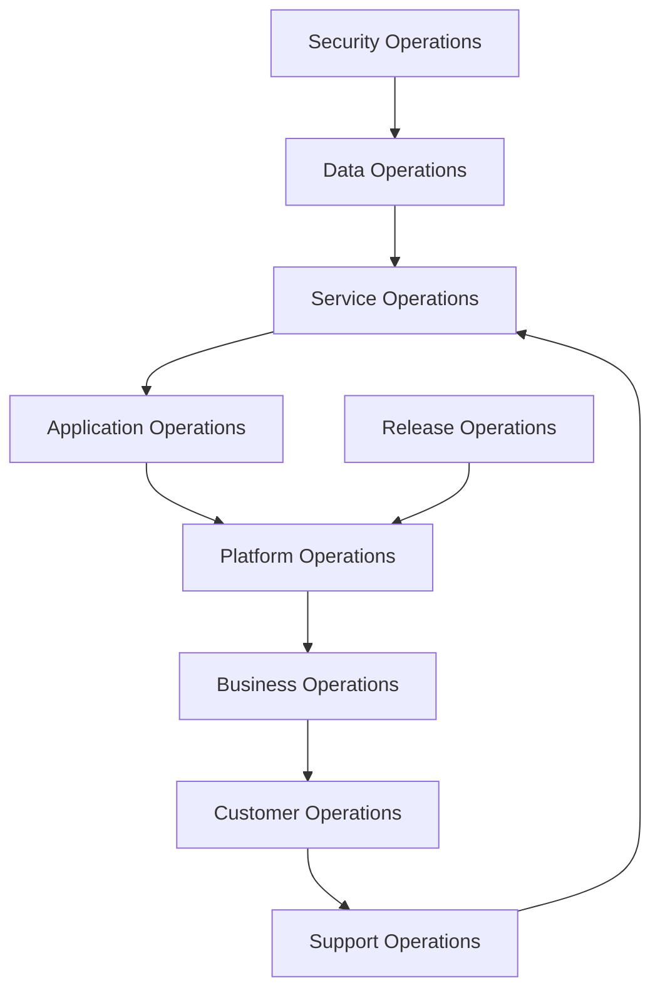
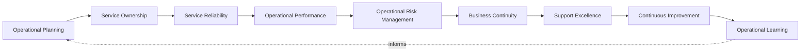
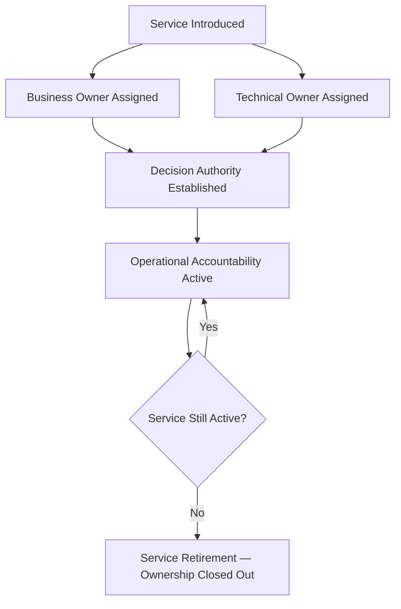
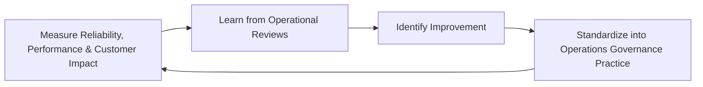
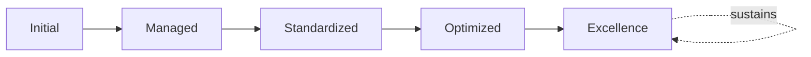

# Enterprise Operations Strategy Framework

## 1. Executive Summary

**Purpose** — This document defines the official Enterprise Operations Strategy Framework for **StackLeo Tech Store**. It establishes operational vision, service reliability, operational governance, ownership, business continuity mindset, operational excellence, executive oversight, continuous improvement, and long-term operations maturity as a single, consolidated governance reference. `operations-governance-strategy.md` remains the COO/CIO-owned executive charter for operations at StackLeo, and `operations-governance.md` remains the master operational governance framework holding every subordinate operations strategy — service management, incident management, change management, problem management, business continuity — together as a coherent whole. This framework does not compete with either for authority. It is the consolidated governance reference that synthesizes vision, capability, ownership, risk, and executive oversight across every operational domain into one coherent document.

**Scope** — This framework applies to every category of operations at StackLeo — service, application, platform, business, customer, security, data, release, and support operations — coordinated with `operations-governance-strategy.md`, `operations-governance.md`, and `security-strategy.md`.

**Strategic Objectives** — To ensure the daily running of the platform remains a deliberate expression of genuine business intent, never an activity that has drifted apart from it; that every service traces to a genuinely accountable owner; that operational risk is proportionately managed before it materializes into disruption; and that executive leadership has one coherent, consolidated view of the organization's operational posture.

**Business Value** — A consolidated operations strategy protects the organization from the risk of operational gaps hiding in the seams between separately-maintained domain strategies, protects the customer experience the platform exists to deliver, and gives executive leadership confidence that daily operation is genuinely and coherently governed end to end.

**Intended Audience** — The Board of Directors, executive leadership, the Chief Technology Officer, operations leadership, engineering leadership, product leadership, security leadership, support teams, and business stakeholders.

## 2. Enterprise Operations Vision

- **Operations as Business Capability** — operations is governed as a genuine strategic business capability, never a routine, background activity beneath executive attention.
- **Reliable Digital Services** — every service StackLeo operates is governed to be genuinely dependable for those who rely on it.
- **Customer Experience Protection** — operations protects the customer's genuine, moment-to-moment experience of the platform.
- **Business Continuity** — operations protects the organization's ability to keep running through genuine disruption, coordinated with `business-continuity-governance.md`.
- **Operational Excellence** — operations is pursued as a durable discipline of genuine excellence, never merely adequate function.
- **Sustainable Growth** — operational capability is governed to scale deliberately alongside the business, never lagging behind or over-investing ahead of genuine need.
- **Service Trust** — operations is the organization's continuous, demonstrable evidence that customers and the business can genuinely rely on the platform.

### Enterprise Operations Vision Matrix

| Vision Element | Focus | Business Value |
|---|---|---|
| Operations as Business Capability | A genuine strategic capability, not background activity | Prevents operations from being treated as a low-priority afterthought |
| Reliable Digital Services | Every service genuinely dependable for those who rely on it | Protects confidence in the platform's daily operation |
| Customer Experience Protection | Protects the customer's genuine, moment-to-moment experience | Protects the trust relationship every interaction depends on |
| Business Continuity | Protects the ability to keep running through disruption | Protects revenue and commitments tied to continuous service |
| Operational Excellence | A durable discipline of genuine excellence | Distinguishes StackLeo through consistently superior operation |
| Sustainable Growth | Capability scaling deliberately alongside the business | Keeps expansion from silently eroding operational posture |
| Service Trust | Continuous, demonstrable evidence of genuine reliability | Converts operational discipline into genuine competitive advantage |

## 3. Operations Governance Principles

Operations governance at StackLeo rests on nine principles, each producing a specific business outcome.

- **Reliability First** — the platform's genuine dependability is weighed as the first priority in every operational decision. *Business Value:* protects the trust the entire business depends on customers extending to the platform.
- **Business Alignment** — operational priority is set by genuine business consequence, coordinated with `01_Business/business-model.md`. *Business Value:* ensures operational effort is spent on what genuinely matters to the business.
- **Operational Ownership** — every operational domain traces to a specific, named, responsible owner. *Business Value:* ensures no domain drifts without someone genuinely responsible for it.
- **Accountability** — every operational decision traces to the accountable person who made it. *Business Value:* ensures operational decisions can be genuinely defended, not merely assumed reasonable.
- **Continuous Improvement** — operational practice matures over time, informed by real service and incident outcomes. *Business Value:* keeps operations aligned with the organization's growing scale and complexity.
- **Service Excellence** — operations is governed to a standard of genuine excellence, not merely functional adequacy. *Business Value:* distinguishes the platform's reliability as a genuine competitive advantage.
- **Transparency** — operational status and known risk are documented and visible to those who genuinely need them. *Business Value:* allows operational posture to be scrutinized and defended, not merely trusted on faith.
- **Risk Awareness** — operational decisions are made with genuine, explicit awareness of the risk they carry. *Business Value:* prevents operational risk from accumulating unexamined.
- **Customer Impact Focus** — every operational decision is weighed first against its genuine effect on the customer. *Business Value:* keeps operations connected to the organization's most fundamental obligation to its customers.

### Operations Governance Principles Matrix

| Principle | Description | Business Value |
|---|---|---|
| Reliability First | Dependability weighed as the first priority | Protects the trust the entire business depends on |
| Business Alignment | Priority set by genuine business consequence | Ensures operational effort is spent on what genuinely matters |
| Operational Ownership | Every domain traces to a specific, responsible owner | Ensures no domain drifts without genuine responsibility |
| Accountability | Every decision traces to the accountable person | Ensures decisions can be genuinely defended |
| Continuous Improvement | Practice matures from real service and incident outcomes | Keeps operations aligned with growing scale and complexity |
| Service Excellence | Governed to genuine excellence, not mere adequacy | Distinguishes reliability as a genuine competitive advantage |
| Transparency | Status and risk documented and visible to those who need it | Allows operational posture to be scrutinized and defended |
| Risk Awareness | Decisions made with explicit awareness of carried risk | Prevents operational risk from accumulating unexamined |
| Customer Impact Focus | Every decision weighed first against customer effect | Keeps operations connected to the fundamental customer obligation |

## 4. Enterprise Operations Governance Model

Operations governance operates across nine conceptual domains, each holding accountability for a distinct category of operational activity. Operational depth for each domain remains authoritative in its dedicated governance document, referenced below.

### Service Operations

- **Purpose** — govern the day-to-day delivery of StackLeo's defined services against their committed level.
- **Governance Scope** — coordinated with `service-management.md` and `service-level-governance.md`.
- **Business Value** — protects the commitments StackLeo makes to customers and business partners.
- **Executive Expectations** — leadership expects service operations to be genuinely measured against defined commitment, not assumed adequate.

### Application Operations

- **Purpose** — govern the operation of the platform's application layer once live.
- **Governance Scope** — coordinated with `07_DevOps/reliability-engineering-framework.md`.
- **Business Value** — protects the software layer customers and the business directly depend on.
- **Executive Expectations** — leadership expects application operations to extend genuinely beyond the moment of deployment.

### Platform Operations

- **Purpose** — govern the operation of shared platform capability consumed across multiple services.
- **Governance Scope** — coordinated with `07_DevOps/platform-engineering.md`.
- **Business Value** — ensures a platform-level operational failure is never treated as a single team's isolated concern.
- **Executive Expectations** — leadership expects platform operations to be governed with awareness of its broad dependency footprint.

### Business Operations

- **Purpose** — govern the operational activity directly supporting genuine business function and revenue.
- **Governance Scope** — coordinated with `01_Business/business-model.md`.
- **Business Value** — protects the operational activity the business's commercial operation directly depends on.
- **Executive Expectations** — leadership expects business operations to reflect genuine commercial priority.

### Customer Operations

- **Purpose** — govern the operational activity that directly shapes the customer's experience of the platform.
- **Governance Scope** — coordinated with Customer Experience Protection (Section 2).
- **Business Value** — protects the trust relationship every customer interaction depends on.
- **Executive Expectations** — leadership expects customer operations to be weighted alongside internal technical priority.

### Security Operations

- **Purpose** — govern the operational activity protecting the platform through genuine day-to-day execution, jointly with, and never superseding, `security-strategy.md`.
- **Governance Scope** — oversight ensuring security operations meet the rigor `06_Security/security-governance.md` requires.
- **Business Value** — protects StackLeo's core trust differentiator through genuine operational security practice.
- **Executive Expectations** — leadership expects security operations to be treated as mandatory, non-negotiable.

### Data Operations

- **Purpose** — govern the operational activity sustaining the platform's data through genuine day-to-day operation.
- **Governance Scope** — coordinated with `04_Database/data-governance.md`.
- **Business Value** — protects the trustworthiness of the data every business decision depends on.
- **Executive Expectations** — leadership expects data operations to be governed proportionate to data sensitivity.

### Release Operations

- **Purpose** — govern the operational activity through which change is deliberately introduced to the running platform.
- **Governance Scope** — coordinated with `release-management.md` and `change-management-governance.md`.
- **Business Value** — protects the platform from the disproportionate cost of an uncontrolled change.
- **Executive Expectations** — leadership expects release operations to remain deliberate and bounded regardless of delivery velocity.

### Support Operations

- **Purpose** — govern the operational activity through which customer and internal issues are genuinely resolved.
- **Governance Scope** — coordinated with Support Excellence (Section 5).
- **Business Value** — protects the customer's confidence that a genuine problem will be genuinely resolved.
- **Executive Expectations** — leadership expects support operations to be measured by genuine resolution, not only response time.

### Operations Governance Matrix

| Domain | Purpose | Business Value | Executive Expectations |
|---|---|---|---|
| Service Operations | Govern day-to-day delivery against committed level | Protects commitments made to customers and partners | Expects service genuinely measured against commitment |
| Application Operations | Govern operation of the application layer once live | Protects the software layer customers directly depend on | Expects operations extending genuinely beyond deployment |
| Platform Operations | Govern operation of shared platform capability | Ensures platform failure is never one team's isolated concern | Expects awareness of broad dependency footprint |
| Business Operations | Govern activity supporting business function and revenue | Protects activity the business's commercial operation depends on | Expects reflection of genuine commercial priority |
| Customer Operations | Govern activity shaping the customer's experience | Protects the trust relationship every interaction depends on | Expects weighting alongside internal technical priority |
| Security Operations | Govern activity protecting the platform day to day | Protects StackLeo's core trust differentiator | Expects treatment as mandatory, non-negotiable |
| Data Operations | Govern activity sustaining platform data operation | Protects the trustworthiness of data decisions depend on | Expects governance proportionate to data sensitivity |
| Release Operations | Govern activity through which change is introduced | Protects against the disproportionate cost of uncontrolled change | Expects deliberate, bounded change regardless of velocity |
| Support Operations | Govern activity through which issues are resolved | Protects confidence a genuine problem will be resolved | Expects measurement by genuine resolution, not only response |

*Diagram 1: Enterprise Operations Governance Framework — service, application, and platform operations converge with business, customer, and support operations, while security, data, and release operations feed platform and business operations, resolving into the service operations commitment every domain ultimately serves.*

## 5. Operational Capability Framework

Operational capability is governed across nine conceptual domains, each requiring a distinct governance emphasis. Remaining implementation independent, these domains describe capability — never a specific tool, platform, or automation.

- **Service Reliability** — governs whether a service is genuinely dependable for those who rely on it.
- **Operational Planning** — governs how genuine operational need is anticipated and planned for before it arises.
- **Service Ownership** — governs whether every service traces to a specific, named, responsible owner.
- **Operational Risk Management** — governs how a genuine operational risk is identified, weighed, and addressed.
- **Support Excellence** — governs whether customer and internal issues are genuinely and effectively resolved.
- **Business Continuity** — governs whether the organization can genuinely continue operating through disruption, coordinated with `business-continuity-governance.md`.
- **Operational Performance** — governs whether operational activity genuinely meets its defined performance expectation.
- **Continuous Improvement** — governs how operational practice is deliberately strengthened based on real outcomes.
- **Operational Learning** — governs how understanding gained from operational experience deepens the organization's genuine collective capability.

### Operational Capability Matrix

| Capability | Governance Focus | Coordination |
|---|---|---|
| Service Reliability | Genuine dependability for those who rely on it | `service-level-governance.md` |
| Operational Planning | Genuine need anticipated before it arises | Operations Lifecycle Governance (Section 6) |
| Service Ownership | Every service traces to a responsible owner | Service Ownership Framework (Section 7) |
| Operational Risk Management | Identifying, weighing, and addressing genuine risk | Operational Risk Governance (Section 9) |
| Support Excellence | Genuine and effective issue resolution | Support Operations (Section 4) |
| Business Continuity | Genuine ability to continue through disruption | `business-continuity-governance.md` |
| Operational Performance | Genuine adherence to defined performance expectation | `operations-metrics-kpis.md` |
| Continuous Improvement | Practice deliberately strengthened from real outcomes | Continuous Improvement (Section 3) |
| Operational Learning | Experience deepening genuine collective capability | Organizational Learning coordinated with Section 6 |

*Diagram 2: Operations Capability Model — operational planning and service ownership establish service reliability and performance, feeding risk management and business continuity, with support excellence, continuous improvement, and operational learning feeding lessons back into planning.*

## 6. Operations Lifecycle Governance

Operations governance operates across eight conceptual lifecycle stages.

- **Service Introduction** — govern how a new service is deliberately introduced into operational practice.
- **Operational Readiness** — govern the organization's genuine preparedness to operate a service before it goes live.
- **Service Delivery** — govern the genuine, ongoing delivery of a service against its committed level.
- **Performance Review** — govern the periodic, formal review of operational performance for genuine insight.
- **Issue Management** — govern how a genuine operational issue is identified and resolved.
- **Improvement Planning** — govern how a genuine operational gap is planned for deliberate remediation.
- **Service Evolution** — govern how a service's operational model evolves alongside genuine business need.
- **Service Retirement** — govern how a service's operational obligations are formally closed out when it is genuinely retired.

### Operations Lifecycle Matrix

| Stage | Governance Objective | Business Value |
|---|---|---|
| Service Introduction | Deliberately introduce a new service into practice | Ensures operational effort is deliberately directed |
| Operational Readiness | Confirm genuine preparedness before going live | Prevents readiness gaps from being discovered in production |
| Service Delivery | Genuinely deliver against the committed level | Protects the commitments StackLeo makes to customers |
| Performance Review | Periodically review performance for genuine insight | Confirms operational investment is genuinely working |
| Issue Management | Identify and resolve a genuine operational issue | Protects customers and the business from unresolved disruption |
| Improvement Planning | Plan deliberate remediation of a genuine gap | Ensures gaps are addressed deliberately, not left to accumulate |
| Service Evolution | Evolve the operational model alongside business need | Keeps operations genuinely connected to business intent |
| Service Retirement | Formally close out obligations when genuinely retired | Prevents a retired service from persisting as unmanaged risk |

*Diagram 3: Operations Lifecycle Governance — service introduction and operational readiness inform service delivery and performance review, feeding issue management and improvement planning, with service evolution and retirement feeding lessons back into the cycle.*

## 7. Service Ownership Framework

- **Service Ownership** — governs every service's traceability to a specific, named, accountable owner.
- **Business Ownership** — governs the business function's genuine accountability for a service's continued relevance and value.
- **Technical Ownership** — governs the engineering team's genuine accountability for a service's technical operation.
- **Operational Accountability** — governs how service ownership translates into genuine, day-to-day operational responsibility.
- **Decision Authority** — governs who genuinely holds the authority to make a consequential decision about a service.
- **Continuous Responsibility** — governs whether ownership persists genuinely across a service's full operational lifetime, not only at launch.

### Service Ownership Matrix

| Ownership Area | Focus | Governance Coordination |
|---|---|---|
| Service Ownership | Traceability to a specific, named, accountable owner | Operational Ownership (Section 3) |
| Business Ownership | Business function's accountability for relevance and value | Business Operations (Section 4) |
| Technical Ownership | Engineering team's accountability for technical operation | Application and Platform Operations (Section 4) |
| Operational Accountability | Ownership translating into day-to-day responsibility | Operations Lifecycle Governance (Section 6) |
| Decision Authority | Who genuinely holds authority for a consequential decision | Organizational Governance (Section 8) |
| Continuous Responsibility | Ownership persisting across the full operational lifetime | Service Evolution (Section 6) |

*Diagram 4: Service Ownership Structure — every service is assigned a business and technical owner establishing decision authority, sustaining operational accountability continuously until the service is genuinely retired and ownership formally closed out.*

## 8. Organizational Governance

Governance accountability is distributed deliberately across nine organizational roles.

- **Board of Directors** — holds ultimate accountability for StackLeo's overall operational posture and its alignment with organizational values.
- **Executive Leadership** — holds accountability for whether operations genuinely serves the business and its customers, in partnership with the Board.
- **Chief Technology Officer** — owns the coherence of this framework's synthesis across `operations-governance-strategy.md` and `operations-governance.md`.
- **Operations Leadership** — owns the operational governance defined in `operations-governance.md` and its family of subordinate strategies.
- **Engineering Leadership** — owns Application and Platform Operations (Section 4) within their accountable teams.
- **Product Leadership** — owns Business and Customer Operations (Section 4) alignment with genuine product priority.
- **Security Leadership** — owns Security Operations (Section 4) jointly with `security-strategy.md`, which remains authoritative for security-specific obligations.
- **Support Teams** — own Support Operations (Section 4) and Support Excellence (Section 5).
- **Business Stakeholders** — own Business Operations (Section 4) alignment with genuine business priority.

### Organizational Responsibility Matrix

| Role | Governance Objective | Business Value |
|---|---|---|
| Board of Directors | Hold ultimate accountability for overall operational posture | Provides the highest point of ultimate accountability |
| Executive Leadership | Hold accountability for operations serving the business | Provides a single point of executive-level accountability |
| Chief Technology Officer | Own coherence of this framework's synthesis | Connects the consolidated view to authoritative sources |
| Operations Leadership | Own operational governance and its subordinate strategies | Applies governance to day-to-day operational practice |
| Engineering Leadership | Own application and platform operations | Embeds accountability closest to where services run |
| Product Leadership | Own business and customer operations alignment | Ensures operations reflect genuine product priority |
| Security Leadership | Own security operations jointly with security strategy | Ensures operations genuinely support security posture |
| Support Teams | Own support operations and support excellence | Ensures accountability extends into genuine issue resolution |
| Business Stakeholders | Own business operations alignment with priority | Connects operations to genuine business relevance |

## 9. Operational Risk Governance

Operational risk is governed across seven conceptual categories.

- **Service Availability Risks** — the risk that a genuinely important service becomes inaccessible to those who depend on it.
- **Operational Failure Risks** — the risk that genuine operational execution fails to meet its intended outcome.
- **Customer Impact Risks** — the risk that an operational failure produces a genuine, negative effect on the customer's experience.
- **Business Continuity Risks** — the risk that an operational failure escalates into a genuine threat to business continuity.
- **Security Operation Risks** — the risk that a gap in security operations exposes the platform to genuine compromise.
- **Dependency Risks** — the risk introduced through an operational dependency on a vendor or integration partner StackLeo does not directly control.
- **Reputation Risks** — the risk that an operational failure damages StackLeo's standing with customers, partners, or the market.

### Operational Risk Matrix

| Risk Category | Focus | Governance Coordination |
|---|---|---|
| Service Availability Risks | A genuinely important service becomes inaccessible | Coordinated with `availability-management.md` |
| Operational Failure Risks | Execution failing to meet its intended outcome | Coordinated with Issue Management (Section 6) |
| Customer Impact Risks | A genuine, negative effect on customer experience | Coordinated with Customer Operations (Section 4) |
| Business Continuity Risks | An operational failure escalating into a continuity threat | Coordinated with `business-continuity-governance.md` |
| Security Operation Risks | A gap in security operations exposing the platform | Coordinated with `security-strategy.md` |
| Dependency Risks | Risk from a vendor or integration partner | Coordinated with `06_Security/third-party-risk-governance.md` |
| Reputation Risks | Damage to standing with customers, partners, market | Coordinated with Executive Oversight (Section 10) |

## 10. Executive Oversight

- **Operational Reviews** — the overall coherence of this consolidated framework is formally reviewed on a regular cadence.
- **Service Performance Reviews** — service delivery against committed level is reviewed directly with executive leadership.
- **Reliability Reviews** — the platform's genuine reliability posture is reviewed as a distinct, ongoing concern.
- **Business Impact Reviews** — the genuine business impact of recent operational issues is reviewed with executive leadership.
- **Strategic Operations Planning** — operational direction's alignment with evolving business direction is reviewed directly with executive leadership.
- **Continuous Improvement Reviews** — the organization's follow-through on captured operations governance lessons is reviewed directly with executive leadership.

### Executive Oversight Matrix

| Oversight Mechanism | Purpose | Governance Role |
|---|---|---|
| Operational Reviews | Confirm overall consolidated framework coherence | Regular, predictable cadence for the framework as a whole |
| Service Performance Reviews | Review service delivery against committed level | Direct executive-level performance review |
| Reliability Reviews | Review the platform's genuine reliability posture | Treats reliability as ongoing, not assumed |
| Business Impact Reviews | Review genuine business impact of recent issues | Direct executive-level impact review |
| Strategic Operations Planning | Review alignment with evolving business direction | Direct executive-level strategic alignment review |
| Continuous Improvement Reviews | Review follow-through on captured lessons | Direct executive-level review of improvement completion |

## 11. Future Readiness

This framework is designed to remain valid as StackLeo evolves in scale, geography, and organizational complexity.

- **AI-Assisted Operations** — as operational execution increasingly incorporates AI-assisted methods, coordinated with `04_Database/ai-governance.md`, they remain governed under Issue Management (Section 6) at the same rigor as any other method.
- **Intelligent Service Management** — where service management increasingly draws on intelligent pattern analysis, that capability remains governed under Service Operations (Section 4) at the same rigor as any other method.
- **Autonomous Operations (Conceptual)** — where automation increasingly performs steps within issue management or performance review, that automation remains subject to the same ownership and executive oversight as any human-performed activity.
- **Predictive Operational Intelligence** — where the organization develops the capability to anticipate an operational issue before it fully materializes, that capability is governed as an extension of Operational Planning (Section 5).
- **Global Operations Scaling** — Service Introduction and Operational Readiness (Section 6) are structured to be re-applied as StackLeo expands from Bangladesh into South Asia and global markets, each with genuinely distinct operating conditions.
- **Digital Service Excellence** — this framework's governance discipline is treated as a direct, durable contributor to the digital trust customers, partners, and regulators extend to StackLeo.

## 12. Operations Maturity Model

Operations governance maturity is described across five conceptual levels.

- **Initial** — operations, where they exist, are informal and inconsistent; issues are addressed reactively, and ownership is unclear.
- **Managed** — basic operational governance exists for individual domains, but consistency across the nine domains in Section 4 varies significantly.
- **Standardized** — the governance model, domains, and lifecycle are standardized, documented, and consistently applied across the organization.
- **Optimized** — operational practice is continuously and deliberately improved based on quantitative evidence and organizational learning.
- **Excellence** — operations is governed as a genuine, sustained source of competitive advantage, with every domain in Section 4 operating at consistently superior, evidence-grounded performance.

### Operations Maturity Matrix

| Level | Characteristics | Primary Focus |
|---|---|---|
| Initial | Informal, inconsistent operations; issues addressed reactively | Ad hoc, individually-dependent operational practice |
| Managed | Basic governance exists per domain; consistency varies | Domain-level consistency |
| Standardized | Standardized governance model, domains, and lifecycle | Organization-wide consistency and clear ownership |
| Optimized | Practice continuously and deliberately improved from evidence | Sustained, deliberate improvement as a discipline |
| Excellence | Every domain operating at consistently superior performance | Operations as a genuine, sustained competitive advantage |

*Diagram 5: Continuous Operations Improvement Cycle — reliability, performance, and customer impact are measured, learned from, improved upon, and standardized back into governed practice, on a continuing basis.*

*Diagram 6: Operations Maturity Progression — maturity advances from informal, reactively-addressed operational practice toward standardized, continuously optimized, and ultimately genuinely excellent operations governance.*

## 13. Operations Anti-Patterns

- **Operations Without Ownership** — a service or domain with no accountable owner has no one genuinely responsible for its operational posture.
- **Reactive Operations** — addressing an operational issue only once it has already affected customers forfeits the chance to prevent it.
- **Lack of Documentation** — operational practice that exists only informally cannot be genuinely reviewed, defended, or improved.
- **Poor Service Visibility** — leadership and stakeholders unable to genuinely see operational status cannot make informed decisions about it.
- **Ignoring Customer Impact** — evaluating an operational decision purely in technical terms, without genuine customer impact awareness, produces decisions disconnected from real consequence.
- **Manual Dependency** — relying entirely on manual, ad hoc effort for operational execution leaves practice vulnerable to inconsistency and oversight gaps.
- **Weak Improvement Culture** — treating current operational practice as permanently finished guarantees it falls behind the organization's growing scale and complexity.
- **No Operational Governance** — operations pursued without genuine translation into `operations-governance.md`'s accountable structure leaves practice unenforced.

### Anti-Pattern Summary

| Anti-Pattern | Organizational & Business Impact |
|---|---|
| Operations Without Ownership | Leaves no one genuinely responsible for operational posture |
| Reactive Operations | Forfeits the chance to prevent an issue before it affects customers |
| Lack of Documentation | Prevents practice from being genuinely reviewed or improved |
| Poor Service Visibility | Prevents informed decisions about operational status |
| Ignoring Customer Impact | Produces decisions disconnected from real customer consequence |
| Manual Dependency | Leaves practice vulnerable to inconsistency and oversight gaps |
| Weak Improvement Culture | Guarantees practice falls behind growing scale and complexity |
| No Operational Governance | Leaves practice unenforced and ungoverned |

## Related Documents

| Document | Relationship |
|---|---|
| `operations-governance-strategy.md` | The COO/CIO-owned executive charter this framework consolidates a governance-level view of, without restating its philosophy. |
| `operations-governance.md` | The master operational governance framework this document's domains and lifecycle synthesize a consolidated reference from. |
| `incident-management-governance.md` | Elaborates incident-specific governance this framework's Issue Management (Section 6) coordinates with. |
| `incident-management-framework.md` | Consolidates incident severity, communication, and risk governance this framework's Issue Management (Section 6) coordinates with. |
| `service-management.md` | Elaborates service-specific management practice this framework's Service Operations (Section 4) coordinates with. |
| `business-continuity-governance.md` | Elaborates the continuity discipline this framework's Business Continuity capability (Section 5) coordinates with. |
| `business-continuity-framework.md` | Consolidates critical service, resilience, and crisis governance this framework's Business Continuity capability (Section 5) coordinates with. |
| `disaster-recovery.md` | Elaborates the technical recovery capability this framework's Business Continuity Risks (Section 9) depends on. |
| `disaster-recovery-framework.md` | Consolidates recovery prioritization this framework's Business Continuity Risks (Section 9) depends on. |
| `monitoring-observability.md` | Elaborates the visibility practice this framework's Performance Review (Section 6) depends on. |
| `monitoring-observability-governance.md` | Consolidates monitoring and KPI governance this framework's Performance Review (Section 6) depends on. |
| `operational-excellence-framework.md` | Elaborates the excellence discipline this framework's Operations Maturity Model (Section 12) extends into governance-wide practice. |
| `operations-maturity-framework.md` | Consolidates this framework's Operations Maturity Model (Section 12) into the enterprise-wide operations maturity picture. |
| `security-strategy.md` | Sets the enterprise-wide security strategic direction this framework's Security Operations domain (Section 4) elaborates. |

## Document Information

| Property | Value |
|----------|-------|
| Document | operations-strategy.md |
| Version | 1.0.0 |
| Status | Active |
| Maintained By | StackLeo |
| Last Updated | 2026-07-29 |

---

© StackLeo. All Rights Reserved.
